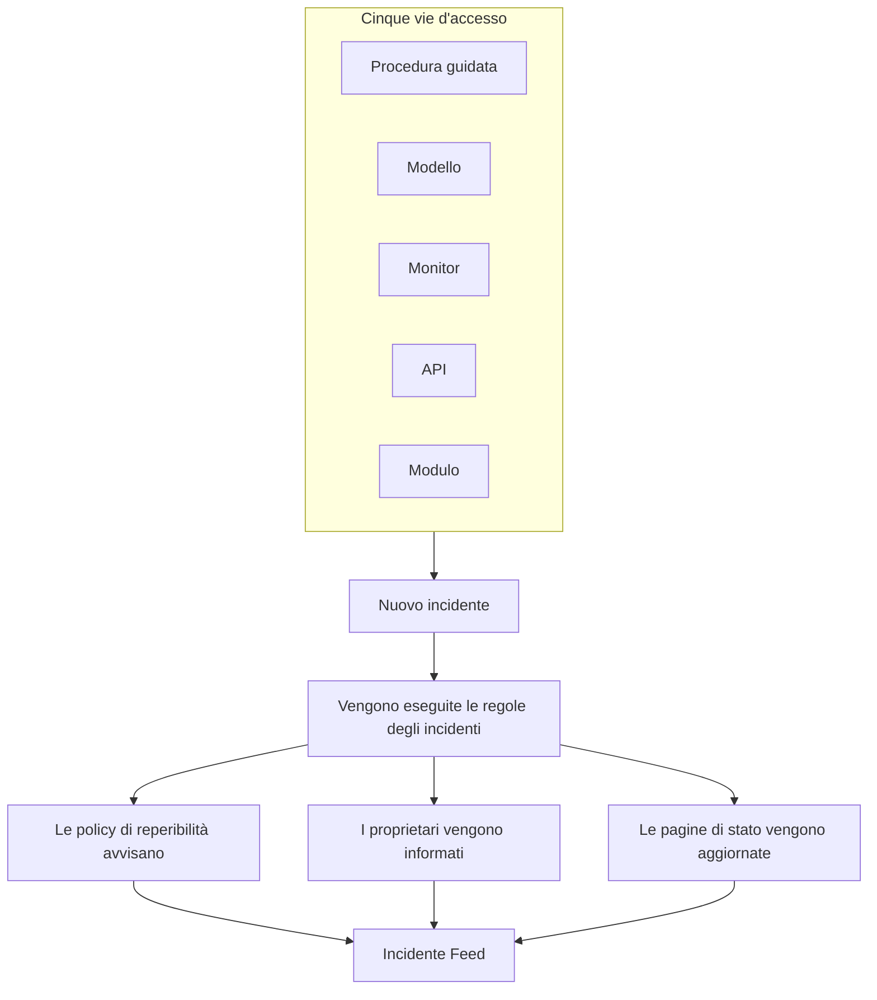
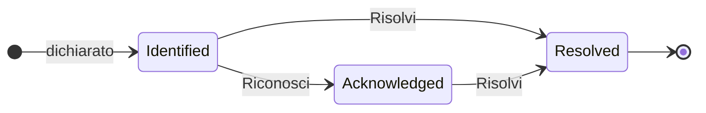

# Panoramica degli incidenti

Un incidente è il documento su cui lavora il vostro team quando qualcosa si rompe: che cosa è colpito, quanto è grave, a che punto è la risposta, a chi appartiene e tutto ciò che viene annotato strada facendo. Dichiararne uno avvisa la rotazione di reperibilità giusta, informa i suoi proprietari e — se lo volete — mostra il disservizio sulla vostra pagina di stato, così i clienti sanno che ci state lavorando.

:::cards
- [Dichiarare un incidente](/docs/incidents/declaring-incidents): A mano, da un modello, da un monitor, tramite l'API o con un modulo.
- [Stati e gravità degli incidenti](/docs/incidents/states-and-severities): Il ciclo di vita, e che cosa fanno il riconoscimento e la risoluzione.
- [Note, proprietari e feed degli incidenti](/docs/incidents/notes-owners-and-feed): Aggiornamenti per i clienti e per il vostro team, e chi ne viene informato.
- [Avvisi collegati](/docs/incidents/linked-alerts): Collegate gli avvisi sollevati da un disservizio all'incidente che li spiega.
- [Impostazioni e automazione degli incidenti](/docs/incidents/settings): Modelli, campi personalizzati, ruoli, misurazioni e regole.
:::

## In breve

- **Un prodotto a sé** — aprite **Incidenti** dal menu **Prodotti** nella barra superiore; l'elenco si trova in `/dashboard/{projectId}/incidents`.
- **Tre stati predefiniti** — **Identified**, **Riconosciuto** e **Risolto** vengono creati per ogni nuovo progetto. Potete aggiungere i vostri; i tre predefiniti si possono rinominare e ricolorare, ma mai eliminare.
- **Tre gravità predefinite** — **Critical Incident**, **Major Incident** e **Minor Incident**. Una gravità è un'etichetta con un colore e un ordine: non ha alcun comportamento proprio.
- **Cinque vie d'accesso** — la procedura guidata **Dichiara incidente**, **Crea da modello**, una regola dei criteri di un monitor, `POST /api/incident`, oppure un [modulo](/docs/forms/index) che chiunque abbia il link può compilare.
- **Numerati per progetto** — ogni incidente riceve un numero di incidente da un contatore del progetto, mostrato con il prefisso del vostro progetto: `INC-42` in un nuovo progetto, oppure `#42` senza prefisso.
- **Due tipi di note** — le note private (note interne) per il vostro team, le note pubbliche per gli iscritti alla pagina di stato.
- **Gli avvisi si collegano agli incidenti** — collegate gli avvisi che fanno parte di un incidente, oppure dichiarate un incidente direttamente dagli avvisi — da un elenco di avvisi o dalla pagina di un avviso — e riconosceteli nello stesso momento. Vedete [Avvisi collegati](/docs/incidents/linked-alerts).
- **Le impostazioni stanno sotto Incidenti, non sotto Impostazioni del progetto** — stati, gravità, modelli, campi personalizzati e motori di regole si trovano tutti in **Incidenti → Impostazioni** e **Incidenti → Regole**.

## Come funziona

Potete dichiarare un incidente a mano alle 3 del mattino, oppure lasciare che un monitor lo dichiari nel momento in cui i suoi criteri corrispondono. In entrambi i casi l'incidente è lo stesso oggetto, con lo stesso ciclo di vita e la stessa traccia scritta alla fine.

### 1. Viene dichiarato

Cinque strade portano allo stesso oggetto:

- **A mano** — dall'elenco degli incidenti, fate clic su **Dichiara incidente**. Si apre la procedura guidata **Dichiara nuovo incidente**, in tre passaggi: **Dettagli dell'incidente**, **Risorse interessate**, **Reperibilità e ruoli**. Il primo passaggio chiede un titolo, una gravità e una descrizione, e ciò che alla maggior parte degli incidenti non serve mai è ripiegato sotto **Altri campi**. Solo il primo passaggio chiede qualcosa a cui dovete rispondere: **Avanti** percorre il resto, e **Dichiara incidente** si trova nel riepilogo finale.
  - **Dagli avvisi** — **Dichiara incidente** su una selezione di avvisi, o nell'intestazione di un avviso, apre la stessa procedura guidata, precompilata a partire dagli avvisi, li collega al nuovo incidente e, a meno che non togliate la spunta alla casella, li riconosce perché smettano di inoltrarsi — vedete [Avvisi collegati](/docs/incidents/linked-alerts).
- **Da un modello** — fate clic su **Crea da modello** e scegliete un **Incidente Modello** salvato. I modelli precompilano titolo, descrizione, gravità, stato iniziale, risorse, policy di reperibilità, proprietari ed etichette.
- **Da un monitor** — una regola dei criteri di un monitor con l'opzione «dichiara un incidente» attivata crea l'incidente automaticamente nel momento in cui i suoi filtri corrispondono. Titoli e descrizioni lì supportano i modelli `{{variable}}`.
- **Tramite l'API** — `POST /api/incident` con una chiave API. Il server compila per voi `declaredAt`, lo stato di creazione e il numero dell'incidente.
- **Con un modulo** — qualcuno esterno al vostro team compila un modulo che avete condiviso come link, senza un account OneUptime. L'incidente viene dichiarato nascosto dalle pagine di stato, a partire dal modello di incidente del modulo, se ne ha uno. Vedete [Moduli](/docs/forms/index).

Anche le integrazioni aprono incidenti: [Huntress](/docs/integrations/huntress) trasforma ogni rapporto di incidente inviato dal suo SOC in un incidente, che avvisa le policy di reperibilità che scegliete voi. Vedete [Dichiarare un incidente](/docs/incidents/declaring-incidents) per la descrizione campo per campo.

### 2. Le persone giuste vengono informate

Alla creazione, OneUptime esegue l'automazione che avete configurato: regole di privacy, regole del proprietario, regole delle etichette, regole di reperibilità e regole di runbook. Tutte le policy di reperibilità collegate all'incidente — a mano, da un modello o aggiunte da una regola di reperibilità che corrisponde — vengono eseguite in parallelo.

I proprietari vengono avvisati sui canali che ciascuno ha attivato in **Impostazioni utente → Impostazioni notifiche**: e-mail, SMS, chiamata vocale, push, WhatsApp, Telegram, Slack, Microsoft Teams o webhook. Se un incidente non ha alcun proprietario, la notifica ripiega sui proprietari del progetto invece di andare persa.

Se l'incidente è visibile su una pagina di stato e le notifiche agli iscritti sono attive, vengono informati anche gli iscritti: quelli di ogni pagina di stato che elenca uno dei suoi monitor, oppure solo quelli delle pagine a cui lo avete limitato. Vedete [Una pagina di stato per pubblico](/docs/status-pages/one-status-page-per-audience) per dare a ogni pubblico la propria pagina di stato.

> [!NOTE]
> Le notifiche vengono inviate da un'attività pianificata che gira ogni minuto, quindi aspettatevi fino a circa un minuto di ritardo anziché un invio istantaneo.

### 3. Il vostro team ci lavora

I responder riconoscono l'incidente, collegano le risorse interessate, collegano gli avvisi che ne fanno parte, eseguono runbook, assegnano i ruoli dell'incidente e annotano ciò che scoprono — note private per il team, note pubbliche per i clienti, più le pagine **Causa principale** e **Rimedio** quando il quadro si fa più chiaro. Tutto ciò che fanno finisce nell'**Incidente Feed** della pagina **Panoramica**.

### 4. Viene risolto

Fare clic su **Risolvi** porta l'incidente nello stato risolto, ne lascia traccia nella cronologia degli stati, ferma il conteggio della durata, restituisce i monitor che trattiene e toglie l'incidente dalla sezione attiva di qualsiasi pagina di stato su cui era mostrato. Non serve cambiare nient'altro perché ciò accada: una pagina di stato mostra solo gli incidenti in uno stato che si trova sopra lo stato risolto. Vedete [Che cosa fa la risoluzione](/docs/incidents/states-and-severities#che-cosa-fa-la-risoluzione).

Dopodiché potete scrivere un post-mortem e, se volete, pubblicarlo sulla pagina di stato.

## Termini chiave

Una manciata di parole ricorre in tutte le altre pagine di questa sezione. Chiaritele per prime.

| Termine                     | Che cosa significa                                                                                                                                  |
| --------------------------- | --------------------------------------------------------------------------------------------------------------------------------------------------- |
| **Incidente**               | Il documento stesso — titolo, descrizione, gravità, stato attuale, risorse interessate e tutto ciò che vi si scrive durante la risposta.            |
| **Stato incidente**         | A che punto del suo ciclo di vita si trova l'incidente. Una riga del progetto con un nome, un colore e un `order`, più i flag che le danno significato. |
| **Gravità incidente**       | Quanto è grave. Una riga del progetto con un nome, un colore e un `order`. Pura classificazione: nulla nel prodotto tratta una gravità in modo speciale. |
| **Numero dell'incidente**   | Un contatore per progetto mostrato come `#42`, oppure, con un prefisso che configurate, come `INC-42`.                                              |
| **Risorse interessate**     | I monitor, gli host, i cluster Kubernetes, gli host Docker, i servizi e le altre infrastrutture che collegate all'incidente.                         |
| **Nota pubblica**           | Un aggiornamento scritto per chi legge la pagina di stato e per gli iscritti. Compare nella cronologia della pagina di stato.                         |
| **Nota privata**            | Una nota interna (il modello `IncidentInternalNote`) per il team che risponde. Non arriva mai a una pagina di stato.                                  |
| **Proprietario**            | Un utente o un team responsabile dell'incidente. I proprietari vengono avvisati alla creazione, quando vengono pubblicate note e quando cambia lo stato. |
| **Incidente Feed**          | La cronologia delle attività in sola aggiunta nella **Panoramica** dell'incidente, che registra cambi di stato, note, cambi di proprietari, esecuzioni di regole e notifiche. |
| **Cronologia stato**        | La registrazione di quale stato ha avuto l'incidente, quando e per quanto tempo — con lo stato della notifica agli iscritti per ogni transizione.     |
| **Avviso collegato**        | Un avviso collegato all'incidente come parte della sua risposta. Un avviso può essere collegato a più di un incidente, e mantiene il proprio stato.   |

## I tre stati che OneUptime crea per ogni progetto

Quando viene creato un progetto, OneUptime crea esattamente tre stati dell'incidente, in quest'ordine:

| Stato              | Ordine | Colore              | Che cosa significa                                                        |
| ------------------ | ------ | ------------------- | ------------------------------------------------------------------------- |
| **Identified**     | 1      | Rosso (`#fd625e`)   | Lo stato in cui finisce un incidente appena creato. È lo stato di creazione. |
| **Riconosciuto**   | 2      | Giallo (`#ffbf53`)  | Qualcuno ha preso in carico l'incidente e ci sta lavorando.              |
| **Risolto**        | 3      | Verde (`#2ab57d`)   | L'incidente è finito. È la risoluzione a toglierlo dalla vostra pagina di stato. |

I nomi sono solo etichette: ciò che governa davvero il comportamento sono tre booleani sulla riga dello stato: `isCreatedState`, `isAcknowledgedState` e `isResolvedState`. Ci si aspetta che un solo stato per progetto abbia ciascun flag.

Questa distinzione conta più di quanto sembri:

- `isCreatedState` decide dove inizia un nuovo incidente. Se alla creazione non viene scelto esplicitamente alcuno stato, OneUptime cerca lo stato di creazione del progetto e usa quello.
- `isAcknowledgedState` e `isResolvedState` contrassegnano lo stato riconosciuto e lo stato risolto. La posizione dello stato di un incidente rispetto a loro governa i pulsanti **Riconosci** e **Risolvi** nell'intestazione dell'incidente, i due riquadri statistici della **Panoramica** dell'incidente e il contatore **Incidenti attivi** nel menu laterale: un incidente nello stato riconosciuto o in uno stato successivo è riconosciuto, e uno nello stato risolto o in uno stato successivo è risolto.
- **Incidenti attivi** è definito unicamente come «lo stato attuale si trova sopra lo stato risolto». Uno stato personalizzato che aggiungete sopra lo stato risolto è quindi attivo; uno che mettete dopo conta come risolto, come lo stato risolto stesso.

> [!NOTE]
> Il primo stato predefinito si chiama **Identified**, anche se diverse descrizioni nel prodotto lo chiamano ancora stato di creazione («created»). Se cercate «Created» nell'elenco degli stati del vostro progetto, è la riga chiamata **Identified**.

Potete aggiungere i vostri stati in **Incidenti → Impostazioni → Stato incidente**. Un nuovo stato viene aggiunto appena sopra lo stato risolto, e riordinate le righe trascinandole; la colonna **Conta come** mostra come conta un incidente in ciascuno stato — non riconosciuto, riconosciuto o risolto. I tre stati contrassegnati portano l'etichetta **Integrato**: mantengono il loro ordine e non possono essere eliminati, ma potete rinominarli, ricolorarli e spostarli, ed è per questo che l'interfaccia legge i nomi degli stati in modo dinamico.

L'ordine viene applicato, non è estetico: un incidente non può passare a uno stato che viene prima del suo stato attuale nell'ordine. Tutti i dettagli si trovano in [Stati e gravità degli incidenti](/docs/incidents/states-and-severities).

## Le tre gravità che OneUptime crea per ogni progetto

Ogni nuovo progetto riceve anche tre gravità:

| Gravità               | Ordine | Colore                | Che cosa significa                                         |
| --------------------- | ------ | --------------------- | ---------------------------------------------------------- |
| **Critical Incident** | 1      | Bordeaux (`#b70400`)  | Impatto molto alto sui clienti, che richiede una risposta immediata. |
| **Major Incident**    | 2      | Rosso (`#fd625e`)     | Impatto significativo, che di solito richiede una risposta immediata. |
| **Minor Incident**    | 3      | Giallo (`#ffbf53`)    | Impatto basso, di solito gestito in orario di lavoro.      |

Le gravità hanno `name`, `description`, `color` e `order`, e nient'altro. Non ci sono flag, e nessun percorso del codice tratta «Critical Incident» diversamente da qualsiasi altra riga. La gravità è il modo in cui le persone fanno il triage, ed è disponibile come criterio di corrispondenza quando scrivete regole di reperibilità — ma scegliere una gravità non avvisa, da sola, nessuno.

Modificate o aggiungete gravità in **Incidenti → Impostazioni → Gravità incidente**. Le descrizioni predefinite complete si trovano in [Stati e gravità degli incidenti](/docs/incidents/states-and-severities).

## Dove si trovano gli incidenti nella dashboard

Aprite **Incidenti** dal menu **Prodotti** nella barra superiore. Il suo menu laterale è organizzato in sezioni:

| Sezione              | Che cosa ci fate                                                                                                                                                           |
| -------------------- | -------------------------------------------------------------------------------------------------------------------------------------------------------------------------- |
| **Panoramica**       | **Tutti gli incidenti** e **Incidenti attivi** — quest'ultimo porta un badge rosso con il numero di incidenti in uno stato sopra lo stato risolto.                          |
| **Episodi**          | Gli episodi degli incidenti, una funzione di raggruppamento separata con le proprie pagine.                                                                                |
| **IA**               | **Informazioni**, **Registri**, **Impostazioni**: che cosa OneUptime AI ha imparato dai vostri incidenti e tutto ciò che ha fatto per loro, e che cosa può fare da sola — con le regole su quali incidenti esamina e corregge. Vedete [AI SRE](/docs/ai/ai-sre). |
| **Area di lavoro**   | Gli spazi di chat che questo progetto ha collegato: **Slack**, **Microsoft Teams** o entrambi, ciascuno con le sue regole di notifica per gli incidenti. Se nessuno è collegato, contiene **Collega Slack o Teams**, una pagina che mostra entrambi e come collegarli. |
| **Integrazioni**     | Strumenti che aprono incidenti da soli: **Huntress**, i cui rapporti di incidente diventano incidenti che avvisano la reperibilità. Vedete [Huntress](/docs/integrations/huntress). |
| **Regole**           | I motori di regole: **Regole di raggruppamento**, **Regole di reperibilità**, **Regole del proprietario**, **Regole di runbook**, **Regole di privacy**, **Regole etichette**, **Regole SLA**, **Reminder Rules**. |
| **Impostazioni**     | **Stato incidente**, **Gravità incidente**, **Modelli di incidenti**, **Modelli di note**, **Modelli post-mortem**, **Campi personalizzati**, **Ruoli incidente**, **Misurazioni**, **Avvisi collegati**, **Prefisso del numero**. |

**Panoramica** ed **Episodi** sono aperte; **IA**, **Area di lavoro**, **Integrazioni**, **Regole**, **Impostazioni** e **Sviluppatori** sono ripiegate per impostazione predefinita, così il menu si apre sugli elenchi che usate ogni giorno. Fate clic sul titolo di una sezione per espanderla e trovare le pagine a cui fa riferimento il resto di questa documentazione; una sezione si apre anche da sola ogni volta che siete su una delle sue pagine. La configurazione degli incidenti non si trova nelle impostazioni del progetto; vive tutta qui.

L'elenco degli incidenti mostra **Numero dell'incidente**, **Titolo**, **Stato**, **Gravità**, **Risorse interessate**, **Dichiarato**, **Durata**, **Etichette** e **Proprietari**, con un'azione di massa **Cambia stato** per chiuderne diversi in una volta.

## Che cosa mostra ogni pagina di un incidente

Aprite un incidente e il suo menu laterale ne raggruppa le pagine così:

| Sezione del menu laterale | Pagine                                                                                    |
| ------------------------- | ----------------------------------------------------------------------------------------- |
| **Panoramica**            | **Panoramica**, **Cronologia stato**, **SLA**                                             |
| **Indagine**              | **Descrizione**, **Causa principale**, **Rimedio**, **Runbook**, **Post-mortem**, **Avvisi collegati** |
| **Team**                  | **Ruoli**, **Esecuzioni di reperibilità**, **Proprietari**                                |
| **Notifiche**             | **Registri di notifica**, **Registri IA** — ripiegata finché non fate clic su **Notifiche** |
| **Note**                  | **Note private**, **Note pubbliche**                                                      |
| **Sviluppatori**          | **Terraform**, **API**, **Assistenti IA** — ripiegata finché non fate clic su **Sviluppatori** |
| **Avanzato**              | **Campi personalizzati**, **Impostazioni**, **Registri di audit**, **Elimina incidente** — ripiegata finché non fate clic su **Avanzato** |

Che cosa contiene ciascuna:

- **Panoramica** — la risposta a colpo d'occhio. Sotto l'intestazione, i riquadri statistici mostrano il tempo di riconoscimento, il tempo di risoluzione e la **Durata** totale. La scheda **AI Investigation** apre la pagina — che cosa ha trovato OneUptime AI, o perché non è partita — con l'**Incidente Feed** sotto. Accanto si trovano la scheda **Video Call**, la scheda **Dettagli dell'incidente** (titolo, gravità, etichette, numero dell'incidente, dichiarato il, dichiarato da, policy di reperibilità e l'ID dell'incidente su una piccola riga **ID** in fondo, a un clic dai vostri appunti), **Ruoli incidente**, una scheda **Risorse interessate** e i campi personalizzati dell'incidente. Quando il vostro progetto ha delle [misurazioni](/docs/incidents/settings#misurazioni), una scheda **Misurazioni** sotto **Dettagli dell'incidente** indica che cosa mostra ciascuna per questo incidente: **12 minuti**, **In corso da 5 minuti**, **Non raggiunto**.
- **Cronologia stato** — ogni stato in cui è stato l'incidente, con **Inizia il**, **Termina il**, **Durata** e lo stato della notifica agli iscritti per ogni transizione. **Visualizza causa** e **Visualizza log** spiegano perché è avvenuto ogni cambiamento.
- **SLA** — il monitoraggio dello SLA per questo incidente.
- **Descrizione**, **Causa principale**, **Rimedio** — tre pagine in Markdown. La descrizione è quella che compare sulla vostra pagina di stato.
- **Runbook** — le esecuzioni di runbook collegate a questo incidente.
- **Post-mortem** — il resoconto e i suoi allegati, che potete pubblicare facoltativamente sulla pagina di stato. **Modifica nota post mortem** chiede la nota e gli allegati, poi **Pubblica nella pagina di stato**; solo finché questa opzione è attiva chiede **Notifica agli iscritti** e **Postmortem pubblicato il**, che l'attivazione della pubblicazione imposta su adesso. **Generate with AI** stende la nota per voi, e **Applica modello** — mostrato non appena il progetto ha un modello di post-mortem — la fa partire da un modello. Gli iscritti vengono informati una volta, quando il post-mortem viene pubblicato: la prima volta che la pagina di stato lo mostra, il che richiede **Pubblica nella pagina di stato** attivo e una nota scritta. Salvarlo di nuovo, o modificarlo mentre è pubblicato, aggiorna la pagina di stato senza informare nessuno; ripubblicarlo dopo averlo tolto dalla pagina di stato li informa di nuovo. Uno pubblicato mentre l'incidente è nascosto viene inviato quando l'incidente diventa visibile. Vedete [Il post-mortem](/docs/status-pages/subscribers#incidenti).
- **Avvisi collegati** — gli avvisi collegati a questo incidente, con lo stato attuale di ciascun avviso, e chi l'ha collegato e quando. Gli avvisi hanno una pagina **Incidenti collegati** corrispondente. Vedete [Avvisi collegati](/docs/incidents/linked-alerts).
- **Ruoli**, **Esecuzioni di reperibilità**, **Proprietari** — chi ci sta lavorando, quali policy sono scattate e chi viene avvisato.
- **Registri di notifica**, **Registri IA**, **Registri di audit** — che cosa è stato inviato e che cosa è cambiato.
- **Note private** e **Note pubbliche** — che cosa è stato detto al vostro team e ai vostri clienti. Vedete [Note, proprietari e feed degli incidenti](/docs/incidents/notes-owners-and-feed).
- **Campi personalizzati**, **Impostazioni**, **Elimina incidente** — la pagina **Impostazioni** contiene **Visibile sulla pagina di stato** e **Incidente privato**, la scheda **Ambito delle pagine di stato** che limita l'incidente ad alcune pagine di stato, e la scheda **Reminders**, il cui interruttore **Invia promemoria** si salva non appena lo cambiate e mostra quando parte il prossimo promemoria.

## Come si inseriscono gli incidenti nel resto di OneUptime

- **I monitor individuano il problema; gli incidenti lo registrano.** Una regola dei criteri di un monitor può dichiarare un incidente automaticamente, precompilando titolo, gravità, policy di reperibilità, proprietari, etichette e note di rimedio. Vedete [Modelli di incidenti e avvisi](/docs/monitor/incident-alert-templating) per le variabili disponibili.
- **Gli avvisi sono i segnali; gli incidenti sono la risposta.** Collegate a un incidente gli avvisi che spiega, da entrambi i lati, e due interruttori del progetto, attivi nei nuovi progetti, riconoscono e risolvono quegli avvisi insieme all'incidente. Vedete [Avvisi collegati](/docs/incidents/linked-alerts).
- **Le policy di reperibilità si occupano degli avvisi.** Collegate le policy nel passaggio **Reperibilità e ruoli** della procedura guidata di dichiarazione, su un modello, oppure tramite **Incidenti → Regole → Regole di reperibilità**. Scatta ogni regola che corrisponde: l'insieme eseguito è l'unione di tutte le corrispondenze più tutto ciò che è collegato direttamente, senza duplicati.
- **I runbook dicono alle persone che cosa fare.** Le regole di runbook collegano automaticamente una procedura quando viene creato un incidente che corrisponde, e i responder possono avviarne uno a mano dall'incidente. Vedete [Panoramica dei Runbook](/docs/runbooks/index).
- **Le pagine di stato informano i clienti.** Un incidente compare nell'elenco attivo di una pagina di stato quando la pagina elenca uno dei suoi monitor, la pagina ha gli incidenti attivi, l'incidente è contrassegnato come visibile sulla pagina di stato e il suo stato attuale si trova sopra lo stato risolto. Un incidente limitato ad alcune pagine di stato compare solo su quelle. Gli incidenti privati sono nascosti da ogni pagina di stato, sempre. Vedete [Panoramica delle pagine di stato](/docs/status-pages/index) e [Una pagina di stato per pubblico](/docs/status-pages/one-status-page-per-audience).
- **I workflow automatizzano tutto intorno.** I trigger **On Create Incident**, **On Update Incident** e **On Delete Incident** vi permettono di costruire automazioni senza codice sul ciclo di vita dell'incidente. Vedete [Panoramica dei workflow](/docs/workflows/index).

## Passaggi successivi

:::cards
- [Dichiarare un incidente](/docs/incidents/declaring-incidents): Percorrete la procedura guidata campo per campo, oppure dichiarate da un modello, da un monitor o dall'API.
- [Stati e gravità degli incidenti](/docs/incidents/states-and-severities): Aggiungete i vostri stati e vedete esattamente che cosa fa ciascuno.
- [Panoramica delle pagine di stato](/docs/status-pages/index): Come gli incidenti raggiungono i vostri clienti.
- [Iscritti e annunci](/docs/status-pages/subscribers): Chi viene avvisato quando un incidente avanza.
:::
