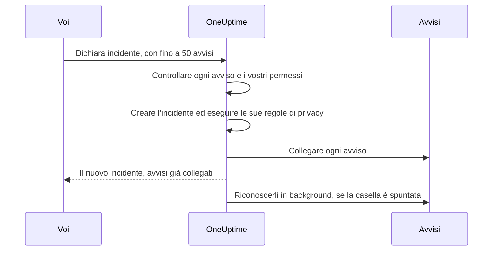

# Avvisi collegati

Un disservizio raramente solleva un solo avviso. Quando il database principale cade, scatta il monitor del ritardo di replica, scatta il monitor del tasso di errori dell'API, e lo SLO della latenza del checkout inizia a consumare il suo budget — tre avvisi, un problema. Collegare quegli avvisi all'incidente lo dice: l'incidente è il luogo in cui avviene la risposta, e ogni avviso mostra quale incidente lo spiega.

Un collegamento è solo un collegamento. L'avviso mantiene il proprio stato, i propri proprietari, le proprie policy di reperibilità, le proprie note e il proprio feed; l'incidente mantiene i suoi. Collegare non unisce e non copia nulla, e da solo non riconosce, non risolve e non mette mai a tacere un avviso. (Dichiarare un nuovo incidente dagli avvisi è diverso: il nuovo incidente viene precompilato da essi, come [descritto più sotto](#dichiarare-un-incidente-dagli-avvisi), e a meno che non togliate la spunta alla casella del modulo, gli avvisi vengono riconosciuti mentre lo dichiarate, il che ne ferma l'inoltro — vedete [Riconoscere gli avvisi mentre dichiarate](#riconoscere-gli-avvisi-mentre-dichiarate).) Due interruttori del progetto, attivi nei nuovi progetti, fanno seguire agli avvisi collegati l'incidente quando viene riconosciuto e risolto — vedete [più avanti](#mantenere-gli-stati-degli-avvisi-allineati-con-lincidente).

:::cards
- [Collegare avvisi a un incidente](#collegare-avvisi-da-un-incidente): Dall'incidente, da un avviso, o molti in una volta.
- [Dichiarare un incidente dagli avvisi](#dichiarare-un-incidente-dagli-avvisi): Un nuovo incidente, precompilato e collegato in un colpo solo.
- [Mantenere allineati gli stati degli avvisi](#mantenere-gli-stati-degli-avvisi-allineati-con-lincidente): Riconoscere e risolvere gli avvisi insieme all'incidente.
- [Permessi](#permessi): Chi può collegare, e che cosa gli consente di fare il collegamento.
:::

> [!TIP]
> Se arrivate da Opsgenie, questa è la versione di OneUptime dell'associazione degli avvisi a un incidente.

## In breve

- **Molti a molti** — un incidente può avere un numero qualsiasi di avvisi collegati, e un avviso può essere collegato a più incidenti.
- **Tre posti dove collegare** — la pagina **Avvisi collegati** dell'incidente, la pagina **Incidenti collegati** dell'avviso, e l'azione di massa **Collega a incidente** negli elenchi principali degli avvisi, per un massimo di **50** avvisi alla volta.
- **Dichiarare un incidente dagli avvisi** — **Dichiara incidente** in un elenco di avvisi, nell'intestazione di un avviso o nella sua pagina **Incidenti collegati** precompila un nuovo incidente dagli avvisi e li collega mentre viene creato. Una casella del modulo, spuntata per impostazione predefinita, li riconosce anche, il che ferma il loro inoltro di reperibilità.
- **Registrato da entrambi i lati** — ogni collegamento e scollegamento scrive una voce di feed sull'incidente e sull'avviso, tranne che un incidente dichiarato dagli avvisi riceve un'unica voce che li elenca tutti. Solo le voci dell'incidente vengono pubblicate in Slack e Microsoft Teams, e il titolo di un avviso o di un incidente privato non viene mai scritto sull'altro lato.
- **Gli stati degli avvisi seguono l'incidente** — due interruttori del progetto, entrambi attivi nei nuovi progetti, riconoscono e risolvono gli avvisi collegati quando l'incidente viene riconosciuto e risolto. Disattivate l'uno o l'altro in **Incidenti → Impostazioni → Avvisi collegati**.
- **Automatizzabile** — i collegamenti sono una normale risorsa API, `/api/incident-alert`.

## Come funziona

Gli avvisi sono segnali: i criteri di un monitor hanno corrisposto, uno SLO ha iniziato a consumare il suo budget, una regola di sicurezza è scattata. Un incidente è la risposta coordinata a un problema (vedete [Panoramica degli incidenti](/docs/incidents/index)). La maggior parte dei problemi produce diversi segnali, e senza collegamenti l'unica cosa che li lega alla risposta è la memoria di qualcuno.

```mermaid title="Tre avvisi, un incidente, e gli interruttori che li muovono"
flowchart TB
    subgraph signals["Avvisi"]
        direction LR
        lag["Ritardo di replica"]
        errors["Tasso di errori dell'API"]
        latency["Latenza del checkout"]
    end
    signals -->|"collegati a"| incident["Incidente"]
    incident -->|"riconosciuto"| ack["Avvisi collegati riconosciuti"]
    incident -->|"risolto"| res["Avvisi collegati risolti"]
```

Con gli avvisi collegati:

- I responder sull'incidente vedono, in un unico elenco, quali avvisi ne fanno parte e in che stato si trova ciascuno.
- Chi apre uno di quegli avvisi vede che è già gestito, e sotto quale incidente, invece di dichiarare un secondo incidente per lo stesso disservizio.
- Il feed dell'incidente registra quando ogni avviso è stato collegato e da chi, così la cronologia mostra come si è composto il quadro.
- Con gli interruttori attivi, riconoscere l'incidente ferma gli inoltri di reperibilità degli avvisi, così chi lavora sull'incidente non viene avvisato di nuovo dai suoi sintomi.

## Come funzionano i collegamenti

Un collegamento unisce un avviso a un incidente. I collegamenti valgono in entrambe le direzioni — lo stesso collegamento compare nella pagina **Avvisi collegati** dell'incidente e nella pagina **Incidenti collegati** dell'avviso.

- **Un avviso può essere collegato a più incidenti.** Il guasto di una dipendenza condivisa può essere il sintomo di due incidenti distinti. Ogni incidente elenca l'avviso, e l'avviso elenca entrambi gli incidenti.
- **Ogni coppia viene collegata una volta.** Collegare un avviso a un incidente a cui è già collegato viene rifiutato con «This alert is already linked to this incident.» — anche quando due persone collegano la stessa coppia nello stesso momento.
- **I collegamenti si creano o si rimuovono, non si modificano mai.** Un collegamento non ha campi propri oltre al suo incidente, al suo avviso, a quando è stato fatto e a chi l'ha fatto. Per spostare un avviso su un altro incidente, collegatelo al nuovo e scollegatelo dal vecchio.
- **I collegamenti restano dentro un progetto.** L'avviso e l'incidente devono appartenere allo stesso progetto.

## Collegare avvisi da un incidente

:::steps
### Aprire la pagina Avvisi collegati dell'incidente

Aprite l'incidente e scegliete **Avvisi collegati** nella sezione **Indagine** del suo menu laterale. La tabella elenca ogni avviso già collegato.

### Scegliere l'avviso

Fate clic su **Collega avviso** e sceglietelo dal menu a tendina **Avviso**. Il menu a tendina elenca prima gli avvisi più recenti, ciascuno con il suo numero — come `ALT-63: Checkout API is offline` — così si possono distinguere gli avvisi con lo stesso titolo, come gli avvisi ripetuti di un monitor. Per trovare un avviso più vecchio, digitate: il menu a tendina cerca in tutti gli avvisi per titolo.

### Salvare il collegamento

Fate clic su **Collega avviso** nella finestra. L'avviso compare nella tabella, ed entrambi i feed registrano il collegamento. Se il collegamento viene rifiutato, ad esempio perché l'avviso è già collegato, la finestra resta aperta e dice perché.
:::

| Colonna            | Che cosa mostra                                  |
| ------------------ | ------------------------------------------------ |
| **Avviso n.**      | Il numero dell'avviso, come `#17` o `ALT-17`.    |
| **Titolo**         | Il titolo dell'avviso, con un link all'avviso.   |
| **Stato attuale**  | Lo stato proprio dell'avviso, come **Riconosciuto**. |
| **Collegato il**   | Quando l'avviso è stato collegato.               |
| **Collegato da**   | Chi l'ha collegato.                              |

Ogni riga ha **Visualizza avviso** per aprire l'avviso e **Scollega** per rimuovere il collegamento.

## Collegare incidenti da un avviso

Il lato dell'avviso rispecchia quello dell'incidente. Aprite un avviso e scegliete **Incidenti collegati** nella sezione **Base** del suo menu laterale. La tabella elenca ogni incidente a cui l'avviso è collegato, con il numero, il titolo e lo stato attuale dell'incidente, e quando e da chi è stato collegato.

- **Collega incidente** collega questo avviso a un incidente esistente. Il suo menu a tendina funziona come quello sul lato dell'incidente: prima gli incidenti più recenti, ciascuno con il suo numero — come `INC-42: Checkout is down` — e digitare cerca in tutti gli incidenti per titolo.
- **Visualizza incidente** apre un incidente collegato.
- **Scollega** rimuove un collegamento.
- **Dichiara incidente** avvia un nuovo incidente da questo avviso. Lo stesso pulsante si trova nell'intestazione dell'avviso, accanto a **Riconosci** e **Risolvi**. Vedete [Dichiarare un incidente dagli avvisi](#dichiarare-un-incidente-dagli-avvisi).

## Collegare molti avvisi in una volta

Gli elenchi principali degli avvisi hanno due azioni di massa per questo: **Tutti gli avvisi** e **Avvisi attivi**, gli avvisi attivi della home page, e la pagina **Avvisi** di un monitor, di un servizio, di un host, di un cluster Kubernetes, di uno SLO o di qualsiasi altra risorsa che ne abbia una. L'elenco **Avvisi dei membri** di un episodio di avvisi non le ha — selezionate invece gli avvisi in uno degli elenchi principali. Selezionate gli avvisi, poi scegliete:

- **Collega a incidente** — scegliete l'incidente nel menu a tendina **Incidente** e fate clic su **Collega avvisi**. Gli incidenti più recenti sono elencati per primi, con i loro numeri, e digitare cerca in tutti gli incidenti per titolo. OneUptime collega ogni avviso selezionato, mostrando l'avanzamento man mano. Un avviso già collegato a quell'incidente conta come fatto anziché come non riuscito, quindi eseguire l'azione due volte non fa danni.
- **Dichiara incidente** — apre il modulo di dichiarazione per un nuovo incidente precompilato dagli avvisi selezionati. Vedete la sezione successiva.

Entrambe le azioni accettano fino a **50** avvisi alla volta. Selezionatene di più e vengono disattivate, con un tooltip che dice perché. Il limite esiste perché ogni collegamento scrive in entrambi i feed, e ogni collegamento fatto con **Collega a incidente** viene anche pubblicato nei canali Slack e Microsoft Teams dell'incidente — una selezione di mille avvisi li inonderebbe.

## Dichiarare un incidente dagli avvisi

Quando una raffica di avvisi si rivela un incidente che nessuno ha ancora dichiarato, dichiaratelo dagli avvisi. Ci sono tre modi per farlo:

- Selezionate gli avvisi in uno degli elenchi principali degli avvisi e scegliete **Dichiara incidente**.
- Aprite un avviso e fate clic su **Dichiara incidente** nella sua intestazione, accanto a **Riconosci** e **Risolvi**. Resta lì anche quando l'avviso è riconosciuto o risolto, così potete ancora dichiarare un incidente per un avviso a posteriori — per farne il post-mortem, ad esempio.
- Aprite la pagina **Incidenti collegati** di un avviso e fate clic su **Dichiara incidente**.

Tutti e tre richiedono il permesso di creare incidenti e di collegarvi avvisi. Senza di esso, il pulsante è bloccato, e il suo tooltip nomina il permesso mancante.

In qualunque modo lo facciate, arrivate al consueto modulo **Dichiara nuovo incidente**, con gli avvisi elencati come quelli che verranno collegati e questi campi precompilati:

| Campo                      | Precompilato con                                                                                                                                                                                                                                                                       |
| -------------------------- | -------------------------------------------------------------------------------------------------------------------------------------------------------------------------------------------------------------------------------------------------------------------------------------- |
| **Titolo**                 | Un avviso: il suo titolo. Più avvisi: il titolo dell'avviso più grave.                                                                                                                                                                                                                 |
| **Descrizione**            | Un avviso: la sua descrizione. Più avvisi: un elenco con una riga per avviso, con il suo numero e il suo titolo.                                                                                                                                                                        |
| **Gravità incidente**      | La gravità dell'avviso più grave, tradotta in una gravità dell'incidente. Vince una gravità dell'incidente con lo stesso nome, senza distinzione tra maiuscole e minuscole. Altrimenti OneUptime prende la gravità dell'incidente nella stessa posizione dell'ordine delle gravità, o l'ultima se avete meno gravità dell'incidente. |
| **Risorse interessate**    | Tutti i monitor, gli host, i cluster Kubernetes, gli host Docker, gli host Podman e i servizi degli avvisi selezionati, riuniti. I monitor vanno sotto **Monitor**, il resto sotto **Altre risorse interessate**. Le altre risorse, come gli SLO o i cluster VMware, Proxmox e Ceph, non vengono copiate — aggiungetele voi se l'incidente le riguarda. |
| **Etichette**              | Ogni etichetta di ogni avviso selezionato.                                                                                                                                                                                                                                             |
| **Incidente privato**      | Attivo se uno qualsiasi degli avvisi è privato. Il modulo lo dice, e i proprietari degli avvisi diventano proprietari dell'incidente — vedete più sotto.                                                                                                                               |

«Più grave» segue l'ordine delle vostre gravità degli avvisi: la prima gravità di avviso dell'elenco è la più grave. Con le gravità con cui parte ogni progetto, un avviso **High** diventa un **Critical Incident** e un avviso **Low** un **Major Incident**.

Tutto è modificabile prima dell'invio. **Etichette** e **Incidente privato** si trovano sotto **Altri campi** nel primo passaggio del modulo, la cui intestazione ripiegata mostra ciascuno dei due finché è impostato.

**Un avviso che ha già un incidente viene segnalato.** Con **Dichiara incidente** sulla pagina di ogni avviso, due responder avvisati dallo stesso disservizio potrebbero dichiararlo ciascuno per conto proprio. Per questo il riquadro che elenca gli avvisi contrassegna ogni avviso già collegato a un incidente — «(already linked to Incident INC-42)», con un link a quell'incidente — e aggiunge una nota, formulata in base a quanti avvisi sono collegati:

- Tutti gli avvisi, ed è uno solo: «This alert is already linked to an incident. If it is the same problem, update that incident instead of declaring another one.»
- Tutti gli avvisi, e sono diversi: «These alerts are already linked to incidents. If it is the same problem, update that incident instead of declaring another one.»
- Solo alcuni: «Some of these alerts are already linked to an incident. If it is the same problem, link the other alerts to that incident from the alerts list instead of declaring another one.»

I link agli incidenti si aprono in una nuova scheda, così potete controllare l'incidente esistente senza perdere ciò che avete compilato nel modulo. La nota è un promemoria, non un blocco, e vengono nominati solo gli incidenti che avete il permesso di vedere.

**Le policy di reperibilità non vengono copiate.** Gli avvisi hanno eseguito le proprie policy di reperibilità quando sono stati creati, quindi copiarle sull'incidente avviserebbe le stesse persone una seconda volta. Le policy di reperibilità dell'incidente sono quelle che scegliete nel passaggio **Reperibilità e ruoli** più quelle aggiunte dalle vostre regole di reperibilità degli incidenti — esattamente come per qualsiasi altro incidente.

**I monitor degli avvisi vengono precompilati come monitor interessati.** Come per qualsiasi incidente dichiarato a mano, il monitoraggio attivo dei monitor dell'incidente si sospende finché l'incidente non viene risolto. Togliete un monitor da **Monitor** nel passaggio **Risorse interessate** prima dell'invio se deve continuare a essere controllato.

**Un avviso privato produce un incidente privato.** Se uno qualsiasi degli avvisi è privato, **Incidente privato** parte attivo, e il riquadro che elenca gli avvisi lo dice. Un incidente privato è visibile solo ai suoi proprietari, ai Project Owners e ai Project Admins, quindi OneUptime si assicura che chi poteva vedere gli avvisi possa vedere l'incidente: una volta dichiarato, i proprietari di ogni avviso dichiarato — utenti e team allo stesso modo — vengono aggiunti come proprietari dell'incidente, senza essere avvisati. Vengono aggiunti subito dopo la creazione dei canali Slack e Microsoft Teams dell'incidente, così vengono invitati in quei canali come qualsiasi altro proprietario. Anche voi siete proprietari, come per ogni incidente che dichiarate. Lo stesso accade quando una regola di privacy degli incidenti rende privato il nuovo incidente. Se disattivate **Incidente privato** prima dell'invio e non si applica alcuna regola di privacy, l'incidente non è privato e non viene copiato alcun proprietario.



Quando inviate, il server controlla gli avvisi prima di creare qualsiasi cosa: al massimo 50, ciascuno un avviso di questo progetto che avete il permesso di vedere, e dovete avere il permesso di collegare avvisi agli incidenti. Se un controllo fallisce, la richiesta viene rifiutata e non viene creato alcun incidente — così un id di avviso sbagliato non consuma mai un numero di incidente. Una volta che l'incidente esiste — e una volta eseguite le sue regole di privacy, così i collegamenti sanno se è privato — ogni avviso viene collegato prima che la richiesta risponda, così la pagina **Avvisi collegati** dell'incidente li elenca già. Se un singolo collegamento fallisce — ad esempio perché l'avviso è stato eliminato un attimo prima — l'incidente viene comunque dichiarato e gli altri avvisi vengono comunque collegati.

Il feed dell'incidente riceve un'unica voce **Avviso collegato** che elenca gli avvisi, scritta dopo **Incidente creato**, invece di una per avviso — vedete [Il feed, Slack e Microsoft Teams](#il-feed-slack-e-microsoft-teams).

### Riconoscere gli avvisi mentre dichiarate

Dichiarare un incidente non ferma, da solo, gli avvisi dei suoi avvisi: l'inoltro di reperibilità di un avviso si ferma solo quando viene riconosciuto l'avviso stesso. Così, quando uno qualsiasi degli avvisi non è ancora riconosciuto, il riquadro del modulo ha una casella di controllo, spuntata per impostazione predefinita — **Acknowledge this alert to stop its escalation** per un avviso, **Acknowledge these 3 alerts to stop their escalation** per più avvisi. Se alcuni sono già riconosciuti, nomina solo gli altri e dice che il resto viene lasciato com'è.

Lasciatela spuntata e, una volta dichiarato l'incidente e collegati gli avvisi:

- **Gli avvisi vengono riconosciuti a vostro nome.** Ciascuno passa al vostro stato di avviso **Riconosciuto** come se aveste fatto clic voi stessi su **Riconosci**: la **Cronologia stato** e il feed dell'avviso vi nominano, i proprietari dell'avviso vengono avvisati, e il cambiamento viene pubblicato nei canali Slack e Microsoft Teams dell'avviso come qualsiasi altro cambio di stato di un avviso. La causa dice «Acknowledged because Incident INC-42 was declared from this alert.» — oppure, per un incidente privato, «Acknowledged because a private incident was declared from this alert.», così un incidente privato non viene mai nominato dove il pubblico dell'avviso può leggerlo.
- **Il loro inoltro di reperibilità si ferma entro circa un minuto.** Il passaggio di inoltro successivo vede un avviso riconosciuto e si ferma. Gli avvisi già partiti non vengono richiamati.
- **I promemoria si fermano solo se la regola dei promemoria lo prevede.** I promemoria di un avviso si fermano al riconoscimento solo quando la sua regola dei promemoria ha **Stop Reminders When** impostato su **Riconosciuto**; altrimenti continuano finché l'avviso non viene risolto.
- **Un episodio di avvisi continua a inoltrarsi.** Se un avviso appartiene a un episodio che avvisa tramite la propria policy di reperibilità, l'episodio continua a inoltrarsi finché non viene riconosciuto l'episodio stesso.
- **Gli avvisi già riconosciuti o risolti vengono lasciati in pace.** Come ovunque, gli stati vengono confrontati in base al loro ordine, quindi un avviso in uno stato personalizzato dopo **Riconosciuto** conta come riconosciuto, e nulla viene mai spostato all'indietro.

Togliete la spunta alla casella per dichiarare senza riconoscere. Ogni volta che degli avvisi resteranno non riconosciuti — la casella è senza spunta o bloccata — il modulo lo dice: «Declaring the incident does not acknowledge the alert: it keeps escalating until it is acknowledged.» E se riconoscete gli avvisi senza scegliere una policy di reperibilità per l'incidente, il riepilogo del passaggio **Reperibilità e ruoli** lo fa notare: «The alerts it is declared from are acknowledged too, so their own escalation stops. An alert episode they belong to keeps escalating until the episode is acknowledged, and an incident on-call rule, if any, may still page.»

**Vi serve il permesso di riconoscere gli avvisi.** Riconoscerli mentre dichiarate richiede **Create Alert State Timeline** e **Edit Alert** (riconoscere un avviso sulla sua pagina richiede solo il primo: vedete [Cambiare uno stato](/docs/permissions/index#cambiare-uno-stato)): Project Owner, Project Admin, Project Member, Alert Admin e Alert Member li hanno entrambi, mentre Incident Admin e Incident Member, che possono dichiarare incidenti dagli avvisi, non ne hanno nessuno. Anche il vostro ambito di etichette e di proprietari sugli avvisi deve includere ogni avviso che verrà riconosciuto — vengono controllati solo quelli non ancora riconosciuti. Gli avvisi già riconosciuti o risolti non richiedono alcun permesso e non bloccano mai la dichiarazione. Senza i permessi la casella è bloccata, con un tooltip che nomina quello mancante, e potete comunque dichiarare l'incidente. Il server controlla di nuovo prima di creare qualsiasi cosa, per ogni avviso che riconoscerà: se non potete riconoscerne uno, non viene creato alcun incidente e il modulo dice perché — togliete la spunta alla casella e inviate di nuovo.

**Il progetto ha bisogno di uno stato di avviso Riconosciuto.** Ogni progetto parte con uno. Se il vostro non ne ha, la casella non viene offerta.

Gli avvisi vengono riconosciuti in background, subito dopo essere stati collegati, alcuni alla volta — fino a 5 contemporaneamente — così la pagina dell'incidente può aprirsi un attimo prima, e dichiarare da molti avvisi non lascia gli ultimi in attesa dietro a tutti gli altri. Un avviso che non può essere riconosciuto — perché nel frattempo è stato eliminato, ad esempio — viene registrato e non ferma mai gli altri né l'incidente, e un avviso che qualcun altro riconosce o risolve nel frattempo viene lasciato come l'ha lasciato lui.

**Con gli interruttori degli avvisi collegati del progetto attivi, potrebbero essere gli interruttori a spostare gli avvisi.** Se l'incidente viene dichiarato direttamente in uno stato riconosciuto o risolto e uno degli [interruttori degli avvisi collegati](#mantenere-gli-stati-degli-avvisi-allineati-con-lincidente) agisce su quello stato, l'interruttore sposta gli avvisi collegati mentre vengono collegati, e la casella gli lascia quegli avvisi, così ogni avviso ha un solo autore delle modifiche. Vengono riconosciuti o risolti come fa l'interruttore — con la causa dell'interruttore, come «Acknowledged because linked Incident INC-42 was acknowledged.», che nomina l'incidente con il suo numero anche quando è privato — non vengono attribuiti a voi, e i loro proprietari non vengono avvisati. Dichiarare nel vostro primo stato dell'incidente, come di consueto, o con gli interruttori disattivati, lascia ogni avviso alla casella.

### Dichiarare tramite l'API

`POST /api/incident` accetta gli id degli avvisi da collegare in `miscDataProps`, sotto `alertIdsToLink`, e se riconoscere quegli avvisi sotto `acknowledgeAlertsToLink`:

```bash
curl -X POST https://oneuptime.com/api/incident \
  -H "apikey: $ONEUPTIME_API_KEY" \
  -H "Content-Type: application/json" \
  -d '{
    "data": {
      "title": "Primary database unavailable",
      "incidentSeverityId": "<incident-severity-id>"
    },
    "miscDataProps": {
      "alertIdsToLink": ["<alert-id>", "<another-alert-id>"],
      "acknowledgeAlertsToLink": true
    }
  }'
```

`alertIdsToLink` è un array da 1 a 50 id di avvisi. I duplicati vengono ignorati, e si applicano gli stessi controlli della dashboard, prima che l'incidente venga creato. Tramite l'API non viene precompilato nulla — inviate il titolo, la gravità e le risorse che volete. La chiave API ha bisogno del permesso di creare incidenti e di collegarvi avvisi, e deve poter leggere gli avvisi. Una chiave API non è un utente, quindi i collegamenti fatti con essa non hanno **Collegato da**. Per il resto del corpo della richiesta, vedete [Dichiarare un incidente](/docs/incidents/declaring-incidents).

`acknowledgeAlertsToLink` è facoltativo, e disattivato a meno che non lo inviate. Impostatelo a `true` per riconoscere gli avvisi una volta collegati, come fa la casella del modulo — gli avvisi già riconosciuti o risolti vengono lasciati in pace e non richiedono alcun permesso. Omettetelo, o inviate `false`, per dichiarare senza riconoscerli. Viene controllato insieme agli id degli avvisi, prima che l'incidente venga creato, e la richiesta viene rifiutata con un 400 quando:

- è qualcosa di diverso da `true` o `false`;
- viene inviato senza `alertIdsToLink`;
- il progetto non ha uno stato di avviso Riconosciuto;
- la chiave API non può riconoscere ogni avviso non ancora riconosciuto — ciò richiede **Create Alert State Timeline** e **Edit Alert**, con un ambito di etichette che includa ciascuno di quegli avvisi.

Una chiave API non è un utente, quindi gli avvisi riconosciuti con essa non vengono attribuiti a nessuno, proprio come i suoi collegamenti non hanno **Collegato da**.

## Collegare e scollegare tramite l'API

I collegamenti sono una risorsa CRUD standard in `/api/incident-alert`. Per collegare un avviso a un incidente, createne uno:

```bash
curl -X POST https://oneuptime.com/api/incident-alert \
  -H "apikey: $ONEUPTIME_API_KEY" \
  -H "Content-Type: application/json" \
  -d '{
    "data": {
      "incidentId": "<incident-id>",
      "alertId": "<alert-id>"
    }
  }'
```

Per elencare gli avvisi collegati di un incidente, interrogate per `incidentId`. Interrogate invece per `alertId` per trovare gli incidenti a cui è collegato un avviso:

```bash
curl -X POST https://oneuptime.com/api/incident-alert/get-list \
  -H "apikey: $ONEUPTIME_API_KEY" \
  -H "Content-Type: application/json" \
  -d '{
    "query": { "incidentId": "<incident-id>" },
    "select": { "_id": true, "alertId": true, "createdAt": true },
    "limit": 50,
    "skip": 0
  }'
```

Per scollegare, eliminate il collegamento tramite il suo id — lo `_id` del collegamento, non quello dell'avviso o dell'incidente:

```bash
curl -X DELETE https://oneuptime.com/api/incident-alert/<link-id> \
  -H "apikey: $ONEUPTIME_API_KEY"
```

Entrambi gli id sono obbligatori. Una richiesta di collegamento viene rifiutata anche quando l'avviso o l'incidente appartengono a un altro progetto o sono tra quelli che non potete vedere. L'errore è lo stesso sia che l'avviso o l'incidente non esistano sia che siano solo nascosti a voi, così non rivela mai che ne esiste uno privato.

La stessa risorsa alimenta i componenti di workflow generati — **On Create Incident Alert** scatta quando viene collegato un avviso e **On Delete Incident Alert** quando viene scollegato — e gli strumenti Incident Alert del server MCP. Il [riferimento API](/reference) riporta la forma completa di richieste e risposte.

## Scollegare

Scollegate da entrambi i lati: **Scollega** su una riga della pagina **Avvisi collegati** dell'incidente o della pagina **Incidenti collegati** dell'avviso, poi confermate. Per scollegarne diversi in una volta, selezionate le righe e scegliete l'azione di massa **Scollega**. Rimuove solo i collegamenti — gli avvisi e gli incidenti stessi non vengono eliminati.

Scollegare rimuove il collegamento e nient'altro. L'avviso e l'incidente mantengono i loro stati, e un avviso riconosciuto o risolto a causa dell'incidente resta tale — gli stati degli avvisi non tornano mai indietro. Entrambi i feed registrano lo scollegamento.

## Permessi

Il collegamento ha quattro permessi granulari propri, nel gruppo **Incident** del [Riferimento autorizzazioni](/docs/permissions/reference):

| Permesso                  | Che cosa consente                                                                                                      | Ruoli che lo includono                                                                                   |
| ------------------------- | ---------------------------------------------------------------------------------------------------------------------- | -------------------------------------------------------------------------------------------------------- |
| **Create Incident Alert** | Collegare un avviso a un incidente, anche quando si dichiara un incidente dagli avvisi. Dovete anche poter leggere entrambi. | Project Owner, Project Admin, Project Member, Incident Admin, Incident Member, Alert Admin, Alert Member |
| **Delete Incident Alert** | Scollegare.                                                                                                            | Project Owner, Project Admin, Project Member, Incident Admin, Incident Member, Alert Admin, Alert Member |
| **Read Incident Alert**   | Vedere gli elenchi **Avvisi collegati** e **Incidenti collegati**.                                                     | Tutti quelli sopra, più Viewer, Incident Viewer e Alert Viewer                                           |
| **Edit Incident Alert**   | Nulla in pratica — un collegamento non ha campi modificabili.                                                          | Project Owner, Project Admin, Project Member, Incident Admin, Incident Member, Alert Admin, Alert Member |

I ruoli degli avvisi sono inclusi perché chi lavora sugli avvisi possa collegarli, e i ruoli degli incidenti perché possa farlo chi lavora sugli incidenti. Nessuno dei due basta da solo, perché un collegamento viene creato solo quando potete leggere entrambi i lati:

- **Un ruolo degli avvisi ha bisogno anche dell'accesso in lettura agli incidenti** — aggiungete Viewer, Incident Viewer o Read Incident.
- **Un ruolo degli incidenti ha bisogno anche dell'accesso in lettura agli avvisi** — aggiungete Viewer, Alert Viewer o Read Alert.

Si applicano inoltre altre tre regole:

- **Dovete poter vedere entrambi i lati.** Un collegamento viene creato solo quando potete leggere sia l'avviso sia l'incidente. Gli avvisi e gli incidenti privati, e le restrizioni per etichette, si applicano come di consueto.
- **Un collegamento appartiene al suo incidente.** Il fatto di poter vedere un collegamento segue il vostro accesso al suo incidente: le restrizioni per etichette e l'ambito dei proprietari sugli incidenti si applicano anche al collegamento.
- **Collegare richiede l'accesso in lettura a un avviso, non in modifica.** Con gli interruttori degli avvisi collegati del progetto attivi, come lo sono nei nuovi progetti, ciò basta perché un collegamento riconosca o risolva l'avviso — vedete [Chi sposta un avviso collegato](#chi-sposta-un-avviso-collegato).

Dichiarare un incidente dagli avvisi richiede anche il permesso di creare incidenti, e riconoscere i suoi avvisi mentre dichiarate richiede **Create Alert State Timeline** e **Edit Alert** su ciascuno di quelli non ancora riconosciuti — vedete [Riconoscere gli avvisi mentre dichiarate](#riconoscere-gli-avvisi-mentre-dichiarate). Nella dashboard, un'azione per cui vi manca un permesso è bloccata, e il suo tooltip nomina il permesso mancante. Ciò include l'accesso in lettura all'altro lato: **Collega avviso** è bloccato se non potete leggere gli avvisi, e **Collega incidente** e **Collega a incidente** se non potete leggere gli incidenti. Per come si combinano ruoli, permessi granulari, etichette e ambito dei proprietari, vedete [Utenti, team e autorizzazioni](/docs/permissions/index).

## Il feed, Slack e Microsoft Teams

Ogni collegamento e scollegamento viene scritto in entrambi i feed, attribuito a chi ha fatto il cambiamento:

| Cambiamento     | Feed dell'incidente                       | Feed dell'avviso                                    |
| --------------- | ----------------------------------------- | --------------------------------------------------- |
| Collegamento    | **Avviso collegato** (`AlertLinked`)      | **Collegato a un incidente** (`LinkedToIncident`)   |
| Scollegamento   | **Avviso scollegato** (`AlertUnlinked`)   | **Scollegato da un incidente** (`UnlinkedFromIncident`) |

Ogni voce nomina l'altro lato con il suo numero e vi rimanda con un link, così potete saltare dal feed dell'incidente all'avviso e ritorno. Riporta anche il titolo dell'altro lato, a meno che quel lato non sia privato:

- **Il titolo di un avviso privato resta fuori dalla voce dell'incidente**, e quindi fuori da Slack e Microsoft Teams. La voce dice, ad esempio, «Linked Alert #12 (private alert) to Incident #5».
- **Il titolo di un incidente privato resta fuori dalla voce dell'avviso**, che dice «Linked to Incident #5 (private incident)».

Questo vale anche quando entrambi sono privati, perché un avviso privato e un incidente privato possono avere proprietari diversi. Aprire l'avviso o l'incidente collegato è soggetto alla sua privacy, come di consueto.

**Solo le voci dell'incidente raggiungono Slack e Microsoft Teams.** **Avviso collegato** e **Avviso scollegato** vengono pubblicate ovunque vadano gli altri aggiornamenti del feed dell'incidente. Le voci sul lato dell'avviso restano nella dashboard, così un collegamento produce un messaggio anziché due. Vedete [Integrazione Slack](/docs/workspace-connections/slack) e [Integrazione Microsoft Teams](/docs/workspace-connections/microsoft-teams) per configurare quei canali.

**Dichiarare un incidente dagli avvisi scrive una voce, non una per avviso.** I collegamenti fatti mentre l'incidente viene dichiarato non scrivono voci **Avviso collegato** proprie. Invece, una volta uscita la voce **Incidente creato** dell'incidente — e creati i canali Slack e Microsoft Teams propri dell'incidente, se li usate — l'incidente riceve un'unica voce **Avviso collegato**: «Declared from 3 alerts:», seguita da una riga per avviso con il suo numero e il suo titolo (un avviso privato senza il suo titolo). È l'unico messaggio pubblicato in Slack e Microsoft Teams. Ogni avviso riceve comunque la propria voce **Collegato a un incidente**.

Le finestre **Filtra per tipo di evento** di entrambi i feed, nel menu **⋯** di ciascun feed, elencano questi tipi di evento, così potete mostrare o nascondere l'attività di collegamento come qualsiasi altro tipo di voce. Altro sul feed dell'incidente in [Note, proprietari e feed degli incidenti](/docs/incidents/notes-owners-and-feed).

## Mantenere gli stati degli avvisi allineati con l'incidente

Due interruttori del progetto permettono all'incidente di portare con sé i suoi avvisi collegati. Entrambi sono attivi nei nuovi progetti. Un progetto creato prima che fossero attivi per impostazione predefinita mantiene l'impostazione che aveva, che è disattivata a meno che qualcuno non li abbia attivati. Hanno una pagina di impostazioni propria, **Incidenti → Impostazioni → Avvisi collegati**, dove ciascuno è un interruttore della sua scheda **Avvisi collegati** che si salva non appena lo cambiate. Solo i Project Owners e i Project Admins possono cambiarli; per tutti gli altri gli interruttori sono bloccati e dicono quale permesso serve:

- **Riconosci gli avvisi collegati quando l'incidente viene riconosciuto** — quando l'incidente raggiunge il vostro stato riconosciuto, ogni avviso collegato non ancora riconosciuto passa al vostro stato di avviso **Riconosciuto**. È questo che ferma gli inoltri di reperibilità di quegli avvisi: il passaggio di inoltro successivo vede un avviso riconosciuto e si ferma, entro circa un minuto. Gli avvisi già partiti non vengono richiamati. Anche i promemoria degli avvisi si fermano quando la regola dei promemoria dell'avviso ha **Stop Reminders When** impostato su **Riconosciuto**; altrimenti continuano finché l'avviso non viene risolto.
- **Risolvi gli avvisi collegati quando l'incidente viene risolto** — quando l'incidente raggiunge il vostro stato risolto, ogni avviso collegato non ancora risolto passa al vostro stato di avviso **Risolto**, tranne un avviso ancora collegato a un altro incidente che non è risolto. Quell'avviso viene lasciato aperto per l'altro incidente — riconosciuto, se è attivo anche l'interruttore di riconoscimento — e viene risolto quando lo è l'ultimo dei suoi incidenti.

Con entrambi gli interruttori disattivati, il collegamento non cambia nulla dello stato di un avviso. Un avviso collegato resta dov'è finché qualcuno non lo sposta, la sua policy di reperibilità continua a inoltrarsi e i suoi promemoria continuano ad arrivare. L'unica eccezione è dichiarare un incidente dagli avvisi con la casella del modulo lasciata spuntata, che li riconosce mentre dichiarate — vedete [Riconoscere gli avvisi mentre dichiarate](#riconoscere-gli-avvisi-mentre-dichiarate).

### Come si comportano gli interruttori

- **L'ordine, non i nomi.** «Raggiunge» significa che lo stato attuale dell'incidente è allo stato riconosciuto o risolto, o oltre, nell'ordine dei vostri stati. Uno stato personalizzato tra Riconosciuto e Risolto, come uno stato **Monitoraggio**, conta come riconosciuto. Gli avvisi vengono confrontati allo stesso modo, quindi un avviso in uno stato personalizzato oltre **Riconosciuto** conta già come riconosciuto.
- **Mai all'indietro.** Si spostano solo gli avvisi che sono indietro rispetto allo stato di destinazione. Un avviso già riconosciuto viene lasciato in pace dall'interruttore di riconoscimento, e un avviso risolto non viene mai toccato.
- **Risolvere con solo l'interruttore di riconoscimento attivo** riconosce gli avvisi collegati, perché risolto viene dopo riconosciuto.
- **Collegare a un incidente già riconosciuto o risolto** applica subito gli interruttori al nuovo avviso, come se l'incidente avesse appena cambiato stato.
- **Riaprire un incidente non riapre i suoi avvisi.** Gli avvisi non possono passare a uno stato precedente.
- **Conta solo lo stato attuale.** Aggiungere una voce passata alla **Cronologia stato** dell'incidente — una con un **Termina il** — non sposta alcun avviso.
- **Il solo collegamento non cambia mai lo stato di un avviso.** Con entrambi gli interruttori disattivati, l'incidente non sposta mai i suoi avvisi.

Gli avvisi cambiano stato in background, subito dopo l'incidente. Ogni cambiamento passa per la cronologia degli stati dell'avviso con una causa come «Acknowledged because linked Incident INC-42 was acknowledged.», così la **Cronologia stato** e il feed dell'avviso mostrano perché si è spostato. Ai proprietari dell'avviso non viene inviata una notifica di cambio di stato per questo, ma il cambio di stato viene pubblicato in Slack e Microsoft Teams come qualsiasi altro cambio di stato di un avviso. Il mancato spostamento di un avviso non ferma gli altri.

### Chi sposta un avviso collegato

Attivare un interruttore affida gli stati degli avvisi collegati all'incidente, per scelta: l'incidente è il luogo in cui si gestisce la risposta, quindi chi gestisce l'incidente gestisce anche i suoi avvisi. Da quel momento:

- **Chi può cambiare lo stato di un incidente sposta i suoi avvisi collegati.** Riconoscere o risolvere l'incidente li riconosce o li risolve.
- **Chi può collegare un avviso può spostarlo.** Collegare un avviso a un incidente già riconosciuto o risolto sposta l'avviso mentre viene collegato.

Nessuno dei due richiede il permesso di modificare gli avvisi. OneUptime li sposta da sé, e collegare richiede solo l'accesso in lettura a un avviso. Così, con l'interruttore di riconoscimento attivo, chiunque possa collegare avvisi o cambiare gli stati degli incidenti può riconoscere — e fermare l'inoltro di reperibilità di — qualsiasi avviso veda; con l'interruttore di risoluzione attivo, può risolverlo. Per questo solo i Project Owners e i Project Admins possono cambiare gli interruttori. Sono attivi in un nuovo progetto, quindi disattivateli se gli stati degli avvisi devono essere cambiati solo da persone che possono modificare gli avvisi.

### Risolvere gli avvisi che arrivano dai monitor

Riconoscere è sempre sicuro per l'avviso di un monitor: un avviso riconosciuto conta ancora come aperto, quindi il monitor continua a usarlo invece di aprirne un altro.

> [!WARNING]
> Risolvere è diverso. Se il monitor sta ancora fallendo quando il suo avviso viene risolto, il controllo successivo del monitor apre un nuovo avviso — e il nuovo avviso non è collegato all'incidente. Se i vostri incidenti vengono spesso risolti prima che i loro monitor si riprendano, disattivate l'interruttore di risoluzione e tenete attivo solo quello di riconoscimento, oppure risolvete gli incidenti solo quando i loro monitor sono sani.

## Eliminare avvisi e incidenti

- **Eliminare un avviso** lo rimuove da ogni incidente a cui era collegato. Per il resto gli incidenti restano invariati.
- **Eliminare un incidente** rimuove i suoi collegamenti. Per il resto gli avvisi restano invariati e mantengono i loro stati.
- **Eliminare un progetto** rimuove tutti i suoi collegamenti insieme a tutto il resto.

Nessuna di queste azioni scrive voci di feed **Avviso scollegato** o **Scollegato da un incidente** — lo fa solo uno scollegamento esplicito.

## Passaggi successivi

:::cards
- [Dichiarare un incidente](/docs/incidents/declaring-incidents): Il modulo di dichiarazione, i modelli, i criteri dei monitor e l'API.
- [Stati e gravità degli incidenti](/docs/incidents/states-and-severities): L'ordine degli stati con cui confrontano gli interruttori.
- [Impostazioni e automazione degli incidenti](/docs/incidents/settings): Le pagine di impostazioni degli incidenti, tra cui Avvisi collegati.
- [Utenti, team e autorizzazioni](/docs/permissions/index): Ruoli, permessi granulari e ambito.
:::
