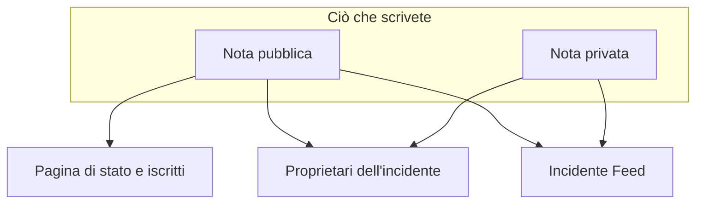

# Note, proprietari e feed degli incidenti

Ogni incidente raccoglie una traccia scritta mentre ci lavorate: aggiornamenti per i vostri clienti, note di lavoro per il vostro team e un feed delle attività di tutto ciò che è successo. Questa pagina tratta la scrittura di note pubbliche e private, chi raggiunge ciascuna, il feed dell'incidente e i proprietari che vengono informati di ogni cambiamento.

:::cards
- [Pubblicare una nota pubblica](#pubblicare-una-nota-pubblica): Dite ai clienti ciò che sapete, sulla pagina di stato e tramite notifica.
- [Quando vengono avvisati gli iscritti](#quando-una-nota-pubblica-raggiunge-davvero-gli-iscritti): I controlli che una nota pubblica supera, e il suo badge.
- [Il feed dell'incidente](#il-feed-dellincidente): La cronologia di tutto ciò che è successo.
- [Proprietari](#proprietari): Chi è responsabile, e che cosa gli viene detto.
:::

## Come funziona

Una parte di ciò che scrivete è per i vostri clienti — l'aggiornamento che esce sulla pagina di stato alle 02:14 per dire che avete trovato il deploy difettoso. Il resto è per il vostro team — lo stack trace che qualcuno ha incollato, il grafico che finalmente ha avuto senso, la decisione di fare failover. OneUptime tiene separati questi due pubblici, e registra entrambi sull'incidente.



Le **Note pubbliche** vengono pubblicate sulla vostra pagina di stato e possono avvisare gli iscritti. Le **Note private** (il modello `IncidentInternalNote`) restano dentro la dashboard. Sotto entrambe ci sono l'**Incidente Feed**, una cronologia in sola aggiunta che registra tutto ciò che è successo all'incidente, e l'elenco dei **Proprietari**, che decide chi viene informato.

Tutto si trova nel menu laterale dell'incidente: **Note → Note pubbliche**, **Note → Note private** e **Team → Proprietari**. Il feed si trova nella pagina **Panoramica** dell'incidente.

## Note pubbliche e note private a confronto

I due tipi di nota si somigliano nella dashboard e si comportano in modo molto diverso.

|                               | Nota pubblica                                                       | Nota privata                                                    |
| ----------------------------- | ------------------------------------------------------------------- | --------------------------------------------------------------- |
| Modello                       | `IncidentPublicNote`                                                | `IncidentInternalNote`                                          |
| Mostrata sulle pagine di stato | Sì, come parte della cronologia dell'incidente                     | Mai — nulla nell'app delle pagine di stato le legge             |
| Ora di pubblicazione          | `postedAt`, che potete impostare voi                                | Nessuna: marcata e ordinata per `createdAt`                     |
| Avvisa gli iscritti           | Quando **Notify status page subscribers** è attivo                  | Mai: non ha alcun campo per gli iscritti                        |
| Allegati raggiungibili da     | I visitatori della pagina di stato, tramite una route della pagina di stato | Solo l'API autenticata della dashboard                    |
| Avvisa i proprietari          | Sì                                                                  | Sì                                                              |

**Che cosa significa davvero «privata».** Significa «non pubblicata sulla pagina di stato» — non «riservata a un gruppo più ristretto di persone». I ruoli integrati che possono leggere un incidente leggono entrambi i tipi di nota, quindi chiunque possa leggere l'incidente di solito può leggerne le note private; in un ruolo personalizzato sono permessi distinti, **Read Incident Status Page Note** e **Read Incident Internal Note**. Se dovete limitare chi può vedere un incidente in assoluto, usate il flag **Incidente privato** (`isPrivate`) sull'incidente stesso, che lo nasconde da ogni pagina di stato e lo limita agli utenti proprietari dell'incidente, ai membri dei suoi team proprietari e agli amministratori e proprietari del progetto.

**I proprietari vedono entrambe.** L'attività di notifica ai proprietari interroga insieme note pubbliche e private. Una nota privata è privata per i vostri iscritti, non per le persone che rispondono.

| Se volete…                                                        | Scegliete         |
| ----------------------------------------------------------------- | ----------------- |
| Dire ai clienti che cosa sapete e quando ne saprete di più        | **Nota pubblica** |
| Retrodatare un aggiornamento che avete già inviato altrove        | **Nota pubblica** |
| Registrare un'ipotesi, un comando eseguito o un vicolo cieco      | **Nota privata**  |
| Allegare un dump della memoria o lo screenshot di una dashboard interna | **Nota privata** |

## Pubblicare una nota pubblica

:::steps
### Aprire le note pubbliche

Aprite l'incidente e scegliete **Note → Note pubbliche** nel suo menu laterale. L'editor sopra le note dice chi leggerà la nota prima che la pubblichiate: **Public · Visible on your status page**.

### Scrivere l'aggiornamento

Scrivete la nota in Markdown, oppure partite da uno dei vostri **Modelli** o da **Draft with AI**. Aggiungete file con **Attach** se gli iscritti devono vederli.

### Decidere chi viene informato

Lasciate **Notify status page subscribers** spuntata per avvisare gli iscritti, oppure togliete la spunta per pubblicare in silenzio. **Will notify**, sotto, mostra quali pagine di stato raggiungerà la nota, e **Anteprima** mostra l'e-mail che riceveranno.

### Pubblicarla

Fate clic su **Post update**, oppure premete Ctrl+Invio (⌘+Invio su un Mac). La nota compare in cima all'elenco, con un badge che segue la sua notifica.
:::

Lo stesso editor si apre in una finestra da **Add Public Note** nel menu **Azioni** del feed dell'incidente (vedete [Il feed dell'incidente](#il-feed-dellincidente)), quindi una nota si scrive allo stesso modo da entrambi i punti.

| Controllo                          | Scopo                                                                                                                                         |
| ---------------------------------- | --------------------------------------------------------------------------------------------------------------------------------------------- |
| La nota                            | Il corpo, in Markdown. Obbligatorio.                                                                                                          |
| **Modelli**                        | Inserisce uno dei vostri modelli di nota nella nota, dopo ciò che avete già digitato. Vedete [Modelli di note](#modelli-di-note).              |
| **Draft with AI**                  | Stende la nota a partire dall'incidente, perché la modifichiate. Vedete [Generare una nota con l'IA](#generare-una-nota-con-lia).             |
| **Attach**                         | File condivisi con gli iscritti sulla pagina di stato. Facoltativo.                                                                           |
| **Posted now**                     | Quando la nota dice di essere stata pubblicata: il momento in cui la pubblicate, a meno che non scegliate qui un'ora precedente, nel vostro fuso orario attuale. |
| **Notify status page subscribers** | Casella di controllo. Attiva per impostazione predefinita, a meno che l'incidente non sia stato dichiarato senza avvisare gli iscritti — allora parte disattivata. Disattivatela per pubblicare in silenzio. |

**Gli incidenti silenziosi restano silenziosi.** Se un incidente è stato dichiarato con **Notifica gli iscritti alla pagina di stato** disattivata (o come incidente privato), i suoi iscritti non ne sono mai stati informati, quindi una nota pubblica non dovrebbe essere la prima cosa che sentono. Su un incidente del genere la casella parte disattivata, con una riga sotto che spiega perché. Potete comunque spuntarla per avvisare gli iscritti di quella nota. Le note pubblicate senza una scelta esplicita seguono la stessa regola: le note da Slack e Microsoft Teams, i workflow e le richieste API che omettono `shouldStatusPageSubscribersBeNotifiedOnNoteCreated`. Un `true` o un `false` espliciti vengono sempre mantenuti. Le note pubbliche sugli [eventi di manutenzione programmata](/docs/status-pages/subscribers#eventi-di-manutenzione-programmata) e sugli [episodi di incidenti](/docs/status-pages/subscribers) seguono una regola simile, in base al fatto che l'evento o l'episodio stesso abbia avvisato gli iscritti alla sua creazione; rendere privato un episodio non la influenza.

**Vedere chi raggiungerà la nota.** Finché **Notify status page subscribers** è spuntata, una riga **Will notify** sotto di essa elenca le pagine di stato a cui andrà la nota, con un numero di iscritti «fino a» per canale, e le pagine che elencano i monitor dell'incidente ma non verranno informate, con il motivo. Quando nessuno verrà informato non mostra nulla, a meno che l'incidente sia nascosto dalle pagine di stato o che il motivo sia il suo ambito delle pagine di stato. Segue l'ambito delle pagine di stato dell'incidente, così una nota su un incidente limitato a due pagine di sede dice che raggiungerà quelle due. Vedete [Una pagina di stato per pubblico](/docs/status-pages/one-status-page-per-audience).

**Vedere che cosa riceveranno.** Accanto alla stessa casella, **Anteprima** mostra l'e-mail che riceveranno gli iscritti di ciascuna di quelle pagine di stato per la nota che state scrivendo, e quale modello usa e perché. Resta grigia finché la nota non ha del testo. **Inviami un test** invia quell'e-mail all'indirizzo del vostro account, e a nessun altro. Vedete [Iscritti e annunci](/docs/status-pages/subscribers#incidenti).

> [!TIP]
> **L'ora di pubblicazione è il vero orario della nota.** Le pagine di stato ordinano e mostrano le note pubbliche per `postedAt`, non per quando le avete digitate — quindi, se state aggiornando la pagina di stato con un aggiornamento inviato 40 minuti fa, scegliete **Posted now** e impostate quando è avvenuto davvero. Se una nota arriva tramite l'API (`/api/incident-public-note`) senza ora, OneUptime le assegna l'ora attuale.

Ogni nota mostra chi l'ha scritta, la sua ora di pubblicazione, il Markdown visualizzato con i suoi allegati e, nella sua intestazione, a che punto è la sua notifica agli iscritti. **Search notes…** trova le note in base a ciò che dicono, e il feed si può leggere dal più recente o dal meno recente.

## Pubblicare una nota privata

**Note → Note private** è volutamente più semplice. È lo stesso editor, che dice **Private · Only your team can see this**, con la nota, **Modelli**, **Draft with AI** e **Attach** per i file destinati al team che risponde all'incidente. **Aggiungi nota privata** nel menu **Azioni** del feed dell'incidente lo apre in una finestra. Tramite l'API, le note private sono `/api/incident-internal-note`.

Niente ora di pubblicazione, niente casella per gli iscritti — la nota viene marcata con l'ora in cui viene creata.

Entrambi i tipi di nota si scrivono nell'editor Markdown, che annida gli elementi di elenco con **Aumenta rientro** e **Riduci rientro** — oppure Tab e Maiusc+Tab — e mantiene gli elenchi, i link e la formattazione di ciò che incollate da Word, Google Docs o un'altra pagina di OneUptime. Ctrl+Z annulla un rientro aumentato o ridotto, e in modalità visuale anche i blocchi e gli incollaggi inseriti dall'editor, in ordine con ciò che avete digitato. Un blocco di codice copiato da una nota si reincolla come blocco di codice, e una parola copiata da uno di essi come codice in linea. Vedete [Dichiarare un incidente](/docs/incidents/declaring-incidents#passaggio-1-dettagli-dellincidente).

## Allegati delle note

Entrambi i tipi di nota accettano allegati tramite il pulsante **Attach** dell'editor, ed entrambi mostrano sotto il corpo della nota un elenco degli allegati con un link **Download attachment** per ogni file.

Dove divergono è in chi può recuperare il file:

- **Gli allegati delle note pubbliche** possono essere scaricati dai visitatori della pagina di stato tramite una route della pagina di stato, insieme alla nota stessa.
- **Gli allegati delle note private** sono raggiungibili solo tramite l'API autenticata della dashboard. Non esiste alcuna route della pagina di stato per loro.

Questo rende gli allegati la stessa decisione pubblico/privato del testo della nota. Un'immagine della cronologia rivolta ai clienti va in una nota pubblica; un dump di configurazione in una privata.

Le immagini seguono la stessa decisione. Un'immagine che incollate o trascinate in una nota, o che aggiungete con **Carica immagine**, viene salvata nel progetto dell'incidente e mostrata dentro la nota, e chi può vederla segue la nota:

- **In una nota privata** — o in una nota pubblica prima che venga pubblicata — un'immagine viene mostrata solo ai membri del progetto, che hanno effettuato l'accesso come richiede il progetto. Chiunque altro apra il suo indirizzo non vede nulla, come se lì non ci fosse alcuna immagine.
- **In una nota pubblica** un'immagine viene mostrata a tutti coloro che possono vedere la nota: sulla pagina di stato, e nelle e-mail che ricevono i suoi iscritti. Una nota pubblica viene mostrata con il suo incidente, mai senza: finché l'incidente è nascosto dalle pagine di stato o privato, anche le immagini delle sue note vengono mostrate solo ai membri del progetto.

Ogni caricamento parte privato, sia dalla dashboard sia dall'API. Un'immagine è visibile a tutti solo finché qualcosa che mostrano le vostre pagine di stato la contiene: una nota pubblica finché il suo incidente, episodio o evento di manutenzione programmata è mostrato sulle pagine di stato, un annuncio da quando inizia a essere mostrato, la descrizione dell'incidente finché l'incidente è **Visibile sulla pagina di stato** e non privato, il suo post-mortem una volta pubblicato anche lì, la descrizione di un episodio o di un evento di manutenzione programmata finché è mostrato sulle pagine di stato (mai finché l'episodio è privato), e le descrizioni di panoramica, di gruppo e di risorsa della pagina di stato stessa. Quando questo smette di valere — l'incidente viene nascosto o reso privato, l'immagine viene tolta dal testo, la nota o l'incidente vengono eliminati — l'immagine torna privata, a meno che qualcos'altro che mostrano le vostre pagine di stato la contenga ancora. La descrizione e il messaggio di ringraziamento di un modulo mostrano le loro immagini a tutti allo stesso modo, finché il modulo accetta invii.

Leggere una nota tramite l'API, Terraform o un workflow elenca solo gli allegati che il lettore può aprire: i file del progetto della nota e i file pubblici. Un allegato che una nota nomina da un altro progetto viene omesso dall'elenco, come se la nota non lo avesse.

## Generare una nota con l'IA

L'editor ha un pulsante **Draft with AI**, su entrambe le pagine delle note e nelle finestre **Add Public Note** e **Aggiungi nota privata** del feed. Invia l'incidente al fornitore di IA del vostro progetto e mette il Markdown generato nella nota, dove lo modificate prima di pubblicarlo — nulla viene pubblicato automaticamente.

| Finestra                               | Che cosa scrive                                                      | Modelli                                                           |
| -------------------------------------- | -------------------------------------------------------------------- | ----------------------------------------------------------------- |
| **Generate Public Note with AI**       | Una nota rivolta ai clienti, da un'analisi dei dati dell'incidente.  | **Status Update**, **Resolution Notice**, **Maintenance Update**  |
| **Generate Private Note with AI**      | Una nota tecnica interna.                                            | **Investigation Update**, **Technical Analysis**, **Shift Handoff** |

Dietro il pulsante, la dashboard invia una richiesta a `/incident/generate-note-from-ai/{incidentId}` con il modello scelto e un tipo di nota `public` o `internal`.

Ciò che viene inviato è il testo dell'incidente. Un'immagine o un file incorporato al suo interno — uno screenshot incollato nella descrizione, ad esempio — viene sostituito da una breve indicazione come `[image omitted: PNG, 340 KB]`, e ogni campo di testo viene troncato a 16.000 caratteri, così un unico grosso incollaggio non scalza mai il resto. L'incidente stesso conserva le sue immagini.

## Modelli di note

Se il vostro team scrive gli stessi tre aggiornamenti a ogni disservizio, salvateli una volta. Il menu **Modelli** dell'editor li elenca, su entrambe le pagine delle note e nelle finestre delle note del feed, e sceglierne uno lo inserisce nella nota.

I modelli sono condivisi tra note pubbliche e private: un unico elenco di modelli serve entrambe, e lo stesso modello può essere inserito in entrambi i tipi di nota.

I segnaposto di un modello — `{{incident.title}}`, `{{incident.state}}`, `{{incident.customFields.impact}}` e gli altri elencati in [Modelli di note](/docs/incidents/settings#modelli-di-note) — vengono compilati con i valori attuali dell'incidente quando lo scegliete, sia nelle pagine delle note sia nelle finestre **Riconosci** e **Risolvi**. Ciò che avevate già digitato non viene mai modificato, e un segnaposto senza valore resta come è scritto.

> [!IMPORTANT]
> Rileggete la nota compilata prima di pubblicarne una pubblica: `{{incident.affectedStatusPages}}` nomina ogni pagina di stato che l'incidente raggiunge, e la leggono gli iscritti di tutte.

Li gestite in **Incidenti → Impostazioni → Modelli di note** — la scheda si intitola **Modelli di nota pubblica o privata per gli incidenti** e il suo modulo è di una sola pagina: **Nome del modello** e **Descrizione del modello**, entrambi obbligatori, poi il corpo. Prima che ne abbiate uno, il menu **Modelli** lo dice e rimanda lì.

## Pubblicare note da Slack o Microsoft Teams

Se avete collegato un'area di lavoro, i responder non devono mai lasciare il canale. Sia Slack sia Microsoft Teams offrono un'azione di aggiunta nota che apre una finestra con un menu a tendina **Note Type** — **Public Note** (pubblicata sulla pagina di stato) o **Private Note** (visibile solo ai membri del team) — e una casella di testo **Note**, e scrive il risultato direttamente sull'incidente.

Tre dettagli che vale la pena conoscere:

- **Protezione dai duplicati** — ogni nota registra il messaggio Slack da cui proviene (`postedFromSlackMessageId`, nel formato `channel_id:message_ts`), così più persone che reagiscono allo stesso messaggio producono una nota, non cinque.
- **Le note fanno eco** — pubblicare uno qualsiasi dei due tipi di nota invia anche un messaggio nel canale dell'incidente collegato, perché la voce di feed della nota viene creata con la notifica dell'area di lavoro attiva.
- **Pubblicata a nome di chi l'ha chiesta** — una nota dalla finestra o da una reazione viene pubblicata con i permessi OneUptime di quella persona, quindi serve il suo permesso di pubblicare quel tipo di nota sull'incidente. Quando viene rifiutata, le viene detto perché — in un messaggio diretto su Slack, e nella conversazione su Microsoft Teams (nel thread del messaggio, per una reazione) — e non viene pubblicato nulla.

## Quando una nota pubblica raggiunge davvero gli iscritti

Creare una nota pubblica con **Notifica gli iscritti alla pagina di stato** attiva non garantisce da solo che parta un'e-mail. La nota deve superare una catena di controlli, e ogni fallimento registra un motivo preciso invece di dare un errore:

```mermaid title="I controlli che una nota pubblica supera prima che gli iscritti ne siano informati"
flowchart TB
    note["Nota pubblica pubblicata"] --> box{"Casella Notifica attiva?"}
    box -->|No| skipped["Iscritti non avvisati"]
    box -->|Sì| incident{"Incidente sulle pagine di stato?"}
    incident -->|No| skipped
    incident -->|Sì| pages{"Pagina nell'ambito?"}
    pages -->|No| skipped
    pages -->|Sì| prefs{"Iscritto abbonato?"}
    prefs -->|Sì| sent["Messaggio inviato"]
```

1. **Notifica gli iscritti alla pagina di stato** deve essere attiva. Se non lo è, la nota viene marcata come saltata nel momento in cui viene creata. Parte disattivata sugli incidenti dichiarati senza avvisare gli iscritti.
2. La nota deve appartenere a un incidente che esiste ancora.
3. L'incidente deve avere almeno un monitor collegato — senza monitor non c'è alcuna risorsa della pagina di stato verso cui indirizzare la nota.
4. Il flag **Visibile sulla pagina di stato** (`isVisibleOnStatusPage`) dell'incidente deve essere true, e l'incidente non deve essere privato (`isPrivate`). Un incidente privato è nascosto da ogni pagina di stato, qualunque cosa dica il flag — vedete [Tenere un incidente fuori dalla pagina di stato](/docs/incidents/states-and-severities#tenere-un-incidente-fuori-dalla-pagina-di-stato).
5. Ogni pagina di stato che l'incidente raggiunge deve avere **Mostra incidenti** (`showIncidentsOnStatusPage`) attivo. Le pagine che raggiunge sono quelle che elencano i suoi monitor, ristrette alle pagine a cui l'incidente è limitato, se ce ne sono. Un incidente che non è limitato ad alcuna pagina salta le pagine che mostrano solo gli incidenti limitati a esse. Vedete [Una pagina di stato per pubblico](/docs/status-pages/one-status-page-per-audience).
6. Ogni iscritto deve rispettare le proprie preferenze — non essersi disiscritto, ed essere iscritto a questa risorsa e al tipo di evento `Incident` dove la pagina lascia scegliere agli iscritti.

> [!NOTE]
> **Le notifiche non sono istantanee.** L'attività che le invia gira una volta al minuto, quindi aspettatevi fino a circa un minuto tra il salvataggio della nota e la partenza della posta. È ciò che significa **Notifying subscribers soon** su una nota, e **Sending Soon** sulle notifiche dell'incidente stesso.

L'intestazione di una nota pubblica segue tutto il percorso con un badge. Fateci clic sopra per il messaggio di stato della notifica, che dice che cosa è successo:

| Badge                          | Che cosa significa                                                                                                                                |
| ------------------------------ | ------------------------------------------------------------------------------------------------------------------------------------------------- |
| **Subscribers not notified**   | Non è stato inviato nulla: la nota è stata pubblicata con **Notifica gli iscritti alla pagina di stato** non spuntata, oppure uno dei controlli sopra si è chiuso. Il motivo viene registrato. |
| **Notifying subscribers soon** | In coda, in attesa della prossima esecuzione dell'attività di invio.                                                                              |
| **Notifying subscribers**      | L'attività sta scorrendo l'elenco degli iscritti.                                                                                                 |
| **Subscribers notified**       | Il messaggio di ogni iscritto è stato inviato. Il messaggio di stato elenca, per pagina di stato, quanti ne sono partiti su ogni canale.            |
| **Notification failed**        | Non tutti gli iscritti l'hanno ricevuto, oppure l'attività si è fermata con un errore. Il messaggio di stato dice quale dei due.                  |

**Inviato significa inviato.** L'attività attende ogni messaggio: un'e-mail o un SMS conta come inviato non appena il server di posta o il fornitore di SMS l'ha preso in carico, e un messaggio Slack, Microsoft Teams o webhook non appena l'altra parte ha risposto. Un messaggio rifiutato, in errore o senza risposta entro 4 minuti conta come non riuscito, e un solo fallimento porta il badge a **Notification failed**; agli altri iscritti viene comunque inviato. Il messaggio di stato allora dice qualcosa come `Not every subscriber was sent this notification: 2 of 61 messages failed. Site 03: 41 email sent. Site 07: 16 email, 2 SMS sent; 2 email failed.` «Inviato» arriva fin dove OneUptime può vedere: un server di posta può ancora respingere un'e-mail in seguito.

:::details Pagine grandi e invii lunghi
Gli iscritti di una pagina di stato vengono letti 10.000 alla volta finché non sono stati raggiunti tutti, e ci sono 20 messaggi in corso contemporaneamente. Una notifica smette di avviare nuovi messaggi dopo 20 minuti: ciò che non ha raggiunto fino ad allora viene elencato, e viene segnata come **Notification failed**. Anche un invio interrotto a metà — il suo server si è riavviato o ha smesso di rispondere — viene segnato come **Notification failed**, con un messaggio che inizia con `Interrupted:`, una volta che è rimasto in **Notifying subscribers** per 40 minuti, così non resta lì per sempre. Vedete [Iscritti e annunci](/docs/status-pages/subscribers).
:::

### Inviare di nuovo la notifica di una nota

Fate clic sul badge di notifica di una nota per vedere che cosa è successo. Una nota la cui notifica è fallita offre **Riprova la notifica**, e una la cui notifica è partita offre **Invia di nuovo la notifica**. Entrambe chiedono prima conferma: la conferma elenca le pagine di stato che la nota raggiungerebbe adesso, con un numero «fino a» per canale, oppure dice che non raggiungerebbe nessuno, e spiega che cosa succede. Entrambe rimettono la nota in attesa perché la prossima esecuzione la prenda, e la inviano a ogni pagina di stato che l'incidente raggiunge adesso, compresi gli iscritti che l'hanno già ricevuta. Se avete cambiato le pagine a cui l'incidente è limitato da quando la nota è stata pubblicata, va alle pagine a cui è limitato adesso. Una nota pubblicata con **Notifica gli iscritti alla pagina di stato** non spuntata non offre né l'una né l'altra, perché non era mai destinata a essere inviata, e nessuna viene offerta mentre una notifica è ancora in coda o in invio. Le note pubbliche degli eventi di manutenzione programmata e degli episodi di incidenti mantengono **Riprova la notifica** solo dopo un fallimento.

Inviare di nuovo la notifica di una nota dice a ogni iscritto ciò che dice la nota, proprio come la sua pubblicazione, quindi richiede il permesso di pubblicare note pubbliche che avvisano gli iscritti oltre al permesso di modificare le note pubbliche. Tramite l'API è lo stesso aggiornamento che fa la dashboard, riportando `subscriberNotificationStatusOnNoteCreated` a `Pending`; viene rifiutato per un chiamante senza quei permessi, per una nota pubblicata senza avvisare gli iscritti, e mentre la notifica della nota è in invio.

:::details Come riprende la notifica di creazione dell'incidente
Solo la notifica di creazione dell'incidente riprende da dove si è fermata: tiene traccia delle pagine di stato a cui ha inviato completamente, e **Riprova** nella **Panoramica** dell'incidente le salta. La traccia è tenuta per pagina di stato, non per iscritto, quindi a una pagina in cui si è fermata a metà viene inviata di nuovo per intero, compresi gli iscritti di quella pagina che l'avevano già ricevuta. La conferma di **Riprova** offre **Inviarla di nuovo a ogni pagina di stato, comprese le pagine già raggiunte**, che la trasforma in **Invia di nuovo a tutte le pagine**, e **Invia di nuovo** dopo un successo la invia di nuovo a ogni pagina. Vedete [Una pagina di stato per pubblico](/docs/status-pages/one-status-page-per-audience#adding-status-pages).
:::

### Modificare una nota pubblica

**Modificare una nota pubblica avviene in silenzio, a meno che non lo chiediate.** Il modulo di modifica della nota ha una casella **Notifica gli iscritti di questo aggiornamento**, senza spunta ogni volta. Spuntatela per un cambiamento che gli iscritti devono conoscere e ricevono la nota modificata, segnata come aggiornamento; la nota mostra allora un secondo badge per l'aggiornamento accanto a quello originale, con il proprio **Riprova la notifica** dopo un fallimento:

| Badge dell'aggiornamento         | Che cosa significa                                  |
| -------------------------------- | --------------------------------------------------- |
| **Aggiornamento in coda**        | In attesa della prossima esecuzione dell'attività di invio. |
| **Invio dell'aggiornamento**     | L'attività sta scorrendo l'elenco degli iscritti.   |
| **Aggiornamento inviato**        | A ogni iscritto è stata inviata la nota modificata. |
| **Aggiornamento non riuscito**   | Non tutti gli iscritti l'hanno ricevuta.            |
| **Aggiornamento non inviato**    | Uno dei controlli sopra l'ha fermato.               |

Un aggiornamento inviato non viene offerto di nuovo: modificate la nota con la casella spuntata per inviare il testo più recente, oppure inviate di nuovo la nota stessa. Se la notifica originale non è ancora partita, non viene inviato un aggiornamento separato — l'originale porta con sé la modifica. Se è in invio proprio in quel momento, l'aggiornamento aspetta che finisca e poi parte. La casella e il **Riprova la notifica** dell'aggiornamento richiedono gli stessi permessi dell'invio di nuovo della notifica della nota; senza di essi potete comunque modificare la nota, senza avvisare nessuno. Vedete [Iscritti e annunci](/docs/status-pages/subscribers).

Il messaggio che ricevono davvero gli iscritti viene generato da un modello per pagina di stato e per canale — e-mail, SMS, Slack e Microsoft Teams hanno ciascuno il proprio modello per l'evento **Subscriber Incident Note Created**, con variabili per il nome e l'URL della pagina di stato, il link ai dettagli, le risorse interessate, la gravità e il titolo dell'incidente, il corpo della nota, le etichette dell'incidente, le sue pagine di stato interessate e i suoi campi personalizzati, e un link di disiscrizione per ogni iscritto. Anche i messaggi predefiniti di e-mail, Slack e Microsoft Teams elencano i campi personalizzati dell'incidente contrassegnati con **Includi nelle notifiche agli iscritti**, con i loro valori attuali. Vedete [Iscritti e annunci](/docs/status-pages/subscribers) per come si configurano quei modelli e quei canali.

## Il feed dell'incidente

La scheda **Incidente Feed** si trova in fondo alla colonna sinistra della pagina **Panoramica** dell'incidente. È la storia dell'incidente in ordine: ogni voce è un'icona, l'avatar e il nome di chi l'ha causata, un orario relativo con l'ora locale esatta al passaggio del mouse, e un corpo in Markdown. Per impostazione predefinita, le voci più recenti sono in alto.

Alcune voci portano dettagli in più — una notifica ai proprietari elenca tutti coloro a cui è stata inviata, ad esempio, e una notifica agli iscritti elenca ogni pagina di stato a cui è andata, con il numero di messaggi inviati e non riusciti su ogni canale e l'oggetto con cui è partita la sua e-mail, seguito, quando ne ha inviati, dai valori dei campi personalizzati che ha messo in un messaggio, sotto **Custom fields sent**. Quelle mostrano un pulsante **More Information** che apre un pannello **More Information**.

L'intestazione della scheda ha anche un menu **Azioni** per agire senza lasciare la cronologia:

- **Execute Runbook** — avvia un [runbook](/docs/runbooks/index) su questo incidente.
- **Esegui criterio di reperibilità** — avvisa una policy su richiesta. Una policy archiviata non avvisa nessuno: il suo registro di esecuzione sull'incidente dice che non è stata eseguita perché la policy è archiviata.
- **Add Public Note** — l'editor della pagina **Note pubbliche**, in una finestra: scrivete la nota, poi **Post update**. I modelli, **Draft with AI**, gli allegati, **Notify status page subscribers** con chi raggiungerà, e **Anteprima** sono tutti lì. La nota viene pubblicata adesso; per retrodatarla, scegliete **Posted now**.
- **Aggiungi nota privata** — l'editor della pagina **Note private**, in una finestra: scrivete la nota, poi **Add note**.

Entrambe le azioni sulle note sono bloccate, con il nome del permesso mancante, per chi non può scrivere note. Dopo la pubblicazione di una nota la finestra si chiude e il feed la mostra.

Tutto il resto si trova dietro il pulsante **⋯** accanto, lo stesso pulsante **Altre opzioni** che ha l'intestazione della scheda di una tabella, così l'intestazione mostra il minor numero possibile di pulsanti:

- **Prima i più recenti** / **Prima i meno recenti** — l'ordine in cui si legge il feed. Un segno di spunta indica quello in uso, e il vostro browser ricorda la scelta per il feed di ogni incidente.
- **Filtra per tipo di evento** — una finestra che elenca i tipi di evento del feed, ciascuno con l'icona che portano le sue voci, e una casella di ricerca quando l'elenco è lungo. Spuntate quelli da mostrare e scegliete **Applica filtri**; senza nulla di spuntato, vengono mostrati tutti i tipi di evento. Mentre il feed è filtrato, un riquadro sopra di esso dice quanti tipi di evento mostra, con un'etichetta per ciascuno, **Modifica filtri** e **Cancella filtri**. Il filtro non viene salvato: lasciate l'incidente e il suo feed mostra di nuovo tutto.
- **Aggiorna** — ricarica il feed.

> [!NOTE]
> **Il feed è in sola aggiunta, e non è il vostro registro di audit.** L'API permette di creare e leggere le voci del feed ma non di modificarle né eliminarle, così nessuno può riscrivere di nascosto la storia di un incidente. Non è nemmeno permanente: nelle installazioni a pagamento, le righe del feed più vecchie di tre anni vengono rimosse. Per una traccia duratura di chi ha cambiato che cosa, usate **Avanzato → Registri di audit** nel menu laterale dell'incidente.

## Che cosa registra il feed

Le voci del feed vengono scritte dal servizio degli incidenti stesso, da entrambi i servizi delle note, dalla cronologia degli stati, dai cambi di proprietari e membri, dal collegamento e scollegamento degli avvisi, dai motori di regole, dall'esecuzione della reperibilità, dalle esecuzioni di indagine e di post-mortem dell'IA, e dalle attività pianificate di notifica. I tipi di evento coprono:

- **L'incidente stesso** — `IncidentCreated`, `IncidentUpdated`, `IncidentStateChanged`. Una voce `IncidentUpdated` registra che cosa ha cambiato una modifica: il titolo, la descrizione, la causa principale, le note di rimedio, le etichette, la gravità, i monitor e lo stato messo su di essi, e le pagine di stato aggiunte all'ambito dell'incidente o tolte da esso. Ha una riga per ogni valore cambiato e nessuna per un valore salvato così com'era, quindi salvare una scheda senza aver cambiato nulla, o un client API o un workflow che riscrive l'incidente così com'è, non aggiunge alcuna voce. Un testo che si legge uguale è lo stesso (a parte i ritorni a capo e gli spazi attorno), e le etichette sono le stesse se formano lo stesso insieme in qualsiasi ordine; un valore cancellato si legge come rimosso, e togliere tutte le etichette come «All labels removed.». Le voci **Alert updated** di un avviso funzionano allo stesso modo.
- **Note e resoconti** — `PublicNote`, `PrivateNote`, `RootCause`, `RemediationNotes`, `PostmortemNote`. Una voce `PostmortemNote` viene scritta quando cambia la nota del post-mortem, non ogni volta che il post-mortem viene salvato.
- **Persone** — `OwnerUserAdded`, `OwnerTeamAdded`, `OwnerUserRemoved`, `OwnerTeamRemoved`, `IncidentMemberAdded`, `IncidentMemberRemoved`.
- **Avvisi collegati** — `AlertLinked` e `AlertUnlinked`, mostrati come **Avviso collegato** e **Avviso scollegato**.
- **Notifiche** — `OwnerNotificationSent`, `SubscriberNotificationSent`, `OnCallPolicy`, `OnCallNotification`.
- **Automation** — `LabelRuleExecuted`, `OwnerRuleExecuted`, `PrivacyRuleExecuted`, `OnCallRuleExecuted`, `AutoRemediation`.
- **Videochiamate** — `VideoCallStarted` e `VideoCallFailed`: una chiamata avviata per l'incidente, con il suo link di accesso, o il motivo per cui un fornitore non è riuscito ad avviarne una. Vedete [Videochiamate](/docs/workspace-connections/video-calls).

Ogni tipo ha la propria icona, così potete scorrere un feed lungo e individuare i cambi di stato in mezzo alle chiacchiere. L'analisi della causa principale generata dall'IA è contrassegnata in modo distinto e visualizzata in una modalità Markdown ristretta. La voce **Incidente creato**, la voce che registra un nuovo titolo e le voci di ingresso o uscita da un episodio mostrano un titolo esattamente come è stato digitato: vi fanno l'escape di `\`, `[`, `]`, `*`, `_`, `~`, dei backtick e di \<, così un titolo non può diventare un'immagine, HTML grezzo, una menzione Slack come \<!here\>, un link il cui testo nasconde dove porta, né grassetto, corsivo o codice. Un indirizzo in un titolo viene comunque mostrato come link a quello stesso indirizzo.

Anche il collegamento di un avviso viene registrato sull'avviso. Gli avvisi hanno un proprio feed, dove lo stesso cambiamento compare come **Collegato a un incidente** (`LinkedToIncident`) o **Scollegato da un incidente** (`UnlinkedFromIncident`), nominando l'incidente. Solo le voci **Avviso collegato** e **Avviso scollegato** dell'incidente vengono pubblicate in Slack e Microsoft Teams, così ogni collegamento viene annunciato una volta. Un incidente dichiarato dagli avvisi riceve un'unica voce **Avviso collegato** che li elenca tutti invece di una per avviso, e il titolo di un avviso o di un incidente privato viene omesso dalla voce dell'altro lato. Vedete [Avvisi collegati](/docs/incidents/linked-alerts).

I feed rispettano la privacy degli incidenti: per gli incidenti privati, le letture del feed vengono filtrate allo stesso modo dell'incidente.

## Proprietari

I proprietari sono le persone e i team responsabili di un incidente. Sono il destinatario delle notifiche di tutto ciò che gli accade — e sono il motivo per cui un incidente non passa inosservato mentre tutti pensano che se ne stia occupando qualcun altro.

Aprite **Team → Proprietari** nel menu laterale dell'incidente. La scheda **Proprietari** mostra un badge con il conteggio e descrive i proprietari come le persone e i team responsabili di questo incidente che vengono avvisati dei cambiamenti, con un conteggio come «2 people · 1 team». I proprietari compaiono come avatar sovrapposti; passare il mouse su uno mostra l'e-mail della persona o indica che la voce è un **Team**.

- Fate clic su **Aggiungi proprietario** per aprire un selettore con una casella di ricerca di persone o team.
- Fate clic sul controllo di rimozione di un avatar per aprire la conferma **Rimuovi proprietario**, poi su **Rimuovi**.
- Quando non ci sono ancora proprietari, la scheda lo dice e vi invita ad aggiungere un collega o un team perché vengano avvisati dei cambiamenti.

Gli utenti proprietari e i team proprietari sono record separati — aggiungere un team rende ogni membro di quel team proprietario ai fini delle notifiche senza elencarli uno per uno. Tramite l'API sono `/api/incident-owner-user` e `/api/incident-owner-team`.

Solo i team e i membri del vostro progetto possono essere proprietari. Il selettore offre solo loro, e i proprietari aggiunti tramite l'API, Terraform o un workflow sono soggetti alla stessa regola: un team di un altro progetto, o qualcuno che non è membro del progetto, viene rifiutato.

## Come vengono assegnati i proprietari

Ci sono quattro strade per entrare nell'elenco dei proprietari:

- **Da un modello di incidente** — i modelli portano un campo **Proprietari**: le persone e i team proprietari dell'incidente, che verranno avvisati quando viene creato o aggiornato, scelti dallo stesso elenco di **Aggiungi proprietario**. Creare un incidente dal modello li precompila, e vengono aggiunti una volta che esistono i canali Slack e Microsoft Teams dell'incidente, così una regola di notifica che invita i proprietari degli incidenti in un nuovo canale invita anche loro. La dashboard, e il passaggio **Create One Incident** di un workflow con un **Incident Template** scelto, li aggiungono senza la notifica «siete stati aggiunti»; un [modulo](/docs/forms/on-submit) con un modello li avvisa, e trattiene la notifica **Incidente creato** dell'incidente finché non vengono aggiunti. Vedete [Dichiarare un incidente](/docs/incidents/declaring-incidents).
- **Dalle regole dei proprietari degli incidenti** — le regole corrispondenti aggiungono proprietari automaticamente al momento della creazione.
- **Alla creazione tramite l'API** — gli utenti e i team proprietari passati con la chiamata di creazione vengono aggiunti allo stesso modo, una volta che esistono i canali, e senza la notifica «siete stati aggiunti».
- **A mano** — il controllo **Aggiungi proprietario** della pagina **Proprietari**, in qualsiasi momento dell'incidente.

Aggiungere due volte la stessa persona non è un problema; i proprietari già assegnati non vengono duplicati.

## Regole dei proprietari degli incidenti

Le **Regole dei proprietari degli incidenti** assegnano automaticamente utenti e team proprietari quando vengono creati incidenti che corrispondono — lo strato di instradamento grazie al quale un incidente del database arriva al team del database senza che nessuno ci pensi. Le trovate in **Incidenti → Regole → Regole del proprietario**, con il resto dell'automazione degli incidenti trattata in [Impostazioni e automazione degli incidenti](/docs/incidents/settings).

Il modulo della regola ha due passaggi — **Corrispondenza**, le condizioni che un incidente deve soddisfare, poi **Proprietari**, ciò che la regola aggiunge:

- **Proprietari** — **Aggiungi proprietario** apre un unico elenco di persone e team; fate clic su ciascuno per aggiungerlo, e togliete una scelta con la **×** della sua etichetta. Quando la regola corrisponde, ogni persona e ogni team scelti vengono aggiunti come proprietari, e i proprietari già assegnati non vengono duplicati.
- **Eredita proprietari**, ripiegato sotto **Proprietari** — assegna proprietari da entità correlate invece di nominarli. **Eredita proprietari dai monitor** rende ogni proprietario dei monitor dell'incidente proprietario dell'incidente, e **Eredita proprietari dagli host**, **Eredita proprietari dai cluster Kubernetes**, **Eredita proprietari dagli host Docker**, **Inherit Owners From Podman Hosts** ed **Eredita proprietari dai servizi** fanno lo stesso per quelle risorse.

Una nuova regola deve aggiungere qualcuno: scegliete almeno un proprietario, oppure attivate un interruttore di **Eredita proprietari**. Anche l'API e Terraform rifiutano una nuova regola che non aggiunge nessuno. Il suo **Nome** viene compilato a partire dai proprietari che scegliete — oppure, per una regola che eredita soltanto, dai suoi interruttori (_Inherit owners from monitors_) — finché non digitate un nome vostro. Modificare una regola non pretende mai dei proprietari, così una regola più vecchia che non aggiunge nulla si può ancora rinominare o disattivare; l'elenco la contrassegna con **Non aggiunge nulla**. Vedete [Regole per etichette e proprietari](/docs/configuration/label-and-owner-rules).

**Notifica ai proprietari**, sotto **Altri campi**, stabilisce se le persone vengono informate. Lasciatelo attivo per un vero instradamento; disattivatelo per aggiungere proprietari in silenzio — utile quando una regola è una comodità di registrazione più che un avviso.

Ogni esecuzione di una regola viene scritta nel feed dell'incidente, così potete sempre sapere se una persona è stata aggiunta da una regola o da un essere umano.

## Di che cosa vengono avvisati i proprietari

Cinque attività avvisano i proprietari, ciascuna eseguita una volta al minuto:

| Notifica                          | Quando                                                       | Oggetto dell'e-mail                                            |
| --------------------------------- | ------------------------------------------------------------ | -------------------------------------------------------------- |
| **Incidente creato**              | L'incidente viene dichiarato.                                | `[New Incident {number}] - {title}`                            |
| **È stata pubblicata una nota**   | Viene pubblicata una nota pubblica *o* privata.              | `[Update Incident {number}] - {title}`                         |
| **Lo stato è cambiato**           | L'incidente passa a un altro stato.                          | `[{State} Incident {number}] - {title}`                        |
| **Siete stati aggiunti**          | Venite aggiunti come proprietari.                            | `You have been added as the owner of Incident {number} - {title}` |
| **Ancora non risolto**            | Un promemoria, guidato dall'ora del prossimo promemoria dell'incidente. | `[Reminder] Incident {number} is still {state} - {title}` |

Ogni notifica parte sui canali che la persona ha attivato in **Impostazioni utente → Impostazioni notifiche** — e-mail, SMS, chiamata vocale, push, WhatsApp, Telegram, Slack, Microsoft Teams o webhook — che decidono che cosa viene davvero inviato. Ogni destinatario può disattivare ciascuna singolarmente — le impostazioni per utente sono formulate come l'invio delle notifiche di incidente creato, nota pubblicata, stato cambiato, proprietario aggiunto, membro assegnato e promemoria di incidente ancora aperto. Chi vuole solo una chiamata per i cambi di stato può avere esattamente questo. Vedete [Stati e gravità degli incidenti](/docs/incidents/states-and-severities) per che cosa significa un cambio di stato.

**Gli incidenti senza proprietari non restano muti.** Se un incidente non ha alcun proprietario, le attività di notifica ripiegano sui proprietari del progetto, così nulla va perso. La notifica **Incidente creato** di un incidente segnalato tramite un modulo il cui modello ha dei proprietari attende invece quei proprietari. Ogni persona avvisata viene anche aggiunta alla voce di feed corrispondente, così potete vedere in seguito esattamente chi è stato informato e a quale indirizzo.

## Passaggi successivi

:::cards
- [Impostazioni e automazione degli incidenti](/docs/incidents/settings): Regole del proprietario, modelli di note e il resto dell'automazione.
- [Iscritti e annunci](/docs/status-pages/subscribers): Dove finiscono le note pubbliche e chi le riceve.
- [Una pagina di stato per pubblico](/docs/status-pages/one-status-page-per-audience): Quali pagine di stato raggiungono le note di un incidente.
- [Stati e gravità degli incidenti](/docs/incidents/states-and-severities): La macchina a stati che alimenta metà del feed.
:::
