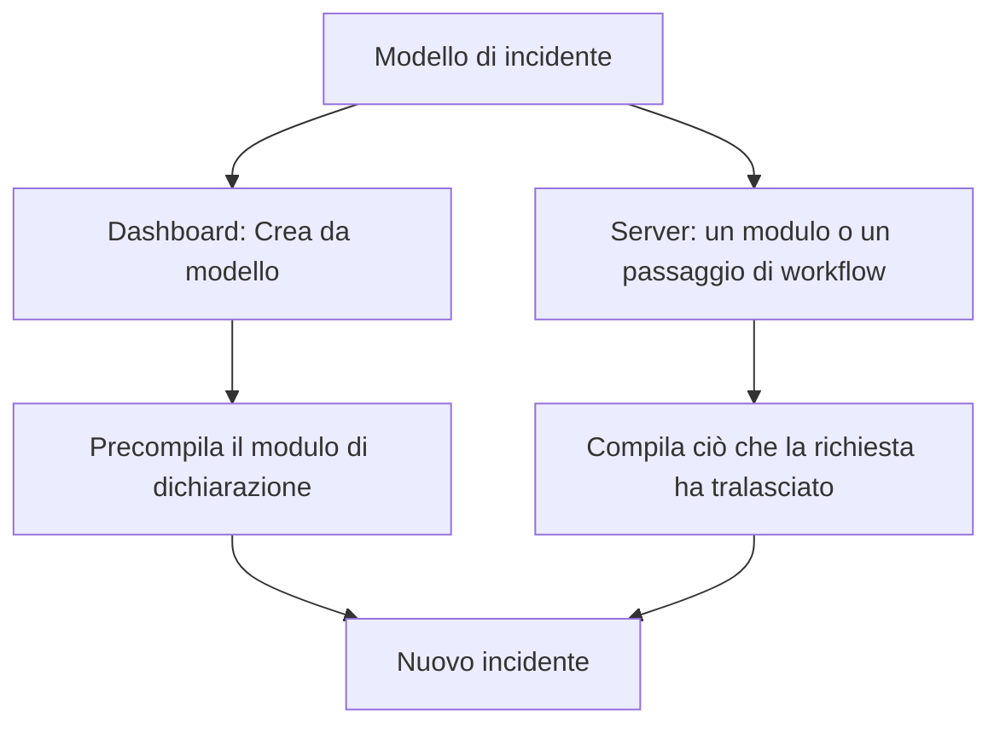
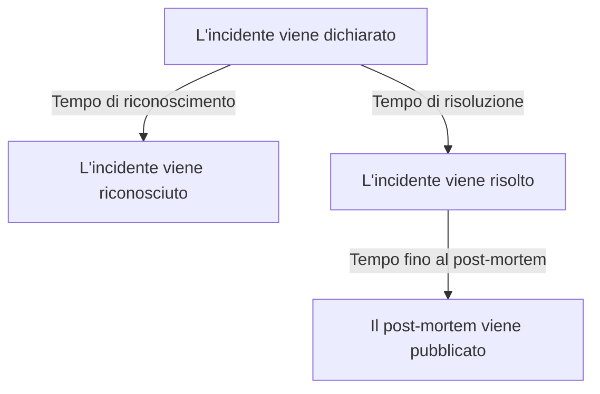
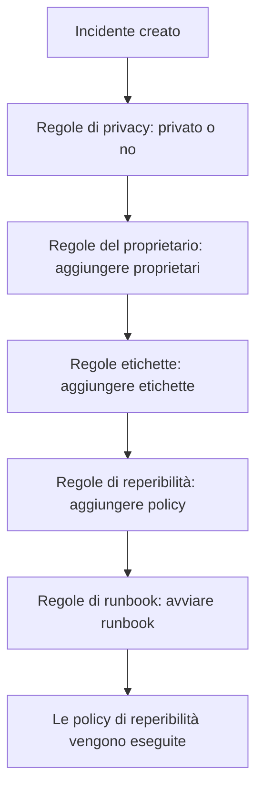

# Impostazioni e automazione degli incidenti

La configurazione degli incidenti si trova in **Incidenti**, non in **Impostazioni del progetto**: gli stati e le gravità, i modelli, i campi personalizzati, i ruoli, le misurazioni e i prefissi dei numeri, e le regole che agiscono su ogni nuovo incidente. Questa pagina è il riferimento per ciascuna di queste pagine, e per ciò che viene eseguito da solo nel momento in cui un incidente viene dichiarato.

:::cards
- [Modelli di incidenti](#modelli-di-incidenti): Dichiarate lo stesso tipo di incidente, precompilato, ogni volta.
- [Campi personalizzati](#campi-personalizzati): Campi vostri su ogni incidente, chiesti quando viene dichiarato.
- [Misurazioni](#misurazioni): Il tempo per riconoscere, risolvere o mitigare, calcolato per ogni incidente.
- [Regole](#regole-che-vengono-eseguite-alla-creazione-di-un-incidente): Proprietari, etichette, avvisi ed episodi, impostati automaticamente.
:::

## Dove si trovano le impostazioni degli incidenti

Aprite **Incidenti** dal menu **Prodotti** nella barra superiore, poi espandete **Impostazioni** in fondo al suo menu laterale. **Regole** e **Impostazioni** partono entrambe ripiegate, quindi espandetele prima che compaiano le pagine qui sotto. Tutto qui vale per progetto: modelli, ruoli, campi personalizzati e regole appartengono a un progetto e si applicano a ogni incidente dichiarato in esso, su route che iniziano con `/dashboard/{projectId}/incidents/settings/`.

| Pagina                          | Che cosa ci fate                                                                                   |
| ------------------------------- | -------------------------------------------------------------------------------------------------- |
| **Stato incidente**             | Aggiungere, rinominare, ricolorare e riordinare gli stati che un incidente attraversa.              |
| **Gravità incidente**           | Aggiungere, rinominare, ricolorare e riordinare i livelli di gravità.                              |
| **Modelli di incidenti**        | Precompilare un intero incidente — titolo, descrizione, risorse, policy di reperibilità, proprietari, etichette. |
| **Modelli di note**             | Testo riutilizzabile per note pubbliche e private.                                                 |
| **Modelli post-mortem**         | Strutture di post-mortem riutilizzabili.                                                           |
| **Campi personalizzati**        | Definire campi aggiuntivi che compaiono su ogni incidente.                                         |
| **Ruoli incidente**             | Definire i ruoli a cui assegnate i responder, come Comandante dell'incidente.                      |
| **Misurazioni**                 | Misurare quanto tempo richiedono le cose, come il tempo di riconoscimento o di risoluzione, su ogni incidente. |
| **Avvisi collegati**            | Scegliere se gli avvisi collegati a un incidente vengono riconosciuti e risolti insieme a esso. Entrambi sono attivi nei nuovi progetti. |
| **Prefisso del numero**         | Il testo davanti ai numeri di incidente e di episodio, come `INC-` in `INC-42`.                    |

Ciò che OneUptime AI fa da sola non si imposta qui: ha una sezione propria, **Incidenti → IA**, su route che iniziano con `/dashboard/{projectId}/incidents/ai/`. La sua pagina **Impostazioni** attiva o disattiva l'esame dei nuovi incidenti, la loro correzione automatica (disattivata finché non la attivate) — con le pull request di correzione e di telemetria mancante, che fanno parte della correzione, raccolte sotto di essa — e le bozze di post-mortem, ciascuna salvata non appena la cambiate; le regole di indagine e le regole di rimedio automatico che restringono quali incidenti vengono esaminati e corretti, e i limiti facoltativi entro cui lavora l'IA, sono ripiegati sotto **Altre impostazioni**, e nessuno si applica finché non lo impostate. **Informazioni** e **Registri** sono accanto: ciò che l'IA ha imparato dai vostri incidenti, e tutto ciò che ha fatto. Vedete [AI SRE](/docs/ai/ai-sre).

**Stato incidente** e **Gravità incidente** sono trattati in dettaglio in [Stati e gravità degli incidenti](/docs/incidents/states-and-severities) — il resto di questa pagina riparte da **Modelli di incidenti**. I moduli che permettono a persone esterne al vostro team di segnalare incidenti sono un prodotto a sé: vedete [Moduli](/docs/forms/index). Gli strumenti che aprono incidenti da soli, come [Huntress](/docs/integrations/huntress), si configurano in **Incidenti → Integrazioni**.

Espandete **Regole** e trovate altre otto pagine: **Regole di raggruppamento**, **Regole di reperibilità**, **Regole del proprietario**, **Regole di runbook**, **Regole di privacy**, **Regole etichette**, **Regole SLA** e **Reminder Rules**. Vengono trattate più sotto.

## Modelli di incidenti

Un modello di incidente è lo scheletro salvato di un incidente. Invece di riscrivere lo stesso titolo, lo stesso elenco di monitor e la stessa policy di reperibilità ogni volta che il cluster dei pagamenti vacilla, lo salvate una volta e dichiarate da esso.

:::steps
1. Andate in **Incidenti → Impostazioni → Modelli di incidenti** (`/dashboard/{projectId}/incidents/settings/templates`). La scheda si intitola **Modelli di incidenti**.
2. Fate clic su **Crea: Incidente Modello**. Date un nome al modello in **Informazioni del modello**, poi compilate in **Dettagli dell'incidente** l'incidente che dichiara: un **Titolo**, una **Gravità incidente** e una **Descrizione**.
3. Premete **Avanti** per percorrere i passaggi facoltativi — le risorse che interessa, i suoi campi personalizzati e le sue policy di reperibilità — compilando ciò che ogni incidente di questo tipo ha in comune.
4. Fate clic su **Crea: Incidente Modello** nell'ultimo passaggio. Da ora in poi il modello viene offerto da **Crea da modello** nell'elenco degli incidenti.
:::

La creazione vi guida in una procedura in quattro passaggi, con due passaggi in più quando il vostro progetto ha campi personalizzati degli incidenti. Solo i primi due chiedono qualcosa a cui dovete rispondere: **Avanti** percorre i passaggi facoltativi che seguono, e **Crea: Incidente Modello** si trova nell'ultimo passaggio.

- **Informazioni del modello** — **Nome del modello** e **Descrizione del modello**. Danno un nome al modello stesso; non compaiono mai sull'incidente.
- **Dettagli dell'incidente** — **Titolo**, **Descrizione** (Markdown) e **Gravità incidente**. Sotto **Altri campi**, la cui intestazione ripiegata nomina i tre e mostra ciascuno di quelli impostati:
  - **Stato iniziale dell'incidente** — lo stato in cui partono gli incidenti dichiarati dal modello. Parte vuoto, come nel modulo di dichiarazione, e le sue opzioni sono elencate nell'ordine degli stati. Se lasciato vuoto, come dice il suo testo segnaposto, partono nel consueto stato di partenza: lo stato di creazione del progetto, quello in cui parte ogni nuovo incidente. Un modello salvato con uno stato lo mantiene.
  - **Proprietari** — le persone e i team proprietari degli incidenti dichiarati dal modello. **Aggiungi proprietario** apre un unico elenco di entrambi, lo stesso elenco della pagina **Proprietari** di un incidente; ogni scelta compare come un'etichetta che potete rimuovere. Un modello esistente li mostra in una scheda **Proprietari**.
  - **Etichette** — le etichette con cui partono gli incidenti dichiarati dal modello.
- **Risorse interessate** — come nel modulo di dichiarazione: **Monitor**, poi **Cambia lo stato del monitor in**, poi **Altre risorse interessate** per host, cluster e servizi, con **Limita a queste pagine di stato** sotto **Altri campi**. Un modello chiede sempre **Cambia lo stato del monitor in**, che ci siano monitor scelti o no: si applica anche ai monitor scelti quando un incidente viene dichiarato dal modello, dove il modulo di dichiarazione lo mostra non appena viene scelto il primo monitor. La scheda **Risorse interessate** di un modello esistente chiede allo stesso modo, e mostra lo stato che sceglie il modello, oppure **I monitor mantengono il loro stato.** quando non ne sceglie nessuno. **Limita a queste pagine di stato** limita gli incidenti dichiarati dal modello ad alcune delle pagine di stato che elencano i loro monitor — un modello `Region East outage` può portare con sé le pagine della sede Est. Un modello esistente lo mostra in una scheda **Ambito delle pagine di stato**, con **Modifica ambito delle pagine di stato**. Vedete [Una pagina di stato per pubblico](/docs/status-pages/one-status-page-per-audience).
- **Campi personalizzati** — solo quando il vostro progetto ha campi personalizzati degli incidenti: i valori con cui partono gli incidenti dichiarati da questo modello. Qui viene offerto ogni campo, non solo quelli chiesti dal passaggio **Dettagli**, e nessuno è obbligatorio. Un modello esistente ha una scheda **Campi personalizzati** per cambiarli.
- **Campi personalizzati alla creazione** — anche questo solo quando il vostro progetto ha campi personalizzati degli incidenti: quali di essi chiede il passaggio **Dettagli** quando un incidente viene dichiarato da questo modello, e quali devono essere compilati. Un modello esistente ha una scheda **Campi personalizzati alla creazione** per cambiarli. Vedete [Campi personalizzati alla creazione](#campi-personalizzati-alla-creazione).
- **Reperibilità** — **Policy di reperibilità**, le policy da eseguire quando viene dichiarato un incidente creato da questo modello.

Qualche regola veloce:

- L'elenco dei modelli mostra solo **Nome** e **Descrizione**. Le righe non si possono modificare né eliminare dall'elenco — aprite un modello (`/dashboard/{projectId}/incidents/settings/templates/{modelId}`) per cambiarlo.
- Chiunque possa modificare un modello può cambiarne i dettagli e le risorse interessate, **Stato iniziale dell'incidente** e **Cambia lo stato del monitor in** compresi: Project Owners, Project Admins e Project Members, Incident Admins e Incident Members, e un ruolo con **Edit Incident Template**.
- I modelli supportano l'importazione e l'esportazione JSON, così potete spostarne uno tra progetti.
- Senza modelli, l'elenco dice **Nessun modello di incidente trovato** con **Crea: Incidente Modello** subito sotto.
- Anche senza modelli, **Crea da modello** nell'elenco degli incidenti apre una finestra **No Incident Templates** che dice dove si creano i modelli, e il suo pulsante **Create Template** apre **Incidenti → Impostazioni → Modelli di incidenti**.

### Come viene applicato un modello

Ci sono due percorsi, e uniscono i dati allo stesso modo.



- **Nella dashboard** — il pulsante **Crea da modello** nell'elenco degli incidenti apre un selettore **Seleziona modello di incidente**, e la pagina di dichiarazione legge il modello dal parametro di query `incidentTemplateId`, poi precompila il modulo con il modello più i suoi team proprietari e i suoi utenti proprietari. Il suo passaggio **Dettagli** segue i [campi personalizzati alla creazione](#campi-personalizzati-alla-creazione) del modello. I proprietari diventano proprietari dell'incidente senza essere avvisati, una volta che esistono i canali Slack e Microsoft Teams dell'incidente, così una regola di notifica che invita i proprietari degli incidenti in un nuovo canale invita anche loro.
- **Sul server** — un [modulo](/docs/forms/on-submit#the-incident-template) che ha un **Incidente Modello**, e il passaggio **Create One Incident** di un workflow con un'impostazione **Incident Template** scelta, dichiarano l'incidente dal modello sul server. Il passaggio legge il modello come Project Admin del progetto del workflow, quindi un modello di un altro progetto, o uno che è stato eliminato, viene rifiutato, e su un piano che non include i modelli di incidente il passaggio viene rifiutato indicando il piano necessario. I proprietari del modello diventano proprietari dell'incidente, come nella dashboard. Vedete [Componenti del workflow](/docs/workflows/components).

Un incidente dichiarato sul server registra il modello in `createdIncidentTemplateId`. Solo OneUptime imposta quella colonna, per un modulo o un passaggio di workflow che nomina un modello: una chiave API o un utente che ha effettuato l'accesso non può farlo, e una richiesta che invia `createdIncidentTemplateId` viene rifiutata. Per dichiarare da un modello tramite l'API, leggetelo da `/api/incident-templates` e inviate i suoi valori nella richiesta.

> [!IMPORTANT]
> La parte importante è la regola di unione: **un modello compila solo un campo che avete lasciato non definito**. Titolo, descrizione, gravità dell'incidente, stato iniziale dell'incidente, lo stato del monitor dietro **Cambia lo stato del monitor in**, monitor, host, cluster Kubernetes, host Docker, host Podman, servizi, policy di reperibilità, etichette e pagine di stato vengono copiati dal modello solo quando il chiamante o il modulo non hanno fornito nulla. Ciò che impostate esplicitamente vince sempre, anche uno stato: un incidente che nomina il proprio stato parte in esso e prende comunque tutto il resto dal modello, come nella dashboard. I valori dei campi personalizzati si uniscono campo per campo: il modello compila i campi senza i quali l'incidente è stato dichiarato, e un valore che impostate — `0`, `false` e `null` compresi — vince su quello del modello.

### Campi personalizzati alla creazione

Le impostazioni del progetto decidono che cosa chiede il passaggio **Dettagli** quando viene dichiarato un incidente: **Mostra alla creazione** chiede un campo, e **Obbligatorio alla creazione** lo rende obbligatorio. Un modello può cambiare entrambe le cose per gli incidenti dichiarati da esso. La sua scheda **Campi personalizzati alla creazione** — e il passaggio della procedura guidata con lo stesso nome — elenca ogni campo personalizzato degli incidenti nel suo **Ordine**, con un'impostazione ciascuno:

| Impostazione      | Quando un incidente viene dichiarato da questo modello                                                                              |
| ----------------- | ----------------------------------------------------------------------------------------------------------------------------------- |
| **Predefinito**   | Il campo segue i propri **Mostra alla creazione** e **Obbligatorio alla creazione**. L'opzione dice quale, come **Predefinito (Obbligatorio)**. |
| **Obbligatorio**  | Il passaggio **Dettagli** chiede il campo, e deve essere compilato. Un campo sì/no deve essere attivato.                            |
| **Facoltativo**   | Il passaggio chiede il campo, e può restare vuoto — anche quando il progetto lo richiede.                                           |
| **Nascosto**      | Il passaggio non chiede il campo, anche quando il progetto lo mostra o lo richiede. Il valore proprio del modello per esso viene comunque applicato. |

Nella scheda, un campo che il modello imposta su **Obbligatorio**, **Facoltativo** o **Nascosto** mostra anche, sotto il suo tipo, che cosa ne fa il progetto: **Predefinito del progetto: Obbligatorio**, **Predefinito del progetto: Facoltativo** o **Predefinito del progetto: Non mostrato**. Lo vede chiunque possa vedere il modello.

Usatelo quando gli incidenti di un modello hanno bisogno di una risposta che gli altri non richiedono — un livello di cliente su un modello `Customer data exposure`, ad esempio — oppure per tenere fuori da un modello in cui non c'entra una domanda che il progetto pone ovunque.

- **Indicizzate per variabile del modello.** Ogni impostazione viene salvata sotto la **Variabile del modello** del campo, che non cambia mai, quindi rinominare un campo ne mantiene l'impostazione. Un campo eliminato e ricreato con lo stesso nome riottiene la sua impostazione — a differenza delle domande di un modulo, che nominano un campo per il suo ID, così un campo eliminato e ricreato non viene chiesto finché non viene aggiunto di nuovo.
- **Modifica e Salva le rileggono.** **Modifica** sulla scheda rilegge i campi e le impostazioni del modello, con un indicatore di caricamento nella finestra nel frattempo, e **Salva** li rilegge ancora una volta e scrive solo i campi che vi avete modificato. Così un cambiamento fatto nel frattempo da un altro amministratore su altri campi viene mantenuto — compresa un'impostazione data a un campo creato mentre la vostra finestra era aperta — e un cambiamento che avete fatto a un campo eliminato nel frattempo non viene scritto. La scheda elenca poi i campi così come sono. Se non possono essere letti quando premete **Modifica**, la finestra dice perché e offre **Riprova** invece di **Salva**; quando premete **Salva**, dice perché, non salva nulla e mantiene le vostre scelte.
- **Solo la dashboard le applica.** Come **Obbligatorio alla creazione**, le impostazioni modellano il modulo **Dichiara incidente** e nient'altro. Gli incidenti dichiarati tramite l'API, da un workflow, da un monitor, da Slack, da Microsoft Teams o dall'IA non vi sono vincolati, e i [moduli](/docs/forms/building) pongono domande proprie. Vedete [Obbligatorio alla creazione viene controllato solo dalla dashboard](#obbligatorio-alla-creazione-viene-controllato-solo-dalla-dashboard).
- **Un campo copiato da un campo personalizzato del monitor** continua a non essere chiesto una volta che l'incidente ha un monitor, qualunque cosa dica il modello.
- **Chiunque possa modificare i modelli di incidente può cambiarle** — Project Members e Incident Members compresi — anche per un campo che un Project Admin ha reso **Obbligatorio alla creazione** per l'intero progetto. Le impostazioni a livello di progetto richiedono invece un Project Owner, un Project Admin o il permesso **Edit Incident Custom Field**.
- **Viaggiano con il modello.** L'esportazione JSON di un modello le include, e nel progetto in cui lo importate si applicano ai campi con la stessa **Variabile del modello**.

Tramite l'API, sono i `customFieldSettings` del modello: un oggetto indicizzato per la **Variabile del modello** di ciascun campo, con `Required`, `Optional`, `Hidden` o `Default` per ciascun campo.

```json title="customFieldSettings"
{
  "customFieldSettings": {
    "impact": "Required",
    "affected_location": "Optional",
    "additional_information": "Hidden"
  }
}
```

Un campo non elencato segue le proprie impostazioni, come con `Default`. Una richiesta viene rifiutata con un errore `400` quando una chiave non è una **Variabile del modello** valida — lettere minuscole, cifre e trattini bassi — o un valore non è uno dei quattro. Una chiave che non corrisponde ad alcun campo viene mantenuta, e ignorata.

## Modelli di note

I modelli di note danno ai responder testo pronto per gli aggiornamenti degli incidenti, così un aggiornamento della pagina di stato alle 3 del mattino non viene scritto da zero da qualcuno mezzo addormentato.

:::steps
1. Andate in **Incidenti → Impostazioni → Modelli di note** (`/dashboard/{projectId}/incidents/settings/note-templates`). La scheda si intitola **Modelli di nota pubblica o privata per gli incidenti** — un'unica libreria serve entrambi i tipi di nota.
2. Fate clic su **Crea: Incidente Nota Modello** e compilate la sua unica pagina: **Nome del modello** e **Descrizione del modello**, entrambi obbligatori, poi la **Nota** stessa, in Markdown, obbligatoria: il testo con cui inizia una nota quando viene scelto il modello.
3. Salvatelo. Il modello viene offerto da **Modelli** su entrambe le pagine delle note, e da **Seleziona modello di nota** nelle finestre **Riconosci incidente** e **Risolvi incidente**.
:::

Come per i modelli di incidente, le righe vengono create e visualizzate anziché modificate nell'elenco; aprite un modello per cambiarlo.

**Variabili.** Un modello di nota può contenere variabili che vengono compilate con i valori dell'incidente quando il modello viene scelto, così l'autore vede — e può ancora cambiare — il testo finito prima di pubblicarlo:

| Variabile                           | Compilata con                                                      |
| ----------------------------------- | ------------------------------------------------------------------ |
| `{{incident.title}}`                | Il titolo dell'incidente.                                          |
| `{{incident.number}}`               | Il suo numero, ad esempio `INC-42` o `#42`.                        |
| `{{incident.severity}}`             | La sua gravità.                                                    |
| `{{incident.state}}`                | Il suo stato attuale.                                              |
| `{{incident.startedAt}}`            | Quando è stato dichiarato, nel fuso orario dell'autore, con il fuso indicato. |
| `{{incident.labels}}`               | Le sue etichette, separate da virgole.                             |
| `{{incident.affectedStatusPages}}`  | Le pagine di stato su cui compare e che avvisa, che l'autore può vedere. |
| `{{incident.customFields.<key>}}`   | Il valore di un campo personalizzato, tramite la **Variabile del modello** del campo, che l'editor **Nota** elenca sotto **Variabili del modello** con il nome del campo. |

I campi personalizzati si scrivevano un tempo `{{customFields.<key>}}`; i modelli che lo usano ancora vengono compilati allo stesso modo. Una variabile senza valore, o che non è nell'elenco, resta esattamente come è scritta, perché l'autore la compili. I valori vengono inseriti come testo: il titolo di un incidente non può diventare un'immagine, HTML o un link il cui testo nasconde dove porta nella nota pubblicata, anche se un indirizzo al suo interno compare comunque come link a quell'indirizzo. Un campo personalizzato **Testo formattato (Markdown)** viene inserito come il Markdown che è.

> [!IMPORTANT]
> Le variabili dei campi personalizzati, delle etichette e delle pagine di stato compilano i dati del vostro team, ogni campo personalizzato che sia contrassegnato o no con **Includi nelle notifiche agli iscritti**, e un'unica libreria serve anche le note pubbliche, che vengono mostrate sulle pagine di stato dell'incidente e inviate via e-mail ai loro iscritti. Leggete il testo compilato prima di pubblicare una nota pubblica.

**Inserire una variabile.** Non dovete mai digitare il nome di una variabile. L'editor **Nota** offre le variabili in tre modi, e ciascuno inserisce la variabile dove si trova il cursore:

- **Variabili del modello**, ripiegato sotto l'editor: apritelo per vedere ogni variabile con ciò con cui viene compilata — i campi personalizzati degli incidenti del progetto per nome — e fate clic su una.
- **Inserisci variabile**, alla fine della barra degli strumenti dell'editor: lo stesso elenco, con una casella di ricerca.
- Digitare `{{` nella nota apre l'elenco sotto il cursore. Continuate a digitare per restringerlo, scegliete con le frecce e premete Invio o Tab per inserire la variabile; Esc chiude l'elenco.

Lo stesso elenco, lo stesso pulsante e lo stesso `{{` accompagnano gli altri modelli che hanno variabili: i promemoria delle note di una regola SLA, il titolo e la descrizione dell'episodio di una regola di raggruppamento di incidenti o di avvisi, la descrizione di incidenti e avvisi e le note di rimedio di una regola di monitor, i modelli di una regola di tasso di consumo di uno SLO e i modelli personalizzati di notifica agli iscritti di una pagina di stato.

I modelli di note compaiono dove vi servono davvero: le finestre di conferma **Riconosci incidente** e **Risolvi incidente** offrono entrambe **Seleziona modello di nota** sopra il campo **Nota pubblica**, ripiegato sotto **Aggiungi una nota pubblica**. Vedete [Note, proprietari e feed degli incidenti](/docs/incidents/notes-owners-and-feed) per le differenze tra note pubbliche e private.

## Modelli post-mortem

Un modello di post-mortem è lo scheletro del resoconto che producete dopo un incidente — i vostri titoli, i vostri spunti, le vostre domande fisse — così ogni revisione del progetto segue la stessa forma.

:::steps
1. Andate in **Incidenti → Impostazioni → Modelli post-mortem** (`/dashboard/{projectId}/incidents/settings/postmortem-templates`). La scheda si intitola **Modelli post-mortem**.
2. Fate clic su **Crea: Incidente Postmortem Modello** e compilate la sua unica pagina: **Nome del modello** e **Descrizione del modello**, entrambi obbligatori, poi **Modello di postmortem**, il corpo stesso, in Markdown, obbligatorio.
3. Salvatelo. La pagina **Post-mortem** di ogni incidente ora offre **Applica modello**.
:::

Ne applicate uno dall'incidente, non dalle impostazioni. Aprite un incidente, scegliete **Post-mortem** nel suo menu laterale (`/dashboard/{projectId}/incidents/{incidentId}/postmortem`), e usate **Applica modello**. Si apre una finestra **Applica modello di analisi post-incidente** con un menu a tendina **Seleziona modello**; sceglierne uno carica il corpo del modello nell'editor **Nota del postmortem**, dove lo modificate prima di salvare. Gli episodi degli incidenti hanno la stessa pagina **Post-mortem** e attingono alla stessa libreria di modelli. **Applica modello** viene mostrato solo quando il progetto ha un modello di post-mortem; se ce n'è uno solo, è già scelto. L'editor si apre sul post-mortem dell'incidente così com'è, con il modello come nota, quindi se è sulla pagina di stato, quando è stato pubblicato e i suoi allegati restano com'erano.

## Campi personalizzati

I campi personalizzati vi permettono di portare metadati vostri su ogni incidente — il nome di un servizio interno, il riferimento a un ticket di modifica, un livello di cliente — e di porre le stesse domande ogni volta che viene dichiarato un incidente, come il suo impatto e quando se ne prevede la risoluzione.

:::steps
1. Andate in **Incidenti → Impostazioni → Campi personalizzati** (`/dashboard/{projectId}/incidents/settings/custom-fields`). La pagina si intitola **Campi personalizzati dell'incidente** ed elenca i campi nel loro **Ordine**, ciascuno solo con il suo **Nome del campo** e il suo **Tipo di campo**.
2. Fate clic su **Crea: Incidente Personalizzato Campo** e compilate il suo **Nome del campo**, la sua **Descrizione del campo** e il suo **Tipo di campo** — e, per un tipo a menu a tendina, le sue opzioni, subito sotto il tipo.
3. Per chiedere il campo ogni volta che viene dichiarato un incidente, aprite **Altri campi** e attivate **Mostra alla creazione**, e **Obbligatorio alla creazione** se si deve rispondere.
4. Salvatelo, poi trascinate la riga per la sua maniglia nel punto in cui il campo deve essere elencato. **Modifica** sulla riga di un campo apre il resto delle sue impostazioni.
:::

Creare un campo chiede il suo **Nome del campo**, la sua **Descrizione del campo** e il suo **Tipo di campo** in un'unica pagina — e, per un tipo a menu a tendina, le sue opzioni, subito sotto il tipo. I valori di un nuovo campo vengono digitati. Tutto il resto si trova sotto **Altri campi**, che parte ripiegato sia quando create un campo sia quando lo modificate; ripiegato, la sua intestazione nomina ciò che contiene e mostra ciò che è impostato. Per creare un campo che copia invece il suo valore da un campo personalizzato del monitor, aprite il menu **Altro** (**⋯**) accanto a **Crea: Incidente Personalizzato Campo** e scegliete **Crea campo personalizzato mappato** — vedete [Campi copiati da un monitor](#campi-copiati-da-un-monitor).

Ogni definizione ha:

- **Nome del campo** — obbligatorio, di almeno due caratteri. Il testo segnaposto suggerisce un nome in stile identificativo come `internal-service`.
- **Descrizione del campo** — facoltativa.
- **Tipo di campo** — obbligatorio. Sceglie come si inseriscono i dati; i tipi sono elencati più sotto. I tipi a menu a tendina richiedono anche le loro opzioni.
- **Opzioni del menu a discesa** — i valori che compaiono nel menu a tendina, ciascuno con un colore facoltativo: il piccolo pulsante accanto a un'opzione mostra il suo colore e apre gli stessi colori con nome di ogni altro campo colore, con **Nessun colore** per primo e **Colore personalizzato** per un codice esatto. Trascinate un'opzione per la maniglia all'inizio della sua riga per cambiare dove viene elencata. Le opzioni si possono aggiungere, rinominare e togliere quando gli incidenti hanno già dei valori; vedete [Cambiare le opzioni di un menu a tendina](#cambiare-le-opzioni-di-un-menu-a-tendina).
- **Ordine** — dove compare il campo tra i campi personalizzati dell'incidente: nella pagina **Campi personalizzati** dell'incidente, nel passaggio **Dettagli** e nei messaggi agli iscritti. Non c'è alcun numero da digitare: trascinate un campo per la maniglia all'inizio della sua riga per spostarlo su o giù, e un nuovo campo viene aggiunto in fondo. Il trascinamento è disattivato finché un filtro o una ricerca restringono l'elenco.
- **Mostra alla creazione** — sotto **Altri campi**. Chiede il campo nel passaggio **Dettagli** quando un incidente viene dichiarato dalla dashboard (vedete [Dichiarare un incidente](/docs/incidents/declaring-incidents)). Un modello di incidente può dare a qualsiasi campo un valore iniziale, mostrato alla creazione o no, e può chiedere un campo o ometterlo per gli incidenti dichiarati da esso — vedete [Campi personalizzati alla creazione](#campi-personalizzati-alla-creazione). I [moduli](/docs/forms/building#custom-fields) non lo seguono: un modulo chiede solo i campi che gli sono stati aggiunti.
- **Obbligatorio alla creazione** — sotto **Altri campi**, offerto non appena **Mostra alla creazione** è attivo. Il passaggio **Dettagli** non vi lascia dichiarare l'incidente finché il campo non è compilato, e un campo **Booleano** deve essere attivato. La dashboard è l'unico punto in cui viene controllato; vedete [Obbligatorio alla creazione viene controllato solo dalla dashboard](#obbligatorio-alla-creazione-viene-controllato-solo-dalla-dashboard).
- **Includi nelle notifiche agli iscritti** — sotto **Altri campi**. Invia il campo e il suo valore agli iscritti della pagina di stato con i messaggi dell'incidente: l'e-mail, i messaggi Slack e Microsoft Teams e i webhook predefiniti, ma non gli SMS. Gli iscritti di solito sono esterni al vostro team, quindi attivatelo solo per campi che si possono condividere senza rischi. Vedete [Iscritti e annunci](/docs/status-pages/subscribers#incidenti).
- **Variabile del modello** — la chiave con cui un modello raggiunge il campo, `{{incident.customFields.<key>}}`, nei modelli di note e nei modelli personalizzati di notifica agli iscritti. Viene ricavata dal nome del campo quando il campo viene creato — lettere minuscole, cifre e trattini bassi, così `Expected Resolution` diventa `expected_resolution`, con `_2`, `_3` e così via aggiunti quando un altro campo ha già la chiave — e non cambia quando il campo viene rinominato. Nessuno la imposta a mano: l'API ignora un valore inviato per essa. I modelli scritti con il vecchio `{{customFields.<key>}}` continuano a funzionare. Non dovete mai cercarla: gli editor che la inseriscono — la **Nota** di un modello di nota e i modelli personalizzati di notifica agli iscritti di una pagina di stato per gli eventi degli incidenti — elencano la variabile di ogni campo sotto **Variabili del modello**, con il nome del campo. Anche il modulo **Modifica** di un campo la mostra, in sola lettura, in fondo ad **Altri campi**, con un pulsante che la copia.

**Ordine**, **Mostra alla creazione**, **Obbligatorio alla creazione**, **Includi nelle notifiche agli iscritti** e **Variabile del modello** esistono solo sui campi personalizzati degli incidenti. I campi personalizzati di monitor, avvisi, eventi di manutenzione programmata e delle altre risorse non li hanno.

Le definizioni vivono in un modello proprio; i valori vivono sull'incidente stesso, nella colonna `customFields`. Su un singolo incidente li compilate da **Campi personalizzati** nel menu laterale dell'incidente (`/dashboard/{projectId}/incidents/{incidentId}/custom-fields`), dove i campi sono elencati nel loro **Ordine**. I modelli di incidente conservano valori per gli stessi campi nei propri `customFields`.

**Una lacuna da conoscere.** Le definizioni dei campi personalizzati degli incidenti sono l'unica parte della famiglia degli incidenti senza trigger di workflow — vedete la sezione sui workflow più sotto.

### Tipi di campo

| Tipo di campo                              | Inserito come                                         | Utile per                                          |
| ------------------------------------------ | ----------------------------------------------------- | -------------------------------------------------- |
| **Testo**                                  | Una riga di testo                                     | Il riferimento a un ticket di modifica, il nome di un servizio interno |
| **Numero**                                 | Un numero                                             | Durata stimata in minuti, utenti interessati       |
| **Booleano**                               | Un interruttore sì/no                                 | Una conferma, «rivolto ai clienti»                 |
| **Menu a tendina (selezione singola)**     | Un'opzione da un elenco                               | Impatto, regione                                   |
| **Menu a tendina (selezione multipla)**    | Più opzioni da un elenco                              | Sistemi interessati                                |
| **Data**                                   | Una data                                              | Una data di rinnovo del contratto                  |
| **Data e ora**                             | Una data e un'ora del giorno                          | Risoluzione prevista                               |
| **Testo lungo**                            | Più righe di testo semplice                           | Utenti o sistemi interessati, informazioni aggiuntive |
| **Testo formattato (Markdown)**            | Testo formattato, nell'editor Markdown con la sua modalità visuale | Un workaround con link ed elenchi     |

**Testo lungo** e **Testo formattato (Markdown)** sono disponibili per i campi personalizzati di ogni risorsa, non solo degli incidenti. Un valore di testo formattato viene salvato come il Markdown in cui è stato scritto. Non esiste un tipo a pulsanti di opzione o a gruppo di caselle: usate un **Menu a tendina (selezione singola)**, un **Menu a tendina (selezione multipla)** o un **Booleano**.

### Obbligatorio alla creazione viene controllato solo dalla dashboard

**Obbligatorio alla creazione** trattiene il modulo **Dichiara incidente**, e nient'altro. Gli incidenti aperti da un monitor, dall'API, da Slack, da Microsoft Teams o dall'IA non possono compilare un modulo, quindi vengono creati con il campo vuoto. Una volta che un incidente esiste, ogni campo resta facoltativo nella sua pagina **Campi personalizzati**, così a un responder che corregge un valore nel pieno di un disservizio non vengono mai chiesti tutti gli altri. Consideratelo un invito per chi dichiara gli incidenti, non la promessa che ogni incidente abbia un valore.

I [campi personalizzati alla creazione](#campi-personalizzati-alla-creazione) di un modello sono uguali: modellano il modulo **Dichiara incidente** e nient'altro. I [moduli](/docs/forms/building#required-questions) sono l'eccezione, perché il server controlla le domande **Obbligatorio** di un modulo quando il modulo viene inviato.

### Campi copiati da un monitor

Un campo personalizzato può prendere il suo valore da un campo personalizzato dei monitor dell'incidente invece di essere digitato — una regione o un livello di cliente che i vostri monitor registrano già, ad esempio. Per crearne uno, aprite il menu **Altro** (**⋯**) accanto a **Crea: Incidente Personalizzato Campo** e scegliete **Crea campo personalizzato mappato**. Chiede tre cose:

- **Campo del monitor** — il campo personalizzato del monitor da copiare. Ognuno viene offerto, con il suo tipo sotto il nome. Il nuovo campo riceve quel tipo, e le opzioni di un menu a tendina, così i due coincidono sempre.
- **Nome del campo** — parte con il nome del campo del monitor, finché non ne digitate un altro.
- **Descrizione del campo** — facoltativa.

Il valore viene compilato quando un incidente viene creato con un monitor, e mantenuto aggiornato quando cambia il valore del monitor. Quando i monitor di un incidente hanno valori diversi, un campo a valore singolo resta com'è e un campo a selezione multipla li riceve tutti. La copia non cancella mai un valore: un incidente senza monitor mantiene ciò che vi è digitato, e cancellare il valore del monitor lascia in pace le copie. Il passaggio **Dettagli** non chiede un campo copiato una volta che l'incidente ha un monitor.

Per copiare da un monitor il valore di un campo esistente, cambiare quale campo del monitor copia, o tornare a digitarlo, aprite **Modifica** sulla riga del campo e usate **Prendi il valore da** sotto **Altri campi**. I campi personalizzati di avvisi e manutenzioni programmate possono copiare dai loro monitor allo stesso modo.

### Valori dei campi personalizzati tramite l'API

Su `POST /api/incident` e negli aggiornamenti di un incidente, `customFields` è un oggetto indicizzato per il **Nome del campo** di ciascun campo:

```json title="customFields"
{
  "customFields": {
    "Impact": "Major",
    "Estimated Duration": 90,
    "Acknowledgement": true,
    "Expected Resolution": "2026-10-01T14:30:00.000Z"
  }
}
```

Quando un utente o una chiave API crea o aggiorna un incidente, ogni valore che la richiesta imposta o cambia deve adattarsi al suo campo, altrimenti la richiesta viene rifiutata con un errore `400` che nomina il campo e il valore inviato:

| Tipo di campo                                                     | Accetta                                                        |
| ----------------------------------------------------------------- | -------------------------------------------------------------- |
| **Testo**, **Testo lungo**, **Testo formattato (Markdown)**       | Testo. Un numero, `true` o `false` viene salvato così come inviato. |
| **Numero**                                                        | Un numero, o un testo che lo sia, come `"42"`.                 |
| **Booleano**                                                      | `true` o `false`, oppure il testo `"true"` o `"false"`.        |
| **Data**, **Data e ora**                                          | Una data, preferibilmente come testo ISO 8601.                 |
| **Menu a tendina (selezione singola)**                            | Una delle sue opzioni.                                         |
| **Menu a tendina (selezione multipla)**                           | Un elenco delle sue opzioni, oppure una singola opzione da sola. |

Per un **Menu a tendina (selezione multipla)**, il rifiuto nomina le prime 10 voci che non sono tra le sue opzioni, e poi quante altre ce ne sono.

Ciò che non viene controllato, così le integrazioni esistenti continuano a funzionare:

- **I valori che la richiesta lascia così come sono.** La scheda **Campi personalizzati** invia di nuovo ogni valore quando ne salvate uno, quindi un valore salvato prima che esistessero questi controlli, o un'opzione di menu a tendina tolta nel frattempo, non vi impedisce mai di salvare gli altri. Una selezione multipla mantiene le voci che aveva già.
- **Le chiavi che non sono il nome di un campo personalizzato degli incidenti**, come il `jiraIssueKey` che scrive l'[integrazione Jira](/docs/integrations/jira).
- **I valori vuoti.** `null` o una stringa vuota cancellano un campo.
- **I valori copiati da un campo personalizzato del monitor**, e le scritture fatte da OneUptime stesso.
- **Obbligatorio alla creazione.** L'API non chiede mai un campo.

Un incidente che un modulo o il passaggio **Create One Incident** di un workflow dichiara da un modello (`createdIncidentTemplateId`) parte con i valori dei campi personalizzati del modello, uniti campo per campo sotto quelli che invia (vedete [Come viene applicato un modello](#come-viene-applicato-un-modello)). Una chiave API non può dichiarare da un modello: una richiesta che invia `createdIncidentTemplateId` viene rifiutata.

### Rinominare un campo

I valori sono salvati sotto il nome del campo, quindi rinominare un campo deve spostarli. Quando salvate un nuovo **Nome del campo**, OneUptime sposta il valore del campo al nuovo nome su ogni incidente e su ogni modello di incidente del progetto, e aggiorna le viste salvate dell'elenco degli incidenti che mostrano il campo o filtrano per esso. Lo spostamento non avvia alcun workflow **On Update Incident**, e non cambia l'ora dell'ultimo aggiornamento di alcun incidente. La **Variabile del modello** del campo resta com'era, così i modelli di note, i modelli personalizzati di notifica agli iscritti e le integrazioni webhook che la usano continuano a funzionare.

Due ridenominazioni vengono rifiutate: una verso un nome che ha già un altro campo personalizzato degli incidenti (confrontato senza distinzione tra maiuscole e minuscole), e una richiesta API che rinominerebbe più campi in una volta. I workflow e i client API che leggono o scrivono un valore con il vecchio nome del campo vanno aggiornati al nuovo.

Dopo una ridenominazione il campo contiene solo i propri valori. Eliminare un campo lascia i suoi valori sugli incidenti che li avevano, quindi gli incidenti possono ancora avere, sotto il nuovo nome, valori di un campo eliminato; la ridenominazione li cancella, invece di mostrarli come risposte di questo campo o di inviarli agli iscritti. Ogni incidente e ogni modello si spostano insieme: se lo spostamento fallisce, nessuno cambia, il campo mantiene il suo vecchio nome e il salvataggio segnala un errore, così potete semplicemente riprovare. Un campo **creato** con il nome di un campo eliminato è diverso: mostra i valori lasciati da quel campo, e li invia agli iscritti una volta attivato **Includi nelle notifiche agli iscritti**.

Eliminare un campo lascia le domande che lo chiedono su ogni [modulo](/docs/forms/building#custom-fields) del progetto, ma non vengono più poste: il costruttore di moduli contrassegna ciascuna perché la eliminiate. Un campo ricreato con lo stesso nome è un campo nuovo, e non viene chiesto su un modulo finché qualcuno non ve lo aggiunge. I modelli di incidente mantengono la loro impostazione **Campi personalizzati alla creazione** per esso.

### Cambiare le opzioni di un menu a tendina

Le opzioni di un campo **Menu a tendina (selezione singola)** o **Menu a tendina (selezione multipla)** si possono cambiare in qualsiasi momento: aprite **Modifica** sulla riga del campo. Un incidente salva il testo dell'opzione che gli è stata data, quindi ciò che un cambiamento fa agli incidenti che hanno un'opzione dipende dal cambiamento:

| Che cosa fate a un'opzione                   | Che cosa succede agli incidenti che ce l'hanno                                                                     |
| -------------------------------------------- | ------------------------------------------------------------------------------------------------------------------ |
| **Aggiungerne** una                          | Nulla. Viene offerta da ora in poi.                                                                                |
| **Rinominarla** (cambiarne il testo)         | Mostrano il nuovo nome. Sotto l'opzione, il modulo dice quanti incidenti lo faranno.                               |
| **Toglierla** (il cestino accanto)           | La mantengono, mostrata come _non è più un'opzione_, a meno che non scegliate per loro un'altra opzione sotto **Non più opzioni**. |
| **Trascinarla** per la maniglia              | Nulla. Cambia solo l'ordine in cui sono elencate le opzioni.                                                       |

All'apertura, il modulo conta quanti incidenti hanno ciascun valore. **Non più opzioni** elenca ogni opzione che togliete e che un incidente ha ancora, e ogni valore che gli incidenti hanno e che non è mai stato un'opzione (uno scritto tramite l'API, ad esempio), ciascuno con quanti incidenti lo hanno. Per ciascuno, mantenetelo com'è oppure scegliete l'opzione che quegli incidenti devono avere al suo posto. **Annulla** rimette un'opzione tolta per errore.

Al salvataggio, un'opzione rinominata e un valore per cui scegliete un'opzione vengono spostati: su ogni incidente e su ogni modello di incidente del progetto, nelle viste salvate dell'elenco degli incidenti che filtrano per essi, e nelle risposte che i [modelli di modulo](/docs/forms/building) danno per il campo. Come per un campo rinominato, lo spostamento non avvia alcun workflow **On Update Incident** e non cambia l'ora dell'ultimo aggiornamento di alcun incidente; se fallisce, non si sposta nulla e il campo mantiene le sue vecchie opzioni. I workflow, i client API e le configurazioni Terraform che scrivono un'opzione con il suo vecchio testo hanno bisogno del nuovo testo.

Un incidente il cui valore il suo campo non offre più mostra il valore, contrassegnato come _non è più un'opzione_, nella sua pagina **Campi personalizzati** e nell'elenco degli incidenti. Modificare gli altri suoi campi lo mantiene; scegliete un'altra opzione per cambiarlo.

I campi personalizzati di ogni altra risorsa funzionano allo stesso modo: monitor, avvisi, eventi di manutenzione programmata, pagine di stato, policy di reperibilità, team, membri dei team ed elementi dell'inventario. Rinominare un'opzione di un campo del monitor, o aggiungerne una, fa lo stesso nei campi di incidenti, avvisi e manutenzioni programmate che lo copiano (vedete [Campi copiati da un monitor](#campi-copiati-da-un-monitor)), così continuano a offrire ogni valore che copiano.

Tramite l'API, inviate il nuovo elenco come `dropdownOptions`, e le ridenominazioni in `miscDataProps`:

```json
{
  "data": { "dropdownOptions": "Facility Alpha\nFacility B" },
  "miscDataProps": {
    "renamedDropdownOptions": [{ "from": "Facility A", "to": "Facility Alpha" }]
  }
}
```

Ogni `to` deve essere una delle opzioni del campo una volta salvato, e ogni `from` può essere rinominato una sola volta. Senza `renamedDropdownOptions` l'elenco cambia e ogni valore salvato resta com'è, che è anche ciò che fa cambiare `dropdown_options` in Terraform.

### Terraform

Le impostazioni si trovano sulla risorsa `oneuptime_incident_custom_field` come `sort_order`, `show_on_create`, `is_required_on_create` e `include_in_subscriber_notifications`. `variable_key` è in sola lettura: la chiave che OneUptime ha ricavato quando il campo è stato creato.

Omettete `sort_order` e un nuovo campo va in fondo all'elenco. Dategli il numero che ha già un altro campo e prende quel posto, mentre i campi che lo intralciano avanzano di una posizione. Un numero che nessun altro campo ha viene mantenuto come l'avete scritto.

## Misurazioni

Una misurazione è il tempo tra due momenti di un incidente. Il **tempo di riconoscimento** è il tempo da quando un incidente viene dichiarato a quando qualcuno lo riconosce; il **tempo di risoluzione** va da quando viene dichiarato a quando viene risolto. Impostate una misurazione una volta, e OneUptime la calcola per ogni incidente, compresi quelli passati, e la rappresenta in un grafico, così potete vedere se il vostro team sta diventando più veloce.

Andate in **Incidenti → Impostazioni → Misurazioni** (`/dashboard/{projectId}/incidents/settings/measurements`) e scegliete **Crea: Incident Measurement**. Ogni definizione ha un **nome**, un **punto di inizio** e un **punto di fine**. La sua **chiave** permanente viene ricavata dal nome mentre lo digitate — «Time to Detect» dà `time-to-detect` — quindi non c'è nulla da compilare. Per scegliere una chiave vostra, scegliete **Modifica** accanto a essa prima di creare la misurazione.



Avvisi ed eventi di manutenzione programmata hanno la stessa funzione, in **Avvisi → Impostazioni → Misurazioni** e **Manutenzione programmata → Impostazioni → Misurazioni**. Tutto ciò che segue vale per tutti e tre, ciascuno con i propri momenti.

### Misurazioni pronte

Il modulo si apre su **Che cosa vuoi misurare?**. Sceglietene una di queste e il suo nome, la sua descrizione ed entrambi i momenti vengono compilati: **Avanti** mostra i momenti, e la misurazione viene creata da quell'ultimo passaggio.

| Dove                      | Misurazione                            | Inizia quando                                     | Finisce quando                         |
| ------------------------- | -------------------------------------- | ------------------------------------------------- | -------------------------------------- |
| Incidenti                 | **Tempo di riconoscimento**            | L'incidente viene dichiarato                      | L'incidente viene riconosciuto         |
| Incidenti                 | **Tempo di risoluzione**               | L'incidente viene dichiarato                      | L'incidente viene risolto              |
| Incidenti                 | **Tempo fino al post-mortem**          | L'incidente viene risolto                         | Il post-mortem viene pubblicato        |
| Avvisi                    | **Tempo di riconoscimento**            | L'avviso viene creato                             | L'avviso viene riconosciuto            |
| Avvisi                    | **Tempo di risoluzione**               | L'avviso viene creato                             | L'avviso viene risolto                 |
| Manutenzione programmata  | **Ritardo di inizio**                  | La manutenzione deve iniziare da programma        | La manutenzione inizia                 |
| Manutenzione programmata  | **Sforamento**                         | La manutenzione deve finire da programma          | La manutenzione finisce                |
| Manutenzione programmata  | **Durata della manutenzione**          | La manutenzione inizia                            | La manutenzione finisce                |

Scegliete **Qualcos'altro** per scegliere voi i due momenti. Un nome che avete digitato viene mantenuto quando scegliete una di queste.

### Scegliere i due momenti

Il secondo passaggio, **Inizio e fine**, ha **Inizia quando** e **Finisce quando**. Ciascuno elenca, in parole semplici, i momenti in cui una misurazione può iniziare o finire. Una nuova misurazione inizia quando l'incidente viene dichiarato, quindi la maggior parte delle volte scegliete solo dove finisce.

| Momento                                            | Quando avviene                                                               | Salvato nell'API come                                 |
| -------------------------------------------------- | ---------------------------------------------------------------------------- | ----------------------------------------------------- |
| **L'incidente viene dichiarato**                   | Quando l'incidente è iniziato in OneUptime: quando è stato creato, a meno che qualcuno non abbia impostato un'ora precedente. | `Declared At` (`Timeline Start` è lo stesso istante) |
| **L'incidente viene riconosciuto**                 | Quando raggiunge il vostro stato riconosciuto, o uno stato successivo (conta anche una risoluzione diretta dall'inizio). | `State Role Entered`, ruolo `Acknowledged` |
| **L'incidente viene risolto**                      | Quando raggiunge il vostro stato risolto.                                    | `State Role Entered`, ruolo `Resolved`                |
| **Il post-mortem viene pubblicato**                | Quando il post-mortem dell'incidente viene pubblicato.                       | `Postmortem Posted At`                                |
| **L'incidente entra in uno stato a tua scelta**    | Uno qualsiasi dei vostri stati dell'incidente. Il modulo chiede poi quale.   | `State Entered`, con lo stato                         |
| **Inizia l'impatto**                               | Quando i clienti sono stati colpiti per la prima volta — vedete più sotto.   | `Impact Started At`                                   |
| **L'incidente entra nel suo primo stato**          | Quando raggiunge lo stato in cui partono i nuovi incidenti, come Identified. | `State Role Entered`, ruolo `Created`                 |
| **L'incidente viene creato in OneUptime**          | Di solito lo stesso momento in cui viene dichiarato.                         | `Created At`                                          |

Gli avvisi partono da **L'avviso viene creato** e non hanno post-mortem; la manutenzione programmata aggiunge **La manutenzione deve iniziare da programma** e **La manutenzione deve finire da programma**, la finestra prevista, accanto a **La manutenzione inizia**, **La manutenzione finisce** e **La manutenzione viene completata**.

Raggiungere lo stato **riconosciuto** o **risolto** segue lo stato che ricopre quel ruolo, quindi continua a funzionare se rinominate o sostituite lo stato. **Uno stato a tua scelta** è legato a quel singolo stato.

### Altri campi

Alcune opzioni che la maggior parte delle misurazioni non cambia mai sono ripiegate sotto **Altri campi** alla fine del passaggio **Inizio e fine**, impostate sui valori predefiniti che usa anche l'API. Ripiegato, la sua intestazione le nomina e mostra quelle cambiate.

- **Se l'inizio avviene più di una volta** e **Se la fine avviene più di una volta** compaiono per un momento che raggiunge uno stato. Un incidente riaperto può raggiungere di nuovo lo stesso stato. **Usa la prima volta** è il valore predefinito e corrisponde ai tempi integrati degli incidenti; **Usa l'ultima volta** segue un incidente riaperto fino al suo ultimo passaggio.
- **Mostra le durate in** è l'unità che usano i grafici della misurazione. **Automatico** è il valore predefinito: registra secondi, che i grafici mostrano come secondi, minuti, ore o giorni man mano che i numeri crescono. **Minuti**, **Ore** o **Giorni** mantengono un grafico in un'unica unità. Ogni punto viene scritto nell'unità che scegliete, e cambiarla riscrive i punti della misurazione nella nuova.
- **Riepilogo del grafico** è il modo in cui **Visualizza grafico** riassume molti incidenti: **Media** per impostazione predefinita, oppure **Mediana**, il 90°, 95° o 99° percentile, **La più lunga** o **La più breve**.
- **Mostra nelle pagine degli incidenti** mette la misurazione nella scheda **Misurazioni** della pagina di ogni incidente (vedete più sotto). È attivo per impostazione predefinita; disattivatelo per una misurazione che volete solo in un grafico. Avvisi e manutenzione programmata lo chiamano **Mostra nelle pagine degli avvisi** e **Mostra nelle pagine degli eventi di manutenzione**.

Modificare una misurazione aggiunge un interruttore **Abilitato**: disattivatelo per smettere di misurare gli incidenti. I numeri già registrati vengono mantenuti.

### Che cosa riporta una misurazione

| Stato              | Significato                                                                                |
| ------------------ | ------------------------------------------------------------------------------------------ |
| **Recorded**       | Entrambi i momenti sono avvenuti. La durata è sull'incidente e nel grafico.                |
| **In sospeso**     | Un momento non è ancora avvenuto, ma può ancora avvenire — l'incidente è ancora aperto.    |
| **Not Applicable** | Un momento non può mai avvenire — lo stato è stato saltato, o l'ora non è mai stata registrata. |
| **Invalid**        | Entrambi i momenti sono avvenuti, ma la fine è prima dell'inizio. Le vostre ore registrate si contraddicono. |

Solo i valori **Recorded** diventano punti del grafico. Un momento saltato non scrive nulla anziché uno zero, così non può trascinare una media verso di sé.

**Invalid** è lo stato da tenere d'occhio. È ciò che dice una misurazione quando la cronologia da cui è stata calcolata è sbagliata — ad esempio una fine 17 minuti prima del suo inizio. È volutamente più evidente di un numero dall'aria plausibile che nessuno mette in discussione.

### Sulla pagina di ogni incidente

La pagina di ogni incidente mostra le proprie misurazioni in una scheda **Misurazioni**, subito sotto **Dettagli dell'incidente**, nell'ordine dell'elenco di questa pagina di impostazioni. Ciascuna dice che cosa misura — **Dichiarato → Riconosciuto** — e che cosa mostra per questo incidente:

| Mostra                                | Quando                                                                                                                           |
| ------------------------------------- | -------------------------------------------------------------------------------------------------------------------------------- |
| Una durata, come **4 minuti**         | Entrambi i momenti sono avvenuti (**Recorded**). È nell'unità della misurazione: **Automatico** si legge come gli altri tempi della pagina, **1 ora e 5 minuti**, e **Ore** si legge **1,5 ore**. |
| **In corso da 12 minuti**             | L'orologio è partito e la fine non è ancora avvenuta. Conta in avanti finché la pagina è aperta.                                 |
| **Non ancora iniziato**               | L'inizio non è ancora avvenuto, oppure è un'ora ancora futura, come l'inizio programmato di un evento di manutenzione.             |
| **Non raggiunto**                     | L'incidente è risolto, e il momento atteso dalla misurazione non è mai arrivato — un incidente risolto senza essere stato riconosciuto. |
| **Non misurato**                      | Un momento non può mai avvenire (**Not Applicable**), con il motivo, come uno stato saltato.                                      |
| **Finisce prima di iniziare**         | Le ore registrate si contraddicono (**Invalid**), con quanto distano tra loro.                                                    |
| **Non ancora calcolato**              | OneUptime non l'ha ancora calcolata per questo incidente, come subito dopo la creazione della misurazione.                        |

Una misurazione di cui cambiate l'inizio o la fine continua a mostrare il suo vecchio valore su ogni incidente finché OneUptime non l'ha ricalcolata, come fa il suo grafico. Subito dopo un cambio di stato dall'intestazione dell'incidente, la scheda mostra i nuovi valori non appena OneUptime li ha calcolati, di solito subito.

Avvisi ed eventi di manutenzione programmata hanno la stessa scheda sulle loro pagine. Per un evento di manutenzione, **Non raggiunto** arriva una volta che l'evento è terminato. La scheda viene omessa quando nessuna misurazione abilitata ha **Mostra nelle pagine degli incidenti** attivo, e per chi non può leggere le misurazioni.

### Inizio dell'impatto, e perché è vuoto

**Inizio dell'impatto** è un campo dell'incidente, e dell'avviso. È vuoto per impostazione predefinita e OneUptime non lo compila mai. Viene registrato da un modulo di incidente che chiede quando è iniziato l'impatto (vedete [Moduli](/docs/forms/index)), oppure tramite l'API. Finché non viene registrato, una misurazione che inizia o finisce a **Inizia l'impatto** non ha alcun numero per quell'incidente.

È proprio questo il punto. `Declared At` registra quando OneUptime lo ha saputo, che per un incidente attivato da un monitor è il momento in cui i criteri sono stati elaborati — non quello in cui è iniziato l'impatto. Se «Time to Detect» prendesse per impostazione predefinita come inizio lo stesso orario usato dalla sua fine, ogni incidente riporterebbe zero e il grafico direbbe «rileviamo all'istante». Un campo vuoto e una misurazione **Not Applicable** dicono la verità: nessuno ha registrato quando è iniziato.

### Correggere un orario sbagliato

Ogni misurazione viene ricalcolata da zero ogni volta che cambiano i dati sottostanti — una voce della cronologia degli stati creata, modificata o eliminata, oppure `Impact Started At`, `Declared At` o `Postmortem Posted At` corretti sull'incidente. Nulla viene aggiustato in modo incrementale, quindi non c'è alcun valore obsoleto da riparare.

Il campo **Inizia il** di una voce della cronologia degli stati è modificabile. Se un incidente è stato riconosciuto alle 09:12 ma la voce dice 09:29, correggete la voce e ogni misurazione derivata da essa si sposta di conseguenza.

### Grafici, API e Terraform

Scegliete **Visualizza grafico** su una misurazione per aprirne il grafico nell'esploratore di metriche, sull'ultimo mese, riassunto a modo suo. Ogni misurazione abilitata scrive una metrica chiamata `oneuptime.incident.measurement.<key>`, che potete anche aggiungere a qualsiasi dashboard. Gli avvisi usano `oneuptime.alert.measurement.<key>` e la manutenzione programmata usa `oneuptime.scheduled-maintenance.measurement.<key>`. La colonna **Chiave** dell'elenco, nascosta per impostazione predefinita, mostra la chiave di ogni misurazione.

Le definizioni sono normali risorse API, quindi il provider Terraform le gestisce come `oneuptime_incident_measurement`, `oneuptime_alert_measurement` e `oneuptime_scheduled_maintenance_measurement`. I valori calcolati sono in sola lettura e compaiono come sorgenti di dati. Se omesse, le opzioni sotto **Altri campi** prendono gli stessi valori predefiniti della dashboard: `unit` è `seconds` (oppure `minutes`, `hours`, `days`), `aggregation_type` è `Avg` (oppure `P50`, `P90`, `P95`, `P99`, `Max`, `Min`), e `start_state_occurrence` ed `end_state_occurrence` sono `First` (oppure `Last`). `show_on_incident_view` (`show_on_alert_view`, `show_on_scheduled_maintenance_view`) è `true`.

La **chiave** è permanente perché fa parte del nome della metrica — cambiarla renderebbe orfana la serie. Rinominate la misurazione liberamente; la chiave resta.

Tramite l'API e in Terraform anche la chiave può essere omessa: viene ricavata dal nome, con `-2`, `-3` e così via aggiunti quando un'altra misurazione del progetto l'ha già. Una chiave che inviate viene mantenuta come l'avete scritta. Deve essere fatta di lettere minuscole, numeri e trattini, iniziare con una lettera o un numero, avere al massimo 50 caratteri, e nessun'altra misurazione del progetto deve averla.

### Migrare da un'altra piattaforma per gli incidenti

Se arrivate da uno strumento con definizioni dichiarative delle misurazioni, queste si traspongono direttamente:

| La loro misurazione     | Da impostare qui come                                                                               |
| ----------------------- | --------------------------------------------------------------------------------------------------- |
| Time to Detect          | **Qualcos'altro**: **Inizia l'impatto** → **L'incidente viene dichiarato**                          |
| Time to Acknowledge     | Il **Tempo di riconoscimento** pronto                                                               |
| Time to Mitigate        | **Qualcos'altro**: **L'incidente viene dichiarato** → **L'incidente entra in uno stato a tua scelta**, uno stato **Mitigato** che aggiungete tra Riconosciuto e Risolto |
| Time to Resolve         | Il **Tempo di risoluzione** pronto                                                                  |

Time to Mitigate ha bisogno di uno stato che non esiste per impostazione predefinita. Aggiungetelo in **Incidenti → Impostazioni → Stato incidente** — un nuovo stato viene aggiunto appena sopra lo stato risolto, e potete trascinarlo in qualsiasi punto tra gli altri.

> [!NOTE]
> **Una cosa da sapere sullo storico.** Una misurazione che create oggi viene calcolata anche per gli incidenti passati, in background: il valore su ogni incidente e il suo punto nel grafico. Cambiare dove inizia o finisce una misurazione, o la sua unità, la ricalcola per ogni incidente. Per mantenere i vecchi numeri, create invece una nuova misurazione.

## Ruoli incidente

I ruoli dell'incidente sono i compiti con un nome a cui assegnate le persone durante una risposta. Definiteli in **Incidenti → Impostazioni → Ruoli incidente** (`/dashboard/{projectId}/incidents/settings/roles`). La tabella elenca il nome e la descrizione di ogni ruolo.

Un nuovo progetto parte con un ruolo, **Comandante dell'incidente**, la persona a capo della risposta. OneUptime lo assegna per voi: quando dichiarate un incidente dalla dashboard senza scegliere nessuno per il ruolo, diventate il suo Comandante dell'incidente, e un incidente che non ne ha ancora uno riceve la prima persona che ne cambia lo stato, a meno che non abbia già un altro ruolo su di esso. Comandante dell'incidente si può rinominare, ma non eliminare, ed è sempre ricoperto da una sola persona. Il suo **Elimina** è bloccato, e dice perché.

Aggiungete gli altri ruoli che usa il vostro team, come Responder, Responsabile della comunicazione o Verbalista, con **Crea: Incidente Ruolo**. Il modulo è di una sola pagina: un nome e una descrizione, poi **Altri campi**, ripiegato, con **Consenti più utenti**, l'icona del ruolo e il suo colore. Il colore di un nuovo ruolo è già scelto, uno che i ruoli dell'elenco non usano ancora, e l'icona è facoltativa, quindi aprite **Altri campi** solo per cambiarli. Un ruolo è ricoperto da una sola persona per incidente a meno che non attiviate **Consenti più utenti**. I progetti creati con versioni precedenti di OneUptime partivano anche con Responder, Communications Lead e Observer. Li mantengono finché non li eliminate.

I ruoli sono solo definizioni. Vi assegnate le persone incidente per incidente — la procedura guidata di dichiarazione lo chiede nel suo passaggio **Reperibilità e ruoli**, con un campo **Assegna ruoli incidente**, e ogni incidente ha una pagina **Ruoli** nel suo menu laterale. I criteri di un monitor e una regola di raggruppamento degli incidenti possono scegliere persone per essi in anticipo. Ognuno di questi moduli chiede con le stesse schede, una per ruolo: un ruolo contrassegnato come **Principale** è Comandante dell'incidente o un altro ruolo principale, e un ruolo che accetta una sola persona toglie il suo selettore non appena ne ha una. Sulla scheda **Ruoli** di un incidente, un ruolo che accetta più persone offre **Add More**.

## Prefissi dei numeri

Ogni incidente riceve un numero da un contatore del progetto. Senza prefisso compare come `#42`; con uno compare come `INC-42`. Se il vostro team dice «INC-42» ad alta voce, fatelo dire anche al prodotto. I nuovi progetti partono con `INC-` per gli incidenti e `IE-` per gli episodi degli incidenti.

Andate in **Incidenti → Impostazioni → Prefisso del numero** (`/dashboard/{projectId}/incidents/settings/number-prefix`). La scheda **Prefisso del numero** ha una riga per **Incidenti** e una per **Incidente Episodi**. Ciascuna mostra il suo prefisso e un esempio del numero che produce: `INC-`, poi **Esempio:** `INC-42`. Un progetto senza prefisso mostra **Nessun prefisso** e `#42`.

:::steps
1. Fate clic su **Aggiorna**. Si apre la finestra **Modifica prefisso del numero**, con due campi: **Prefisso del numero dell'incidente** (segnaposto `INC-`) e **Prefisso del numero dell'episodio dell'incidente** (segnaposto `IE-`).
2. Digitate il prefisso. Sotto ogni campo, **Anteprima:** mostra il numero mentre digitate, così vedete `OPS-42` prima di salvare `OPS-`. Lasciate un campo vuoto per tornare a `#`.
3. Fate clic su **Salva modifiche**. Gli incidenti e gli episodi creati da ora in poi ricevono il nuovo prefisso.
:::

Un prefisso:

- ha fino a 20 caratteri;
- usa lettere (di qualsiasi alfabeto), cifre e `-` `_` `.` `/` `:` `#` — niente spazi, e nulla che Markdown, Slack o HTML leggerebbero come formattazione;
- non termina con una cifra, che si confonderebbe con il numero: `SEV1` trasformerebbe l'incidente 42 in `SEV142`.

La finestra dice che cosa non va prima del salvataggio, e l'API rifiuta gli stessi prefissi. Gli spazi attorno a un prefisso vengono rimossi.

**Che cosa cambia un nuovo prefisso.** Solo gli incidenti e gli episodi creati dopo il salvataggio ricevono il nuovo prefisso. Ciascuno di quelli esistenti mantiene il numero che ha ricevuto: il valore con prefisso viene salvato sull'incidente come `incidentNumberWithPrefix`, ed è quello che usano l'elenco degli incidenti, l'intestazione dell'incidente, le notifiche e i nomi dei canali Slack e Microsoft Teams dell'incidente. Il contatore prosegue: se l'ultimo incidente era `INC-41` e passate a `OPS-`, il successivo è `OPS-42`.

I Project Owners, i Project Admins e chiunque abbia **Edit Project** possono cambiare i prefissi. Tutti gli altri li vedono con il pulsante **Aggiorna** bloccato.

Avvisi ed eventi di manutenzione programmata hanno la stessa pagina: **Avvisi → Impostazioni → Prefisso del numero** per i numeri di avvisi ed episodi di avvisi (`ALT-` e `AE-` nei nuovi progetti), e **Manutenzione programmata → Impostazioni → Prefisso del numero** per i numeri degli eventi (`SM-`). In tutti e tre, il vecchio indirizzo di **Altre impostazioni** (`…/settings/more`) funziona ancora e apre **Prefisso del numero**.

## Interruttori degli avvisi collegati

Collegare avvisi a un incidente non ne cambia mai lo stato da solo. Due interruttori del progetto, sulla scheda **Avvisi collegati** di **Incidenti → Impostazioni → Avvisi collegati** (`/dashboard/{projectId}/incidents/settings/linked-alerts`), permettono all'incidente di portare con sé i suoi avvisi collegati:

- **Riconosci gli avvisi collegati quando l'incidente viene riconosciuto** — riconoscere l'incidente riconosce ogni avviso collegato non ancora riconosciuto, il che ferma gli inoltri di reperibilità di quegli avvisi.
- **Risolvi gli avvisi collegati quando l'incidente viene risolto** — risolvere l'incidente risolve ogni avviso collegato non ancora risolto, tranne un avviso ancora collegato a un altro incidente che non è risolto.

Entrambi sono attivi nei nuovi progetti; un progetto creato prima che fossero attivi per impostazione predefinita mantiene l'impostazione che aveva. Ciascuno è un interruttore che si salva non appena lo cambiate. Solo i Project Owners e i Project Admins possono cambiarli; per tutti gli altri gli interruttori sono bloccati e dicono quale permesso serve. Gli stati vengono confrontati in base al loro ordine, quindi contano anche gli stati personalizzati; gli avvisi non tornano mai indietro, riaprire un incidente non riapre i suoi avvisi, e un avviso collegato a un incidente già riconosciuto o risolto viene allineato mentre viene collegato. Attivare un interruttore affida gli stati degli avvisi collegati all'incidente: chiunque possa cambiare lo stato di un incidente, o collegare un avviso a un incidente già riconosciuto o risolto, sposta anche gli avvisi, senza bisogno del permesso di modificare gli avvisi. [Avvisi collegati](/docs/incidents/linked-alerts) riporta tutte le regole, compreso perché risolvere un avviso il cui monitor sta ancora fallendo fa sì che il monitor ne sollevi uno nuovo.

## Regole che vengono eseguite alla creazione di un incidente

**Incidenti → Regole** contiene otto motori di regole, e **Incidenti → IA → Impostazioni** altri due, sotto **Altre impostazioni**: **Regole di rimedio automatico** e **Regole di indagine**. Fanno tutti lo stesso lavoro — esaminare un incidente nel momento in cui viene creato, e agire se corrisponde — ma differiscono in ciò che fanno e in come si risolvono più regole corrispondenti.



Anche le regole di raggruppamento, SLA, dei promemoria, di indagine e di rimedio automatico agiscono sul nuovo incidente, ciascuna per conto proprio: vedete ciascuna regola qui sotto.

- **Regole di raggruppamento** — raggruppano gli incidenti correlati in episodi. Le regole vengono valutate dall'alto verso il basso dell'elenco; trascinate una regola per cambiarne la posizione. Trattate in dettaglio più sotto.
- **Regole di reperibilità** — eseguono policy di reperibilità per gli incidenti corrispondenti. Trattate in dettaglio più sotto.
- **Regole del proprietario** — assegnano proprietari automaticamente.
- **Regole di runbook** — avviano un [runbook](/docs/runbooks/index) quando un incidente corrisponde.
- **Regole di rimedio automatico**, sotto **IA** → **Impostazioni** — quali nuovi incidenti vengono corretti finché **Correggi automaticamente i nuovi incidenti** è attivo, e come: da OneUptime AI o con i runbook della regola, chiedendo prima di correggere oppure no. Senza alcuna regola, ogni nuovo incidente viene corretto. Se per l'incidente è in coda un'indagine IA, vengono eseguite quando questa termina, con la sua analisi in mano.
- **Regole di indagine**, sotto **IA** → **Impostazioni** — quali nuovi incidenti esamina OneUptime AI. Senza alcuna regola, tutti. Vedete [AI SRE](/docs/ai/ai-sre).
- **Regole di privacy** — decidono se un incidente corrispondente è privato.
- **Regole etichette** — applicano etichette automaticamente.
- **Regole SLA** — tracciano i tempi di risposta e di risoluzione. Le regole vengono valutate dall'alto verso il basso dell'elenco; trascinate una regola per cambiarne la posizione.
- **Reminder Rules** — ricordano periodicamente ai proprietari di un incidente che è ancora aperto. Le regole vengono valutate dall'alto verso il basso dell'elenco e vince la prima regola corrispondente; trascinate una regola per cambiarne la posizione. La regola di un incidente viene riabbinata, e l'attesa fino al suo prossimo promemoria ricomincia da capo, quando cambiano la sua gravità o le sue etichette o quando viene cambiato il suo interruttore **Invia promemoria**. Salvare la gravità e le etichette che ha già — ogni salvataggio della scheda **Dettagli dell'incidente** le invia — lascia il suo prossimo promemoria dov'era. Gli avvisi funzionano allo stesso modo.

> [!IMPORTANT]
> **La semantica dell'ordine non è uniforme.** Le regole di raggruppamento, le regole SLA e le Reminder Rules vengono valutate in ordine, e i loro elenchi si ordinano trascinando: una nuova regola viene aggiunta in fondo. Le regole di reperibilità no — scatta ogni regola corrispondente. Non date per scontato che un unico modello valga per tutte e dieci.

Le pagine **Regole di reperibilità**, **Regole del proprietario**, **Regole etichette** e **Regole di privacy** hanno delle schede — una scheda **Incident Rules** e una scheda **Episode Rules**, ciascuna con la propria tabella. Configurate la scheda **Incident Rules** a meno che non intendiate specificamente gli episodi. **Regole di raggruppamento**, **Regole di runbook**, **Regole di rimedio automatico**, **Regole di indagine**, **Regole SLA** e **Reminder Rules** sono tabelle singole.

Le regole del proprietario, delle etichette e di privacy agiscono solo sugli incidenti e sugli episodi creati dopo che la regola esiste. Per applicarne una agli incidenti già presenti, usate **Run Now** sulla riga della regola, nella sua pagina, oppure dalle azioni di massa della tabella — vedete [Eseguire le regole sulle risorse esistenti](/docs/configuration/run-rules-now). Le regole di reperibilità, di runbook, di rimedio automatico, di indagine, di raggruppamento, SLA e dei promemoria non possono essere eseguite su incidenti esistenti.

**Una nuova regola parte attiva.** Creare una regola non chiede se debba essere abilitata: parte abilitata, esattamente come una creata tramite l'API o Terraform, e ogni altro interruttore del modulo parte come lo salverebbe l'API — **Notifica ai proprietari** su una regola del proprietario è attivo, ad esempio. Per sospendere una regola senza eliminarla, disattivate **Abilitato** nel suo modulo di modifica; l'elenco mostra un'etichetta verde **Abilitato** o rossa **Disabilitato** per ogni regola. Le regole di raggruppamento sono l'eccezione: il loro modulo di creazione mostra l'interruttore **Abilitato**, già attivo.

**Una regola nomina solo i dati del vostro progetto.** I monitor, le etichette, le gravità, le policy di reperibilità, i ruoli e i team che una regola sceglie sono quelli del vostro progetto, e le persone sono i suoi membri — i selettori del modulo non offrono altro. Le regole salvate tramite l'API, Terraform o un workflow sono soggette alla stessa regola: una regola che nomina un dato di un altro progetto, un dato che non esiste, o qualcuno che non è membro del progetto viene rifiutata, e l'errore nomina il campo e l'id. Modificare una regola controlla solo ciò che la modifica aggiunge, quindi una regola che nomina qualcuno che nel frattempo ha lasciato il progetto si può ancora salvare. Quando una regola viene eseguita, aggiunge come proprietari solo i team del vostro progetto e avvisa solo tramite le policy di reperibilità del vostro progetto.

## Regole delle etichette e dei proprietari degli incidenti

**Incidenti → Regole → Regole etichette** applica etichette ai nuovi incidenti che corrispondono, e **Regole del proprietario** vi aggiunge utenti e team proprietari. **Avvisi → Regole** e **Manutenzione programmata → Regole** hanno le stesse due pagine e funzionano allo stesso modo. Creare una regola richiede due passaggi: **Corrispondenza**, le condizioni che un incidente deve soddisfare, poi **Etichette** (o **Proprietari**), ciò che la regola aggiunge. Il suo **Nome** viene compilato da ciò che scegliete finché non digitate un nome vostro, e la **Descrizione** facoltativa (e il **Notifica ai proprietari** di una regola del proprietario) aspetta sotto **Altri campi**.

**Una regola può ereditare.** Sotto **Etichette da aggiungere** (o **Proprietari**), la sezione ripiegata **Eredita etichette** (o **Eredita proprietari**) contiene sei interruttori che passano anche le etichette (o i proprietari) dei monitor, degli host, dei cluster Kubernetes, degli host Docker, degli host Podman e dei servizi dell'incidente. Una regola che eredita può lasciare vuoto **Etichette da aggiungere**, e prende allora il nome di ciò da cui eredita (_Inherit labels from monitors, hosts_); una nuova regola che non nomina né eredita nulla non si può salvare — né dal modulo, né tramite l'API o Terraform. Le regole degli episodi, nella scheda **Episode Rules**, non hanno interruttori di ereditarietà.

**Le regole più vecchie che non aggiungono nulla** — salvate prima che OneUptime chiedesse che cosa aggiungono — si possono ancora rinominare, disattivare o eliminare, e l'elenco contrassegna ciascuna con **Non aggiunge nulla**. [Regole per etichette e proprietari](/docs/configuration/label-and-owner-rules) descrive il modulo passo per passo.

## Regole di raggruppamento degli incidenti

**Incidenti → Regole → Regole di raggruppamento** (`/dashboard/{projectId}/incidents/settings/grouping-rules`) riunisce gli incidenti correlati in un episodio. Quando un database cade e 20 monitor aprono incidenti nel giro di cinque minuti, una regola può mettere tutti e 20 in un episodio che il vostro team riconosce e risolve insieme. **Avvisi → Regole → Regole di raggruppamento** fa lo stesso per gli avvisi.

**Partite da un modello.** Un progetto senza regole di raggruppamento vede quattro regole pronte al posto dell'elenco vuoto; una volta che ci sono regole, **Crea da modello** sulla scheda apre le stesse quattro. **Aggiungi regola** ne salva una con un solo clic — abilitata, in fondo all'elenco, e applicata a ogni nuovo incidente. Modificatela poi come qualsiasi altra regola.

| Modello                                              | Raggruppa                                                    | Finestra temporale |
| ---------------------------------------------------- | ------------------------------------------------------------ | ------------------ |
| **Raggruppa gli incidenti dello stesso monitor**     | Un episodio per monitor                                      | 30 minuti          |
| **Raggruppa gli incidenti che avvengono insieme**    | Un episodio condiviso, qualunque sia il monitor              | 10 minuti          |
| **Raggruppa gli incidenti per gravità**              | Un episodio per gravità                                      | 30 minuti          |
| **Raggruppa le ripetizioni dello stesso incidente**  | Un episodio per titolo di incidente, ignorando numeri e maiuscole | 1 ora         |

**Oppure rispondete a due domande.** **Crea regola personalizzata**, o il pulsante di creazione della scheda, apre un modulo che parte come una regola funzionante:

- **Raggruppamento** — **Raggruppa gli incidenti per**: **Monitor**, **Tutto insieme**, **Gravità**, **Titolo** o **Personalizzato**. Personalizzato aggiunge un passaggio **Raggruppa per** con i cinque interruttori che stanno dietro le risposte (monitor, gravità, titolo dell'incidente, etichette dell'incidente ed etichette del monitor; le etichette raggruppano in base al loro insieme esatto). **Raggruppa solo gli incidenti che arrivano ravvicinati** è attivo per impostazione predefinita: un incidente si unisce a un episodio solo se arriva entro la finestra temporale dall'incidente precedente dell'episodio. Disattivato, gli incidenti corrispondenti continuano a unirsi all'episodio aperto finché non viene risolto. **Nome** segue la risposta finché non digitate il vostro, e **Abilitato** è attivo.
- **Quali incidenti** — condizioni che restringono la regola. Lasciatele vuote per raggruppare ogni nuovo incidente.

Tutto il resto che una regola può fare è ripiegato sotto **Altri campi**, alla fine del passaggio **Raggruppamento**, in tre gruppi: **Reperibilità e proprietà** (le policy di reperibilità da eseguire quando la regola apre un episodio, **Proprietari dell'episodio**, e le assegnazioni dei ruoli dell'episodio), **Ciclo di vita dell'episodio** (riaprire gli episodi risolti di recente, attendere prima di risolvere un episodio, e risolvere gli episodi tranquilli — ciascuno un interruttore con i suoi minuti) e **Dettagli** (la descrizione della regola, i modelli del titolo e della descrizione dell'episodio, la visualizzazione degli episodi sulle pagine di stato, e le etichette dell'episodio). Ripiegato, la sua intestazione nomina ciò che contiene, e ogni impostazione che una regola usa è un'etichetta che dice il suo valore — "On-Call Duty Policies: 2", "Reopen recently resolved episodes: 30 minutes" — così modificare una regola non nasconde mai ciò che fa. Aprirlo non aggiunge alcun passaggio: **Crea regola di raggruppamento degli incidenti** si trova su **Quali incidenti**, l'ultimo passaggio. Il modulo degli avvisi non ha impostazioni per le pagine di stato né per i ruoli dell'episodio.

La colonna **Raggruppamento** dell'elenco dice che cosa fa ogni regola — «One episode per monitor», «New incidents join while they arrive within 30 minutes of the last one» — con una nota per ogni impostazione del ciclo di vita attiva, per le policy di reperibilità che esegue e per la visualizzazione degli episodi sulle pagine di stato. **Criteri di corrispondenza** mostra a quali incidenti si applica, e **Stato** se è attiva.

**Proprietari dell'episodio** è un unico selettore per persone e team, aperto con **Aggiungi proprietario**. Ogni persona o team che scegliete diventa proprietario di ogni episodio che la regola apre: elencato nella pagina **Proprietari** dell'episodio e avvisato come qualsiasi altro proprietario. Si possono scegliere solo i team e i membri del vostro progetto, e l'API rifiuta una regola che nomina un team di un altro progetto o qualcuno che non è membro. Chi lascia il progetto in seguito viene saltato, e chi ha un invito ancora in sospeso diventa proprietario degli episodi aperti dopo il suo ingresso. I proprietari si applicano agli episodi che la regola apre dopo il salvataggio; gli episodi aperti prima mantengono i proprietari che hanno.

:::details Regole salvate con un assegnatario predefinito
Le regole salvate prima che il modulo chiedesse i proprietari possono avere ancora un team e un utente predefiniti, che il modulo chiedeva un tempo come Default Assign To Team e Default Assign To User. Nulla in OneUptime mostrava quell'assegnatario predefinito, quindi non rendeva nessuno responsabile. Modificare una regola del genere lo segnala nell'intestazione ripiegata di **Altri campi** — un'etichetta **Assegnatario predefinito**, e una frase sotto che vi chiede di sistemare la cosa — e aprendo il riquadro compare, sotto **Proprietari dell'episodio**, una riga **Assegnatario predefinito** che li nomina: **Aggiungi come proprietari** li rende proprietari degli episodi che la regola aprirà da quel momento, e **Rimuovi** abbandona la vecchia impostazione. Entrambi hanno effetto al salvataggio. Finché nessuno lo fa, la regola la mantiene: l'API la restituisce ancora come `defaultAssignToUser` e `defaultAssignToTeam`, e ogni nuovo episodio la porta ancora come `assignedToUser` e `assignedToTeam` finché nomina un membro e uno dei team del vostro progetto, ma non rende nessuno proprietario né invia notifiche a nessuno.
:::

## Regole di reperibilità degli incidenti

**Incidenti → Regole → Regole di reperibilità** (`/dashboard/{projectId}/incidents/settings/on-call-rules`) è dove rendete automatici gli avvisi. La scheda, **Regole di reperibilità incidente**, descrive regole che eseguono automaticamente policy di reperibilità quando vengono creati incidenti corrispondenti. La pagina ha due schede: **Incident Rules** ed **Episode Rules**.

Il modulo di creazione ha tre passaggi:

:::steps
1. **Informazioni di base** — **Nome** (il testo segnaposto suggerisce qualcosa come avvisare il team del database per qualsiasi incidente del DB) e **Descrizione**. La regola parte abilitata; il suo modulo di modifica aggiunge l'interruttore **Abilitato**, e l'elenco mostra un'etichetta verde **Abilitato** o rossa **Disabilitato** per regola.
2. **Criteri di corrispondenza** — le **Condizioni** della regola. Ogni condizione sceglie un criterio — **Monitor**, **Incidente Gravità**, **Etichette dell'incidente**, **Etichette del monitor**, **Titolo dell'incidente**, **Descrizione dell'incidente**, **Nome del monitor** o **Descrizione del monitor** — un operatore e un valore, e si legge come una frase: «Se **Titolo dell'incidente** contiene `database`», «E **Etichette del monitor** ha uno qualsiasi di _Production_».
3. **Policy di reperibilità** — le policy che questa regola esegue.
:::

### Come si risolve la corrispondenza

Le regole che la pagina stessa porta con sé vanno interiorizzate:

- Con due o più condizioni scegliete **Soddisfa tutte** (ogni condizione deve essere vera) o **Soddisfa almeno una** (ne basta una). Una regola senza condizioni corrisponde a ogni incidente.
- Un criterio di elenco — **Monitor**, **Incidente Gravità**, **Etichette dell'incidente**, **Etichette del monitor** — usa **Ha uno qualsiasi di**, **Ha tutti i** o **Non ha nessuno di** i valori che scegliete.
- Un criterio di testo — il titolo e la descrizione dell'incidente, i nomi e le descrizioni dei suoi monitor — usa **Contiene**, **Non contiene**, **Uguale a**, **Diverso da**, **Inizia con** o **Termina con**, senza distinzione tra maiuscole e minuscole, oppure **Corrisponde al pattern** / **Non corrisponde al pattern** per un'espressione regolare senza distinzione tra maiuscole e minuscole o un carattere jolly `*`. Una nuova condizione di testo parte su **Contiene**.
- **Scattano tutte le regole corrispondenti.** Non c'è priorità né cortocircuito.
- L'insieme delle policy effettivamente eseguite è l'unione delle policy di ogni regola corrispondente più qualsiasi policy collegata all'incidente a mano o da un modello, deduplicata così ogni policy viene eseguita al massimo una volta.

> [!NOTE]
> La gravità è un criterio di corrispondenza qui e da nessun'altra parte. Una gravità dell'incidente non ha alcun campo di reperibilità — scegliere «Critical Incident» non avvisa, da solo, nessuno. Se volete che la gravità guidi gli avvisi, scrivete una regola di reperibilità che corrisponda su di essa.

## Collegare direttamente le policy di reperibilità

Le regole non sono l'unica via. Ogni incidente porta con sé un proprio elenco di policy di reperibilità, mostrato come il campo **Policy di reperibilità** nel passaggio **Reperibilità e ruoli** della procedura guidata di dichiarazione e nel passaggio **Reperibilità** di un modello di incidente. La descrizione del campo lo dice chiaramente: sono le policy di reperibilità da eseguire quando questo incidente viene creato.

Quando viene creato un incidente, OneUptime esegue le regole delle etichette, poi le regole di reperibilità (che uniscono le loro policy corrispondenti all'elenco dell'incidente), poi le regole di runbook — e se l'elenco risultante non è vuoto, ogni policy al suo interno viene eseguita. Le esecuzioni avvengono in parallelo e si concludono in modo indipendente, così il fallimento di una policy non ferma le altre. Ogni esecuzione viene contrassegnata con l'incidente che l'ha attivata e con il tipo di evento di notifica di incidente creato.

Per vedere che cosa è successo, aprite l'incidente e scegliete **Esecuzioni di reperibilità** nel suo menu laterale (`/dashboard/{projectId}/incidents/{incidentId}/on-call-policy-execution-logs`).

## Guidare gli incidenti dai workflow

I trigger di workflow per gli incidenti non sono scritti a mano — OneUptime li genera dai modelli di dati, così ogni modello della famiglia degli incidenti riceve i componenti **On Create X**, **On Update X** e **On Delete X**, chiamati con il nome singolare del modello. I tre principali sono **On Create Incident**, **On Update Incident** e **On Delete Incident**. Li trovate nel pannello **Add Trigger** in `/dashboard/{projectId}/workflows`, sotto **OneUptime resources** → **Incident**; i primi due sono anche sotto **Popular**.

La stessa generazione vi dà trigger per la configurazione stessa: **On Create Incident State**, **On Update Incident Severity**, **On Create Incident Template**, **On Create Incident Note Template**, **On Create Incident State Timeline**, **On Create Incident Public Note**, **On Create Incident Internal Note**, **On Create Incident On-Call Rule**, **On Create Incident Role**, **On Create Incident Member** e altri. Ogni modello riceve anche i componenti di azione corrispondenti — **Find One Incident**, **Create One Incident**, **Update One Incident**, **Delete One Incident** e i loro equivalenti per più righe — così un trigger e un'azione con nomi simili stanno fianco a fianco nella stessa categoria. **On Create Incident** avvia un workflow; **Create One Incident** apre un incidente.

Alcuni dettagli che contano quando li collegate:

- **On Update X** accetta un argomento facoltativo **Listen on** che restringe il trigger agli aggiornamenti che cambiano campi specifici, qualunque sia il loro nuovo valore: conta anche un interruttore disattivato o un campo svuotato. Un campo salvato con il valore che ha già non è un cambiamento, quindi un modulo di modifica che lo invia di nuovo a ogni salvataggio non risveglia il workflow. Lasciatelo vuoto per scattare a ogni cambiamento. Se un aggiornamento arriva senza traccia di quali campi sono cambiati, il filtro viene saltato e il workflow viene eseguito comunque.
- **On Create X** e **On Update X** accettano entrambi un argomento obbligatorio **Select Fields**; **On Delete X** non accetta argomenti.
- Tutti e tre espongono un'unica porta di uscita **Success**, e ciascuno accetta un argomento ID così potete eseguire il workflow a mano su un singolo record.
- I nomi vengono dal nome singolare del modello, non dal nome della tabella — per questo vedete **On Create Incident Team Owner** e **On Create Incident User Owner** invece di nomi ricalcati sulle tabelle.
- Non ci sono trigger per le definizioni dei campi personalizzati degli incidenti. Quel modello è l'unico membro della famiglia degli incidenti con i workflow disattivati.

Per costruire il resto del workflow, vedete [Creare un workflow](/docs/workflows/authoring) e [Variabili del workflow](/docs/workflows/variables).

## Dove leggere dopo

:::cards
- [Dichiarare un incidente](/docs/incidents/declaring-incidents): Dove compaiono modelli, campi personalizzati e ruoli mentre dichiarate.
- [Stati e gravità degli incidenti](/docs/incidents/states-and-severities): Le pagine di impostazioni di stati e gravità, e che cosa fanno i flag.
- [Avvisi collegati](/docs/incidents/linked-alerts): Che cosa fanno gli interruttori degli avvisi collegati agli avvisi di un incidente.
- [Panoramica dei workflow](/docs/workflows/index): Automatizzate a partire dai trigger degli incidenti.
:::
