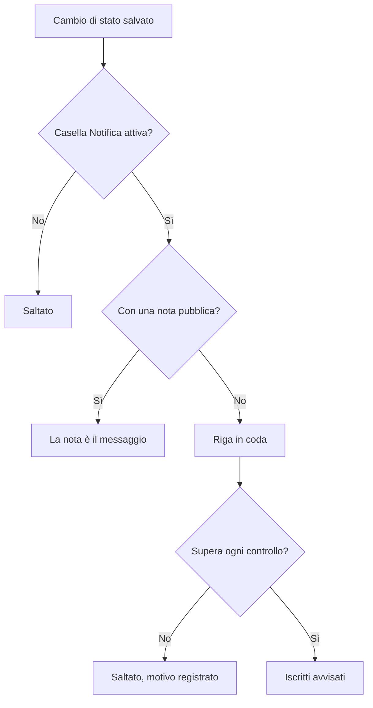

# Stati e gravità degli incidenti

Ogni incidente porta due classificazioni: uno **stato**, che dice a che punto è la vostra risposta, e una **gravità**, che dice quanto fa male. Questa pagina spiega che cosa fa ogni stato, come aggiungere i vostri e come vengono ordinate le gravità — per chi configura gli incidenti, o vuole sapere perché uno ha avvisato o no, si è risolto o no, o è comparso o no su una pagina di stato.

:::cards
- [Aggiungere i vostri stati](#aggiungere-i-vostri-stati): Modellate la vostra risposta, e vedete come conta ogni stato.
- [Che cosa fa il riconoscimento](#che-cosa-fa-il-riconoscimento): Gli avvisi si fermano e lo SLA viene segnato come con risposta.
- [Che cosa fa la risoluzione](#che-cosa-fa-la-risoluzione): I monitor vengono restituiti e lo SLA viene chiuso.
- [Informare gli iscritti](#informare-gli-iscritti-alla-pagina-di-stato-di-un-cambio-di-stato): I controlli che un cambio di stato supera prima che una pagina di stato ne venga informata.
:::

## Come funziona

Nella dashboard, stati e gravità si somigliano — entrambi compaiono come etichette colorate nell'elenco degli incidenti e come un punto colorato prima del nome ovunque ne scegliete uno, ed entrambi sono elenchi del progetto che potete rinominare e ricolorare. Fanno però lavori molto diversi.

Gli stati governano il comportamento. Tre flag booleani sulle righe degli stati, insieme all'ordine degli stati, decidono quali incidenti contano come attivi, quali pulsanti compaiono nell'intestazione dell'incidente, quando si ferma l'orologio dello SLA e quando l'incidente sparisce dalla vostra pagina di stato. Le gravità da sole non governano nulla — sono etichette che descrivono l'impatto, e su cui altre regole possono basarsi.

```mermaid title="Gli incidenti scendono soltanto lungo l'elenco; la posizione di uno stato decide come conta"
flowchart TB
    subgraph open["Conta come non riconosciuto"]
        identified["Identified"]
    end
    subgraph working["Conta come riconosciuto"]
        acknowledged["Riconosciuto"]
        mitigated["Mitigated (personalizzato)"]
    end
    subgraph done["Conta come risolto"]
        resolved["Risolto"]
        closed["Closed (personalizzato)"]
    end
    identified --> acknowledged
    acknowledged --> mitigated
    mitigated --> resolved
    resolved --> closed
    identified -. "saltare avanti" .-> resolved
```

Il modello `IncidentState` ha `name`, `description`, `color` e `order`, più tre booleani: `isCreatedState`, `isAcknowledgedState` e `isResolvedState`. Tutto ciò che il prodotto fa con gli stati si basa su quei booleani e su `order` — mai sul nome dello stato. Ecco perché potete rinominare **Risolto** in «Closed» senza rompere nulla: il flag resta sulla riga.

Il modello `IncidentSeverity` ha `name`, `description`, `color` e `order`, e nient'altro. Non ci sono flag. Nulla in OneUptime tratta di per sé **Critical Incident** diversamente da **Minor Incident** — la gravità conta solo dove le fate puntare qualcosa, come il criterio di corrispondenza **Incidente Gravità** di una regola di reperibilità.

Qualche regola veloce:

- **Scegliete la gravità per comunicare l'impatto** — compare nell'elenco degli incidenti, nella **Panoramica** dell'incidente, ed è un campo obbligatorio quando dichiarate un incidente.
- **Scegliete gli stati per modellare il vostro processo** — i passaggi di risposta che percorrete davvero, nell'ordine in cui li percorrete.
- **Non codificate l'urgenza negli stati** — uno stato chiamato «Critical» non avviserebbe nessuno. Lo fa la gravità insieme a una regola di reperibilità.

> [!TIP]
> Entrambi gli elenchi vengono creati con il vostro progetto, ed entrambi si modificano in **Incidenti → Impostazioni**. Quella sezione del menu laterale di Incidenti è ripiegata per impostazione predefinita, quindi espandete **Impostazioni** prima di cercarli.

## Gli stati predefiniti

Con il progetto vengono creati tre stati, in quest'ordine. La creazione è idempotente — uno stato viene aggiunto solo quando non ne esiste già uno con quel nome.

| Stato              | `order` | Flag                  | Colore    | Che cosa significa                                 |
| ------------------ | ------- | --------------------- | --------- | -------------------------------------------------- |
| **Identified**     | `1`     | `isCreatedState`      | `#fd625e` | Lo stato in cui finiscono i nuovi incidenti.       |
| **Riconosciuto**   | `2`     | `isAcknowledgedState` | `#ffbf53` | Qualcuno ha preso in carico l'incidente.           |
| **Risolto**        | `3`     | `isResolvedState`     | `#2ab57d` | L'incidente è finito e smette di contare come attivo. |

> [!NOTE]
> Il primo stato si chiama **Identified**, anche se diverse descrizioni nel prodotto lo chiamano ancora stato «created». Quando una documentazione o un tooltip dice «stato di creazione», intende lo stato che porta `isCreatedState` — in un progetto nuovo, è **Identified**.

## Che cosa fa davvero ogni flag di stato

| Flag                  | Scopo                                                                                                                                                                                                |
| --------------------- | ---------------------------------------------------------------------------------------------------------------------------------------------------------------------------------------------------- |
| `isCreatedState`      | Lo stato che riceve un incidente quando nessuno ne ha scelto uno. Se nessuno stato del progetto porta questo flag, la creazione di un incidente fallisce con un errore che vi chiede di aggiungere uno stato di creazione dell'incidente dalle impostazioni. |
| `isAcknowledgedState` | Contrassegna lo stato riconosciuto del progetto: quello in cui **Riconosci** porta un incidente e da cui prende nome il riquadro statistico del riconoscimento. Un incidente in questo stato, in qualsiasi stato successivo, o risolto, è riconosciuto — **Riconosci** non gli viene più offerto, la reperibilità smette di avvisare per lui e il suo SLA viene segnato come con risposta. |
| `isResolvedState`     | Contrassegna lo stato risolto del progetto: quello in cui **Risolvi** porta un incidente e che mostra il riquadro statistico della risoluzione. Un incidente in questo stato, o in qualsiasi stato successivo, è risolto — esce da **Incidenti attivi** e dalla sezione attiva di una pagina di stato, e il suo SLA viene segnato come risolto. |

Ci si aspetta che un solo stato per progetto abbia ciascun flag — le ricerche prendono il primo nell'ordine. I tre stati contrassegnati portano l'etichetta **Integrato** nella pagina delle impostazioni; passateci sopra con il mouse (o raggiungetela con Tab) per leggere che cosa fa OneUptime con quello stato. Possono essere rinominati, ricolorati e trascinati, ma:

- **Mantengono il loro ordine.** Lo stato di creazione viene prima di quello riconosciuto, e quello riconosciuto prima di quello risolto. Un trascinamento che lo romperebbe — **Risolto** sopra **Riconosciuto**, ad esempio — viene rifiutato, le righe tornano al loro posto e la pagina dice perché.
- **Non possono essere eliminati.** Il loro **Elimina** resta nel menu della riga, bloccato, con il motivo. Un'eliminazione di massa li salta e li elenca come non eliminati. Anche l'API si rifiuta di eliminare l'ultimo stato di creazione, riconosciuto o risolto di un progetto.

Poiché l'interfaccia legge i nomi degli stati in modo dinamico, rinominare uno stato cambia ciò che vedete ovunque — i riquadri statistici (**Acknowledged in** e **Resolved in** con i nomi predefiniti), la conferma **Segna l'incidente come …** di uno stato personalizzato e l'etichetta nell'elenco degli incidenti seguono il nome che avete dato alla riga.

## Aggiungere i vostri stati

Uno stato che aggiungete è un passaggio della vostra risposta che i tre predefiniti non nominano: «Investigating», «Mitigated», «Monitoring», «Closed».

:::steps
### Aprire l'elenco degli stati

Andate in **Incidenti → Impostazioni → Stato incidente**. La scheda **Incidente Stati** elenca i vostri stati nel loro ordine, una riga ciascuno: una maniglia per trascinarlo, il suo colore e il suo nome, come **Conta come** un incidente in esso, e la sua descrizione. La frase sotto il titolo lo dice chiaramente: gli incidenti scendono soltanto lungo questo elenco.

### Creare lo stato

Fate clic su **Crea: Stato incidente**, nell'intestazione della scheda, e compilate il modulo (campi qui sotto). Il nuovo stato viene aggiunto **appena sopra lo stato risolto** — dove sta la maggior parte degli stati, e mai sotto, dove conterebbe silenziosamente come risolto.

### Trascinarlo al suo posto

Trascinate una riga per la sua maniglia per spostarla. Il nuovo ordine viene salvato quando la rilasciate; non c'è un numero d'ordine da digitare. Da tastiera, mettete il fuoco sulla maniglia, premete Spazio, spostatela con le frecce e premete di nuovo Spazio. La colonna **Conta come** si aggiorna quando rilasciate la riga.
:::

**Modifica** apre lo stesso modulo della creazione. L'ID dello stato si trova sotto **Mostra ID** nel menu della riga.

| Campo           | Obbligatorio | Che cosa fa                                                                                                                                                                                                                                                        |
| --------------- | ------------ | ------------------------------------------------------------------------------------------------------------------------------------------------------------------------------------------------------------------------------------------------------------------ |
| **Nome**        | Sì           | Almeno due caratteri. Il testo segnaposto suggerisce qualcosa come «Investigating».                                                                                                                                                                                |
| **Descrizione** | No           | Testo libero che spiega quando un incidente si trova in questo stato.                                                                                                                                                                                              |
| **Colore**      | Sì           | Già scelto all'apertura del modulo: un colore che nessuno degli stati dell'elenco usa ancora, così un nuovo stato non esce mai dello stesso rosso di quello sopra. Sceglietene un altro dalla fila di colori con nome (Rosso, Arancione, Verde lime, Verde, Verde acqua, Blu, Indaco, Viola, Magenta, Rosa), oppure usate **Colore personalizzato** per un colore del marchio esatto come `#fd625e`. |

Il colore tinge l'etichetta dello stato e il punto prima del suo nome in ogni selettore di stato: i moduli di dichiarazione e di modello, l'azione di massa **Cambia stato**, il menu degli stati nell'intestazione e le condizioni di regole e filtri. Ognuno di quei selettori elenca gli stati nell'ordine in cui li mette questa pagina.

Non potete impostare i tre flag da questo modulo — appartengono alle righe predefinite. Uno stato che aggiungete è quindi uno stato senza flag, il che ha tre conseguenze da tenere presenti:

- **La sua posizione decide come conta.** La colonna **Conta come** lo mostra, e cambia mentre trascinate: sopra lo stato riconosciuto un incidente in esso è **Non riconosciuto**; dallo stato riconosciuto in giù conta come **Riconosciuto**, quindi le policy di reperibilità smettono di inoltrarlo; dallo stato risolto in giù conta come **Risolto**, quindi le pagine di stato smettono di mostrarlo come attivo.
- **Sopra lo stato risolto, mantiene l'incidente attivo.** **Incidenti attivi** contiene gli incidenti il cui stato attuale si trova sopra lo stato risolto, quindi uno stato che aggiungete lì mantiene l'incidente nell'elenco attivo e nel contatore della barra laterale. Uno stato trascinato sotto lo stato risolto conta come risolto ovunque — negli elenchi attivi, nelle pagine di stato, nei promemoria e nello SLA — e farvi passare un incidente da **Risolto** non è una seconda risoluzione.
- **Ci portate un incidente dal menu dell'intestazione.** I pulsanti dell'intestazione sono solo **Riconosci** e **Risolvi**; uno stato personalizzato si trova sotto **Change state to** nel menu **⋯** accanto a loro, che elenca ogni stato dopo quello attuale. La sua conferma si intitola **Segna l'incidente come `<state name>`** con un pulsante di invio **Segna come `<state name>`**.

> [!TIP]
> Una forma comune è un passaggio di mitigazione tra lo stato riconosciuto e quello risolto — create «Mitigated» e finisce appena sopra **Risolto**, dopo **Riconosciuto**, contando come riconosciuto. Per un passaggio di triage prima che qualcuno abbia riconosciuto l'incidente, trascinatelo sopra **Riconosciuto**.

## L'ordine è un vincolo reale, non una preferenza di visualizzazione

L'ordine viene applicato quando viene scritto un cambio di stato, non solo quando viene disegnato l'elenco:

- **Le transizioni all'indietro vengono rifiutate.** Portare un incidente in uno stato che viene prima del suo stato attuale nell'ordine fallisce con un errore che nomina entrambi gli stati.
- **Riselezionare lo stato attuale viene rifiutato.** Mettere un incidente nello stato in cui si trova già fallisce con «Incident state cannot be same as previous state.»
- **Una riga retrodatata non può duplicare la sua vicina.** Anche inserire una riga della cronologia il cui stato coincide con quello della riga che la segue viene rifiutato.
- **I pulsanti dell'intestazione seguono la posizione degli stati contrassegnati nell'ordine.** **Riconosci** e **Risolvi** vengono offerti in base a dove si trova lo stato attuale nell'elenco ordinato. Uno stato personalizzato posto *dopo* lo stato risolto non mostra mai un pulsante **Risolvi**, perché un incidente in esso conta già come risolto.

Quindi, quando aggiungete uno stato, mettetelo dove un incidente ci passerebbe davvero. Ordinarlo male non ha solo un aspetto strano: rende impossibili delle transizioni. Spostare uno stato più in basso cambia il modo in cui contano gli incidenti che vi si trovano già, nel momento in cui lo rilasciate.

Tramite l'API e Terraform l'ordine è la colonna `order`: i numeri più bassi vengono prima. Uno stato creato senza ordine va appena sopra lo stato risolto; uno creato o aggiornato con un numero prende quel posto, e gli stati che lo intralciano scendono di una posizione. I numeri che nessun altro ha vengono mantenuti come scritti, così uno stato gestito con Terraform rilegge il numero che gli è stato dato.

## Le gravità predefinite

Con il progetto vengono create tre gravità, in quest'ordine, dalla più grave:

| Gravità               | `order` | Colore    | Descrizione predefinita                                                                                                                                                                   |
| --------------------- | ------- | --------- | ----------------------------------------------------------------------------------------------------------------------------------------------------------------------------------------- |
| **Critical Incident** | `1`     | `#b70400` | Issues causing very high impact to customers. Immediate response is required. Examples include a full outage, or a data breach.                                                          |
| **Major Incident**    | `2`     | `#fd625e` | Issues causing significant impact. Immediate response is usually required. We might have some workarounds that mitigate the impact on customers. Examples include an important sub-system failing. |
| **Minor Incident**    | `3`     | `#ffbf53` | Issues with low impact, which can usually be handled within working hours. Most customers are unlikely to notice any problems. Examples include a slight drop in application performance. |

La gravità è obbligatoria quando dichiarate un incidente, ed è obbligatoria su ogni specifica di incidente nei criteri di un monitor, così ogni incidente — manuale o automatico — arriva con una gravità. Vedete [Dichiarare un incidente](/docs/incidents/declaring-incidents) per il flusso di dichiarazione e [Modelli di incidenti e avvisi](/docs/monitor/incident-alert-templating) per il percorso guidato dai monitor.

## Modificare le gravità

Andate in **Incidenti → Impostazioni → Gravità incidente**. La stessa forma della pagina degli stati — una riga per gravità, dalla più grave, trascinate una riga per cambiarne il grado, **Crea: Gravità incidente** ne aggiunge una in fondo (la meno grave), con **Nome**, **Descrizione** e **Colore** nel modulo, e il colore già scelto come nel modulo degli stati.

Il grado conta ovunque OneUptime confronti le gravità: un episodio prende la gravità del suo incidente più grave, e i valori Critical e Warning di una raccomandazione di monitor corrispondono alla vostra prima e alla vostra seconda gravità.

Due differenze rispetto agli stati:

- **Non c'è protezione contro l'eliminazione.** Qualsiasi gravità può essere eliminata, comprese le tre predefinite.
- **Non ci sono flag da ereditare, né «Conta come».** Una nuova gravità si comporta esattamente come quelle predefinite — è un'etichetta con un colore e un grado.

Dove la gravità fa più che descrivere: in **Incidenti → Regole → Regole di reperibilità**, il campo **Incidente Gravità** di una regola è un criterio di corrispondenza. Elencarvi **Critical Incident** è il modo in cui si esprime «avvisa il team del database per tutto ciò che è critico» — la policy di reperibilità vive sulla regola, non sulla gravità.

**Cambiare la gravità di un incidente** — con **Modifica** sulla scheda **Dettagli dell'incidente** dell'incidente, tramite l'API o Terraform (`incidentSeverityId`), con un workflow o con gli strumenti di IA — fa le stesse quattro cose in qualunque modo venga inviata: il feed dell'incidente riceve una voce **Incident updated** che nomina la nuova gravità, le scadenze dello SLA dell'incidente vengono ricalcolate, la sua regola di promemoria viene riabbinata, e le metriche degli incidenti contano un cambio di gravità. Salvare la gravità che l'incidente ha già non fa nulla di tutto ciò, quindi modificare solo il titolo di un incidente lascia le sue scadenze SLA, i suoi promemoria e il conteggio dei cambi di gravità come erano. La gravità di un avviso funziona allo stesso modo per la sua voce di feed e i suoi promemoria.

## Far passare un incidente da uno stato all'altro

Un incidente cambia stato in quattro modi:

| Modo                           | Dove                                                                                        | Che cosa chiede                                                                                                                                                                                              |
| ------------------------------ | ------------------------------------------------------------------------------------------- | ------------------------------------------------------------------------------------------------------------------------------------------------------------------------------------------------------------ |
| **Pulsanti dell'intestazione** | L'intestazione dell'incidente: **Riconosci** e **Risolvi**, e **Change state to** nel suo menu **⋯** | Una breve conferma — **Riconosci incidente** o **Risolvi incidente** — con **Notifica gli iscritti alla pagina di stato** e, ripiegata sotto **Aggiungi una nota pubblica**, la **Nota pubblica** facoltativa e il suo selettore **Seleziona modello di nota** (quando il progetto ha modelli di note). |
| **Cronologia stato**           | **Cronologia stato** nel menu laterale dell'incidente                                       | Una riga aggiunta a mano, con **Stato dell'incidente**, **Inizia il** e **Notifica gli iscritti alla pagina di stato**.                                                                                     |
| **Modifica di massa**          | **Cambia stato** su una selezione nell'elenco degli incidenti                               | Una pagina con lo stato, **Notifica gli iscritti alla pagina di stato** e lo stesso **Aggiungi una nota pubblica** ripiegato.                                                                               |
| **Automaticamente**            | Un criterio di monitor, o il vostro codice                                                  | Un criterio con **Risoluzione automatica dell'incidente** attiva risolve il suo incidente quando il criterio non è più soddisfatto. L'API cambia lo stato creando una riga in `/api/incident-state-timeline`. |

Se lo stato attuale viene prima dello stato riconosciuto, l'intestazione offre **Riconosci** e **Risolvi**; se si trova tra i due, solo **Risolvi**. Il riconoscimento ferma anche qualsiasi inoltro di reperibilità dell'incidente.

Ognuno di questi modi scrive una riga della cronologia. Un cambio di stato fa anche alcune cose che non dovete chiedere: pubblica una voce nel feed dell'incidente, assegna un Comandante dell'incidente se l'incidente non ne ha ancora uno, e aggiorna l'orologio dello SLA. Riaprire un incidente risolto avvia un nuovo record SLA dall'ora di riapertura.

## Che cosa fa il riconoscimento

Un incidente è riconosciuto dal momento in cui passa nel vostro stato riconosciuto, in qualsiasi stato successivo — uno stato **Mitigated** o **Investigating** che avete messo sotto **Riconosciuto** — o in uno stato risolto, in qualunque dei quattro modi sopra venga spostato. La colonna **Conta come** della pagina delle impostazioni degli stati mostra quali sono questi stati. Una volta riconosciuto:

- **Riconosci non viene più offerto.** Né nell'intestazione dell'incidente, né nell'app mobile (il suo pulsante e il suo scorrimento), né in Slack o Microsoft Teams, né tramite `acknowledge_incident` del server MCP di OneUptime. Riconoscerlo comunque — da un avviso di reperibilità, da Slack o da Teams — viene rifiutato con «Incident is already acknowledged.» (o «Incident is already resolved.»), invece di riportarlo indietro nel suo elenco.
- **La reperibilità smette di avvisare per lui.** Un responder che riconosce il proprio avviso dopo che un collega ha riconosciuto l'incidente, o l'ha fatto avanzare, vede il proprio avviso riconosciuto e l'incidente resta dov'è.
- **Lo SLA viene segnato come con risposta**, al primo spostamento di questo tipo; avanzare poi attraverso stati successivi mantiene quell'ora.
- **Il tempo di riconoscimento corre fino a quel primo spostamento** — il riquadro statistico della **Panoramica** dell'incidente, la metrica **Time to Acknowledge**, una misurazione che termina quando **L'incidente viene riconosciuto**, e l'MTTA nei riepiloghi di Slack e Microsoft Teams. Un incidente passato direttamente da **Identified** a **Investigating** è stato riconosciuto allora; uno risolto subito è stato riconosciuto al momento della risoluzione.
- **Un filtro Riconosciuto** — sul widget dell'elenco degli incidenti di una dashboard, ad esempio — mostra gli incidenti nel vostro stato riconosciuto e in qualsiasi stato successivo, prima della risoluzione.

Avvisi ed episodi seguono la stessa regola, con i vostri stati degli avvisi.

## Che cosa fa la risoluzione

Un incidente viene risolto quando passa da uno stato sopra il vostro stato risolto allo stato risolto, o a qualsiasi stato successivo — in qualunque dei quattro modi sopra venga spostato. Ogni risoluzione:

- **Restituisce i monitor che l'incidente trattiene.** Un incidente dichiarato aperto trattiene i suoi monitor: li ha messi nel suo stato **Cambia lo stato del monitor in**, quando ne nomina uno, e, se dichiarato a mano, ne ha sospeso il monitoraggio. Una modifica mentre è aperto — aggiungere monitor, o cambiare quello stato — gli fa trattenere anche quelli. La risoluzione riprende il loro monitoraggio e li riporta a operativi, a meno che un altro incidente aperto li riguardi ancora, e da quel momento l'incidente non trattiene più nulla. Quindi un incidente dichiarato già risolto non restituisce nulla, e nemmeno una seconda risoluzione dopo una riapertura: uno stato che i suoi monitor hanno ricevuto nel frattempo — dalle loro sonde, da una manutenzione o impostato a mano — resta.
- **Segna lo SLA come risolto** e, quando le bozze di post-mortem di OneUptime AI sono attive, stende un post-mortem.

Passare da **Risolto** a uno stato successivo — **Closed**, ad esempio — non è una seconda risoluzione: nulla di tutto ciò viene eseguito di nuovo, e non parte alcuno SLA nuovo. Un incidente dichiarato prima che OneUptime iniziasse a registrare questo restituisce i suoi monitor alla prossima risoluzione, come prima.

## La cronologia degli stati

La pagina **Cronologia stato** nel menu laterale dell'incidente è la traccia di audit di ogni stato in cui è stato l'incidente. La scheda di quella pagina si intitola **Cronologia di stato**, ed è ordinata dalla più recente.

| Colonna                         | Che cosa mostra                                                                                                                                                                                                                                                |
| ------------------------------- | -------------------------------------------------------------------------------------------------------------------------------------------------------------------------------------------------------------------------------------------------------------- |
| **Stato dell'incidente**        | Un'etichetta colorata con il nome e il colore dello stato.                                                                                                                                                                                                     |
| **Inizia il**                   | Quando l'incidente è entrato in questo stato.                                                                                                                                                                                                                  |
| **Termina il**                  | Quando ne è uscito. Lo stato attuale mostra `Currently Active`.                                                                                                                                                                                                |
| **Durata**                      | Il tempo passato nello stato, contato fino ad adesso per quello attuale.                                                                                                                                                                                       |
| **Stato notifica iscritto**     | Se la notifica della pagina di stato per questo cambiamento è stata inviata, saltata o è ancora in attesa, con un link **maggiori dettagli** e — quando l'invio è fallito — un'azione **Riprova**. **Riprova** invia di nuovo il cambio di stato a ogni pagina di stato che l'incidente raggiunge adesso, compresi gli iscritti che l'hanno già ricevuto. |

Ogni riga ha due azioni:

- **Visualizza causa** — apre una finestra **Causa principale** che mostra il Markdown registrato con quel cambio di stato.
- **Visualizza log** — apre una finestra che spiega perché lo stato è cambiato, con un visualizzatore **Log dello stato dell'incidente**.

Nella dashboard, le righe della cronologia possono essere aggiunte ed eliminate, ma non modificate; un incidente mantiene sempre almeno una riga. Tramite l'API, lo `startsAt` di una riga può essere corretto, e ogni misurazione calcolata dalla cronologia lo segue.

> [!WARNING]
> Eliminare la riga sbagliata riscrive la storia dell'incidente, quindi trattatelo come uno strumento di correzione e non come un'abitudine di pulizia.

## L'elenco Incidenti attivi

**Incidenti → Incidenti attivi** è l'elenco che tenete d'occhio durante un turno. La sua definizione è esattamente una condizione: lo stato attuale dell'incidente si trova sopra il vostro stato risolto — il primo stato nell'ordine contrassegnato con `isResolvedState`. Non si considera nient'altro — né la gravità, né l'età, né se qualcuno l'ha riconosciuto.

La voce del menu laterale porta un badge rosso con un contatore che usa la stessa query, così il badge e l'elenco coincidono sempre. Quando non c'è niente da vedere, la pagina lo dice.

La conseguenza pratica: uno stato personalizzato che aggiungete sopra lo stato risolto mantiene gli incidenti in questo elenco — «Mitigated» non significa «finito» — e uno che mettete dopo li toglie, come fa lo stato risolto. Avvisi ed episodi seguono la stessa regola con i propri stati, e i contatori del menu laterale, i promemoria, le pagine di stato e l'app mobile la leggono tutti.

## Informare gli iscritti alla pagina di stato di un cambio di stato

Un cambio di stato può avvisare gli iscritti alla vostra pagina di stato, ma passa attraverso diversi controlli. Capirli risparmia parecchie indagini del tipo «perché nessuno è stato avvisato».



La notifica viene richiesta per ogni riga della cronologia da **Notifica gli iscritti alla pagina di stato** (`shouldStatusPageSubscribersBeNotified`), la casella di controllo della finestra di cambio di stato e del modulo manuale della cronologia. Nella finestra di cambio di stato parte disattivata quando l'incidente è stato dichiarato senza avvisare gli iscritti. La stessa casella decide anche se la nota pubblica della finestra avvisa qualcuno. Quando è disattivata, la riga viene salvata con uno stato saltato e una spiegazione. Quando è attiva, la riga viene messa in coda e un'attività in background la prende in carico — l'attività gira ogni minuto, quindi la consegna è rapida ma non istantanea.

**La riga in coda viene poi saltata quando vale una qualsiasi di queste condizioni:**

- **Il nuovo stato è lo stato di creazione.** Gli iscritti sono già stati informati quando l'incidente è stato dichiarato, quindi la prima riga della cronologia volutamente non invia un secondo messaggio.
- **L'incidente non ha monitor collegati.** Senza risorse, non c'è alcuna pagina di stato su cui collocare l'incidente.
- **L'incidente non è visibile sulla pagina di stato** (`isVisibleOnStatusPage` è disattivato).
- **La pagina di stato ha gli incidenti disattivati** (`showIncidentsOnStatusPage` è disattivato). Questo vale per singola pagina di stato — le altre pagine che mostrano lo stesso monitor vengono comunque avvisate.
- **La pagina di stato è fuori dall'ambito dell'incidente.** Un incidente limitato ad alcune pagine di stato con **Limita a queste pagine di stato** avvisa solo quelle pagine tra quelle che elencano i suoi monitor, e una pagina con **Mostra solo gli incidenti limitati a questa pagina** attivo non viene mai avvisata di un incidente che non è limitato a essa. Anche questo vale per singola pagina di stato. Vedete [Una pagina di stato per pubblico](/docs/status-pages/one-status-page-per-audience).

**Un'altra cosa che cambia l'esito.** Se scrivete una **Nota pubblica** nella finestra di cambio di stato (sotto **Aggiungi una nota pubblica**) o nell'azione di massa **Cambia stato** mentre **Notifica gli iscritti alla pagina di stato** è attiva, la riga della cronologia viene segnata come già notificata invece di essere messa in coda, e il suo messaggio di stato dice che l'ha portata la nota. È la nota stessa a raggiungere gli iscritti, così ricevono un messaggio invece di due. Una nota che contiene solo spazi non viene pubblicata, e la riga viene messa in coda come di consueto. I cambi di stato della manutenzione programmata funzionano allo stesso modo. Il tipo di evento dietro il semplice messaggio di cambio di stato è `Subscriber Incident State Changed`.

**La nota dice in che stato è ora l'incidente.** Poiché la nota è l'unico messaggio, nomina il nuovo stato su ogni canale, come avrebbe fatto il messaggio di cambio di stato: l'oggetto dell'e-mail è `[Resolved Incident] <title>` e i suoi dettagli mostrano una riga **Stato** nel colore dello stato, l'SMS dice `Incident <title> on <status page> is Resolved.`, i messaggi Slack e Microsoft Teams portano una riga `**Status:** Resolved`, e il payload `IncidentNoteCreated` del webhook porta `incidentState` in `data`. Una nota pubblicata da sola mantiene il suo messaggio consueto, così come la notifica di aggiornamento di una modifica.

**Pubblicare la nota richiede un permesso a sé.** Cambiare lo stato e pubblicare una nota pubblica sono permessi distinti (**Create Incident State Timeline** e **Create Incident Status Page Note** in un ruolo personalizzato; i ruoli integrati di incidente e di progetto li hanno entrambi). Cambiare lo stato non richiede il permesso di modificare l'incidente: vedete [Cambiare uno stato](/docs/permissions/index#cambiare-uno-stato). A chi può cambiare lo stato di un incidente ma non pubblicare note pubbliche non viene offerto **Aggiungi una nota pubblica** nella finestra né nell'azione di massa **Cambia stato**. Un cambio di stato che invia con una nota tramite l'API viene rifiutato per intero, con un messaggio che dice che lo stato non è stato cambiato e perché, così un cambiamento non viene mai registrato come comunicato da una nota che non è mai stata pubblicata. Senza la nota, il cambiamento passa. Avvisi, episodi di avvisi ed episodi di incidenti offrono invece una nota privata con un cambio di stato (**Aggiungi una nota privata**), e funziona allo stesso modo: pubblicarla richiede il permesso proprio della nota (**Create Alert Internal Note**, **Create Alert Episode Internal Note** o **Create Incident Episode Internal Note** in un ruolo personalizzato; i ruoli integrati di avviso, di incidente e di progetto li hanno), e un cambio di stato inviato con una nota privata da qualcuno che non ce l'ha viene rifiutato per intero, quindi lo stato non cambia.

**Inviato significa inviato a ogni iscritto.** L'attività attende ogni messaggio e lo conta come inviato o non riuscito, per pagina di stato e canale, e il messaggio di stato della riga elenca questi conteggi. Un solo messaggio non riuscito, o un invio scaduto o interrotto, rende la riga **Non riuscito**. Vedete [Iscritti e annunci](/docs/status-pages/subscribers).

Per sapere chi riceve questi messaggi e come vengono scelti i modelli, vedete [Iscritti e annunci](/docs/status-pages/subscribers).

## Tenere un incidente fuori dalla pagina di stato

Quattro cose distinte decidono se un incidente compare su una pagina pubblica, e tutte e quattro devono essere vere:

- **Mostra incidenti** (`showIncidentsOnStatusPage`) sulla pagina di stato stessa.
- **Visibile sulla pagina di stato** (`isVisibleOnStatusPage`) sull'incidente — un interruttore della pagina **Impostazioni** dell'incidente. Vale true per impostazione predefinita e non si trova nella procedura guidata di dichiarazione; un criterio di monitor può impostarlo con **Mostra incidente sulla pagina di stato**. Un incidente dichiarato nascosto non avvisa alcun iscritto quando viene creato; quando in seguito attivate questo interruttore, il modulo di modifica offre **Notifica agli iscritti che questo incidente è stato creato**. Vedete [Dichiarare un incidente](/docs/incidents/declaring-incidents).
- **La pagina è alla portata dell'incidente.** La pagina elenca uno dei monitor dell'incidente e, se l'incidente è limitato ad alcune pagine di stato, è una di queste. Una pagina con **Mostra solo gli incidenti limitati a questa pagina** attivo mostra solo gli incidenti limitati a essa. Vedete [Una pagina di stato per pubblico](/docs/status-pages/one-status-page-per-audience).
- **Lo stato attuale si trova sopra lo stato risolto.** È questo che toglie un incidente dalla sezione attiva: la query della pagina di stato recupera gli incidenti il cui stato attuale è sopra il vostro stato risolto, quindi lo stato risolto e qualsiasi stato successivo tolgono l'incidente. Non archiviate né chiudete nulla — lo risolvete, e passa nello storico.

**Gli incidenti privati non compaiono mai.** Attivare **Incidente privato** nasconde l'incidente da ogni pagina di stato, indipendentemente dagli interruttori qui sopra, e lo riserva ai suoi proprietari più gli amministratori e i proprietari del progetto. Nulla di esso raggiunge nemmeno un iscritto alla pagina di stato: né la sua creazione, né i suoi cambi di stato, né le sue note pubbliche, né il suo post-mortem. Le immagini della sua descrizione, del suo post-mortem, dei suoi campi personalizzati e delle sue note pubbliche non sono visibili a tutti finché è privato.

I due interruttori vengono tenuti allineati, così la pagina **Impostazioni** dell'incidente mostra sempre ciò che fanno le pagine di stato:

- Rendere privato un incidente disattiva insieme **Visibile sulla pagina di stato**.
- Attivare **Visibile sulla pagina di stato** mentre l'incidente resta privato lo lascia disattivato. Per pubblicare un incidente privato, disattivate **Incidente privato** e attivate **Visibile sulla pagina di stato** — in un unico salvataggio, o uno dopo l'altro.

Questo vale in qualunque modo venga scritto l'incidente: la dashboard, l'API, Terraform, un workflow, un monitor, un modello di incidente o una regola di privacy. Un valore inviato come testo, come `"true"`, conta quanto `true`. Una scrittura su molti incidenti che attiva **Visibile sulla pagina di stato** — l'**Update Many** di un workflow, ad esempio — mostra quelli che non sono privati e lascia nascosto ogni incidente privato. Ogni incidente viene deciso così com'è quando la scrittura lo raggiunge, così un cambiamento della sua privacy che arriva nello stesso momento non viene mai sovrascritto: un incidente non viene mai salvato privato e visibile insieme. Un incidente creato privato viene creato nascosto, e non avvisa alcun iscritto della sua creazione.

**Gli episodi seguono la stessa regola.** Un episodio di incidente privato è nascosto da ogni pagina di stato, qualunque cosa dica il suo interruttore **Visibile sulla pagina di stato**, e i suoi iscritti non vengono informati di nulla. Nella pagina **Impostazioni** dell'episodio, l'interruttore lo dice, e resta disattivato finché l'episodio è privato. Un incidente privato non porta mai il suo episodio su una pagina di stato: un episodio raggiunge una pagina solo attraverso incidenti che non sono privati.

:::details Aggiornare da una versione senza queste regole
Gli incidenti e gli episodi salvati come privati con **Visibile sulla pagina di stato** ancora attivo, da prima di queste regole, se lo vedono disattivare all'aggiornamento. Non viene inviato nulla a nessuno. Le immagini che un incidente o episodio del genere aveva reso visibili a tutti tornano private, a meno che qualcosa che mostrano le vostre pagine di stato le contenga ancora. Lo stesso vale per le immagini nelle note pubbliche di incidenti, episodi ed eventi di manutenzione programmata che le vostre pagine di stato non mostrano, che prima restavano visibili a tutti.
:::

Quanto storico risolto conserva la pagina è un'impostazione della pagina di stato, non dell'incidente. Vedete [Risorse e gruppi della pagina di stato](/docs/status-pages/resources-and-groups) per come i monitor della pagina decidono quali incidenti compaiono.

## Passaggi successivi

:::cards
- [Dichiarare un incidente](/docs/incidents/declaring-incidents): Scegliete uno stato di partenza e una gravità quando dichiarate.
- [Note, proprietari e feed degli incidenti](/docs/incidents/notes-owners-and-feed): Pubblicate la nota pubblica che accompagna un cambio di stato.
- [Impostazioni e automazione degli incidenti](/docs/incidents/settings): Misurate il tempo tra gli stati, e usate le gravità nelle regole.
- [Iscritti e annunci](/docs/status-pages/subscribers): Chi riceve i messaggi che invia un cambio di stato.
:::
