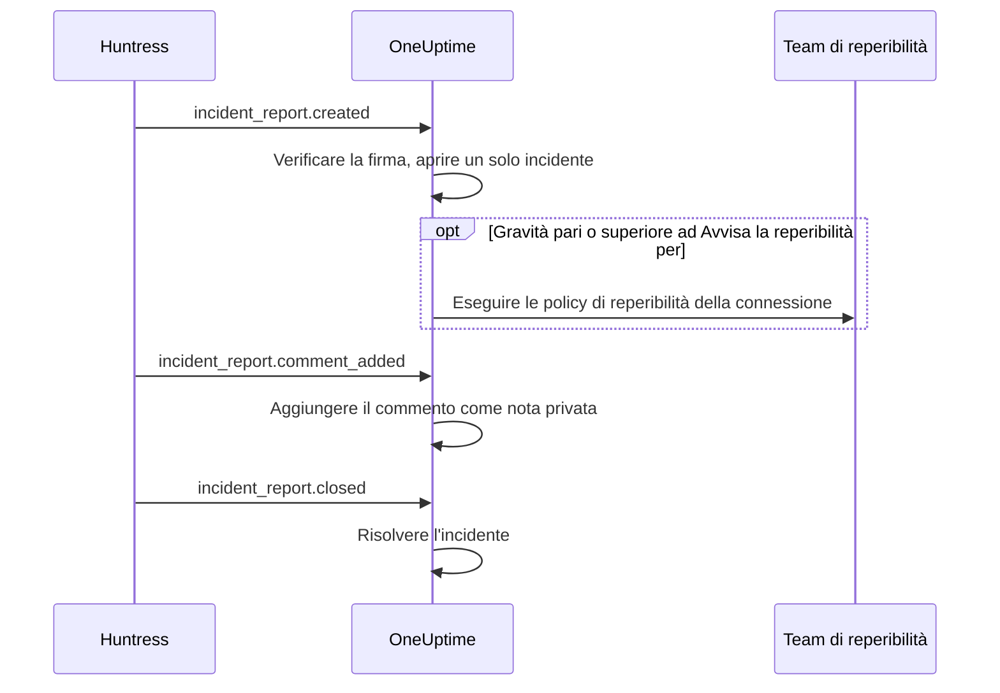

# Integrazione con Huntress

Avvisa il tuo team di reperibilità per i report di incidente di Huntress. Quando il SOC di Huntress invia un report di incidente su un endpoint o un'identità, OneUptime apre un solo incidente per quel report, con la gravità che scegli, avvisa le policy di reperibilità che indichi e risolve l'incidente quando il report viene chiuso in Huntress.

Questa integrazione è **in entrata**: Huntress invia ogni evento di un report di incidente a un URL di webhook che ti dà OneUptime, firmato con il segreto di firma dell'endpoint. OneUptime non chiama mai Huntress, quindi non serve nessuna chiave API di Huntress.

:::cards
- [Come funziona](#come-funziona): Cosa fa OneUptime con ogni evento di un report.
- [Configurazione](#configurare-lintegrazione): Collegare in OneUptime, aggiungere l'endpoint in Huntress, salvare il suo segreto di firma, inviare un test.
- [Impostazioni](#impostazioni): Avvisi, gravità, organizzazioni, etichette e risoluzione.
- [Risoluzione dei problemi](#risoluzione-dei-problemi): Cosa significano gli errori della connessione e cosa cambiare.
:::

## Come funziona

Huntress invia un evento su un report di incidente quando il report viene inviato, quando qualcuno lo commenta e quando viene chiuso. Ogni evento contiene il report completo.

1. **Verificare.** Una richiesta deve essere firmata con il segreto di firma dell'endpoint, non più di cinque minuti prima del suo arrivo. Tutto il resto viene rifiutato, e la pagina della connessione dice perché.
2. **Aprire un solo incidente.** Il primo evento di un report apre un incidente intitolato al report, ad esempio `Huntress: Incident on DESKTOP-01 (Acme Corp)`. La sua descrizione contiene il riepilogo del report, la sua gravità in Huntress, l'organizzazione, l'host o l'identità coinvolti, gli indicatori trovati da Huntress e un link al report in Huntress. Gli eventi successivi dello stesso report, e le consegne che Huntress invia di nuovo, trovano quell'incidente: un report non ne apre mai due.
3. **Avvisare.** L'incidente si apre con la gravità di incidente che la connessione assegna alla gravità Huntress del report. Quando questa gravità è pari o superiore ad **Avvisa la reperibilità per**, vengono eseguite le **Policy di reperibilità** della connessione.
4. **Seguire il report.** Un commento aggiunto in Huntress diventa una nota privata sull'incidente. Quando il report viene chiuso o archiviato, l'incidente viene risolto.

Gli incidenti aperti così non compaiono mai su una pagina di stato. Le tue regole sugli incidenti (di reperibilità, dei proprietari, delle etichette e della privacy) si applicano a loro come a qualsiasi altro incidente.

## Prima di iniziare

- In OneUptime, il ruolo **Project Owner** o **Project Admin**. I membri, i visualizzatori e i ruoli degli incidenti vedono la connessione e i report ricevuti, ma non possono modificarla.
- In Huntress, il ruolo **Account Admin**: solo gli amministratori dell'account possono aggiungere webhook.
- Una policy di reperibilità da avvisare. Senza, i report aprono incidenti e non avvisano nessuno, a meno che una regola di reperibilità degli incidenti non li riguardi.
- Per un'installazione self-hosted, un OneUptime che Huntress raggiunga da internet via HTTPS: Huntress invia webhook solo a URL `https://`.

## Configurare l'integrazione

:::steps
### Collegare Huntress in OneUptime

Apri **Incidenti → Integrazioni → Huntress** (`/dashboard/{projectId}/incidents/integrations/huntress`). La sezione **Integrazioni** del menu laterale degli incidenti è chiusa per impostazione predefinita, quindi aprila prima. Fai clic su **Collega Huntress**.

Scegli le **Policy di reperibilità** da avvisare. **Avvisa la reperibilità per** chiede allora quali report le avvisano, e parte da **Report alti e critici**. Tutto il resto attende in **Altri campi** con un valore predefinito (vedi [Impostazioni](#impostazioni)). Fai clic su **Collega Huntress**. Si apre la pagina della connessione, con una scheda **Collega Huntress** che ti guida nei tre passaggi successivi.

### Aggiungere un endpoint webhook in Huntress

Nella pagina della connessione, fai clic su **Copia URL del webhook**. L'URL ha la forma `https://oneuptime.com/api/huntress/webhook/<connection-id>`; in un'installazione self-hosted inizia con il tuo host.

In Huntress, apri il menu in alto a destra e scegli **Integrations**. Fai clic su **Add an Integration**, scegli **Webhooks** e fai clic su **Add Endpoint**. Incolla l'URL, attiva **Incident Reports** e salva. Lascia disattivati **Escalations**, **Platform Actions** e **Account Notices**: OneUptime accetta quegli eventi e non ne fa nulla.

### Salvare il segreto di firma dell'endpoint

In Huntress, apri il menu dell'endpoint (⋯) e scegli **View Signing Secret**. Copialo per intero: inizia con `whsec_`. Nella pagina della connessione, fai clic su **Salva segreto di firma**, incollalo e fai clic su **Salva segreto di firma**. Il segreto viene cifrato e non viene più mostrato.

Finché il segreto non è salvato, OneUptime rifiuta ogni richiesta all'URL. Huntress invia di nuovo più tardi un evento rifiutato, quindi un evento rifiutato ora arriva comunque.

### Inviare un test

In Huntress, apri il menu dell'endpoint (⋯) e scegli **Send Test**. In pochi secondi, la scheda nella pagina della connessione diventa **Connessione**, con lo stato **Riceve report**.

> [!NOTE]
> Qualunque cosa contenga il test, la connessione mostra che è arrivato. Un test che contiene un report di incidente apre un incidente come qualsiasi altro report, e avvisa la reperibilità se è abbastanza grave.
:::

## Impostazioni

**Collega Huntress** chiede solo chi viene avvisato e per quali report. Tutto il resto attende in **Altri campi**, con un valore predefinito adatto alla maggior parte dei team. Per cambiare un'impostazione in seguito, fai clic su **Modifica impostazioni** nella scheda **Impostazioni** della connessione.

| Impostazione | Cosa fa | Predefinito |
| --- | --- | --- |
| **Policy di reperibilità** | Le policy eseguite quando un report è abbastanza grave. Lasciala vuota per aprire incidenti senza avvisare nessuno. | Nessuna |
| **Avvisa la reperibilità per** | Quali report avvisano le policy: **Solo report critici**, **Report alti e critici** o **Tutti i report**. Ogni report apre comunque un incidente. | **Report alti e critici** |
| **Nome** | Come si chiama la connessione in OneUptime. | `Huntress` |
| **Gravità per i report critici**, **Gravità per i report alti**, **Gravità per i report bassi** | La gravità di incidente con cui si apre ogni gravità di Huntress. | Le tue tre gravità di incidente più alte, in ordine |
| **Solo queste organizzazioni** | Le organizzazioni Huntress i cui report aprono incidenti, un nome o ID di organizzazione per riga. I nomi ignorano maiuscole e minuscole. | Vuoto: tutte le organizzazioni |
| **Etichette** | Etichette aggiunte a ogni incidente, oltre a quella con il nome dell'organizzazione del report. | Nessuna |
| **Risolvi quando Huntress chiude il report** | Risolvere l'incidente quando il suo report viene chiuso o archiviato in Huntress. Se disattivato, lo indica invece una nota privata sull'incidente. | Attivato |

### Gravità

Huntress assegna a ogni report di incidente una di tre gravità. A meno che tu non scelga una gravità di incidente per una di esse, il report si apre secondo l'ordine delle tue gravità di incidente, come le elenca **Incidenti → Impostazioni → Gravità incidente**:

| Gravità in Huntress | Cosa intende Huntress | Gravità di incidente |
| --- | --- | --- |
| Critical | Attaccanti attivi alla tastiera, malware pericoloso o compromissione in corso, da contenere subito. | La più alta |
| High | Malware confermato che richiede una correzione urgente, o una compromissione dell'identità su cui agire. | La seconda |
| Low | Programmi potenzialmente indesiderati, residui di malware e rilevamenti meno recenti sulle identità. | La terza |

Un progetto con meno gravità usa la più bassa per le restanti. Un report senza gravità viene trattato come alto. Se una gravità che hai scelto viene eliminata, decide di nuovo l'ordine.

### Organizzazioni

Ogni incidente riceve un'etichetta con il nome dell'organizzazione Huntress del report, ad esempio _Acme Corp_. Una connessione riceve i report di tutte le organizzazioni del tuo account Huntress, e **Solo queste organizzazioni** li restringe.

> [!TIP]
> Per avvisare il team di ogni cliente, lascia vuote le **Policy di reperibilità** della connessione e aggiungi una regola di reperibilità degli incidenti per organizzazione, ad esempio «Se **Etichette dell'incidente** ha uno qualsiasi di _Acme Corp_», che esegua la policy di quel cliente. Vedi [Regole di reperibilità degli incidenti](/docs/incidents/settings#regole-di-reperibilità-degli-incidenti).

## I report nella pagina della connessione

L'elenco **Report di incidente** della connessione mostra ogni report inviato da Huntress, dal più recente: l'host o l'identità coinvolti, la gravità e lo stato in Huntress, e l'**Esito**.

| Esito | Cosa è successo |
| --- | --- |
| **Incidente aperto** | Il report ha aperto un incidente. **Vedi incidente** lo apre; **Reperibilità avvisata** indica che la connessione ha avvisato le sue policy. |
| **Incidente risolto** | Huntress ha chiuso il report e il suo incidente è stato risolto. |
| **Ignorato: organizzazione non monitorata** | L'organizzazione del report non è in **Solo queste organizzazioni**. |
| **Ignorato: già chiuso in Huntress** | Il report era già chiuso la prima volta che OneUptime ne ha avuto notizia. |

Un report ignorato resta ignorato anche se cambi le impostazioni in seguito. Quando **Risolvi quando Huntress chiude il report** è disattivato, un report chiuso mantiene l'esito **Incidente aperto**.

## Sicurezza

- **Solo richieste firmate.** OneUptime verifica le intestazioni `svix-id`, `svix-timestamp` e `svix-signature` inviate da Huntress rispetto al corpo della richiesta così com'è arrivato. Una richiesta non firmata con il segreto salvato, o firmata più di cinque minuti prima o dopo, viene rifiutata.
- **Il segreto resta segreto.** Viene conservato cifrato, l'API non lo restituisce mai e non viene più mostrato. **Sostituisci segreto di firma** nella pagina della connessione ne salva un altro, ad esempio il segreto di un nuovo endpoint.
- **L'URL è un indirizzo, non una password.** Identifica la connessione; viene elaborata solo una richiesta firmata con il segreto dell'endpoint.
- **Un endpoint per connessione.** Ogni connessione ha il proprio URL e il proprio segreto. Per ricevere i report di un secondo account Huntress, collega di nuovo.

## Usare invece l'email

Huntress invia i report di incidente anche via email, e un [monitor delle email in arrivo](/docs/monitor/incoming-email-monitor) può aprire incidenti da quelle email, ad esempio quando l'oggetto contiene `Critical Incident Report`. Tratta però le email come lo stato di un solo monitor: finché il suo incidente è aperto, il report successivo non ne apre nessuno, e l'incidente viene risolto dai criteri del monitor e non quando Huntress chiude il report. La connessione Huntress apre un incidente per report e risolve ciascuno con il suo report, quindi è da preferire. Appena la connessione riceve report, smetti di inviare le email al monitor, altrimenti ogni report avvisa due volte.

## Risoluzione dei problemi

Quando OneUptime rifiuta una richiesta, la pagina della connessione ne mostra il motivo in **L'ultima richiesta è stata rifiutata**. In Huntress, **View Delivery Attempts** nel menu dell'endpoint (⋯) elenca ogni consegna con la risposta di OneUptime.

:::details "A request arrived but was refused, because no signing secret is saved for this connection yet"
Salva il segreto di firma dell'endpoint: vedi [Configurare l'integrazione](#configurare-lintegrazione). Huntress invia di nuovo la richiesta rifiutata.
:::

:::details "The request's signature does not match the signing secret"
Il segreto salvato non è quello di questo endpoint. Ogni endpoint ha il suo: in Huntress, apri il menu dell'endpoint (⋯), scegli **View Signing Secret**, copialo per intero e salvalo con **Sostituisci segreto di firma**.
:::

:::details "The request was signed more than five minutes from now"
Gli orologi di Huntress e del tuo server OneUptime differiscono di più di cinque minuti, oppure la richiesta è una ripetizione. In un'installazione self-hosted, controlla che l'orologio del server sia corretto.
:::

:::details "No Huntress connection has this address."
La connessione è stata eliminata, oppure l'URL dell'endpoint in Huntress non è quello della connessione. Fai clic su **Copia URL del webhook** nella pagina della connessione e incolla di nuovo l'URL nell'endpoint in Huntress.
:::

:::details "This project has no incident severities, so a Huntress report cannot open an incident"
Aggiungine una in **Incidenti → Impostazioni → Gravità incidente**. Huntress invia di nuovo il report.
:::

:::details Nessuno è stato avvisato
Un report sotto **Avvisa la reperibilità per** apre un incidente senza avvisare. Nell'elenco **Report di incidente**, **Reperibilità avvisata** sotto l'esito di un report indica che la connessione ha avvisato. La pagina **Esecuzioni di reperibilità** dell'incidente mostra cosa ha fatto ogni policy.
:::

## Passi successivi

:::cards
- [Regole di reperibilità degli incidenti](/docs/incidents/settings#regole-di-reperibilità-degli-incidenti): Avvisare il team di ogni organizzazione, tramite la sua etichetta.
- [Stati e gravità degli incidenti](/docs/incidents/states-and-severities): Ordinare le gravità con cui si aprono i report di Huntress.
- [Regole di escalation](/docs/on-call/escalation-rules): Decidere chi viene avvisato e quando l'avviso passa oltre.
- [Panoramica delle integrazioni](/docs/integrations/index): Gli altri strumenti che puoi collegare.
:::
