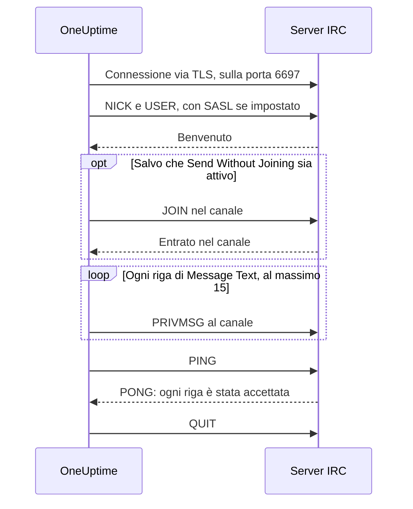

# Integrazione con IRC

Pubblica gli aggiornamenti degli incidenti in un canale di qualsiasi rete IRC: Libera.Chat, OFTC o un server tuo.

IRC non ha webhook, quindi il passo di workflow **Send Message to IRC** di OneUptime si collega da sé al server, come qualsiasi client IRC. Non c'è niente da installare e nessuna app da registrare. Questa integrazione è **in uscita**: OneUptime pubblica nel canale e non legge quello che vi si dice.

:::cards
- [Come funziona](#come-funziona): Che cosa dice al server un'esecuzione del passo.
- [Configurazione](#configurare-lintegrazione): Server e canale, password, poi il workflow: dal modello o da zero.
- [Suggerimenti](#suggerimenti): Pubblicare senza entrare, SASL, messaggi lunghi e raffiche.
- [Risoluzione dei problemi](#risoluzione-dei-problemi): Che cosa significano gli errori del passo e che cosa cambiare.
:::

## Come funziona

Ogni esecuzione del passo tiene una breve conversazione con il server IRC, come farebbe un client IRC, e poi riaggancia.

1. **Collegarsi.** Il passo si collega via TLS sulla porta `6697` e controlla il certificato del server.
2. **Registrarsi.** Si registra come `OneUptime`, a meno che tu non imposti un altro **Nickname**, e accede con SASL quando **SASL Username** e **SASL Password** sono compilati.
3. **Entrare.** Entra nel canale, salvo che **Send Without Joining** sia attivo, con la **Channel Key** se il canale ne ha una.
4. **Inviare.** Ogni riga di **Message Text** esce come un messaggio IRC a sé, un `PRIVMSG`.
5. **Confermare.** IRC non dice mai «consegnato», quindi il passo invia un `PING` e aspetta il `PONG` del server. Un server risponde in ordine, quindi a quel punto qualsiasi rifiuto del messaggio è già arrivato.
6. **Uscire.** Lascia il server.

Il passo prende l'uscita **Successo** appena il server ha accettato ogni riga. Prende **Errore**, con il motivo nelle parole del server quando le ha date, quando il server non è raggiungibile oppure rifiuta la connessione, il nickname, una password, il canale o il messaggio.

## Prima di iniziare

- Su OneUptime Cloud, il piano **Growth** o uno superiore: i workflow e le loro variabili ne fanno parte. Le installazioni self-hosted senza fatturazione non hanno limiti di piano.
- Un ruolo che costruisce workflow: **Project Owner**, **Project Admin** o **Workflow Admin**.
- Un account sulla rete IRC, se ti chiede di accedere. Libera.Chat lo chiede per le connessioni da alcuni indirizzi cloud e VPN.

## Configurare l'integrazione

:::steps
### Scegliere un server e un canale

Decidi dove vanno i messaggi: il nome host del server, per esempio `irc.libera.chat`, e il canale, per esempio `#your-channel`.

- **IRC Server** accetta il nome host e nient'altro: niente `ircs://` e niente porta. Il passo si collega via TLS sulla porta `6697`. Se il tuo server accetta TLS su un'altra porta, impostala in **Port**, sotto **Altri campi**.
- **Channel** deve essere un canale. Un nickname scritto lì viene rifiutato, così il passo non manda mai per sbaglio un messaggio privato a qualcuno.

Il server deve essere uno a cui OneUptime può collegarsi. Gli indirizzi di loopback (`localhost`, `127.0.0.1`), link-local e dei metadati cloud vengono sempre rifiutati. Su OneUptime Cloud viene rifiutato anche un server su un indirizzo di rete privata. Un'installazione self-hosted può raggiungere un server IRC della propria rete, a meno che `DATA_SOURCE_BLOCK_PRIVATE_ADDRESSES` non sia impostato a `true`.

### Salvare le password come variabili segrete

Salta questo passo se server, rete e canale non richiedono password. Altrimenti salva ogni password come [variabile globale](/docs/workflows/variables#variabili-globali) segreta. Il workflow contiene così il nome della variabile invece della password, e cambi la password in un solo punto.

| Impostazione        | Compilala quando                                                                           | Variabile, per esempio |
| ------------------- | ------------------------------------------------------------------------------------------ | ---------------------- |
| **Server Password** | Il server o il tuo bouncer chiede una password quando ti colleghi.                         | `IRC_SERVER_PASSWORD`  |
| **SASL Password**   | La rete vuole che tu acceda al tuo account. **SASL Username** prende il nome dell'account. | `IRC_SASL_PASSWORD`    |
| **Channel Key**     | Il canale ha una chiave (modalità `+k`).                                                   | `IRC_CHANNEL_KEY`      |

Per salvarne una, apri **Flussi di lavoro → Variabili globali** e fai clic su **Crea: Flusso di lavoro Variabile**. Scrivi il nome in **Nome** e fai clic su **Avanti**. Incolla la password in **Contenuto**, attiva **Segreto** e fai clic su **Crea: Flusso di lavoro Variabile**. I log delle esecuzioni mostrano `[REDACTED]` al posto del valore di una variabile segreta.

### Costruire il workflow

Parti dal modello, che costruisce tutto il workflow per te, oppure da zero.

:::tabs
@tab Dal modello
1. Apri **Flussi di lavoro** e fai clic su **Crea flusso di lavoro**.
2. Scrivi `IRC` in **Cerca modelli…**, fai clic su **Tell IRC when an incident opens** e poi su **Usa questo modello**.
3. Tieni il nome **Notify IRC on new incident** o cambialo, e fai clic su **Avanti**.
4. Inserisci **IRC Server** e **IRC Channel** e fai clic su **Crea flusso di lavoro**.

Il workflow si apre nel **Costruttore** con tre passi: **On Create Incident**; **Send Message to IRC**, che pubblica numero, titolo, gravità e stato dell'incidente in due righe; e un passo **Registro** sulla sua uscita **Errore**, che annota perché un messaggio non è stato consegnato. Il server e il canale vengono salvati come variabili `ircServer` e `ircChannel` del workflow. Se nel passo precedente hai salvato delle password, fai clic su **Send Message to IRC**, apri **Altri campi** e scegli ogni variabile con il pulsante **{ }** della sua impostazione.
@tab Da zero
1. Apri **Flussi di lavoro**, fai clic su **Crea flusso di lavoro**, scegli **Parti da zero**, dai un nome al workflow e fai clic su **Crea flusso di lavoro**.
2. Nel **Costruttore**, fai clic su **Choose what starts this workflow** e scegli **On Create Incident** sotto **Popular**. Fai clic sul trigger e, in **Select Fields**, scegli i campi dell'incidente che il tuo messaggio mostra, per esempio il titolo.
3. Fai clic su **Aggiungi componente**, cerca `irc` e fai clic su **Send Message to IRC**. Collega l'uscita **Successo** del trigger a questo passo.
4. Fai clic sul nuovo passo e compila **IRC Server**, **Channel** e **Message Text**. Il pulsante **{ }** di **Message Text** inserisce i campi dell'incidente, per esempio il titolo.
5. Se nel passo precedente hai salvato delle password, apri **Altri campi**. In **Server Password**, **SASL Password** o **Channel Key**, fai clic su **{ }** e scegli la variabile sotto **Global variables**. Metti il nome del tuo account in **SASL Username**.
:::

### Attivarlo e provarlo

Attiva l'interruttore **Abilitato** in cima al **Costruttore**. Da quel momento ogni nuovo incidente viene pubblicato nel canale.

Per provarlo senza aprire un incidente, fai clic su **Esegui flusso di lavoro** e metti l'ID di un incidente che hai già in **ID incidente**. La pagina dell'incidente mostra il suo ID. Fai clic su **Run Workflow Manually** e conferma con **Run**. Il pannello **Esecuzione del flusso di lavoro** segue l'esecuzione: il log del passo IRC dice quante righe ha inviato, per esempio `Sent 2 lines to #your-channel.`, e il messaggio compare nel canale. Se invece il passo prende **Errore**, il suo log dice perché: vedi [Risoluzione dei problemi](#risoluzione-dei-problemi).
:::

## Suggerimenti

- **Pubblicare senza entrare.** La maggior parte dei canali accetta messaggi solo dai propri membri (modalità `+n`), quindi il passo entra prima di pubblicare ed esce subito dopo. Un canale impostato a `-n` accetta messaggi dall'esterno: attiva **Send Without Joining** sotto **Altri campi**, e il canale non vede il passo entrare e uscire.
- **Accedere con SASL.** Sulle reti che usano SASL, come Libera.Chat, compila **SASL Username** e **SASL Password** per accedere al tuo account. Libera.Chat lo richiede per le connessioni da alcuni indirizzi cloud e VPN. Vedi [la guida SASL di Libera.Chat](https://libera.chat/guides/sasl).
- **Attenzione al limite di 15 righe.** Ogni riga di **Message Text** è un messaggio IRC a sé, una riga lunga viene divisa per starci e le righe vuote vengono saltate. Un messaggio viene inviato come 15 righe IRC al massimo: uno più lungo viene troncato, e la sua ultima riga lo dice. Le prime quattro righe partono subito e le altre una al secondo, il ritmo dei client IRC, quindi 15 righe richiedono circa 11 secondi.
- **Raggruppa le raffiche in un solo messaggio.** Ogni esecuzione è una connessione a sé, e le reti IRC limitano quanto spesso uno stesso indirizzo può collegarsi. Una raffica di esecuzioni può essere rifiutata con un motivo come `Reconnecting too fast`, e prende **Errore** come qualsiasi altro rifiuto. Per un workflow che può scattare molte volte al minuto, raggruppa ciò che ha da dire in un solo messaggio, oppure invialo tramite un server tuo.
- **Formatta con i codici di IRC.** IRC non ha Markdown, quindi il testo viene inviato così come è scritto. I codici di formattazione di IRC, come il grassetto e i colori, funzionano.
- **Un server senza TLS.** Attiva **Disable TLS** solo per un server che non offre TLS: il passo si collega allora sulla porta `6667`, e qualsiasi password viene inviata in chiaro. Per fidarsi del certificato di un server emesso dalla propria autorità di certificazione, un'installazione self-hosted imposta invece `NODE_EXTRA_CA_CERTS`.
- **Un altro nickname.** I messaggi arrivano da `OneUptime` a meno che tu non imposti **Nickname**. Se il nickname è occupato, il passo aggiunge un trattino basso o un numero.

## Risoluzione dei problemi

Quando il passo prende **Errore**, il log dell'esecuzione dice perché, con una frase che inizia come una di queste.

:::details "The IRC server refused the connection"
Il server, o il tuo bouncer, ha rifiutato la connessione, e il messaggio termina con il suo motivo. Quando il server vuole una password, il messaggio lo dice: compila **Server Password**, o controllala.
:::

:::details "SASL sign-in failed"
La rete ha rifiutato l'account o la password. Controlla **SASL Username** e **SASL Password**.
:::

:::details "Could not join #your-channel"
Il canale ha respinto il passo, per il motivo che il messaggio indica. Un canale con una chiave ne ha bisogno in **Channel Key**.
:::

:::details "Could not send to #your-channel"
Il server ha rifiutato il messaggio, per il motivo che il messaggio di errore indica. Con **Send Without Joining** attivo, il canale potrebbe accettare messaggi solo dai propri membri: disattivalo.
:::

:::details "The TLS certificate of the IRC server … is not trusted"
Il certificato del server non è uno di cui OneUptime si fida. Un'installazione self-hosted può fidarsi della propria autorità di certificazione con `NODE_EXTRA_CA_CERTS`. Attiva **Disable TLS** solo per un server che non offre TLS.
:::

## Passi successivi

:::cards
- [Componenti → IRC](/docs/workflows/components#irc): Ogni impostazione del passo e che cosa significano le sue uscite.
- [Variabili](/docs/workflows/variables#variabili-globali): Le variabili globali segrete e come le usano i passi.
- [Esecuzioni](/docs/workflows/runs-and-logs): Leggi che cosa ha fatto ogni esecuzione del workflow.
- [Panoramica delle integrazioni](/docs/integrations/index): Il modello in uscita e gli altri strumenti che puoi collegare.
:::
