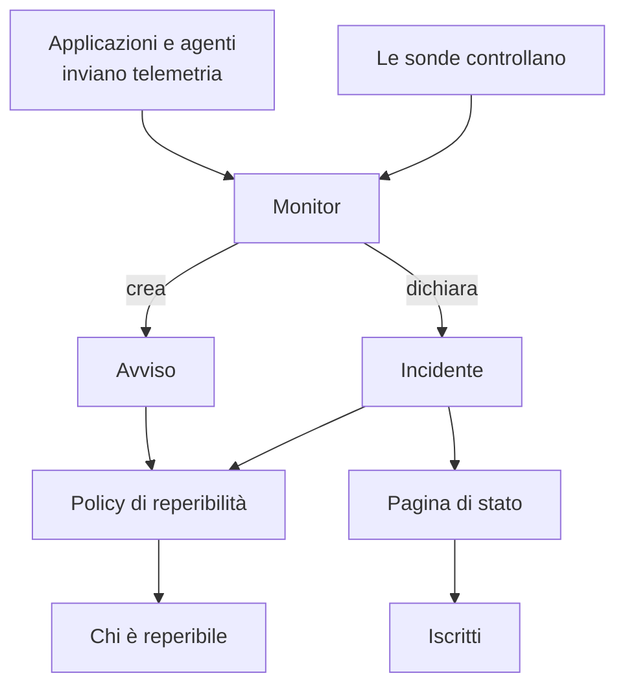

# Concetti fondamentali

OneUptime ha molti prodotti, ma poggiano su una manciata di idee: progetti, monitor, incidenti e avvisi, reperibilità, pagine di stato e telemetria. Questa pagina spiega ciascuna in poche frasi, mostra come si collegano e rimanda alle pagine che le trattano per esteso. Leggila una volta, e tutte le altre pagine della documentazione si leggeranno più facilmente.

:::cards
- [Progetti e persone](#progetti-e-persone): Dove vive tutto, e chi può fare cosa.
- [Monitor e sonde](#monitor-e-sonde): Come OneUptime si accorge che qualcosa non va.
- [Incidenti e avvisi](#incidenti-e-avvisi): Il record su cui lavora il tuo team.
- [Reperibilità](#reperibilità): Chi viene avvisato, come, e chi viene dopo.
:::

## Come si collegano i pezzi

Un problema attraversa OneUptime in una sola direzione. Le sonde e la tua telemetria alimentano i monitor. I criteri di un monitor decidono quando qualcosa non va e cosa aprire: un incidente, un avviso o entrambi. Le policy di reperibilità avvisano le persone, e le pagine di stato informano i tuoi clienti degli incidenti.

## Progetti e persone

Un **progetto** contiene tutto: monitor, incidenti, policy di reperibilità, pagine di stato, telemetria e impostazioni. Alla maggior parte delle aziende ne basta uno, alcune ne tengono uno per ambiente o per unità di business. Niente di ciò che crei in un progetto è visibile in un altro.

Il tuo **account** è separato dai tuoi progetti. Un account, con un'e-mail e una password, può appartenere a quanti progetti vuoi; passa dall'uno all'altro con il selettore di progetti in alto a sinistra. Vedi [Il tuo account](/docs/introduction/your-account).

Le persone fanno parte di un progetto tramite i **team**, e le autorizzazioni di un team decidono cosa possono fare i suoi membri. Ogni nuovo progetto parte con tre team: Owners, di cui fai parte, Admin e Members. Su OneUptime Cloud, ogni progetto ha il suo piano.

:::cards
- [Utenti, team e autorizzazioni](/docs/permissions/index): Invitare persone e decidere cosa possono fare.
:::

## Monitor e sonde

Un **monitor** controlla una cosa che gestisci e decide se funziona. La maggior parte dei monitor viene controllata dalle **sonde**: macchine che eseguono il controllo secondo una pianificazione, per esempio richiedendo una pagina, chiamando un'API, eseguendo il ping di un host o interrogando un database. OneUptime Cloud esegue sonde in diverse regioni, un'installazione self-hosted esegue le proprie, e puoi aggiungere sonde personalizzate nella tua rete. Altri monitor leggono invece ciò che invii: la telemetria delle tue applicazioni, o i dati che un agente riporta dai tuoi server, dai cluster Kubernetes e dal resto dell'infrastruttura.

I **criteri** di un monitor decidono cosa significa ogni risultato. Vengono valutati in ordine, e il primo che corrisponde può cambiare lo stato del monitor, dichiarare un incidente, creare un avviso, o tutte e tre le cose. Ogni nuovo progetto ha tre stati del monitor: **Operativo**, **Degradato** e **Offline**.

:::cards
- [Creare un monitor](/docs/monitor/create-monitor): Scegliere un tipo, dire cosa controllare e ogni quanto.
- [Sonde personalizzate](/docs/probe/custom-probe): Controllare ciò che solo la tua rete può raggiungere.
:::

## Incidenti e avvisi

Entrambi registrano un problema, ed entrambi possono avvisare chi è reperibile. Ciò che li distingue è chi viene colpito dal problema.

| | Incidente | Avviso |
| --- | --- | --- |
| **Cos'è** | Un problema che riguarda i tuoi utenti, come un'interruzione o un rallentamento | Un problema che il tuo team deve esaminare prima che gli utenti ne risentano |
| **Sulle pagine di stato** | Può comparire, e avvisa gli iscritti | Mai |
| **Stati iniziali** | **Identified**, **Riconosciuto**, **Risolto** | **Identified**, **Riconosciuto**, **Risolto** |
| **Gravità iniziali** | Critical Incident, Major Incident, Minor Incident | **High**, **Low** |

Riconoscerlo dice che qualcuno se ne sta occupando, e impedisce alle sue policy di reperibilità di avvisare il livello successivo. Risolverlo lo chiude. Puoi aggiungere stati e gravità tuoi, e collegare gli avvisi all'incidente di cui si sono rivelati parte.

Un **episodio** raggruppa incidenti correlati, o avvisi correlati, perché il tuo team li gestisca come uno solo. Le regole di raggruppamento decidono cosa va insieme.

:::cards
- [Panoramica degli incidenti](/docs/incidents/index): Come gli incidenti vengono dichiarati, gestiti e risolti.
- [Avvisi collegati](/docs/incidents/linked-alerts): Collegare all'incidente gli avvisi generati da un'interruzione.
:::

## Reperibilità

Una **policy di reperibilità** decide chi viene avvisato per un incidente o un avviso, e chi viene dopo se nessuno risponde. Le sue **regole di escalation** sono i suoi livelli: ognuna avvisa le sue persone, poi attende che qualcuno riconosca prima che venga avvisato il livello successivo. Un livello può avvisare persone, team o una **pianificazione di reperibilità**, un turno che sa in ogni momento chi è reperibile.

Come viene raggiunta ogni persona lo decide lei. Nelle **Impostazioni utente**, ognuno conserva i modi in cui OneUptime può raggiungerlo, come e-mail, SMS, chiamate, notifiche push, Slack o Microsoft Teams, e quali usare quando viene avvisato.

:::cards
- [Regole di escalation](/docs/on-call/escalation-rules): Avvisare le persone livello per livello finché qualcuno risponde.
- [Pianificazioni di reperibilità](/docs/on-call/schedules): Turni, livelli e passaggi di consegne.
:::

## Pagine di stato e manutenzione

Una **pagina di stato** mostra ai tuoi clienti se i tuoi servizi funzionano. Scegli quali monitor mostra, con nomi che i tuoi clienti capiscono. Finché un incidente su uno di quei monitor è attivo, la pagina lo mostra, e i suoi **iscritti** vengono avvisati via e-mail, SMS, Slack, Microsoft Teams o webhook. Una pagina di stato può essere pubblica, o privata per le persone che fai entrare.

La **manutenzione programmata** annuncia in anticipo i lavori previsti. Un evento passa per **Programmato**, **In corso**, **Terminato** e **Completato**, e le pagine di stato su cui lo mostri ne informano visitatori e iscritti.

:::cards
- [Panoramica delle pagine di stato](/docs/status-pages/index): Creare una pagina di stato e decidere cosa mostra.
- [Iscritti e annunci](/docs/status-pages/subscribers): Chi viene avvisato, e quando.
:::

## Telemetria

La **telemetria** è ciò che i tuoi sistemi inviano a OneUptime: log, metriche, tracce, eccezioni e profili. Le applicazioni la inviano con OpenTelemetry, e gli agenti di OneUptime la inviano da host, cluster Kubernetes, host Docker e dal resto dell'infrastruttura. Ogni mittente usa una **chiave di acquisizione**, creata in **Impostazioni del progetto → Telemetria e APM → Chiavi di acquisizione**. Cerchi nella telemetria, la rappresenti nelle dashboard e la tieni sotto controllo con i monitor di telemetria, che aprono incidenti e avvisi come qualsiasi altro monitor.

:::cards
- [OpenTelemetry](/docs/telemetry/open-telemetry): Inviare log, metriche e tracce dalle tue applicazioni.
- [Monitor log](/docs/monitor/logs-monitor): Essere avvisati quando un pattern compare nei tuoi log.
:::

## Automazione e IA

- I **Flussi di lavoro** eseguono azioni quando succede qualcosa, per esempio pubblicando un messaggio su Slack quando viene dichiarato un incidente.
- I **Runbook** trasformano una procedura di intervento in passaggi che il tuo team può eseguire, a mano o automaticamente.
- **OneUptime AI** indaga sui nuovi incidenti e avvisi e pubblica ciò che ha trovato nella loro cronologia, e **Ask AI** risponde alle domande sul tuo progetto. Un nuovo progetto parte con l'IA attiva; l'interruttore **Abilita IA** in **Impostazioni del progetto → IA → AI Features** la disattiva del tutto.

:::cards
- [Panoramica dei workflow](/docs/workflows/index): Automatizzare azioni con trigger e componenti.
- [AI SRE](/docs/ai/ai-sre): Come OneUptime AI indaga su incidenti e avvisi.
:::

## Etichette e proprietari

Le **etichette** sono tag che applichi a monitor, incidenti, pagine di stato e alla maggior parte delle altre risorse, per filtrarle e raggrupparle. Le autorizzazioni di un team possono essere limitate alle risorse con certe etichette. I **proprietari** sono le persone e i team responsabili di una risorsa: vengono avvisati quando le succede qualcosa. Le regole per etichette e proprietari aggiungono per te etichette e proprietari alle nuove risorse.

:::cards
- [Regole per etichette e proprietari](/docs/configuration/label-and-owner-rules): Etichettare le nuove risorse e assegnare loro proprietari automaticamente.
:::

## Passaggi successivi

:::cards
- [Guida rapida](/docs/introduction/quickstart): Mettere in pratica queste idee in quindici minuti.
- [Home page e scorciatoie](/docs/introduction/home): Trovare ogni prodotto nella dashboard.
- [Creare un monitor](/docs/monitor/create-monitor): Il tuo primo monitor, campo per campo.
- [Panoramica degli incidenti](/docs/incidents/index): Cosa succede dopo che un monitor dichiara un incidente.
:::
