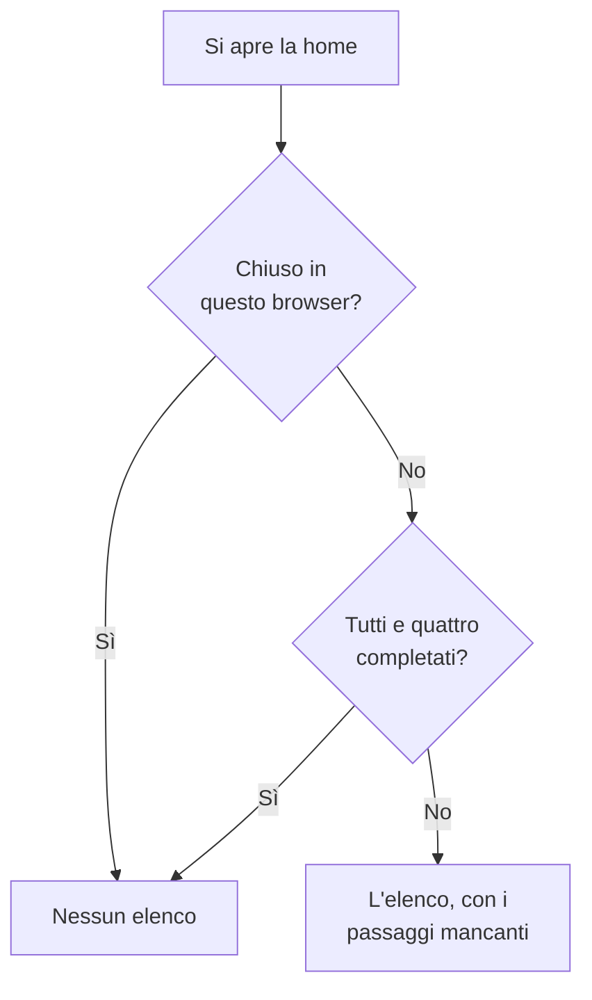

# Home page e scorciatoie

La home è la prima pagina che vedi in un progetto. Ti dice a colpo d'occhio se in questo momento qualcosa ha bisogno di te, e guida un nuovo progetto nella sua prima configurazione. Questa pagina spiega cosa mostra la home, come trovare qualsiasi prodotto, pagina o azione nella dashboard, e le scorciatoie da tastiera che ti risparmiano giri nei menu.

:::cards
- [Cosa mostra la home](#cosa-mostra-la-home): L'elenco di benvenuto, i cinque riquadri e gli incidenti attivi.
- [Orientarsi](#orientarsi): Il menu Prodotti e le barre in cima a ogni pagina.
- [Cercare](#cercare-una-pagina-unimpostazione-o-unazione): Trovare qualsiasi pagina, impostazione o azione digitandone il nome.
- [Scorciatoie da tastiera](#scorciatoie-da-tastiera): Andare alla home, ai monitor o agli incidenti con due tasti.
:::

## Cosa mostra la home

Apri **Home** nella barra in alto, oppure premi `g` e poi `h` da qualsiasi punto. Dall'alto verso il basso, la home mostra:

1. **Benvenuto in OneUptime 👋**, un elenco per un nuovo progetto, finché non è completato.
2. Cinque riquadri che contano ciò che richiede attenzione.
3. **Incidenti attivi**, ogni incidente non ancora risolto.

### L'elenco di benvenuto

L'elenco ti guida tra le quattro cose di cui un progetto ha bisogno per essere utile. Ogni passaggio apre la pagina in cui lo esegui, e si spunta da solo quando il progetto ha ciò che chiede.

| Passaggio | Completato quando | Apre |
| --- | --- | --- |
| **Crea il tuo primo monitor** | Il progetto ha un monitor. | Il modulo **Crea monitor**, o l'elenco **Monitor** per chi non può creare monitor. |
| **Pubblica una pagina di stato** | Il progetto ha una pagina di stato. | **Pagine di stato** |
| **Invita il tuo team** | Oltre a te, qualcuno è nel progetto o vi è stato invitato. | **Utenti** |
| **Configura una policy di reperibilità** | Il progetto ha una policy di reperibilità. | **Reperibilità** |

Sotto i passaggi, **Come funziona OneUptime** mostra i quattro prodotti principali nell'ordine in cui un problema li attraversa: **Monitor**, **Incidenti e avvisi**, **Reperibilità** e **Pagine di stato**. Fai clic su uno per aprirlo.

L'elenco sparisce quando tutti e quattro i passaggi sono completati. Per nasconderlo prima, fai clic su **Chiudi**. La chiusura vale per questo browser e per questo progetto; tutto ciò che i passaggi aprono resta nel menu **Prodotti**.

### I riquadri

Ogni riquadro conta qualcosa, dice se richiede la tua attenzione e apre l'elenco dietro il numero.

| Riquadro | Cosa conta | Quando il numero è zero |
| --- | --- | --- |
| **Incidenti attivi** | Gli incidenti non risolti | **Tutto a posto** |
| **Avvisi attivi** | Gli avvisi non risolti | **Tutto a posto** |
| **Monitor non operativi** | I monitor il cui stato non è operativo. I monitor archiviati non contano. | **Tutti operativi** |
| **Manutenzione in corso** | Gli eventi di manutenzione programmata in corso | **Nessuna in corso** |
| **SLO a rischio** | Gli SLO attivi che sono a rischio o hanno esaurito il loro error budget | **Budget in salute** |

Un numero sopra lo zero mostra **Richiede attenzione**, oppure **In corso** e **Budget in esaurimento** nei riquadri di manutenzione e SLO. Un progetto senza monitor vede **Nessun monitor ancora** nel riquadro dei monitor, e uno senza SLO vede **Nessun SLO ancora**: un progetto vuoto non è un progetto sano. Questi due riquadri aprono allora gli elenchi **Monitor** e **SLOs**, dove ne crei uno.

### Il menu laterale della home

Il menu laterale accanto alla home contiene gli stessi elenchi, ognuno con un contatore:

| Sezione | Pagine |
| --- | --- |
| **Incidenti** | **Incidenti attivi** ed **Episodi attivi** |
| **Avvisi** | **Avvisi attivi** ed **Episodi attivi** |
| **Monitor** | **Non operativo** |
| **Eventi pianificati** | **In corso** |

Un episodio raggruppa incidenti o avvisi correlati, perché tu li gestisca come uno solo. Vedi [Concetti fondamentali](/docs/introduction/core-concepts#incidenti-e-avvisi).

## Orientarsi

Tutto in OneUptime si trova sotto **Prodotti** nella barra in alto. Il menu presenta i suoi gruppi come le righe di un unico elenco, e si apre sempre con il primo di essi, gli essenziali, espanso: Monitor, Incidenti, Avvisi, Reperibilità, Pagine di stato, Manutenzione programmata e SLOs. Ogni altro gruppo (Osservabilità, AI, Codice, Risorse, Infrastruttura, Dashboard e automazione e Impostazioni) è compresso in una riga dello stesso elenco. Ogni riga nomina i prodotti del gruppo e dice quanti sono. Fai clic su una riga per espanderla o comprimerla, oppure raggiungila con i tasti freccia e premi **Enter**.

- **La ricerca trova tutto.** Digita nella casella di ricerca del menu per trovare qualsiasi prodotto per nome, per ciò che fa, o per una parola familiare come `k8s` o `RUM`. La ricerca guarda anche dentro i gruppi compressi.
- **Parti da dove sei.** Il gruppo della pagina in cui ti trovi si espande da solo, e i prodotti che hai aperto di recente sono elencati in alto.
- **Le tue scelte restano.** Il menu ricorda, nel tuo browser, quali degli altri gruppi hai espanso o compresso. Gli essenziali sono di nuovo espansi ogni volta che apri il menu, anche se li avevi compressi.
- **Su un telefono**, il pulsante del menu elenca i prodotti allo stesso modo: gli essenziali espansi in alto, e ogni altro gruppo come una riga che si apre con un tocco.

### Le barre in alto

Due barre attraversano la parte alta di ogni pagina.

| Dove | Cosa c'è |
| --- | --- |
| In alto a sinistra | Il selettore di progetti: passare a un altro dei tuoi progetti, o crearne uno nuovo. |
| In alto a destra | **Cerca** e **Ask AI**, la campanella delle notifiche con ciò che ti aspetta ora (incidenti e avvisi attivi, le policy di reperibilità in cui sei di turno, gli inviti in sospeso), **Aiuto**, e la tua foto, che apre il menu del tuo [account](/docs/introduction/your-account). |
| Sotto | **Home** e **Prodotti** a sinistra, **Impostazioni utente** a destra: come OneUptime ti raggiunge in questo progetto. |

**Aiuto** apre questa documentazione (**Documentazione**) e l'elenco **Keyboard shortcuts**, e offre supporto via e-mail e su Slack. Su uno schermo stretto, come quello di un telefono, **Cerca**, **Ask AI** e **Aiuto** vengono tolti per fare spazio; la campanella e la tua foto restano.

## Cercare una pagina, un'impostazione o un'azione

Premi **Cmd+K** (Mac) o **Ctrl+K** (Windows e Linux), oppure fai clic sull'icona di ricerca nella barra in alto, e inizia a digitare. La ricerca trova:

- **Ogni pagina dei menu**, con il nome che il menu le dà: Chiavi API, Zona pericolosa, Pianificazioni di reperibilità, Gravità incidente, i tuoi Metodi di notifica. Ogni risultato dice dove si trova, per esempio *Impostazioni del progetto › Avanzato*, così le pagine con lo stesso nome (Campi personalizzati in Incidenti, Avvisi e Monitor) si distinguono facilmente.
- **Azioni**, in base a ciò che vuoi fare: Dichiara incidente, Crea monitor, o Delete Project, che apre la Zona pericolosa. Un'azione che modifica qualcosa viene offerta solo a chi ha il permesso di farla.
- **I tuoi monitor, incidenti, avvisi, pagine di stato e policy di reperibilità**, per nome.

La ricerca legge ciò che digiti come lo intendi:

- Maiuscole, accenti, spazi e trattini non contano: *on-call*, *on call* e *oncall* trovano le stesse pagine, e le parole possono essere in qualsiasi ordine.
- Conosce altre parole per molte pagine, in inglese: *pager* o *escalation* per Policy di reperibilità, *rota* per Pianificazioni di reperibilità, *2fa* per l'autenticazione a due fattori, *delete project* per la Zona pericolosa.
- Aggiungi il nome del prodotto per restringere una ricerca: *incident custom fields* trova la pagina Campi personalizzati degli incidenti.
- Un piccolo errore di battitura, come *incidnet*, trova comunque ciò che intendevi quando nulla corrisponde esattamente.

Con la casella di ricerca vuota, la ricerca elenca le pagine aperte di recente, le azioni e i prodotti.

## Scorciatoie da tastiera

Premi `?` in qualsiasi punto della dashboard per vedere tutte le scorciatoie, oppure apri **Aiuto** e scegli **Keyboard shortcuts**. Su un Mac, `Mod` è il tasto Comando; su Windows e Linux è Ctrl.

| Tasti | Cosa fanno |
| --- | --- |
| `Mod` + `K` | Aprire la palette dei comandi: cercare qualsiasi pagina, impostazione o azione. |
| `Mod` + `I` | Chiedere all'IA di ciò che stai guardando. |
| `/` | Cercare nell'elenco di questa pagina. |
| `?` | Mostrare le scorciatoie da tastiera. |
| `Esc` | Chiudere una finestra di dialogo o un pannello. |

### Andare a un prodotto

Premi `g` e poi una lettera per andare direttamente a un prodotto. Premi la lettera entro un secondo e mezzo da `g`.

| Tasti | Va a |
| --- | --- |
| `g` poi `h` | Home |
| `g` poi `m` | Monitor |
| `g` poi `i` | Incidenti |
| `g` poi `a` | Avvisi |
| `g` poi `o` | Reperibilità |
| `g` poi `s` | Pagine di stato |
| `g` poi `e` | Manutenzione programmata |
| `g` poi `d` | Dashboard |
| `g` poi `l` | Log |
| `g` poi `t` | Tracce |

Le scorciatoie non ti intralciano. `?`, `/` e `g` non fanno nulla mentre digiti in un campo, e nulla ti porta via dalla pagina mentre una finestra di dialogo è aperta, così un tasto premuto per sbaglio non può farti perdere un modulo compilato a metà. Ogni altro prodotto è a una ricerca di distanza con `Mod` + `K`.

## Passaggi successivi

:::cards
- [Guida rapida](/docs/introduction/quickstart): Seguire l'elenco di benvenuto, passaggio per passaggio.
- [Il tuo account](/docs/introduction/your-account): Il tuo profilo, la sicurezza dell'accesso, la lingua e il tema.
- [Chiedi all'IA](/docs/ai/ask-ai): Cosa può rispondere e fare per te Ask AI.
- [Concetti fondamentali](/docs/introduction/core-concepts): Cosa sono monitor, incidenti, avvisi e reperibilità.
:::
