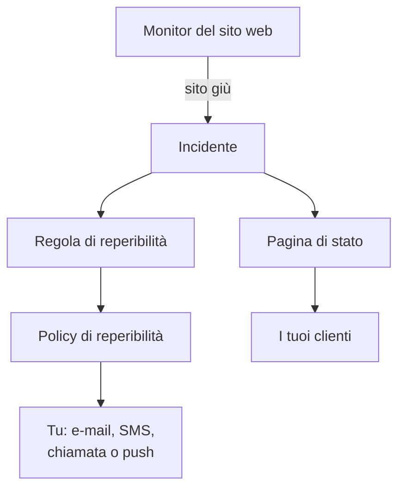

# Guida rapida

Questa guida ti porta da un account nuovo a una configurazione funzionante in circa quindici minuti: un monitor che controlla il tuo sito web ogni cinque minuti, una policy di reperibilità che ti avvisa quando il sito va giù, e una pagina di stato che informa i tuoi clienti. Segue l'elenco **Benvenuto in OneUptime 👋** nella home page del tuo progetto.

## Prima di iniziare

- **Un account.** Su OneUptime Cloud, registrati su [oneuptime.com](https://oneuptime.com/accounts/register) e apri il link nell'e-mail che ricevi. Sulla tua installazione, aprila nel browser e registrati: il primo account diventa l'amministratore principale. Per installarne una, vedi [Docker Compose](/docs/installation/docker-compose).
- **Un sito web da tenere sotto controllo.** Qualsiasi indirizzo che risponde in HTTP o HTTPS, come la home page della tua azienda.

## Creare un progetto

In OneUptime tutto vive in un progetto: i tuoi monitor, gli incidenti, le policy di reperibilità, le pagine di stato e le persone che ci lavorano.

:::steps
### Iniziare un nuovo progetto

Al primo accesso, OneUptime mostra **Nessun progetto**. Fai clic su **Crea nuovo progetto**. Se qualcuno ti ha già invitato in un progetto, accetta invece l'invito nella stessa pagina.

### Dargli un nome

Inserisci un **Nome del progetto**, per esempio il nome della tua azienda. Su OneUptime Cloud, il passaggio successivo ti chiede di scegliere un piano.

### Crearlo

Fai clic su **Crea progetto**. Si apre la home page del tuo progetto, con l'elenco **Benvenuto in OneUptime 👋** in alto.
:::

## Monitorare il tuo sito web

:::steps
### Aprire la creazione del monitor

Nell'elenco, fai clic su **Crea il tuo primo monitor**. Puoi anche aprire **Monitor** dal menu **Prodotti** e fare clic su **Crea monitor**.

### Scegliere Sito web

In **Tipo di monitor**, scegli **Sito web**. Inserisci un **Nome**, per esempio `Website`, e fai clic su **Avanti**.

### Inserire l'indirizzo

Inserisci l'indirizzo completo del tuo sito in **URL sito web**, per esempio `https://example.com`. OneUptime aggiunge i criteri per te: il monitor passa a **Offline** e dichiara un incidente quando il sito non risponde, o risponde con un errore. Fai clic su **Avanti**.

### Creare il monitor

Mantieni le **Sonde** selezionate e l'**Intervallo di monitoraggio** di **Ogni 5 minuti**, poi fai clic su **Crea monitor**. Si apre la pagina del monitor, e le sonde iniziano a controllare il tuo sito.
:::

Per provare il controllo prima di salvare, fai clic su **Testa il monitor** nel secondo passaggio. Tutti gli altri tipi di monitor sono descritti in [Creare un monitor](/docs/monitor/create-monitor).

## Essere avvisati quando va giù

Così com'è, un incidente senza proprietari viene inviato via e-mail ai proprietari del progetto, e tra loro ci sei tu. Per essere avvisato finché qualcuno non risponde, crea una policy di reperibilità e falla attivare da ogni incidente.

:::steps
### Creare una policy di reperibilità

Nell'elenco, fai clic su **Configura una policy di reperibilità**, oppure apri **Reperibilità** dal menu **Prodotti**. Fai clic su **Crea: Policy di reperibilità** e inserisci un **Nome**. In **Chi viene avvisato per primo?**, fai clic su **Aggiungi destinatario** e scegli te stesso. Fai clic su **Crea: Policy di reperibilità**.

### Attivarla per ogni incidente

Apri **Incidenti** dal menu **Prodotti**, espandi **Regole** nel menu laterale e scegli **Regole di reperibilità**. Fai clic su **Crea: Incident On-Call Rule**, inserisci un **Nome** e fai clic su **Avanti**. Lascia vuoti i **Criteri di corrispondenza**, così la regola vale per ogni incidente, e fai clic su **Avanti**. Scegli la tua policy in **Policy di reperibilità** e fai clic su **Crea: Incident On-Call Rule**.

### Scegliere come essere raggiunto

La tua e-mail di accesso è già un modo per raggiungerti. Per ricevere anche SMS o chiamate, apri **Impostazioni utente** nella barra sotto la barra superiore, vai in **Metodi di notifica** e, nella scheda **Direct Contact**, aggiungi il tuo numero in **Numeri di telefono per le notifiche SMS** o **Numeri di telefono per le notifiche tramite chiamata**. Fai clic su **Verifica** e inserisci il codice che OneUptime ti invia. Un numero verificato viene usato subito per gli avvisi di reperibilità.
:::

> [!NOTE]
> SMS e chiamate sono disattivati in un nuovo progetto. Un proprietario del progetto, un Billing Admin o chi ha Manage Billing li attiva nella scheda **Canali di notifica**, in **Impostazioni del progetto → Notifiche → Impostazioni notifiche**.

Per altri livelli, turni e quanto attende ogni livello, vedi [Regole di escalation](/docs/on-call/escalation-rules) e [Pianificazioni di reperibilità](/docs/on-call/schedules).

## Pubblicare una pagina di stato

:::steps
### Creare la pagina di stato

Nell'elenco, fai clic su **Pubblica una pagina di stato**, oppure apri **Pagine di stato** dal menu **Prodotti**. Fai clic su **Crea pagina di stato**, inserisci un **Nome**, per esempio `Acme Status`, e fai clic su **Crea pagina di stato**.

### Aggiungere il tuo monitor

Apri la nuova pagina di stato. Nel suo menu laterale, in **Risorse**, scegli **Monitor**; nei progetti con i gruppi di monitor attivati si chiama **Risorse**. Fai clic su **Aggiungi monitor**, scegli il monitor del tuo sito web e fai clic su **Aggiungi monitor**. La riga mostra ai visitatori il nome del monitor; cambialo in **Nome visualizzato**, se vuoi.

### Aprire la pagina

Scegli **Panoramica** nel menu laterale. La scheda **Status Page Preview URL** porta alla tua pagina di stato: aprila, e il tuo sito web risulta operativo.
:::

Una nuova pagina di stato è pubblica: chiunque abbia il suo indirizzo può aprirla. Per darle il tuo dominio, il tuo logo e i tuoi colori, vedi [Branding e domini della pagina di stato](/docs/status-pages/branding-and-domains).

## Invitare il tuo team

Nell'elenco, fai clic su **Invita il tuo team**, oppure apri **Utenti** dal menu **Prodotti**, in **Impostazioni**. Fai clic su **Invita utente**, inserisci la sua **E-mail** e scegli un **Team**: all'inizio è scelto il team dei membri. Fai clic su **Invita**. OneUptime gli invia l'invito via e-mail, e il team decide cosa può fare. Vedi [Utenti, team e autorizzazioni](/docs/permissions/index).

## Provarlo

Dichiara un incidente di prova per vedere funzionare tutta la catena.

:::steps
### Dichiarare un incidente di prova

Apri **Incidenti** e fai clic su **Dichiara incidente**. Inserisci un **Titolo**, per esempio `Test incident`, scegli una **Gravità incidente** e fai clic su **Avanti**. In **Monitor**, scegli il monitor del tuo sito web, così l'incidente compare sulla tua pagina di stato. Fai clic su **Avanti** fino al riepilogo, poi su **Dichiara incidente**.

### Guardare cosa succede

Entro un paio di minuti, la tua policy di reperibilità ti avvisa e l'incidente compare sulla tua pagina di stato.

### Risolverlo

Nella pagina dell'incidente, fai clic su **Risolvi**. Gli avvisi si fermano e l'incidente lascia la tua pagina di stato.
:::

> [!WARNING]
> Chiunque apra la tua pagina di stato vede l'incidente di prova finché non lo risolvi. Fai la prova prima di condividere l'indirizzo della pagina.

## Risoluzione dei problemi

:::details Non sono stato avvisato
Apri l'incidente e scegli **Esecuzioni di reperibilità** nel suo menu laterale: lì vedi se la tua policy è stata eseguita e chi ha avvisato. Se non è stata eseguita, controlla che la tua regola di reperibilità sia attiva e indichi la policy. Se è stata eseguita, controlla che i tuoi metodi in **Impostazioni utente → Metodi di notifica** siano verificati.
:::

:::details L'incidente non compare sulla mia pagina di stato
Una pagina di stato mostra un incidente quando uno dei monitor dell'incidente è sulla pagina. Controlla che l'incidente elenchi il tuo monitor tra le risorse interessate, e che il monitor sia sulla pagina di stato.
:::

:::details Il monitor dice offline, ma il mio sito funziona
Apri il monitor e controlla cosa hanno ricevuto le sonde. Vedi la sezione sulla risoluzione dei problemi di [Monitor sito web](/docs/monitor/website-monitor).
:::

## Passaggi successivi

:::cards
- [Concetti fondamentali](/docs/introduction/core-concepts): Le idee dietro ciò che hai appena configurato.
- [Pianificazioni di reperibilità](/docs/on-call/schedules): Condividere la reperibilità con il tuo team.
- [Branding e domini della pagina di stato](/docs/status-pages/branding-and-domains): Rendere tua la pagina di stato.
- [OpenTelemetry](/docs/telemetry/open-telemetry): Inviare log, metriche e tracce dalle tue applicazioni.
:::
