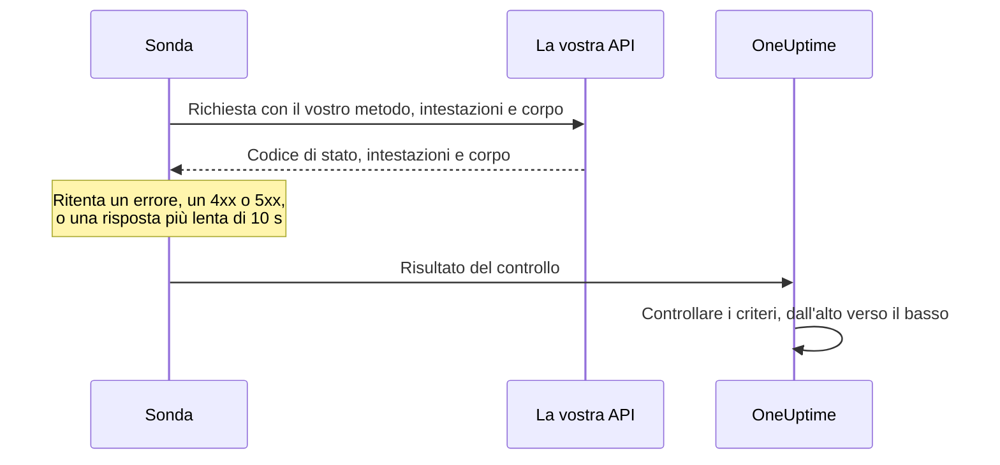

# Monitor API

Un monitor API chiama un endpoint HTTP secondo una pianificazione, con il metodo, le intestazioni e il corpo che scegliete, e controlla cosa torna: il codice di stato, il tempo di risposta, le intestazioni e il corpo. Usatelo per endpoint REST, JSON e GraphQL, controlli di salute e qualsiasi chiamata da cui dipendono i vostri utenti.

:::cards
- [Creare il monitor](#creare-un-monitor-api): Sei passaggi nella dashboard.
- [Opzioni di configurazione](#opzioni-di-configurazione): Metodo, intestazioni, corpo, reindirizzamenti, certificati, timeout e nuovi tentativi.
- [Criteri di monitoraggio](#criteri-di-monitoraggio): Cosa conta come attivo o non disponibile, fin dall'inizio.
- [Risoluzione dei problemi](#risoluzione-dei-problemi): Quando fallisce un controllo che dovrebbe riuscire.
:::

## Come funziona

A ogni controllo una sonda invia la richiesta, segue i reindirizzamenti e registra il codice di stato, il tempo di risposta, le intestazioni e il corpo. Una richiesta che fallisce, va in timeout, risponde con uno stato `4xx` o `5xx`, o impiega più di 10 secondi viene ritentata, fino al numero di nuovi tentativi che consentite. OneUptime passa poi il risultato attraverso i criteri del monitor.



Una sonda che ha perso la propria connessione di rete non riporta alcun risultato, quindi non può segnare la vostra API come offline.

## Prima di iniziare

- **Un ruolo che può creare monitor**: Project Owner, Project Admin, Project Member, Monitor Admin o Monitor Member, oppure un ruolo personalizzato con il permesso Create Monitor.
- **Una sonda che raggiunga l'API.** Le sonde predefinite del vostro progetto vengono scelte per ogni nuovo monitor. Se un firewall protegge l'API, consentite gli [indirizzi IP delle sonde di OneUptime Cloud](/docs/configuration/ip-addresses). Un'API su una rete privata ha bisogno di una [sonda personalizzata](/docs/probe/custom-probe) in quella rete, autorizzata a raggiungere indirizzi privati: vedete [Accesso alla rete privata](/docs/self-hosted/private-network-access).
- **Credenziali come segreti del monitor.** Se l'API richiede una chiave o un token, salvatelo prima come [segreto del monitor](/docs/monitor/monitor-secrets), così il monitor contiene solo un riferimento a esso.

## Creare un monitor API

:::steps
### Iniziare un nuovo monitor

Andate in **Monitor** e fate clic su **Crea monitor**. In **Tipo di monitor**, scegliete **API**.

### Dargli un nome

Inserite un **Nome**, come `Orders API`, poi fate clic su **Avanti**.

### Inserire la richiesta

In **URL API**, inserite l'URL completo dell'endpoint, come `https://api.example.com/health`. Scegliete il **Tipo di richiesta API** (**GET** se non lo cambiate). Per aggiungere intestazioni o un corpo, aprite **Altri campi** e compilate **Intestazioni della richiesta** e **Corpo della richiesta (in JSON)**.

### Testarlo

Fate clic su **Testa il monitor**, scegliete una sonda in **Seleziona sonda** e fate clic su **Esegui test**. **Risultato del test del monitor** mostra cosa ha risposto l'API.

### Rivedere i criteri

**Criteri del monitor** parte dai [criteri predefiniti](#criteri-predefiniti): offline quando l'API non risponde o risponde con un errore, online con qualsiasi stato `2xx` o `3xx`. Per controllare anche cosa restituisce l'API, aggiungete un filtro, poi fate clic su **Avanti**.

### Scegliere le sonde e creare

Mantenete o cambiate le **Sonde** e l'**Intervallo di monitoraggio** (parte da **Ogni 5 minuti**), poi fate clic su **Crea monitor**. Si apre la pagina del monitor.
:::

## Opzioni di configurazione

### URL API

L'endpoint da chiamare, come URL completo con lo schema, come `https://api.example.com/v1/health`. Potete inserire un [segreto del monitor](/docs/monitor/monitor-secrets) nell'URL come `{{monitorSecrets.NAME}}`.

### Segnaposto dinamici nell'URL

Quando un CDN o un proxy di cache sta davanti all'API, una sonda può ricevere la risposta dalla cache anziché dal vostro server. Per aggirare la cache, aggiungete un segnaposto all'URL; la sonda lo sostituisce con un nuovo valore a ogni controllo.

| Segnaposto | Sostituito con | Valore di esempio |
| --- | --- | --- |
| `{{timestamp}}` | L'ora Unix corrente, in secondi | `1719500000` |
| `{{random}}` | Una stringa casuale e univoca di 32 caratteri esadecimali | `3f2b8c1d9e7a4b6c8d0e1f2a3b4c5d6e` |

Un URL con un segnaposto:

```text
https://api.example.com/health?cb={{timestamp}}
```

Cosa richiede la sonda in due controlli a cinque minuti di distanza:

```text
https://api.example.com/health?cb=1719500000
https://api.example.com/health?cb=1719500300
```

Usate `{{random}}` allo stesso modo: `https://api.example.com/health?nocache={{random}}`.

### Tipo di richiesta API

Il metodo HTTP da inviare. **GET** è il predefinito; gli altri sono **POST**, **PUT**, **PATCH**, **DELETE** e **HEAD**. Se una richiesta **HEAD** riceve uno stato `4xx` o `5xx`, la sonda la ripete come `GET`.

### Altri campi

Queste impostazioni sono ripiegate sotto **Altri campi**. L'intestazione ripiegata le elenca e mostra quali avete cambiato.

| Campo | Predefinito | Cosa fa |
| --- | --- | --- |
| **Intestazioni della richiesta** | Nessuna | Le intestazioni da inviare, come coppie nome e valore. Fate clic su **Aggiungi: Request Header** per ciascuna. |
| **Corpo della richiesta (in JSON)** | Nessuno | Un oggetto JSON da inviare come corpo, di solito con **POST**, **PUT** o **PATCH**. Deve essere JSON valido. |
| **Non seguire i reindirizzamenti** | Disattivato | Valutare la prima risposta invece di seguire i reindirizzamenti. Vedete [sotto](#non-seguire-i-reindirizzamenti). |
| **Consenti certificati autofirmati** | Disattivato | Saltare la convalida del certificato TLS per il nome host del monitor stesso. |
| **Usa certificato client (mTLS)** | Disattivato | Presentare un certificato client e una chiave privata. Vedete [Certificato client (mTLS)](#certificato-client-mtls). |
| **Timeout della richiesta (secondi)** | `60` | Quanto attendere ogni tentativo. Il massimo è 60 secondi. |
| **Tentativi in caso di errore** | Il predefinito della sonda, di solito `3` | Quante volte ritentare un tentativo fallito. Il massimo è 3. Vedete [Nuovi tentativi e timeout](#nuovi-tentativi-e-timeout). |

Le intestazioni e il corpo della richiesta possono usare [segreti del monitor](/docs/monitor/monitor-secrets), per esempio un'intestazione `Authorization` con il valore `Bearer {{monitorSecrets.ApiKey}}`.

#### Non seguire i reindirizzamenti

Per impostazione predefinita, la sonda segue i reindirizzamenti (`301`, `302`, `303`, `307` e `308`), fino a 10, e valuta la risposta su cui arriva. Attivate **Non seguire i reindirizzamenti** per valutare invece la risposta di reindirizzamento stessa. I [criteri predefiniti](#criteri-predefiniti) contano una risposta di reindirizzamento come online.

Quando segue un reindirizzamento:

- Un `303`, o un `301` o `302` in risposta a un `POST`, trasforma la richiesta in un `GET` senza corpo, come fanno i browser.
- Le vostre intestazioni della richiesta vanno solo all'origine propria dell'URL (stesso schema, host e porta). Un reindirizzamento verso un'altra origine viene inviato senza di esse.
- Un reindirizzamento verso un'altra origine fa fallire il controllo se la richiesta ha ancora un corpo, o un metodo diverso da `GET` o `HEAD`.
- **Consenti certificati autofirmati** segue i reindirizzamenti che restano sul nome host del monitor stesso. Un reindirizzamento verso un altro nome host viene verificato come di consueto.

#### Certificato client (mTLS)

Se l'API richiede TLS reciproco, attivate **Usa certificato client (mTLS)** e compilate:

| Campo | Cosa inserire |
| --- | --- |
| **Certificato client (PEM)** | Il certificato client codificato in PEM da presentare. |
| **Chiave privata client (PEM)** | La chiave privata corrispondente, codificata in PEM. |
| **Passphrase della chiave privata client** | Facoltativo. La passphrase, solo se la chiave privata è cifrata. |

Equivale alle opzioni `--cert` e `--key` di curl:

```bash
curl --cert client.crt --key client.key https://api.example.com/health
```

Per tenere la chiave fuori dalle impostazioni del monitor, salvate il certificato e la chiave come [segreti del monitor](/docs/monitor/monitor-secrets) e inserite `{{monitorSecrets.NAME}}` in questi campi. I segreti vengono inseriti sul server, e i loro valori non compaiono mai nella dashboard.

Il certificato client viene presentato solo finché la richiesta resta sull'origine dell'URL. Dopo un reindirizzamento verso un'altra origine, la sonda prosegue senza di esso.

#### Nuovi tentativi e timeout

**Tentativi in caso di errore** conta i nuovi tentativi _dopo_ il primo, quindi `0` esegue il controllo una volta e `2` fino a tre volte. Se lasciato vuoto, usa il predefinito della sonda: 3, a meno che `PROBE_MONITOR_RETRY_LIMIT` della sonda non dica altro. La sonda attende un secondo tra un tentativo e l'altro, e ogni tentativo ha a disposizione l'intero **Timeout della richiesta (secondi)**.

Questi errori vengono ritentati: errori di connessione, timeout, risposte `4xx` e `5xx`, e risposte più lente di 10 secondi. Questi no, perché ritentare non li cambia: un URL non valido o bloccato, più di 10 reindirizzamenti e una risposta più grande di 512 KiB.

## Criteri di monitoraggio

I criteri decidono quando l'API conta come online, degradata o offline, e se ciò dichiara un incidente o crea un avviso. Ogni criterio controlla uno o più filtri:

| Filtro | Condizioni | Cosa controlla |
| --- | --- | --- |
| **Is Online** | **Vero**, **Falso** | Se l'API ha risposto, qualunque sia il codice di stato. |
| **Codice di stato della risposta** | **Equal To**, **Not Equal To**, **Greater Than**, **Less Than**, **Greater Than Or Equal To**, **Less Than Or Equal To** | Il codice di stato HTTP. |
| **Tempo di risposta (in ms)** | **Greater Than**, **Less Than**, **Greater Than Or Equal To**, **Less Than Or Equal To** | Quanto è durata la richiesta, reindirizzamenti compresi. |
| **Corpo della Risposta** | **Contiene**, **Not Contains** | Testo nel corpo della risposta. La corrispondenza distingue maiuscole e minuscole. |
| **Response Header** | **Contiene**, **Not Contains** | Se la risposta ha un'intestazione con questo nome. Inserite il nome in minuscolo, come `x-request-id`. |
| **Response Header Value** | **Contiene**, **Not Contains** | Se un'intestazione ha esattamente questo valore, confrontato in minuscolo, come `application/json`. |
| **JavaScript Expression** | **Evaluates To True** | Un'espressione sulla risposta. Vedete [Espressioni JavaScript](/docs/monitor/javascript-expression). |
| **Is Request Timeout** | **Vero**, **Falso** | Se la richiesta è andata in timeout a ogni tentativo. |

Una risposta JSON viene controllata nella sua forma compatta, senza spazi tra chiavi e valori. Per trovare `"status": "ok"` con **Corpo della Risposta**, inserite `"status":"ok"`.

**Aggiungi criteri** aggiunge un criterio già chiamato come il suo filtro, per esempio _Response Time (in ms) is above 3000_. Il nome cambia con i filtri finché non ne digitate uno vostro. La descrizione è facoltativa: per aggiungerne una, aprite le **Impostazioni** del criterio.

Con due o più filtri, **Condizione di corrispondenza** decide se devono corrispondere **Tutti** o basta **Qualsiasi** filtro. Le **Azioni** di un criterio decidono cosa fa: cambiare lo stato del monitor, creare un avviso, dichiarare un incidente, o più di queste cose.

### Criteri predefiniti

Un nuovo monitor API parte con due criteri, quindi funziona senza cambiare nulla:

- **Offline** — l'API non risponde, o risponde con un codice di stato pari o superiore a `400` (o inferiore a `200`). Il monitor viene segnato **Offline** e viene creato un incidente. L'incidente si risolve da solo quando l'API torna disponibile.
- **Online** — l'API risponde con qualsiasi codice di stato `2xx` o `3xx`, come `200`, `201`, `202` o `204`. Il monitor viene segnato **Operativo**.

Nell'elenco dei criteri prendono il nome dal monitor: _Check if (name) is offline_ e _Check if (name) is online_.

Quindi un endpoint che risponde `201 Created` o `204 No Content` conta come attivo. Se per voi solo un codice di stato significa che tutto è a posto, modificate entrambi i criteri nella pagina **Configurazione → Criteri** del monitor: per esempio **Codice di stato della risposta** / **Equal To** / `200` nel criterio online e **Not Equal To** / `200` in quello offline, al posto dei due filtri sul codice di stato che ha ciascuno. Per controllare anche cosa restituisce l'API, aggiungete un filtro **Corpo della Risposta** o **JavaScript Expression** al criterio offline.

I criteri vengono controllati dall'alto verso il basso, e il primo che corrisponde decide cosa succede.

Quando nessuno corrisponde, il monitor torna al suo stato predefinito: **Operativo**, a meno che non ne scegliate un altro sotto **Altri campi**, sotto i criteri. L'intestazione ripiegata di **Altri campi** mostra di quale stato si tratta.

I monitor creati prima che OneUptime cambiasse queste impostazioni predefinite mantengono i criteri con cui sono stati creati, che contano solo `200` come online. I monitor creati tramite l'API o Terraform usano i criteri che inviate.

### Valutare su un periodo di tempo

**Valuta questo criterio su un periodo di tempo** è una casella sotto un filtro, offerta per **Is Online**, **Codice di stato della risposta** e **Tempo di risposta (in ms)**. Attivatela per valutare una finestra di controlli passati invece dell'ultimo: scegliete un'aggregazione in **Valuta** e una finestra, da 2 a 60 minuti, in **Per gli ultimi (in minuti)**.

| Aggregazione | Corrisponde quando |
| --- | --- |
| **Media**, **Somma**, **Maximum Value**, **Minimum Value** | Quel valore, sulla finestra, soddisfa la condizione. Solo filtri numerici. |
| **All Values** | Ogni controllo nella finestra soddisfa la condizione. |
| **Any Value** | Almeno un controllo nella finestra soddisfa la condizione. |

**All Values** corrisponde solo quando la finestra è davvero coperta da dati. Un monitor appena creato, o uno i cui controlli hanno smesso di essere registrati, non ha abbastanza storico per dire qualcosa sugli ultimi N minuti, quindi il criterio attende invece di corrispondere sull'unica lettura che ha. **Any Value** è l'impostazione per «avvisami appena un singolo controllo supera la soglia» e scatta comunque subito.

**Se nessun dato** decide cosa succede finché la finestra non può sostenere il criterio:

| Opzione | Cosa succede | Da usare per |
| --- | --- | --- |
| **Ignore** (predefinito) | Il criterio non corrisponde. | Avvisi a soglia ordinari. |
| **Trigger** | I dati mancanti contano come il problema. | Controlli in cui il silenzio è di per sé un guasto. |
| **Treat As Zero** | La finestra viene confrontata come un singolo zero. | Contatori in cui nessun evento significa davvero zero. |

### Esempi di criteri

| Obiettivo | Filtro | Condizione | Valore |
| --- | --- | --- | --- |
| Segnare l'API degradata quando è lenta | **Tempo di risposta (in ms)** | **Greater Than** | `1000` |
| Offline quando il controllo di salute segnala un problema | **Corpo della Risposta** | **Not Contains** | `"status":"ok"` |
| Lo stesso, letto dal JSON analizzato | **JavaScript Expression** | **Evaluates To True** | `"{{responseBody.status}}" !== "ok"` |
| Accettare solo `201` da un `POST` | **Codice di stato della risposta** | **Equal To** | `201` |

## Risoluzione dei problemi

:::details L'API risponde alle mie richieste, ma il monitor è offline
La sonda ha ricevuto una risposta diversa dalla vostra. La causa principale dell'incidente, e **Registri di monitoraggio** sul monitor, mostrano cosa ha visto la sonda. Controllate che la sonda invii ciò che l'API si aspetta: il metodo, l'intestazione `Authorization`, il corpo. Anche un firewall o un limitatore di frequenza davanti all'API può bloccare le sonde: consentite gli [indirizzi IP delle sonde di OneUptime Cloud](/docs/configuration/ip-addresses).
:::

:::details Il monitor invia `{{monitorSecrets.NAME}}` alla lettera
Il monitor non può usare il segreto, oppure il nome non corrisponde. Vedete [Segreti del monitor](/docs/monitor/monitor-secrets) per sapere chi può usare un segreto.
:::

:::details Il controllo fallisce con «unsafe cross-origin redirect»
L'API ha reindirizzato una richiesta con un corpo, o con un metodo diverso da `GET` o `HEAD`, verso un'altra origine, e la sonda non inoltra richieste del genere. Puntate il monitor sull'URL verso cui l'API reindirizza, oppure attivate **Non seguire i reindirizzamenti** e controllate il reindirizzamento stesso.
:::

:::details Il controllo fallisce con «Remote response exceeded the allowed size.»
La sonda legge al massimo 512 KiB di una risposta, e questa è più grande. Chiamate un endpoint che restituisce meno, per esempio con una dimensione di pagina più piccola.
:::

## Passaggi successivi

:::cards
- [Espressioni JavaScript](/docs/monitor/javascript-expression): Controllare campi in profondità in una risposta JSON.
- [Segreti del monitor](/docs/monitor/monitor-secrets): Tenere chiavi API e token fuori dalle impostazioni del monitor.
- [Monitor sito web](/docs/monitor/website-monitor): Controllare una pagina web invece di un endpoint.
- [Modelli di incidenti e avvisi](/docs/monitor/incident-alert-templating): Inserire dettagli della risposta nei titoli di incidenti e avvisi.
:::
