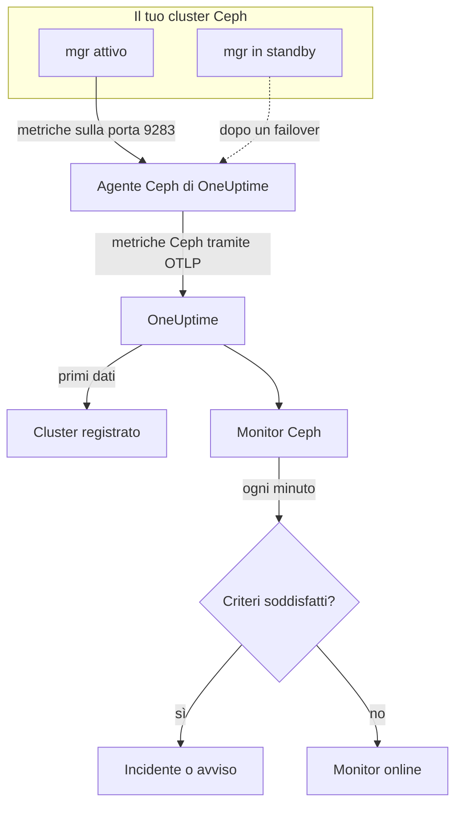

# Monitor Ceph

Un monitor Ceph sorveglia un cluster Ceph — il suo stato di salute, gli health check, il quorum dei monitor, gli OSD, i pool e i placement group — e ti avvisa appena lo stato peggiora, un OSD va giù o la capacità comincia a scarseggiare. Legge le metriche `ceph_*` che il modulo `prometheus` del mgr di Ceph esporta, raccolte dall'agente Ceph di OneUptime, quindi niente viene interrogato dall'esterno.

:::cards
- [Creare il monitor](#creare-un-monitor-ceph): Sei passaggi nella dashboard.
- [Modelli](#modelli-di-avviso-predefiniti): 23 avvisi pronti per stato, OSD, placement group e capacità.
- [Health check](#serie-degli-health-check): Ricevere un avviso su qualsiasi health check di Ceph per nome.
- [Metriche](#metriche-raccolte): Ogni serie `ceph_*` su cui il monitor può generare avvisi.
:::

## Come funziona

Il modulo `prometheus` del mgr di Ceph espone le metriche del cluster sulla porta 9283. L'agente Ceph di OneUptime interroga ogni daemon mgr ogni 30 secondi — quello attivo risponde, gli standby non restituiscono nulla finché non subentrano —, mantiene le etichette di Ceph (`ceph_daemon`, `pool_id`) e invia le metriche a OneUptime tramite OTLP, contrassegnate con il nome del cluster, `ceph.cluster.name`. I primi dati registrano il cluster.

Un monitor Ceph è legato a un solo cluster. Ogni minuto esegue la sua query sulle metriche di quel cluster e confronta il risultato con i suoi criteri.



## Prima di iniziare

- **Abilita il modulo `prometheus` del mgr** sul cluster:

  ```bash
  ceph mgr module enable prometheus
  ```

- **Installa l'agente Ceph** su una macchina che raggiunga ogni daemon mgr sulla porta 9283, ed elencali tutti in `CEPH_MGR_ENDPOINTS`. La [guida all'agente Ceph](/docs/telemetry/ceph) spiega l'installazione.
- **Verifica che il cluster sia registrato.** Compare in **Prodotti → Infrastruttura → Ceph → Tutti i cluster**, con il nome di `CEPH_CLUSTER_NAME` dell'agente, circa un minuto dopo la prima raccolta.
- **Per gli avvisi sugli health check**, usa Ceph Quincy o successivo. Le versioni precedenti non esportano `ceph_health_detail`.

## Creare un monitor Ceph

:::steps
### Avviare un nuovo monitor

Vai a **Monitor** e fai clic su **Crea monitor**.

### Scegliere Ceph

In **Tipo di monitor**, fai clic su **Altri tipi di monitor** e scegli **Ceph** in **Infrastruttura**, oppure digita `ceph` nella casella di ricerca. Inserisci un **Nome** — compare nei titoli di incidenti e avvisi — e fai clic su **Avanti**.

### Scegliere il cluster

In **Ceph Monitor Configuration**, scegli il cluster da **Ceph Cluster**. Ogni cluster che ha inviato dati è nell'elenco.

### Scegliere cosa sorvegliare

Scegli una delle tre schede:

- **Quick Setup**: fai clic su un [modello](#modelli-di-avviso-predefiniti). Imposta metriche, filtri, aggregazione, intervallo di tempo e soglie, e sostituisce i criteri sottostanti con i propri. Puoi comunque cambiare l'**Intervallo di tempo**.
- **Custom Metric**: scegli una metrica da **Ceph Metric**, poi imposta **Aggregazione** e **Intervallo di tempo**. **OSD** e **Pool ID** la limitano a un daemon o a un pool.
- **Avanzato**: costruisci da solo query e formule in **Seleziona metriche**, per esempio un rapporto di capacità usata da `ceph_cluster_total_used_bytes / ceph_cluster_total_bytes`. Usa **Group by** `ceph_daemon` o `pool_id` per valutare ogni daemon o pool separatamente.

### Controllare i criteri

Apri ogni criterio in **Criteri del monitor** e controlla **Metrica**, **Aggregazione**, **Condizione** e **Threshold**. Un modello li compila. Con **Custom Metric** o **Avanzato**, il monitor parte con i [criteri predefiniti](#criteri-predefiniti), che notano solo una metrica che scende a zero, quindi imposta una tua soglia.

### Creare il monitor

Fai clic su **Crea monitor**. OneUptime apre la pagina del monitor e lo valuta ogni minuto. Gli incidenti e gli avvisi che genera compaiono anche nelle pagine **Incidenti** e **Avvisi** del cluster.
:::

> [!TIP]
> Per configurare più modelli in una volta, apri il cluster da **Prodotti → Infrastruttura → Ceph** e vai a **Recommendations**. Scegli i modelli che vuoi e chi viene avvisato, e OneUptime crea un monitor per modello.

## Impostazioni del monitor

| Campo | Scheda | A cosa serve |
| --- | --- | --- |
| **Ceph Cluster** | Tutte | Obbligatorio. Limita ogni query a `resource.ceph.cluster.name`. |
| **OSD** | Custom Metric, Avanzato | Facoltativo. Corrispondenza esatta con l'etichetta `ceph_daemon`, per esempio `osd.3`. |
| **Pool ID** | Custom Metric, Avanzato | Facoltativo. Corrispondenza esatta con l'etichetta `pool_id`, per esempio `2`. |
| **Ceph Metric** | Custom Metric | Una metrica del [catalogo](#metriche-raccolte). |
| **Aggregazione** | Custom Metric | Come vengono combinati i campioni: **Media**, **Massimo**, **Minimo**, **Somma** o **Conteggio**. Parte dall'aggregazione abituale della metrica. |
| **Intervallo di tempo** | Tutte | La finestra mobile letta dalla query, da **Past 1 Minute** a **Past 365 Days**. Un nuovo monitor parte da **Past 1 Minute**; i modelli impostano il proprio. |
| **Seleziona metriche** | Avanzato | Il generatore di query: **Metrica**, **Aggregate by**, **Filter by attributes**, **Group by**, più **Aggiungi metrica** e **Aggiungi formula** per combinare le query. |

Le serie di dati dei pool hanno solo l'etichetta `pool_id`: il nome del pool esiste solo in `ceph_pool_metadata`. Filtra e raggruppa le serie dei pool per `pool_id`, e cerca il nome in `ceph_pool_metadata` quando ti serve.

### Serie degli health check

`ceph_health_detail` esporta **una serie per ogni health check attivo**, con le etichette `name` (per esempio `OSD_NEARFULL` o `RECENT_CRASH`) e `severity`. Una serie esiste solo finché il suo check scatta, quindi nessuna serie significa che è tutto a posto. Per un avviso su qualsiasi health check di Ceph, filtra sul suo `name`, scatta con **Massimo** sopra `0` e rientra a `0` con **Se nessun dato** impostato su **Treat As Zero**: esattamente come sono costruiti i modelli degli health check. `ceph_daemon_health_metrics` funziona allo stesso modo per daemon, con un'etichetta `type` (per esempio `SLOW_OPS`) e `ceph_daemon`.

## Modelli di avviso predefiniti

**Quick Setup** offre 23 modelli che coprono stato del cluster, OSD, placement group e capacità. Ognuno costruisce un monitor completo: query, filtri sulle etichette, un raggruppamento, un criterio che scatta e uno che rientra. Le soglie sono un punto di partenza modificabile.

I modelli leggono gli ultimi 5 minuti, salvo diversa indicazione nella tabella. Un criterio scatta solo se la condizione vale per ogni minuto della sua finestra, e un criterio a soglia rientra il 10% oltre la propria soglia, così un valore che oscilla intorno al limite non va avanti e indietro. **Gravità** è l'etichetta che mostra il selettore; l'incidente e l'avviso creati da un modello partono con la gravità di incidente e di avviso più alta del tuo progetto.

### Modelli per lo stato del cluster

| Modello | Gravità | Sorveglia | Scatta quando | Rientra quando |
| --- | --- | --- | --- | --- |
| Cluster Health Error | Critico | `ceph_health_status`, Max, ultimo minuto | 2 o più: `HEALTH_ERR` | Sotto 1,8: `HEALTH_WARN` o meglio |
| Cluster Health Warning | Warning | `ceph_health_status`, Max | 1 o più: `HEALTH_WARN` o peggio | Sotto 0,9: `HEALTH_OK` |
| Monitor Quorum Degraded | Critico | `ceph_mon_quorum_status`, Min per `ceph_daemon`, ultimo minuto | Un monitor scende sotto 1, fuori dal quorum. Un incidente per monitor | Di nuovo a 1 |
| Slow Operations | Warning | `ceph_healthcheck_slow_ops`, Max | Sopra 0: il check `SLOW_OPS` del cluster è attivo | A 0 |
| Daemon Slow Operations | Warning | `ceph_daemon_health_metrics` per `type = SLOW_OPS`, Max per `ceph_daemon` | Sopra 0. Un incidente per OSD o monitor | La serie scompare |
| Daemon Crash | Critico | `ceph_health_detail` per `name = RECENT_CRASH`, Max | Il check è attivo: esistono crash di daemon non archiviati. Il mgr non ha metriche `ceph_crash_*`, quindi questo è l'unico segnale di crash | I crash vengono archiviati |
| Monitor Clock Skew | Warning | `ceph_health_detail` per `name = MON_CLOCK_SKEW`, Max | Il check è attivo: gli orologi dei monitor si discostano oltre lo scarto consentito (0,05 s per impostazione predefinita) | Il check scompare |
| Monitor Disk Critically Low | Critico | `ceph_health_detail` per `name = MON_DISK_CRIT`, Max | Il check è attivo: il disco del database di un monitor ha meno del 5% libero (valore predefinito) | Il check scompare |
| Monitor Disk Space Low | Warning | `ceph_health_detail` per `name = MON_DISK_LOW`, Max | Il check è attivo: meno del 30% libero (valore predefinito) | Il check scompare |

### Modelli per gli OSD

| Modello | Gravità | Sorveglia | Scatta quando | Rientra quando |
| --- | --- | --- | --- | --- |
| OSD Down | Critico | `ceph_osd_up`, Min per `ceph_daemon` | Un OSD scende sotto 1. Un incidente per OSD | Di nuovo a 1 |
| OSD Out | Warning | `ceph_osd_in`, Min per `ceph_daemon` | Un OSD scende sotto 1: escluso dalla distribuzione dei dati | Di nuovo a 1 |
| OSD High Latency | Warning | `ceph_osd_apply_latency_ms`, Avg per `ceph_daemon` | Sopra 100 ms. Un incidente per OSD | A 90 ms o meno |
| OSD Slow Heartbeats | Warning | `ceph_health_detail` per `name = OSD_SLOW_PING_TIME_FRONT` e `name = OSD_SLOW_PING_TIME_BACK`, Max | Uno dei due check è attivo: gli heartbeat sulla rete pubblica o su quella del cluster sono lenti. Il mgr non esporta alcuna misura del tempo di ping | Entrambi i check scompaiono |

### Modelli per i placement group

| Modello | Gravità | Sorveglia | Scatta quando | Rientra quando |
| --- | --- | --- | --- | --- |
| Inactive Placement Groups | Critico | `ceph_pg_total` − `ceph_pg_active`, Max per `pool_id` | Sopra 0: alcuni PG non possono servire I/O, quindi le richieste dei client verso di loro restano bloccate. Un incidente per pool | A 0 |
| Degraded Placement Groups | Warning | `ceph_pg_degraded`, Max per `pool_id` | Sopra 0: alcuni oggetti hanno meno repliche di quelle configurate | A 0 |
| Undersized Placement Groups | Warning | `ceph_pg_undersized`, Max per `pool_id` | Sopra 0: alcuni PG sono mappati su meno OSD del loro numero di repliche | A 0 |
| Damaged Placement Groups | Critico | `ceph_health_detail` per `name = PG_DAMAGED` e `name = OSD_SCRUB_ERRORS`, Max | Uno dei due check è attivo: lo scrubbing ha trovato danni o errori di lettura | Entrambi i check scompaiono |

### Modelli per la capacità

| Modello | Gravità | Sorveglia | Scatta quando | Rientra quando |
| --- | --- | --- | --- | --- |
| Cluster Near Full | Warning | `ceph_cluster_total_used_bytes` ÷ `ceph_cluster_total_bytes` × 100 | Sopra l'85%, il rapporto nearfull predefinito di Ceph | Al 76,5% o meno |
| Cluster Full | Critico | Lo stesso rapporto | Sopra il 95%, il rapporto full predefinito di Ceph, oltre il quale le scritture si fermano in tutto il cluster | All'85,5% o meno |
| Pool Near Full | Warning | `ceph_pool_stored` ÷ (`ceph_pool_stored` + `ceph_pool_max_avail`) × 100, per `pool_id` | Sopra l'85% di ciò che il pool può contenere. Un incidente per pool | Al 76,5% o meno |
| OSD Nearfull | Warning | `ceph_health_detail` per `name = OSD_NEARFULL`, Max | Il check è attivo: un OSD ha superato la soglia nearfull (85% per impostazione predefinita). I singoli OSD si riempiono molto prima della media del cluster | Il check scompare |
| OSD Backfillfull | Warning | `ceph_health_detail` per `name = OSD_BACKFILLFULL`, Max | Il check è attivo: il backfill sull'OSD viene rifiutato (90% per impostazione predefinita) e il recupero si blocca | Il check scompare |
| OSD Full | Critico | `ceph_health_detail` per `name = OSD_FULL`, Max, ultimo minuto | Il check è attivo: un OSD ha raggiunto la soglia full (95% per impostazione predefinita) e le scritture vengono rifiutate | Il check scompare |

- **I modelli per guasti e quorum usano il minimo**, così un solo OSD giù o un solo monitor fuori dal quorum li fa scattare invece di restare nascosto dalla maggioranza sana.
- **I modelli di conteggio e degli health check usano il massimo**, così basta una sola raccolta negativa.
- **Le serie di PG e pool sono per pool**: non esiste una misura dell'intero cluster, quindi quei modelli raggruppano per `pool_id` e aprono un incidente per pool.
- **I rapporti di capacità** usano la **Somma** di entrambi i lati. Entrambi provengono dalla stessa raccolta del mgr, quindi il risultato è una vera percentuale. **Inactive Placement Groups** usa invece **Massimo** per pool, perché una somma accumulerebbe le raccolte in una sottrazione.
- **I modelli degli health check** rientrano quando il check scompare: i loro criteri di rientro contano una serie mancante come 0.

Alcuni avvisi non hanno un modello. Lo sbilanciamento dei PG richiede statistiche su più serie che i criteri non possono calcolare. La previsione della capacità richiede una curva di crescita, che invece disegna la dashboard del cluster. La previsione dei guasti dei dischi e lo scrubbing arretrato non hanno metriche del mgr, mentre NVMe-oF, il mirroring RBD e cephadm richiedono altri exporter.

## Metriche raccolte

L'agente interroga ogni daemon mgr ogni 30 secondi e mantiene le etichette di Ceph, quindi le serie per daemon hanno `ceph_daemon` (`osd.3`, `mon.a`) e le serie per pool hanno `pool_id`.

### Metriche dello stato del cluster

| Metrica | Unità | Descrizione |
| --- | --- | --- |
| `ceph_health_status` | — | Stato complessivo: 0 = `HEALTH_OK`, 1 = `HEALTH_WARN`, 2 = `HEALTH_ERR`. |
| `ceph_health_detail` | conteggio | Una serie per ogni health check **attivo**, con le etichette `name` e `severity`. Solo da Quincy in poi. |
| `ceph_healthcheck_slow_ops` | conteggio | Operazioni lente di OSD e monitor segnalate dal check `SLOW_OPS`. |
| `ceph_daemon_health_metrics` | conteggio | Metriche di stato per daemon, identificate da `type` (per esempio `SLOW_OPS`) e `ceph_daemon`. |
| `ceph_mon_quorum_status` | conteggio | 1 quando il monitor è nel quorum, per `ceph_daemon` (per esempio `mon.a`). |
| `ceph_mon_metadata` | conteggio | Metadati del monitor, sempre 1. Sommali per contare i monitor. |
| `ceph_cluster_total_bytes` | byte | Capacità grezza totale. |
| `ceph_cluster_total_used_bytes` | byte | Capacità grezza in uso. |

### Metriche degli OSD

| Metrica | Unità | Descrizione |
| --- | --- | --- |
| `ceph_osd_up` | conteggio | 1 quando l'OSD è attivo, per `ceph_daemon` (per esempio `osd.3`). |
| `ceph_osd_in` | conteggio | 1 quando l'OSD fa parte della distribuzione dei dati. |
| `ceph_osd_apply_latency_ms` | ms | Tempo per applicare un'operazione allo storage sottostante. |
| `ceph_osd_commit_latency_ms` | ms | Tempo per confermare un'operazione nel journal o nel WAL. |
| `ceph_osd_stat_bytes` | byte | Capacità grezza del dispositivo dell'OSD. |
| `ceph_osd_stat_bytes_used` | byte | Byte grezzi usati sull'OSD. Confrontali con il totale per individuare OSD sbilanciati o quasi pieni. |
| `ceph_osd_numpg` | conteggio | Placement group sull'OSD. |
| `ceph_osd_metadata` | conteggio | Metadati dell'OSD (nome host, classe del dispositivo, versione), sempre 1. Sommali per contare gli OSD. |

### Metriche dei pool

| Metrica | Unità | Descrizione |
| --- | --- | --- |
| `ceph_pool_stored` | byte | Dati utente memorizzati nel pool. |
| `ceph_pool_max_avail` | byte | Byte ancora scrivibili nel pool, dato il suo profilo di replica o di erasure coding. |
| `ceph_pool_objects` | conteggio | Oggetti nel pool. |
| `ceph_pool_rd` | ops | Operazioni di lettura sul pool. Un contatore cumulativo. |
| `ceph_pool_wr` | ops | Operazioni di scrittura sul pool. Un contatore cumulativo. |
| `ceph_pool_rd_bytes` | byte | Byte letti dal pool. Un contatore cumulativo. |
| `ceph_pool_wr_bytes` | byte | Byte scritti nel pool. Un contatore cumulativo. |
| `ceph_pool_metadata` | conteggio | Metadati del pool, sempre 1: l'unica serie che associa `pool_id` a un nome. |

### Metriche dei placement group

Ogni serie `ceph_pg_*` è per pool, con l'etichetta `pool_id`; somma sui pool per un conteggio dell'intero cluster.

| Metrica | Unità | Descrizione |
| --- | --- | --- |
| `ceph_pg_total` | conteggio | Placement group nel pool. |
| `ceph_pg_active` | conteggio | PG nello stato `active`, in grado di servire I/O. |
| `ceph_pg_clean` | conteggio | PG nello stato `clean`, completamente replicati. |
| `ceph_pg_degraded` | conteggio | PG nello stato `degraded`. |
| `ceph_pg_undersized` | conteggio | PG nello stato `undersized`. |
| `ceph_num_objects_degraded` | conteggio | Oggetti con meno repliche di quelle configurate. |
| `ceph_num_objects_misplaced` | conteggio | Oggetti che non si trovano dove CRUSH li vuole. I dati sono al sicuro; è sbagliato solo il posizionamento. |

## Criteri di monitoraggio

Un criterio confronta una delle query o formule del monitor con una soglia. I criteri di un monitor Ceph non hanno un **Tipo di filtro**: ogni regola controlla il valore della metrica, con questi campi.

| Campo | A cosa serve |
| --- | --- |
| **Metrica** | La query o formula da controllare, tramite il suo nome di variabile. |
| **Aggregazione** | Come i valori della finestra diventano un'unica risposta: **Media**, **Somma**, **Maximum Value**, **Minimum Value**, **All Values** (ogni valore deve corrispondere) o **Any Value** (ne basta uno). |
| **Condizione** | **Greater Than**, **Less Than**, **Greater Than Or Equal To**, **Less Than Or Equal To** o **Equal To**, oppure una condizione di anomalia: **Anomalously High**, **Anomalously Low** o **Anomalous**. |
| **Threshold** | Il valore di confronto. Accanto compare un elenco di unità quando la metrica ne ha una. Non visibile per le condizioni di anomalia. |
| **Sensibilità** | Solo condizioni di anomalia. **Low** (4σ), **Medium** (3σ, predefinito) o **High** (2σ). |
| **Finestra di riferimento** | Solo condizioni di anomalia. 14 giorni (predefinito), 28, 60 o 90 giorni di storico. |
| **Se nessun dato** | In **Altri campi**. Cosa succede quando la finestra non contiene campioni: **Ignore** (predefinito), **Treat As Zero** o **Trigger**. |

Le condizioni di anomalia confrontano ogni valore con la stessa ora della settimana nel riferimento. Restano nello stato "Learning", senza generare nulla, finché la finestra di riferimento non contiene abbastanza storico.

Ogni criterio indica anche cosa fare quando corrisponde: cambiare lo stato del monitor, creare un avviso o dichiarare un incidente. I criteri vengono controllati dall'alto verso il basso, e decide il primo che corrisponde.

### Criteri predefiniti

Un monitor che non costruisci da un modello parte con due criteri:

| Ordine | Criterio | Corrisponde quando | Poi |
| --- | --- | --- | --- |
| 1 | Check if _nome del monitor_ is offline | Un valore della prima query è `0` | Imposta il monitor su **Offline** e dichiara l'incidente "_nome del monitor_ is offline", che si risolve da solo quando il monitor si riprende. |
| 2 | Check if _nome del monitor_ is online | Un valore è sopra `0` | Imposta il monitor su **Operativo**. |

Questi valori predefiniti vanno bene per poche metriche Ceph: `ceph_health_status` vale 0 quando il cluster è sano. Scegli un modello o imposta criteri tuoi.

> [!IMPORTANT]
> Il silenzio non corrisponde a nessuno dei due criteri: un cluster che smette di inviare dati lascia il monitor com'era. Per sapere quando i dati si fermano, imposta **Se nessun dato** su **Trigger** in un criterio.

## Risoluzione dei problemi

:::details Il cluster non è nell'elenco Ceph Cluster
I cluster si registrano da soli a partire dai dati dell'agente. Controlla che l'agente sia in esecuzione e invii dati (vedi la [guida all'agente Ceph](/docs/telemetry/ceph)) e che `CEPH_CLUSTER_NAME` sia impostato.
:::

:::details Le metriche si sono fermate dopo un failover del mgr
L'agente deve interrogare **ogni** daemon mgr, non solo quello attivo: gli standby non restituiscono nulla finché non subentrano. Elenca ogni mgr in `CEPH_MGR_ENDPOINTS`.
:::

:::details ceph_health_status vale 1 ma non scatta nulla
Controlla che il criterio usi **Greater Than Or Equal To** `1` e non **Greater Than**, e che l'**Intervallo di tempo** del monitor copra almeno una raccolta di 30 secondi.
:::

:::details I modelli degli health check non scattano mai
I modelli che sorvegliano `ceph_health_detail` — Daemon Crash, Monitor Clock Skew, OSD Nearfull, OSD Backfillfull, OSD Full, i due modelli per il disco dei monitor, Damaged Placement Groups e OSD Slow Heartbeats — richiedono il modulo `prometheus` del mgr di Quincy o successivo. Mentre un check è attivo, verifica che la serie esista:

```bash
curl http://ACTIVE_MGR:9283/metrics | grep ceph_health_detail
```

Le serie degli health check, `ceph_daemon_health_metrics` compresa, esistono solo mentre un check scatta, quindi è normale non trovarne quando il cluster è sano.
:::

:::details Contatori come ceph_pool_wr_bytes crescono soltanto
Le serie di I/O dei pool sono contatori cumulativi, e i criteri confrontano valori grezzi: non esiste un operatore di tasso, e **Convert to per-second rate** nel generatore di query cambia solo il grafico. Visualizzali come tasso, oppure crea un avviso sulla loro crescita con una formula, per esempio una query **Massimo** meno una query **Minimo** dello stesso contatore.
:::

## Passaggi successivi

:::cards
- [Agente Ceph](/docs/telemetry/ceph): Installare e aggiornare l'agente da cui legge questo monitor.
- [Monitor Proxmox](/docs/monitor/proxmox-monitor): Sorvegliare il cluster Proxmox VE che usa lo storage.
- [Monitor array di storage](/docs/monitor/storage-array-monitor): Lo stesso tipo di monitor per gli array Pure Storage.
- [Incidenti](/docs/incidents/index): Cosa succede dopo che un criterio dichiara un incidente.
:::
