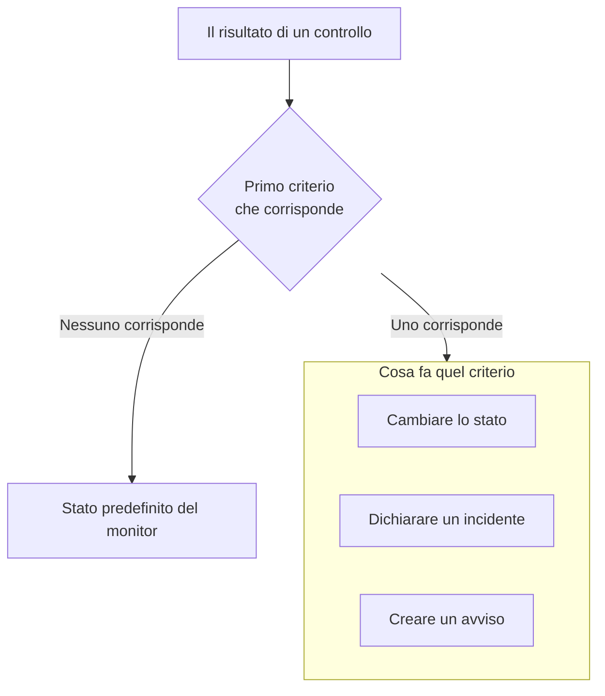

# Creare un monitor

Un monitor controlla qualcosa che gestite, come un sito web, un'API, un host o un cluster Kubernetes, e vi avvisa quando smette di funzionare. **Crea monitor** chiede prima cosa monitorare, poi cosa controllare e infine con quale frequenza. Tutto, tranne il tipo, il nome e cosa controllare, parte con valori predefiniti adatti alla maggior parte dei monitor.

> [!NOTE]
> Per creare un monitor serve il ruolo Project Owner, Project Admin, Project Member, Monitor Admin o Monitor Member, oppure un ruolo personalizzato con il permesso Create Monitor.

## Informazioni sul monitor

Il primo passaggio chiede cosa monitorare e come chiamare il monitor.

:::steps
### Aprire Crea monitor

Andate in **Monitor** e fate clic su **Crea monitor**. Il modulo si apre sul primo passaggio, **Informazioni sul monitor**.

### Scegliere il tipo di monitor

La prima domanda è il **Tipo di monitor**: cosa volete monitorare?

- I sei tipi che si creano più spesso vengono per primi: **Sito web**, **API**, **Ping**, **Porta**, **SSL Certificate** e **Incoming Request**, per gli heartbeat di cron job e webhook.
- **Altri tipi di monitor** elenca tutti gli altri tipi sotto la loro categoria, come **Infrastruttura** (Kubernetes, Docker, host) e **Telemetria** (registri, metriche, tracce). **Manual**, un monitor di cui impostate voi lo stato, si trova sotto **Altro**.
- Oppure digitate nella casella di ricerca. Conosce le parole che già usate, come `k8s`, `postgres`, `heartbeat` o `tls`, e **Enter** sceglie il primo risultato.

Il tipo scelto si riduce a una riga. Fate clic su **Cambia** per sceglierne un altro; premete **Escape** durante la scelta per mantenere il tipo che avevate.

### Dare un nome al monitor

Compilate il **Nome**. Viene usato negli avvisi e nei titoli degli incidenti. **Descrizione** ed **Etichette** sono facoltativi e attendono sotto **Altri campi**.

Un monitor **Manual** non ha bisogno d'altro, quindi **Crea monitor** è su questo passaggio. Per qualsiasi altro tipo, fate clic su **Avanti**.
:::

## Criteri

Il secondo passaggio chiede cosa controllare e decide cosa conta come un problema.

:::steps
### Inserire cosa controllare

Questo passaggio si apre su cosa controllare. Per un sito web è il suo URL, con un esempio nella casella; gli altri tipi chiedono un host, una query, un cluster o un filtro di log. Le impostazioni che la maggior parte dei monitor non cambia mai, come i timeout e i nuovi tentativi, sono ripiegate sotto **Altri campi**.

Per un monitor controllato dalle sonde, **Testa il monitor** esegue il controllo una volta prima del salvataggio: scegliete una sonda in **Seleziona sonda** e fate clic su **Esegui test**. La risposta si apre in **Risultato del test del monitor**.

### Rivedere i criteri

Sotto, i **Criteri del monitor** decidono quando il monitor cambia stato, dichiara un incidente o crea un avviso. Un nuovo monitor parte con criteri adatti alla maggior parte dei monitor, ciascuno ripiegato su una riga che dice cosa controlla e cosa fa. Un nuovo monitor di sito web, per esempio, viene segnato offline e dichiara un incidente quando il sito non risponde o risponde con un codice di stato di errore.

Fate clic su un criterio per aprirlo e modificarlo. **Aggiungi criteri** ne aggiunge uno, aperto e pronto da compilare. Per cambiare l'ordine, trascinate un criterio dalla maniglia alla sua sinistra.

### Passare al passaggio successivo

Fate clic su **Avanti**. Niente su questo passaggio viene segnalato come mancante finché non fate clic su **Avanti**.
:::

### Come vengono valutati i criteri

Il risultato di ogni controllo passa per i criteri dall'alto verso il basso, e il primo che corrisponde decide cosa succede. Quel criterio può cambiare lo stato del monitor, dichiarare un incidente, creare un avviso o qualsiasi combinazione dei tre. Quando nessuno corrisponde, il monitor mostra il suo **Stato predefinito del monitor**, impostato sotto **Altri campi** sotto i criteri (**Operativo**, a meno che non ne scegliate un altro).

Gli incidenti e gli avvisi impostati per risolversi automaticamente, come quelli dei criteri predefiniti, si risolvono da soli appena il loro criterio smette di corrispondere. Un monitor controllato da più sonde cambia solo quando le sue sonde concordano: per impostazione predefinita, ogni sonda attiva e connessa deve arrivare allo stesso risultato. Per richiederne meno, impostate **Accordo tra sonde** nella pagina **Configurazione → Sonde e intervallo** del monitor.

## Sonde e intervallo

I monitor controllati dalle sonde terminano con questo passaggio: Sito web, API, Ping, IP, Porta, SSL Certificate, DNS, DNSSEC, NTP, Dominio, SQL Query, Database Health, Synthetic Monitor, Custom JavaScript Code e External Status Page. Le **Sonde** sono le macchine che eseguono i controlli, e le sonde predefinite del vostro progetto partono selezionate. L'**Intervallo di monitoraggio** parte da **Ogni 5 minuti**.

:::steps
### Scegliere le sonde

Mantenete le **Sonde** selezionate o sceglietene altre. Un monitor senza sonde non viene mai controllato. Per controllare qualcosa su una rete privata, eseguite una [sonda personalizzata](/docs/probe/custom-probe) in quella rete e sceglietela qui.

### Scegliere la frequenza dei controlli

Scegliete un **Intervallo di monitoraggio**, da **Ogni minuto** a **Ogni settimana**. Ai monitor Synthetic Monitor, Custom JavaScript Code e SSL Certificate vengono offerti intervalli di 5 minuti o più.

### Creare il monitor

Fate clic su **Crea monitor**. Si apre la pagina del nuovo monitor. Per cambiare in seguito le sue sonde o il suo intervallo, aprite **Configurazione → Sonde e intervallo** su quella pagina.
:::

Tutti gli altri tipi, tranne Manual, vengono creati dal passaggio **Criteri**.

## Partire da un modello o da un link

Un modello di monitor, e i link che creano un monitor in altre parti di OneUptime (su un grafico di metriche, un dispositivo di rete o una regola di rilevamento), aprono **Crea monitor** con il tipo scelto e il resto compilato. Fate clic su **Cambia** per scegliere un tipo diverso. Il modulo di un modello usa lo stesso selettore di tipo: vedete [Modelli di monitor](/docs/monitor/monitor-templates).

Ogni tipo di monitor ha una propria pagina con le sue impostazioni, i suoi criteri predefiniti ed esempi. Buoni posti da cui proseguire:

:::cards
- [Monitor sito web](/docs/monitor/website-monitor): Controllare che una pagina si carichi, e cosa risponde.
- [Monitor API](/docs/monitor/api-monitor): Chiamare un endpoint con un metodo, intestazioni e un corpo.
- [Modelli di monitor](/docs/monitor/monitor-templates): Creare molti monitor da una configurazione e mantenerli allineati.
- [Incidenti](/docs/incidents/index): Cosa succede dopo che un monitor dichiara un incidente.
:::
