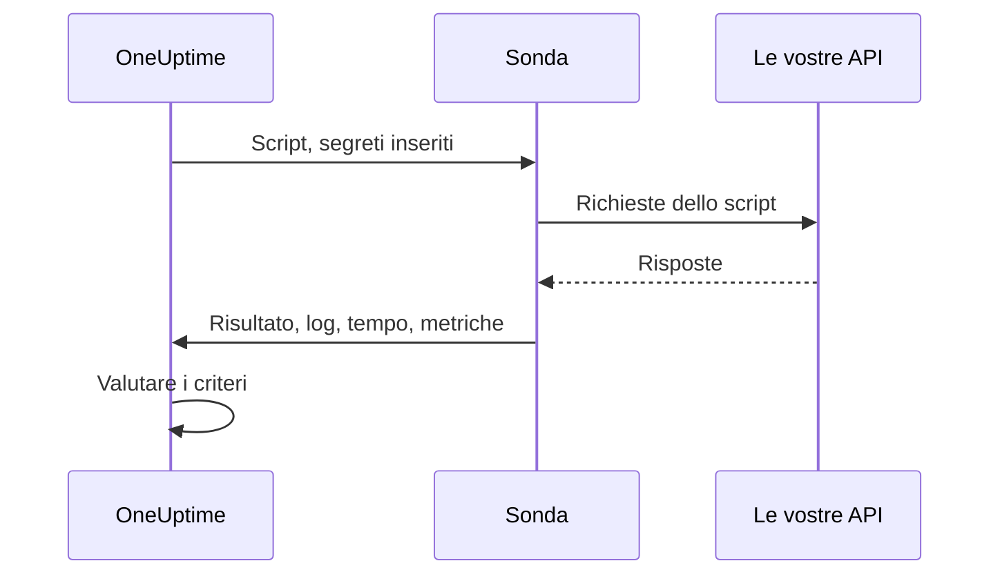

# Monitor codice personalizzato

Un monitor Custom Code esegue a intervalli regolari, da una sonda, uno script JavaScript scritto da voi. Usatelo per i controlli che gli altri tipi di monitor non sanno esprimere: un accesso seguito da una chiamata API autenticata, una transazione in più passaggi o un valore calcolato da più risposte. Se lo script genera un errore, il controllo fallisce; ciò che restituisce è a disposizione dei vostri criteri e dei vostri modelli di incidente.

:::cards
- [Creare il monitor](#creare-un-monitor-custom-code): Scrivete uno script e scegliete le sonde che lo eseguono.
- [Scrivere lo script](#scrivere-lo-script): Un controllo API in più passaggi, pronto all'uso, come punto di partenza.
- [Usare i segreti](#usare-i-segreti-del-monitor): Tenete password e token fuori dallo script.
- [Catturare metriche personalizzate](#metriche-personalizzate): Rappresentate in grafico qualsiasi numero calcolato dallo script.
:::

## Come funziona

A ogni controllo, una sonda esegue il vostro script in una sandbox JavaScript isolata, con i segreti del monitor già inseriti. Lo script chiama ciò che gli serve, poi restituisce un risultato o genera un errore. La sonda riporta il risultato, i messaggi di log dello script, quanto è durato e le metriche catturate, e OneUptime valuta su questa base i vostri criteri.



La sandbox non è Node.js: non ci sono `require`, `process`, `fetch` né un file system, solo i [moduli elencati più sotto](#moduli-disponibili-nello-script).

## Prima di iniziare

- Una **sonda** in grado di raggiungere ogni endpoint chiamato dallo script. Usate una [sonda personalizzata](/docs/probe/custom-probe) per gli endpoint all'interno della vostra rete.
- Per chiamare un indirizzo privato (come `10.0.0.5`), la sonda deve consentirlo: impostate `PROBE_ALLOW_PRIVATE_NETWORK_MONITORS=true` su quella sonda. Gli indirizzi di loopback, link-local e dei metadati cloud vengono sempre rifiutati. Consultate [Accesso alla rete privata](/docs/self-hosted/private-network-access).
- Ogni password, chiave API o token di cui lo script ha bisogno, salvato come [segreto del monitor](/docs/monitor/monitor-secrets).

## Creare un monitor Custom Code

:::steps
### Iniziare un nuovo monitor

Andate in **Monitor** e fate clic su **Crea monitor**. In **Tipo di monitor**, fate clic su **Altri tipi di monitor** e scegliete **Custom JavaScript Code** sotto **Synthetic Monitoring**, oppure digitate `script` nella casella di ricerca. Inserite un **Nome**, poi fate clic su **Avanti**.

### Aggiungere lo script

Scrivete lo script nell'editor **Codice JavaScript**. Partite dall'[esempio qui sotto](#scrivere-lo-script).

### Testarlo

Fate clic su **Testa il monitor** per eseguire lo script una volta da una sonda, e controllatene il risultato.

### Rivedere i criteri

Il monitor parte con due criteri: è offline, e dichiara un incidente, quando lo script fallisce, e online quando non fallisce. Modificateli o aggiungetene di vostri (vedete [Criteri](#criteri)), poi fate clic su **Avanti**.

### Scegliere le sonde e creare

Selezionate le **Sonde** che raggiungono i vostri endpoint e un **Intervallo di monitoraggio** (ai monitor Custom Code sono proposti intervalli di 5 minuti o più), poi fate clic su **Crea monitor**.
:::

## Scrivere lo script

Lo script è il corpo di una funzione `async`: potete usare `await` al livello più alto, restituire un risultato con `return` e far fallire il controllo con `throw`. Questo esempio effettua l'accesso, chiama un endpoint con il token ottenuto e fallisce se la risposta non è quella attesa:

```javascript title="Custom code monitor script"
// 1. Log in. axios rejects a 4xx or 5xx response, which fails the check.
const login = await axios.post("https://api.example.com/v1/login", {
  username: "monitoring@example.com",
  password: "{{monitorSecrets.ApiPassword}}",
});

// 2. Call an endpoint that needs the token.
const orders = await axios.get("https://api.example.com/v1/orders?limit=10", {
  headers: { Authorization: `Bearer ${login.data.token}` },
  timeout: 10000,
});

// 3. Fail the check when the data is wrong, not only when the request fails.
if (!Array.isArray(orders.data.items)) {
  throw new Error("The orders endpoint returned no items");
}

console.log(`Fetched ${orders.data.items.length} orders`);

// 4. Return what the criteria and incident templates should see.
return {
  data: orders.data.items.length,
};
```

| Per | Fate così | Cosa registra OneUptime |
| --- | --- | --- |
| Riportare un risultato | `return { data: ... }` con un qualsiasi valore JSON | Il **Risultato**. Viene conservata solo la proprietà `data`: `return 5` non registra alcun risultato. |
| Far fallire il controllo | `throw new Error("...")` | L'**Errore di script**, che i criteri predefiniti trasformano in un incidente. |
| Lasciare una traccia | `console.log(...)` | I **Messaggi di log**, fino a 1.000 per esecuzione. |

Per vedere un'esecuzione, aprite la **Panoramica** del monitor: la scheda **Riepilogo del monitor** mostra la sonda, il tempo di esecuzione e l'errore, e **Mostra altri dettagli** mostra il risultato, l'errore di script e i messaggi di log. **Registri di monitoraggio** contiene lo stesso riepilogo per i controlli precedenti.

> [!NOTE]
> In questa sandbox `axios` non segue i reindirizzamenti, e le sue richieste non passano da un proxy configurato sulla sonda. Richiedete l'URL finale.

## Usare i segreti del monitor

Fate riferimento a un segreto con `{{monitorSecrets.NAME}}` in qualsiasi punto dello script. OneUptime sostituisce il riferimento con il valore del segreto, come testo semplice, prima che lo script arrivi alla sonda. Racchiudete quindi il segreto tra virgolette per usarlo come stringa, e lasciatelo senza virgolette per usarlo come numero o booleano:

```javascript
// Used as a string: wrap it in quotes.
const apiKey = "{{monitorSecrets.ApiKey}}";

// Used as a number or a boolean: leave it bare.
const retryLimit = {{monitorSecrets.RetryLimit}};
const verbose = {{monitorSecrets.Verbose}};

// Check the secret was filled in without logging the secret itself.
console.log(apiKey.length > 0);
```

Un valore segreto che contiene un carattere di virgolette spezza la stringa che lo circonda. Un riferimento che il monitor non può usare resta nello script così come è scritto. Per creare un segreto e scegliere quali monitor possono usarlo, consultate [Segreti del monitor](/docs/monitor/monitor-secrets).

## Metriche personalizzate

Potete catturare metriche personalizzate dallo script con la funzione `oneuptime.captureMetric()`. Queste metriche vengono salvate in OneUptime e possono essere rappresentate nelle dashboard con l'esploratore di metriche.

```javascript
oneuptime.captureMetric(name, value, attributes);
```

| Parametro | Tipo | Descrizione |
| --- | --- | --- |
| `name` | string, obbligatorio | Il nome della metrica (ad es. `"api.response.time"`). Viene salvato automaticamente con il prefisso `custom.monitor.`. |
| `value` | number, obbligatorio | Il valore numerico della metrica. Un valore che non è un numero viene ignorato. |
| `attributes` | object, facoltativo | Coppie chiave-valore per aggiungere contesto. Vengono registrati i valori stringa, numero e booleano (numeri e booleani come testo, perché gli attributi delle metriche sono dimensioni e non misure). I valori di qualsiasi altro tipo vengono ignorati. |

### Esempio

```javascript
const response = await axios.get("https://api.example.com/health");

// Capture a simple metric
oneuptime.captureMetric("api.response.time", response.data.latency);

// Capture a metric with attributes
oneuptime.captureMetric("api.queue.depth", response.data.queueDepth, {
  region: "us-east-1",
  environment: "production",
});

return {
  data: response.data,
};
```

Una volta catturate, queste metriche compaiono nell'esploratore di metriche con nomi come `custom.monitor.api.response.time`, e nella pagina **Metriche** del monitor sotto **Metriche personalizzate**. OneUptime aggiunge il monitor e la sonda a ogni punto dati, così potete rappresentarle in grafico, creare avvisi e filtrare per monitor, per sonda o per qualsiasi attributo personalizzato che avete fornito.

### Limiti

| Limite | Valore | Oltre il limite |
| --- | --- | --- |
| Metriche per esecuzione dello script | 100 | Le chiamate successive vengono ignorate. |
| Lunghezza del nome della metrica | 200 caratteri | Il nome viene troncato. |
| Attributi per metrica | 50 | Gli attributi successivi vengono scartati. |
| Lunghezza della chiave di un attributo | 200 caratteri | La chiave viene troncata. |
| Lunghezza del valore di un attributo | 1000 caratteri | Il valore viene troncato. |

### Chiavi di attributo riservate

Alcuni nomi di attributo appartengono a OneUptime, e uno script non può scriverli. Se il vostro script ne imposta uno, l'attributo viene scartato (la metrica viene comunque registrata) e un avviso con il nome della chiave viene scritto nei log del server OneUptime. Sono:

- L'identità del monitor: `monitorId`, `projectId`, `monitorName`, `probeName`, `probeId`, `isCustomMetric`.
- Tutto ciò che si trova negli spazi dei nomi `oneuptime.` o `resource.`: contengono gli identificatori che OneUptime aggiunge in fase di acquisizione.
- Gli attributi di identità delle risorse: `service.name`, `host.name`, `k8s.cluster.name`, `iot.fleet.name`, `proxmox.cluster.name`, `vmware.vcenter.name`, `ceph.cluster.name`, `storage.array.name` e `docker.swarm.cluster.name`.

Questi nomi non sono semplici etichette: OneUptime li rilegge come l'indicazione della risorsa a cui appartiene un punto dati. Una metrica con `service.name: payments-api` comparirebbe nella scheda Metriche di quel servizio, e se in seguito creaste un monitor di metriche raggruppato per `service.name`, i suoi avvisi sarebbero collegati a quel servizio, avviserebbero i proprietari di quel servizio e tacerebbero durante una finestra di manutenzione su di esso. Per associare un monitor a un servizio o a un host, usate invece le etichette del monitor stesso.

## Criteri

I criteri di un monitor Custom Code possono controllare:

| Tipo di filtro | Cosa controlla | Condizioni del filtro |
| --- | --- | --- |
| **Errore** | L'errore generato dallo script, se presente. | Contiene, Not Contains, Equal To, Not Equal To, Is Empty, Is Not Empty |
| **Result Value** | I `data` restituiti dallo script. Confrontati come numero quando lo sono. | Le stesse, più Greater Than, Less Than, Greater Than Or Equal To, Less Than Or Equal To, Vero e Falso |
| **Tempo di esecuzione (in ms)** | Quanto è durato lo script. | Confronti numerici |

I criteri predefiniti segnano il monitor online quando **Errore** è vuoto, e offline (con un incidente che si risolve da solo quando lo script torna a funzionare) quando non lo è. Nei modelli di incidente e di avviso, l'esecuzione è disponibile come `{{result}}`, `{{scriptError}}`, `{{logMessages}}` e `{{executionTimeInMs}}`: consultate [Modelli di incidenti e avvisi](/docs/monitor/incident-alert-templating).

### Avvisi sui dati restituiti

Ciò che lo script restituisce come `data` è il **Result Value** del monitor, e un criterio può confrontarlo: per esempio _Result Value è Equal To `UP`_.

Quando `data` è un oggetto o un array, compilate **Percorso del campo (facoltativo)** nel filtro Result Value per confrontare uno dei suoi campi invece del valore intero. Usate i punti per i campi annidati e `[n]` per gli elementi di un array:

```javascript
const response = await axios.get("https://api.example.com/health");

return {
  data: {
    status: response.data.status, // "UP"
    cpu_busy_percent: response.data.cpu, // 42
    healthy: response.data.healthy, // true
    checks: response.data.checks, // [{ name: "db", latency: 12 }]
  },
};
```

| Percorso del campo | Confronta | Condizione di esempio |
| --- | --- | --- |
| `status` | `"UP"` | Not Equal To `UP` |
| `cpu_busy_percent` | `42` | Greater Than `90` |
| `healthy` | `true` | Falso |
| `checks[0].latency` | `12` | Greater Than `500` |

Aggiungete un filtro per ogni campo da controllare; ognuno può avere la propria condizione e il proprio valore.

- Lasciate vuoto il percorso del campo per confrontare il valore intero, come per uno script che restituisce un solo numero o una sola stringa.
- Greater Than, Less Than e le altre condizioni numeriche corrispondono solo a un numero, quindi restituite un campo come `42`, non come `"42"`. Vero e Falso corrispondono solo a un booleano.
- Un campo assente dai dati restituiti (una chiave mancante, o un indice oltre la fine dell'array) viene confrontato come vuoto: **Is Empty** vi corrisponde, e nessun'altra condizione.
- Un campo il cui nome contiene un punto non si può raggiungere con un percorso.
- In Terraform, il `custom_code_monitor_options` del filtro imposta il percorso del campo: consultate [Passaggi del monitor](/docs/terraform/monitor-steps#comparing-one-field-of-a-scripts-result).

## Moduli disponibili nello script

| Nome | Che cos'è |
| --- | --- |
| `axios` | Un client HTTP basato sulle promise: chiamate `axios(...)`, oppure `axios.get`, `post`, `put`, `patch`, `delete`, `head`, `options`, `request` e `create`. Le dimensioni di richieste e risposte sono limitate (10 MB ciascuna), i reindirizzamenti non vengono seguiti e il proxy di una sonda non viene usato. |
| `crypto` | `createHash` e `createHmac` (chiamate `update()` una volta, poi `digest()`), `randomBytes`, `randomInt` e `randomUUID`. Non è il modulo `crypto` di Node.js: non ci sono cifrari né firme. |
| `http`, `https` | Solo la loro classe `Agent`, da passare ad `axios`: per esempio `httpsAgent: new https.Agent({ rejectUnauthorized: false })`. Non ci sono `request` né `get`. |
| `console.log` | Registra dati per il debug. Esiste solo `console.log`; `console.error` e gli altri non esistono. |
| `oneuptime.captureMetric` | Cattura una metrica personalizzata. Consultate [Metriche personalizzate](#metriche-personalizzate). |
| `setTimeout`, `clearTimeout`, `sleep(ms)` | Attendere all'interno dello script. Un'attesa non supera mai il tempo limite dello script. |

## Aspetti da considerare

- **Tempo limite.** Uno script che dura più di 60 secondi viene fermato e il controllo fallisce con "Script execution timed out". Su una sonda self-hosted, `PROBE_CUSTOM_CODE_MONITOR_SCRIPT_TIMEOUT_IN_MS` modifica il limite.
- **Memoria.** Ogni esecuzione ha la propria sandbox con un limite di memoria di 128 MB.
- **Reindirizzamenti.** `axios` non li segue, quindi un URL che reindirizza fa fallire la richiesta. Usate l'URL finale.

## Risoluzione dei problemi

:::details Il controllo fallisce con "Script execution timed out"
Lo script ha superato il tempo limite. Date a ogni richiesta il proprio `timeout` (in millisecondi), così un endpoint lento fallisce subito, con un errore che lo nomina.
:::

:::details Una richiesta fallisce con uno stato 301 o 302
Qui `axios` non segue i reindirizzamenti. Sostituite l'URL con l'indirizzo verso cui reindirizza.
:::

:::details Una richiesta verso un indirizzo interno viene rifiutata
La sonda non consente indirizzi di rete privata. Impostate `PROBE_ALLOW_PRIVATE_NETWORK_MONITORS=true` su una sonda all'interno della vostra rete ed eseguite il monitor da quella: consultate [Accesso alla rete privata](/docs/self-hosted/private-network-access).
:::

:::details Un segreto non viene inserito
Il monitor non può usare il segreto, oppure il nome nel riferimento non corrisponde esattamente al nome del segreto. Consultate [Segreti del monitor](/docs/monitor/monitor-secrets).
:::

## Passi successivi

:::cards
- [Monitor sintetico](/docs/monitor/synthetic-monitor): Pilotate un browser vero invece di chiamare API.
- [Segreti del monitor](/docs/monitor/monitor-secrets): Salvate le credenziali usate dal vostro script.
- [Modelli di incidenti e avvisi](/docs/monitor/incident-alert-templating): Inserite il risultato e i log dello script negli incidenti.
:::
