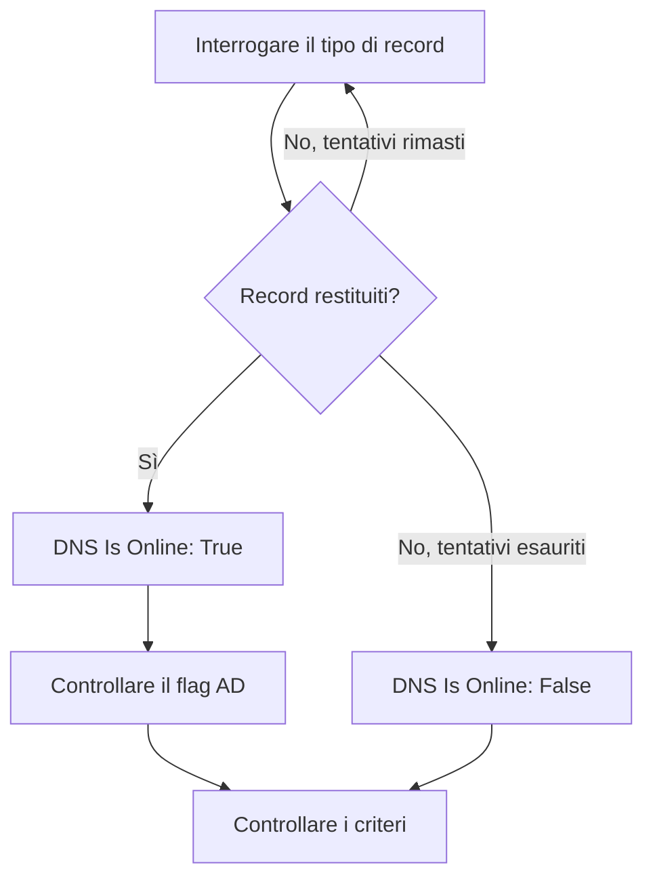

# Monitor DNS

Un monitor DNS interroga un record DNS a intervalli regolari e controlla la risposta: che il nome si risolva, in quanto tempo e cosa dicono i record. Usatelo per accorgervi di un guasto DNS, di un record cambiato o scomparso, o di un resolver lento, prima che se ne accorgano i vostri utenti.

:::cards
- [Creare il monitor](#creare-un-monitor-dns): Sei passaggi nella dashboard.
- [Opzioni di configurazione](#opzioni-di-configurazione): Il nome, il tipo di record e il server DNS.
- [Criteri di monitoraggio](#criteri-di-monitoraggio): Risoluzione, record, tempo di risposta e DNSSEC.
- [Risoluzione dei problemi](#risoluzione-dei-problemi): Quando il monitor e `dig` non sono d'accordo.
:::

## Come funziona

A ogni controllo, una sonda chiede a un server DNS un tipo di record di un nome, come i record `A` di `example.com`. Il nome è online quando il server risponde con almeno un record di quel tipo. Una query che fallisce, va in timeout o non restituisce alcun record viene ritentata un secondo dopo, fino al numero di tentativi che impostate. Poi la sonda chiede a un resolver di convalida se la risposta porta il flag authenticated-data (AD) di DNSSEC, e OneUptime valuta il risultato con i criteri del monitor.



Una sonda che ha perso la propria connessione di rete non riporta alcun risultato, quindi non può segnare il vostro DNS come offline.

## Prima di iniziare

- **Un ruolo che può creare monitor**: Project Owner, Project Admin, Project Member, Monitor Admin o Monitor Member, oppure un ruolo personalizzato con il permesso Create Monitor.
- **Una sonda che raggiunga il server DNS.** Le sonde predefinite del vostro progetto vengono scelte per ogni nuovo monitor. Per interrogare un server DNS su una rete privata, come un resolver interno, usate una [sonda personalizzata](/docs/probe/custom-probe) in quella rete.

## Creare un monitor DNS

:::steps
### Iniziare un nuovo monitor

Andate in **Monitor** e fate clic su **Crea monitor**. In **Tipo di monitor**, fate clic su **Altri tipi di monitor** e scegliete **DNS** sotto **DNS Monitoring**.

### Dargli un nome

Inserite un **Nome**, come `example.com A records`, poi fate clic su **Avanti**.

### Inserire la query

Inserite il **Nome di dominio** da interrogare, come `example.com`, e scegliete il suo **Tipo di record**. Per interrogare un server preciso, inseritelo in **Server DNS (opzionale)**; lasciatelo vuoto per usare il resolver della sonda.

### Testarlo

Fate clic su **Testa il monitor**, scegliete una sonda in **Seleziona sonda** e fate clic su **Esegui test**. **Risultato del test del monitor** mostra i record che la sonda ha ricevuto.

### Rivedere i criteri

**Criteri del monitor** parte dai [criteri predefiniti](#criteri-predefiniti): offline quando il nome non si risolve, online quando si risolve. Per controllare cosa dicono i record, aggiungete un filtro **DNS Record Value**, poi fate clic su **Avanti**.

### Scegliere le sonde e creare

Mantenete o cambiate le **Sonde** e l'**Intervallo di monitoraggio** (parte da **Ogni 5 minuti**), poi fate clic su **Crea monitor**. Si apre la pagina del monitor.
:::

## Opzioni di configurazione

| Campo | Predefinito | Cosa inserire |
| --- | --- | --- |
| **Nome di dominio** | Nessuno | Il nome da interrogare, come `example.com` o `_sip._tcp.example.com`. Per un record `PTR`, il nome inverso, come `34.216.184.93.in-addr.arpa`. |
| **Tipo di record** | `A` | Il tipo di record da interrogare. Vedete [Tipi di record](#tipi-di-record). |
| **Server DNS (opzionale)** | Il resolver della sonda | Un server DNS da interrogare al suo posto, come `8.8.8.8` o `ns1.example.com`. Ogni tipo di record, `CAA` compreso, viene chiesto a lui. |
| **Porta** (sotto **Altri campi**) | `53` | La porta del server in **Server DNS (opzionale)**. Il controllo DNSSEC interroga la stessa porta. |
| **Timeout (ms)** (sotto **Altri campi**) | `5000` | Quanto attendere una risposta, in millisecondi. |
| **Tentativi** (sotto **Altri campi**) | `3` | Nuovi tentativi dopo che il primo fallisce. `0` significa un solo tentativo. |

### Tipi di record

Un criterio **DNS Record Value** confronta il vostro testo con ogni record così come lo scrive la sonda, quindi rispettate questo formato:

| Tipo di record | Cosa contiene | Formato del valore, per i criteri |
| --- | --- | --- |
| `A` | Indirizzi IPv4 | `93.184.216.34` |
| `AAAA` | Indirizzi IPv6 | `2606:2800:220:1:248:1893:25c8:1946` |
| `CNAME` | Il nome di cui questo è un alias | `example.net` |
| `MX` | Server di posta | `10 mail.example.com` (priorità, poi il server) |
| `NS` | Name server | `ns1.example.com` |
| `TXT` | Testo, come record SPF e di verifica | `v=spf1 include:_spf.example.com ~all` |
| `SOA` | L'inizio di autorità della zona | `ns1.example.com hostmaster.example.com 2024010101 7200 3600 1209600 3600` (server, contatto, numero di serie, refresh, retry, expire, TTL minimo) |
| `PTR` | Il nome a cui un indirizzo rimanda (DNS inverso) | `server1.example.com` |
| `SRV` | Servizi | `10 5 5060 sip.example.com` (priorità, peso, porta, destinazione) |
| `CAA` | Le autorità di certificazione autorizzate a emettere per il nome | `0 letsencrypt.org` (flag, poi l'autorità) |

Un record `TXT` diviso in più stringhe viene unito in un unico valore.

## Criteri di monitoraggio

I criteri decidono quando il nome conta come online, degradato o offline, e se questo dichiara un incidente o crea un avviso. Ogni criterio controlla uno o più filtri:

| Filtro | Condizioni | Cosa controlla |
| --- | --- | --- |
| **DNS Is Online** | **Vero**, **Falso** | Se la query ha restituito almeno un record del tipo. |
| **DNS Response Time (in ms)** | **Greater Than**, **Less Than**, **Greater Than Or Equal To**, **Less Than Or Equal To** | Quanto è durata la query. |
| **DNS Record Exists** | **Vero**, **Falso** | Se è tornato un record del tipo. |
| **DNS Record Value** | **Contiene**, **Not Contains**, **Starts With**, **Ends With**, **Equal To**, **Not Equal To** | I valori dei record. Il filtro corrisponde quando corrisponde un solo record. |
| **DNSSEC Is Valid** | **Vero**, **Falso** | Se un resolver di convalida imposta il flag AD sulla risposta. |

**DNS Record Value** corrisponde quando corrisponde _uno qualsiasi_ dei record. Con più record `A`, **Equal To** `93.184.216.34` corrisponde quando uno di essi è quell'indirizzo, e **Not Equal To** corrisponde quando uno di essi non lo è.

**DNSSEC Is Valid** interroga il server in **Server DNS (opzionale)**, sulla sua **Porta**, oppure Google Public DNS (`8.8.8.8`) quando il campo è vuoto, quindi il server che impostate dovrebbe convalidare DNSSEC. Il filtro non ha valore, e non corrisponde in nessun senso, quando la sonda non può eseguire quel controllo. Per un controllo completo di una zona firmata, usate un [monitor DNSSEC](/docs/monitor/dnssec-monitor).

Con due o più filtri, **Condizione di corrispondenza** decide se devono corrispondere **Tutti** o se basta **Qualsiasi** filtro. Le **Azioni** di un criterio decidono cosa fa: cambiare lo stato del monitor, creare un avviso, dichiarare un incidente, o più di queste cose.

### Criteri predefiniti

Un nuovo monitor DNS parte con due criteri:

- **Offline** — il nome non si risolve, o non ha alcun record del tipo, dopo tutti i nuovi tentativi. Il monitor viene segnato **Offline** e viene creato un incidente chiamato «_monitor name_ is offline». L'incidente si risolve da solo quando il nome torna a risolversi.
- **Online** — il nome si risolve. Il monitor viene segnato **Operativo**.

I criteri vengono controllati dall'alto verso il basso, e il primo che corrisponde decide cosa succede. Quando nessuno corrisponde, il monitor mostra il suo stato predefinito: **Operativo**, a meno che non ne scegliate un altro sotto **Altri campi**, sotto i criteri.

### Valutare su un periodo di tempo

**Valuta questo criterio su un periodo di tempo** è una casella sotto un filtro, offerta per **DNS Is Online** e **DNS Response Time (in ms)**. Attivatela per giudicare una finestra di controlli passati invece dell'ultimo: scegliete un'aggregazione in **Valuta** e una finestra, da 2 a 60 minuti, in **Per gli ultimi (in minuti)**.

| Aggregazione | Corrisponde quando |
| --- | --- |
| **Media**, **Somma**, **Maximum Value**, **Minimum Value** | Quel valore, sulla finestra, soddisfa la condizione. Solo **DNS Response Time (in ms)**. |
| **All Values** | Ogni controllo della finestra soddisfa la condizione. |
| **Any Value** | Almeno un controllo della finestra soddisfa la condizione. |

**All Values** corrisponde solo quando la finestra è davvero coperta da dati. Un monitor appena creato, o uno i cui controlli hanno smesso di essere registrati, non ha abbastanza storico per dire qualcosa sugli ultimi N minuti, quindi il criterio aspetta invece di corrispondere sull'unica lettura che ha. **Any Value** è l'impostazione per «avvisatemi appena un singolo controllo supera la soglia» e scatta comunque subito.

**Se nessun dato** decide cosa succede finché la finestra non può sostenere il criterio:

| Opzione | Cosa succede | Da usare per |
| --- | --- | --- |
| **Ignore** (predefinito) | Il criterio non corrisponde. | Gli avvisi di soglia normali. |
| **Trigger** | I dati mancanti contano come il problema. | I controlli in cui il silenzio è di per sé un guasto. |
| **Treat As Zero** | La finestra viene confrontata come un singolo zero. | I contatori in cui nessun evento significa davvero zero. |

### Esempi di criteri

| Obiettivo | Filtro | Condizione | Valore |
| --- | --- | --- | --- |
| Offline quando il nome smette di risolversi | **DNS Is Online** | **Falso** | — |
| Avvisare quando cambia l'unico record `A` di un nome | **DNS Record Value** | **Not Equal To** | `93.184.216.34` |
| Avvisare quando un record `MX` punta fuori dal vostro dominio | **DNS Record Value** | **Not Contains** | `example.com` |
| Segnare il DNS come degradato quando è lento | **DNS Response Time (in ms)** | **Greater Than** | `500` |
| Avvisare quando la convalida DNSSEC fallisce | **DNSSEC Is Valid** | **Falso** | — |

## Risoluzione dei problemi

:::details Il monitor dice offline, ma per me il nome si risolve
La sonda ha interrogato un altro server, o chiesto un altro tipo di record. Controllate il **Tipo di record**: un nome che ha solo un `CNAME`, o solo record `AAAA`, non ha un record `A`. Confrontate con `dig` sullo stesso server:

```bash
dig @8.8.8.8 example.com A
```
:::

:::details Un criterio Not Equal To scatta anche se l'indirizzo giusto c'è
**DNS Record Value** corrisponde quando corrisponde un solo record. Con più record, **Not Equal To** scatta appena uno di essi è diverso. Per controllare che un valore preciso sia tra i record, sfruttate l'ordine dei criteri, perché vince il primo che corrisponde:

1. Tenete in cima il criterio offline predefinito: **DNS Is Online** / **Falso**.
2. Sotto, aggiungete un criterio con **DNS Record Value** / **Equal To** / il valore che vi aspettate, che segni il monitor **Operativo**.
3. Ancora sotto, aggiungete un criterio con **DNS Is Online** / **Vero**, che segni il monitor **Offline** e dichiari un incidente. Corrisponde solo alle risposte che non hanno il valore.
:::

:::details DNSSEC Is Valid non corrisponde mai
Il server in **Server DNS (opzionale)** non convalida DNSSEC, quindi non imposta mai il flag AD, oppure la sonda non è riuscita a eseguire il controllo. Lasciate il campo vuoto per convalidare con `8.8.8.8`, o usate un [monitor DNSSEC](/docs/monitor/dnssec-monitor).
:::

## Passaggi successivi

:::cards
- [Monitor DNSSEC](/docs/monitor/dnssec-monitor): Convalidare la catena di fiducia di una zona firmata.
- [Monitor dominio](/docs/monitor/domain-monitor): Tenere d'occhio la registrazione e la scadenza del dominio.
- [Sonde personalizzate](/docs/probe/custom-probe): Interrogare server DNS interni dalla vostra rete.
- [Panoramica degli incidenti](/docs/incidents/index): Cosa succede dopo che il monitor ne ha dichiarato uno.
:::
