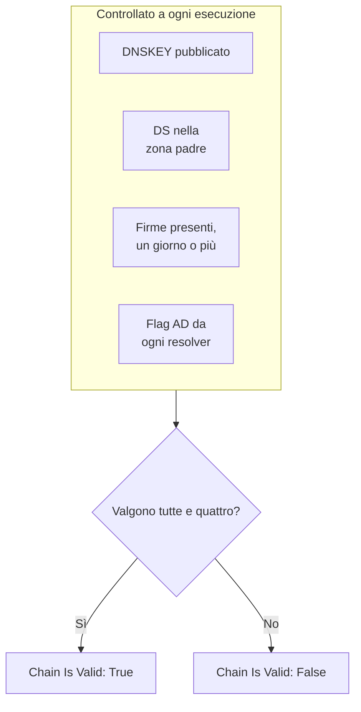

# Monitor DNSSEC

Un monitor DNSSEC controlla che una zona DNS firmata si convalidi ancora: che pubblichi le sue chiavi, che la zona padre garantisca per lei, che le sue firme non siano scadute e che i resolver di convalida la accettino. Usatelo per accorgervi di una catena di fiducia interrotta prima che i resolver inizino a rispondere `SERVFAIL` per il vostro dominio.

:::cards
- [Creare il monitor](#creare-un-monitor-dnssec): Sei passaggi nella dashboard.
- [Cosa viene controllato](#come-funziona): I controlli dietro una catena valida.
- [Criteri di monitoraggio](#criteri-di-monitoraggio): Validità della catena, chiavi, record DS, firme, resolver e nameserver.
- [Buone pratiche](#buone-pratiche): Soglie e resolver che funzionano.
:::

## Come funziona

A ogni controllo, una sonda esegue una serie di query DNS sulla zona:

| Query | A chi viene chiesta | Cosa vi dice |
| --- | --- | --- |
| `DNSKEY` | Il primo resolver in **Risolutori** | Se la zona pubblica le sue chiavi di firma. |
| `DS` | Il primo resolver in **Risolutori** | Se la zona padre pubblica un record delegation signer per la zona. |
| `SOA`, con i record DNSSEC | Il primo resolver in **Risolutori** | Se i record della zona sono firmati (l'`RRSIG` che firma il suo record `SOA`) e quando scade la firma più vicina alla scadenza. |
| `A`, con convalida DNSSEC | Ogni resolver in **Risolutori** | Se ogni resolver di convalida accetta la zona, cosa che indica con il flag authenticated-data (AD). |
| `NS`, poi `SOA` | Il primo resolver, poi ogni nameserver autorevole che indica | Se ogni nameserver serve lo stesso numero di serie SOA. Solo quando **Verifica la coerenza dei nameserver** è attivo. |

I resolver di convalida controllano la catena di fiducia a partire dalla radice, quindi il flag AD vi dice che l'intera catena regge. La catena conta come valida quando vale tutto questo:

Una firma a cui resta meno di un giorno conta già come interrotta, quindi lo sapete fino a un giorno prima che i resolver inizino a rifiutare la zona. Un controllo che trova la catena interrotta, o i nameserver non allineati, viene rieseguito un secondo dopo, fino al numero di tentativi che impostate, prima che OneUptime valuti il risultato con i criteri del monitor. Tutte le query di un tentativo condividono una scadenza pari a tre volte il **Timeout (ms)**; un tentativo che esaurisce il tempo segnala un timeout, non un verdetto sulla zona.

## Prima di iniziare

- **Un ruolo che può creare monitor**: Project Owner, Project Admin, Project Member, Monitor Admin o Monitor Member, oppure un ruolo personalizzato con il permesso Create Monitor.
- **Una zona firmata.** La zona deve essere firmata, e il suo record DS pubblicato nella zona padre tramite il vostro registrar.
- **DNS in uscita dalla sonda** verso i resolver che indicate e, per il controllo di coerenza dei nameserver, verso i nameserver autorevoli della zona. Le sonde predefinite del vostro progetto vengono scelte per ogni nuovo monitor.

## Creare un monitor DNSSEC

:::steps
### Iniziare un nuovo monitor

Andate in **Monitor** e fate clic su **Crea monitor**. In **Tipo di monitor**, fate clic su **Altri tipi di monitor** e scegliete **DNSSEC** sotto **DNS Monitoring**.

### Dargli un nome

Inserite un **Nome**, come `example.com DNSSEC`, poi fate clic su **Avanti**.

### Inserire la zona

In **Zona (Nome di dominio)**, inserite la zona da convalidare, come `example.com`. Mantenete i **Risolutori** predefiniti, oppure indicate i vostri, separati da virgole. Lasciate attivo **Verifica la coerenza dei nameserver** a meno che la vostra rete non blocchi il DNS verso server arbitrari.

### Testarlo

Fate clic su **Testa il monitor**, scegliete una sonda in **Seleziona sonda** e fate clic su **Esegui test**. **Risultato del test del monitor** mostra cosa ha trovato ogni controllo.

### Rivedere i criteri

**Criteri del monitor** parte dai [criteri predefiniti](#criteri-predefiniti): offline quando la catena è interrotta, online quando è valida. Per essere avvisati prima che le firme scadano, aggiungete un criterio (vedete [Buone pratiche](#buone-pratiche)), poi fate clic su **Avanti**.

### Scegliere le sonde e creare

Mantenete o cambiate le **Sonde** e l'**Intervallo di monitoraggio** (parte da **Ogni 5 minuti**), poi fate clic su **Crea monitor**. Si apre la pagina del monitor.
:::

## Opzioni di configurazione

| Campo | Predefinito | Cosa inserire |
| --- | --- | --- |
| **Zona (Nome di dominio)** | Nessuno | La zona da convalidare, come `example.com`. |
| **Risolutori** | `1.1.1.1, 8.8.8.8, 9.9.9.9` | I resolver di convalida da interrogare, separati da virgole. Ognuno deve restituire il flag AD perché la catena conti come valida. |
| **Verifica la coerenza dei nameserver** | Attivo | Interrogare direttamente ogni nameserver autorevole e confrontarne i numeri di serie SOA. Disattivatelo se la vostra rete blocca il DNS in uscita verso server arbitrari. |
| **Avviso di scadenza della firma (giorni)** (sotto **Altri campi**) | `7` | Salvato con il monitor. Il filtro **DNSSEC Signature Expires In Days** usa il valore che gli date nel criterio, quindi impostate lì la vostra soglia. |
| **Timeout (ms)** (sotto **Altri campi**) | `10000` | Quanto attendere ogni query DNS, in millisecondi. Un tentativo può durare in tutto fino a tre volte tanto. |
| **Tentativi** (sotto **Altri campi**) | `3` | Nuovi tentativi dopo che il primo fallisce. `0` significa un solo tentativo. |

## Criteri di monitoraggio

I criteri decidono quando la zona conta come online, degradata o offline, e se questo dichiara un incidente o crea un avviso. Ogni criterio controlla uno o più filtri:

| Filtro | Condizioni | Cosa controlla |
| --- | --- | --- |
| **DNSSEC Chain Is Valid** | **Vero**, **Falso** | Valgono tutti e quattro i controlli sopra: chiavi pubblicate, DS nella zona padre, firme presenti con un giorno o più davanti, e il flag AD da ogni resolver. |
| **DNSSEC DNSKEY Record Exists** | **Vero**, **Falso** | La zona pubblica almeno un record DNSKEY. |
| **DNSSEC DS Record Exists At Parent** | **Vero**, **Falso** | La zona padre pubblica un record DS per la zona. |
| **DNSSEC Signature Expires In Days** | **Greater Than**, **Less Than**, **Greater Than Or Equal To**, **Less Than Or Equal To** | I giorni interi prima che scada la firma (RRSIG) più vicina alla scadenza. |
| **DNSSEC Resolver Consensus (AD Flag)** | **Vero**, **Falso** | Ogni resolver in **Risolutori** restituisce il flag AD. |
| **DNSSEC Nameservers Are Consistent** | **Vero**, **Falso** | Ogni nameserver autorevole risponde con lo stesso numero di serie SOA. Sempre **Vero** finché **Verifica la coerenza dei nameserver** è disattivato. |

Con due o più filtri, **Condizione di corrispondenza** decide se devono corrispondere **Tutti** o se basta **Qualsiasi** filtro. Le **Azioni** di un criterio decidono cosa fa: cambiare lo stato del monitor, creare un avviso, dichiarare un incidente, o più di queste cose.

### Criteri predefiniti

Un nuovo monitor DNSSEC parte con due criteri:

- **Catena interrotta** — **DNSSEC Chain Is Valid** è **Falso**. Il monitor viene segnato **Offline** e viene creato un incidente chiamato «_monitor name_ DNSSEC chain is broken». L'incidente si risolve da solo appena la catena torna valida.
- **Catena valida** — il monitor viene segnato **Operativo**.

I criteri vengono controllati dall'alto verso il basso, e il primo che corrisponde decide cosa succede. Quando nessuno corrisponde, il monitor mostra il suo stato predefinito: **Operativo**, a meno che non ne scegliate un altro sotto **Altri campi**, sotto i criteri.

I criteri predefiniti non sorvegliano da soli la scadenza delle firme né la coerenza dei nameserver. Aggiungete dei criteri per questo, come sotto.

### Esempi di criteri

| Obiettivo | Filtro | Condizione | Valore |
| --- | --- | --- | --- |
| Offline quando la catena è interrotta (uno predefinito) | **DNSSEC Chain Is Valid** | **Falso** | — |
| Avvisare prima che le firme scadano | **DNSSEC Signature Expires In Days** | **Less Than** | `7` |
| Accorgersi di una delega che ha perso il suo record DS | **DNSSEC DS Record Exists At Parent** | **Falso** | — |
| Accorgersi di resolver in disaccordo | **DNSSEC Resolver Consensus (AD Flag)** | **Falso** | — |
| Accorgersi di nameserver non allineati | **DNSSEC Nameservers Are Consistent** | **Falso** | — |

## Buone pratiche

1. **Scegliete resolver sempre raggiungibili.** Ogni resolver deve restituire il flag AD perché la catena conti come valida, quindi un resolver che la sonda non raggiunge fa fallire il controllo una volta esauriti i tentativi. I predefiniti, `1.1.1.1`, `8.8.8.8` e `9.9.9.9`, sono gestiti da tre operatori diversi, il che individua anche una zona che si convalida su un resolver ma non su un altro.
2. **Fatevi avvisare prima che le firme scadano.** I firmatari rifirmano una zona prima che le sue firme scadano, quindi una firma vicina alla scadenza significa che la rifirma si è fermata. Aggiungete un criterio con **DNSSEC Signature Expires In Days** / **Less Than** / `7` che crei un avviso, e un secondo a `2` che dichiari un incidente. Trascinate entrambi sopra il criterio che segna la catena come valida, prima quello a `2` giorni, perché vince il primo criterio che corrisponde. Scegliete soglie più basse del tempo che il vostro firmatario lascia di solito su una firma prima di rifirmare, così restano silenziose finché la rifirma funziona.
3. **Monitorate ogni zona firmata.** Includete il dominio apex, i sottodomini firmati e ogni zona delegata a un operatore diverso.
4. **Tenete attivo il controllo di coerenza dei nameserver,** e aggiungete un criterio per esso. Individua un secondario che ha smesso di ricevere i trasferimenti dal primario, cosa che la sola convalida DNSSEC può non notare.

## Risoluzione dei problemi

:::details La catena risulta interrotta, ma la zona si convalida con `dig`
Uno dei resolver in **Risolutori** non ha restituito il flag AD: non era raggiungibile dalla sonda, oppure non convalida DNSSEC. La tabella **Resolver Checks**, in **Risultato del test del monitor** e nel riepilogo di ogni controllo, mostra la risposta e l'errore di ogni resolver. Togliete i resolver che la sonda non raggiunge, e indicate solo resolver di convalida.
:::

:::details I nameserver risultano incoerenti subito dopo una modifica
I secondari possono restare indietro rispetto al primario per un po' dopo una modifica della zona. La tabella **Nameserver Consistency** nel riepilogo del controllo mostra il numero di serie SOA di ogni nameserver. Se uno resta indietro, quel secondario ha smesso di ricevere i trasferimenti. Se ogni nameserver mostra un errore, alla sonda potrebbe essere impedito di interrogarli direttamente: disattivate **Verifica la coerenza dei nameserver**.
:::

:::details Il controllo segnala un timeout
Tutte le query di un tentativo condividono tre volte il **Timeout (ms)**. Un resolver lento o irraggiungibile lo consuma; toglietelo da **Risolutori**, oppure aumentate il timeout.
:::

## Passaggi successivi

:::cards
- [Monitor DNS](/docs/monitor/dns-monitor): Controllare che un nome si risolva, e cosa dicono i suoi record.
- [Monitor dominio](/docs/monitor/domain-monitor): Tenere d'occhio la registrazione e la scadenza del dominio.
- [Monitor certificato SSL](/docs/monitor/ssl-certificate-monitor): Tenere d'occhio i certificati serviti sul dominio.
- [Panoramica degli incidenti](/docs/incidents/index): Cosa succede dopo che il monitor ne ha dichiarato uno.
:::
