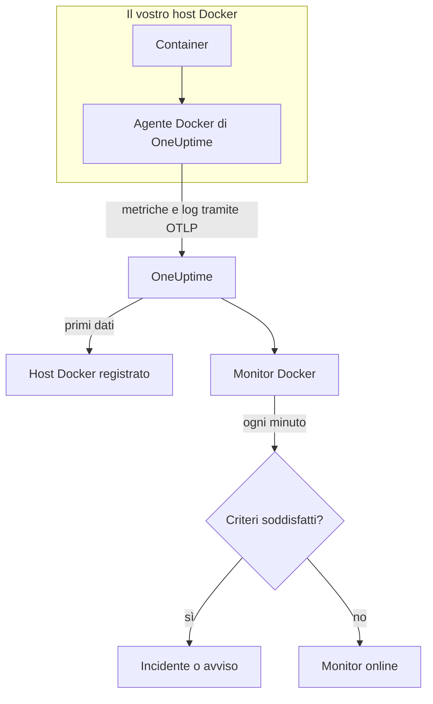

# Monitor Docker

Un monitor Docker sorveglia i container di un host Docker e vi avvisa quando un container si surriscalda, esaurisce la memoria o entra in un loop di riavvii. Legge le metriche che l'agente Docker di OneUptime invia dall'host, quindi niente viene sondato dall'esterno: installate l'agente, poi create il monitor da un modello o dalla vostra query.

:::cards
- [Creare il monitor](#creare-un-monitor-docker): Sei passaggi nella dashboard.
- [Modelli](#modelli-di-avviso-pronti): Sei avvisi pronti, un incidente per container.
- [Metriche](#metriche-raccolte): Cosa raccoglie l'agente e cosa significa ogni metrica.
- [Log](#log-raccolti): I log dei container e il driver di log di cui hanno bisogno.
:::

## Come funziona

L'agente Docker di OneUptime viene eseguito come container sull'host. Ogni 30 secondi legge le statistiche dei container dall'API di Docker Engine, segue i file di log dei container e invia entrambi a OneUptime tramite OTLP. I primi dati di un host lo registrano in OneUptime.

Un monitor Docker è legato a un host. Ogni minuto esegue la sua query sulle metriche dei container di quell'host e confronta il risultato con i suoi criteri.



## Prima di iniziare

- **Installate l'agente Docker** sull'host. La [guida all'agente Docker](/docs/telemetry/docker-host) spiega come installarlo, aggiornarlo e verificarlo.
- **Verificate che l'host sia registrato.** Compare in **Prodotti → Infrastruttura → Docker → Tutti gli host**, con il nome del `DOCKER_HOST_NAME` dell'agente, appena arrivano i suoi primi dati.
- **Per i log dei container**, eseguite i container con il driver di log `json-file` di Docker. Vedete [Requisito del driver di log](#requisito-del-driver-di-log).

## Creare un monitor Docker

:::steps
### Iniziare un nuovo monitor

Andate in **Monitor** e fate clic su **Crea monitor**.

### Scegliere Docker Container

In **Tipo di monitor**, fate clic su **Altri tipi di monitor** e scegliete **Docker Container** in **Infrastruttura**, oppure digitate `docker` nella casella di ricerca. Inserite un **Nome** – viene usato nei titoli di incidenti e avvisi – e fate clic su **Avanti**.

### Scegliere l'host

In **Configurazione monitor Docker**, scegliete l'host da **Host Docker**. Ogni host che ha inviato dati è nell'elenco.

### Scegliere cosa sorvegliare

Scegliete una delle tre schede:

- **Quick Setup** – fate clic su un [modello](#modelli-di-avviso-pronti). Imposta la metrica, l'aggregazione, l'intervallo di tempo e le soglie, e sostituisce i criteri più sotto con i propri. Potete comunque cambiare l'**Intervallo di tempo**.
- **Custom Metric** – scegliete una metrica da **Metrica Docker**, poi impostate **Aggregazione** e **Intervallo di tempo**. **Nome del container** e **Immagine del container** la restringono ad alcuni container.
- **Avanzato** – costruite voi query e formule in **Seleziona metriche**. Usate **Group by** `resource.container.name` per giudicare ogni container separatamente.

### Rivedere i criteri

Aprite ogni criterio in **Criteri del monitor** e verificatene **Metrica**, **Aggregazione**, **Condizione** e **Threshold**. Un modello li compila. Con **Custom Metric** o **Avanzato**, il monitor parte con i [criteri predefiniti](#criteri-predefiniti), che notano solo una metrica che scende a zero, quindi impostate la vostra soglia.

### Creare il monitor

Fate clic su **Crea monitor**. OneUptime apre la pagina del monitor e lo valuta ogni minuto. Gli incidenti e gli avvisi che genera compaiono anche nelle pagine **Incidenti** e **Avvisi** dell'host.
:::

> [!TIP]
> Per configurare più modelli alla volta, aprite l'host da **Prodotti → Infrastruttura → Docker** e andate in **Recommendations**. Scegliete i modelli che volete, scegliete chi viene avvisato, e OneUptime crea un monitor per modello.

## Impostazioni del monitor

| Campo | Scheda | Cosa fa |
| --- | --- | --- |
| **Host Docker** | Tutte | Obbligatorio. Limita ogni query al `resource.host.name` dell'host. OneUptime aggiunge anche `resource.container.runtime = docker` a ogni query. |
| **Metrica Docker** | Custom Metric | Una metrica del catalogo dell'agente, raggruppata in CPU, memoria, rete, I/O a blocchi e container. |
| **Nome del container** | Custom Metric, Avanzato | Facoltativo. Corrispondenza esatta su `resource.container.name`, per esempio `my-container`. |
| **Immagine del container** | Custom Metric, Avanzato | Facoltativo. Corrispondenza esatta su `resource.container.image.name`, per esempio `nginx:latest`. |
| **Aggregazione** | Custom Metric | Come vengono combinati i campioni: **Media**, **Massimo**, **Minimo**, **Somma** o **Conteggio**. Parte dall'aggregazione abituale della metrica. |
| **Intervallo di tempo** | Tutte | La finestra mobile che la query legge, da **Past 1 Minute** a **Past 365 Days**. Un nuovo monitor parte da **Past 1 Minute**; i modelli impostano la propria. |
| **Seleziona metriche** | Avanzato | Il costruttore di query: **Metrica**, **Aggregate by**, **Filter by attributes**, **Group by**, più **Aggiungi metrica** e **Aggiungi formula** per combinare le query. |

## Modelli di avviso pronti

**Quick Setup** offre sei modelli. Ognuno costruisce un monitor completo: una query raggruppata per `resource.container.name`, un criterio che scatta e uno che ripristina. Ogni container viene giudicato separatamente, così un container occupato non ne nasconde un altro, e ogni container che supera la soglia riceve il proprio incidente e il proprio avviso. Le soglie sono punti di partenza modificabili.

Salvo diversa indicazione nella tabella, un criterio scatta solo quando la condizione vale per ogni minuto della sua finestra, e si ripristina il 10% oltre la soglia, così un valore che oscila sul limite non cambia stato di continuo.

| Modello | Gravità | Sorveglia | Scatta quando | Si ripristina quando |
| --- | --- | --- | --- | --- |
| High Container CPU Usage | Warning | `container.cpu.utilization`, Max per container, ultimi 5 minuti | Sopra 80 (% di un core) | A 72 o meno |
| High Container Memory Usage | Warning | `container.memory.percent`, Max per container, ultimi 5 minuti | Sopra l'85% | Al 76,5% o meno |
| Container Restart Loop | Critico | Crescita di `container.restarts` per container, ultimi 15 minuti | Più di 3 riavvii nella finestra (Somma) | 2,7 o meno |
| Container CPU Throttling | Warning | Crescita di `container.cpu.throttling_data.throttled_time` in ms per container, ultimi 5 minuti | Più di 1000 ms nella finestra (Somma) | 900 ms o meno |
| High Container Process Count | Warning | `container.pids.count`, Max per container, ultimi 5 minuti | Sopra 2000 | A 1800 o meno |
| Container Down (Low Uptime) | Critico | `container.uptime`, Min per container, ultimo 1 minuto | Uguale a 0 | Sopra 0 |

**Gravità** è l'etichetta che mostra il selettore. L'incidente e l'avviso creati da un modello partono dalla gravità di incidente e di avviso più alta del vostro progetto; cambiatele nei criteri.

> [!NOTE]
> `container.cpu.utilization` è il numero stampato da `docker stats`: il 100% è un core di CPU intero, non l'intero host, quindi un container che usa due core segna 200. Su un host multicore la soglia di 80 è un budget di CPU, non una quota della macchina.

> [!NOTE]
> `container.memory.percent` divide per il limite di memoria del container quando è impostato, e altrimenti per la memoria totale **dell'host**. Verificate se il container è stato avviato con `--memory` prima di trattare un superamento come un'imminente terminazione per memoria esaurita.

> [!WARNING]
> `container.restarts` e `container.cpu.throttling_data.throttled_time` crescono soltanto, quindi quei due modelli avvisano in base a quanto sono cresciuti nella finestra: una query di Massimo e una di Minimo al minuto, sottratte da una formula e sommate. Con la raccolta dell'agente ogni 30 secondi, questo vede circa metà dell'attività reale, e le soglie ne tengono già conto. Se portate il `collection_interval` dell'agente a 60 secondi o più, ogni minuto contiene un solo campione ed entrambi i modelli smettono di avvisare.

> [!CAUTION]
> **Container Down (Low Uptime)** non può cogliere un container che si ferma e resta fermo. L'agente comunica solo i container in esecuzione, quindi un container fermo non invia alcun dato e il suo uptime non segna mai 0. Per un servizio che deve restare attivo, sorvegliate anche ciò che serve, per esempio con un [monitor API](/docs/monitor/api-monitor).

## Metriche raccolte

L'agente usa il receiver OpenTelemetry `docker_stats` sul socket di Docker, ogni 30 secondi. Le metriche di ogni container portano la sua identità come attributi di risorsa: `resource.container.name`, `resource.container.image.name`, `resource.container.id`, `resource.container.runtime` (`docker`) e `resource.host.name`.

### CPU

| Metrica | Descrizione |
| --- | --- |
| `container.cpu.utilization` | Utilizzo della CPU, dove il 100% è un core di CPU intero (la colonna CPU% di `docker stats`). |
| `container.cpu.usage.total` | Tempo di CPU usato dall'avvio del container, in nanosecondi. Un contatore sull'intera vita. |
| `container.cpu.throttling_data.throttled_time` | Nanosecondi in cui il container è stato limitato dal suo limite di CPU dall'avvio. Un contatore sull'intera vita. |
| `container.cpu.throttling_data.throttled_periods` | Periodi di limitazione dall'avvio del container. Un contatore sull'intera vita. |

### Memoria

| Metrica | Descrizione |
| --- | --- |
| `container.memory.usage.total` | Memoria in uso, in byte. |
| `container.memory.usage.limit` | Limite di memoria, in byte. |
| `container.memory.percent` | Utilizzo della memoria come percentuale del limite del container, o della memoria totale dell'host quando il container non ha limite. |

### Rete

| Metrica | Descrizione |
| --- | --- |
| `container.network.io.usage.rx_bytes` | Byte ricevuti. Un contatore sull'intera vita. |
| `container.network.io.usage.tx_bytes` | Byte inviati. Un contatore sull'intera vita. |

### I/O a blocchi

| Metrica | Descrizione |
| --- | --- |
| `container.blockio.io_service_bytes_recursive.read` | Byte letti dai dispositivi a blocchi. |
| `container.blockio.io_service_bytes_recursive.write` | Byte scritti sui dispositivi a blocchi. |

### Container

| Metrica | Descrizione |
| --- | --- |
| `container.uptime` | Secondi dall'avvio del container. La comunicano solo i container in esecuzione. |
| `container.restarts` | Quante volte il container si è riavviato da quando è stato creato. Un contatore sull'intera vita. |
| `container.pids.count` | Task nel container. Il controller pids del cgroup conta i thread oltre ai processi. |

L'elenco **Metrica Docker** offre anche `container.cpu.usage.percpu`, `container.memory.rss`, `container.memory.cache` e i contatori dei pacchetti di rete. La configurazione dell'agente distribuita non li attiva, quindi controllate la pagina **Metriche** dell'host prima di basarvi su di essi. `container.cpu.throttling_data.throttled_periods` non è nell'elenco; interrogatela da **Avanzato**.

## Criteri di monitoraggio

Un criterio confronta una delle query o formule del monitor con una soglia. I criteri di un monitor Docker non hanno un **Tipo di filtro**: ogni regola controlla il valore della metrica, con questi campi.

| Campo | Cosa fa |
| --- | --- |
| **Metrica** | La query o la formula da controllare, tramite il suo nome di variabile. |
| **Aggregazione** | Come i valori della finestra diventano un'unica risposta: **Media**, **Somma**, **Maximum Value**, **Minimum Value**, **All Values** (ogni valore deve corrispondere) o **Any Value** (ne basta uno). |
| **Condizione** | **Greater Than**, **Less Than**, **Greater Than Or Equal To**, **Less Than Or Equal To** o **Equal To**, oppure una condizione di anomalia: **Anomalously High**, **Anomalously Low** o **Anomalous**. |
| **Threshold** | Il valore con cui confrontare. Accanto c'è un elenco di unità quando la metrica ha un'unità. Non viene mostrato per le condizioni di anomalia. |
| **Sensibilità** | Solo condizioni di anomalia. **Bassa** (4σ), **Media** (3σ, il predefinito) o **Alta** (2σ). |
| **Finestra di riferimento** | Solo condizioni di anomalia. 14 giorni (il predefinito), 28, 60 o 90 giorni di storico. |
| **Se nessun dato** | In **Altri campi**. Cosa succede quando la finestra non ha campioni: **Ignore** (predefinito), **Treat As Zero** o **Trigger**. |

Le condizioni di anomalia confrontano ogni valore con la stessa ora della settimana nella baseline. Restano in uno stato «Learning», e non generano nulla, finché la finestra di riferimento non contiene abbastanza storico.

Ogni criterio indica anche cosa fare quando corrisponde: cambiare lo stato del monitor, creare un avviso o dichiarare un incidente. I criteri vengono controllati dall'alto verso il basso, e decide il primo che corrisponde.

### Criteri predefiniti

Un monitor che non create da un modello parte con due criteri:

| Ordine | Criterio | Corrisponde quando | Poi |
| --- | --- | --- | --- |
| 1 | Check if _monitor name_ is offline | Un valore qualsiasi della prima query è `0` | Segna il monitor come **Offline** e dichiara l'incidente «_monitor name_ is offline», che si risolve da solo quando il monitor si riprende. |
| 2 | Check if _monitor name_ is online | Un valore qualsiasi è sopra `0` | Segna il monitor come **Operativo**. |

> [!IMPORTANT]
> Il silenzio non corrisponde a nessuno dei due criteri: un host che smette di inviare dati lascia il monitor com'era. Per essere avvisati quando i dati si fermano, impostate **Se nessun dato** su **Trigger** in un criterio. Il tempo in cui OneUptime stesso non stava ricevendo non è mai assenza di dati: un controllo la cui finestra lo contiene attende invece, come spiega [Quando OneUptime non riceve dati](/docs/monitor/when-oneuptime-is-not-receiving).

## Log raccolti

L'agente segue anche il file `*-json.log` di ogni container e invia ogni riga come record di log OpenTelemetry con:

| Campo | Valore |
| --- | --- |
| `resource.host.name` | L'host, da `DOCKER_HOST_NAME`. |
| `resource.container.id` | L'ID completo del container. |
| `resource.container.runtime` | Sempre `docker`. |
| `attributes["log.iostream"]` | `stdout` o `stderr`. |
| `severityText` / `severityNumber` | Letti da una parola chiave di livello dove un livello compare nella riga (`[ERROR]`, `app.INFO:`, `{"level":"warn"}`, `level=error`). Una riga senza livello ricade sul proprio stream: `stderr` è `ERROR`, `stdout` è `INFO`. |
| `body` | La riga scritta dal container. Le righe che iniziano con uno spazio o una parentesi chiusa, come le righe di uno stack trace, vengono unite alla riga precedente. |
| `time` | Il timestamp del demone Docker per la riga. |

I log compaiono nella pagina **Registri** dell'host e nella pagina di ogni container.

### Requisito del driver di log

L'agente può leggere solo i log dei container che usano il driver di log `json-file` di Docker. È il predefinito di Docker, ma un container o l'intero demone possono usarne un altro:

| Driver | Cosa vede l'agente |
| --- | --- |
| `json-file` | Ogni riga. |
| `local` | Niente: il file è binario e l'agente non può analizzarlo. |
| `journald`, `syslog`, `fluentd`, `gelf`, `awslogs`, `splunk`, … | Niente: i log vanno altrove, quindi non c'è un file da seguire. |
| `none` | Niente: i log vengono scartati. |

Verificate il driver di un container, e quello predefinito del demone:

```bash
docker inspect <container> --format '{{.HostConfig.LogConfig.Type}}'
docker info --format '{{.LoggingDriver}}'
```

Passate a `json-file`. Docker imposta il driver di log di un container quando il container viene creato, quindi ricreate ogni container dopo la modifica: un riavvio mantiene il vecchio driver.

:::tabs
@tab Docker Compose
Impostate il driver su ogni servizio, con la rotazione:

```yaml title="docker-compose.yml"
services:
  my-app:
    image: my-app:latest
    logging:
      driver: "json-file"
      options:
        max-size: "100m"
        max-file: "5"
```

Poi ricreate il servizio:

```bash
docker compose up -d --force-recreate <service>
```
@tab Demone Docker
Rendete `json-file` il predefinito per ogni container creato in seguito:

```json title="/etc/docker/daemon.json"
{
  "log-driver": "json-file",
  "log-opts": {
    "max-size": "100m",
    "max-file": "5"
  }
}
```

Riavviate il demone Docker, poi rimuovete e ricreate ogni container:

```bash
docker rm -f <container>
docker run ... <image>
```
:::

## Risoluzione dei problemi

:::details L'host non è nell'elenco Host Docker
Gli host si registrano da soli a partire dai dati dell'agente. Verificate che il container dell'agente sia in esecuzione e che l'host compaia in **Prodotti → Infrastruttura → Docker → Tutti gli host**. La [guida all'agente Docker](/docs/telemetry/docker-host) contiene i controlli da eseguire sull'host.
:::

:::details Le metriche arrivano ma la pagina Registri è vuota
Quasi certamente i container non usano il driver di log `json-file`. Verificateli con i comandi di [Requisito del driver di log](#requisito-del-driver-di-log), cambiate quelli di cui volete i log e ricreateli.
:::

:::details L'agente registra «no files match the configured criteria»
L'agente cerca `/var/lib/docker/containers/*/*-json.log` e non ha trovato nulla. O nessun container sull'host usa `json-file`, o il mount `/var/lib/docker/containers` dell'agente (`-v /var/lib/docker/containers:/var/lib/docker/containers:ro`) manca o è vuoto, oppure l'agente gira su Docker Desktop per macOS, i cui file dei container si trovano nella sua VM Linux.
:::

:::details I dati arrivano con il nome host sbagliato
OneUptime identifica un host tramite `resource.host.name`, che l'agente prende da `DOCKER_HOST_NAME`. Cambiare `DOCKER_HOST_NAME` dopo i primi dati crea un secondo host invece di rinominare il primo, e un monitor resta legato al nome con cui è stato creato.
:::

:::details Un avviso sulla CPU non scatta mai
Raggruppate la query per `resource.container.name` e aggregate con **Massimo**, come fa il modello **High Container CPU Usage**. Una media su tutti i container di un host occupato viene abbassata da quelli inattivi. Ricordate che il 100% significa un core intero, quindi un container a cui sono consentiti più core ha bisogno di una soglia più alta.
:::

:::details Il modello per i loop di riavvio o per la limitazione ha smesso di avvisare
Entrambi misurano di quanto è cresciuto un contatore tra due campioni dello stesso minuto. Se il `collection_interval` dell'agente è di 60 secondi o più, ogni minuto contiene un solo campione, la crescita vale sempre 0 e nessuno dei due modelli scatta. Mantenete il valore predefinito dell'agente, 30 secondi.
:::

## Passaggi successivi

:::cards
- [Agent Docker](/docs/telemetry/docker-host): Installare, aggiornare e risolvere i problemi dell'agente che questo monitor legge.
- [Monitor Podman](/docs/monitor/podman-monitor): Lo stesso monitor per gli host Podman.
- [Monitor Docker Swarm](/docs/monitor/docker-swarm-monitor): Sorvegliare i task di un cluster Swarm.
- [Panoramica degli incidenti](/docs/incidents/index): Cosa succede dopo che un criterio ha dichiarato un incidente.
:::
