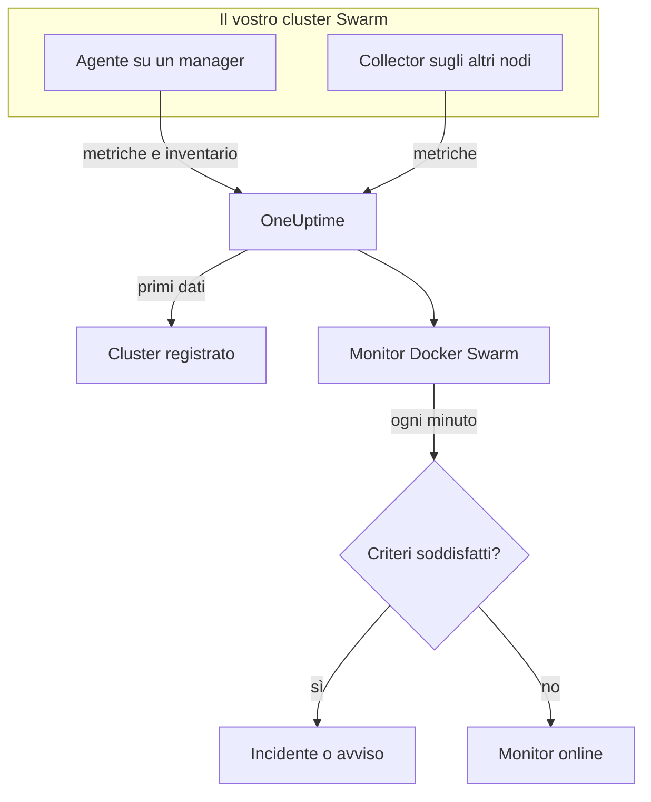

# Monitor Docker Swarm

Un monitor Docker Swarm sorveglia i container dietro i task di servizio di un cluster Swarm e vi avvisa quando un task si riavvia, si surriscalda o esaurisce la memoria. Legge le metriche dei container inviate dall'agente Docker Swarm di OneUptime, quindi niente viene sondato dall'esterno: installate l'agente, poi create il monitor da un modello o dalla vostra query.

:::cards
- [Creare il monitor](#creare-un-monitor-docker-swarm): Sei passaggi nella dashboard.
- [Modelli](#modelli-di-avviso-pronti): Quattro avvisi pronti, un incidente per task.
- [Metriche](#metriche-raccolte): Le metriche dei container su cui potete avvisare.
- [Filtri](#impostazioni-del-monitor): Restringere un monitor a un servizio, un task o un'immagine.
:::

## Come funziona

L'agente Docker Swarm di OneUptime viene eseguito su un nodo manager. Il suo collector legge le statistiche dei container dal demone Docker di quel nodo ogni 30 secondi e contrassegna ogni lotto con il nome del cluster, `docker.swarm.cluster.name`. Un piccolo lettore dell'inventario al suo fianco legge i nodi, i servizi e i task del cluster dall'API di Swarm ogni 5 minuti. I primi dati registrano il cluster in OneUptime.

Il collector vede solo i container del nodo su cui gira. Per avere metriche da ogni nodo, eseguite il collector su ogni nodo con lo stesso `DOCKER_SWARM_CLUSTER_NAME`.

Un monitor Docker Swarm è legato a un cluster. Ogni minuto esegue la sua query sulle metriche dei container di quel cluster e confronta il risultato con i suoi criteri.

## Prima di iniziare

- **Installate l'agente Docker Swarm** su un nodo manager. La [guida all'agente Docker Swarm](/docs/telemetry/docker-swarm) spiega come installarlo e aggiornarlo, e come eseguire il collector sugli altri nodi.
- **Verificate che il cluster sia registrato.** Compare in **Prodotti → Infrastruttura → Docker Swarm → Tutti i cluster**, con il nome del `DOCKER_SWARM_CLUSTER_NAME` dell'agente, appena arrivano i suoi primi dati.

## Creare un monitor Docker Swarm

:::steps
### Iniziare un nuovo monitor

Andate in **Monitor** e fate clic su **Crea monitor**.

### Scegliere Docker Swarm

In **Tipo di monitor**, fate clic su **Altri tipi di monitor** e scegliete **Docker Swarm** in **Infrastruttura**, oppure digitate `swarm` nella casella di ricerca. Inserite un **Nome** – viene usato nei titoli di incidenti e avvisi – e fate clic su **Avanti**.

### Scegliere il cluster

In **Docker Swarm Monitor Configuration**, scegliete il cluster da **Docker Swarm Cluster**. Ogni cluster che ha inviato dati è nell'elenco.

### Scegliere cosa sorvegliare

Scegliete una delle tre schede:

- **Quick Setup** – fate clic su un [modello](#modelli-di-avviso-pronti). Imposta la metrica, l'aggregazione, l'intervallo di tempo e le soglie, e sostituisce i criteri più sotto con i propri. Potete comunque cambiare l'**Intervallo di tempo**.
- **Custom Metric** – scegliete una metrica da **Docker Swarm Metric**, poi impostate **Aggregazione** e **Intervallo di tempo**. I [filtri](#impostazioni-del-monitor) la restringono ad alcuni task.
- **Avanzato** – costruite voi query e formule in **Seleziona metriche**. Usate **Group by** `resource.container.name` per giudicare ogni task separatamente.

### Rivedere i criteri

Aprite ogni criterio in **Criteri del monitor** e verificatene **Metrica**, **Aggregazione**, **Condizione** e **Threshold**. Un modello li compila. Con **Custom Metric** o **Avanzato**, il monitor parte con i [criteri predefiniti](#criteri-predefiniti), che notano solo una metrica che scende a zero, quindi impostate la vostra soglia.

### Creare il monitor

Fate clic su **Crea monitor**. OneUptime apre la pagina del monitor e lo valuta ogni minuto. Gli incidenti e gli avvisi che genera compaiono anche nelle pagine **Incidenti** e **Avvisi** del cluster.
:::

> [!TIP]
> Per configurare più modelli alla volta, aprite il cluster da **Prodotti → Infrastruttura → Docker Swarm** e andate in **Recommendations**. Scegliete i modelli che volete, scegliete chi viene avvisato, e OneUptime crea un monitor per modello.

## Impostazioni del monitor

| Campo | Scheda | Cosa fa |
| --- | --- | --- |
| **Docker Swarm Cluster** | Tutte | Obbligatorio. Limita ogni query a `resource.docker.swarm.cluster.name`. È l'unico attributo di risorsa apposto dall'agente, quindi il monitor non aggiunge filtri su `container.runtime` o `host.name`. |
| **Nome del servizio** | Custom Metric, Avanzato | Facoltativo. Corrispondenza esatta su `docker.swarm.service.name`, per esempio `web`. |
| **Nome del nodo** | Custom Metric, Avanzato | Facoltativo. Corrispondenza esatta su `docker.swarm.node.name`, per esempio `swarm-node-1`. |
| **Nome del container** | Custom Metric, Avanzato | Facoltativo. Corrispondenza esatta su `resource.container.name`. Il container di un task si chiama `<service>.<slot>.<taskid>`, per esempio `web.1.abc123`. |
| **Immagine del container** | Custom Metric, Avanzato | Facoltativo. Corrispondenza esatta su `resource.container.image.name`, per esempio `nginx:latest`. |
| **Docker Swarm Metric** | Custom Metric | Una metrica del [catalogo](#metriche-raccolte). |
| **Aggregazione** | Custom Metric | Come vengono combinati i campioni: **Media**, **Massimo**, **Minimo**, **Somma** o **Conteggio**. Parte dall'aggregazione abituale della metrica. |
| **Intervallo di tempo** | Tutte | La finestra mobile che la query legge, da **Past 1 Minute** a **Past 365 Days**. Un nuovo monitor parte da **Past 1 Minute**; i modelli impostano la propria. |
| **Seleziona metriche** | Avanzato | Il costruttore di query: **Metrica**, **Aggregate by**, **Filter by attributes**, **Group by**, più **Aggiungi metrica** e **Aggiungi formula** per combinare le query. |

> [!WARNING]
> L'agente distribuito non imposta ancora `docker.swarm.service.name` né `docker.swarm.node.name`, quindi un monitor con **Nome del servizio** o **Nome del nodo** compilato non trova dati. Restringete invece per **Immagine del container**, oppure raggruppate per `resource.container.name`.

## Modelli di avviso pronti

**Quick Setup** offre quattro modelli. Ognuno costruisce un monitor completo: una query raggruppata per `resource.container.name`, un criterio che scatta e uno che ripristina. Ogni task viene giudicato separatamente e riceve il proprio incidente e il proprio avviso, la cui causa principale elenca i task interessati e i loro valori. Le soglie sono punti di partenza modificabili.

Salvo diversa indicazione nella tabella, un criterio scatta solo quando la condizione vale per ogni minuto della sua finestra, e si ripristina il 10% oltre la soglia, così un valore che oscila sul limite non cambia stato di continuo.

| Modello | Gravità | Sorveglia | Scatta quando | Si ripristina quando |
| --- | --- | --- | --- | --- |
| Task Down (Low Uptime) | Critico | `container.uptime`, Min per task, ultimo 1 minuto | Un valore qualsiasi è sotto i 60 secondi | Ogni valore è a 66 secondi o più |
| High Task CPU Usage | Warning | `container.cpu.utilization`, Avg per task, ultimi 5 minuti | Sopra 80 (% di un core) | A 72 o meno |
| High Task Memory Usage | Warning | `container.memory.percent`, Avg per task, ultimi 5 minuti | Sopra l'85% | Al 76,5% o meno |
| High Task Process Count | Warning | `container.pids.count`, Max per task, ultimi 5 minuti | Sopra 500 | A 450 o meno |

**Gravità** è l'etichetta che mostra il selettore. L'incidente e l'avviso creati da un modello partono dalla gravità di incidente e di avviso più alta del vostro progetto; cambiatele nei criteri.

> [!NOTE]
> **Task Down (Low Uptime)** scatta su un singolo campione recente perché un riavvio è un evento, non un livello. Swarm assegna a un task sostitutivo un nuovo container, e quindi una nuova serie, ed è per questo che il modello cerca un uptime inferiore a un minuto invece di uno 0. Anche un deploy o uno scale-up lo fanno scattare, e si risolve quando i nuovi task superano un minuto di uptime. Un task che muore e non viene sostituito non invia nulla, quindi non viene rilevato.

## Metriche raccolte

Il collector dell'agente usa il receiver OpenTelemetry `docker_stats`, quindi le metriche sono le metriche standard dei container, una serie per container di task. Non esistono metriche `docker_swarm_*`: nodi, servizi e task vengono tracciati come inventario, nelle pagine **Servizi**, **Attività**, **Nodi** e correlate del cluster.

### CPU

| Metrica | Unità | Descrizione |
| --- | --- | --- |
| `container.cpu.utilization` | % | Utilizzo della CPU del container di un task, dove il 100% è un core di CPU intero. |

### Memoria

| Metrica | Unità | Descrizione |
| --- | --- | --- |
| `container.memory.usage.total` | bytes | Memoria usata dal container di un task. |
| `container.memory.percent` | % | Memoria usata come percentuale del limite del container, o della memoria totale del nodo quando il servizio non imposta un limite. |

### Rete

| Metrica | Unità | Descrizione |
| --- | --- | --- |
| `container.network.io.usage.rx_bytes` | bytes | Byte ricevuti dal container di un task. Un contatore sull'intera vita. |
| `container.network.io.usage.tx_bytes` | bytes | Byte inviati dal container di un task. Un contatore sull'intera vita. |

### Container

| Metrica | Unità | Descrizione |
| --- | --- | --- |
| `container.pids.count` | count | Processi all'interno del container di un task. Un aumento improvviso può indicare una fork bomb o un leak. |
| `container.uptime` | seconds | Da quanto tempo è in esecuzione il container di un task. Un task ripianificato o riavviato avvia un nuovo container da 0. |

Ogni serie porta l'identità del container come attributi di risorsa: `resource.container.name` (`<service>.<slot>.<taskid>`), `resource.container.image.name` e `resource.docker.swarm.cluster.name`.

## Criteri di monitoraggio

Un criterio confronta una delle query o formule del monitor con una soglia. I criteri di un monitor Docker Swarm non hanno un **Tipo di filtro**: ogni regola controlla il valore della metrica, con questi campi.

| Campo | Cosa fa |
| --- | --- |
| **Metrica** | La query o la formula da controllare, tramite il suo nome di variabile. |
| **Aggregazione** | Come i valori della finestra diventano un'unica risposta: **Media**, **Somma**, **Maximum Value**, **Minimum Value**, **All Values** (ogni valore deve corrispondere) o **Any Value** (ne basta uno). |
| **Condizione** | **Greater Than**, **Less Than**, **Greater Than Or Equal To**, **Less Than Or Equal To** o **Equal To**, oppure una condizione di anomalia: **Anomalously High**, **Anomalously Low** o **Anomalous**. |
| **Threshold** | Il valore con cui confrontare. Accanto c'è un elenco di unità quando la metrica ha un'unità. Non viene mostrato per le condizioni di anomalia. |
| **Sensibilità** | Solo condizioni di anomalia. **Bassa** (4σ), **Media** (3σ, il predefinito) o **Alta** (2σ). |
| **Finestra di riferimento** | Solo condizioni di anomalia. 14 giorni (il predefinito), 28, 60 o 90 giorni di storico. |
| **Se nessun dato** | In **Altri campi**. Cosa succede quando la finestra non ha campioni: **Ignore** (predefinito), **Treat As Zero** o **Trigger**. |

Le condizioni di anomalia confrontano ogni valore con la stessa ora della settimana nella baseline. Restano in uno stato «Learning», e non generano nulla, finché la finestra di riferimento non contiene abbastanza storico.

Ogni criterio indica anche cosa fare quando corrisponde: cambiare lo stato del monitor, creare un avviso o dichiarare un incidente. I criteri vengono controllati dall'alto verso il basso, e decide il primo che corrisponde.

### Criteri predefiniti

Un monitor che non create da un modello parte con due criteri:

| Ordine | Criterio | Corrisponde quando | Poi |
| --- | --- | --- | --- |
| 1 | Check if _monitor name_ is offline | Un valore qualsiasi della prima query è `0` | Segna il monitor come **Offline** e dichiara l'incidente «_monitor name_ is offline», che si risolve da solo quando il monitor si riprende. |
| 2 | Check if _monitor name_ is online | Un valore qualsiasi è sopra `0` | Segna il monitor come **Operativo**. |

> [!IMPORTANT]
> Il silenzio non corrisponde a nessuno dei due criteri: un cluster che smette di inviare dati lascia il monitor com'era. Per essere avvisati quando i dati si fermano, impostate **Se nessun dato** su **Trigger** in un criterio. Il tempo in cui OneUptime stesso non stava ricevendo non è mai assenza di dati: un controllo la cui finestra lo contiene attende invece, come spiega [Quando OneUptime non riceve dati](/docs/monitor/when-oneuptime-is-not-receiving).

## Risoluzione dei problemi

:::details Il cluster non è nell'elenco Docker Swarm Cluster
I cluster si registrano da soli a partire dai dati dell'agente. Verificate che l'agente sia in esecuzione su un nodo manager, che `DOCKER_SWARM_CLUSTER_NAME` sia impostato e che il cluster compaia in **Prodotti → Infrastruttura → Docker Swarm → Tutti i cluster**. La [guida all'agente Docker Swarm](/docs/telemetry/docker-swarm) contiene i controlli da eseguire sul nodo.
:::

:::details Solo alcuni task hanno metriche
Il collector legge il demone Docker del nodo su cui gira, quindi vede solo i task di quel nodo. Eseguite il collector su ogni nodo con lo stesso `DOCKER_SWARM_CLUSTER_NAME`.
:::

:::details Un monitor filtrato per servizio o per nodo non trova dati
**Nome del servizio** e **Nome del nodo** corrispondono a `docker.swarm.service.name` e `docker.swarm.node.name`, che l'agente distribuito non imposta. Svuotateli e restringete per **Immagine del container**, oppure raggruppate per `resource.container.name`.
:::

:::details Tutti i task appaiono come un'unica serie
Raggruppate per l'attributo di risorsa, `resource.container.name`, come fanno i modelli. Il semplice `container.name` non corrisponde a nulla, quindi tutti i task confluiscono in un'unica serie con il nome vuoto.
:::

## Passaggi successivi

:::cards
- [Agent Docker Swarm](/docs/telemetry/docker-swarm): Installare e aggiornare l'agente che questo monitor legge.
- [Monitor Docker](/docs/monitor/docker-monitor): Sorvegliare i container di un singolo host Docker.
- [Panoramica degli incidenti](/docs/incidents/index): Cosa succede dopo che un criterio ha dichiarato un incidente.
- [Pianificazioni di reperibilità](/docs/on-call/schedules): Decidere chi viene avvisato quando un task si guasta.
:::
