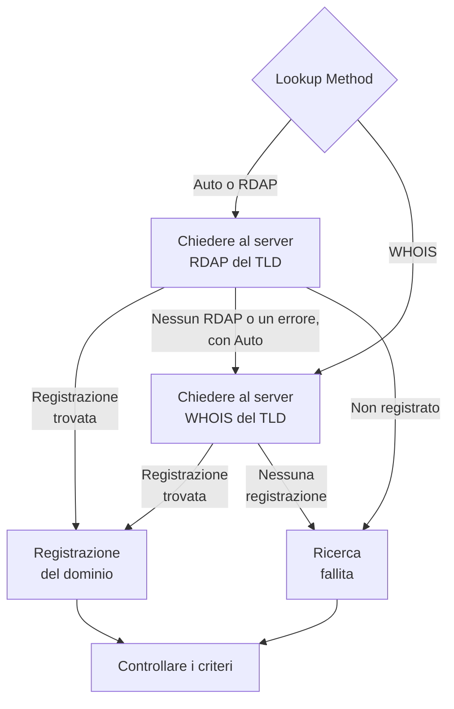

# Monitor dominio

Un monitor del dominio legge a intervalli regolari la registrazione del vostro dominio, per seguirne la data di scadenza, il registrar, i nameserver e i codici di stato, e vi avvisa prima che scada. Usatelo per ogni dominio da cui dipendono i vostri siti web, le vostre API e la vostra email: una registrazione scaduta li mette fuori uso tutti insieme.

:::cards
- [Creare il monitor](#creare-un-monitor-del-dominio): Sei passaggi nella dashboard.
- [Metodi di ricerca](#metodi-di-ricerca): RDAP, WHOIS, e perché **Auto** è il predefinito.
- [Criteri predefiniti](#criteri-predefiniti): Un avviso di scadenza con 30 giorni di anticipo, senza configurare nulla.
- [Risoluzione dei problemi](#risoluzione-dei-problemi): Server WHOIS dismessi, proxy e date mancanti.
:::

## Come funziona

A ogni controllo, una sonda cerca la registrazione del dominio tramite RDAP o WHOIS, a seconda del **Lookup Method**, e normalizza ciò che trova: la data di scadenza, il registrar, i nameserver e i codici di stato. Una ricerca che fallisce viene ritentata, fino al numero di tentativi che impostate. Poi OneUptime valuta la registrazione con i criteri del monitor.

Se una ricerca non riesce a produrre dati di registrazione — perché il servizio del TLD è dismesso, o il dominio non è registrato —, il monitor viene segnalato **offline** con il motivo mostrato nella risposta della sonda del monitor, invece di essere segnalato come sano con una data di scadenza vuota. Un registro che risponde «questo dominio è disponibile» (per esempio lo `Status: free` di DENIC) viene trattato come **non registrato**, non come una registrazione sana.

I nomi di dominio internazionalizzati sono accettati in entrambe le forme: `münchen.de` viene convertito nella sua A-label (`xn--mnchen-3ya.de`) prima della ricerca.

## Prima di iniziare

- **Un ruolo che può creare monitor**: Project Owner, Project Admin, Project Member, Monitor Admin o Monitor Member, oppure un ruolo personalizzato con il permesso Create Monitor.
- **Accesso in uscita dalla sonda** verso i registri. Le sonde predefinite del vostro progetto vengono scelte per ogni nuovo monitor; una [sonda personalizzata](/docs/probe/custom-probe) deve raggiungere:

| Destinazione | Protocollo | Usato per |
| --- | --- | --- |
| `https://data.iana.org/rdap/dns.json` | HTTPS, porta 443 | Il registro di bootstrap RDAP di IANA, che dice dove si trova il server RDAP di ogni TLD. Scaricato una volta e tenuto in cache per 24 ore. |
| I server RDAP dei registri | HTTPS, porta 443 | Le ricerche RDAP. |
| I server WHOIS | TCP, porta 43 | Le ricerche WHOIS. |

Le richieste RDAP rispettano le impostazioni `HTTP_PROXY_URL` / `HTTPS_PROXY_URL` / `NO_PROXY` della sonda. WHOIS passa da un socket grezzo e non le rispetta. Se una sonda non riesce a raggiungere `data.iana.org`, **Auto** ripiega su WHOIS e riprova IANA dopo cinque minuti.

## Creare un monitor del dominio

:::steps
### Iniziare un nuovo monitor

Andate in **Monitor** e fate clic su **Crea monitor**. In **Tipo di monitor**, fate clic su **Altri tipi di monitor** e scegliete **Dominio** sotto **Basic Monitoring**.

### Dargli un nome

Inserite un **Nome**, come `example.com registration`, poi fate clic su **Avanti**.

### Inserire il dominio

Inserite il **Nome di dominio**, come `example.com`. Lasciate **Lookup Method** su **Auto** a meno che non abbiate un motivo per fare altrimenti (vedete [Metodi di ricerca](#metodi-di-ricerca)).

### Testarlo

Fate clic su **Testa il monitor**, scegliete una sonda in **Seleziona sonda** e fate clic su **Esegui test**. **Risultato del test del monitor** mostra la registrazione che la sonda ha letto, e se ha risposto RDAP o WHOIS.

### Rivedere i criteri

**Criteri del monitor** parte dai [criteri predefiniti](#criteri-predefiniti): offline quando la registrazione è scaduta o non si può leggere, un avviso quando scade entro 30 giorni. Modificateli se serve, poi fate clic su **Avanti**.

### Scegliere le sonde e creare

Mantenete o cambiate le **Sonde** e l'**Intervallo di monitoraggio** (parte da **Ogni 5 minuti**), poi fate clic su **Crea monitor**. Si apre la pagina del monitor.
:::

## Opzioni di configurazione

| Campo | Predefinito | Cosa inserire |
| --- | --- | --- |
| **Nome di dominio** | Nessuno | Il dominio registrato, come `example.com`. Funziona anche un indirizzo incollato: `https://example.com/pricing` viene letto come `example.com`. |
| **Lookup Method** | **Auto** | **Auto**, **RDAP** o **WHOIS**. Vedete [Metodi di ricerca](#metodi-di-ricerca). |
| **Timeout (ms)** (sotto **Altri campi**) | `10000` | Quanto attendere ogni ricerca della registrazione, in millisecondi. |
| **Tentativi** (sotto **Altri campi**) | `3` | Nuovi tentativi dopo che il primo fallisce. `0` significa un solo tentativo. |

Ogni ricerca fallita viene ritentata, con una pausa di un secondo tra un tentativo e l'altro. Questo include un registro che risponde che il dominio non è registrato, o che non ha un servizio di registrazione, nel caso la risposta fosse un guasto passeggero. Solo un nome di dominio malformato viene segnalato subito, senza ricerca.

Il timeout si applica a ogni richiesta, non all'intero controllo: un controllo **Auto** che prova RDAP e poi ripiega su WHOIS può durare il doppio, o di più.

### Metodi di ricerca

I dati di registrazione si possono leggere con due protocolli, e quale funziona dipende dal TLD.

| Metodo | Comportamento |
| --- | --- |
| **Auto** | Predefinito. Usa RDAP quando il TLD pubblica un servizio RDAP, e ripiega su WHOIS quando non lo fa, o quando la ricerca RDAP fallisce. |
| **RDAP** | Solo RDAP. Fallisce con un errore chiaro se il TLD non pubblica alcun servizio RDAP. |
| **WHOIS** | Solo WHOIS. |

**RDAP** ([RFC 9083](https://www.rfc-editor.org/rfc/rfc9083)) è il sostituto di WHOIS imposto dall'ICANN. Il server autorevole di ogni TLD viene scoperto dal [registro di bootstrap di IANA](https://www.rfc-editor.org/rfc/rfc9224), quindi resta corretto quando i registri si spostano. Ogni gTLD ne pubblica uno. Quando il server RDAP del TLD dice che il dominio non è registrato, **Auto** lo prende come risposta e non chiede a WHOIS.

**WHOIS** non ha un meccanismo di scoperta equivalente — i client includono una mappa fissa tra TLD e host WHOIS, e queste mappe invecchiano. Ogni TLD di Identity Digital (`.digital`, `.email`, `.life`, `.today`, `.zone` e circa altri 290) è ancora associato a un host dismesso che ora risponde a ogni richiesta con il testo letterale `TLD is not supported.` invece di una registrazione. WHOIS resta l'unica opzione per i molti ccTLD che non pubblicano alcun servizio RDAP, come `.io`, `.co`, `.de`, `.ch` e `.jp`.

## Criteri di monitoraggio

I criteri decidono quando il dominio conta come buono o guasto, e se questo dichiara un incidente o crea un avviso. Ogni criterio controlla uno o più filtri:

| Filtro | Condizioni | Cosa controlla |
| --- | --- | --- |
| **Is Online** | **Vero**, **Falso** | Se la ricerca della registrazione in sé è riuscita. |
| **Is Request Timeout** | **Vero**, **Falso** | Se la ricerca è andata in timeout, a ogni tentativo. |
| **Domain Expires In Days** | **Greater Than**, **Less Than**, **Greater Than Or Equal To**, **Less Than Or Equal To** | I giorni che mancano alla scadenza della registrazione, arrotondati per eccesso a un giorno intero. |
| **Domain Is Expired** | **Vero**, **Falso** | Se la data di scadenza è passata. |
| **Domain Registrar** | **Contiene**, **Not Contains**, **Starts With**, **Ends With**, **Equal To**, **Not Equal To** | Il nome del registrar. |
| **Domain Name Server** | **Contiene**, **Not Contains**, **Starts With**, **Ends With**, **Equal To**, **Not Equal To** | I nameserver del dominio. Corrisponde quando corrisponde uno qualsiasi di essi. |
| **Domain Status Code** | **Contiene**, **Not Contains**, **Starts With**, **Ends With**, **Equal To**, **Not Equal To** | I codici di stato EPP del dominio. Corrisponde quando corrisponde uno qualsiasi di essi. |

I codici di stato vengono normalizzati nei loro nomi EPP (`clientTransferProhibited`) qualunque protocollo abbia risposto, quindi un criterio continua a corrispondere quando **Auto** passa tra RDAP e WHOIS. I _nomi_ dei registrar sono quelli pubblicati dal servizio che risponde e possono differire leggermente tra i due protocolli, quindi per un criterio **Domain Registrar** preferite **Contiene** a **Equal To**.

Le date vengono normalizzate in ISO 8601. Una data che un registro pubblica in una forma non interpretabile viene omessa invece di essere salvata, quindi un criterio di scadenza non può decidere, e non corrisponde, invece di rispondere in silenzio «non scaduto» per sempre.

Con due o più filtri, **Condizione di corrispondenza** decide se devono corrispondere **Tutti** o se basta **Qualsiasi** filtro. Le **Azioni** di un criterio decidono cosa fa: cambiare lo stato del monitor, creare un avviso, dichiarare un incidente, o più di queste cose.

### Criteri predefiniti

Un nuovo monitor del dominio parte con tre criteri, così vi avvisa prima che una registrazione scada senza configurare nulla:

1. **Controllo del dominio fallito** — la registrazione è scaduta, oppure non è stato possibile leggerne i dati. Il monitor viene segnato **Offline** e viene creato un incidente chiamato «_monitor name_ domain check failed». L'incidente si risolve da solo appena la registrazione viene letta di nuovo ed è valida.
2. **Il dominio scade presto** — la registrazione non è scaduta ma scade entro 30 giorni. Viene creato un **avviso** chiamato «_monitor name_ domain expires soon».
3. **Il dominio non è scaduto** — il monitor viene segnato **Operativo**.

L'avviso «scade presto» è un avviso, non un incidente: non compare sulle vostre pagine di stato, non chiama nessuno a meno che non gli aggiungiate una policy di reperibilità, e non cambia lo stato del monitor. Usa la seconda gravità di avviso del vostro progetto, **Low** in un nuovo progetto. Appena il rinnovo compare nella registrazione, l'avviso si risolve da solo. Un registro che non pubblica una data di scadenza non dà nulla su cui basarsi all'avviso, che quindi resta silenzioso.

I criteri vengono controllati dall'alto verso il basso, e il primo che corrisponde decide cosa succede. Per questo «scade presto» sta sopra «non è scaduto»: un dominio in scadenza non è ancora scaduto, quindi corrisponderebbe a entrambi.

Per essere avvisati prima, cambiate il valore del filtro **Domain Expires In Days** nel criterio «scade presto», per esempio in `60`. Per far chiamare qualcuno invece, aprite le **Azioni** di quel criterio: attivate **Quando i filtri corrispondono, dichiara un incidente.**, oppure tenete l'avviso e aggiungetegli una policy di reperibilità in **Policy di reperibilità**.

:::details Aggiungere l'avviso a un monitor creato prima che esistesse
I monitor creati prima che OneUptime aggiungesse questo avviso non hanno un criterio «scade presto». Per aggiungerlo:

1. Sul monitor, aprite **Configurazione → Criteri** e fate clic su **Modifica: Criteri di monitoraggio**.
2. Fate clic su **Aggiungi criteri**. Impostate il suo filtro su **Domain Is Expired** / **Falso**, fate clic su **Aggiungi filtro** e impostate il secondo su **Domain Expires In Days** / **Less Than Or Equal To** / `30`. Lasciate **Condizione di corrispondenza** su **Tutti** (compare sotto i filtri quando ce ne sono due).
3. In **Azioni**, attivate **Quando i filtri corrispondono, crea un avviso.** e lasciate disattivato **Quando i filtri corrispondono, modifica lo stato del monitor.**, così crea un avviso e non cambia lo stato del monitor.
4. Trascinate il nuovo criterio sopra il criterio che segna il monitor come online, poi salvate.
:::

### Esempi di criteri

| Obiettivo | Filtro | Condizione | Valore |
| --- | --- | --- | --- |
| Avvisare quando il dominio scade entro 30 giorni (uno predefinito) | **Domain Expires In Days** | **Less Than Or Equal To** | `30` |
| Offline quando il dominio è scaduto | **Domain Is Expired** | **Vero** | — |
| Offline quando la registrazione non si può leggere | **Is Online** | **Falso** | — |
| Avvisare quando cambiano i nameserver | **Domain Name Server** | **Not Contains** | `ns1.example.com` |
| Avvisare quando il dominio viene sbloccato per un trasferimento | **Domain Status Code** | **Not Contains** | `clientTransferProhibited` |

**Domain Name Server** e **Domain Status Code** corrispondono quando corrisponde _un_ valore qualsiasi, quindi **Not Contains** corrisponde appena un nameserver, o un codice di stato, non contiene il testo.

## Buone pratiche

1. **Datevi il tempo di rinnovare** — L'avviso predefinito arriva 30 giorni prima della scadenza. Se il rinnovo richiede approvazioni o un pagamento che richiede più tempo, portatelo a 60 giorni.
2. **Coprite le ricerche fallite** — Includete un filtro **Is Online** / **Falso** nel vostro criterio offline così una registrazione illeggibile non viene scambiata per una sana. I nuovi monitor lo hanno nei loro criteri predefiniti; un monitor creato prima che fosse aggiunto ne ha bisogno a mano. Per reggere un server WHOIS che ogni tanto limita la sonda, spuntate **Valuta questo criterio su un periodo di tempo** sotto quel filtro e scegliete **All Values**: il dominio va offline solo quando è fallita ogni ricerca della finestra.
3. **Monitorate tutti i domini critici** — Includete i domini principali, i sottodomini registrati separatamente e ogni dominio usato per email o API.
4. **Seguite i cambi di registrar** — Aggiungete un criterio con **Domain Registrar** / **Not Contains** / il nome del vostro registrar, per accorgervi di un trasferimento non autorizzato.

## Risoluzione dei problemi

:::details Il server WHOIS «answered without any registration data»
L'host WHOIS del TLD è dismesso, limita la sonda o è momentaneamente guasto. Un host dismesso, come quello ancora associato ai TLD di Identity Digital, risponde `TLD is not supported.` ogni volta. Se l'errore persiste con **Lookup Method** su **WHOIS**, passate ad **Auto**, così la sonda legge il servizio RDAP del TLD quando ce n'è uno.
:::

:::details Il controllo fallisce con «No RDAP service is published»
Il monitor usa **RDAP**, e il TLD non pubblica alcun servizio RDAP, come molti ccTLD. Passate **Lookup Method** su **Auto**, che ripiega su WHOIS.
:::

:::details Il dominio risulta non registrato
Il registro ha risposto che il dominio è disponibile. Controllate l'ortografia, e di aver inserito il dominio registrato, come `example.com`, non un sottodominio.
:::

:::details Le ricerche falliscono su una sonda dietro un proxy
RDAP passa dalle impostazioni proxy della sonda, WHOIS no. Consentite la porta TCP 43 in uscita per WHOIS, oppure usate **Auto** o **RDAP** per i TLD che pubblicano un servizio RDAP.
:::

:::details La data di scadenza è vuota, e i criteri di scadenza non scattano mai
Il registro non pubblica una data di scadenza, o ne pubblica una in una forma non interpretabile. I criteri di scadenza non possono decidere senza una data, quindi restano silenziosi. **Is Online** vi dice comunque se la registrazione si può leggere.
:::

## Passaggi successivi

:::cards
- [Monitor certificato SSL](/docs/monitor/ssl-certificate-monitor): Essere avvisati prima che scadano i certificati sul dominio.
- [Monitor DNS](/docs/monitor/dns-monitor): Controllare che i record del dominio si risolvano, e cosa dicono.
- [Monitor DNSSEC](/docs/monitor/dnssec-monitor): Convalidare la catena di fiducia di una zona firmata.
- [Regole di escalation](/docs/on-call/escalation-rules): Decidere chi viene chiamato dagli avvisi e dagli incidenti.
:::
