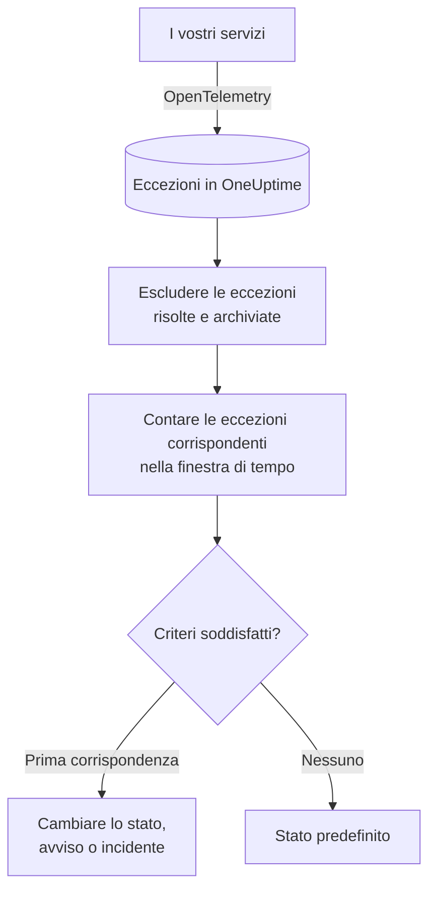

# Monitor eccezioni

Un monitor eccezioni conta, in una finestra di tempo, le eccezioni che i vostri servizi segnalano a OneUptime e che corrispondono ai vostri filtri (messaggio, tipo di eccezione, ambiente, servizio). Quando il conteggio soddisfa i vostri criteri, cambia lo stato del monitor, crea un avviso o dichiara un incidente. Usatelo per essere avvisati di ogni nuovo crash in produzione, di un tipo di eccezione preciso o di un improvviso aumento degli errori.

:::cards
- [Creare il monitor](#creare-un-monitor-eccezioni): Scegliere quali eccezioni contare e quando avvisare.
- [Ambienti](#ambienti): Limitare il monitor a `production`.
- [Come viene valutato](#come-viene-valutato): Cosa viene contato e cosa comporta risolvere un'eccezione.
- [Criteri](#criteri): Le condizioni e i valori predefiniti.
:::

## Come funziona



Ogni minuto, OneUptime conta le eccezioni che corrispondono ai filtri del monitor e si sono verificate nella sua finestra di tempo, escludendo quelle che avete contrassegnato come risolte o archiviato. Confronta quel conteggio con i criteri del monitor dall'alto verso il basso, e il primo criterio che corrisponde decide cosa succede. Se nessuno corrisponde, il monitor torna al suo stato predefinito.

## Prima di iniziare

- I vostri servizi inviano eccezioni a OneUptime tramite OpenTelemetry. Vedete [OpenTelemetry](/docs/telemetry/open-telemetry).
- Per limitare un monitor a un ambiente, i vostri servizi devono impostare l'attributo di risorsa `deployment.environment`.

## Creare un monitor eccezioni

:::steps
### Iniziare un nuovo monitor

Andate in **Monitor** e fate clic su **Crea monitor**.

### Scegliere Exceptions

In **Tipo di monitor**, fate clic su **Altri tipi di monitor** e scegliete **Eccezioni** sotto **Telemetria**, oppure digitate `exceptions` nella casella di ricerca. Inserite un **Nome**, poi fate clic su **Avanti**.

### Scegliere le eccezioni da contare

In **Configurazione monitor eccezioni**, impostate **Filtra messaggio di eccezione**, **Tipi di eccezione**, **Environments** e **Eccezioni del monitor per (time)**. Un filtro lasciato vuoto corrisponde a tutte le eccezioni. **Anteprima eccezioni**, sotto i filtri, mostra le eccezioni a cui corrispondono in questo momento.

### Restringere il campo (facoltativo)

Aprite **Altri campi** per filtrare per servizio di telemetria o entità dell'infrastruttura, oppure per contare anche le eccezioni risolte e archiviate.

### Impostare i criteri

La scheda **Criteri del monitor** parte con due criteri: offline, con un incidente, quando un'eccezione corrisponde; online quando non ne corrisponde nessuna. Modificateli in base a ciò su cui volete essere avvisati (vedete [Criteri](#criteri)).

### Creare il monitor

Fate clic su **Crea monitor**. Il monitor si apre sulla sua pagina **Panoramica**, e la sua prima valutazione avviene entro un minuto.
:::

## Cosa interroga

| Campo | A cosa corrisponde | Predefinito |
| --- | --- | --- |
| **Filtra messaggio di eccezione** | Eccezioni il cui messaggio contiene questo testo, senza distinzione tra maiuscole e minuscole. | Vuoto: tutte le eccezioni |
| **Tipi di eccezione** | Eccezioni di uno qualsiasi di questi tipi, separati da virgole, come `TypeError, NullReferenceException`. Il nome del tipo deve corrispondere esattamente. | Vuoto: tutti i tipi |
| **Environments** | Eccezioni di uno qualsiasi di questi ambienti, separati da virgole (vedete [Ambienti](#ambienti)). | Vuoto: tutti gli ambienti |
| **Eccezioni del monitor per (time)** | Eccezioni degli ultimi 5 secondi fino alle ultime 24 ore. | **Ultimo minuto** |
| **Filtra per servizio di telemetria** (in **Altri campi**) | Eccezioni di uno qualsiasi dei servizi scelti. | Vuoto: tutti i servizi |
| **Filter by Infrastructure Entity** (in **Altri campi**) | Eccezioni di uno qualsiasi degli host, pod, container e altre entità scelti. | Vuoto: tutte le entità |
| **Includi eccezioni risolte** (in **Altri campi**) | Contare anche le eccezioni contrassegnate come risolte. | Disattivato |
| **Includi eccezioni archiviate** (in **Altri campi**) | Contare anche le eccezioni archiviate. | Disattivato |

Tutti i filtri che impostate devono corrispondere perché un'eccezione venga contata.

### Ambienti

Gli ambienti derivano dall'attributo di risorsa OpenTelemetry `deployment.environment` di ogni eccezione, lo stesso valore che l'esploratore delle eccezioni filtra con `env:production`. Inserite un ambiente, o più ambienti separati da virgole; un'eccezione viene contata quando il suo ambiente corrisponde a uno di essi.

La corrispondenza è esatta e distingue tra maiuscole e minuscole: `production` non corrisponde a `Production` né a `prod`. Le eccezioni senza ambiente non vengono contate quando questo filtro è impostato. Lasciatelo vuoto per contare le eccezioni di tutti gli ambienti, comprese quelle senza ambiente.

Il filtro dell'ambiente si combina con tutti gli altri filtri, quindi un monitor limitato a un servizio di telemetria e a `production` conta solo le eccezioni di produzione di quel servizio.

Quando create il monitor tramite l'API, impostate `environments` nell'`exceptionMonitor` del passaggio come elenco di nomi di ambiente:

```json
{
  "exceptionMonitor": {
    "telemetryServiceIds": [],
    "environments": ["production"],
    "exceptionTypes": [],
    "message": "",
    "includeResolved": false,
    "includeArchived": false,
    "lastXSecondsOfExceptions": 300
  }
}
```

## Come viene valutato

- **Ogni minuto.** Un monitor eccezioni non viene controllato da sonde, quindi non ha un intervallo da impostare né una pagina **Sonde e intervallo**.
- **Occorrenze, non tipi di eccezione.** Il monitor conta ogni volta che un'eccezione corrispondente si è verificata entro **Eccezioni del monitor per (time)**. Un'eccezione lanciata 40 volte conta 40.
- **Le eccezioni risolte e archiviate vengono escluse.** A meno che non attiviate **Includi eccezioni risolte** o **Includi eccezioni archiviate**, le occorrenze di un'eccezione che avete contrassegnato come risolta o archiviato non contano. Contrassegnare un'eccezione come risolta può quindi chiudere l'incidente che ha aperto. Quando un'eccezione risolta si ripresenta, torna automaticamente non risolta e viene contata di nuovo.
- **Nessuna eccezione significa un conteggio di 0.**
- **L'interruzione di OneUptime stesso non è silenzio.** Finché la finestra di tempo contiene un periodo in cui OneUptime stesso non riceveva dati (si stava riavviando, veniva aggiornato o recuperava un arretrato), il controllo attende: lo stato non cambia e nessun incidente o avviso viene aperto o risolto. Vedete [Quando OneUptime non riceve dati](/docs/monitor/when-oneuptime-is-not-receiving).
- **Criteri dall'alto verso il basso.** Decide il primo criterio che corrisponde, quindi mettete per primo il più grave.

Ogni cambio di stato, con il suo motivo, viene registrato nella **Cronologia di stato** del monitor.

## Criteri

I criteri di un monitor eccezioni hanno un solo **Tipo di filtro**: **Exception Count**, il numero di eccezioni che hanno corrisposto nella finestra. Scegliete una **Condizione del filtro** e un **Valore**.

| Condizione del filtro | Corrisponde quando il conteggio delle eccezioni è… |
| --- | --- |
| **Greater Than** | sopra il valore |
| **Greater Than Or Equal To** | pari al valore o superiore |
| **Less Than** | sotto il valore |
| **Less Than Or Equal To** | pari al valore o inferiore |
| **Equal To** | esattamente il valore |
| **Not Equal To** | qualsiasi cosa tranne il valore |

I conteggi delle eccezioni non hanno condizioni di anomalia: non c'è un riferimento con cui confrontarli.

Un nuovo monitor eccezioni parte con questi criteri:

| Criterio | Filtro | Effetto |
| --- | --- | --- |
| Check if … has exceptions | **Exception Count** **Greater Than** `0` | Mette il monitor offline e dichiara un incidente, risolto automaticamente |
| Check if … has no exceptions | **Exception Count** **Equal To** `0` | Mette il monitor online |

## Esempio pratico: solo le eccezioni di produzione

Volete un incidente ogni volta che l'API lancia un'eccezione in produzione, e niente per lo staging. Impostate **Environments** su `production` e **Eccezioni del monitor per (time)** su **Ultimi 5 minuti**, e mantenete i criteri predefiniti. Negli ultimi cinque minuti:

| Eccezioni | Ambiente | Stato | Contate? |
| --- | --- | --- | --- |
| `TypeError` × 3 | `production` | Attiva | Sì: 3 |
| `TypeError` × 40 | `staging` | Attiva | No: un altro ambiente |
| `TimeoutError` × 2 | nessuno | Attiva | No: nessun ambiente |
| `NullReferenceException` × 4 | `production` | Risolta dopo che si è verificata | No: risolta |

L'**Exception Count** è 3, quindi **Greater Than** `0` corrisponde: il monitor va offline e viene dichiarato un incidente. Quando passano cinque minuti senza eccezioni di produzione attive, corrisponde il criterio online e l'incidente si risolve da solo.

## Risoluzione dei problemi

:::details Le eccezioni compaiono nell'esploratore, ma il monitor conta 0
Confrontate il valore di **Environments** con il filtro `env:` dell'esploratore: la corrispondenza è esatta e distingue tra maiuscole e minuscole, e le eccezioni senza ambiente vengono escluse quando il filtro è impostato. Controllate poi se quelle eccezioni sono risolte o archiviate. Aprite la pagina **Criteri** del monitor (sotto **Configurazione**) e fate clic su **Edit Monitoring Criteria**: **Anteprima eccezioni** mostra a cosa corrispondono i filtri.
:::

:::details L'incidente si è risolto quando ho risolto l'eccezione
È il comportamento previsto. Le eccezioni risolte non vengono contate, quindi il conteggio è sceso e il criterio ha smesso di corrispondere. Se l'eccezione si ripresenta, torna non risolta e viene contata di nuovo. Attivate **Includi eccezioni risolte** per contarle comunque.
:::

:::details Un filtro per tipo di eccezione non corrisponde a nulla
I **Tipi di eccezione** vengono confrontati esattamente con il nome del tipo con cui l'eccezione è stata segnalata, come `TypeError`. Copiate il tipo dall'esploratore delle eccezioni.
:::

## Passaggi successivi

:::cards
- [Monitor tracce](/docs/monitor/traces-monitor): Avvisare su span ed endpoint non riusciti.
- [Monitor log](/docs/monitor/logs-monitor): Avvisare sul volume e sul contenuto dei log.
- [Modelli di incidenti e avvisi](/docs/monitor/incident-alert-templating): Scrivere titoli e descrizioni degli avvisi utili.
- [OpenTelemetry](/docs/telemetry/open-telemetry): Inviare eccezioni a OneUptime.
:::
