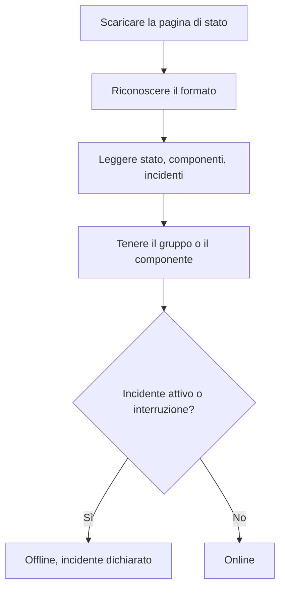

# Monitor pagina di stato esterna

Un monitor di pagina di stato esterna tiene d'occhio la pagina di stato pubblica di un servizio da cui dipendete (AWS, GCP, Azure, GitHub, OpenAI, Anthropic e molti altri) e vi avvisa quando quel provider segnala un'interruzione o prestazioni degradate. Usatelo per sapere dei problemi a monte appena il provider li segnala, e per distinguerli dai vostri.

:::cards
- [Creare il monitor](#creare-un-monitor-di-pagina-di-stato-esterna): Incollate l'URL di una pagina di stato e scegliete cosa controllare.
- [Delimitarlo](#opzioni-di-configurazione): Controllate un gruppo di componenti o un componente.
- [Criteri](#criteri-di-monitoraggio): Cosa conta come guasto, fin dall'inizio.
- [Pagine di stato più diffuse](#url-di-pagine-di-stato-più-diffuse): Gli URL dei servizi da cui dipende la maggior parte dei team.
:::

## Come funziona

A ogni controllo, una sonda scarica la pagina di stato, ne riconosce il formato e legge lo stato generale, i componenti e gli incidenti attivi. Se avete limitato il monitor a un gruppo di componenti o a un componente, contano solo quelli. Poi i criteri decidono se il monitor è online oppure offline.

Potete usarlo per:

- Monitorare la disponibilità dei servizi di terze parti da cui dipende la vostra applicazione
- Ricevere avvisi quando i provider a monte hanno interruzioni
- Seguire lo stato dei singoli componenti
- Limitare il monitoraggio a un solo gruppo di componenti (ad es. solo le "APIs" di OpenAI), così incidenti estranei altrove nella pagina non fanno scattare il vostro monitor
- Rilevare prestazioni degradate prima che colpiscano i vostri utenti
- Mettere in relazione i vostri incidenti con i problemi dei provider a monte

## Provider supportati

| Provider | Descrizione |
| ------------------------ | ---------------------------------------------------------------------- |
| **Auto** (predefinito) | Riconosce automaticamente il formato della pagina di stato |
| **Atlassian Statuspage** | Pagine di stato basate su Atlassian Statuspage (API JSON) |
| **incident.io** | Pagine di stato basate su incident.io (ad es. `https://status.openai.com`) |
| **RSS** | Pagine di stato che offrono un feed RSS |
| **Atom** | Pagine di stato che offrono un feed Atom |

### Riconoscimento automatico

Con **Auto**, OneUptime riconosce automaticamente il formato della pagina di stato, in quest'ordine:

1. Prima prova l'API delle pagine di stato di incident.io (`/proxy/<host>`).
2. Poi prova l'API JSON di Atlassian Statuspage (`/api/v2/status.json`, `/api/v2/components.json` e `/api/v2/incidents/unresolved.json`).
3. Se falliscono, cerca di leggere la pagina come feed RSS o Atom.
4. Come ultima risorsa, esegue un semplice controllo di raggiungibilità HTTP.

> [!NOTE]
> incident.io viene controllato per primo perché alcune pagine di stato di incident.io (come `https://status.openai.com`) espongono anche un endpoint limitato compatibile con Atlassian, che omette i gruppi di componenti e gli incidenti attivi. Controllare prima incident.io garantisce che si usino i dati più completi, che conoscono i gruppi.

Il controllo di raggiungibilità è anche l'ultima risorsa quando un provider scelto esplicitamente fallisce. Dice solo se la pagina risponde (online con una risposta `2xx` o `3xx`) e non riporta componenti né incidenti.

## Creare un monitor di pagina di stato esterna

:::steps
### Iniziare un nuovo monitor

Andate in **Monitor** e fate clic su **Crea monitor**. In **Tipo di monitor**, fate clic su **Altri tipi di monitor** e scegliete **External Status Page** sotto **Basic Monitoring**, oppure digitate `statuspage` nella casella di ricerca. Inserite un **Nome**, poi fate clic su **Avanti**.

### Inserire l'URL della pagina di stato

Inserite l'**URL della pagina di stato**. Lasciate il **Provider** su **Auto** a meno che non conosciate il formato.

### Delimitarlo, se serve

Aprite **Altri campi** per inserire un **Component Group Filter (Optional)**, come `APIs`, e un **Filtro nome componente (facoltativo)** per controllare un singolo componente (all'interno del gruppo, se ne è impostato uno).

### Testarlo

Fate clic su **Testa il monitor** per scaricare la pagina una volta, e controllate provider, componenti e incidenti trovati.

### Rivedere i criteri

Il passaggio dei criteri parte con [i criteri predefiniti](#criteri-predefiniti), che segnano il monitor offline quando il provider segnala un incidente attivo o un'interruzione nell'ambito controllato. Modificateli se serve, poi fate clic su **Avanti**.

### Scegliere le sonde e creare

Selezionate le **Sonde** e un **Intervallo di monitoraggio** (parte da **Ogni 5 minuti**), poi fate clic su **Crea monitor**.
:::

## Opzioni di configurazione

| Opzione | Cosa inserire | Predefinito |
| --- | --- | --- |
| **URL della pagina di stato** | L'URL della pagina di stato. Per i siti basati su Atlassian Statuspage e incident.io è di solito l'URL radice (ad es. `https://status.example.com`). Per i feed RSS/Atom, inserite direttamente l'URL del feed. | — |
| **Provider** | **Auto** per riconoscere il formato, oppure **Atlassian Statuspage**, **incident.io**, **RSS** o **Atom** se lo conoscete. | **Auto** |
| **Component Group Filter (Optional)** | Il gruppo a cui limitare il monitor. In **Altri campi**. | Tutti i gruppi |
| **Filtro nome componente (facoltativo)** | Il componente da controllare. In **Altri campi**. | Tutti i componenti dell'ambito |
| **Timeout (ms)** | Il tempo massimo di attesa della pagina di stato. In **Altri campi**. | `10000` (10 secondi) |
| **Tentativi** | Quante volte ritentare, a un secondo di distanza, dopo che il primo tentativo fallisce; `0` significa un solo tentativo. In **Altri campi**. | `3` (fino a 4 tentativi) |

### Component Group Filter

Se la pagina di stato organizza i componenti in gruppi, potete limitare il monitor a un solo gruppo. Per esempio, su `https://status.openai.com`, inserire `APIs` limita il monitor ai servizi API di OpenAI.

Quando è impostato un gruppo di componenti, il **numero di incidenti attivi** e lo **stato generale** vengono calcolati solo sui componenti di quel gruppo: un incidente che riguarda un gruppo estraneo (per esempio ChatGPT) non farà scattare un monitor limitato al gruppo "APIs".

Il filtro per gruppo di componenti è supportato per i provider **Atlassian Statuspage** e **incident.io**. I feed RSS e Atom non espongono gruppi di componenti.

### Filtro nome componente

Se la pagina di stato riporta più componenti, potete indicare il nome di un componente per monitorare solo quello. Il filtro corrisponde a qualsiasi componente il cui nome contenga ciò che inserite, senza distinguere maiuscole e minuscole: `actions` corrisponde a un componente chiamato "Actions".

Quando è impostato anche un gruppo di componenti, il filtro sul nome del componente si applica **all'interno** di quel gruppo, così potete puntare a un singolo componente in un gruppo più ampio. Se non è indicato alcun filtro, vengono monitorati tutti i componenti dell'ambito. Su un feed RSS o Atom, il filtro sul nome viene confrontato con i titoli degli elementi del feed.

> [!WARNING]
> Un filtro che non corrisponde a nulla sembra sano: senza componenti nell'ambito, non c'è nulla che possa segnalare un'interruzione. Controllate l'ortografia sulla pagina di stato, e usate **Testa il monitor** per vedere cosa tiene il filtro.

## Criteri di monitoraggio

Potete configurare criteri per decidere quando il servizio esterno è considerato online oppure offline, in base a:

| Tipo di filtro | Cosa controlla | Condizioni del filtro |
| --- | --- | --- |
| **External Status Page Is Online** | Se la pagina di stato è raggiungibile e restituisce dati di stato | Vero o Falso |
| **External Status Page Overall Status** | Lo stato generale indicato dalla pagina | Equal To, Not Equal To, Contiene, Not Contains, Starts With, Ends With |
| **External Status Page Component Status** | Lo stato dei componenti dell'ambito (rispettando i filtri per gruppo / nome del componente): Operativo, Under Maintenance, Degraded Performance, Partial Outage, Major Outage o Full Outage | Equal To, Not Equal To, Contiene, Not Contains, Starts With, Ends With |
| **External Status Page Active Incidents** | Il numero di incidenti attualmente attivi riportati sulla pagina di stato (limitato al gruppo / componente quando è impostato un filtro) | Equal To, Not Equal To e i confronti numerici |
| **External Status Page Response Time (in ms)** | Quanto tempo serve a scaricare i dati della pagina di stato | Greater Than, Less Than, Greater Than Or Equal To, Less Than Or Equal To |

Lo stato generale è ciò che dice la pagina, quindi i suoi valori variano a seconda del provider: una Atlassian Statuspage riporta la propria descrizione, come `All Systems Operational`; un feed riporta `operational` o `degraded_performance`; il controllo di raggiungibilità riporta `reachable` o `unreachable`. Questi confronti distinguono maiuscole e minuscole. Per avvisare delle interruzioni, **External Status Page Active Incidents** ed **External Status Page Component Status** sono di solito più affidabili.

Su un feed RSS o Atom, gli elementi delle ultime 24 ore contano come incidenti attivi: un elemento RSS in base alla data di pubblicazione, una voce Atom in base alla data di aggiornamento.

### Criteri predefiniti

Per impostazione predefinita, OneUptime crea criteri basati su ciò che conta davvero per una pagina di stato (i suoi incidenti attivi e la salute dei suoi componenti) e non sulla semplice raggiungibilità:

| Criterio | Filtri | Effetto |
| --- | --- | --- |
| Offline | **Qualsiasi** tra: la pagina non è online; c'è almeno un incidente attivo nell'ambito; un componente dell'ambito segnala Degraded Performance, Partial Outage, Major Outage o Full Outage | Segna il monitor offline e dichiara un incidente, che si risolve da solo quando il criterio smette di corrispondere |
| Online | **Tutti** tra: la pagina è online; non ci sono incidenti attivi nell'ambito | Segna il monitor online |

Poiché il numero di incidenti attivi e gli stati dei componenti rispettano i filtri per gruppo / nome del componente, questi criteri predefiniti si concentrano automaticamente solo sui componenti che vi interessano.

## Variabili del modello

Quando create incidenti o avvisi da monitor di pagina di stato esterna, potete usare queste variabili in titoli, descrizioni e note di rimedio (consultate [Modelli di incidenti e avvisi](/docs/monitor/incident-alert-templating)):

| Variabile | Descrizione |
| ------------------------- | ------------------------------------------------------------------------------- |
| `{{isOnline}}`            | Se la pagina di stato è online (true/false) |
| `{{responseTimeInMs}}`    | Tempo di risposta in millisecondi |
| `{{failureCause}}`        | Motivo del guasto, se presente |
| `{{overallStatus}}`       | Il valore dell'indicatore di stato generale |
| `{{activeIncidentCount}}` | Numero di incidenti attivi (limitato dal filtro, se presente) |
| `{{componentStatuses}}`   | Array JSON degli stati dei componenti (`name`, `status`, `description`, `groupName`) |
| `{{provider}}`            | Provider riconosciuto (Atlassian Statuspage, incident.io, RSS, Atom); vuoto dopo un controllo di raggiungibilità |
| `{{componentGroup}}`      | Gruppo di componenti a cui è limitato il monitor, se presente |
| `{{componentName}}`       | Componente a cui è limitato il monitor, se presente |

## URL di pagine di stato più diffuse

Ecco un elenco di pagine di stato di servizi diffusi. Molte usano Atlassian Statuspage o incident.io, quindi il provider **Auto** le riconosce automaticamente. Una pagina costruita su nessuno dei due, e che non è un feed, riceve solo il controllo di raggiungibilità: per quelle, monitorate invece il feed RSS o Atom del provider, se ne pubblica uno.

| Servizio | URL della pagina di stato |
| ---------------------------- | --------------------------------------------- |
| AWS                          | `https://health.aws.amazon.com/health/status` |
| Google Cloud Platform        | `https://status.cloud.google.com`             |
| Microsoft Azure              | `https://status.azure.com`                    |
| GitHub                       | `https://www.githubstatus.com`                |
| OpenAI                       | `https://status.openai.com`                   |
| Anthropic                    | `https://status.anthropic.com`                |
| Cloudflare                   | `https://www.cloudflarestatus.com`            |
| Datadog                      | `https://status.datadoghq.com`                |
| PagerDuty                    | `https://status.pagerduty.com`                |
| Twilio                       | `https://status.twilio.com`                   |
| Stripe                       | `https://status.stripe.com`                   |
| Slack                        | `https://status.slack.com`                    |
| Atlassian (Jira, Confluence) | `https://status.atlassian.com`                |
| Vercel                       | `https://www.vercel-status.com`               |
| Netlify                      | `https://www.netlifystatus.com`               |
| DigitalOcean                 | `https://status.digitalocean.com`             |
| Heroku                       | `https://status.heroku.com`                   |
| MongoDB Atlas                | `https://status.cloud.mongodb.com`            |
| Fastly                       | `https://status.fastly.com`                   |
| New Relic                    | `https://status.newrelic.com`                 |
| Sentry                       | `https://status.sentry.io`                    |
| CircleCI                     | `https://status.circleci.com`                 |

## Buone pratiche

- **Usate il provider Auto** a meno che non conosciate il formato esatto: il riconoscimento automatico funziona bene per la maggior parte delle pagine di stato.
- **Limitatevi a un gruppo di componenti** se dipendete solo da una parte di un provider (ad es. solo le "APIs" di OpenAI), così gli incidenti estranei non fanno rumore.
- **Monitorate componenti specifici** se dipendete solo da alcuni servizi.
- **Combinatelo con i vostri monitor**: abbinate i monitor di pagina di stato esterna ai vostri monitor di API e di siti web. Quando entrambi cadono insieme, la pagina di stato a monte vi porta prima alla causa principale.

## Risoluzione dei problemi

:::details Il monitor è offline, ma l'incidente riguarda una parte del servizio che non uso
Limitate il monitor con un **Component Group Filter**, un **Filtro nome componente** o entrambi. Il numero di incidenti attivi e gli stati dei componenti contano allora solo ciò che rientra nell'ambito.
:::

:::details Il monitor non va mai offline, nemmeno durante un'interruzione
Forse i filtri non corrispondono a nulla, il che sembra sano, oppure la pagina riceve solo il controllo di raggiungibilità. Eseguite **Testa il monitor** e controllate il provider e i componenti trovati.
:::

:::details Auto sceglie il formato sbagliato, o non trova componenti
Impostate il **Provider** su quello che sapete essere usato dalla pagina. Per un feed RSS o Atom, inserite l'URL del feed stesso invece di quello della pagina di stato.
:::

:::details Una pagina di stato interna non è raggiungibile
Una sonda rifiuta gli indirizzi di rete privata, a meno che non sia autorizzata a raggiungerli. Impostate `PROBE_ALLOW_PRIVATE_NETWORK_MONITORS=true` su una sonda all'interno della vostra rete: consultate [Accesso alla rete privata](/docs/self-hosted/private-network-access).
:::

## Passi successivi

:::cards
- [Modelli di incidenti e avvisi](/docs/monitor/incident-alert-templating): Inserite lo stato del provider nei titoli dei vostri incidenti.
- [Monitor API](/docs/monitor/api-monitor): Controllate i vostri endpoint accanto allo stato del vostro provider.
- [Creare un monitor](/docs/monitor/create-monitor): I passaggi comuni a tutti i tipi di monitor.
:::
