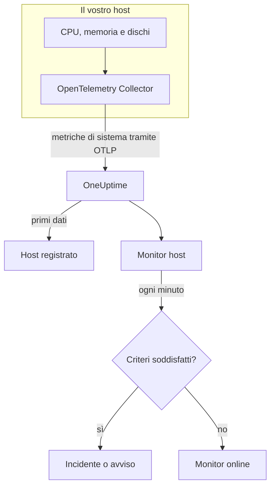

# Monitor host

Un monitor host sorveglia una macchina – CPU, memoria, dischi, carico e processi – e vi avvisa quando è satura o si sta riempiendo. Legge le metriche OpenTelemetry `system.*` che un OpenTelemetry Collector invia dall'host, gli stessi dati mostrati dal prodotto **Host**, quindi niente viene sondato dall'esterno.

:::cards
- [Creare il monitor](#creare-un-monitor-host): Sei passaggi nella dashboard.
- [Modelli](#modelli-di-avviso-pronti): Cinque avvisi pronti per CPU, memoria, disco, carico e processi.
- [Metriche](#metriche-raccolte): Le metriche dell'host su cui potete avvisare, e le loro unità.
- [Host o Server / VM?](#monitor-host-o-monitor-server-vm): Quale dei due monitor per macchine usare.
:::

## Come funziona

Sull'host viene eseguito un OpenTelemetry Collector con il receiver `hostmetrics`. Ogni 30 secondi legge i valori di CPU, memoria, disco, rete, carico e processi dell'host e li invia a OneUptime tramite OTLP. I primi dati di un host lo registrano in **Host**.

Un monitor host è legato a un host. Ogni minuto esegue la sua query sulle metriche di quell'host e confronta il risultato con i suoi criteri.

### Monitor host o monitor Server / VM?

OneUptime ha due monitor per le macchine. Possono funzionare sullo stesso host.

| | Monitor host | Monitor Server / VM |
| --- | --- | --- |
| **Agente** | Un OpenTelemetry Collector con il receiver `hostmetrics` | L'agente di infrastruttura OneUptime |
| **Dati** | Le metriche OpenTelemetry `system.*` e `process.*`, le stesse mostrate nei grafici delle pagine **Host** | Un report di stato che l'agente invia al monitor |
| **Criteri** | Soglie o rilevamento delle anomalie su qualsiasi query di metriche o formula | Controlli integrati come l'utilizzo di CPU, memoria e disco |
| **Configurazione** | Installare il collector; l'host si registra da solo | Creare il monitor, poi dare la sua chiave segreta all'agente |

Usate il monitor host quando l'host invia già dati OpenTelemetry, o quando volete log e metriche più ricchi dallo stesso collector. Vedete [Monitor server / VM](/docs/monitor/server-monitor) per l'altro.

## Prima di iniziare

- **Eseguite un OpenTelemetry Collector sull'host** con il receiver `hostmetrics`. [Collector OpenTelemetry sull'host](/docs/telemetry/host-otel-collector) copre Linux, macOS e Windows, e **Prodotti → Infrastruttura → Host → Documentazione** fornisce una configurazione pronta.
- **Attivate le metriche di utilizzo.** `system.cpu.utilization`, `system.memory.utilization` e `system.filesystem.utilization` sono facoltative nel receiver, e i modelli di CPU, memoria e filesystem ne hanno bisogno. La configurazione della dashboard le attiva.
- **Verificate che l'host sia registrato.** Compare in **Prodotti → Infrastruttura → Host → Tutti gli host**, con il nome del suo `host.name`, appena arrivano i suoi primi dati.

## Creare un monitor host

:::steps
### Iniziare un nuovo monitor

Andate in **Monitor** e fate clic su **Crea monitor**.

### Scegliere il tipo Host

In **Tipo di monitor**, fate clic su **Altri tipi di monitor** e scegliete **Host** in **Infrastruttura**. Inserite un **Nome** – viene usato nei titoli di incidenti e avvisi – e fate clic su **Avanti**.

### Scegliere la macchina

In **Host Monitor Configuration**, scegliete la macchina da **Host**. Ogni host che ha inviato dati è nell'elenco.

### Scegliere cosa sorvegliare

Scegliete una delle tre schede:

- **Quick Setup** – fate clic su un [modello](#modelli-di-avviso-pronti). Imposta la metrica, l'aggregazione, l'intervallo di tempo e le soglie, e sostituisce i criteri più sotto con i propri. Potete comunque cambiare l'**Intervallo di tempo**.
- **Custom Metric** – scegliete una metrica da **Host Metric**, poi impostate **Aggregazione** e **Intervallo di tempo**.
- **Avanzato** – costruite voi query e formule in **Seleziona metriche**, per esempio un filtro su `state` o un raggruppamento per `mountpoint`.

### Rivedere i criteri

Aprite ogni criterio in **Criteri del monitor** e verificatene **Metrica**, **Aggregazione**, **Condizione** e **Threshold**. Un modello li compila. Con **Custom Metric** o **Avanzato**, il monitor parte con i [criteri predefiniti](#criteri-predefiniti), che notano solo una metrica che scende a zero, quindi impostate la vostra soglia.

### Creare il monitor

Fate clic su **Crea monitor**. OneUptime apre la pagina del monitor e lo valuta ogni minuto. Gli incidenti e gli avvisi che genera compaiono anche nelle pagine **Incidenti** e **Avvisi** dell'host.
:::

> [!TIP]
> Per configurare più modelli alla volta, aprite l'host da **Prodotti → Infrastruttura → Host** e andate in **Recommendations**. Scegliete i modelli che volete, scegliete chi viene avvisato, e OneUptime crea un monitor per modello.

## Impostazioni del monitor

| Campo | Scheda | Cosa fa |
| --- | --- | --- |
| **Host** | Tutte | Obbligatorio. Limita ogni query al `resource.host.name` dell'host. |
| **Host Metric** | Custom Metric | Una metrica del [catalogo](#metriche-raccolte), raggruppata in CPU, memoria, disco, rete, carico e processi. |
| **Aggregazione** | Custom Metric | Come vengono combinati i campioni: **Media**, **Massimo**, **Minimo**, **Somma** o **Conteggio**. Parte dall'aggregazione abituale della metrica. |
| **Intervallo di tempo** | Tutte | La finestra mobile che la query legge, da **Past 1 Minute** a **Past 365 Days**. Un nuovo monitor parte da **Past 1 Minute**; i modelli impostano la propria. |
| **Seleziona metriche** | Avanzato | Il costruttore di query: **Metrica**, **Aggregate by**, **Filter by attributes**, **Group by**, più **Aggiungi metrica** e **Aggiungi formula** per combinare le query. |

## Modelli di avviso pronti

**Quick Setup** offre cinque modelli. Ognuno costruisce un monitor completo: una query, un criterio che scatta e uno che ripristina. Le soglie sono punti di partenza modificabili.

Un criterio scatta solo quando la condizione vale per ogni minuto della sua finestra, e si ripristina il 10% oltre la soglia, così un valore che oscila sul limite non cambia stato di continuo.

| Modello | Gravità | Sorveglia | Scatta quando | Si ripristina quando |
| --- | --- | --- | --- | --- |
| High CPU Utilization | Warning | `system.cpu.utilization` per gli stati `user` e `system`, sommati e mostrati come percentuale, ultimi 5 minuti | Sopra l'80% | Al 72% o meno |
| High Memory Utilization | Warning | `system.memory.utilization` per lo stato `used`, come percentuale, ultimi 5 minuti | Sopra l'85% | Al 76,5% o meno |
| High Filesystem Usage | Critico | `system.filesystem.utilization`, Max per `mountpoint` e `device`, come percentuale, ultimi 5 minuti | Sopra il 90% | All'81% o meno |
| High Load Average (1m) | Warning | `system.cpu.load_average.1m`, Avg, ultimi 5 minuti | Sopra 4 | A 3,6 o meno |
| High Process Count | Warning | `system.processes.count`, Max, ultimi 5 minuti | Sopra 2000 | A 1800 o meno |

**Gravità** è l'etichetta che mostra il selettore. L'incidente e l'avviso creati da un modello partono dalla gravità di incidente e di avviso più alta del vostro progetto; cambiatele nei criteri.

- **CPU** è il tempo occupato (`user` più `system`), lo stesso valore mostrato nei grafici della **Panoramica** dell'host. Attesa I/O e steal sono esclusi.
- **Memoria** esclude i buffer e la cache delle pagine, quindi un host occupato soprattutto dalla cache non la fa scattare.
- **Filesystem** apre un incidente per ogni mount. I pseudo-filesystem in sola lettura, come i mount snap `squashfs` o `devfs` di macOS, sono sempre pieni al 100%; escludeteli nello scraper `filesystem` del collector.
- **Media di carico** è una lunghezza grezza della coda di esecuzione, non divisa per il numero di core: 4 è saturazione su un host a 2 core e routine su uno a 32 core, quindi alzatela sugli host grandi.
- **Numero di processi** confronta il singolo stato di processo più grande (`running`, `sleeping`, …), non il totale dell'host, quindi non corrisponderà a un elenco dei processi. Lo scraper dei processi comunica solo su Linux.

## Metriche raccolte

L'elenco **Host Metric** offre queste metriche. Ognuna porta `resource.host.name`, che è il modo in cui il monitor limita le sue query a un host.

> [!IMPORTANT]
> Le metriche di utilizzo sono un rapporto da 0 a 1, non una percentuale: usate `0.8` per l'80% in una soglia sulla metrica grezza. I modelli convertono in percentuale con una formula, quindi le loro soglie indicano 80, 85 e 90.

### CPU

| Metrica | Unità | Descrizione |
| --- | --- | --- |
| `system.cpu.utilization` | ratio | Quota del tempo di CPU in ciascuno `state` (`user`, `system`, `idle`, …). Filtrate su `state`: una media su tutti gli stati non raggiunge mai una soglia utile. |
| `process.cpu.utilization` | ratio | Utilizzo della CPU di ogni processo dell'host. |

### Memoria

| Metrica | Unità | Descrizione |
| --- | --- | --- |
| `system.memory.utilization` | ratio | Quota della memoria fisica in ciascuno `state` (`used`, `free`, `cached`, …). Filtrate su `state = used` per la memoria in uso. |
| `system.memory.usage` | bytes | Utilizzo della memoria in byte. |

### Disco

| Metrica | Unità | Descrizione |
| --- | --- | --- |
| `system.filesystem.utilization` | ratio | Quota della capacità di ogni filesystem in uso, per `mountpoint` e `device`. |
| `system.filesystem.usage` | bytes | Utilizzo del filesystem in byte. |

### Rete

| Metrica | Unità | Descrizione |
| --- | --- | --- |
| `system.network.io` | bytes | Byte ricevuti e inviati. Un contatore sull'intera vita. |

### Carico

| Metrica | Unità | Descrizione |
| --- | --- | --- |
| `system.cpu.load_average.1m` | count | Media di carico dell'ultimo minuto. |
| `system.cpu.load_average.5m` | count | Media di carico degli ultimi 5 minuti. |
| `system.cpu.load_average.15m` | count | Media di carico degli ultimi 15 minuti. |

### Processi

| Metrica | Unità | Descrizione |
| --- | --- | --- |
| `system.processes.count` | count | Processi sull'host, una serie per `status` di processo. |

Il costruttore di query di **Avanzato** elenca tutte le metriche inviate dall'host, non solo queste.

## Criteri di monitoraggio

Un criterio confronta una delle query o formule del monitor con una soglia. I criteri di un monitor host non hanno un **Tipo di filtro**: ogni regola controlla il valore della metrica, con questi campi.

| Campo | Cosa fa |
| --- | --- |
| **Metrica** | La query o la formula da controllare, tramite il suo nome di variabile. |
| **Aggregazione** | Come i valori della finestra diventano un'unica risposta: **Media**, **Somma**, **Maximum Value**, **Minimum Value**, **All Values** (ogni valore deve corrispondere) o **Any Value** (ne basta uno). |
| **Condizione** | **Greater Than**, **Less Than**, **Greater Than Or Equal To**, **Less Than Or Equal To** o **Equal To**, oppure una condizione di anomalia: **Anomalously High**, **Anomalously Low** o **Anomalous**. |
| **Threshold** | Il valore con cui confrontare. Accanto c'è un elenco di unità quando la metrica ha un'unità. Non viene mostrato per le condizioni di anomalia. |
| **Sensibilità** | Solo condizioni di anomalia. **Bassa** (4σ), **Media** (3σ, il predefinito) o **Alta** (2σ). |
| **Finestra di riferimento** | Solo condizioni di anomalia. 14 giorni (il predefinito), 28, 60 o 90 giorni di storico. |
| **Se nessun dato** | In **Altri campi**. Cosa succede quando la finestra non ha campioni: **Ignore** (predefinito), **Treat As Zero** o **Trigger**. |

Le condizioni di anomalia confrontano ogni valore con la stessa ora della settimana nella baseline. Restano in uno stato «Learning», e non generano nulla, finché la finestra di riferimento non contiene abbastanza storico.

Ogni criterio indica anche cosa fare quando corrisponde: cambiare lo stato del monitor, creare un avviso o dichiarare un incidente. I criteri vengono controllati dall'alto verso il basso, e decide il primo che corrisponde.

### Criteri predefiniti

Un monitor che non create da un modello parte con due criteri:

| Ordine | Criterio | Corrisponde quando | Poi |
| --- | --- | --- | --- |
| 1 | Check if _monitor name_ is offline | Un valore qualsiasi della prima query è `0` | Segna il monitor come **Offline** e dichiara l'incidente «_monitor name_ is offline», che si risolve da solo quando il monitor si riprende. |
| 2 | Check if _monitor name_ is online | Un valore qualsiasi è sopra `0` | Segna il monitor come **Operativo**. |

> [!IMPORTANT]
> Il silenzio non corrisponde a nessuno dei due criteri: un host che smette di inviare dati lascia il monitor com'era. Per essere avvisati quando l'host tace, impostate **Se nessun dato** su **Trigger** in un criterio. Il tempo in cui OneUptime stesso non stava ricevendo non è mai assenza di dati: un controllo la cui finestra lo contiene attende invece, come spiega [Quando OneUptime non riceve dati](/docs/monitor/when-oneuptime-is-not-receiving).

## Risoluzione dei problemi

:::details L'host non è nell'elenco Host
Gli host si registrano da soli a partire dai dati del collector, che richiedono un `host.name` e il tipo di sistema operativo dell'host: entrambi provengono dal processore `resourcedetection` del collector. Verificate che il collector sia in esecuzione e che l'host compaia in **Prodotti → Infrastruttura → Host → Tutti gli host**. [Collector OpenTelemetry sull'host](/docs/telemetry/host-otel-collector) copre la configurazione.
:::

:::details Una soglia di CPU o di memoria non scatta mai
Le metriche di utilizzo sono rapporti che arrivano al massimo a `1.0`, quindi una soglia scritta a mano di `80` non viene mai superata: usate `0.8`, oppure partite da un modello, che converte in percentuale. Filtrate anche su `state`: `user` e `system` per la CPU, `used` per la memoria. Una media su tutti gli stati resta vicina a 1 diviso il numero di stati.
:::

:::details Gli incidenti scattano per l'host sbagliato
Il monitor limita ogni query a `resource.host.name` uguale all'host che avete scelto. Gli host che comunicano lo stesso `host.name` confluiscono in un'unica serie, quindi date a ogni host un nome univoco.
:::

:::details High Filesystem Usage scatta per un mount sempre pieno
I pseudo-filesystem in sola lettura, come i mount loop snap `squashfs` sotto `/snap` o `devfs` di macOS, sono pieni al 100% per progettazione e non si riprendono mai. Escludeteli dallo scraper `filesystem` del collector.
:::

## Passaggi successivi

:::cards
- [Collector OpenTelemetry sull'host](/docs/telemetry/host-otel-collector): Installare e configurare il collector che questo monitor legge.
- [Monitor server / VM](/docs/monitor/server-monitor): Il monitor per macchine a cui un agente invia i report.
- [Monitor metriche](/docs/monitor/metrics-monitor): Avvisare su qualsiasi metrica, tra host e servizi.
- [Panoramica degli incidenti](/docs/incidents/index): Cosa succede dopo che un criterio ha dichiarato un incidente.
:::
