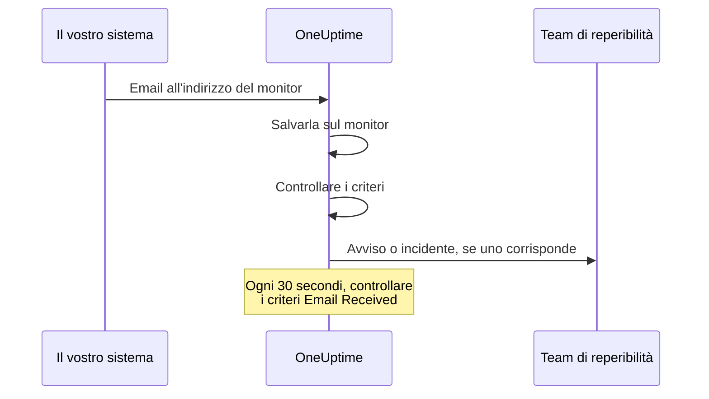

# Monitor email in arrivo

Un monitor di email in arrivo vi dà un indirizzo email che appartiene a un solo monitor. Qualsiasi cosa sappia inviare email (un job di backup, un sistema legacy, gli avvisi di un provider cloud) vi manda i propri risultati, e OneUptime controlla ogni email in base ai vostri criteri per segnare il monitor come guasto, aprire un incidente o creare un avviso, e per risolverli quando arriva il cessato allarme.

:::cards
- [Creare il monitor](#creare-un-monitor-di-email-in-arrivo): Ottenete un indirizzo e indirizzatevi il vostro mittente.
- [Verificare l'indirizzo](#verificare-lindirizzo-con-il-mittente): Leggete sul monitor l'email di conferma di un mittente.
- [Scrivere criteri](#tipi-di-filtro-disponibili): Confrontate oggetto, mittente o corpo, oppure avvisate quando le email smettono di arrivare.
- [Usare l'email negli avvisi](#variabili-del-modello): Inserite oggetto e corpo in titoli e descrizioni.
:::

## Come funziona

L'email è un modello push: il vostro sistema invia e OneUptime ascolta. Ogni email viene controllata in base ai criteri del monitor appena arriva. Anche i criteri che cercano un'email che *sarebbe dovuta* arrivare vengono controllati a intervalli regolari, ogni 30 secondi.



1. Quando create un monitor di email in arrivo, OneUptime gli assegna un indirizzo email univoco.
2. Ogni email inviata a quell'indirizzo viene salvata sul monitor e valutata in base ai suoi criteri, dall'alto; decide il primo criterio che corrisponde.
3. Un criterio che corrisponde può cambiare lo stato del monitor, creare un avviso e dichiarare un incidente. Un incidente con **Risoluzione automatica dell'incidente** attiva, o un avviso con **Risoluzione automatica dell'avviso** attiva, viene risolto quando in seguito corrisponde un altro criterio: per esempio quello che segna il monitor online.

## Creare un monitor di email in arrivo

:::steps
### Iniziare un nuovo monitor

Andate in **Monitor** e fate clic su **Crea monitor**.

### Scegliere Incoming Email

In **Tipo di monitor**, fate clic su **Altri tipi di monitor** e scegliete **Incoming Email** sotto **Inbound Monitoring**, oppure digitate `email` nella casella di ricerca. Inserite un **Nome**, poi fate clic su **Avanti**.

### Rivedere i criteri

Il passaggio **Criteri** parte con [i criteri predefiniti](#cosa-ottenete-subito), che segnano il monitor offline quando un'email menziona `error`. Fate clic su un criterio per modificarlo, oppure su **Aggiungi criteri** per aggiungerne uno. Consultate [Configurazioni di esempio](#configurazioni-di-esempio) per le configurazioni più comuni.

### Creare il monitor

Fate clic su **Crea monitor**. Il monitor si apre sulla sua pagina **Panoramica**, dove la scheda **Incoming Email Address** mostra l'indirizzo con un pulsante di copia finché non arriva la prima email.

### Inviare email all'indirizzo

Configurate il vostro sistema perché invii le sue notifiche all'indirizzo. Se il mittente vi chiede prima di confermare l'indirizzo, consultate [Verificare l'indirizzo con il mittente](#verificare-lindirizzo-con-il-mittente).
:::

> [!NOTE]
> L'indirizzo contiene la chiave segreta del monitor, quindi possono vederlo solo le persone che possono modificare i monitor. Tutti gli altri vedono che i dettagli di configurazione sono nascosti.

## Formato dell'indirizzo email

Ogni monitor di email in arrivo riceve un indirizzo univoco in questo formato:

```text
monitor-{secret-key}@{inbound-domain}
```

La chiave segreta è un UUID, per esempio `monitor-3f2b8c1e-5d4a-4f6b-9a7c-2e1d0b9f8a6c@inbound.yourdomain.com`. Dopo l'arrivo della prima email, l'indirizzo resta nella pagina **Panoramica** del monitor nella scheda **Inbound email address**, accanto all'ora dell'ultima email. Lo mostra anche la pagina **Documentazione** del monitor.

## Reimpostare o personalizzare l'indirizzo email

Andate nella scheda **Impostazioni** del monitor. La scheda **Incoming Email Address** mostra l'indirizzo attuale e offre due modi per sostituirlo:

| Azione | Cosa fa | Quando usarla |
| --- | --- | --- |
| **Reset Address** | Dà al monitor un nuovo indirizzo `monitor-{secret-key}@{inbound-domain}` generato a caso. Se il monitor ha un indirizzo personalizzato, la reimpostazione lo rimuove. Vi chiede prima conferma. | L'indirizzo è trapelato, oppure volete tagliare fuori qualunque cosa vi stia inviando email. |
| **Customize Address** | Vi lascia scegliere la parte prima della @, per esempio `nightly-backups@{inbound-domain}`. Inseritela in **Address name** (potete digitare il nome o incollare l'indirizzo intero) e fate clic su **Save Address**. | Volete un indirizzo che le persone riconoscano. |

Entrambe le azioni terminano mostrando il nuovo indirizzo con un pulsante di copia.

> [!WARNING]
> **Il vecchio indirizzo smette di funzionare subito**: le email inviate a quell'indirizzo vengono ignorate, quindi aggiornate ogni sistema che invia email a questo monitor.

Regole per gli indirizzi personalizzati:

- Da 3 a 64 caratteri: lettere minuscole, numeri, punti (`.`), trattini (`-`) e trattini bassi (`_`), senza due punti di fila. Deve iniziare e finire con una lettera o un numero. Le maiuscole inserite vengono convertite in minuscole.
- Il dominio è sempre il dominio di ricezione email del server.
- Il nome non deve essere già usato da un altro monitor. Tutti i progetti del server condividono il dominio di ricezione, quindi il nome deve essere unico tra tutti.
- I nomi nella forma `monitor-{id}` e `workflow-{id}` sono riservati agli indirizzi generati. Sono riservati anche i nomi di casella che appartengono al dominio stesso: `abuse`, `admin`, `administrator`, `hostmaster`, `mailer-daemon`, `noc`, `postmaster`, `root`, `security` e `webmaster`.

Un indirizzo personalizzato è una credenziale tanto quanto uno generato: chiunque lo conosca può inviare email che questo monitor valuta. Gli indirizzi generati sono praticamente impossibili da indovinare, mentre un nome breve e ovvio non lo è. Scegliete qualcosa di difficile da indovinare, se per voi conta.

Gli utenti dell'API possono fare lo stesso tramite l'API dei monitor, su un monitor esistente: impostate `incomingEmailCustomLocalPart` con il nome per usare un indirizzo personalizzato, oppure con `null` per tornare a quello generato. Reimpostare significa scrivere un nuovo `incomingEmailSecretKey` e impostare `incomingEmailCustomLocalPart` a `null` nello stesso aggiornamento.

## Verificare l'indirizzo con il mittente

Alcuni servizi non inviano avvisi a un nuovo indirizzo finché qualcuno non dimostra di poterne leggere la posta. Prima inviano un'email di verifica, che arriva al monitor come qualsiasi altra email. Per leggerla:

:::steps
### Aggiungere l'indirizzo al servizio

Aggiungete l'indirizzo del monitor al servizio e salvate. Il servizio invia la sua email di verifica.

### Aprire l'email più recente

In OneUptime, aprite il monitor. Nella sua pagina **Panoramica**, la scheda **Riepilogo del monitor** mostra l'email più recente. Controllate che **Da** e **Oggetto** siano quelli dell'email di verifica, poi fate clic su **Mostra altri dettagli**.

### Copiare il codice o il link

Il codice o il link si trova in **Corpo dell'email (testo)**. **Corpo dell'email (HTML)** mostra il sorgente HTML, quindi se copiate un link da lì, sostituite ogni `&amp;` con `&`.

### Completare la verifica

Completate la verifica come vi indica l'email.
:::

Se nel frattempo è arrivata un'altra email, la scheda non mostra più l'email di verifica. Aprite **Registri di monitoraggio**, trovate l'email di verifica dal suo oggetto nella colonna **E-mail** e fate clic su **Visualizza riepilogo** su quella riga.

> [!IMPORTANT]
> **Anche i vostri criteri la vedono.** L'email di verifica viene valutata come qualsiasi altra email. Una formulazione come "if you received this in error" corrisponde al criterio predefinito `error` e segna il monitor offline. Per evitarlo, disattivate **Controlla questo monitor** nella scheda **Monitoraggio** della pagina **Impostazioni** del monitor mentre verificate (vi chiede conferma). Un monitor con il monitoraggio disattivato registra comunque l'email, e la scheda **Riepilogo del monitor** continua a mostrarla. Però non valuta nulla, quindi l'email non ha una riga in **Registri di monitoraggio**: leggetela prima che arrivi un'altra email. Quando avete finito, premete **Attiva il monitoraggio** nel banner in cima alle pagine del monitor, oppure riattivate l'interruttore.

**La verifica appartiene all'indirizzo.** Se [reimpostate o personalizzate l'indirizzo](#reimpostare-o-personalizzare-lindirizzo-email), il servizio vede un nuovo destinatario, e dovete verificare di nuovo.

### Gruppi di azioni di Azure Monitor

Da luglio 2026 Azure sta introducendo l'obbligo di verificare con un codice monouso ogni nuovo destinatario **Email** di un gruppo di azioni. Finché non è verificato, il gruppo di azioni non invia a quell'indirizzo né avvisi né notifiche di test.

:::steps
1. Aggiungete al gruppo di azioni una notifica **Email** con l'indirizzo del monitor, e salvate il gruppo di azioni. Azure invia l'email di verifica da un indirizzo Microsoft come `azure-noreply@microsoft.com`.
2. Leggetela sul monitor come descritto sopra, e seguitene le istruzioni entro 30 minuti dal salvataggio del gruppo di azioni. Se il codice scade, aprite il gruppo di azioni e selezionate **Resend**.
3. Aprite il gruppo di azioni e selezionate **Test** per inviare una notifica di test. Arriva sul monitor come un avviso vero, quindi mostra anche se i vostri criteri corrispondono alle email di Azure.
:::

La verifica copre tutti i gruppi di azioni dello stesso tenant Azure, quindi ogni indirizzo va verificato una sola volta.

### Amazon SNS

Una sottoscrizione email a un topic SNS non riceve nulla finché non è confermata. Quando create la sottoscrizione, Amazon SNS invia un'email di conferma all'indirizzo. Leggetela sul monitor come descritto sopra, e aprite il suo link **Confirm subscription** nel browser. SNS elimina una sottoscrizione che non viene confermata entro 48 ore; in quel caso, create di nuovo la sottoscrizione.

## Cosa ottenete subito

Un nuovo monitor di email in arrivo viene creato con due criteri che leggono il corpo dell'email:

| Criterio | Tipo di filtro | Condizione del filtro | Valore | Effetto |
| -------- | ----------- | ---------------- | ------- | -------------------------------------------- |
| Offline  | Email Body  | Contiene | `error` | Segna il monitor offline, apre un incidente |
| Online   | Email Body  | Not Contains | `error` | Segna il monitor online |

È adatto al caso comune in cui un job o uno strumento di terze parti invia per email il proprio risultato: un messaggio il cui corpo menziona `error` porta il monitor offline, e il messaggio successivo senza quella parola lo riporta online e risolve l'incidente. Il confronto sul corpo non distingue maiuscole e minuscole, quindi corrispondono anche `Error` ed `ERROR`.

Sostituite il valore con ciò che il vostro mittente scrive davvero (`FAILED`, `exit code 1` e così via).

> [!NOTE]
> Questi criteri predefiniti **non** sono un interruttore a uomo morto: niente qui scatta quando le email smettono di arrivare. I criteri che leggono solo oggetto, mittente, corpo o destinatario vengono valutati quando arriva un'email e in nessun altro momento. Per essere avvisati del silenzio, aggiungete un criterio **Email Received** / **Not Recieved In Minutes**: vedete l'[Esempio 3](#esempio-3-monitor-heartbeat-nessuna-email-avviso).

## Tipi di filtro disponibili

Potete creare criteri basati su questi campi dell'email:

| Tipo di filtro | Descrizione |
| ------------------------- | ----------------------------------------------------------------------------------- |
| **Oggetto dell'email** | La riga dell'oggetto dell'email in arrivo |
| **Email From Address** | L'indirizzo del mittente: solo l'indirizzo, in minuscolo, senza nome visualizzato |
| **Email Body** | La parte in testo semplice del corpo dell'email |
| **Email To Address** | L'indirizzo email del destinatario |
| **Email Received** | Criteri temporali su quando vengono ricevute le email |
| **JavaScript Expression** | Un'espressione JavaScript personalizzata che deve risultare vera |

L'indirizzo del monitor stesso viene mascherato prima che un criterio legga l'email, quindi in **Email To Address**, **Oggetto dell'email** e **Email Body** appare come `[REDACTED]`.

## Condizioni del filtro

### Filtri di stringa (oggetto, mittente, corpo, destinatario)

| Condizione del filtro | Descrizione | Esempio |
| ---------------- | ----------------------------------------- | ---------------------------------- |
| **Contiene** | Il campo contiene il testo indicato | L'oggetto contiene "CRITICAL" |
| **Not Contains** | Il campo non contiene il testo indicato | L'oggetto non contiene "TEST" |
| **Equal To** | Il campo corrisponde esattamente al testo indicato | Il mittente è uguale a "alerts@service.com" |
| **Not Equal To** | Il campo non corrisponde al testo indicato | L'oggetto è diverso da "OK" |
| **Starts With** | Il campo inizia con il testo indicato | L'oggetto inizia con "[ALERT]" |
| **Ends With** | Il campo termina con il testo indicato | L'oggetto termina con "- Production" |
| **Is Empty** | Il campo è vuoto o bianco | Il corpo è vuoto |
| **Is Not Empty** | Il campo ha un contenuto | L'oggetto non è vuoto |

Tutti questi confronti non distinguono maiuscole e minuscole. Un filtro con un valore vuoto non corrisponde mai.

### Filtri temporali (Email Received)

La dashboard scrive queste condizioni "Recieved".

| Condizione del filtro | Descrizione | Esempio |
| --------------------------- | ----------------------------------- | -------------------------------- |
| **Recieved In Minutes** | È stata ricevuta un'email entro X minuti | Email ricevuta entro 30 minuti |
| **Not Recieved In Minutes** | Nessuna email ricevuta in X minuti | Nessuna email ricevuta in 60 minuti |

Un monitor che non ha mai ricevuto un'email conta la propria ora di creazione come ultima email.

### JavaScript Expression

| Condizione del filtro | Descrizione |
| --------------------- | ------------------------------------- |
| **Evaluates To True** | L'espressione restituisce un valore vero |

L'espressione viene eseguita in una sandbox senza campi email collegati, quindi non può leggere oggetto, mittente, corpo o destinatario del messaggio che ha avviato il controllo. Usate i tipi di filtro **Oggetto dell'email**, **Email From Address**, **Email Body** ed **Email To Address** per confrontare il contenuto dell'email.

## Configurazioni di esempio

Ogni esempio è una coppia di criteri. Un criterio ha dei filtri, una **Condizione di corrispondenza** (**Tutti** o **Qualsiasi** dei suoi filtri) e delle azioni: cambiare lo stato del monitor, creare un avviso, dichiarare un incidente. Attivate **Risoluzione automatica dell'avviso** (o **Risoluzione automatica dell'incidente**) sotto **Altri campi** nell'avviso o nell'incidente, così il secondo criterio risolve ciò che ha aperto il primo.

### Esempio 1: creare un avviso con le email critiche

| Criterio | Filtri | Condizione di corrispondenza | Azioni |
| --- | --- | --- | --- |
| Email critica | **Oggetto dell'email** Contiene `CRITICAL`; **Oggetto dell'email** Contiene `ALERT`; **Oggetto dell'email** Contiene `ERROR` | **Qualsiasi** | Portare lo stato offline; creare un avviso |
| Email di ripristino | **Oggetto dell'email** Contiene `RESOLVED`; **Oggetto dell'email** Contiene `RECOVERED` | **Qualsiasi** | Portare lo stato online |

Mettete per primo il criterio critico: i criteri vengono controllati dall'alto, e decide il primo che corrisponde.

### Esempio 2: monitorare un mittente specifico

| Criterio | Filtri | Condizione di corrispondenza | Azioni |
| --- | --- | --- | --- |
| Job fallito | **Email From Address** Equal To `monitoring@legacy-system.com`; **Oggetto dell'email** Contiene `Failed` | **Tutti** | Portare lo stato offline; dichiarare un incidente |
| Job riuscito | **Email From Address** Equal To `monitoring@legacy-system.com`; **Oggetto dell'email** Contiene `Success` | **Tutti** | Portare lo stato online |

### Esempio 3: monitor heartbeat (nessuna email = avviso)

| Criterio | Filtri | Azioni |
| --- | --- | --- |
| L'email è in ritardo | **Email Received** Not Recieved In Minutes `60` | Portare lo stato offline; creare un avviso |
| L'email è arrivata | **Email Received** Recieved In Minutes `60` | Portare lo stato online |

Il primo criterio scatta quando non è arrivata alcuna email per 60 minuti: utile per job pianificati o processi batch che inviano un'email di completamento. Il secondo risolve l'avviso appena ne arriva una. I minuti in cui OneUptime stesso non riceveva email non contano nei 60, come spiega [Quando OneUptime non riceve dati](/docs/monitor/when-oneuptime-is-not-receiving).

## Casi d'uso

| Caso d'uso | Cosa fa il monitor |
| --- | --- |
| Integrazione di sistemi legacy | Trasforma in incidenti di OneUptime gli avvisi solo via email dei sistemi più vecchi, e li risolve quando arriva l'email di ripristino. |
| Servizi di terze parti | Riceve notifiche da provider cloud (AWS, GCP, Azure), scanner di sicurezza, strumenti di backup e avvisi di scadenza dei certificati. |
| Job pianificati | Avvisa quando un'email di completamento è in ritardo, o quando un job segnala un errore via email. |
| Aggregazione degli avvisi | Raccoglie gli avvisi via email di Nagios, Zabbix o altri strumenti, così OneUptime è l'unico posto in cui gestirli. |

## Variabili del modello

I titoli, le descrizioni e le note di rimedio degli avvisi e degli incidenti creati da questo monitor possono usare queste variabili. I moduli di avviso e di incidente del criterio le elencano in **Variabili del modello**, e [Modelli di incidenti e avvisi](/docs/monitor/incident-alert-templating) ne spiega la sintassi.

| Variabile | Descrizione |
| --------------------- | ----------------------------------------------------------------- |
| `{{emailSubject}}`    | L'oggetto dell'email ricevuta |
| `{{emailFrom}}`       | L'indirizzo email del mittente |
| `{{emailTo}}`         | A chi è stata inviata l'email, con l'indirizzo di questo monitor mascherato |
| `{{emailBody}}`       | Il corpo in testo semplice dell'email |
| `{{emailReceivedAt}}` | Quando è stata ricevuta l'email, come timestamp ISO 8601 in UTC |

- **Un titolo riceve una riga di ciascuna.** In un titolo, ogni variabile viene troncata a una riga di al massimo 150 caratteri, e termina con `...` quando era più lunga. Un titolo non può superare i 500 caratteri, e un avviso o un incidente con un titolo troppo lungo non viene creato affatto, quindi citare un'email intera impedirebbe al monitor di avvisare sulle email lunghe. Descrizioni e note di rimedio ricevono il valore completo.
- **L'indirizzo di questo monitor è mascherato.** L'indirizzo funziona come una password, quindi viene mascherato prima che l'email venga salvata, e `{{emailTo}}` vale `monitor-[REDACTED]@{inbound-domain}` (o `[REDACTED]@{inbound-domain}` per un indirizzo personalizzato).
- **Un controllo di email mancante usa l'ultima email.** Quando un criterio **Email Received** apre un avviso perché nessuna email è arrivata in tempo, le variabili descrivono l'ultima email ricevuta dal monitor. Sono vuote se non ne è ancora arrivata nessuna.

## Vista Riepilogo del monitor

Una volta che il monitor ha ricevuto un'email, la scheda **Riepilogo del monitor** nella sua pagina **Panoramica** mostra la più recente:

- **Ultima email ricevuta il**: quando è stata ricevuta l'email più recente
- **Da**: il mittente dell'ultima email
- **Oggetto**: la riga dell'oggetto dell'ultima email

Fate clic su **Mostra altri dettagli** per vedere il resto:

- **Intestazioni email**: le intestazioni complete dell'ultima email
- **Corpo dell'email (testo)**: il corpo in testo semplice
- **Corpo dell'email (HTML)**: il corpo HTML, mostrato come sorgente HTML invece che renderizzato

### Email precedenti

La scheda mostra solo l'email più recente. Ogni email valutata dal monitor viene anche scritta in **Registri di monitoraggio**: la colonna **E-mail** ne mostra oggetto e mittente, e **Visualizza riepilogo** sulla sua riga mostra l'email intera come fa la scheda. Un monitor con il monitoraggio disattivato non valuta nulla, quindi le email che riceve non hanno righe. Se uno dei vostri criteri controlla **Email Received**, il monitor scrive anche una riga a ogni controllo delle email mancanti. La colonna **E-mail** indica "Scheduled check" su quelle righe, e il loro **Visualizza riepilogo** mostra l'email più recente al momento del controllo, oppure "No email yet" se non ne era arrivata nessuna. I registri di monitoraggio vengono conservati per un giorno per impostazione predefinita. Su un server self-hosted, un amministratore può cambiarlo con **Conservazione dei log del monitor (giorni)** nelle impostazioni della Admin Dashboard.

## Configurazione self-hosted

Se ospitate OneUptime da voi, dovete configurare un provider di email in arrivo. Attualmente è supportato:

- **SendGrid Inbound Parse** - Consultate [Email in arrivo SendGrid](/docs/self-hosted/sendgrid-inbound-email) per le istruzioni di configurazione

Finché non è configurato, la scheda dell'indirizzo del monitor indica che la ricezione email non è configurata.

## Aspetti da considerare

- **Sicurezza dell'indirizzo email**: l'indirizzo email del monitor funziona come una password: chiunque lo conosca può inviare email al monitor. Non condividetelo pubblicamente, e reimpostatelo dalla scheda **Impostazioni** del monitor se trapela.
- **Dimensione delle email**: OneUptime accetta un'email in arrivo fino a 50 MB, allegati compresi. Gli allegati non vengono salvati, solo i loro nomi, tipi e dimensioni.
- **Tempo di elaborazione**: le email vengono elaborate in modo asincrono. Tra l'invio di un'email e la creazione dell'avviso possono passare alcuni secondi.
- **Nessuna distinzione tra maiuscole e minuscole**: tutti i confronti tra stringhe (Contiene, Equal To, ecc.) non distinguono maiuscole e minuscole.
- **Testo semplice**: i criteri sul corpo leggono la parte in testo semplice dell'email. Un'email inviata solo in HTML ha un corpo vuoto per i criteri, quindi non contiene `error`, e i criteri predefiniti segnano il monitor online.

## Risoluzione dei problemi

### Le email non arrivano

1. Verificate che l'indirizzo email sia corretto (controllate i refusi).
2. Controllate se il mittente sta aspettando che verifichiate l'indirizzo. I gruppi di azioni di Azure Monitor e Amazon SNS non inviano nulla a un nuovo indirizzo finché non è verificato. Consultate [Verificare l'indirizzo con il mittente](#verificare-lindirizzo-con-il-mittente).
3. Controllate se l'email viene bloccata dai filtri antispam.
4. Verificate che il provider di email in arrivo sia configurato correttamente.
5. Cercate messaggi d'errore nei log di OneUptime.

### Gli avvisi non vengono creati

1. Verificate che i vostri criteri corrispondano al contenuto dell'email. Ricordate che l'indirizzo del monitor stesso appare come `[REDACTED]`, e che un'email solo HTML ha il corpo vuoto.
2. Controllate che il monitoraggio sia attivo: pagina **Impostazioni** del monitor, scheda **Monitoraggio**.
3. Aprite **Registri di monitoraggio** e fate clic su **Visualizza riepilogo** sulla riga dell'email per vedere cosa hanno letto i criteri.
4. Controllate l'ordine dei criteri: decide il primo che corrisponde.

### Gli avvisi non vengono risolti

1. Verificate che i criteri di risoluzione corrispondano all'email di ripristino.
2. Controllate che **Risoluzione automatica dell'avviso** (o **Risoluzione automatica dell'incidente**) sia attiva nel criterio che lo ha aperto.
3. Controllate che l'email di risoluzione venga inviata allo stesso indirizzo del monitor.

## Passi successivi

:::cards
- [Modelli di incidenti e avvisi](/docs/monitor/incident-alert-templating): Inserite oggetto e corpo dell'email negli avvisi.
- [Monitor richieste in arrivo](/docs/monitor/incoming-request-monitor): Ricevete invece heartbeat e webhook via HTTP.
- [Email in arrivo SendGrid](/docs/self-hosted/sendgrid-inbound-email): Configurate la ricezione email su un server self-hosted.
:::
