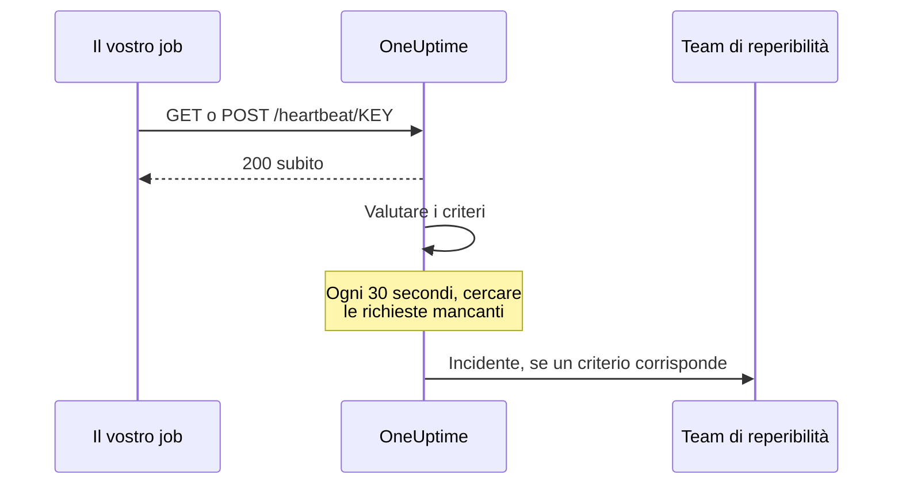

# Monitor richieste in arrivo

Un monitor di richieste in arrivo vi dà un URL a cui altri sistemi inviano richieste HTTP. OneUptime valuta ogni richiesta in base ai vostri criteri e può cambiare lo stato del monitor, dichiarare incidenti e avvisare chi è di turno.

Copre due compiti diversi:

- **Monitoraggio con heartbeat** — un cron job, un worker o un dispositivo chiama l'URL a intervalli regolari, e OneUptime apre un incidente quando le chiamate smettono di arrivare.
- **Ricevere avvisi da un altro sistema** — Prometheus Alertmanager, Grafana o qualsiasi cosa sappia inviare JSON in POST vi invia i propri avvisi, e OneUptime trasforma ciascuno in un incidente con escalation della reperibilità e risoluzione automatica al ripristino.

Entrambi usano lo stesso tipo di monitor. A distinguerli sono i criteri che configurate.

:::cards
- [Creare il monitor](#creare-un-monitor-di-richieste-in-arrivo): Ottenete un URL di heartbeat in pochi passaggi.
- [Inviare un heartbeat](#inviare-un-heartbeat): Da curl, cron, Node.js, Python o Go.
- [Avvisare quando le chiamate si fermano](#segnare-offline-se-non-arriva-un-heartbeat-in-10-minuti-un-interruttore-a-uomo-morto): Trasformate il monitor in un interruttore a uomo morto.
- [Ricevere avvisi](#ricevere-avvisi-da-un-altro-sistema): Un incidente per ogni avviso di Alertmanager o Grafana.
:::

## Come funziona

Niente controlla il vostro sistema dall'esterno: il vostro sistema chiama l'URL del monitor, OneUptime risponde subito e poi valuta la richiesta in base ai criteri del monitor. Un criterio che cerca richieste che hanno *smesso* di arrivare viene anche ricontrollato in background ogni 30 secondi, così anche il silenzio può aprire un incidente.



Usatelo per:

- Monitorare cron job e attività pianificate
- Verificare che i worker in background siano in esecuzione
- Monitorare servizi dietro firewall, irraggiungibili dall'esterno
- Ricevere avvisi da Prometheus Alertmanager, Grafana e altri sistemi di avviso
- Seguire i segnali di heartbeat di qualsiasi sistema in grado di usare HTTP

## Creare un monitor di richieste in arrivo

:::steps
### Iniziare un nuovo monitor

Andate in **Monitor** e fate clic su **Crea monitor**.

### Scegliere Incoming Request

In **Tipo di monitor**, scegliete **Incoming Request**: è uno dei tipi comuni in alto. Inserite un **Nome**, poi fate clic su **Avanti**.

### Rivedere i criteri

Il passaggio **Criteri** parte con [i criteri predefiniti](#cosa-ottenete-subito). Per un heartbeat, fate clic su **Aggiungi criteri** e date al nuovo criterio un filtro **Incoming Request** / **Not Recieved In Minutes** che porti lo stato a offline e dichiari un incidente, con **Risoluzione automatica dell'incidente** attiva. Poi trascinatelo in cima all'elenco: vedete [Criteri di esempio](#criteri-di-esempio) per capire perché.

### Creare il monitor

Fate clic su **Crea monitor**. Il monitor si apre sulla sua pagina **Panoramica**, dove la scheda **Send the first heartbeat** mostra l'**Heartbeat URL** con un pulsante di copia e un comando `curl` di esempio.

### Inviare la prima richiesta

Configurate il vostro servizio perché invii richieste a quell'URL (vedete [Inviare un heartbeat](#inviare-un-heartbeat)). Quando arriva la prima richiesta, la scheda lascia il posto alla cronologia del monitor, e una scheda **Heartbeat URL** mostra l'URL e quando è arrivata l'ultima richiesta.
:::

> [!NOTE]
> L'URL contiene la chiave segreta del monitor, quindi possono vederlo solo le persone che possono modificare i monitor. Potete ritrovarlo in qualsiasi momento nella pagina **Documentazione** del monitor, nella sezione **Configurazione** del suo menu laterale.

## L'URL della richiesta

Il vostro monitor ha un URL univoco in questo formato:

```text
https://oneuptime.com/heartbeat/YOUR_SECRET_KEY
```

Sostituite `https://oneuptime.com` con l'URL della vostra istanza di OneUptime se è self-hosted.

Inviate richieste **GET** o **POST** a questo URL. HEAD viene accettato e trattato come GET; PUT, PATCH e DELETE restituiscono 404. La chiave segreta nel percorso è l'unica credenziale: non serve alcuna intestazione né token. Le query string vengono ignorate: inviate ciò che i criteri devono leggere nel corpo o nelle intestazioni.

> [!WARNING]
> Chiunque conosca questo URL può segnare il monitor come sano, quindi trattatelo come un segreto. Se trapela, aprite la pagina **Impostazioni** del monitor e fate clic su **Reimposta la chiave segreta della richiesta in arrivo**, poi aggiornate ogni mittente. Ogni intestazione che inviate viene salvata sul monitor ed è visibile a chiunque possa leggerlo: non inviate chiavi API o token nelle intestazioni verso questo endpoint.

> [!IMPORTANT]
> OneUptime risponde subito `200` con un oggetto JSON vuoto (`{}`) ed elabora la richiesta in una coda. Quella risposta viene scritta prima di qualsiasi convalida, quindi un `200` **non** conferma che la richiesta sia stata accettata: anche una chiave segreta sbagliata, un monitor eliminato e un monitor disattivato restituiscono `200`. Controllate la cronologia del monitor per confermare che le richieste arrivino.

### Inviare un corpo della richiesta

Se volete raggiungere campi all'interno del corpo (`{{requestBody.status}}` in un titolo di incidente, un percorso JSON nel raggruppamento degli incidenti o un criterio con espressione JavaScript), inviate `Content-Type: application/json`. È il formato che questa documentazione presuppone ovunque. Il corpo deve essere un oggetto o un array JSON: un JSON malformato, o un valore isolato come `"error"`, viene rifiutato con un `500`.

| Tipo di contenuto | Cosa vedono criteri e modelli |
| --- | --- |
| `application/json` | Il JSON analizzato. |
| `application/x-www-form-urlencoded` | Il modulo analizzato. Le chiavi tra parentesi quadre si annidano (`alerts[0][status]=firing`), e ogni valore è una stringa. |
| Qualsiasi altro, o nessuno | Un corpo vuoto (`{}`), quindi ogni riferimento a `requestBody` non dà nulla. |

Sono accettati corpi fino a 50 MB; uno più grande viene rifiutato con un `413`. Non comprimete il corpo con `Content-Encoding: gzip`: non verrebbe salvato come JSON, e i percorsi al suo interno non si risolverebbero.

### Inviare un heartbeat

Ogni esempio invia una richiesta. Sostituite `YOUR_SECRET_KEY` con la chiave presa dall'URL del vostro monitor.

:::tabs
@tab curl
```bash
# Simple GET request
curl https://oneuptime.com/heartbeat/YOUR_SECRET_KEY

# POST request with a JSON body
curl -X POST https://oneuptime.com/heartbeat/YOUR_SECRET_KEY \
  -H "Content-Type: application/json" \
  -d '{"status": "healthy", "version": "1.2.3"}'
```
@tab Cron
```bash
# Send a heartbeat every 5 minutes
*/5 * * * * curl -fsS https://oneuptime.com/heartbeat/YOUR_SECRET_KEY > /dev/null

# Or ping only when the job succeeds, so a failed run counts as a missed heartbeat
0 2 * * * /usr/local/bin/backup.sh && curl -fsS https://oneuptime.com/heartbeat/YOUR_SECRET_KEY > /dev/null
```
@tab Node.js
```javascript title="heartbeat.mjs"
// Node.js 18 or later: fetch is built in. Run with `node heartbeat.mjs`.
const response = await fetch(
  "https://oneuptime.com/heartbeat/YOUR_SECRET_KEY",
  {
    method: "POST",
    headers: { "Content-Type": "application/json" },
    body: JSON.stringify({ status: "healthy", version: "1.2.3" }),
  },
);

console.log(response.status); // 200
```
@tab Python
```python title="heartbeat.py"
# Python 3, standard library only. Run with `python3 heartbeat.py`.
import json
import urllib.request

request = urllib.request.Request(
    "https://oneuptime.com/heartbeat/YOUR_SECRET_KEY",
    data=json.dumps({"status": "healthy", "version": "1.2.3"}).encode(),
    headers={"Content-Type": "application/json"},
    method="POST",
)

with urllib.request.urlopen(request, timeout=10) as response:
    print(response.status)  # 200
```
@tab Go
```go title="heartbeat.go"
// Run with `go run heartbeat.go`.
package main

import (
	"bytes"
	"fmt"
	"net/http"
)

func main() {
	body := []byte(`{"status": "healthy", "version": "1.2.3"}`)

	resp, err := http.Post(
		"https://oneuptime.com/heartbeat/YOUR_SECRET_KEY",
		"application/json",
		bytes.NewReader(body),
	)
	if err != nil {
		panic(err)
	}
	defer resp.Body.Close()

	fmt.Println(resp.StatusCode) // 200
}
```
@tab PowerShell
```powershell
# Windows PowerShell 5.1 or PowerShell 7
Invoke-RestMethod -Method Post `
  -Uri "https://oneuptime.com/heartbeat/YOUR_SECRET_KEY" `
  -ContentType "application/json" `
  -Body '{"status": "healthy", "version": "1.2.3"}'
```
:::

## Criteri di monitoraggio

Potete configurare criteri per stabilire quando il vostro servizio è considerato online, degradato oppure offline. Ogni filtro di un criterio ha un **Tipo di filtro** (cosa guardare), una **Condizione del filtro** (come confrontare) e un **Valore**.

### Cosa ottenete subito

Un nuovo monitor di richieste in arrivo viene creato con due criteri che leggono il corpo della richiesta:

| Criterio | Tipo di filtro | Condizione del filtro | Valore | Effetto |
| -------- | ------------ | ---------------- | ------- | -------------------------------------------- |
| Offline  | Corpo della Richiesta | Contiene | `error` | Segna il monitor offline, apre un incidente |
| Online   | Corpo della Richiesta | Not Contains | `error` | Segna il monitor online |

È adatto al caso comune in cui il mittente riporta il proprio stato nel payload: una richiesta il cui corpo menziona `error` porta il monitor offline, e la richiesta successiva senza quella parola lo riporta online e risolve l'incidente. Una richiesta senza alcun corpo conta come «non contiene `error`», quindi una semplice chiamata di heartbeat mantiene il monitor online.

Sostituite il valore con ciò che il vostro mittente emette davvero (`"status":"firing"`, `FAILED` e così via): la corrispondenza è una ricerca di sottostringa sensibile a maiuscole e minuscole su tutto il corpo, chiavi comprese, quindi anche `{"error":null}` corrisponde a `error`.

> [!NOTE]
> Questi criteri predefiniti **non** sono un interruttore a uomo morto: niente qui scatta quando le richieste smettono di arrivare. Se volete essere avvisati del silenzio, aggiungete un criterio **Incoming Request** / **Not Recieved In Minutes** come descritto più sotto.

### Tipi di filtro disponibili

| Tipo di filtro | Controlla | Note |
| --------------------- | ------------------------------------------------------ | -------------------------------------------------------------------------------------------- |
| Incoming Request | Se è stata ricevuta una richiesta in una finestra di tempo | L'unico controllo che può scattare quando non arriva nulla |
| Corpo della Richiesta | Il corpo della richiesta | Corrispondenza di sottostringa. I corpi oggetto vengono confrontati come JSON compatto |
| Request Header | I nomi delle intestazioni della richiesta | Corrispondenza esatta con un nome di intestazione intero, senza distinguere maiuscole e minuscole |
| Request Header Value | I valori delle intestazioni della richiesta | Corrispondenza esatta con un valore di intestazione intero, senza distinguere maiuscole e minuscole |
| JavaScript Expression | Qualsiasi espressione su `requestBody` e `requestHeaders` | L'opzione più flessibile: vedete [Espressioni JavaScript](/docs/monitor/javascript-expression) |

### Condizioni del filtro

Ogni tipo di filtro offre le proprie condizioni:

| Tipo di filtro | Condizioni |
| --- | --- |
| **Incoming Request** | **Recieved In Minutes**: è stata ricevuta una richiesta entro il numero di minuti indicato. **Not Recieved In Minutes**: non è stata ricevuta alcuna richiesta entro il numero di minuti indicato. (La dashboard le scrive così.) |
| **Corpo della Richiesta**, **Request Header**, **Request Header Value** | **Contiene** e **Not Contains** |
| **JavaScript Expression** | **Evaluates To True** |

> [!NOTE]
> Nomi e valori delle intestazioni vengono confrontati in minuscolo, con il nome o il valore intero, non con una sottostringa: `application/json` non corrisponde a `application/json; charset=utf-8`. Solo **Corpo della Richiesta** cerca sottostringhe. Vengono salvate anche le intestazioni aggiunte dal vostro proxy o dal bilanciatore di carico di OneUptime (`x-forwarded-for`, `x-real-ip`).

I corpi oggetto vengono confrontati come JSON compatto senza spazi, quindi un filtro **Corpo della Richiesta** / **Contiene** va scritto `"status":"firing"`: copiare `"status": "firing"` da un payload formattato non corrisponderà mai.

### Criteri di esempio

#### Segnare offline se non arriva un heartbeat in 10 minuti (un interruttore a uomo morto)

| Campo | Valore |
| --- | --- |
| **Tipo di filtro** | Incoming Request |
| **Condizione del filtro** | Not Recieved In Minutes |
| **Valore** | `10` |

#### Segnare degradato in base al contenuto del corpo della richiesta

| Campo | Valore |
| --- | --- |
| **Tipo di filtro** | Corpo della Richiesta |
| **Condizione del filtro** | Contiene |
| **Valore** | `"status":"degraded"` |

> [!IMPORTANT]
> Mettete l'interruttore a uomo morto **sopra** i criteri predefiniti. I criteri vengono controllati dall'alto, e decide il primo che corrisponde. Il controllo in background rilegge l'ultima richiesta, quindi il criterio online predefinito ("Request Body Not Contains `error`") continua a corrispondervi, e un criterio sotto di esso non arriva mai al suo turno. **Aggiungi criteri** aggiunge un criterio in fondo: trascinatelo in alto.

> [!WARNING]
> Un monitor viene rivalutato in background solo se almeno uno dei suoi criteri controlla **Incoming Request**. Un monitor i cui criteri controllano solo il corpo della richiesta, Request Header o un'espressione JavaScript viene valutato quando arriva una richiesta e in nessun altro momento, quindi non può mai andare offline da solo. Se volete un allarme per heartbeat mancante, vi serve un criterio **Incoming Request**.

Il controllo in background conta minuti interi e scatta quando è passato *più* del valore: "Not Recieved In Minutes: 10" scatta circa 11 minuti dopo l'ultima richiesta (il controllo gira ogni 30 secondi). Un monitor che non ha mai ricevuto una richiesta viene trattato come se la sua ora di creazione fosse l'ultima richiesta, quindi lo stesso criterio su un monitor appena creato scatta circa 11 minuti dopo la creazione, anche se il mittente non è mai stato collegato. Contano solo i minuti in cui OneUptime stava ricevendo: i minuti in cui OneUptime stesso si riavvia, viene aggiornato o recupera il ritardo non contano, come spiega [Quando OneUptime non riceve dati](/docs/monitor/when-oneuptime-is-not-receiving).

## Ricevere avvisi da un altro sistema

Alertmanager, Grafana e strumenti simili inviano in POST un documento JSON che descrive uno o più avvisi. Per impostazione predefinita un criterio apre **un** incidente, quindi un payload con cinque avvisi produrrebbe un solo incidente. Il raggruppamento degli incidenti cambia le cose: estrae un valore dal payload e apre un **incidente separato per ogni valore distinto**, e possono essere tutti aperti contemporaneamente.

```mermaid title="Raggruppamento degli incidenti: un incidente per avviso nel payload"
flowchart TB
    payload["Payload del webhook"] --> keys["Una chiave per avviso"]
    keys --> state{"Avviso risolto?"}
    state -->|No| open["Aprire o mantenere il suo incidente"]
    state -->|Sì| resolve["Risolvere il suo incidente"]
```

### Attivare il raggruppamento degli incidenti

:::steps
1. Aprite il criterio ed espandete **Impostazioni**.
2. Attivate **Group incidents and alerts by a payload field**.
3. Compilate **Open a separate incident for each…**. Perché ogni incidente si risolva da solo, compilate anche il campo e il valore sotto **Auto-resolve each incident when…** (più sotto). Poi salvate il monitor.
:::

| Campo | Esempio | Cosa fa |
| ---------------------------------- | ---------------------------------------- | ---------------------------------------------------------------------- |
| Open a separate incident for each… | `requestBody.alerts[*].labels.alertname` | Il percorso i cui valori distinti separano gli incidenti |
| Field that signals recovery | `requestBody.alerts[*].status` | Il percorso controllato per decidere che un avviso si è ripristinato |
| Value that means recovered | `resolved` | Il valore esatto che segnala il ripristino |
| Max incidents per request | `100` (predefinito) | Limite di sicurezza, perché un campo con molti valori non possa aprire incidenti senza limiti |

### Sintassi dei percorsi

I percorsi devono iniziare con il prefisso letterale `requestBody.`. Un percorso senza di esso, come `alerts[*].labels.alertname`, non corrisponde a nulla, senza segnalarlo. L'involucro `{{ }}` è facoltativo: `requestBody.status` e `{{requestBody.status}}` si comportano allo stesso modo.

- `[*]` si espande su un array: un incidente per ogni valore **distinto**. Due elementi che danno lo stesso valore confluiscono in un solo incidente, il cui stato (attivo/risolto) viene preso dal **first** elemento corrispondente. **Solo il primo `[*]` di un percorso è un carattere jolly**; `requestBody.groups[*].alerts[*].name` non corrisponde a nulla.
- `[0]` e `[last]` selezionano un singolo elemento, e possono seguire un `[*]`.
- I valori oggetto e array, le stringhe vuote e i valori nulli vengono saltati. `0` e `false` sono chiavi valide.
- Il corpo deve essere un oggetto JSON; un payload il cui livello superiore è un array non viene raggruppato.

### La risoluzione è guidata dagli eventi

Un webhook descrive solo ciò che c'è in quel payload, quindi OneUptime non risolve mai un incidente perché la sua chiave ha smesso di comparire. Un incidente viene risolto solo quando un payload dice esplicitamente che quella chiave si è ripristinata. Devono valere entrambe le cose:

1. **Field that signals recovery** e **Value that means recovered** sono impostati e corrispondono al payload. Il confronto è esatto e sensibile a maiuscole e minuscole: `Resolved` non corrisponde a `resolved`.
2. L'incidente del criterio ha **Risoluzione automatica dell'incidente** attiva, sotto **Altri campi** nel modulo dell'incidente. Senza questa opzione, gli eventi di ripristino corrispondenti vengono ignorati e gli incidenti restano aperti. (Lo stesso vale per gli avvisi e **Risoluzione automatica dell'avviso**.) Il criterio offline predefinito la ha attiva fin dall'inizio; un incidente che aggiungete voi a un criterio parte con l'opzione disattivata.

**Max incidents per request** limita l'estrazione, non solo la creazione. Anche per il ripristino le chiavi oltre il limite sono invisibili, quindi in un payload con più chiavi distinte del limite, un avviso che riporta `resolved` oltre quel limite non chiuderà il suo incidente.

> [!NOTE]
> Quando un monitor riceve richieste più in fretta di quanto OneUptime riesca a valutarle, valuta la più recente e salta quelle intermedie, quindi una raffica di webhook può lasciare non valutato un avviso attivo o uno risolto. Su un server self-hosted, impostare `INCOMING_REQUEST_INGEST_COALESCE_ENABLED=false` nell'ambiente dell'app OneUptime fa valutare ogni richiesta da sola.

> [!WARNING]
> Se **Field that signals recovery** contiene `[*]` ma **Open a separate incident for each…** no, non verrà mai risolto nulla. Usate `[*]` in entrambi, o in nessuno dei due. Un percorso di ripristino senza `[*]` viene valutato sull'intero payload, quindi un `status: resolved` a livello di payload risolve ogni chiave di quel payload, compresi gli avvisi il cui stato è ancora attivo.

### Dare un nome agli incidenti

La chiave di raggruppamento è esposta ai modelli di incidente e di avviso come una variabile che prende il nome dall'**ultimo segmento del percorso**:

| Percorso | Variabile |
| ---------------------------------------- | ----------------- |
| `requestBody.alerts[*].labels.alertname` | `{{alertname}}`   |
| `requestBody.alerts[*].fingerprint`      | `{{fingerprint}}` |
| `requestBody.commonLabels.severity`      | `{{severity}}`    |

Accanto è disponibile l'intero payload, quindi funzionano sia un titolo di incidente `{{alertname}}` sia una descrizione che fa riferimento a `{{requestBody.commonAnnotations.summary}}`. Consultate [Modelli di incidenti e avvisi](/docs/monitor/incident-alert-templating).

> [!WARNING]
> Il nome della variabile fa parte dell'identità che OneUptime usa per abbinare un evento di ripristino a un incidente aperto. Cambiare il percorso di raggruppamento con uno dall'ultimo segmento diverso lascia orfani tutti gli incidenti aperti con il percorso precedente: non si possono più risolvere automaticamente e vanno chiusi a mano.

`[*]` funziona **solo** nei due campi dei percorsi di raggruppamento. Altrove non si risolve, e un segnaposto non risolto viene stampato **così com'è** invece di essere svuotato: un titolo `{{requestBody.alerts[*].labels.alertname}}` appare con le parentesi graffe. Un titolo `{{requestBody.alerts[0].annotations.summary}}` si risolve, ma legge sempre il primo avviso del payload, non quello per cui è stato aperto questo incidente. Preferite la variabile di raggruppamento più i campi condivisi `commonAnnotations` del payload.

### Esempio completo

Per una configurazione completa di Alertmanager, consultate [Prometheus Alertmanager](/docs/integrations/prometheus-alertmanager). Per Grafana, consultate [Grafana](/docs/integrations/grafana).

## Buone pratiche

1. **Impostate bene la finestra di tempo**: se il vostro cron job gira ogni 5 minuti, impostate la soglia "Not Recieved In Minutes" a 10–15 minuti per assorbire ritardi occasionali, e mettete quel criterio per primo.
2. **Includete dati significativi**: inviate informazioni di stato nel corpo della richiesta, così potete impostare criteri dettagliati.
3. **Usate POST con `Content-Type: application/json`**: tutto ciò che legge dentro il corpo dipende da questo.
4. **Non mescolate i due compiti su un monitor**: un monitor che riceve avvisi guidati dagli eventi non ha una cadenza regolare, quindi un criterio "Not Recieved In Minutes" su di esso oscillerebbe. Usate un monitor separato per l'interruttore a uomo morto.
5. **Monitorate il monitor**: assicuratevi che il servizio che invia le richieste gestisca bene gli errori, così le richieste fallite non passano inosservate.

## Risoluzione dei problemi

:::details Il mittente riceve un 200, ma sul monitor non compare nulla
Il `200` viene inviato prima che la richiesta sia convalidata, quindi non dimostra che sia stata accettata. Controllate che la chiave segreta nell'URL corrisponda all'**Heartbeat URL** del monitor, e che il monitor non sia disattivato. Poi guardate la cronologia del monitor per vedere se le richieste arrivano.
:::

:::details Il monitor non va mai offline quando gli heartbeat si fermano
Solo un criterio **Incoming Request** (**Not Recieved In Minutes**) può accorgersi del silenzio. Aggiungetene uno se manca, e trascinatelo sopra i criteri predefiniti: il criterio online predefinito corrisponde all'ultima richiesta a ogni controllo in background, e decide il primo criterio che corrisponde.
:::

:::details Un filtro Corpo della Richiesta non corrisponde mai
Inviate `Content-Type: application/json`, e scrivete il valore come JSON compatto: `"status":"firing"`, senza spazio dopo i due punti. Senza un tipo di contenuto JSON o di modulo, il corpo non viene analizzato.
:::

:::details Un filtro Request Header non corrisponde mai
Nomi e valori delle intestazioni vengono confrontati per intero. Indicate il valore completo, come `application/json; charset=utf-8`, invece di una sua parte.
:::

:::details Il mittente riceve un 500
La richiesta dichiara `Content-Type: application/json` ma il suo corpo non è un oggetto né un array JSON. Inviate JSON valido, oppure un tipo di contenuto diverso.
:::

## Passi successivi

:::cards
- [Prometheus Alertmanager](/docs/integrations/prometheus-alertmanager): Una configurazione completa per gli avvisi in arrivo.
- [Grafana](/docs/integrations/grafana): La stessa cosa, per gli avvisi di Grafana.
- [Modelli di incidenti e avvisi](/docs/monitor/incident-alert-templating): Tutte le variabili disponibili in titoli e descrizioni.
- [Espressioni JavaScript](/docs/monitor/javascript-expression): Sintassi delle espressioni e regole sulle virgolette.
:::
