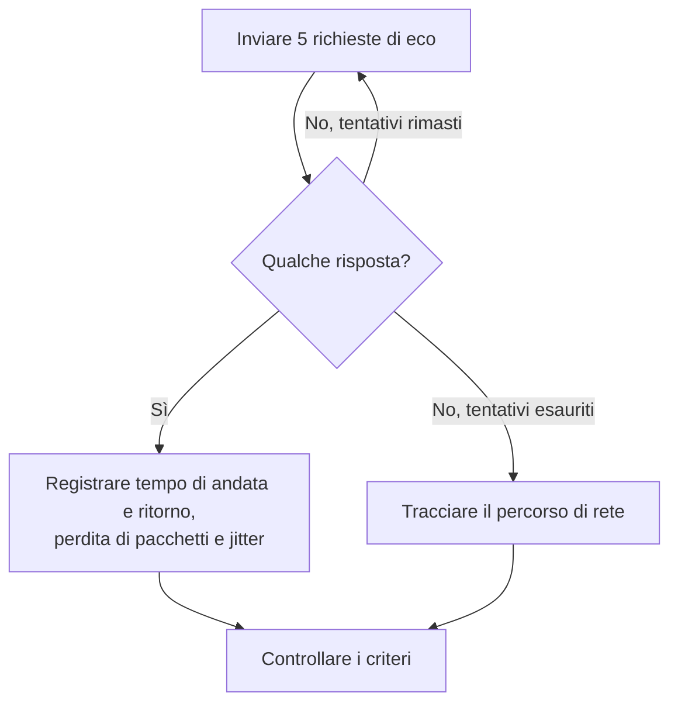

# Monitor IP

Un monitor IP controlla che un indirizzo IPv4 o IPv6 risponda al ping (richieste di eco ICMP) e misura il tempo di andata e ritorno, la perdita di pacchetti e il jitter. Usatelo per l'infrastruttura che conoscete per indirizzo, come un gateway, l'IP virtuale di un bilanciatore di carico o un server con indirizzo fisso.

:::cards
- [Creare il monitor](#creare-un-monitor-ip): Sei passaggi nella dashboard.
- [Opzioni di configurazione](#opzioni-di-configurazione): L'indirizzo, il timeout e i nuovi tentativi.
- [Criteri di monitoraggio](#criteri-di-monitoraggio): Raggiungibilità, latenza, perdita di pacchetti e jitter.
- [Risoluzione dei problemi](#risoluzione-dei-problemi): Quando l'indirizzo è attivo ma il monitor lo dà offline.
:::

## Come funziona

Un monitor IP esegue lo stesso controllo di un [monitor ping](/docs/monitor/ping-monitor). A ogni controllo una sonda invia cinque richieste di eco all'indirizzo. Se torna almeno una risposta, l'indirizzo è online, e la sonda registra il tempo medio di andata e ritorno come tempo di risposta, insieme alla perdita di pacchetti, al jitter e alle risposte più veloce e più lenta. Se non torna alcuna risposta, la sonda riprova, fino al numero di nuovi tentativi che consentite. OneUptime passa poi il risultato attraverso i criteri del monitor.

Quando un controllo fallisce, la sonda traccia anche il percorso verso l'indirizzo, e allega quanto trovato al risultato come **Network Path at Time of Failure**, così potete vedere dove il percorso si è interrotto.

Quale usare:

| Monitor | Accetta | Usatelo quando |
| --- | --- | --- |
| **IP** | Solo un indirizzo IP | È l'indirizzo stesso che sorvegliate, e non cambia. |
| [Ping](/docs/monitor/ping-monitor) | Un nome host o un indirizzo IP | Conoscete l'host per nome; il nome viene risolto a ogni controllo, quindi il monitor segue i cambiamenti DNS. |

> [!NOTE]
> Alcuni provider di hosting bloccano ICMP sulle macchine su cui gira una sonda. Una sonda che non può inviare ping del tutto controlla invece la porta TCP `80` dell'indirizzo, così il monitor dice comunque se è raggiungibile. In quel caso perdita di pacchetti e jitter non vengono misurati.

Una sonda che ha perso la propria connessione di rete non riporta alcun risultato, quindi non può segnare il vostro indirizzo come offline.

## Prima di iniziare

- **Un ruolo che può creare monitor**: Project Owner, Project Admin, Project Member, Monitor Admin o Monitor Member, oppure un ruolo personalizzato con il permesso Create Monitor.
- **Una sonda che raggiunga l'indirizzo**, con ICMP consentito lungo il percorso. Le sonde predefinite del vostro progetto vengono scelte per ogni nuovo monitor. Se un firewall lo protegge, consentite le richieste di eco ICMP dagli [indirizzi IP delle sonde di OneUptime Cloud](/docs/configuration/ip-addresses). Un indirizzo privato ha bisogno di una [sonda personalizzata](/docs/probe/custom-probe) su quella rete, e un indirizzo IPv6 di una sonda con connettività IPv6.

## Creare un monitor IP

:::steps
### Iniziare un nuovo monitor

Andate in **Monitor** e fate clic su **Crea monitor**. In **Tipo di monitor**, fate clic su **Altri tipi di monitor** e scegliete **IP** sotto **Basic Monitoring**.

### Dargli un nome

Inserite un **Nome**, come `Office gateway`, poi fate clic su **Avanti**.

### Inserire l'indirizzo

In **Indirizzo IP**, inserite l'indirizzo IPv4 o IPv6 da controllare, come `192.168.1.1` o `2001:db8::1`. Un nome host non viene accettato: il campo mostra un errore. Per pingare un host per nome, usate un [monitor ping](/docs/monitor/ping-monitor).

### Testarlo

Fate clic su **Testa il monitor**, scegliete una sonda in **Seleziona sonda** e fate clic su **Esegui test**. **Risultato del test del monitor** mostra i tempi di andata e ritorno e la perdita di pacchetti rilevati dalla sonda.

### Rivedere i criteri

**Criteri del monitor** parte dai [criteri predefiniti](#criteri-predefiniti): offline quando l'indirizzo non risponde, online quando risponde. Modificateli se serve, poi fate clic su **Avanti**.

### Scegliere le sonde e creare

Mantenete o cambiate le **Sonde** e l'**Intervallo di monitoraggio** (parte da **Ogni 5 minuti**), poi fate clic su **Crea monitor**. Si apre la pagina del monitor.
:::

## Opzioni di configurazione

| Campo | Predefinito | Cosa inserire |
| --- | --- | --- |
| **Indirizzo IP** | Nessuno | Un indirizzo IPv4, come `192.168.1.1`, o un indirizzo IPv6, come `2001:db8::1`. Le parentesi quadre attorno a un indirizzo IPv6 vengono rimosse. |
| **Timeout della richiesta (secondi)** (sotto **Altri campi**) | `60` | Quanto attendere una risposta a ogni tentativo. Il massimo è 60 secondi. |
| **Tentativi in caso di errore** (sotto **Altri campi**) | Il predefinito della sonda, di solito `3` | Quante volte ritentare un tentativo fallito. Il massimo è 3. |

**Tentativi in caso di errore** conta i nuovi tentativi _dopo_ il primo, quindi `0` esegue il controllo una volta e `2` fino a tre volte. Se lasciato vuoto, usa il predefinito della sonda: 3, a meno che `PROBE_MONITOR_RETRY_LIMIT` della sonda non dica altro. Ogni errore viene ritentato, timeout compresi, con una pausa di un secondo tra i tentativi. Anche un controllo riuscito le cui risposte hanno impiegato più di 10 secondi viene ricontrollato.

## Criteri di monitoraggio

I criteri decidono quando l'indirizzo conta come online, degradato o offline, e se ciò dichiara un incidente o crea un avviso. Ogni criterio controlla uno o più filtri:

| Filtro | Condizioni | Cosa controlla |
| --- | --- | --- |
| **Is Online** | **Vero**, **Falso** | Se almeno una richiesta di eco ha ricevuto risposta. |
| **Tempo di risposta (in ms)** | **Greater Than**, **Less Than**, **Greater Than Or Equal To**, **Less Than Or Equal To** | Il tempo medio di andata e ritorno delle risposte. |
| **Packet Loss (in %)** | **Greater Than**, **Less Than**, **Greater Than Or Equal To**, **Less Than Or Equal To** | La quota delle cinque richieste di eco rimaste senza risposta. |
| **Jitter (in ms)** | **Greater Than**, **Less Than**, **Greater Than Or Equal To**, **Less Than Or Equal To** | La deviazione standard dei tempi di andata e ritorno tra i pacchetti inviati in un controllo. |
| **Is Request Timeout** | **Vero**, **Falso** | Se il ping è andato in timeout a ogni tentativo. |

Con due o più filtri, **Condizione di corrispondenza** decide se devono corrispondere **Tutti** o basta **Qualsiasi** filtro. Le **Azioni** di un criterio decidono cosa fa: cambiare lo stato del monitor, creare un avviso, dichiarare un incidente, o più di queste cose.

### Criteri predefiniti

Un nuovo monitor IP parte con due criteri:

- **Offline** — l'indirizzo non risponde a nessuna delle richieste di eco, o non è affatto raggiungibile, dopo tutti i nuovi tentativi. Il monitor viene segnato **Offline** e viene creato un incidente chiamato «_monitor name_ is offline». L'incidente si risolve da solo quando l'indirizzo risponde di nuovo.
- **Online** — l'indirizzo risponde. Il monitor viene segnato **Operativo**.

I criteri vengono controllati dall'alto verso il basso, e il primo che corrisponde decide cosa succede. Quando nessuno corrisponde, il monitor mostra il suo stato predefinito: **Operativo**, a meno che non ne scegliate un altro sotto **Altri campi**, sotto i criteri.

### Valutare su un periodo di tempo

**Valuta questo criterio su un periodo di tempo** è una casella sotto un filtro, offerta per **Is Online**, **Tempo di risposta (in ms)**, **Packet Loss (in %)** e **Jitter (in ms)**. Attivatela per valutare una finestra di controlli passati invece dell'ultimo: scegliete un'aggregazione in **Valuta** e una finestra, da 2 a 60 minuti, in **Per gli ultimi (in minuti)**.

| Aggregazione | Corrisponde quando |
| --- | --- |
| **Media**, **Somma**, **Maximum Value**, **Minimum Value** | Quel valore, sulla finestra, soddisfa la condizione. Solo filtri numerici. |
| **All Values** | Ogni controllo nella finestra soddisfa la condizione. |
| **Any Value** | Almeno un controllo nella finestra soddisfa la condizione. |

**All Values** corrisponde solo quando la finestra è davvero coperta da dati. Un monitor appena creato, o uno i cui controlli hanno smesso di essere registrati, non ha abbastanza storico per dire qualcosa sugli ultimi N minuti, quindi il criterio attende invece di corrispondere sull'unica lettura che ha. **Any Value** è l'impostazione per «avvisami appena un singolo controllo supera la soglia» e scatta comunque subito.

**Se nessun dato** decide cosa succede finché la finestra non può sostenere il criterio:

| Opzione | Cosa succede | Da usare per |
| --- | --- | --- |
| **Ignore** (predefinito) | Il criterio non corrisponde. | Avvisi a soglia ordinari. |
| **Trigger** | I dati mancanti contano come il problema. | Controlli in cui il silenzio è di per sé un guasto. |
| **Treat As Zero** | La finestra viene confrontata come un singolo zero. | Contatori in cui nessun evento significa davvero zero. |

### Esempi di criteri

| Obiettivo | Filtro | Condizione | Valore |
| --- | --- | --- | --- |
| Offline quando l'indirizzo non è raggiungibile | **Is Online** | **Falso** | — |
| Avvisare quando la latenza è alta | **Tempo di risposta (in ms)** | **Greater Than** | `100` |
| Segnare l'indirizzo degradato su un collegamento con perdite | **Packet Loss (in %)** | **Greater Than** | `20` |
| Avvisare in caso di connessione instabile | **Jitter (in ms)** | **Greater Than** | `30` |

## Risoluzione dei problemi

:::details L'indirizzo è attivo, ma il monitor lo dà offline
L'indirizzo, o un firewall davanti a esso, non risponde alle richieste di eco ICMP della sonda. Consentite le richieste di eco ICMP dalle sonde, oppure sorvegliate invece un servizio su quell'indirizzo con un [monitor porta](/docs/monitor/port-monitor). **Network Path at Time of Failure**, sul controllo fallito, mostra fin dove è arrivato il percorso.
:::

:::details Un indirizzo IPv6 fallisce sempre
La sonda che ha eseguito il controllo non ha connettività IPv6; l'errore lo dice. Eseguite il monitor su una sonda con IPv6: vedete [Sonde personalizzate](/docs/probe/custom-probe).
:::

:::details Perdita di pacchetti e jitter sono vuoti
La sonda che ha eseguito il controllo non può inviare ping, quindi ha controllato invece la porta TCP `80`, che non misura né l'una né l'altro. Eseguite il monitor su una sonda autorizzata a inviare ICMP.
:::

## Passaggi successivi

:::cards
- [Monitor ping](/docs/monitor/ping-monitor): Pingare un host per nome, seguendo i cambiamenti DNS.
- [Monitor porta](/docs/monitor/port-monitor): Controllare un servizio sull'indirizzo, non solo l'indirizzo.
- [Sonde personalizzate](/docs/probe/custom-probe): Controllare indirizzi privati e IPv6 dalla vostra rete.
- [Incidenti](/docs/incidents/index): Cosa succede dopo che il monitor ne dichiara uno.
:::
