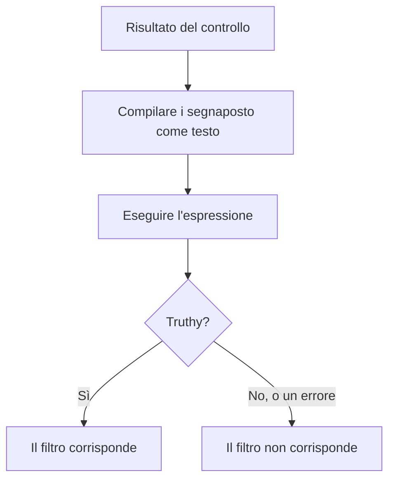

# Espressioni JavaScript

Un filtro di criterio **JavaScript Expression** decide se il criterio di un monitor è soddisfatto con una riga di JavaScript invece di un confronto fisso. Usatelo quando i filtri integrati non riescono a esprimere la condizione — un campo annidato in una risposta JSON, due valori confrontati tra loro, o più controlli combinati con `&&` e `||`.

:::cards
- [Come funziona](#come-funziona): I segnaposto vengono compilati, poi l'espressione viene eseguita.
- [Variabili](#variabili-per-tipo-di-monitor): Cosa vi dà ogni tipo di monitor.
- [Esempi](#esempi): Espressioni per API, richieste in arrivo e database.
- [Regole sulle virgolette](#regole-sulle-virgolette): L'errore che fanno quasi tutti.
:::

## Come funziona

Prima che l'espressione venga eseguita, ogni segnaposto `{{variable}}` al suo interno viene sostituito con il valore dell'ultimo controllo del monitor — come testo semplice. Il risultato viene poi eseguito come JavaScript. Se restituisce un valore vero (truthy), il filtro corrisponde; qualsiasi altra cosa, compreso un errore, significa che non corrisponde.



Poiché i segnaposto vengono sostituiti come testo, `{{responseBody.item}}` diventa il valore grezzo. Una stringa deve stare tra virgolette per essere una stringa JavaScript; un numero o un booleano no — vedete [Regole sulle virgolette](#regole-sulle-virgolette). Le espressioni vengono eseguite sul server OneUptime, in una sandbox isolata.

## Aggiungere un filtro JavaScript Expression

:::steps
### Aprire i criteri

Sul monitor, aprite **Configurazione → Criteri** e fate clic su **Modifica: Criteri di monitoraggio**, oppure usate il passaggio **Criteri** di **Crea monitor**. Lavorate nel criterio che volete cambiare, oppure fate clic su **Aggiungi criteri** per uno nuovo.

### Aggiungere un filtro

In **Filtri**, fate clic su **Aggiungi filtro** e impostate il suo **Tipo di filtro** su **JavaScript Expression**. La **Condizione del filtro** è **Evaluates To True**.

### Scrivere l'espressione

Inserite l'espressione in **Valore**, usando le [variabili del tipo di monitor](#variabili-per-tipo-di-monitor). Il link sotto il filtro, **Read documentation for using JavaScript expressions here.**, apre questa pagina.

### Salvare

Salvate il monitor. Il filtro viene valutato al controllo successivo del monitor.
:::

## Variabili per tipo di monitor

Le espressioni JavaScript sono offerte per i monitor di tipo Sito web, API, Incoming Request, Incoming Email, SQL Query e Database Health.

### Monitor di siti web e API

| Variabile | Descrizione | Tipo |
| --- | --- | --- |
| `responseBody` | Il corpo della risposta. Se il corpo della risposta è JSON viene analizzato; altrimenti, come per HTML o XML, è una stringa. | `string` o `JSON` |
| `responseHeaders` | Le intestazioni della risposta, con i nomi in minuscolo. | `Dictionary<string>` |
| `responseStatusCode` | Il codice di stato della risposta. | `number` |
| `responseTimeInMs` | Il tempo di risposta in millisecondi. | `number` |
| `isOnline` | Se il monitor considera la risposta online. | `boolean` |

### Monitor delle richieste in arrivo

| Variabile | Descrizione | Tipo |
| --- | --- | --- |
| `requestBody` | Il corpo della richiesta. | `string` o `JSON` |
| `requestHeaders` | Le intestazioni della richiesta, con i nomi in minuscolo. | `Dictionary<string>` |

### Monitor delle query SQL

| Variabile | Descrizione | Tipo |
| --- | --- | --- |
| `rowCount` | Il numero di righe restituite dalla query. | `number` |
| `scalarValue` | La prima colonna della prima riga. | qualsiasi |
| `firstRow` | La prima riga, come coppie colonna/valore. | `JSON` |
| `executionTimeInMs` | Quanto è durata la query, in millisecondi. | `number` |
| `queryError` | L'errore della query, se c'è stato. | `string` |
| `isOnline` | Se il database era raggiungibile e la query è riuscita. | `boolean` |

### Monitor dello stato dei database

`isOnline`, `engineVersion`, `connectionError`, `collectedGroups`, `unavailableGroups` e `metrics`. Vedete [Variabili delle espressioni JavaScript](/docs/monitor/database-health-monitor#variabili-delle-espressioni-javascript) nella pagina del monitor dello stato dei database.

### Monitor delle email in arrivo

Il filtro è offerto, ma nessun campo email gli è collegato: un'espressione non può leggere l'oggetto, il mittente, il corpo o il destinatario. Usate invece i tipi di filtro per le email — vedete [Monitor email in arrivo](/docs/monitor/incoming-email-monitor#tipi-di-filtro-disponibili).

## Esempi

Ogni riga qui sotto è un'espressione completa. Per un corpo di risposta JSON come questo:

```json
{
  "item": "hello",
  "count": 3,
  "items": [{ "name": "hello" }]
}
```

| Espressione | Corrisponde quando |
| --- | --- |
| `"{{responseBody.item}}" === "hello"` | Il campo `item` vale `hello`. |
| `{{responseBody.count}} > 2` | Il campo `count` è maggiore di 2. |
| `"{{responseBody.items[0].name}}" === "hello"` | Il primo elemento di `items` ha il nome `hello`. |
| `{{responseStatusCode}} === 200 && {{responseTimeInMs}} < 500` | Lo stato è 200 e la risposta ha impiegato meno di mezzo secondo. |
| `/hel+o/.test("{{responseBody.item}}")` | Il campo `item` corrisponde a un'espressione regolare. |
| `"{{responseHeaders.content-type}}".startsWith("application/json")` | La risposta è JSON. I nomi delle intestazioni sono in minuscolo. |

Combinate le condizioni con `&&` e `||`, e raggruppatele con le parentesi:

```javascript
({{responseStatusCode}} === 200 || {{responseStatusCode}} === 204) && {{responseTimeInMs}} < 1000
```

Per un monitor delle richieste in arrivo che riceve `{"status": "degraded", "region": "eu"}` come `Content-Type: application/json`:

```javascript
"{{requestBody.status}}" === "degraded" && "{{requestBody.region}}" === "eu"
```

Per un monitor delle query SQL la cui query restituisce un conteggio, avvisare su un conteggio alto o una query lenta:

```javascript
{{scalarValue}} > 50 || {{executionTimeInMs}} > 2000
```

Per un monitor dello stato dei database, leggete una metrica indicizzando l'intero oggetto `metrics` — i nomi delle serie contengono punti, quindi non possono stare dentro le parentesi graffe:

```javascript
{{metrics}}['oneuptime.monitor.database.connections.used.percent'] > 90
```

## Regole sulle virgolette

`{{var}}` viene sostituito con il valore, come testo. Per confrontare una stringa, mettetela tra virgolette, come in `"{{responseBody.item}}" === "hello"`; per confrontare un numero, lasciatelo senza, come in `{{responseStatusCode}} === 200`.

| Tipo di valore | Come scriverlo | Esempio |
| --- | --- | --- |
| Stringa | Tra virgolette | `"{{responseBody.status}}" === "ok"` |
| Numero | Senza virgolette | `{{responseTimeInMs}} < 500` |
| Booleano | Senza virgolette | `{{isOnline}} === true` |
| Oggetto o array | Senza virgolette, poi indicizzato | `{{responseHeaders}}['content-type']` |

Tre cose a cui fare attenzione:

- **Un segnaposto da solo tra virgolette è sempre vero.** `"{{responseBody.healthy}}"` è la stringa non vuota `"false"` quando il campo è `false`. Confrontatelo: `"{{responseBody.healthy}}" === "true"`, oppure lasciatelo senza virgolette: `{{responseBody.healthy}} === true`.
- **I valori non vengono sottoposti a escape.** Un valore che contiene una virgoletta doppia o un a capo termina la stringa troppo presto, e l'espressione fallisce. Per cercare testo in una pagina HTML, usate invece il filtro **Corpo della Risposta**.
- **Un percorso mancante resta com'è scritto.** Se il controllo non ha quel campo, `{{responseBody.item}}` resta così com'è nell'espressione, il che di solito è un errore di sintassi — quindi il filtro non corrisponde.

## Limiti

Un'espressione ha 5 secondi per essere eseguita. Una che impiega di più, o che genera un errore, non corrisponde, e l'errore viene scritto nel log del server OneUptime.

## Risoluzione dei problemi

:::details L'espressione non corrisponde mai
Controllate prima le virgolette: un segnaposto di stringa senza virgolette diventa una parola isolata, il che è un errore di sintassi, e un errore non corrisponde mai. Poi controllate che il percorso esista nel risultato del controllo — un segnaposto per un percorso che non c'è non viene compilato.
:::

:::details L'espressione corrisponde sempre
Un segnaposto da solo tra virgolette è una stringa non vuota, che è sempre truthy. Confrontatelo con un valore.
:::

## Passaggi successivi

:::cards
- [Modelli di incidenti e avvisi](/docs/monitor/incident-alert-templating): Usare gli stessi segnaposto nei titoli e nelle descrizioni degli incidenti.
- [Monitor API](/docs/monitor/api-monitor): Controllare un endpoint HTTP e la sua risposta.
- [Monitor richieste in arrivo](/docs/monitor/incoming-request-monitor): Valutare le richieste che altri sistemi vi inviano.
:::
