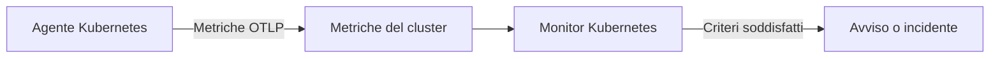

# Monitor Kubernetes

Un monitor Kubernetes avvisa sulle metriche che l'agente Kubernetes di OneUptime invia da un cluster: nodi, pod, container, carichi di lavoro, autoscaler e piano di controllo. Partite da un modello di avviso pronto, scegliete una singola metrica o scrivete la vostra query, quindi impostate la soglia che apre un avviso o un incidente.

:::cards
- [Installare l'agente](/docs/monitor/kubernetes-agent): Un solo comando Helm porta il cluster in OneUptime.
- [Creare il monitor](#creare-un-monitor-kubernetes): Scegliere il cluster, poi un modello, una metrica o una query.
- [Modelli di avviso](#modelli-di-avviso-pronti): Diciassette avvisi pronti, da CrashLoopBackOff a etcd.
- [Criteri](#criteri-di-monitoraggio): Soglie statiche e rilevamento delle anomalie.
:::

## Come funziona

L'agente invia le metriche del cluster a OneUptime tramite OTLP, ciascuna contrassegnata con il nome del cluster (`k8s.cluster.name`, il `clusterName` del chart). I primi dati con un nome nuovo registrano il cluster in **Kubernetes**, e da quel momento il cluster può essere scelto in un monitor Kubernetes. Ogni minuto il monitor interroga quelle metriche sul suo **Intervallo di tempo**, le aggrega e confronta il risultato con i suoi criteri.

## Prima di iniziare

- L'agente Kubernetes di OneUptime in esecuzione nel cluster. Vedete [Agente Kubernetes (installazione Helm)](/docs/monitor/kubernetes-agent); il cluster compare in **Kubernetes** pochi minuti dopo l'installazione.
- Per i modelli del piano di controllo (**etcd No Leader**, **API Server Request Saturation**, **Scheduler Backlog**): la raccolta del piano di controllo da parte dell'agente, `controlPlane.enabled`. I cluster gestiti (EKS, GKE, AKS) non espongono questi endpoint, quindi lì quei monitor non ricevono mai dati.

## Creare un monitor Kubernetes

:::steps
### Iniziare un nuovo monitor

Andate in **Monitor** e fate clic su **Crea monitor**. In **Altri tipi di monitor**, scegliete **Kubernetes**, oppure digitate `k8s` nella casella di ricerca.

### Scegliere il cluster

Selezionatelo in **Cluster Kubernetes**. L'elenco contiene ogni cluster da cui l'agente ha inviato dati.

### Scegliere cosa sorvegliare

Usate una delle tre schede:

| Scheda | Cosa scegliete |
| --- | --- |
| **Quick Setup** | Un [modello di avviso pronto](#modelli-di-avviso-pronti). Compila la metrica, l'ambito, l'intervallo di tempo e i criteri; potete comunque cambiare l'**Intervallo di tempo**. |
| **Custom Metric** | Una metrica del [catalogo delle metriche](#catalogo-delle-metriche), poi il suo **Ambito della risorsa**, i filtri, l'**Aggregazione** (Media, Massimo, Minimo, Somma o Conteggio) e l'**Intervallo di tempo**. |
| **Avanzato** | L'**Ambito della risorsa**, i filtri e l'**Intervallo di tempo**, più le vostre query di metriche e formule in **Seleziona metriche**, con un grafico in tempo reale del risultato. |

### Impostare i criteri

Impostate quando il monitor cambia stato e quando apre un avviso o un incidente: vedete [Criteri di monitoraggio](#criteri-di-monitoraggio). Un modello li ha già compilati: rivedete soglie, gravità e policy di reperibilità.

### Salvare il monitor

Completate il modulo e salvate. Il monitor compare in **Monitor**, e il suo stato segue i vostri criteri dalla prima valutazione.
:::

## Opzioni di configurazione

### Ambito della risorsa e filtri

**Ambito della risorsa** imposta il livello a cui viene valutata la metrica e decide quali filtri mostra il modulo. Ogni filtro è facoltativo.

| Ambito | Sorveglia | Filtri |
| --- | --- | --- |
| Cluster | L'intero cluster | — |
| Namespace | Le risorse di un namespace | **Namespace** |
| Carico di lavoro | Un deployment, statefulset, daemonset, job o cronjob | **Namespace**, **Nome del carico di lavoro** |
| Nodo | Un nodo del cluster | **Nome del nodo** |
| Pod | Un pod | **Namespace**, **Nome del pod** |

### Intervallo di tempo

**Intervallo di tempo** è la finestra coperta dalla query della metrica a ogni valutazione del monitor, da **Past 1 Minute** a **Past 365 Days**. Le finestre brevi (da 1 a 15 minuti) sono adatte agli avvisi; quelle più lunghe smussano le metriche rumorose.

### Query di metriche e formule

Nella scheda **Avanzato**, ogni query indica una metrica, come vengono aggregati i suoi valori e filtri di attributi facoltativi. Una **formula** combina le query con l'aritmetica: i modelli di utilizzo dei nodi, per esempio, dividono l'utilizzo per la capacità allocabile.

## Catalogo delle metriche

La scheda **Custom Metric** offre queste metriche, raggruppate per tipo di risorsa:

| Categoria | Metriche |
| --- | --- |
| Pod | Pod CPU Usage, Pod Memory Usage, Pod Phase (Code), Pod Filesystem Usage, Pod Memory Limit Utilization, Pod CPU Limit Utilization, Pod Network I/O (Cumulative, Both Directions) |
| Nodo | Node CPU Usage, Node Allocatable CPU, Node Memory Usage, Node Filesystem Usage, Node Allocatable Memory, Node Ready Condition, Node Filesystem Available |
| Container | Container Restarts, Container CPU Limit, Container CPU Request, Container Memory Limit, Container Memory Request, Container Ready |
| Carico di lavoro | Deployment Available Replicas, Deployment Desired Replicas, DaemonSet Misscheduled Nodes, DaemonSet Ready Nodes, StatefulSet Ready Replicas, Job Failed Pods, Job Successful Pods |
| HPA | HPA Current Replicas, HPA Desired Replicas, HPA Max Replicas, HPA Min Replicas |
| Piano di controllo | etcd Has Leader, API Server In-Flight Requests, Scheduler Pending Pods |

> [!NOTE]
> **Pod CPU Usage** e **Node CPU Usage** sono espresse in core, non in percentuale: `0.18` equivale a 0,18 di un core. **Pod Phase (Code)** è un codice (1 Pending, 2 Running, 3 Succeeded, 4 Failed, 5 Unknown): aggregatelo con Massimo o Minimo, mai con Somma. Le metriche del piano di controllo arrivano solo quando la raccolta del piano di controllo da parte dell'agente è attiva.

## Criteri di monitoraggio

### Cosa viene valutato

Questi monitor valutano sempre il **Metric Value**: il valore della query di metriche o della formula configurata. Il modulo dei criteri non ha un selettore del tipo di filtro; mostra **Metrica**, **Aggregazione**, **Condizione** e **Threshold**.

### Tipi di aggregazione

| Aggregazione | Descrizione |
| --- | --- |
| Media | Valore medio nella finestra di tempo |
| Somma | Somma di tutti i valori |
| Maximum Value | Valore più alto nella finestra di tempo |
| Minimum Value | Valore più basso nella finestra di tempo |
| All Values | Tutti i valori devono soddisfare il criterio |
| Any Value | Almeno un valore deve corrispondere |

### Condizioni

Le soglie statiche vengono confrontate con il **Threshold** che inserite: **Greater Than**, **Less Than**, **Greater Than Or Equal To**, **Less Than Or Equal To** ed **Equal To**.

Il rilevamento delle anomalie rispetto a una baseline non richiede soglie. Scegliete una di queste condizioni, e il modulo mostra invece **Sensibilità** e **Finestra di riferimento**:

| Condizione | Corrisponde quando il valore |
| --- | --- |
| **Anomalously High** | Sale sopra l'intervallo atteso |
| **Anomalously Low** | Scende sotto l'intervallo atteso |
| **Anomalous** | Esce dall'intervallo atteso in una delle due direzioni |

Ogni campione viene confrontato con una baseline della stessa ora della settimana costruita sulla **Finestra di riferimento** (14 giorni per impostazione predefinita; 28, 60 o 90 giorni). **Sensibilità** stabilisce quanto è ampio l'intervallo atteso: **Bassa (4σ — solo deviazioni gravi)**, **Media (3σ — consigliata)**, quella predefinita, oppure **Alta (2σ — più rumorosa, servizi molto stabili)**. Le condizioni di anomalia restano in uno stato «Learning» e non producono avvisi finché non esiste almeno la finestra di riferimento scelta di storico della metrica.

**Se nessun dato**, in **Altri campi**, decide cosa succede quando la query non restituisce nulla nella finestra: **Ignore** (predefinito) non corrisponde, **Trigger** tratta il silenzio come il problema e **Treat As Zero** confronta uno zero. Il tempo in cui OneUptime stesso non stava ricevendo non è mai assenza di dati: un controllo la cui finestra lo contiene attende invece, come spiega [Quando OneUptime non riceve dati](/docs/monitor/when-oneuptime-is-not-receiving).

## Modelli di avviso pronti

La scheda **Quick Setup** elenca questi modelli, raggruppati per categoria. Ognuno compila due criteri: uno che segna il monitor offline e apre un incidente e un avviso finché la condizione vale, e uno che lo riporta online quando non vale più.

| Modello | Categoria | Scatta quando | Gravità |
| --- | --- | --- | --- |
| CrashLoopBackOff Detection | Carico di lavoro | Un container si è riavviato più di 5 volte da quando è stato creato il suo pod | Critico |
| Pod Stuck in Pending | Pianificazione | Un pod è nella fase Pending in ogni campione di una finestra di 15 minuti | Warning |
| Node Not Ready | Nodo | Un nodo segnala NotReady | Critico |
| High Node CPU Utilization | Nodo | L'utilizzo medio della CPU di un nodo supera il 90% della sua CPU allocabile | Warning |
| High Node Memory Utilization | Nodo | L'utilizzo medio della memoria di un nodo supera l'85% della sua memoria allocabile | Warning |
| Deployment Replica Mismatch | Carico di lavoro | Un deployment ha meno repliche disponibili di quelle desiderate per 15 minuti | Warning |
| Job Failures | Carico di lavoro | Un job ha pod falliti | Warning |
| etcd No Leader | Piano di controllo | etcd non ha un leader eletto | Critico |
| API Server Request Saturation | Piano di controllo | Il server API mantiene 200 o più richieste in corso per tutta la finestra | Critico |
| Scheduler Backlog | Pianificazione | La coda dei pod in attesa dello scheduler non è vuota per 5 minuti | Warning |
| High Node Disk Usage | Archiviazione | Il filesystem di un nodo è pieno oltre il 90% | Warning |
| DaemonSet Misscheduled Nodes | Carico di lavoro | Un DaemonSet esegue pod su nodi che non corrispondono più al suo selettore di nodi, alla sua affinità o alle sue tolleranze | Warning |
| High Node CPU Request Commitment | Nodo | La somma delle richieste di CPU dei container di un nodo supera il 90% della sua CPU allocabile | Warning |
| High Node Memory Request Commitment | Nodo | La somma delle richieste di memoria dei container di un nodo supera il 90% della sua memoria allocabile | Warning |
| HPA Saturated at Max Replicas | Carico di lavoro | Un HPA lavora al 90% o più del suo `maxReplicas` | Critico |
| Pod Memory Saturating Container Limit | Carico di lavoro | Un pod usa più del 90% del limite di memoria dei suoi container | Critico |
| Pod CPU Saturating Container Limit | Carico di lavoro | Un pod usa più del 90% del limite di CPU dei suoi container | Warning |

I modelli basati su metriche per oggetto valutano ogni nodo, pod, deployment, job, DaemonSet o HPA separatamente, quindi un cluster con diversi pod non sani riceve un incidente per pod invece di uno per l'intero cluster.

> [!NOTE]
> **CrashLoopBackOff Detection** legge il numero di riavvii del container per tutta la vita del suo pod attuale, non un tasso. Un container che è andato in crash loop e poi si è ripreso mantiene l'avviso aperto finché il suo pod non viene sostituito.

### Cogliere le cause, non solo i sintomi

I modelli a livello di nodo (High Node CPU Utilization, High Node Memory Utilization, Node Not Ready, Pod Stuck in Pending) scattano alla *fine* di una catena di esaurimento delle risorse, quando il cluster è già degradato. Tre modelli scattano all'*inizio*, che di solito è dove si trova la soluzione:

- **Pod Memory Saturating Container Limit** e **Pod CPU Saturating Container Limit** colgono un carico di lavoro schiacciato contro i propri limiti. Superare un limite di memoria provoca subito un OOMKill; superare un limite di CPU fa sì che il kernel limiti il pod, che rallenta senza mai dare errori. Entrambi sono la causa abituale dietro CrashLoopBackOff e latenze inspiegabili.
- **HPA Saturated at Max Replicas** coglie un autoscaler senza più margine. Un carico di lavoro con limiti per pod troppo bassi viene limitato o terminato, gonfiando proprio la metrica su cui scala l'HPA: l'autoscaler continua così ad aggiungere repliche tutte ugualmente a corto di risorse, finché non raggiunge il tetto. Alzare i limiti è la soluzione; alzare `maxReplicas` peggiora le cose.

Attivateli insieme in ogni namespace che esegue un carico di lavoro con autoscaling: la combinazione distingue «ha davvero bisogno di più capacità» da «ha poche risorse per pod».

> [!NOTE]
> I due modelli sul limite del pod dividono l'utilizzo del pod per la **somma** dei limiti dei suoi container, quindi i pod con sidecar vengono misurati correttamente. Il dato di memoria del pod del kubelet include la cache delle pagine recuperabile, quindi un carico di lavoro che usa molti file può restare alto nel modello della memoria senza mai subire un OOMKill: leggetelo come «si avvicina al limite», non «sta per essere terminato».

## Risoluzione dei problemi

:::details Il cluster non è nell'elenco Cluster Kubernetes
I cluster si registrano da soli a partire dai dati dell'agente, con il `clusterName` con cui è stato installato l'agente. Verificate che i pod dell'agente siano in esecuzione e che il cluster compaia in **Prodotti → Infrastruttura → Kubernetes → Tutti i cluster**. [Agente Kubernetes (installazione Helm)](/docs/monitor/kubernetes-agent) copre l'installazione e cosa controllare quando non arrivano dati.
:::

:::details Un modello del piano di controllo non scatta mai
**etcd No Leader**, **API Server Request Saturation** e **Scheduler Backlog** leggono metriche che raccoglie solo la raccolta del piano di controllo dell'agente. Attivate `controlPlane.enabled` nei valori Helm dell'agente; è disattivata per impostazione predefinita. I cluster gestiti (EKS, GKE, AKS) non espongono questi endpoint, quindi su di essi questi monitor non ricevono mai dati.
:::

:::details Una soglia di CPU non scatta mai
**Pod CPU Usage** e **Node CPU Usage** sono espresse in core, non in percentuale, quindi una soglia di `80` significa 80 core. Impostate la soglia in core, oppure partite da **High Node CPU Utilization** o da **Pod CPU Saturating Container Limit**, che confrontano una percentuale.
:::

:::details CrashLoopBackOff Detection resta aperto dopo che il pod si è ripreso
Il modello legge il numero di riavvii del container per tutta la vita del suo pod attuale, quindi il numero non torna indietro una volta superato 5. L'avviso si risolve quando il pod viene sostituito, per esempio con un nuovo deploy, un'eviction o lo svuotamento di un nodo.
:::

## Passaggi successivi

:::cards
- [Agente Kubernetes (installazione Helm)](/docs/monitor/kubernetes-agent): Installare, aggiornare e regolare l'agente con Helm.
- [Agent Kubernetes](/docs/telemetry/kubernetes-agent): Filtri per namespace, metriche del piano di controllo, filtri di gravità dei log e l'agente AI.
- [Monitor metriche](/docs/monitor/metrics-monitor): Avvisare su qualsiasi metrica, comprese le metriche personalizzate ed eBPF dell'agente.
- [Modelli di incidenti e avvisi](/docs/monitor/incident-alert-templating): Mettere il pod o il nodo in violazione nei titoli degli incidenti.
:::
