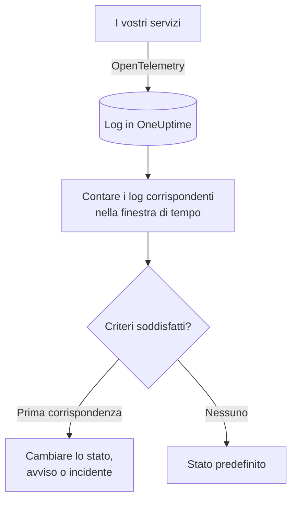
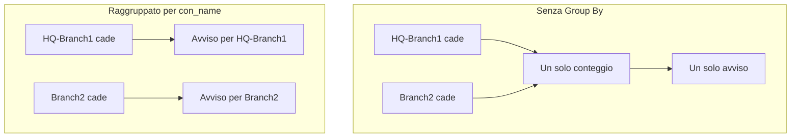

# Monitor log

Un monitor log conta, in una finestra di tempo, i log che i vostri servizi inviano a OneUptime e che corrispondono ai vostri filtri (testo, gravità, servizio, attributi). Quando il conteggio soddisfa i vostri criteri, cambia lo stato del monitor, crea un avviso o dichiara un incidente. Usatelo per individuare picchi di errori, un messaggio di errore preciso o un servizio che ha smesso di scrivere log.

:::cards
- [Creare il monitor](#creare-un-monitor-log): Scegliere quali log contare e quando avvisare.
- [Come viene valutato](#come-viene-valutato): La finestra di tempo, il conteggio e il ciclo di un minuto.
- [Criteri](#criteri): Soglie, rilevamento delle anomalie e valori predefiniti.
- [Avvisi per gruppo](#avvisi-per-gruppo-group-by): Un avviso per tunnel, utente o interfaccia.
:::

## Come funziona



Ogni minuto, OneUptime conta i log che corrispondono ai filtri del monitor e sono arrivati nella sua finestra di tempo. Confronta quel conteggio con i criteri del monitor dall'alto verso il basso, e il primo criterio che corrisponde decide cosa succede. Se nessuno corrisponde, il monitor torna al suo stato predefinito.

## Prima di iniziare

- I vostri servizi inviano log a OneUptime tramite OpenTelemetry (o un'altra sorgente di log che OneUptime acquisisce). Vedete [OpenTelemetry](/docs/telemetry/open-telemetry).
- Per filtrare o raggruppare in base a un valore contenuto nella riga di log, come il nome di un tunnel o di un utente, trasformatelo prima in un attributo con una [pipeline dei log](/docs/telemetry/log-pipelines).

## Creare un monitor log

:::steps
### Iniziare un nuovo monitor

Andate in **Monitor** e fate clic su **Crea monitor**.

### Scegliere Logs

In **Tipo di monitor**, fate clic su **Altri tipi di monitor** e scegliete **Registri** sotto **Telemetria**, oppure digitate `logs` nella casella di ricerca. Inserite un **Nome**, poi fate clic su **Avanti**.

### Scegliere i log da contare

In **Configurazione monitor log**, impostate **Log del monitor che includono questo testo**, **Log del monitor per (time)** e **Gravità del log**. Un filtro lasciato vuoto corrisponde a tutti i log. **Anteprima log**, sotto i filtri, mostra i log a cui corrispondono in questo momento.

### Restringere il campo (facoltativo)

Aprite **Altri campi** per filtrare per servizio di telemetria, entità dell'infrastruttura o attributo. Per ricevere un avviso per tunnel, utente o interfaccia invece di uno per l'intero monitor, aggiungete l'attributo in **Group by Attributes** (vedete [Avvisi per gruppo](#avvisi-per-gruppo-group-by)).

### Impostare i criteri

La scheda **Criteri del monitor** parte con due criteri: offline, con un incidente, quando nessun log corrisponde; online quando ne corrisponde almeno uno. Modificateli in base a ciò su cui volete essere avvisati (vedete [Criteri](#criteri)).

### Creare il monitor

Fate clic su **Crea monitor**. Il monitor si apre sulla sua pagina **Panoramica**, e la sua prima valutazione avviene entro un minuto.
:::

## Cosa interroga

| Campo | A cosa corrisponde | Predefinito |
| --- | --- | --- |
| **Log del monitor che includono questo testo** | Log il cui corpo contiene questo testo, senza distinzione tra maiuscole e minuscole. | Vuoto: tutti i log |
| **Log del monitor per (time)** | Log degli ultimi 5 secondi fino alle ultime 24 ore. | **Ultimo minuto** |
| **Gravità del log** | Log con una qualsiasi delle gravità scelte. | Vuoto: tutte le gravità |
| **Group by Attributes** | Non è un filtro: conta separatamente ogni combinazione di valori di questi attributi. | Vuoto: un solo conteggio |
| **Filtra per servizio di telemetria** (in **Altri campi**) | Log di uno qualsiasi dei servizi scelti. | Vuoto: tutti i servizi |
| **Filter by Infrastructure Entity** (in **Altri campi**) | Log di uno qualsiasi degli host, pod, container e altre entità scelti. | Vuoto: tutte le entità |
| **Filtra per attributi** (in **Altri campi**) | Log i cui attributi soddisfano ogni condizione. Ogni condizione ha il proprio operatore, come «uguale a» o «contiene». | Vuoto: nessuna condizione |

Tutti i filtri che impostate devono corrispondere perché un log venga contato.

### Gravità dei log

Ogni log viene salvato con una di sette gravità. Per i log OpenTelemetry deriva dal numero di gravità del log, quindi scegliete la gravità, non il testo stampato dal vostro logger:

| Gravità | Numeri di gravità OpenTelemetry |
| --- | --- |
| **Traccia** | 1–4 |
| **Debug** | 5–8 |
| **Information** | 9–12 |
| **Warning** | 13–16 |
| **Errore** | 17–20 |
| **Fatal** | 21–24 |
| **Non specificato** | Tutto il resto |

## Come viene valutato

- **Ogni minuto.** Un monitor log non viene controllato da sonde, quindi non ha un intervallo da impostare né una pagina **Sonde e intervallo**.
- **Un numero per valutazione.** Il monitor conta i log che corrispondono a ogni filtro e sono arrivati entro **Log del monitor per (time)** prima della valutazione. Con **Ultimi 5 minuti**, ogni valutazione guarda indietro di cinque minuti, quindi le finestre di valutazioni consecutive si sovrappongono.
- **Nessun log significa un conteggio di 0.** Un servizio che smette di scrivere log produce 0, che è ciò che cerca il criterio offline predefinito.
- **L'interruzione di OneUptime stesso non è silenzio.** Finché la finestra di tempo contiene un periodo in cui OneUptime stesso non riceveva dati (si stava riavviando, veniva aggiornato o recuperava un arretrato), il controllo attende: lo stato non cambia e nessun incidente o avviso viene aperto o risolto. Vedete [Quando OneUptime non riceve dati](/docs/monitor/when-oneuptime-is-not-receiving).
- **Criteri dall'alto verso il basso.** Decide il primo criterio che corrisponde, quindi mettete per primo il più grave. Un monitor raggruppato funziona diversamente: controlla ogni criterio per ogni gruppo (vedete [La valutazione dei criteri cambia](#la-valutazione-dei-criteri-cambia)).

Ogni cambio di stato, con il suo motivo, viene registrato nella **Cronologia di stato** del monitor.

## Criteri

I criteri di un monitor log hanno un solo **Tipo di filtro**: **Log Count**, il numero di log che hanno corrisposto nella finestra. Scegliete una **Condizione del filtro** e, per una condizione di soglia, un **Valore**.

| Condizione del filtro | Corrisponde quando il conteggio dei log è… |
| --- | --- |
| **Greater Than** | sopra il valore |
| **Greater Than Or Equal To** | pari al valore o superiore |
| **Less Than** | sotto il valore |
| **Less Than Or Equal To** | pari al valore o inferiore |
| **Equal To** | esattamente il valore |
| **Anomalously High** | sopra l'intervallo atteso per quest'ora della settimana |
| **Anomalously Low** | sotto quell'intervallo |
| **Anomalous** | fuori da quell'intervallo, in un senso o nell'altro |

Le condizioni di anomalia non hanno un **Valore**. Scegliete una **Sensibilità** (Low, Medium, quella predefinita, oppure High) e una **Finestra di riferimento** di 14 (quella predefinita), 28, 60 o 90 giorni. OneUptime trasforma il conteggio in un tasso al minuto e lo confronta con la stessa ora della settimana in quella finestra. Il riferimento copre solo i servizi e le gravità del monitor: i suoi filtri di testo e di attributi non ne fanno parte. Finché quell'ora della settimana non ha abbastanza storico, il criterio sta ancora imparando e non scatta.

Un nuovo monitor log parte con questi criteri:

| Criterio | Filtro | Effetto |
| --- | --- | --- |
| Check if … is offline | **Log Count** **Equal To** `0` | Mette il monitor offline e dichiara un incidente, risolto automaticamente |
| Check if … is online | **Log Count** **Greater Than** `0` | Mette il monitor online |

> [!TIP]
> Per essere avvisati degli errori invece che del silenzio, impostate **Gravità del log** su **Errore** e cambiate il criterio offline in **Log Count** **Greater Than** il numero di errori che tollerate nella finestra.

## Esempio pratico: un picco di errori

Volete un incidente quando il servizio di checkout registra più di 50 errori in cinque minuti:

- **Gravità del log**: **Errore**
- **Log del monitor per (time)**: **Ultimi 5 minuti**
- **Filtra per servizio di telemetria**: `checkout`
- Criterio 1: **Log Count** **Greater Than** `50`: mettere il monitor offline e dichiarare un incidente
- Criterio 2: **Log Count** **Less Than Or Equal To** `50`: mettere il monitor online

Quattro valutazioni consecutive:

| Ora | Log di errore degli ultimi 5 minuti | Criterio che corrisponde | Cosa succede |
| --- | --- | --- | --- |
| 10:00 | 12 | 2 | Il monitor è online. |
| 10:01 | 64 | 1 | Il monitor va offline e viene dichiarato un incidente. |
| 10:02 | 81 | 1 | Ancora offline. L'incidente è già aperto, quindi non ne viene dichiarato un secondo. |
| 10:06 | 9 | 2 | Il monitor torna online, e l'incidente si risolve da solo perché **Risoluzione automatica dell'incidente** è attiva. |

Poiché le finestre si sovrappongono, una sola raffica di errori tiene alto il conteggio fino a cinque minuti dopo la sua fine. Usate una finestra più breve per un monitor che deve riprendersi prima.

## Avvisi per gruppo (Group By)

**Group by Attributes** divide il conteggio di un monitor log in un conteggio per ogni combinazione distinta di valori degli attributi (uno per tunnel IPsec, per utente VPN, per interfaccia del firewall) e valuta i criteri su ciascun gruppo separatamente. È l'equivalente, per i log, del [Group By](/docs/monitor/metrics-monitor#avvisi-per-serie-group-by) di un monitor metriche.

### Un avviso per gruppo

Senza Group By, un monitor che sorveglia i tunnel IPsec terminati è un unico conteggio per l'intero monitor e genera **un solo avviso per l'intero monitor**. Finché quell'avviso è aperto, la caduta di un secondo tunnel non produce nulla di nuovo: il monitor sta già avvisando.

Con Group By sul nome del tunnel, la terminazione del tunnel `HQ-Branch1` apre il proprio avviso, e la terminazione del tunnel `Branch2` dieci minuti dopo apre un **secondo avviso, separato**, accanto al primo.



### Risoluzione indipendente

L'avviso o l'incidente di ogni gruppo si risolve per conto proprio. Appena un gruppo non soddisfa più i criteri (`HQ-Branch1` non registra più terminazioni nella finestra di tempo), il suo avviso si risolve, mentre quello di `Branch2` resta aperto finché anche `Branch2` non si ferma. Il ripristino di un gruppo non chiude mai l'avviso di un altro.

Un monitor log vede eventi, non stati: l'avviso di un gruppo si risolve non appena quel gruppo non ha registrato nulla che soddisfi i criteri per un'intera finestra di tempo, che il tunnel sia tornato o no.

### Esempio: un avviso per tunnel IPsec Sophos

Si presuppone che le righe syslog del firewall vengano scomposte in attributi con un [parser Key=Value](/docs/telemetry/log-pipelines#keyvalue-parser), senza prefisso di destinazione, in modo che il nome del tunnel sia l'attributo `con_name`:

```text
log_component="IPSec" con_name="HQ-Branch1" status="Terminated" message="IPSec Connection HQ-Branch1 between 10.171.4.117 and 10.171.4.118 for Child HQ-Branch1 terminated."
```

:::steps
1. Create un monitor **Registri**.
2. Impostate **Log del monitor che includono questo testo** su `terminated` e **Log del monitor per (time)** su **Ultimi 5 minuti**.
3. In **Altri campi**, aggiungete il filtro di attributo `log_component` = `IPSec`.
4. In **Group by Attributes**, aggiungete `con_name`.
5. Aggiungete un criterio con il filtro **Log Count** **Greater Than** `0` che crei un avviso o un incidente intitolato `IPsec tunnel {{con_name}} terminated`.
:::

Ogni tunnel che registra una terminazione riceve ora il proprio avviso (`IPsec tunnel HQ-Branch1 terminated`, `IPsec tunnel Branch2 terminated`), e ciascuno si risolve per conto proprio.

### Valori del gruppo in titoli e descrizioni

Il valore di ogni attributo di Group By è una [variabile di modello](/docs/monitor/incident-alert-templating) nel titolo, nella descrizione e nelle note di rimedio dell'avviso o dell'incidente, come le etichette di una serie di metriche: raggruppare per `con_name` vi dà `{{con_name}}`. Una chiave con punti si legge come un percorso, quindi `sophos.con_name` è `{{sophos.con_name}}`. Quando il titolo non nomina già il gruppo, il gruppo viene aggiunto (`IPsec tunnel terminated - Con Name: HQ-Branch1`), e `{{seriesResourceSuffix}}` e `{{seriesResourceSummary}}` funzionano come nei monitor metriche.

### Come vengono contati i gruppi

- Fino a 10 attributi. Ogni combinazione distinta dei loro valori è un gruppo.
- Un log che non porta un attributo di Group By viene contato con un **valore vuoto** per quell'attributo, quindi i log senza l'attributo formano un gruppo a sé, il cui avviso non nomina alcun valore per esso. Se tutti gli avvisi arrivano senza valore di gruppo, controllate la chiave dell'attributo: una pipeline dei log con un prefisso di destinazione salva `con_name` come `sophos.con_name`.
- I valori di gruppo più lunghi di 256 caratteri vengono troncati a 256.
- Per ogni controllo vengono valutati al massimo **100 gruppi**: i 100 con più log. Quando ne corrispondono di più, gli altri vengono saltati per quel controllo e viene registrato un avviso nel log; restringete i filtri del monitor per coprirli.

### La valutazione dei criteri cambia

- **Ogni criterio viene valutato**, come in un monitor metriche raggruppato, quindi gruppi diversi possono soddisfare criteri diversi allo stesso tempo. Un gruppo che soddisfa due criteri riceve comunque un solo avviso, quello del primo, quindi ordinate i criteri dal più grave al meno grave.
- **Un gruppo esiste solo se ha registrato qualcosa nella finestra di tempo.** Per questo i criteri **Equal To 0** e **Less Than** scattano solo per i gruppi che hanno registrato almeno una volta; per essere avvisati quando i log smettono del tutto di arrivare, usate un monitor senza Group By.
- **Il rilevamento delle anomalie** (**Anomalously High**, **Anomalously Low**, **Anomalous**) non viene valutato per gruppo (il suo riferimento copre l'intero monitor), quindi questi filtri non corrispondono mai su un monitor raggruppato.
- Lo stato del monitor segue il primo criterio che un qualsiasi gruppo soddisfa. Quando nessun gruppo soddisfa alcun criterio, il monitor torna al suo stato predefinito.

## Risoluzione dei problemi

:::details Il monitor è offline, ma il mio servizio scrive log
Il conteggio era 0, quindi i filtri non corrispondono a nessuno dei log che il servizio invia. Aprite la pagina **Criteri** del monitor (sotto **Configurazione**) e fate clic su **Edit Monitoring Criteria**: **Anteprima log** mostra a cosa corrispondono i filtri in questo momento. Le cause più comuni sono una gravità scelta in base al testo stampato dal logger invece che al suo numero di gravità (vedete [Gravità dei log](#gravità-dei-log)), un filtro di servizio o di attributo che non corrisponde, e una finestra di tempo più breve dell'intervallo tra i log del servizio.
:::

:::details C'è stato un picco, ma nessun avviso
I criteri vengono controllati dall'alto verso il basso e decide la prima corrispondenza. Un criterio ampio sopra quello che vi aspettavate, come **Log Count** **Greater Than** `0`, corrisponde per primo e ferma gli altri. Mettete in cima il criterio più grave.
:::

:::details Un criterio di anomalia non scatta mai
Sta ancora imparando: l'ora della settimana con cui confronta non ha ancora abbastanza storico. Su un monitor con **Group by Attributes**, le condizioni di anomalia non corrispondono mai; usate lì una soglia.
:::

:::details Gli avvisi di gruppo arrivano senza valore di gruppo
I log che non portano l'attributo di Group By vengono contati con un valore vuoto. Controllate il nome esatto della chiave nell'esploratore dei log: una pipeline dei log con un prefisso di destinazione salva `con_name` come `sophos.con_name`.
:::

## Passaggi successivi

:::cards
- [Pipeline dei log](/docs/telemetry/log-pipelines): Scomporre le righe di log in attributi su cui filtrare e raggruppare.
- [Modelli di incidenti e avvisi](/docs/monitor/incident-alert-templating): Inserire valori di gruppo e conteggi in titoli e descrizioni.
- [Monitor metriche](/docs/monitor/metrics-monitor): Avvisare su una metrica, per host o per container.
- [Monitor tracce](/docs/monitor/traces-monitor): Avvisare allo stesso modo sugli span non riusciti.
:::
