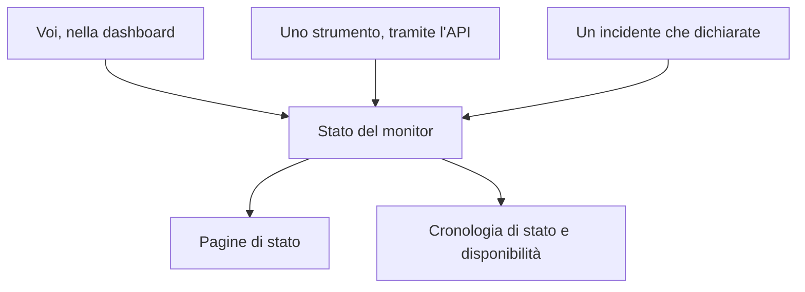

# Monitor manuale

Un monitor manuale non ha controlli automatici: il suo stato è quello che impostate voi, nella dashboard o tramite l'API. Usatelo per rappresentare qualcosa che OneUptime non può controllare da solo — una dipendenza di terze parti, un sistema fisico, un processo aziendale — sulle vostre pagine di stato e nei vostri incidenti.

:::cards
- [Crearne uno](#creare-un-monitor-manuale): Un passaggio nella dashboard.
- [Cambiarne lo stato](#aggiornare-lo-stato): Nella dashboard, o dai vostri strumenti tramite l'API.
- [Incidenti e avvisi](#incidenti-e-avvisi): Dichiarare un incidente e impostare lo stato nello stesso passaggio.
:::

## Quando usare un monitor manuale

| Caso d'uso | Descrizione |
| --- | --- |
| Servizi di terze parti | Seguire lo stato di servizi esterni da cui dipendete ma che non potete monitorare direttamente. |
| Infrastruttura fisica | Rappresentare hardware o sistemi fisici senza monitoraggio di rete. |
| Processi aziendali | Seguire processi non tecnici che influiscono sullo stato del servizio. |
| Stato tramite API | Lasciare che i vostri strumenti impostino lo stato tramite l'API di OneUptime. |
| Segnaposto nelle pagine di stato | Mostrare sulla vostra pagina di stato componenti gestiti fuori da OneUptime. |

Un fornitore che pubblica una pagina di stato non ne ha bisogno: un [monitor della pagina di stato esterna](/docs/monitor/external-status-page-monitor) segue quella pagina al posto vostro.

## Come funziona

Un monitor manuale non ha intervallo di monitoraggio, sonde né criteri. Il suo stato resta quello che impostate finché voi, uno strumento tramite l'API o un incidente che dichiarate non lo cambia — e il nuovo stato compare ovunque compaia il monitor.



Ogni cambiamento è una voce della **Cronologia di stato** del monitor, quindi la sua disponibilità e la sua cronologia di stato vengono conservate come per qualsiasi altro monitor. Un monitor manuale non è un monitor attivo, quindi su OneUptime Cloud non aggiunge nulla alla vostra fattura.

## Creare un monitor manuale

:::steps
### Iniziare un nuovo monitor

Andate in **Monitor** e fate clic su **Crea monitor**.

### Scegliere Manual

In **Tipo di monitor**, fate clic su **Altri tipi di monitor** e scegliete **Manual** sotto **Altro**.

### Dargli un nome e crearlo

Inserite un **Nome** — e una **Descrizione** sotto **Altri campi**, se volete — poi fate clic su **Crea monitor**. Un monitor manuale non ha bisogno d'altro, quindi viene creato da questo primo passaggio.
:::

## Aggiornare lo stato

### Nella dashboard

:::steps
1. Aprite il monitor e fate clic su **Cronologia di stato** nel suo menu laterale.
2. Fate clic su **Crea: Monitor Stato Evento**.
3. Scegliete lo **Stato del monitor**. **Inizia il** è adesso; impostate un orario precedente se il cambiamento è avvenuto prima.
4. Fate clic su **Crea: Monitor Stato Evento**. Il nuovo stato compare subito sul monitor, e su ogni pagina di stato che lo elenca.
:::

### Tramite l'API

Inviate il nuovo stato come evento di stato del monitor, con una [chiave API](/docs/api-reference/api-reference) del vostro progetto nell'intestazione `ApiKey`:

```bash
curl -X POST https://oneuptime.com/api/monitor-status-timeline \
  -H "ApiKey: $ONEUPTIME_API_KEY" \
  -H "Content-Type: application/json" \
  -d '{"data": {"monitorId": "<monitor id>", "monitorStatusId": "<monitor status id>"}}'
```

- `monitorId` è l'ID del monitor: fate clic sulla riga **ID** della sua pagina per copiarlo.
- `monitorStatusId` è lo stato da impostare: in **Monitor → Impostazioni → Stato del monitor**, scegliete **Mostra ID** nella riga di quello stato.
- `startsAt` è facoltativo. Se lo omettete, il cambiamento inizia adesso.
- Su un'installazione self-hosted, inviate la richiesta al vostro host invece che a `oneuptime.com`.

Inviare lo stato che il monitor ha già viene rifiutato con `Monitor Status cannot be same as previous status.` e non registra nulla, quindi uno strumento che segnala a ogni esecuzione può ignorare quella risposta.

## Incidenti e avvisi

Un monitor manuale si sceglie come qualsiasi altro ovunque si scelgano i monitor:

- Dichiarate un incidente e scegliete il monitor in **Monitor**. Con **Cambia lo stato del monitor in**, la dichiarazione imposta anche lo stato del monitor, e la risoluzione riporta il monitor a operativo, a meno che non sia ancora aperto un altro incidente su di esso. Vedete [Dichiarare un incidente](/docs/incidents/declaring-incidents#passaggio-2-risorse-interessate).
- Create un avviso su di esso, per un problema che il vostro team deve gestire senza avvisare i clienti.
- Aggiungetelo a una pagina di stato, per mostrare ai clienti una dipendenza che sorvegliate a mano.

## Passaggi successivi

:::cards
- [Creare un monitor](/docs/monitor/create-monitor): I tipi di monitor che controllano le cose al posto vostro.
- [Monitor pagina di stato esterna](/docs/monitor/external-status-page-monitor): Seguire invece automaticamente la pagina di stato di un fornitore.
- [Panoramica delle pagine di stato](/docs/status-pages/index): Mostrare lo stato del monitor ai vostri clienti.
:::
