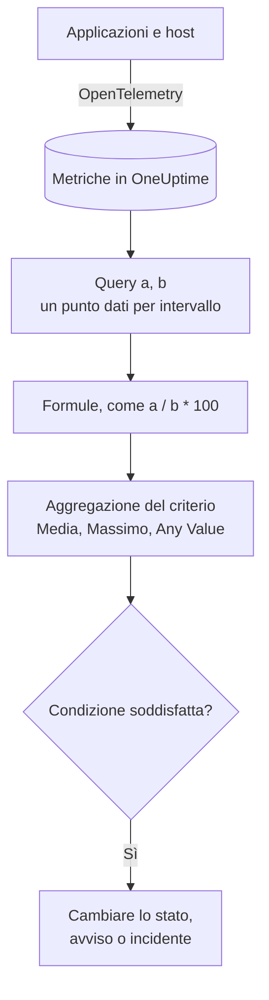

# Monitor metriche

Un monitor metriche interroga le metriche che le vostre applicazioni e la vostra infrastruttura inviano a OneUptime, le combina con formule quando vi serve un rapporto o un totale, e confronta il risultato con i vostri criteri su un intervallo di tempo mobile. Usatelo per tassi di richieste, rapporti di errori, profondità delle code, CPU, memoria e disco (qualsiasi serie numerica), con un avviso per host o per container quando lo raggruppate.

:::cards
- [Creare il monitor](#creare-un-monitor-metriche): Query, formule, un intervallo di tempo e criteri.
- [Come viene valutato](#come-viene-valutato): Punti dati, formule e aggregazione dei criteri.
- [Esempio pratico](#esempio-pratico-una-coda-che-cresce): Gli stessi dati con ogni aggregazione.
- [Avvisi per serie](#avvisi-per-serie-group-by): Un avviso per host, container o punto di montaggio.
:::

## Come funziona

Ogni minuto, OneUptime esegue ogni query di metriche del monitor sul suo intervallo di tempo. Una query restituisce un punto dati per intervallo, e le formule combinano le query intervallo per intervallo. Ogni criterio riduce poi i punti dati della query o della formula che controlla (alla loro media, al loro massimo o a un test di ogni punto) e confronta il risultato con la propria soglia.

## Prima di iniziare

- Le vostre applicazioni o la vostra infrastruttura inviano metriche a OneUptime tramite OpenTelemetry. Vedete [OpenTelemetry](/docs/telemetry/open-telemetry).
- Conoscete il nome della metrica e gli attributi su cui volete filtrare o raggruppare. Gli elenchi **Metrica** e **Group by** offrono solo nomi e attributi che OneUptime ha ricevuto.

## Creare un monitor metriche

:::steps
### Iniziare un nuovo monitor

Andate in **Monitor** e fate clic su **Crea monitor**.

### Scegliere Metrics

In **Tipo di monitor**, fate clic su **Altri tipi di monitor** e scegliete **Metriche** sotto **Telemetria**, oppure digitate `metrics` nella casella di ricerca. Inserite un **Nome**, poi fate clic su **Avanti**.

### Scegliere l'intervallo di tempo

In **Configurazione monitor metriche**, scegliete un **Intervallo di tempo**: quanto indietro guarda ogni valutazione. Parte da **Past 1 Minute**.

### Aggiungere le query delle metriche

In **Seleziona metriche**, scegliete una **Metrica** e come aggregarla con **Aggregate by**. Aprite **Filters & grouping** per filtrare per attributi o per raggruppare con **Group by**. Fate clic su **Aggiungi metrica** per un'altra query, o su **Aggiungi formula** per combinarle. Il grafico sotto le query mostra un'anteprima dell'intervallo di tempo, così vedete i valori che i criteri controlleranno.

### Impostare i criteri

In **Criteri del monitor**, ogni criterio sceglie la **Metrica** da controllare (una query o una formula), la sua **Aggregazione**, una **Condizione** e un **Threshold**. Vedete [Criteri](#criteri) per i criteri con cui parte un nuovo monitor.

### Creare il monitor

Fate clic su **Crea monitor**. Il monitor si apre sulla sua pagina **Panoramica**, e la sua prima valutazione avviene entro un minuto.
:::

## Cosa interroga

### Query delle metriche

| Campo | Cosa fa | Predefinito |
| --- | --- | --- |
| **Metrica** | La metrica da interrogare. | Obbligatorio |
| **Aggregate by** | Come i valori di ogni intervallo di tempo vengono combinati in un punto dati: Media, Somma, Min, Max, Conteggio, oppure un percentile (P50, P75, P90, P95 o P99). | Media |
| **Filter by attributes** (in **Filters & grouping**) | Solo le serie i cui attributi soddisfano queste condizioni. | Nessun filtro |
| **Group by** (in **Filters & grouping**) | Una serie per ogni valore unico di questi attributi (vedete [Avvisi per serie](#avvisi-per-serie-group-by)). | Una sola serie |

Ogni query e ogni formula riceve una variabile (`a`, `b`, `c` e così via) nell'ordine in cui le aggiungete.

### Formule

Una formula combina variabili di query con `+`, `-`, `*`, `/`, `%`, `^` e parentesi, intervallo per intervallo. Potete scrivere le variabili con o senza un `$` davanti:

- `a / b * 100`: la quota di `b` rappresentata da `a`, in percentuale
- `a + b`: due metriche sommate
- `a - b`: la differenza tra le due

### Finestra di tempo mobile

**Intervallo di tempo** stabilisce quanto indietro guarda ogni valutazione: **Past 1 Minute**, **Past 5 Minutes**, **Past 10 Minutes**, **Past 15 Minutes**, **Past 30 Minutes**, **Past 1 Hour**, **Past 2 Hours**, **Past 3 Hours**, **Past 6 Hours**, **Past 12 Hours**, **Past 1 Day**, **Past 2 Days**, **Past 3 Days**, **Past 7 Days**, **Past 14 Days**, **Past 30 Days**, **Past 60 Days**, **Past 90 Days**, **Past 180 Days** o **Past 365 Days**.

Più lungo è l'intervallo, più largo è ogni intervallo di raggruppamento, quindi un punto dati rappresenta più tempo:

| Intervallo di tempo | Un punto dati per |
| --- | --- |
| Da Past 1 Minute a Past 3 Hours | minuto |
| Past 6 Hours, Past 12 Hours | 5 minuti |
| Past 1 Day | 15 minuti |
| Past 2 Days, Past 3 Days | 30 minuti |
| Past 7 Days | ora |
| Past 14 Days, Past 30 Days | giorno |
| Da Past 60 Days a Past 180 Days | settimana |
| Past 365 Days | mese |

## Come viene valutato

- **Ogni minuto.** Un monitor metriche non viene controllato da sonde, quindi non ha un intervallo da impostare né una pagina **Sonde e intervallo**.
- **Prima le query, poi le formule.** Ogni query restituisce un punto dati per intervallo di raggruppamento dell'intervallo di tempo, secondo il suo **Aggregate by**. Le formule vengono calcolate per ogni intervallo a partire dai punti dati delle query.
- **Poi l'aggregazione del criterio.** Ogni criterio riduce i punti dati della sua **Metrica** a ciò che confronta con la soglia:

| Aggregazione | La condizione viene verificata su… |
| --- | --- |
| Media | la media dei punti dati |
| Somma | la somma dei punti dati |
| Maximum Value | il punto dati più alto |
| Minimum Value | il punto dati più basso |
| All Values | ogni punto dati: tutti devono soddisfare la condizione |
| Any Value | ogni punto dati: basta che uno soddisfi la condizione |

- **Criteri dall'alto verso il basso.** In un monitor senza Group By decide il primo criterio che corrisponde, quindi mettete per primo il più grave. Un monitor raggruppato controlla ogni criterio per ogni serie (vedete [La valutazione dei criteri cambia](#la-valutazione-dei-criteri-cambia)).
- **Nessun dato non è zero.** Quando la query non restituisce punti dati nell'intervallo, un criterio fa ciò che dice la sua impostazione **Se nessun dato**, in **Altri campi**: **Ignore** (il predefinito: il criterio non corrisponde), **Treat As Zero** o **Trigger**.
- **L'interruzione di OneUptime stesso non è silenzio.** Finché l'intervallo di tempo contiene un periodo in cui OneUptime stesso non riceveva dati (si stava riavviando, veniva aggiornato o recuperava un arretrato), il controllo attende: lo stato non cambia e nessun incidente o avviso viene aperto o risolto, qualunque cosa dica **Se nessun dato**. Vedete [Quando OneUptime non riceve dati](/docs/monitor/when-oneuptime-is-not-receiving).

## Criteri

Questi monitor valutano sempre il **Metric Value**: il valore aggregato della query di metriche o della formula configurata. Il modulo dei criteri non ha un selettore del tipo di filtro; mostra **Metrica**, **Aggregazione**, **Condizione** e **Threshold**. Quando la metrica ha un'unità, scegliete l'unità della soglia accanto.

| Condizione | Corrisponde quando il valore è… |
| --- | --- |
| **Greater Than** | sopra la soglia |
| **Greater Than Or Equal To** | pari alla soglia o superiore |
| **Less Than** | sotto la soglia |
| **Less Than Or Equal To** | pari alla soglia o inferiore |
| **Equal To** | esattamente la soglia |
| **Anomalously High** | sopra l'intervallo atteso per quest'ora della settimana |
| **Anomalously Low** | sotto quell'intervallo |
| **Anomalous** | fuori da quell'intervallo, in un senso o nell'altro |

Le condizioni di anomalia non hanno soglia. Il modulo mostra invece **Sensibilità** (Low, Medium, quella predefinita, oppure High) e **Finestra di riferimento** (14 giorni, quella predefinita, 28, 60 o 90), e confronta ogni punto dati con il riferimento della stessa ora della settimana costruito su quella finestra. Finché quell'ora della settimana non ha abbastanza storico, il criterio sta ancora imparando e non genera avvisi.

Un nuovo monitor metriche parte con due criteri sulla sua prima query, entrambi con l'aggregazione **Any Value**:

| Criterio | Condizione | Effetto |
| --- | --- | --- |
| Check if … is offline | **Equal To** `0` | Mette il monitor offline e dichiara un incidente, risolto automaticamente |
| Check if … is online | **Greater Than** `0` | Mette il monitor online |

> [!NOTE]
> Il criterio offline scatta su un valore riportato pari a 0, non sul silenzio. Per essere avvisati quando una metrica smette di arrivare, impostate il suo **Se nessun dato** su **Trigger**.

## Esempio pratico: una coda che cresce

Volete un incidente quando la coda di checkout resta profonda. La query `a` è il gauge `checkout.queue.depth`, con **Aggregate by** Max, e l'**Intervallo di tempo** è **Past 5 Minutes**. Una valutazione vede questi cinque punti dati di un minuto:

| Minuto | 10:01 | 10:02 | 10:03 | 10:04 | 10:05 |
| --- | --- | --- | --- | --- | --- |
| `a` | 640 | 980 | 1.500 | 1.620 | 1.100 |

Un criterio con **Metrica** `a`, **Condizione** **Greater Than** e **Threshold** `1000` dà una risposta diversa per ogni **Aggregazione**:

| Aggregazione | Confrontato con 1.000 | Corrisponde? |
| --- | --- | --- |
| Media | 1.168 | Sì |
| Somma | 5.840 | Sì |
| Maximum Value | 1.620 | Sì |
| Minimum Value | 640 | No |
| All Values | 640, 980, 1.500, 1.620, 1.100 | No: due punti non superano 1.000 |
| Any Value | 640, 980, 1.500, 1.620, 1.100 | Sì: 1.500 lo supera |

**Media** avvisa per un ingorgo prolungato e ignora un singolo minuto profondo; **All Values** aspetta che ogni minuto dell'intervallo sia profondo; **Any Value** avvisa al primo minuto profondo.

## Avvisi per serie (Group By)

**Group by** su una query di metriche divide quella query in una serie per ogni valore unico dell'attributo (una per host, una per container, una per punto di montaggio), e un monitor con Group By impostato valuta ogni serie in modo indipendente. Quest'unica impostazione fa la differenza tra «la flotta non sta bene» e «`prod-db-01` non sta bene».

### Un avviso per gruppo

Con Group By su `host.name`, un monitor dell'uso del disco che sorveglia cinquanta host genera **un avviso (o un incidente) per ogni host oltre la soglia**. L'host A che si riempie apre il proprio avviso; l'host B che si riempie dieci minuti dopo apre un secondo avviso, separato, accanto al primo.

Senza Group By, lo stesso monitor è un singolo scalare: la query riduce tutti gli host a un solo numero e il monitor genera **un solo avviso per l'intero monitor**. Finché quell'avviso è aperto, un secondo host oltre la soglia non produce nulla (il monitor sta già avvisando, quindi non c'è niente di nuovo da generare) e il tecnico reperibile non viene mai a sapere dell'host B. **Impostare Group By è il modo per avere avvisi per host.** Se volete essere avvisati per host, per container o per punto di montaggio, impostatelo.

### Risoluzione indipendente

Ogni avviso per gruppo segue il proprio gruppo. Quando l'host A torna sotto la soglia, il suo avviso si risolve per conto proprio, e quello dell'host B resta aperto finché l'host B non si riprende. Il ripristino di un gruppo non chiude mai l'avviso di un altro.

### La valutazione dei criteri cambia

- **I monitor raggruppati valutano ogni criterio.** Così livelli di gravità diversi possono scattare su gruppi diversi nello stesso momento: con «Critical: maggiore di 95» sopra «Warning: maggiore di 80», un host al 96% apre un avviso critico mentre un host all'85% apre un avviso di warning, nello stesso controllo. Un host che supera entrambi i livelli riceve comunque esattamente un avviso, quello del primo criterio che corrisponde, quindi **ordinate i criteri dal più grave al meno grave**.
- **I monitor non raggruppati si fermano al primo criterio che corrisponde.** Scatta solo quel criterio, un motivo in più per mettere il criterio di avviso sopra quello di buona salute: un criterio di buona salute ampio messo per primo corrisponde quasi a ogni controllo e impedisce che il criterio di avviso sotto venga mai valutato.

| Host | Disco usato | Critical (> 95) | Warning (> 80) | Avviso generato |
| --- | --- | --- | --- | --- |
| `prod-db-01` | 96% | Sì | Sì | Critical |
| `prod-db-02` | 85% | No | Sì | Warning |
| `prod-db-03` | 40% | No | No | Nessuno |

### Scegliere un attributo per raggruppare

Raggruppate per un attributo che identifichi davvero una cosa distinta per cui avvisereste qualcuno: l'attributo dell'host per una metrica di host su tutta la flotta, l'attributo del container o del pod per una metrica di container, l'attributo del punto di montaggio o del dispositivo per una metrica di file system o di I/O del disco, l'attributo dell'interfaccia per una metrica di rete. L'elenco **Group by** viene riempito con gli attributi che il vostro collector invia davvero, quindi scegliete dall'elenco invece di digitare una chiave a mano.

Non raggruppate una metrica che è già un singolo scalare per l'intero sistema (un flag di leader dell'intero cluster, un arretrato dello scheduler o la CPU di un singolo host in un monitor per un solo host). Raggrupparla produce esattamente una serie e non cambia nulla tranne i titoli degli avvisi.

I valori dell'attributo di raggruppamento sono disponibili anche come [variabili di modello](/docs/monitor/incident-alert-templating) nel titolo, nella descrizione e nelle note di rimedio dell'avviso o dell'incidente: raggruppare per `host.name` permette al titolo di dire `Disk almost full on {{host.name}}`.

## Risoluzione dei problemi

:::details Il grafico mostra un superamento, ma il monitor non ha avvisato
Controllate prima l'**Aggregazione** del criterio: **All Values** corrisponde solo quando ogni punto dati dell'intervallo supera la soglia, e **Media** smussa un picco breve. Controllate poi che la **Metrica** del criterio sia la query o la formula che intendete (`a` non è la formula `c`) e che la soglia sia nell'unità che pensate.
:::

:::details La metrica ha smesso di arrivare e non è successo nulla
Un intervallo senza punti dati non è un valore pari a 0. Con **Se nessun dato** al suo valore predefinito, **Ignore**, il criterio non corrisponde. Impostatelo su **Trigger** in **Altri campi** del criterio per essere avvisati del silenzio.
:::

:::details Ricevo un solo avviso per tutta la flotta
La query non ha **Group by**, quindi tutti gli host vengono ridotti a un solo numero. Raggruppate la query per l'attributo dell'host, del container o del punto di montaggio (vedete [Avvisi per serie](#avvisi-per-serie-group-by)).
:::

:::details Un criterio di anomalia non scatta mai
Sta ancora imparando: l'ora della settimana con cui confronta non ha ancora abbastanza storico nella **Finestra di riferimento**.
:::

## Passaggi successivi

:::cards
- [Modelli di incidenti e avvisi](/docs/monitor/incident-alert-templating): Inserire l'host e il valore nei titoli degli avvisi.
- [Monitor log](/docs/monitor/logs-monitor): Avvisare sul volume e sul contenuto dei log, per gruppo.
- [Monitor host](/docs/monitor/host-monitor): Controlli pronti di CPU, memoria e disco per i vostri host.
- [OpenTelemetry](/docs/telemetry/open-telemetry): Inviare metriche a OneUptime.
:::
