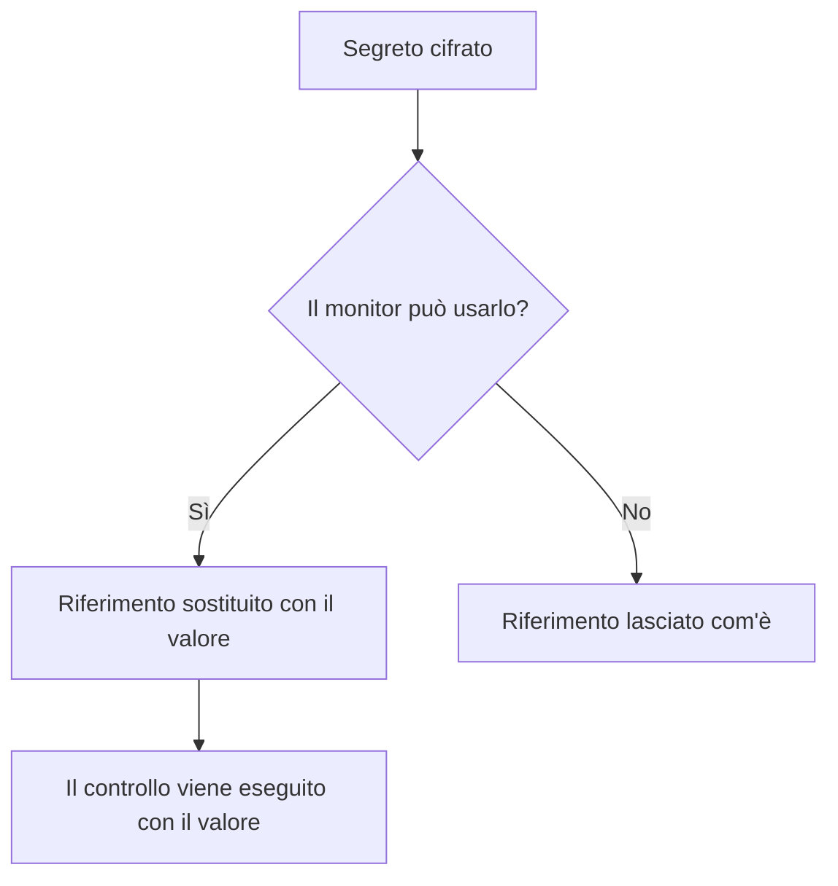

# Segreti del monitor

I segreti del monitor tengono fuori dal monitor stesso le password, le chiavi API e i token di cui hanno bisogno i vostri monitor. Salvate un valore una volta, cifrato, scegliete quali monitor possono usarlo e lo richiamate con `{{monitorSecrets.NAME}}` ovunque il monitor ne abbia bisogno.

:::cards
- [Aggiungere un segreto](#aggiungere-un-segreto): Salvare un valore e scegliere chi può usarlo.
- [Scegliere l'accesso](#scegliere-quali-monitor-possono-usare-un-segreto): Tutti i monitor, monitor specifici o monitor con etichette.
- [Usare un segreto](#usare-un-segreto): Dove funziona `{{monitorSecrets.NAME}}`.
:::

## Come i segreti arrivano a un monitor

Un segreto viene salvato cifrato e non viene più mostrato dopo il salvataggio. Prima di affidare un monitor a una sonda, OneUptime sostituisce ogni riferimento che il monitor può usare con il valore decifrato; un riferimento che il monitor non può usare resta com'è scritto.

La sonda che esegue il controllo riceve il valore, quindi un monitor che usa un segreto dovrebbe essere eseguito su sonde di cui vi fidate: quelle di OneUptime, o una [sonda personalizzata](/docs/probe/custom-probe) che gestite voi.

## Prima di iniziare

- **Il piano Growth o superiore**, su OneUptime Cloud. Le installazioni self-hosted non hanno piani.
- **Un ruolo che può gestire i segreti**: Project Owner, Project Admin, oppure un ruolo personalizzato con il permesso Create Monitor Secret.

## Lavorare con i segreti

### Aggiungere un segreto

:::steps
1. Andate in **Monitor → Impostazioni → Segreti** e fate clic su **Crea: Monitor Segreto**.
2. Inserite un **Nome** e il **Valore del segreto**. Il nome è ciò che richiamate, per esempio `ApiKey`. Può contenere solo lettere, numeri, trattini (`-`) e trattini bassi (`_`), e due segreti dello stesso progetto non possono condividerlo.
3. Nel passaggio **Accesso**, scegliete quali monitor possono usarlo (vedete la sezione successiva), poi fate clic su **Crea: Monitor Segreto**.
:::

> [!IMPORTANT]
> I segreti vengono cifrati e salvati in modo sicuro. Il valore del segreto non viene più mostrato dopo il salvataggio — né nella tabella, né nel modulo di modifica, né tramite l'API. Se perdete il valore, dovrete recuperarlo da dove proviene e impostarlo di nuovo. Per ruotare un segreto, usate il pulsante **Aggiorna valore segreto** nella sua riga; non serve eliminarlo e ricrearlo.

### Scegliere quali monitor possono usare un segreto

Ogni segreto ha una di tre opzioni di accesso:

| Opzione | Quali monitor possono usare il segreto | Da usare per |
| --- | --- | --- |
| **Tutti i monitor** | Ogni monitor del progetto, compresi quelli che create in seguito. | Una credenziale condivisa da molti monitor. |
| **Monitor specifici** | Solo i monitor che scegliete. È l'opzione predefinita, e i segreti creati prima che esistessero queste opzioni funzionano così. | Una credenziale per uno o pochi monitor. |
| **Monitor con etichette** | I monitor che hanno almeno una delle etichette che scegliete. Aggiungere una di queste etichette a un monitor gli dà accesso, e togliere l'etichetta gli toglie l'accesso alla successiva esecuzione del monitor. | Una credenziale per un gruppo di monitor che cambia nel tempo. |

Potete cambiare l'opzione in qualsiasi momento con **Modifica** nella riga del segreto. Viene mantenuto solo l'elenco dell'opzione scelta: passare a **Tutti i monitor** svuota gli elenchi di monitor e di etichette del segreto, e passare tra **Monitor specifici** e **Monitor con etichette** svuota l'elenco che lasciate.

Un segreto non è mai disponibile per i monitor di un altro progetto.

> [!WARNING]
> Chiunque possa modificare un monitor che può usare un segreto può inviare quel segreto ovunque il monitor si colleghi. Con **Tutti i monitor**, si tratta di chiunque possa creare o modificare monitor nel progetto. Con **Monitor con etichette**, comprende anche chiunque possa aggiungere una di quelle etichette a un monitor.

Tramite l'API, l'opzione di accesso è il campo `monitorAccess`: `All Monitors`, `Specific Monitors` o `Monitors With Labels`. I campi `monitors` e `labels` contengono gli elenchi. Un segreto creato senza `monitorAccess` riceve `Specific Monitors`.

### Usare un segreto

Per usare un segreto, scrivete `{{monitorSecrets.SECRET_NAME}}` in un campo che accetta segreti. Per esempio, un'intestazione della richiesta `Authorization: Bearer {{monitorSecrets.ApiKey}}` invia il valore del segreto `ApiKey`.

Questi tipi di monitor e questi campi accettano segreti:

| Tipo di monitor | Campi |
| --- | --- |
| API | L'URL, le intestazioni e il corpo della richiesta, e il certificato client, la chiave privata e la passphrase (mTLS) |
| Sito web | L'URL, e il certificato client, la chiave privata e la passphrase (mTLS) |
| Ping, IP, Porta, NTP, SSL Certificate | L'host o l'URL da controllare |
| DNS | Il nome di dominio e il server DNS |
| DNSSEC, Dominio | Il nome di dominio |
| SQL Query | L'host, il nome del database, il nome utente, la password e la query |
| Database Health | L'host, il nome del database, il nome utente e la password |
| External Status Page | L'URL della pagina di stato |
| Synthetic Monitor, Custom JavaScript Code | Lo script |
| Network Device | La community string SNMP, e le chiavi di autenticazione e di privacy SNMPv3 |

I segreti vengono compilati prima che venga eseguito lo script di un monitor Synthetic Monitor o Custom JavaScript Code, quindi un riferimento come `{{monitorSecrets.ApiKey}}` nello script vale il valore decifrato quando viene eseguito.

Se un monitor richiama un segreto che non può usare, il riferimento resta com'è e non viene sostituito con il valore.

Quando testate un monitor prima di salvarlo, vengono compilati solo i segreti disponibili per **Tutti i monitor**, perché un nuovo monitor non è in nessun elenco e non ha ancora etichette. Dopo aver salvato il monitor, i test usano ogni segreto che il monitor può usare.

## Risoluzione dei problemi

:::details Il monitor invia `{{monitorSecrets.NAME}}` alla lettera
Il monitor non può usare il segreto, oppure il nome non corrisponde. Controllate l'opzione di accesso del segreto con **Modifica** nella sua riga, e che il nome nel riferimento sia esattamente il nome del segreto.
:::

:::details Testare un nuovo monitor non compila il segreto
Prima che un monitor venga salvato, vengono compilati solo i segreti disponibili per **Tutti i monitor**. Salvate il monitor, poi testatelo di nuovo.
:::

:::details Un campo ignora il segreto
Solo i campi della tabella sopra accettano segreti. In qualsiasi altro campo, `{{monitorSecrets.NAME}}` viene inviato così com'è scritto.
:::

## Passaggi successivi

:::cards
- [Monitor API](/docs/monitor/api-monitor): Inviare un segreto in un'intestazione della richiesta.
- [Monitor sintetico](/docs/monitor/synthetic-monitor): Usare un segreto in uno script del browser.
- [Monitor query SQL](/docs/monitor/sql-monitor): Tenere cifrata la password di un database.
:::
