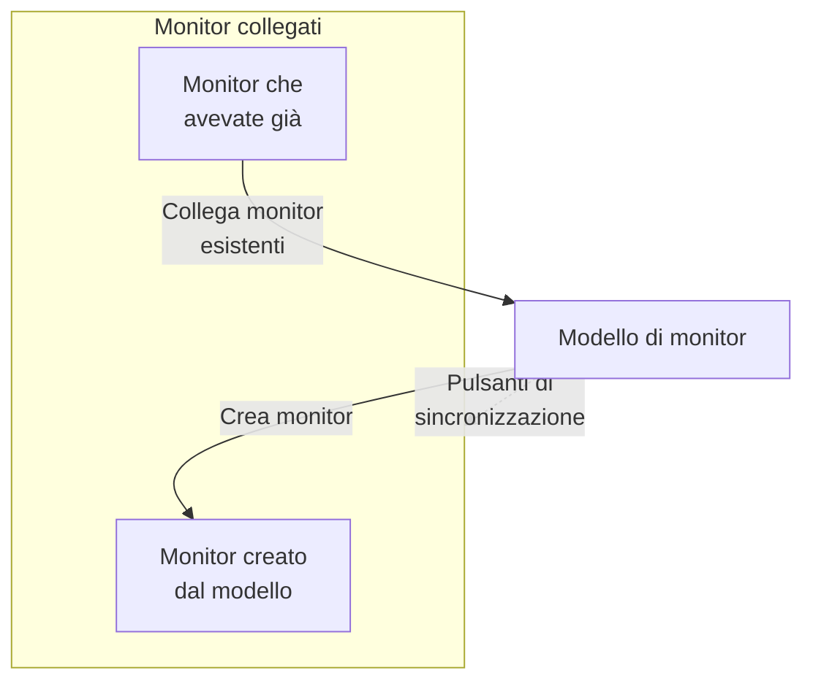

# Modelli di monitor

Un modello di monitor è una configurazione di monitor salvata (un tipo, criteri, un intervallo, etichette e valori predefiniti dei campi personalizzati) da cui creare monitor con un clic. I monitor creati da esso, o collegati a esso, restano connessi: modificate il modello, poi sincronizzate la modifica su tutti. Usate i modelli quando molti monitor devono comportarsi allo stesso modo, come lo stesso controllo di salute su ogni servizio, o gli stessi controlli API in produzione e in staging.

:::cards
- [Creare un modello](#creare-un-modello): Quattro passaggi, come Crea monitor.
- [Creare monitor da un modello](#creare-monitor-da-un-modello): Un clic, oppure collegate monitor che avete già.
- [Sincronizzare le modifiche](#sincronizzare-le-modifiche-sui-monitor-collegati): Cosa copia ogni pulsante di sincronizzazione.
- [Mantenere valori propri di ogni monitor](#mantenere-valori-propri-di-ogni-monitor): Proteggere una destinazione o delle intestazioni da una sincronizzazione.
:::

## Come funzionano i modelli

Un modello non sorveglia nulla da solo. I monitor vengono creati da esso, o collegati a esso, e la pagina del modello li elenca come **Monitor collegati**. Quando modificate il modello, nulla cambia su quei monitor finché non sincronizzate: ogni pulsante di sincronizzazione copia una parte del modello su ogni monitor collegato, e i campi che proteggete mantengono il valore proprio di ciascun monitor.



## Prima di iniziare

- **Un ruolo che può creare modelli**: Project Owner, Project Admin, Project Member, Monitor Admin o Monitor Member, oppure un ruolo personalizzato con il permesso Create Monitor Template. Modificare un modello richiede gli stessi ruoli, o il permesso Edit Monitor Template.
- **Il permesso di aggiornare i monitor collegati.** Una sincronizzazione scrive su ogni monitor collegato a vostro nome, e salta i monitor che i vostri permessi non coprono.

## Creare un modello

:::steps
### Aprire i modelli

Andate in **Monitor → Impostazioni → Modelli** e fate clic su **Crea: Monitor Modello**.

### Dare un nome al modello

In **Informazioni del modello**, inserite un **Nome del modello**, come `Production API Health`, e una **Descrizione del modello**, poi fate clic su **Avanti**.

### Impostare i valori predefiniti del monitor

In **Impostazioni predefinite del monitor**, scegliete il **Tipo di monitor**, con lo stesso selettore di Crea monitor. Se volete, inserite un **Nome predefinito del monitor**; se resta vuoto, ogni monitor prende il nome della risorsa che sorveglia. **Descrizione predefinita del monitor** ed **Etichette** attendono sotto **Altri campi**. Fate clic su **Avanti**.

### Impostare i criteri e l'intervallo

In **Criteri**, compilate cosa controllare e i criteri, come in [Crea monitor](/docs/monitor/create-monitor#criteri). La scheda **Template sync settings** in alto vi permette di proteggere i campi dalle sincronizzazioni (vedete [Mantenere valori propri di ogni monitor](#mantenere-valori-propri-di-ogni-monitor)). Per un tipo di monitor controllato dalle sonde, l'ultimo passaggio, **Intervallo**, chiede l'**Intervallo di monitoraggio**. Fate clic su **Crea: Monitor Modello** all'ultimo passaggio.
:::

Il modello viene aggiunto all'elenco. Apritelo per vedere la sua pagina, con una scheda per ogni parte: **Informazioni del modello**, **Impostazioni predefinite del monitor**, **Criteri di monitoraggio**, **Intervallo di monitoraggio** (con **Accordo minimo tra sonde**), **Etichette**, **Custom Field Defaults** (quando il progetto ha campi personalizzati per i monitor) e **Monitor collegati**. Ogni parte si modifica nella propria scheda, per esempio con **Modifica: Criteri** o **Modifica: Intervallo**.

## Creare monitor da un modello

- **Nuovo monitor.** Fate clic su **Crea monitor** nella riga del modello nell'elenco, oppure su **Crea Monitor da modello** nella sua pagina. **Crea monitor** si apre con il tipo e le impostazioni del modello già compilati; cambiate ciò che serve, poi createlo. Il nuovo monitor è collegato al modello.
- **Monitor che avete già.** In **Monitor collegati**, fate clic su **Collega monitor esistenti** e sceglieteli. Mantengono le loro impostazioni finché non sincronizzate.

I valori impostati in **Custom Field Defaults** vengono scritti su ogni monitor creato dal modello, compresi i monitor che le regole di importazione automatica e le politiche di avviso creano da esso.

## Sincronizzare le modifiche sui monitor collegati

Modificare un modello cambia solo il modello. Per copiare una modifica sui monitor collegati, usate il pulsante di sincronizzazione della scheda che avete modificato. Ogni pulsante indica quanti monitor raggiunge, come **Sync Criteria to 3 Linked Monitors**, ed è disattivato finché nulla è collegato. Una sincronizzazione non si può annullare.

| Pulsante | Copia su ogni monitor collegato | Lascia invariato |
| --- | --- | --- |
| **Sincronizza criteri con i monitor collegati** | I criteri e le impostazioni del passaggio, come destinazioni e opzioni della richiesta, tranne i campi protetti | L'intervallo di monitoraggio, l'accordo minimo tra sonde, il nome, la descrizione, le etichette e i valori dei campi personalizzati |
| **Sincronizza intervallo con i monitor collegati** | L'intervallo di monitoraggio e l'accordo minimo tra sonde | I criteri, il nome, la descrizione, le etichette e i valori dei campi personalizzati |
| **Sincronizza etichette con i monitor collegati** | Le etichette, e nient'altro | Tutto il resto |
| **Sync Custom Fields to Linked Monitors** | I campi personalizzati per cui il modello ha un valore predefinito, al posto di quello che ogni monitor aveva | I campi personalizzati che il modello lascia vuoti, e tutto il resto |

Per sincronizzare un solo monitor, fate clic su **Sincronizza dal modello** nella sua riga in **Monitor collegati**. Questo copia i criteri e le impostazioni del passaggio (tranne i campi protetti), l'intervallo di monitoraggio, l'accordo minimo tra sonde e le etichette, e lascia invariati il nome, la descrizione e i valori dei campi personalizzati del monitor. **Scollega dal modello** disconnette un monitor; mantiene le sue impostazioni.

Dopo una sincronizzazione, un riepilogo indica quanti monitor sono stati aggiornati. **Sincronizzato parzialmente** significa che alcuni monitor collegati hanno ancora la configurazione precedente, di solito perché i vostri permessi non li coprono.

## Mantenere valori propri di ogni monitor

Una sincronizzazione dei criteri copia anche le impostazioni del passaggio, come destinazioni, intestazioni della richiesta e timeout, a meno che non proteggiate quei campi. Proteggete un campo per far sì che ogni monitor collegato mantenga il proprio valore.

:::steps
### Aprire il modello

Andate in **Monitor → Impostazioni → Modelli** e aprite il modello.

### Modificarne i criteri

Nella scheda **Criteri di monitoraggio**, fate clic su **Modifica: Criteri**.

### Proteggere i campi

In **Template sync settings**, spuntate **Do not sync this field** accanto a ogni campo che volete mantenere sui monitor collegati.

### Salvare

Salvate le modifiche. La scheda **Criteri di monitoraggio**, e la conferma di entrambe le sincronizzazioni qui sotto, elencano i campi protetti.

### Sincronizzare

Usate **Sincronizza criteri con i monitor collegati**, oppure **Sincronizza dal modello** su un singolo monitor collegato.
:::

Per esempio, proteggete **Monitor destination** e **Request headers** su un modello API. I monitor di produzione e di staging mantengono i propri URL e intestazioni, mentre entrambi ricevono i criteri aggiornati del modello e le altre impostazioni non protette.

Le opzioni disponibili dipendono dal tipo di monitor. Comprendono destinazioni e porte, opzioni delle richieste HTTP, connessioni ai database, impostazioni DNS, selettori dell'infrastruttura e query di telemetria. Le credenziali correlate, come un certificato client e la sua chiave privata, vengono mantenute insieme.

### Come si comportano le esclusioni

- I campi spuntati mantengono il valore attuale di ogni monitor esistente, compreso un valore vuoto o non impostato. Le intestazioni della richiesta e le altre raccolte vengono conservate per intero.
- I campi non spuntati continuano a sincronizzarsi dal modello. Togliete la spunta a un campo protetto e salvate per copiarne il valore del modello alla sincronizzazione successiva.
- Le esclusioni valgono per le sincronizzazioni in blocco e per quelle singole. Sono salvate sul modello, non scelte di volta in volta a ogni sincronizzazione.
- I nuovi monitor partono comunque con i valori dei campi del modello. Le esclusioni riguardano solo la sincronizzazione dei monitor esistenti.
- I criteri si sincronizzano sempre. Una sincronizzazione dei soli criteri lascia invariati l'intervallo di monitoraggio, le etichette e le altre impostazioni a livello di monitor.
- I modelli esistenti non hanno esclusioni di campi finché non le configurate. I monitor di dispositivi di rete continuano a mantenere automaticamente il proprio collegamento al dispositivo.

Per i modelli con più passaggi, i valori protetti vengono abbinati tramite gli ID dei passaggi. Anche i monitor a passaggio singolo creati in modo indipendente possono ricevere un modello a passaggio singolo. Se un passaggio protetto non si può abbinare, la sincronizzazione viene rifiutata prima di aggiornare qualsiasi monitor, così un passaggio nuovo o riordinato non può copiare per errore la destinazione o le credenziali di un altro passaggio.

> [!IMPORTANT]
> Prima di cambiare il tipo di monitor di un modello salvato (con **Modifica: Impostazioni predefinite del monitor**), rimuovete in **Modifica: Criteri** le esclusioni che non si applicano al nuovo tipo. Tutte le esclusioni di un modello devono esistere per il suo tipo di monitor.

## Configurazione tramite API

Ogni passaggio del modello accetta un array `doNotSyncFields` nel suo oggetto `MonitorStep.value`. Per un monitor API, proteggete la sua destinazione e l'intera raccolta di intestazioni con:

```json title="monitorSteps (excerpt)"
{
  "_type": "MonitorSteps",
  "value": {
    "monitorStepsInstanceArray": [
      {
        "_type": "MonitorStep",
        "value": {
          "id": "<step id>",
          "doNotSyncFields": ["monitorDestination", "requestHeaders"]
        }
      }
    ]
  }
}
```

Omettete l'array o impostatelo a `[]` per sincronizzare tutte le impostazioni del passaggio supportate. I nomi di campo non supportati e i campi che non si applicano al tipo di monitor del modello vengono rifiutati. L'array del modello controlla la sincronizzazione; metadati simili su un monitor collegato non lo sostituiscono.

:::details Nomi di campo per doNotSyncFields, per tipo di monitor
| Tipo di monitor | Nomi di campo |
| --- | --- |
| Sito web, API, Ping, IP, Porta, SSL Certificate, NTP | `monitorDestination`, `requestTimeoutInMs`, `retryCount` |
| Solo API | `requestHeaders`, `requestType`, `requestBody` |
| Sito web e API | `doNotFollowRedirects`, `allowSelfSignedCertificates`, `tlsClientAuthentication` (il certificato client, la chiave e la passphrase insieme) |
| Porta, NTP | `monitorDestinationPort` |
| Synthetic Monitor, Custom JavaScript Code | `customCode` |
| Synthetic Monitor | `browserTypes`, `screenSizeTypes`, `retryCountOnError` |
| DNS | `dnsMonitor.queryName`, `dnsMonitor.recordType`, `dnsMonitor.resolver` (il server DNS e la porta insieme), `dnsMonitor.timeout`, `dnsMonitor.retries` |
| Dominio | `domainMonitor.domainName`, `domainMonitor.lookupMethod`, `domainMonitor.timeout`, `domainMonitor.retries` |
| DNSSEC | `dnssecMonitor.domainName`, `dnssecMonitor.resolvers`, `dnssecMonitor.checkNameserverConsistency`, `dnssecMonitor.signatureExpiryWarningDays`, `dnssecMonitor.timeout`, `dnssecMonitor.retries` |
| SQL Query | `sqlMonitor.connection`, `sqlMonitor.connectionTimeoutInMs`, `sqlMonitor.statementTimeoutInMs`, `sqlMonitor.query`, `sqlMonitor.maxRows` |
| Database Health | `databaseMonitor.connection`, `databaseMonitor.connectionTimeoutInMs`, `databaseMonitor.statementTimeoutInMs`, `databaseMonitor.enabledMetricGroups` |
| External Status Page | `externalStatusPageMonitor.statusPageUrl`, `externalStatusPageMonitor.provider`, `externalStatusPageMonitor.components`, `externalStatusPageMonitor.timeout`, `externalStatusPageMonitor.retries` |
| Registri, Security Events, Tracce, IA / LLM, Metriche, Eccezioni | `logMonitor`, `securityEventsMonitor`, `traceMonitor`, `llmMonitor`, `metricMonitor`, `exceptionMonitor` (l'intera configurazione del monitor) |

I monitor dell'infrastruttura (Kubernetes, Docker Container, Host, Podman Container, Proxmox, Docker Swarm, Ceph, Array di storage, IoT Device) offrono il loro selettore di risorse, i filtri (tutti tranne Host), le query delle metriche e la finestra temporale della query. I loro nomi sono elencati in **Template sync settings** su un modello di quel tipo.
:::

## Risoluzione dei problemi

:::details Una sincronizzazione dice «Sincronizzato parzialmente»
Alcuni monitor collegati non sono stati aggiornati, di solito perché i vostri permessi non li coprono. Chiedete a qualcuno che può aggiornare ogni monitor collegato di eseguire di nuovo la sincronizzazione.
:::

:::details Una sincronizzazione fallisce con «a template step cannot be matched to an existing monitor step»
Un campo protetto non è stato abbinato a un passaggio di uno dei monitor, quindi la sincronizzazione si è fermata prima di modificarne uno. Date ai passaggi del modello gli stessi ID dei passaggi dei monitor, oppure usate un modello a passaggio singolo con monitor a passaggio singolo.
:::

:::details I pulsanti di sincronizzazione sono disattivati
Nessun monitor è ancora collegato al modello. Create un monitor da esso, oppure fate clic su **Collega monitor esistenti** in **Monitor collegati**.
:::

:::details Il salvataggio fallisce con «Unsupported do not sync field»
Un nome in `doNotSyncFields` non è un campo del tipo di monitor del modello. Confrontatelo con i nomi di campo qui sopra.
:::

## Passaggi successivi

:::cards
- [Creare un monitor](/docs/monitor/create-monitor): Il modulo che un modello compila.
- [Monitor API](/docs/monitor/api-monitor): Le impostazioni che un modello API porta con sé.
- [Segreti del monitor](/docs/monitor/monitor-secrets): Condividere credenziali tra monitor senza copiarle.
- [Passaggi del monitor in Terraform](/docs/terraform/monitor-steps): Gestire i monitor e i loro passaggi come codice.
:::
