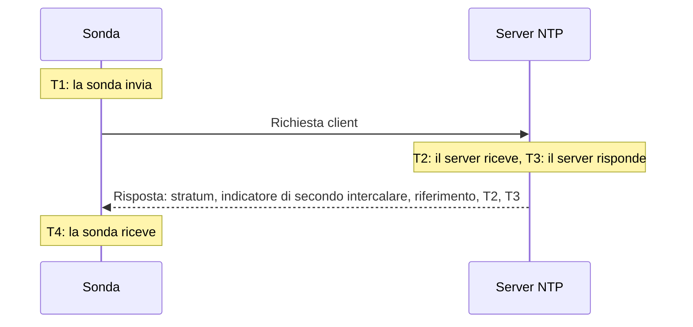

# Monitor NTP

Un monitor NTP verifica che un server dell'ora risponda sulla porta UDP 123 e fornisca un'ora affidabile: che sia sincronizzato, a uno stratum ragionevole, e che il suo orologio concordi con quello della sonda. Usalo per i server dell'ora che gestisci, come un orologio GPS nel data center o i server interni con cui si sincronizzano le tue macchine, e per i server pubblici da cui dipendi.

:::cards
- [Creare il monitor](#creare-un-monitor-ntp): Sei passaggi nella dashboard.
- [Cosa legge il controllo](#cosa-legge-il-controllo): Stratum, scostamento dell'orologio, indicatore di secondo intercalare e il resto della risposta.
- [Criteri di monitoraggio](#criteri-di-monitoraggio): Raggiungibilità, sincronizzazione, stratum e scostamento.
- [Risoluzione dei problemi](#risoluzione-dei-problemi): Quando il server funziona ma il monitor dice altro.
:::

## Come funziona

A ogni controllo, una sonda invia una richiesta client SNTP (NTP versione 4, modalità client) da una porta locale casuale alla porta UDP del server e attende la risposta. Conta solo una vera risposta a quella richiesta: la sonda inserisce 64 bit casuali nel timestamp di trasmissione della richiesta e ignora qualsiasi pacchetto che non li restituisca, che sia più corto di un pacchetto NTP o che non sia in modalità server. Una risposta vecchia a un controllo precedente, o una falsificata, non può mai far sembrare attivo un server spento.

Dai quattro timestamp la sonda calcola lo **scostamento dell'orologio**, ((T2 − T1) + (T3 − T4)) / 2: quanto l'orologio del server si discosta da quello della sonda. Uno scostamento positivo significa che il server è avanti. La formula presuppone che la richiesta e la risposta impieghino lo stesso tempo, quindi un percorso molto più lento in una direzione può falsare lo scostamento fino a metà del tempo di andata e ritorno.

> [!NOTE]
> Lo scostamento è misurato rispetto all'orologio della sonda stessa. Le sonde di OneUptime Cloud mantengono i loro orologi sincronizzati. Su una [sonda personalizzata](/docs/probe/custom-probe), mantieni sincronizzato anche l'orologio dell'host, con chrony o systemd-timesyncd, altrimenti un avviso di scostamento potrebbe riguardare la sonda e non il server.

A un server che risponde non viene chiesto di nuovo, anche quando risponde senza un'ora affidabile. Il silenzio, una porta rifiutata e una ricerca DNS non riuscita vengono ritentati con una nuova richiesta. Quando il server non risponde affatto, la sonda traccia anche il percorso fino a esso e allega ciò che ha trovato come **Network Path at Time of Failure**. Una sonda che ha perso la propria connessione di rete non riporta alcun risultato, quindi non può segnare il tuo server come offline.

## Prima di iniziare

- **Un ruolo che possa creare monitor**: Project Owner, Project Admin, Project Member, Monitor Admin o Monitor Member, oppure un ruolo personalizzato con il permesso Create Monitor.
- **Una sonda che raggiunga la porta UDP 123 del server.** Qualsiasi sonda può controllare un server dell'ora pubblico. Per un server su una rete privata, usa una [sonda personalizzata](/docs/probe/custom-probe) all'interno di quella rete. Un firewall davanti al server deve lasciar passare UDP, non solo TCP, dagli [indirizzi IP delle sonde di OneUptime Cloud](/docs/configuration/ip-addresses) o dalla tua sonda personalizzata.

## Creare un monitor NTP

:::steps
### Avviare un nuovo monitor

Vai su **Monitor** e fai clic su **Crea monitor**. In **Tipo di monitor**, digita `ntp` nella casella di ricerca e scegli **NTP**. È elencato anche in **Altri tipi di monitor**, nel gruppo Rete.

### Dargli un nome

Inserisci un **Nome**, come `Server dell'ora GPS`, quindi fai clic su **Avanti**.

### Inserire il server

In **Server NTP**, inserisci il nome host o l'indirizzo IP del server, come `time.example.com` o `192.168.1.10`. La richiesta va alla porta 123. Per usare un'altra porta, apri **Altri campi** e imposta **Porta**.

### Testarlo

Fai clic su **Testa il monitor**, scegli una sonda in **Seleziona sonda** e fai clic su **Esegui test**. **Risultato del test del monitor** mostra se il server ha risposto, se è sincronizzato, il suo stratum e di quanto si discosta il suo orologio.

### Rivedere i criteri

**Criteri del monitor** parte dai [criteri predefiniti](#criteri-predefiniti): offline quando il server non fornisce un'ora affidabile, online quando la fornisce. Modificali se necessario, quindi fai clic su **Avanti**.

### Scegliere le sonde e creare

Mantieni o modifica le **Sonde** e l'**Intervallo di monitoraggio** (parte da **Ogni 5 minuti**), quindi fai clic su **Crea monitor**. Si apre la pagina del monitor.
:::

## Opzioni di configurazione

| Campo | Predefinito | Cosa inserire |
| --- | --- | --- |
| **Server NTP** | Nessuno | Il server, come `time.example.com`, `192.168.1.10` o `2001:db8::123`. Inserisci solo l'host, senza `udp://`. Una porta scritta dopo l'host, come `time.example.com:1123`, viene usata al posto di **Porta**. |
| **Porta** (in **Altri campi**) | `123` | La porta UDP su cui il server risponde a NTP, da `1` a `65535`. Lasciala vuota per `123`. |
| **Timeout della richiesta (secondi)** (in **Altri campi**) | `5` | Quanto attende la risposta un tentativo, ricerca DNS inclusa. Il massimo è 60 secondi. |
| **Tentativi in caso di errore** (in **Altri campi**) | Predefinito della sonda, di solito `3` | Quante volte ritentare un tentativo che non ha ricevuto risposta. Il massimo è 3. |

**Tentativi in caso di errore** conta i tentativi _dopo_ il primo, quindi `0` esegue il controllo una volta e `2` fino a tre volte, con una pausa di un secondo tra un tentativo e l'altro. Se lasciato vuoto, usa il valore predefinito della sonda: 3, a meno che `PROBE_MONITOR_RETRY_LIMIT` della sonda non indichi altro.

## Cosa legge il controllo

La pagina del monitor mostra l'ultimo controllo di ogni sonda:

| Campo | Cosa significa |
| --- | --- |
| **Sincronizzato** | Se il server ha risposto con stratum da 1 a 15, senza l'allarme nel suo indicatore di secondo intercalare e con timestamp reali nella risposta. |
| **Scostamento dell'orologio** | Quanto l'orologio del server si discosta da quello della sonda, e in quale direzione. Un server sano resta entro pochi millisecondi. |
| **Stratum** | A quanti salti si trova il server da un orologio di riferimento: 1 per un server con la propria sorgente GPS o atomica, 2 per uno che si sincronizza con un server di stratum 1, e così via. 16 significa non sincronizzato. |
| **Riferimento** | Con cosa si sincronizza il server: un nome di sorgente come `GPS`, `PPS` o `NIST` allo stratum 1, l'indirizzo del server a monte dallo stratum 2 in poi. |
| **Indicatore di secondo intercalare** | 0 quando nessun secondo intercalare è in arrivo, 1 o 2 quando ne verrà aggiunto o tolto uno a fine giornata, 3 quando il server segnala che il suo orologio non è sincronizzato. |
| **Dispersione radice** | La stima del server stesso di quanto la sua ora potrebbe discostarsi dall'ora reale. Cresce mentre il server non riesce a raggiungere la sua sorgente. ntpd smette di fidarsi di un server quando metà del suo ritardo radice più questo valore supera 1,5 secondi. |
| **Ritardo radice** | L'andata e ritorno dal server al suo orologio di riferimento. |
| **Tempo di risposta** | Dall'invio della richiesta da parte della sonda alla ricezione della risposta, senza la ricerca DNS. |
| **Ora del server** | L'orologio del server quando ha inviato la risposta. |

Un server che si rifiuta di dare l'ora invia invece un **kiss-o'-death**: una risposta allo stratum 0 con un codice di quattro lettere. I codici più comuni sono `RATE` (il server limita la frequenza della sonda), `DENY` e `RSTR` (le sue regole di accesso rifiutano la sonda) e `INIT` (non si è ancora sincronizzato). Il controllo mostra il codice e considera il server come rispondente ma non sincronizzato.

## Criteri di monitoraggio

I criteri decidono quando il server è considerato online, degradato o offline, e se questo dichiara un incidente o crea un avviso. Ogni criterio verifica uno o più filtri:

| Filtro | Condizioni | Cosa verifica |
| --- | --- | --- |
| **NTP Is Online** | **Vero**, **Falso** | Se il server ha risposto alla richiesta della sonda con una risposta NTP. Un kiss-o'-death è una risposta. |
| **NTP Is Synchronized** | **Vero**, **Falso** | Se il server che ha risposto fornisce un'ora sincronizzata. Quando il server non risponde, questo filtro non viene verificato; per questo usa **NTP Is Online**. |
| **NTP Stratum** | **Greater Than**, **Greater Than Or Equal To**, **Less Than**, **Less Than Or Equal To**, **Equal To**, **Not Equal To** | Lo stratum del server. Lo 0 di un kiss-o'-death conta come 16, non sincronizzato. |
| **NTP Clock Offset (in ms)** | **Greater Than**, **Less Than**, **Greater Than Or Equal To**, **Less Than Or Equal To** | Quanto l'orologio del server si discosta da quello della sonda, in entrambe le direzioni. |
| **NTP Response Time (in ms)** | **Greater Than**, **Less Than**, **Greater Than Or Equal To**, **Less Than Or Equal To** | Dalla richiesta alla risposta. |
| **NTP Root Dispersion (in ms)** | **Greater Than**, **Less Than**, **Greater Than Or Equal To**, **Less Than Or Equal To** | La stima del server stesso del suo errore massimo. |

Con due o più filtri, **Condizione di corrispondenza** decide se devono corrispondere **Tutti** o ne basta **Qualsiasi**. Le **Azioni** di un criterio decidono cosa fa: cambiare lo stato del monitor, creare un avviso, dichiarare un incidente o una qualsiasi combinazione.

### Criteri predefiniti

Un nuovo monitor NTP parte con due criteri:

- **Offline** — il server non risponde, non è sincronizzato o il suo orologio è a `1000` ms o più da quello della sonda. Il monitor viene segnato come **Offline** e viene creato un incidente chiamato "_nome del monitor_ is not serving good time". Si risolve da solo quando il server torna a fornire un'ora affidabile.
- **Online** — il server risponde, è sincronizzato e il suo orologio è entro `1000` ms da quello della sonda. Il monitor viene segnato come **Operativo**.

I criteri vengono verificati dall'alto verso il basso, e il primo che corrisponde decide cosa succede. Un server che risponde con l'ora sbagliata viene trattato di proposito come non disponibile: ogni client che lo segue prenderebbe anche quell'ora.

### Valutare su un periodo di tempo

**Valuta questo criterio su un periodo di tempo** è una casella di controllo sotto ogni filtro NTP. Attivala per giudicare una finestra di controlli passati invece dell'ultimo: scegli un'aggregazione in **Valuta** e una finestra, da 2 a 60 minuti, in **Per gli ultimi (in minuti)**. Solo i controlli a cui il server ha risposto hanno uno stratum, uno scostamento e una dispersione radice, quindi una finestra di silenzio non ha dati per quei filtri, e **Se nessun dato** decide cosa succede.

### Criteri di esempio

| Obiettivo | Filtro | Condizione | Valore |
| --- | --- | --- | --- |
| Avvisare quando un server GPS ripiega su una sorgente di rete | **NTP Stratum** | **Greater Than** | `1` |
| Avvisare quando l'orologio deriva | **NTP Clock Offset (in ms)** | **Greater Than** | `100` |
| Avvisare quando il margine di errore del server cresce | **NTP Root Dispersion (in ms)** | **Greater Than** | `500` |
| Avvisare quando le risposte diventano lente | **NTP Response Time (in ms)** | **Greater Than** | `1000` |

## Risoluzione dei problemi

:::details Il server funziona, ma il monitor dice che non ha risposto
La richiesta o la risposta è andata persa lungo il percorso. Un firewall che consente TCP ma non UDP, una regola `restrict` di ntpd o `allow` di chrony che esclude l'indirizzo della sonda, o un server che ascolta solo su un'interfaccia interna producono tutti questo sintomo. **Network Path at Time of Failure** mostra fin dove è arrivato il percorso. Lascia passare la sonda, oppure controlla il server da una [sonda personalizzata](/docs/probe/custom-probe) all'interno della rete.
:::

:::details Il monitor dice che il server ha rifiutato la richiesta
L'host ha risposto che nulla è in ascolto su quella porta UDP (ICMP port unreachable): il servizio NTP è fermo o ascolta su un'altra porta. Avvia il servizio, oppure imposta in **Porta** quella che usa.
:::

:::details Il server risponde con un kiss-o'-death
`RATE` significa che il server limita la frequenza della sonda. La sonda chiede una volta per controllo, quindi un **Intervallo di monitoraggio** più lungo, o l'esenzione degli indirizzi della sonda dal limite del server, risolve il problema. `DENY` e `RSTR` significano che le regole di accesso del server rifiutano la sonda. `INIT` e `STEP` significano che il server non si è ancora sincronizzato, il che è normale per qualche minuto dopo l'avvio.
:::

:::details Ogni monitor NTP su una sonda mostra uno scostamento simile
È l'orologio della sonda a essere fuori, non quello dei server. Verifica che l'host della sonda mantenga il suo orologio sincronizzato, oppure esegui i monitor su un'altra sonda.
:::

:::details Lo scostamento salta da un controllo all'altro
La sonda è lontana dal server, oppure il percorso è più lento in una direzione che nell'altra. Usa una sonda più vicina al server, oppure giudica lo scostamento su qualche minuto con **Valuta questo criterio su un periodo di tempo** e **Media**.
:::

## Passi successivi

:::cards
- [Monitor ping](/docs/monitor/ping-monitor): Verificare che l'host stesso sia raggiungibile.
- [Monitor porta](/docs/monitor/port-monitor): Verificare i servizi TCP sullo stesso host.
- [Sonde personalizzate](/docs/probe/custom-probe): Verificare i server dell'ora nella tua rete.
- [Modelli di incidenti e avvisi](/docs/monitor/incident-alert-templating): Mettere lo stratum e lo scostamento nel titolo di un incidente.
:::
