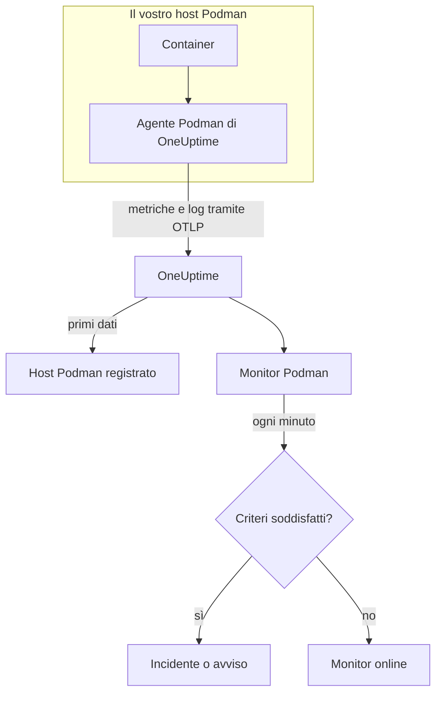

# Monitor Podman

Un monitor Podman sorveglia i container di un host Podman e vi avvisa quando un container si surriscalda, esaurisce la memoria o continua a riavviarsi. Legge le metriche che l'agente Podman di OneUptime invia dall'host, quindi niente viene sondato dall'esterno: installate l'agente, poi create il monitor da un modello o dalla vostra query.

:::cards
- [Creare il monitor](#creare-un-monitor-podman): Sei passaggi nella dashboard.
- [Modelli](#modelli-di-avviso-pronti): Cinque avvisi pronti, un incidente per container.
- [Metriche](#metriche-raccolte): Cosa raccoglie l'agente e cosa significa ogni metrica.
- [Log](#log-raccolti): I log dei container e il driver di log di cui hanno bisogno.
:::

## Come funziona

L'agente Podman di OneUptime viene eseguito come container sull'host. Ogni 30 secondi legge le statistiche dei container tramite il socket API compatibile con Docker di Podman, segue i file di log dei container e invia entrambi a OneUptime tramite OTLP. I primi dati di un host lo registrano in OneUptime.

Un monitor Podman è legato a un host. Ogni minuto esegue la sua query sulle metriche dei container di quell'host e confronta il risultato con i suoi criteri.



## Prima di iniziare

- **Installate l'agente Podman** sull'host. La [guida all'agente Podman](/docs/telemetry/podman-host) spiega come installarlo, aggiornarlo e verificarlo. L'agente ha bisogno del socket API di Podman in `/run/podman/podman.sock`.
- **Verificate che l'host sia registrato.** Compare in **Prodotti → Infrastruttura → Podman → Tutti gli host**, con il nome del `PODMAN_HOST_NAME` dell'agente, appena arrivano i suoi primi dati.
- **Per i log dei container**, eseguite i container con il driver di log `k8s-file`. Vedete [Requisito del driver di log](#requisito-del-driver-di-log).

## Creare un monitor Podman

:::steps
### Iniziare un nuovo monitor

Andate in **Monitor** e fate clic su **Crea monitor**.

### Scegliere Podman Container

In **Tipo di monitor**, fate clic su **Altri tipi di monitor** e scegliete **Podman Container** in **Infrastruttura**, oppure digitate `podman` nella casella di ricerca. Inserite un **Nome** – viene usato nei titoli di incidenti e avvisi – e fate clic su **Avanti**.

### Scegliere l'host

In **Podman Monitor Configuration**, scegliete l'host da **Podman Host**. Ogni host che ha inviato dati è nell'elenco.

### Scegliere cosa sorvegliare

Scegliete una delle tre schede:

- **Quick Setup** – fate clic su un [modello](#modelli-di-avviso-pronti). Imposta la metrica, l'aggregazione, l'intervallo di tempo e le soglie, e sostituisce i criteri più sotto con i propri. Potete comunque cambiare l'**Intervallo di tempo**.
- **Custom Metric** – scegliete una metrica da **Podman Metric**, poi impostate **Aggregazione** e **Intervallo di tempo**. **Nome del container** e **Immagine del container** la restringono ad alcuni container.
- **Avanzato** – costruite voi query e formule in **Seleziona metriche**. Usate **Group by** `resource.container.name` per giudicare ogni container separatamente.

### Rivedere i criteri

Aprite ogni criterio in **Criteri del monitor** e verificatene **Metrica**, **Aggregazione**, **Condizione** e **Threshold**. Un modello li compila. Con **Custom Metric** o **Avanzato**, il monitor parte con i [criteri predefiniti](#criteri-predefiniti), che notano solo una metrica che scende a zero, quindi impostate la vostra soglia.

### Creare il monitor

Fate clic su **Crea monitor**. OneUptime apre la pagina del monitor e lo valuta ogni minuto. Gli incidenti e gli avvisi che genera compaiono anche nelle pagine **Incidenti** e **Avvisi** dell'host.
:::

> [!TIP]
> Per configurare più modelli alla volta, aprite l'host da **Prodotti → Infrastruttura → Podman** e andate in **Recommendations**. Scegliete i modelli che volete, scegliete chi viene avvisato, e OneUptime crea un monitor per modello.

## Impostazioni del monitor

| Campo | Scheda | Cosa fa |
| --- | --- | --- |
| **Podman Host** | Tutte | Obbligatorio. Limita ogni query al `resource.host.name` dell'host. OneUptime aggiunge anche `resource.container.runtime = podman` a ogni query. |
| **Podman Metric** | Custom Metric | Una metrica del catalogo dell'agente, raggruppata in CPU, memoria, rete, I/O a blocchi e container. |
| **Nome del container** | Custom Metric, Avanzato | Facoltativo. Corrispondenza esatta su `resource.container.name`, per esempio `my-container`. |
| **Immagine del container** | Custom Metric, Avanzato | Facoltativo. Corrispondenza esatta su `resource.container.image.name`, per esempio `nginx:latest`. |
| **Aggregazione** | Custom Metric | Come vengono combinati i campioni: **Media**, **Massimo**, **Minimo**, **Somma** o **Conteggio**. Parte dall'aggregazione abituale della metrica. |
| **Intervallo di tempo** | Tutte | La finestra mobile che la query legge, da **Past 1 Minute** a **Past 365 Days**. Un nuovo monitor parte da **Past 1 Minute**; i modelli impostano la propria. |
| **Seleziona metriche** | Avanzato | Il costruttore di query: **Metrica**, **Aggregate by**, **Filter by attributes**, **Group by**, più **Aggiungi metrica** e **Aggiungi formula** per combinare le query. |

## Modelli di avviso pronti

**Quick Setup** offre cinque modelli. Ognuno costruisce un monitor completo: una query raggruppata per `resource.container.name`, un criterio che scatta e uno che ripristina. Ogni container viene giudicato separatamente e riceve il proprio incidente e il proprio avviso. Le soglie sono punti di partenza modificabili.

Un criterio scatta solo quando la condizione vale per ogni minuto della sua finestra, e si ripristina il 10% oltre la soglia, così un valore che oscila sul limite non cambia stato di continuo.

| Modello | Gravità | Sorveglia | Scatta quando | Si ripristina quando |
| --- | --- | --- | --- | --- |
| High Container CPU Usage | Warning | `container.cpu.utilization`, Avg per container, ultimi 5 minuti | Sopra 80 (% di un core) | A 72 o meno |
| High Container Memory Usage | Warning | `container.memory.percent`, Avg per container, ultimi 5 minuti | Sopra l'85% | Al 76,5% o meno |
| High Container Restart Count | Critico | `container.restarts`, Max per container, ultimi 5 minuti | Sopra 5 riavvii in totale | 4,5 o meno |
| High Container Process Count | Warning | `container.pids.count`, Max per container, ultimi 5 minuti | Sopra 500 | A 450 o meno |
| Container Restarted (Low Uptime) | Critico | `container.uptime`, Min per container, ultimo 1 minuto | Sotto i 120 secondi | A 132 secondi o più |

**Gravità** è l'etichetta che mostra il selettore. L'incidente e l'avviso creati da un modello partono dalla gravità di incidente e di avviso più alta del vostro progetto; cambiatele nei criteri.

I due modelli in percentuale usano **Media**: le loro metriche sono già percentuali per container, quindi la media di un minuto è la lettura sostenuta. Il numero di riavvii e il numero di processi usano **Massimo**, dove un singolo campione oltre la soglia è il segnale.

> [!NOTE]
> `container.cpu.utilization` è il numero stampato da `podman stats`: il 100% è un core di CPU intero, non l'intera quota di CPU del container. Un container con più core segna ben oltre 100 quando è sano, quindi alzate la soglia per quei container.

> [!NOTE]
> `container.restarts` è un totale progressivo tenuto da Podman, non un conteggio dei riavvii nella finestra. Per questo **High Container Restart Count** resta aperto finché il container non viene ricreato, il che azzera il conteggio.

> [!CAUTION]
> `container.uptime` esiste solo per i container in esecuzione. Un container che si ferma e resta fermo non invia dati, quindi **Container Restarted (Low Uptime)** coglie riavvii e nuovi deploy, non uno spegnimento definitivo. Un container pensato per girare meno di due minuti resta in stato di avviso per tutta la sua vita.

Non esiste un modello per la limitazione della CPU. Le metriche di limitazione raccolte dall'agente crescono soltanto, e un avviso «limitato almeno una volta» scatterebbe una volta e non si risolverebbe mai. Vengono comunque raccolte entrambe, quindi potete mostrarle nei grafici.

## Metriche raccolte

L'agente usa il receiver OpenTelemetry `docker_stats` puntato sul socket compatibile con Docker di Podman, `/run/podman/podman.sock`, ogni 30 secondi. Le metriche di ogni container portano la sua identità come attributi di risorsa: `resource.container.name`, `resource.container.image.name`, `resource.container.id`, `resource.container.runtime` (`podman`) e `resource.host.name`.

### CPU

| Metrica | Descrizione |
| --- | --- |
| `container.cpu.utilization` | Utilizzo della CPU del container, dove il 100% è un core di CPU intero. |
| `container.cpu.usage.total` | Tempo di CPU usato dall'avvio del container, in nanosecondi. Un contatore sull'intera vita. |
| `container.cpu.throttling_data.throttled_time` | Nanosecondi in cui il container è stato limitato dal suo limite di CPU. Un contatore sull'intera vita. |
| `container.cpu.throttling_data.throttled_periods` | Periodi di limitazione dall'avvio del container. Un contatore sull'intera vita. |

### Memoria

| Metrica | Descrizione |
| --- | --- |
| `container.memory.usage.total` | Memoria in uso, in byte. |
| `container.memory.usage.limit` | Limite di memoria, in byte. |
| `container.memory.percent` | Utilizzo della memoria come percentuale del limite del container, o della memoria dell'host quando il container non ha limite. |

### Rete

| Metrica | Descrizione |
| --- | --- |
| `container.network.io.usage.rx_bytes` | Byte ricevuti. Un contatore sull'intera vita. |
| `container.network.io.usage.tx_bytes` | Byte inviati. Un contatore sull'intera vita. |

### I/O a blocchi

| Metrica | Descrizione |
| --- | --- |
| `container.blockio.io_service_bytes_recursive.read` | Byte letti dai dispositivi a blocchi. |
| `container.blockio.io_service_bytes_recursive.write` | Byte scritti sui dispositivi a blocchi. |

### Container

| Metrica | Descrizione |
| --- | --- |
| `container.uptime` | Secondi dall'avvio del container. La comunicano solo i container in esecuzione. |
| `container.restarts` | Quante volte il container si è riavviato. Un totale progressivo. |
| `container.pids.count` | Task nel container. Il controller pids del cgroup conta i thread oltre ai processi. |

L'elenco **Podman Metric** offre anche `container.cpu.usage.percpu`, `container.memory.rss`, `container.memory.cache` e i contatori dei pacchetti di rete. La configurazione dell'agente distribuita non li attiva, quindi controllate la pagina **Metriche** dell'host prima di basarvi su di essi. `container.cpu.throttling_data.throttled_periods` non è nell'elenco; interrogatela da **Avanzato**.

## Criteri di monitoraggio

Un criterio confronta una delle query o formule del monitor con una soglia. I criteri di un monitor Podman non hanno un **Tipo di filtro**: ogni regola controlla il valore della metrica, con questi campi.

| Campo | Cosa fa |
| --- | --- |
| **Metrica** | La query o la formula da controllare, tramite il suo nome di variabile. |
| **Aggregazione** | Come i valori della finestra diventano un'unica risposta: **Media**, **Somma**, **Maximum Value**, **Minimum Value**, **All Values** (ogni valore deve corrispondere) o **Any Value** (ne basta uno). |
| **Condizione** | **Greater Than**, **Less Than**, **Greater Than Or Equal To**, **Less Than Or Equal To** o **Equal To**, oppure una condizione di anomalia: **Anomalously High**, **Anomalously Low** o **Anomalous**. |
| **Threshold** | Il valore con cui confrontare. Accanto c'è un elenco di unità quando la metrica ha un'unità. Non viene mostrato per le condizioni di anomalia. |
| **Sensibilità** | Solo condizioni di anomalia. **Bassa** (4σ), **Media** (3σ, il predefinito) o **Alta** (2σ). |
| **Finestra di riferimento** | Solo condizioni di anomalia. 14 giorni (il predefinito), 28, 60 o 90 giorni di storico. |
| **Se nessun dato** | In **Altri campi**. Cosa succede quando la finestra non ha campioni: **Ignore** (predefinito), **Treat As Zero** o **Trigger**. |

Le condizioni di anomalia confrontano ogni valore con la stessa ora della settimana nella baseline. Restano in uno stato «Learning», e non generano nulla, finché la finestra di riferimento non contiene abbastanza storico.

Ogni criterio indica anche cosa fare quando corrisponde: cambiare lo stato del monitor, creare un avviso o dichiarare un incidente. I criteri vengono controllati dall'alto verso il basso, e decide il primo che corrisponde.

### Criteri predefiniti

Un monitor che non create da un modello parte con due criteri:

| Ordine | Criterio | Corrisponde quando | Poi |
| --- | --- | --- | --- |
| 1 | Check if _monitor name_ is offline | Un valore qualsiasi della prima query è `0` | Segna il monitor come **Offline** e dichiara l'incidente «_monitor name_ is offline», che si risolve da solo quando il monitor si riprende. |
| 2 | Check if _monitor name_ is online | Un valore qualsiasi è sopra `0` | Segna il monitor come **Operativo**. |

> [!IMPORTANT]
> Il silenzio non corrisponde a nessuno dei due criteri: un host che smette di inviare dati lascia il monitor com'era. Per essere avvisati quando i dati si fermano, impostate **Se nessun dato** su **Trigger** in un criterio. Il tempo in cui OneUptime stesso non stava ricevendo non è mai assenza di dati: un controllo la cui finestra lo contiene attende invece, come spiega [Quando OneUptime non riceve dati](/docs/monitor/when-oneuptime-is-not-receiving).

## Log raccolti

L'agente segue anche il file `ctr.log` di ogni container e invia ogni riga come record di log OpenTelemetry con:

| Campo | Valore |
| --- | --- |
| `resource.host.name` | L'host, da `PODMAN_HOST_NAME`. |
| `resource.container.id` | L'ID completo del container. |
| `resource.container.runtime` | Sempre `podman`. |
| `attributes["log.iostream"]` | `stdout` o `stderr`. |
| `severityText` / `severityNumber` | Letti da una parola chiave di livello dove un livello compare nella riga (`[ERROR]`, `app.INFO:`, `{"level":"warn"}`, `level=error`). Una riga senza livello ricade sul proprio stream: `stderr` è `ERROR`, `stdout` è `INFO`. |
| `body` | La riga scritta dal container. Le righe che iniziano con uno spazio o una parentesi chiusa, come le righe di uno stack trace, vengono unite alla riga precedente. |
| `time` | Il timestamp di Podman per la riga. |

I log compaiono nella pagina **Registri** dell'host e nella pagina di ogni container.

### Requisito del driver di log

L'agente legge i file scritti dal driver di log `k8s-file` di Podman, in `/var/lib/containers/storage/overlay-containers/*/userdata/ctr.log`. Podman in modalità rootful usa per impostazione predefinita `journald`, che scrive invece nel journal di systemd, quindi non c'è alcun file da leggere:

| Driver | Cosa vede l'agente |
| --- | --- |
| `k8s-file` (o `json-file`, che Podman tratta allo stesso modo) | Ogni riga. |
| `journald` | Niente: i log sono nel journal di systemd. |
| `none` | Niente: i log vengono scartati. |

Le metriche non dipendono dal driver di log: un host i cui container usano `journald` comunica comunque le metriche, solo la sua pagina **Registri** resta vuota.

Verificate il driver di un container, e quello predefinito di Podman:

```bash
podman inspect <container> --format '{{.HostConfig.LogConfig.Type}}'
podman info --format '{{.Host.LogDriver}}'
```

Passate a `k8s-file`. Podman imposta il driver di log di un container quando il container viene creato, quindi ricreate ogni container dopo la modifica: un riavvio mantiene il vecchio driver.

:::tabs
@tab podman run
Avviate il container con il driver:

```bash
podman run --log-driver k8s-file ... <image>
```

Per cambiare un container esistente, rimuovetelo ed eseguitelo di nuovo:

```bash
podman rm -f <container>
podman run --log-driver k8s-file ... <image>
```
@tab Podman Compose
Impostate il driver su ogni servizio:

```yaml title="docker-compose.yml"
services:
  my-app:
    image: my-app:latest
    logging:
      driver: "k8s-file"
      options:
        max-size: "100m"
```

Poi ricreate il servizio:

```bash
podman compose up -d --force-recreate <service>
```
@tab containers.conf
Rendete `k8s-file` il predefinito per ogni container creato in seguito, in `/etc/containers/containers.conf` (rootful) o `~/.config/containers/containers.conf` (rootless):

```toml title="containers.conf"
[containers]
log_driver = "k8s-file"
```

Poi rimuovete e ricreate ogni container.
:::

## Risoluzione dei problemi

:::details L'host non è nell'elenco Podman Host
Gli host si registrano da soli a partire dai dati dell'agente. Verificate che il container dell'agente sia in esecuzione, che il socket API di Podman sia abilitato e che l'host compaia in **Prodotti → Infrastruttura → Podman → Tutti gli host**. La [guida all'agente Podman](/docs/telemetry/podman-host) contiene i controlli da eseguire sull'host.
:::

:::details Le metriche arrivano ma la pagina Registri è vuota
Quasi certamente i container usano `journald`. Passate a `k8s-file` quelli di cui volete i log (vedete [Requisito del driver di log](#requisito-del-driver-di-log)) e ricreateli.
:::

:::details L'agente registra «no files match the configured criteria»
L'agente cerca `/var/lib/containers/storage/overlay-containers/*/userdata/ctr.log` e non ha trovato nulla. O nessun container sull'host usa `k8s-file`, o il mount di `/var/lib/containers/storage` dell'agente manca o è vuoto, oppure l'agente e i container girano in modalità diverse: i container rootless tengono il loro storage in un punto che il percorso rootful non copre, e viceversa.
:::

:::details I dati arrivano con il nome host sbagliato
OneUptime identifica un host tramite `resource.host.name`, che l'agente prende da `PODMAN_HOST_NAME`. Cambiare `PODMAN_HOST_NAME` dopo i primi dati crea un secondo host invece di rinominare il primo, e un monitor resta legato al nome con cui è stato creato.
:::

:::details Un avviso sulla CPU non scatta mai
Raggruppate la query per `resource.container.name`, come fa il modello **High Container CPU Usage**, così ogni container viene giudicato separatamente. Una media su tutti i container di un host occupato viene abbassata da quelli inattivi. Ricordate che il 100% significa un core intero, quindi un container a cui sono consentiti più core ha bisogno di una soglia più alta.
:::

:::details L'avviso sul numero di riavvii non si risolve mai
`container.restarts` è un totale progressivo, quindi non torna da solo sotto la soglia. Risolvete la causa, poi ricreate il container per azzerare il conteggio, oppure alzate la soglia.
:::

## Passaggi successivi

:::cards
- [Agent Podman](/docs/telemetry/podman-host): Installare, aggiornare e risolvere i problemi dell'agente che questo monitor legge.
- [Monitor Docker](/docs/monitor/docker-monitor): Lo stesso monitor per gli host Docker.
- [Panoramica degli incidenti](/docs/incidents/index): Cosa succede dopo che un criterio ha dichiarato un incidente.
- [Pianificazioni di reperibilità](/docs/on-call/schedules): Decidere chi viene avvisato quando un container si guasta.
:::
