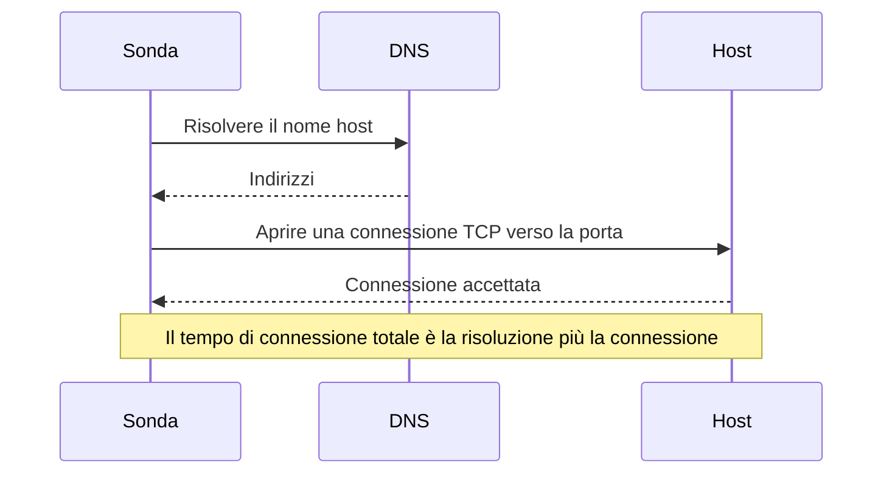

# Monitor porta

Un monitor porta controlla che un host accetti connessioni TCP su una porta, e misura quanto impiega la connessione. Usatelo per i servizi che non parlano HTTP, o di cui non volete controllare l'HTTP: database, server di posta, SSH, broker di messaggi e simili.

:::cards
- [Creare il monitor](#creare-un-monitor-porta): Sei passaggi nella dashboard.
- [Tempi di connessione](#tempi-di-connessione): Cosa misurano i tempi DNS, TCP e totale.
- [Criteri di monitoraggio](#criteri-di-monitoraggio): Raggiungibilità e tempi di connessione.
- [Risoluzione dei problemi](#risoluzione-dei-problemi): Quando il servizio è attivo ma il monitor lo dà offline.
:::

## Come funziona

A ogni controllo una sonda risolve il nome host, se ne avete indicato uno, e apre una connessione TCP verso la porta. La porta è online appena la connessione viene accettata; la sonda la chiude poi senza inviare nulla. Una connessione rifiutata o che va in timeout viene ritentata, fino al numero di nuovi tentativi che consentite. OneUptime passa poi il risultato attraverso i criteri del monitor.

La sonda apre solo connessioni TCP: un servizio che ascolta soltanto in UDP, come un agente SNMP, non può essere controllato con un monitor porta.

Quando un controllo fallisce, la sonda traccia anche il percorso verso l'host e ne cerca il nome, e allega quanto trovato al risultato come **Network Path at Time of Failure**, così potete vedere dove il percorso si è interrotto. Una sonda che ha perso la propria connessione di rete non riporta alcun risultato, quindi non può segnare il vostro servizio come offline.

## Prima di iniziare

- **Un ruolo che può creare monitor**: Project Owner, Project Admin, Project Member, Monitor Admin o Monitor Member, oppure un ruolo personalizzato con il permesso Create Monitor.
- **Una sonda che raggiunga la porta.** Le sonde predefinite del vostro progetto vengono scelte per ogni nuovo monitor. Se un firewall protegge il servizio, consentite agli [indirizzi IP delle sonde di OneUptime Cloud](/docs/configuration/ip-addresses) di connettersi alla porta. Un servizio su una rete privata, come un database, ha bisogno di una [sonda personalizzata](/docs/probe/custom-probe) in quella rete.

## Creare un monitor porta

:::steps
### Iniziare un nuovo monitor

Andate in **Monitor** e fate clic su **Crea monitor**. In **Tipo di monitor**, scegliete **Porta**.

### Dargli un nome

Inserite un **Nome**, come `Orders database`, poi fate clic su **Avanti**.

### Inserire l'host e la porta

In **Hostname o indirizzo IP**, inserite l'host su cui si trova la porta, come `db.example.com` o `10.0.0.12`. In **Porta**, inserite il numero di porta, come `5432`.

### Testarlo

Fate clic su **Testa il monitor**, scegliete una sonda in **Seleziona sonda** e fate clic su **Esegui test**. **Risultato del test del monitor** mostra se la connessione si è aperta, e quanto è durata ogni parte.

### Rivedere i criteri

**Criteri del monitor** parte dai [criteri predefiniti](#criteri-predefiniti): offline quando la porta non accetta una connessione, online quando la accetta. Modificateli se serve, poi fate clic su **Avanti**.

### Scegliere le sonde e creare

Mantenete o cambiate le **Sonde** e l'**Intervallo di monitoraggio** (parte da **Ogni 5 minuti**), poi fate clic su **Crea monitor**. Si apre la pagina del monitor.
:::

## Opzioni di configurazione

| Campo | Predefinito | Cosa inserire |
| --- | --- | --- |
| **Hostname o indirizzo IP** | Nessuno | L'host, come `example.com`, `192.168.1.1` o `2001:db8::1`. Inserite solo l'host, senza `http://`. |
| **Porta** | Nessuna | La porta TCP a cui connettersi, da `1` a `65535`. |
| **Timeout della richiesta (secondi)** (sotto **Altri campi**) | `60` | Quanto può durare un tentativo, la risoluzione DNS e la connessione TCP insieme. Il massimo è 60 secondi. |
| **Tentativi in caso di errore** (sotto **Altri campi**) | Il predefinito della sonda, di solito `3` | Quante volte ritentare un tentativo fallito. Il massimo è 3. |

**Tentativi in caso di errore** conta i nuovi tentativi _dopo_ il primo, quindi `0` esegue il controllo una volta e `2` fino a tre volte. Se lasciato vuoto, usa il predefinito della sonda: 3, a meno che `PROBE_MONITOR_RETRY_LIMIT` della sonda non dica altro. Ogni errore viene ritentato, timeout compresi, con una pausa di un secondo tra i tentativi. Anche una connessione riuscita che ha impiegato più di 10 secondi viene ricontrollata.

Porte comuni:

| Porta | Servizio |
| --- | --- |
| `22` | SSH |
| `25` | SMTP |
| `80` | HTTP |
| `443` | HTTPS |
| `3306` | MySQL |
| `5432` | PostgreSQL |
| `6379` | Redis |
| `27017` | MongoDB |

> [!NOTE]
> Molti provider di hosting bloccano l'SMTP in uscita. Su una sonda che non può inviare ping, ed è così che una sonda si accorge di girare presso un provider del genere, un controllo della porta `25` che va in timeout conta come online. Per controllare in modo affidabile la porta `25` di un server di posta, eseguite il monitor su una [sonda personalizzata](/docs/probe/custom-probe) autorizzata a connettersi a essa.

## Tempi di connessione

Per un nome host, la sonda misura il controllo in due fasi:

| Fase | Da | A |
| --- | --- | --- |
| **Risoluzione DNS** | L'inizio del controllo | Il primo tentativo di connessione TCP |
| **Connessione TCP** | Il primo tentativo di connessione TCP | L'accettazione della connessione, compreso il tempo trascorso a passare tra indirizzi IPv6 e IPv4 |

**Total Connection Time (DNS + TCP)** va dall'inizio del controllo fino all'accettazione della connessione. È anche il tempo di risposta del monitor porta, quindi i criteri, gli avvisi e i grafici esistenti che usano il tempo di risposta continuano a funzionare.

Quando la destinazione è un indirizzo IP, non c'è risoluzione DNS, quindi quella fase viene omessa. I risultati dei controlli precedenti alla misurazione per fasi mostrano solo il tempo di connessione totale.

## Criteri di monitoraggio

I criteri decidono quando la porta conta come online, degradata o offline, e se ciò dichiara un incidente o crea un avviso. Ogni criterio controlla uno o più filtri:

| Filtro | Condizioni | Cosa controlla |
| --- | --- | --- |
| **Is Online** | **Vero**, **Falso** | Se la porta ha accettato una connessione. |
| **Total Connection Time (DNS + TCP) (in ms)** | **Greater Than**, **Less Than**, **Greater Than Or Equal To**, **Less Than Or Equal To** | L'intero tempo di connessione, compresa la risoluzione DNS per un nome host. |
| **Port DNS Lookup Time (in ms)** | **Greater Than**, **Less Than**, **Greater Than Or Equal To**, **Less Than Or Equal To** | La risoluzione DNS prima del primo tentativo TCP. Non ha valore quando la destinazione è un indirizzo IP. |
| **Port TCP Connect Time (in ms)** | **Greater Than**, **Less Than**, **Greater Than Or Equal To**, **Less Than Or Equal To** | Dal primo tentativo TCP fino all'accettazione della connessione, compreso il passaggio tra IPv6 e IPv4. |
| **Is Request Timeout** | **Vero**, **Falso** | Se la risoluzione DNS o la connessione TCP ha superato il timeout, a ogni tentativo. |

Un criterio sulla risoluzione DNS non ha nulla da valutare quando la destinazione è un indirizzo IP. Per criteri che devono funzionare allo stesso modo con nomi host e indirizzi IP, usate il tempo totale o il tempo di connessione TCP.

Con due o più filtri, **Condizione di corrispondenza** decide se devono corrispondere **Tutti** o basta **Qualsiasi** filtro. Le **Azioni** di un criterio decidono cosa fa: cambiare lo stato del monitor, creare un avviso, dichiarare un incidente, o più di queste cose.

### Criteri predefiniti

Un nuovo monitor porta parte con due criteri:

- **Offline** — la porta non accetta una connessione, dopo tutti i nuovi tentativi. Il monitor viene segnato **Offline** e viene creato un incidente chiamato «_monitor name_ is offline». L'incidente si risolve da solo quando la porta accetta di nuovo connessioni.
- **Online** — la porta accetta una connessione. Il monitor viene segnato **Operativo**.

I criteri vengono controllati dall'alto verso il basso, e il primo che corrisponde decide cosa succede. Quando nessuno corrisponde, il monitor mostra il suo stato predefinito: **Operativo**, a meno che non ne scegliate un altro sotto **Altri campi**, sotto i criteri.

### Valutare su un periodo di tempo

**Valuta questo criterio su un periodo di tempo** è una casella sotto un filtro, offerta per **Is Online**, **Total Connection Time (DNS + TCP) (in ms)**, **Port DNS Lookup Time (in ms)** e **Port TCP Connect Time (in ms)**. Attivatela per valutare una finestra di controlli passati invece dell'ultimo: scegliete un'aggregazione in **Valuta** e una finestra, da 2 a 60 minuti, in **Per gli ultimi (in minuti)**.

| Aggregazione | Corrisponde quando |
| --- | --- |
| **Media**, **Somma**, **Maximum Value**, **Minimum Value** | Quel valore, sulla finestra, soddisfa la condizione. Solo filtri numerici. |
| **All Values** | Ogni controllo nella finestra soddisfa la condizione. |
| **Any Value** | Almeno un controllo nella finestra soddisfa la condizione. |

**All Values** corrisponde solo quando la finestra è davvero coperta da dati. Un monitor appena creato, o uno i cui controlli hanno smesso di essere registrati, non ha abbastanza storico per dire qualcosa sugli ultimi N minuti, quindi il criterio attende invece di corrispondere sull'unica lettura che ha. **Any Value** è l'impostazione per «avvisami appena un singolo controllo supera la soglia» e scatta comunque subito.

**Se nessun dato** decide cosa succede finché la finestra non può sostenere il criterio:

| Opzione | Cosa succede | Da usare per |
| --- | --- | --- |
| **Ignore** (predefinito) | Il criterio non corrisponde. | Avvisi a soglia ordinari. |
| **Trigger** | I dati mancanti contano come il problema. | Controlli in cui il silenzio è di per sé un guasto. |
| **Treat As Zero** | La finestra viene confrontata come un singolo zero. | Contatori in cui nessun evento significa davvero zero. |

### Esempi di criteri

| Obiettivo | Filtro | Condizione | Valore |
| --- | --- | --- | --- |
| Offline quando la porta è chiusa | **Is Online** | **Falso** | — |
| Avvisare quando la connessione è lenta | **Total Connection Time (DNS + TCP) (in ms)** | **Greater Than** | `500` |
| Segnare il servizio degradato quando è lento a connettersi | **Total Connection Time (DNS + TCP) (in ms)** | **Greater Than** | `200` |
| Avvisare quando il DNS è lento | **Port DNS Lookup Time (in ms)** | **Greater Than** | `100` |
| Avvisare quando l'handshake TCP è lento | **Port TCP Connect Time (in ms)** | **Greater Than** | `250` |

## Risoluzione dei problemi

:::details Il servizio è attivo, ma il monitor lo dà offline
La sonda non è riuscita ad aprire una connessione: un firewall la scarta, il servizio ascolta solo su un'interfaccia privata, oppure la porta è sbagliata. La causa principale dell'incidente, e **Registri di monitoraggio** sul monitor, mostrano l'errore, e **Network Path at Time of Failure** mostra fin dove è arrivato il percorso. Fate passare le sonde attraverso il firewall, oppure usate una [sonda personalizzata](/docs/probe/custom-probe) all'interno della rete.
:::

:::details Il tempo di risoluzione DNS è sempre vuoto
La destinazione è un indirizzo IP, quindi non c'è nulla da risolvere. Usate invece **Total Connection Time (DNS + TCP) (in ms)** o **Port TCP Connect Time (in ms)**.
:::

:::details Devo controllare un servizio UDP
I monitor porta aprono solo connessioni TCP. Per un server DNS usate un [monitor DNS](/docs/monitor/dns-monitor), e per un server di orario sulla porta UDP 123 un [monitor NTP](/docs/monitor/ntp-monitor). Entrambi inviano query reali.
:::

## Passaggi successivi

:::cards
- [Monitor ping](/docs/monitor/ping-monitor): Controllare che l'host stesso sia raggiungibile.
- [Monitor certificato SSL](/docs/monitor/ssl-certificate-monitor): Controllare il certificato su una porta TLS.
- [Monitor stato database](/docs/monitor/database-health-monitor): Andare oltre una porta aperta e sorvegliare lo stato di un database.
- [Sonde personalizzate](/docs/probe/custom-probe): Controllare porte sulla vostra rete.
:::
