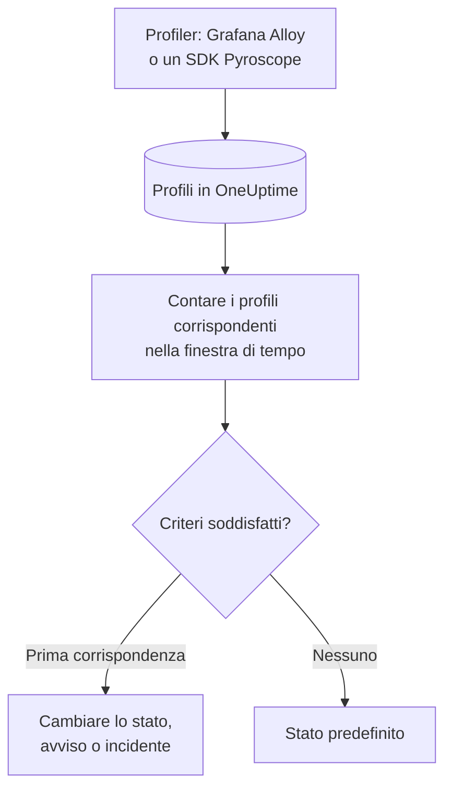

# Monitor profili

Un monitor profili conta, in una finestra di tempo, i profili continui che i vostri servizi inviano a OneUptime e che corrispondono ai vostri filtri (tipo di profilo, servizio, attributi). Quando il conteggio soddisfa i vostri criteri, cambia lo stato del monitor, crea un avviso o dichiara un incidente. Il suo uso principale è accorgersi di quando i dati di profilazione smettono di arrivare da un servizio.

> [!IMPORTANT]
> **Crea monitor** nella dashboard non offre Profiles: per i suoi filtri non esiste ancora un modulo. Create un monitor profili tramite l'[API](/docs/api-reference/api-reference) o [Terraform](/docs/terraform/monitor-steps), come descritto più sotto. Una volta creato, potete vedere e modificare i suoi criteri nella pagina **Criteri** del monitor nella dashboard; i suoi filtri si possono cambiare solo tramite l'API o Terraform.

:::cards
- [Creare il monitor](#creare-un-monitor-profili): La configurazione da inviare tramite l'API o Terraform.
- [Cosa interroga](#cosa-interroga): Tipi di profilo, servizi, attributi e la finestra.
- [Criteri](#criteri): Le condizioni che potete usare.
- [Esempio pratico](#esempio-pratico-i-profili-smettono-di-arrivare): Sapere quando un servizio smette di inviare profili.
:::

## Come funziona



Ogni minuto, OneUptime conta i profili che corrispondono ai filtri del monitor e sono iniziati nella sua finestra di tempo. Confronta quel conteggio con i criteri del monitor dall'alto verso il basso, e il primo criterio che corrisponde decide cosa succede. Se nessuno corrisponde, il monitor torna al suo stato predefinito.

## Prima di iniziare

- I vostri servizi inviano dati di profilazione continua a OneUptime, tramite Grafana Alloy (eBPF) o un SDK Pyroscope. Vedete [Profilazione continua](/docs/telemetry/profiles).
- Avete una chiave API che può creare monitor, oppure il provider Terraform di OneUptime configurato.
- Conoscete l'ID di ogni servizio di telemetria da sorvegliare e i tipi di profilo che invia, come `cpu`, `wall`, `alloc_objects`, `alloc_space` o `goroutine`.

## Creare un monitor profili

:::steps
### Scegliere cosa contare

Scrivete la configurazione `profileMonitor` del passaggio. Questa conta i profili della CPU di un servizio negli ultimi cinque minuti:

```json
{
  "profileMonitor": {
    "telemetryServiceIds": [],
    "profileTypes": ["cpu"],
    "profileType": "",
    "attributes": {},
    "lastXSecondsOfProfiles": 300
  }
}
```

Mettete l'ID del servizio in `telemetryServiceIds`, oppure lasciate vuoto l'elenco per contare i profili di tutti i servizi. [Cosa interroga](#cosa-interroga) descrive ogni campo.

### Creare il monitor

Create, tramite l'[API](/docs/api-reference/api-reference) o [Terraform](/docs/terraform/monitor-steps), un monitor di tipo `Profiles` con un passaggio che contenga questa configurazione e almeno un criterio. In Terraform, passate la configurazione come attributo `profile_monitor` del passaggio, scritta con `jsonencode()`.

### Controllarlo nella dashboard

Aprite il monitor da **Monitor**. La sua prima valutazione avviene entro un minuto, e il suo stato cambia non appena un criterio corrisponde.
:::

## Cosa interroga

| Campo | A cosa corrisponde | Predefinito |
| --- | --- | --- |
| `profileTypes` | Profili di uno qualsiasi di questi tipi, confrontati esattamente, come `cpu`. | Vuoto: tutti i tipi |
| `profileType` | Profili il cui tipo contiene questo testo, senza distinzione tra maiuscole e minuscole. Quando è impostato, `profileTypes` viene ignorato. | Vuoto |
| `telemetryServiceIds` | Profili di uno qualsiasi di questi servizi di telemetria. | Vuoto: tutti i servizi |
| `entityKeys` | Profili di uno qualsiasi di questi host, pod, container e altre entità dell'infrastruttura. | Vuoto: tutte le entità |
| `attributes` | Profili i cui attributi hanno questi valori. | Vuoto: nessuna condizione |
| `lastXSecondsOfProfiles` | Profili iniziati entro questo numero di secondi prima della valutazione. | Nessuno: impostatelo sempre, altrimenti viene contato ogni profilo salvato e il conteggio non scende mai a 0 |

Tutti i filtri che impostate devono corrispondere perché un profilo venga contato.

## Come viene valutato

- **Ogni minuto.** Un monitor profili non viene controllato da sonde, quindi non ha un intervallo da impostare né una pagina **Sonde e intervallo**.
- **Un numero per valutazione.** Il monitor conta i profili che corrispondono a ogni filtro e sono iniziati entro `lastXSecondsOfProfiles`. Un profiler carica i dati a intervalli regolari, quindi lasciate alla finestra spazio per diversi caricamenti.
- **Nessun profilo significa un conteggio di 0.** Un servizio il cui profiler smette di caricare dati produce 0.
- **L'interruzione di OneUptime stesso non è silenzio.** Finché la finestra di tempo contiene un periodo in cui OneUptime stesso non riceveva dati (si stava riavviando, veniva aggiornato o recuperava un arretrato), il controllo attende: lo stato non cambia e nessun incidente o avviso viene aperto o risolto. Vedete [Quando OneUptime non riceve dati](/docs/monitor/when-oneuptime-is-not-receiving).
- **Criteri dall'alto verso il basso.** Decide il primo criterio che corrisponde, quindi mettete per primo il più grave.

Ogni cambio di stato, con il suo motivo, viene registrato nella **Cronologia di stato** del monitor.

## Criteri

I criteri di un monitor profili hanno un solo filtro, **Profile Count**: il numero di profili che hanno corrisposto nella finestra. Confrontatelo con un valore:

| Condizione del filtro | Corrisponde quando il conteggio dei profili è… |
| --- | --- |
| **Greater Than** | sopra il valore |
| **Greater Than Or Equal To** | pari al valore o superiore |
| **Less Than** | sotto il valore |
| **Less Than Or Equal To** | pari al valore o inferiore |
| **Equal To** | esattamente il valore |
| **Not Equal To** | qualsiasi cosa tranne il valore |

I conteggi dei profili non hanno condizioni di anomalia: non c'è un riferimento con cui confrontarli.

## Esempio pratico: i profili smettono di arrivare

Il servizio di checkout esegue un SDK Pyroscope che carica profili della CPU. Volete un incidente quando smettono di arrivare per cinque minuti:

- `profileTypes`: `["cpu"]`, `telemetryServiceIds`: il servizio di checkout, `lastXSecondsOfProfiles`: `300`
- Criterio 1: **Profile Count** **Equal To** `0`: mettere il monitor offline e dichiarare un incidente
- Criterio 2: **Profile Count** **Greater Than** `0`: mettere il monitor online

Finché l'SDK carica dati, ogni valutazione conta alcuni profili e il criterio 2 mantiene il monitor online. Quando il servizio viene rilasciato senza l'SDK, il conteggio scende a 0 cinque minuti dopo l'ultimo caricamento, corrisponde il criterio 1 e viene dichiarato l'incidente. Il primo caricamento dopo la correzione riporta il conteggio sopra 0, e l'incidente si risolve da solo se **Risoluzione automatica dell'incidente** è attiva per esso.

## Risoluzione dei problemi

:::details Il monitor conta 0, ma in OneUptime compaiono profili
Confrontate i filtri con i profili che vedete: `profileTypes` deve corrispondere esattamente al tipo, e `telemetryServiceIds` deve contenere gli ID di servizio giusti. Anche un `lastXSecondsOfProfiles` breve può cadere tra due caricamenti.
:::

:::details Profiles non compare in Crea monitor
È il comportamento previsto: la dashboard non ha ancora un modulo per i filtri di un monitor profili. Createlo tramite l'API o Terraform, come descritto in [Creare un monitor profili](#creare-un-monitor-profili).
:::

## Passaggi successivi

:::cards
- [Profilazione continua](/docs/telemetry/profiles): Inviare profili da Grafana Alloy o da un SDK Pyroscope.
- [Passaggi del monitor](/docs/terraform/monitor-steps): Passare la configurazione del passaggio da Terraform.
- [Monitor tracce](/docs/monitor/traces-monitor): Avvisare sugli span non riusciti.
- [Monitor metriche](/docs/monitor/metrics-monitor): Avvisare su CPU, memoria e altre metriche.
:::
