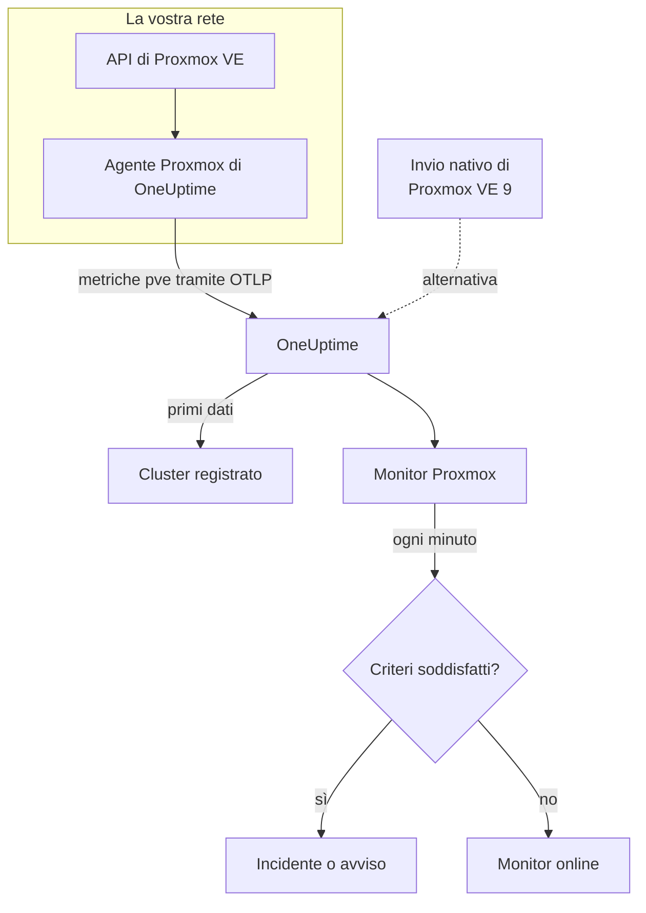

# Monitor Proxmox

Un monitor Proxmox sorveglia un cluster Proxmox VE – i suoi nodi, le VM e i container LXC, lo storage, lo stato HA, la copertura dei job di backup e la replica dello storage – e vi avvisa quando un nodo va offline, un guest si ferma o lo storage si riempie. Legge le metriche `pve_*` raccolte dall'agente Proxmox di OneUptime, quindi niente viene sondato dall'esterno.

:::cards
- [Creare il monitor](#creare-un-monitor-proxmox): Sei passaggi nella dashboard.
- [Modelli](#modelli-di-avviso-pronti): Undici avvisi pronti, un incidente per nodo, guest o volume.
- [Identità delle risorse](#identità-delle-risorse): Come puntare a un singolo nodo, guest o volume di storage.
- [Metriche](#metriche-raccolte): Ogni serie `pve_*` su cui il monitor può avvisare.
:::

## Come funziona

L'agente Proxmox di OneUptime viene eseguito su una macchina che raggiunge l'API di Proxmox VE. Ogni 30 secondi interroga prometheus-pve-exporter con i collector di cluster e di nodo, etichetta ogni serie con la risorsa che descrive e invia le metriche a OneUptime tramite OTLP, contrassegnate con il nome del cluster, `proxmox.cluster.name`. I primi dati registrano il cluster. Proxmox VE 9 e successivi possono invece inviare le metriche in modo nativo, senza installare nulla; vedete [l'invio nativo](#linvio-nativo-di-proxmox-ve).

Un monitor Proxmox è legato a un cluster. Ogni minuto esegue la sua query sulle metriche di quel cluster e confronta il risultato con i suoi criteri.

## Prima di iniziare

- **Installate l'agente Proxmox** dove possa raggiungere l'API di Proxmox VE, con un token API di sola lettura. La [guida all'agente Proxmox](/docs/telemetry/proxmox) copre il token, l'installazione e l'invio nativo.
- **Verificate che il cluster sia registrato.** Compare in **Prodotti → Infrastruttura → Proxmox → Tutti i cluster**, con il nome del `PROXMOX_CLUSTER_NAME` dell'agente, circa un minuto dopo la prima raccolta.

## Creare un monitor Proxmox

:::steps
### Iniziare un nuovo monitor

Andate in **Monitor** e fate clic su **Crea monitor**.

### Scegliere Proxmox

In **Tipo di monitor**, fate clic su **Altri tipi di monitor** e scegliete **Proxmox** in **Infrastruttura**, oppure digitate `proxmox` nella casella di ricerca. Inserite un **Nome** – viene usato nei titoli di incidenti e avvisi – e fate clic su **Avanti**.

### Scegliere il cluster

In **Proxmox Monitor Configuration**, scegliete il cluster da **Proxmox Cluster**. Ogni cluster che ha inviato dati è nell'elenco.

### Scegliere cosa sorvegliare

Scegliete una delle tre schede:

- **Quick Setup** – fate clic su un [modello](#modelli-di-avviso-pronti). Imposta le metriche, i filtri, l'aggregazione, l'intervallo di tempo e le soglie, e sostituisce i criteri più sotto con i propri. Potete comunque cambiare l'**Intervallo di tempo**.
- **Custom Metric** – scegliete una metrica da **Proxmox Metric**, poi impostate **Aggregazione** e **Intervallo di tempo**. I [filtri](#impostazioni-del-monitor) la restringono a un tipo di risorsa o a una singola risorsa.
- **Avanzato** – costruite voi query e formule in **Seleziona metriche**, per esempio una percentuale di memoria da `pve_memory_usage_bytes / pve_memory_size_bytes`. Usate **Group by** `id` per giudicare ogni risorsa separatamente.

### Rivedere i criteri

Aprite ogni criterio in **Criteri del monitor** e verificatene **Metrica**, **Aggregazione**, **Condizione** e **Threshold**. Un modello li compila. Con **Custom Metric** o **Avanzato**, il monitor parte con i [criteri predefiniti](#criteri-predefiniti), che notano solo una metrica che scende a zero, quindi impostate la vostra soglia.

### Creare il monitor

Fate clic su **Crea monitor**. OneUptime apre la pagina del monitor e lo valuta ogni minuto. Gli incidenti e gli avvisi che genera compaiono anche nelle pagine **Incidenti** e **Avvisi** del cluster.
:::

> [!TIP]
> Per configurare più modelli alla volta, aprite il cluster da **Prodotti → Infrastruttura → Proxmox** e andate in **Recommendations**. Scegliete i modelli che volete, scegliete chi viene avvisato, e OneUptime crea un monitor per modello.

## Impostazioni del monitor

| Campo | Scheda | Cosa fa |
| --- | --- | --- |
| **Proxmox Cluster** | Tutte | Obbligatorio. Limita ogni query a `resource.proxmox.cluster.name`. |
| **Ambito della risorsa** | Custom Metric, Avanzato | Facoltativo. **Nodo**, **Guest (VM / container)**, **Archiviazione** o **Cluster**: una corrispondenza esatta su `pve.scope`. |
| **PVE ID** | Custom Metric, Avanzato | Facoltativo. Corrispondenza esatta su `pve.id`: un nome di nodo (`pve1`), un VMID (`100`) o `<node>/<storage>` (`pve1/local`). Abbinatelo a un ambito per puntare a una singola risorsa. |
| **Nome del nodo** | Custom Metric, Avanzato | Facoltativo. Solo le serie proprie di un nodo (`pve.scope = node` e `pve.id`). Non può selezionare i guest o lo storage di quel nodo. |
| **Guest ID** | Custom Metric, Avanzato | Facoltativo. Corrispondenza esatta sull'etichetta grezza `id`, come `qemu/100` o `lxc/101`. Quando è impostato, gli altri filtri vengono ignorati. |
| **Proxmox Metric** | Custom Metric | Una metrica del [catalogo](#metriche-raccolte). |
| **Aggregazione** | Custom Metric | Come vengono combinati i campioni: **Media**, **Massimo**, **Minimo**, **Somma** o **Conteggio**. Parte dall'aggregazione abituale della metrica. |
| **Intervallo di tempo** | Tutte | La finestra mobile che la query legge, da **Past 1 Minute** a **Past 365 Days**. Un nuovo monitor parte da **Past 1 Minute**; i modelli impostano la propria. |
| **Seleziona metriche** | Avanzato | Il costruttore di query: **Metrica**, **Aggregate by**, **Filter by attributes**, **Group by**, più **Aggiungi metrica** e **Aggiungi formula** per combinare le query. |

## Identità delle risorse

Ogni serie porta un'etichetta di punto dati `id` che indica la risorsa Proxmox a cui appartiene:

| Valore di `id` | Risorsa |
| --- | --- |
| `node/<name>` | Un nodo del cluster, per esempio `node/pve1`. |
| `qemu/<vmid>` | Una macchina virtuale QEMU, per esempio `qemu/100`. |
| `lxc/<vmid>` | Un container LXC, per esempio `lxc/101`. |
| `storage/<node>/<storage>` | Un volume di storage su un nodo, per esempio `storage/pve1/local`. |

Due eccezioni: le serie di replica (`pve_replication_*`) portano l'id del **job** di replica in `id` (per esempio `100-0`), e `pve_not_backed_up_total`, a livello di cluster, non ha alcun `id`.

I filtri confrontano per uguaglianza, non per prefisso, quindi l'agente divide anche `id` in tre attributi su cui potete filtrare. I modelli si basano su di essi:

| Attributo | Valori | Per `qemu/100` |
| --- | --- | --- |
| `pve.scope` | `node`, `guest`, `storage`, `cluster` (`qemu` e `lxc` sono entrambi `guest`) | `guest` |
| `pve.type` | `node`, `qemu`, `lxc`, `storage` | `qemu` |
| `pve.id` | Tutto ciò che segue il primo `/` di `id` (`pve1`, `100`, `pve1/local`) | `100` |

Filtrate su `pve.scope` o `pve.type` per un tipo di risorsa, su `pve.id` o `id` per una singola risorsa, e raggruppate per `id` per giudicare ogni risorsa separatamente.

## Modelli di avviso pronti

**Quick Setup** offre 11 modelli. Ognuno costruisce un monitor completo: query, filtri di attributi, un raggruppamento, un criterio che scatta e uno che ripristina. La maggior parte raggruppa per `id`, così ogni nodo, guest, volume o job riceve il proprio incidente e il proprio avviso. Le soglie sono punti di partenza modificabili.

I modelli leggono gli ultimi 5 minuti, salvo diversa indicazione nella tabella. Un criterio scatta solo quando la condizione vale per ogni minuto della sua finestra, e un criterio a soglia si ripristina il 10% oltre la sua soglia, così un valore che oscila sul limite non cambia stato di continuo.

| Modello | Gravità | Sorveglia | Scatta quando | Si ripristina quando |
| --- | --- | --- | --- | --- |
| Node Offline | Critico | `pve_up` per `pve.scope = node`, Min per `id` | Sotto 1 | A 1 |
| Guest Down | Warning | `pve_up` e `pve_onboot_status` per `pve.scope = guest`, Min per `id` | `pve_up` è sotto 1 mentre `pve_onboot_status` è 1 | `pve_up` torna a 1, oppure l'avvio al boot viene disattivato |
| Cluster Quorum at Risk | Critico | `pve_up` ÷ `pve_node_info` × 100 per `pve.scope = node` (entrambi Somma): la quota di nodi online | 50% o meno | Sopra il 55% |
| High Node CPU Usage | Warning | `pve_cpu_usage_ratio` per `pve.scope = node`, Avg per `id` | Sopra 0,9 (il 90% dei core del nodo) | A 0,81 o meno |
| High Node Memory Usage | Warning | `pve_memory_usage_bytes` ÷ `pve_memory_size_bytes` × 100 per `pve.scope = node`, per `id` | Sopra l'85% | Al 76,5% o meno |
| High Guest CPU Usage | Warning | `pve_cpu_usage_ratio` per `pve.scope = guest`, Avg per `id`, ultimi 15 minuti | Sopra 0,95 (il 95% delle sue vCPU) per tutti i 15 minuti | A 0,855 o meno |
| Storage Near Full | Warning | `pve_disk_usage_bytes` ÷ `pve_disk_size_bytes` × 100 per `pve.scope = storage`, per `id` | Sopra l'85% | Al 76,5% o meno |
| Container Root Disk Near Full | Warning | Lo stesso rapporto del disco per `pve.type = lxc`, per `id` | Sopra il 90% | All'81% o meno |
| HA Resource in Error State | Critico | `pve_ha_state` per `state = error`, Max per `id` | Sopra 0 | A 0 |
| Guest Not Backed Up | Warning | `pve_not_backed_up_total`, Max (un'unica serie per il cluster) | Sopra 0 | A 0 |
| Replication Failing | Critico | `pve_replication_failed_syncs`, Max per `id` (l'id del job) | Sopra 0 | A 0 |

**Gravità** è l'etichetta che mostra il selettore. L'incidente e l'avviso creati da un modello partono dalla gravità di incidente e di avviso più alta del vostro progetto; cambiatele nei criteri.

- **I modelli di guasto usano Minimo**, così una sola raccolta in cui la risorsa era giù li fa scattare invece di essere nascosta dalle raccolte in cui era attiva.
- **Guest Down** considera solo i guest impostati per avviarsi al boot, quindi un guest che avete fermato di proposito non avvisa mai nessuno.
- **Cluster Quorum at Risk** è un'approssimazione: pve-exporter non ha una metrica di corosync, quindi conta i nodi online.
- **High Guest CPU Usage** è più alto e più lento del modello dei nodi: un guest deve usare le sue vCPU, quindi avvisa solo uno che non scende mai.
- **Le formule di rapporto** prendono la **Somma** di entrambi i lati. Entrambi provengono dalla stessa raccolta, quindi il risultato è una vera percentuale.
- **Container Root Disk Near Full** esclude le VM QEMU: il loro utilizzo del disco vale 0 senza il guest agent di QEMU.
- **Guest Not Backed Up** copre solo l'appartenenza ai job di backup. pve-exporter non dice se i backup sono stati eseguiti o sono riusciti; raggruppate `pve_not_backed_up_info` per `id` per elencare i guest.
- **L'obsolescenza della replica** (adesso meno l'ultima sincronizzazione) non può generare avvisi, perché i criteri non hanno aritmetica sul tempo. La pagina **Panoramica** del cluster la mostra; avvisate invece con **Replication Failing**.

### L'invio nativo di Proxmox VE

Proxmox VE 9 e successivi possono inviare le metriche tramite il loro server di metriche OpenTelemetry integrato, senza installare nulla: vedete la [guida all'agente Proxmox](/docs/telemetry/proxmox). OneUptime trasforma l'invio nelle stesse serie `pve_*`, quindi il catalogo e i modelli di CPU, memoria e storage funzionano con esso.

Funzionano anche **Node Offline** e **Cluster Quorum at Risk**: ogni nodo invia solo il proprio stato, quindi un nodo che smette di comunicare viene segnalato come giù (`pve_up` = 0) dai nodi ancora vivi; vedete [Quando un nodo smette di comunicare](/docs/telemetry/proxmox#when-a-node-stops-reporting). **Guest Down**, **HA Resource in Error State**, **Guest Not Backed Up** e **Replication Failing** hanno bisogno di dati che solo l'agente raccoglie.

## Metriche raccolte

L'agente interroga prometheus-pve-exporter ogni 30 secondi con i collector di cluster e di nodo, il che copre anche i collector `backup-info` e `replication` dell'exporter (entrambi attivi per impostazione predefinita).

### Disponibilità

| Metrica | Unità | Descrizione |
| --- | --- | --- |
| `pve_up` | — | 1 quando il nodo o il guest è attivo o in esecuzione, altrimenti 0. |
| `pve_uptime_seconds` | seconds | Uptime del nodo o del guest. |
| `pve_version_info` | count | La release di Proxmox VE, nelle sue etichette. Sempre 1. |

### Nodo

| Metrica | Unità | Descrizione |
| --- | --- | --- |
| `pve_node_info` | count | Metadati del nodo, sempre 1. Sommatela per contare i nodi che comunicano. |
| `pve_cpu_usage_ratio` | ratio | CPU in uso come rapporto da 0 a 1 rispetto alla CPU disponibile. |
| `pve_cpu_usage_limit` | cores | CPU disponibile, in core. Per un guest, le sue vCPU. |
| `pve_memory_usage_bytes` | bytes | Memoria in uso. |
| `pve_memory_size_bytes` | bytes | Memoria totale. |

Le serie di CPU e memoria vengono comunicate anche per ogni guest, sugli id `qemu/*` e `lxc/*`.

### Guest

| Metrica | Unità | Descrizione |
| --- | --- | --- |
| `pve_guest_info` | count | Metadati del guest (nome, nodo, tipo `qemu` o `lxc`) nelle etichette. Sempre 1. |
| `pve_network_receive_bytes` | bytes | Byte ricevuti dal guest. Un contatore sull'intera vita. |
| `pve_network_transmit_bytes` | bytes | Byte inviati dal guest. Un contatore sull'intera vita. |
| `pve_disk_read_bytes` | bytes | Byte letti dal disco dal guest. Un contatore sull'intera vita. |
| `pve_disk_write_bytes` | bytes | Byte scritti sul disco dal guest. Un contatore sull'intera vita. |
| `pve_onboot_status` | count | 1 quando il guest si avvia al boot del nodo. Un guest fermo con questa impostazione è di solito un'interruzione non pianificata. |

### Storage

| Metrica | Unità | Descrizione |
| --- | --- | --- |
| `pve_disk_usage_bytes` | bytes | Byte usati sul disco o sullo storage. Per un guest QEMU vale 0 a meno che non sia installato il guest agent di QEMU. |
| `pve_disk_size_bytes` | bytes | Dimensione totale del disco o dello storage. |
| `pve_storage_info` | count | Metadati dello storage, sempre 1. Sommatela per contare i volumi di storage. |

### HA

| Metrica | Unità | Descrizione |
| --- | --- | --- |
| `pve_ha_state` | — | Una serie per stato HA (`started`, `stopped`, `error`, …) per ogni risorsa HA, a 1 sul suo stato attuale. Filtrate sull'etichetta `state` per avvisare su uno stato. |

### Backup

Provengono dal collector `backup-info` dell'exporter, a livello di cluster. Riportano solo la copertura dei **job** di backup:

| Metrica | Unità | Descrizione |
| --- | --- | --- |
| `pve_not_backed_up_total` | count | Guest che non fanno parte di alcun job di backup. Un'unica serie per il cluster, senza `id`. |
| `pve_not_backed_up_info` | count | Una serie per ogni guest non coperto, sempre 1, etichettata con l'`id` del guest. Scompare appena il guest entra in un job di backup. |

### Replica

Provengono dal collector `replication` dell'exporter, a livello di nodo. Le serie esistono solo quando il cluster ha job di replica, e portano l'id del job in `id`:

| Metrica | Unità | Descrizione |
| --- | --- | --- |
| `pve_replication_failed_syncs` | count | Tentativi di sincronizzazione falliti di fila. Sopra 0 significa che la replica sta diventando obsoleta. |
| `pve_replication_duration_seconds` | seconds | Quanto è durata l'ultima sincronizzazione. |
| `pve_replication_last_sync_timestamp_seconds` | seconds | Ora Unix dell'ultima sincronizzazione **riuscita**. |
| `pve_replication_last_try_timestamp_seconds` | seconds | Ora Unix dell'ultimo **tentativo**. Se è più recente dell'ultima sincronizzazione, l'ultimo tentativo è fallito. |
| `pve_replication_next_sync_timestamp_seconds` | seconds | Ora Unix della prossima sincronizzazione pianificata. |
| `pve_replication_info` | count | Metadati del job – tipo, origine, destinazione, guest – nelle etichette. Sempre 1. |

## Criteri di monitoraggio

Un criterio confronta una delle query o formule del monitor con una soglia. I criteri di un monitor Proxmox non hanno un **Tipo di filtro**: ogni regola controlla il valore della metrica, con questi campi.

| Campo | Cosa fa |
| --- | --- |
| **Metrica** | La query o la formula da controllare, tramite il suo nome di variabile. |
| **Aggregazione** | Come i valori della finestra diventano un'unica risposta: **Media**, **Somma**, **Maximum Value**, **Minimum Value**, **All Values** (ogni valore deve corrispondere) o **Any Value** (ne basta uno). |
| **Condizione** | **Greater Than**, **Less Than**, **Greater Than Or Equal To**, **Less Than Or Equal To** o **Equal To**, oppure una condizione di anomalia: **Anomalously High**, **Anomalously Low** o **Anomalous**. |
| **Threshold** | Il valore con cui confrontare. Accanto c'è un elenco di unità quando la metrica ha un'unità. Non viene mostrato per le condizioni di anomalia. |
| **Sensibilità** | Solo condizioni di anomalia. **Bassa** (4σ), **Media** (3σ, il predefinito) o **Alta** (2σ). |
| **Finestra di riferimento** | Solo condizioni di anomalia. 14 giorni (il predefinito), 28, 60 o 90 giorni di storico. |
| **Se nessun dato** | In **Altri campi**. Cosa succede quando la finestra non ha campioni: **Ignore** (predefinito), **Treat As Zero** o **Trigger**. |

Le condizioni di anomalia confrontano ogni valore con la stessa ora della settimana nella baseline. Restano in uno stato «Learning», e non generano nulla, finché la finestra di riferimento non contiene abbastanza storico.

Ogni criterio indica anche cosa fare quando corrisponde: cambiare lo stato del monitor, creare un avviso o dichiarare un incidente. I criteri vengono controllati dall'alto verso il basso, e decide il primo che corrisponde.

### Criteri predefiniti

Un monitor che non create da un modello parte con due criteri:

| Ordine | Criterio | Corrisponde quando | Poi |
| --- | --- | --- | --- |
| 1 | Check if _monitor name_ is offline | Un valore qualsiasi della prima query è `0` | Segna il monitor come **Offline** e dichiara l'incidente «_monitor name_ is offline», che si risolve da solo quando il monitor si riprende. |
| 2 | Check if _monitor name_ is online | Un valore qualsiasi è sopra `0` | Segna il monitor come **Operativo**. |

> [!IMPORTANT]
> Il silenzio non corrisponde a nessuno dei due criteri: un cluster che smette di inviare dati lascia il monitor com'era. Per essere avvisati quando i dati si fermano, impostate **Se nessun dato** su **Trigger** in un criterio. Il tempo in cui OneUptime stesso non stava ricevendo non è mai assenza di dati: un controllo la cui finestra lo contiene attende invece, come spiega [Quando OneUptime non riceve dati](/docs/monitor/when-oneuptime-is-not-receiving).

## Risoluzione dei problemi

:::details Il cluster non è nell'elenco Proxmox Cluster
I cluster si registrano da soli a partire dai dati dell'agente. Verificate che l'agente sia in esecuzione e invii dati (vedete la [guida all'agente Proxmox](/docs/telemetry/proxmox)), e che `PROXMOX_CLUSTER_NAME` sia impostato.
:::

:::details Mancano le metriche dei guest
Le serie dei guest provengono dal collector di cluster dell'exporter, che la configurazione distribuita attiva con il parametro di raccolta `cluster=1`. Se avete cambiato la configurazione del collector, ripristinatela.
:::

:::details High Node CPU Usage non scatta mai
Il modello fa la media di `pve_cpu_usage_ratio` per `id`, quindi ogni nodo viene controllato separatamente. Se avete costruito una vostra query, raggruppatela per `id`: una media su tutti i nodi viene abbassata da quelli inattivi.
:::

:::details Node Offline continua a scattare per un nodo rimosso dal cluster
Con l'invio nativo di Proxmox VE, un nodo tolto dal cluster sembra uguale a uno andato giù: ha smesso di comunicare, quindi i nodi ancora vivi continuano a segnalarlo come giù. Aprite la pagina del nodo e fate clic su **Remove Node**: il nodo scompare e il suo avviso si risolve. Altrimenti resta Offline fino a 7 giorni. L'agente non ha questo problema: interroga il cluster, che non elenca più il nodo.
:::

:::details Mancano le metriche di backup o di replica
`pve_not_backed_up_*` proviene dal collector `backup-info` dell'exporter e `pve_replication_*` dal suo collector `replication`. Entrambi sono attivi per impostazione predefinita e coperti dai parametri di raccolta `cluster=1` e `node=1` della configurazione distribuita. Se eseguite un vostro exporter, verificate di non averli disattivati. `pve_replication_*` esiste solo quando il cluster ha job di replica dello storage.
:::

:::details Contatori come pve_network_receive_bytes crescono soltanto
Le serie di I/O di rete e di disco sono contatori sull'intera vita, e i criteri confrontano valori grezzi: non esiste un operatore di tasso, e **Convert to per-second rate** nel costruttore di query cambia solo il grafico. Mostrateli come tasso, oppure avvisate sulla loro crescita con una formula, come una query **Massimo** meno una query **Minimo** dello stesso contatore.
:::

## Passaggi successivi

:::cards
- [Agent Proxmox](/docs/telemetry/proxmox): Installare l'agente, oppure configurare l'invio nativo.
- [Monitor Ceph](/docs/monitor/ceph-monitor): Sorvegliare lo storage Ceph dietro un cluster Proxmox.
- [Monitor VMware](/docs/monitor/vmware-monitor): Lo stesso tipo di monitor per vSphere.
- [Panoramica degli incidenti](/docs/incidents/index): Cosa succede dopo che un criterio ha dichiarato un incidente.
:::
