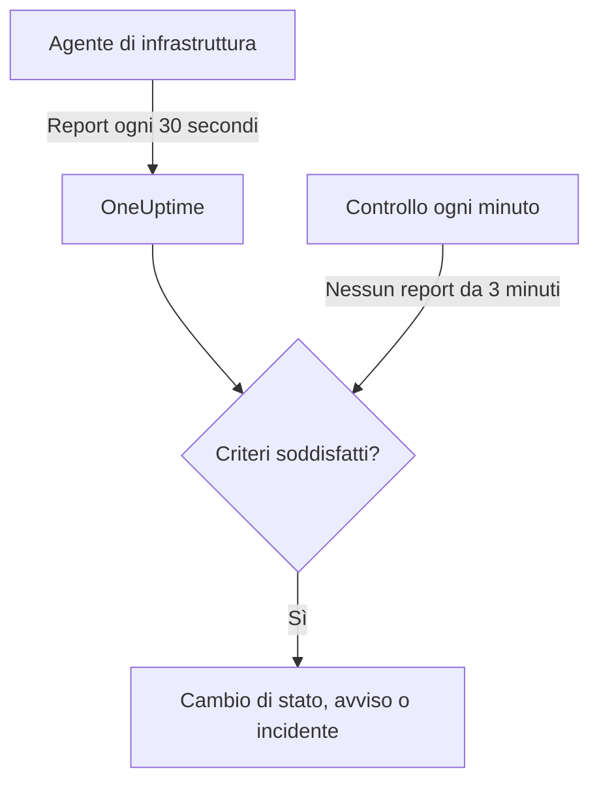

# Monitor server / VM

Un monitor Server / VM sorveglia una macchina tramite l'agente di infrastruttura OneUptime (`oneuptime-infrastructure-agent`), un piccolo servizio che ogni 30 secondi comunica a OneUptime CPU, memoria, dischi, carico, rete e processi in esecuzione. Questa pagina mostra come collegare l'agente a un monitor Server / VM, cosa comunica l'agente e come scrivere i criteri che decidono quando il server è online od offline.

> [!IMPORTANT]
> **Crea monitor** non offre più **Server / VM**. I monitor Server / VM che avete già continuano a funzionare, e tutto ciò che c'è in questa pagina vale per loro. Per sorvegliare un nuovo server, create invece un [monitor host](/docs/monitor/host-monitor): avvisa sulle metriche dell'host che invia il [collector OpenTelemetry sull'host](/docs/telemetry/host-otel-collector).

:::cards
- [Collegare l'agente](#collegare-lagente): Installarlo, dargli la chiave segreta del monitor e avviarlo.
- [Cosa comunica l'agente](#cosa-comunica-lagente): CPU, memoria, dischi, carico, rete e processi.
- [Criteri di monitoraggio](#criteri-di-monitoraggio): Decidere quando il server conta come online od offline.
- [Risoluzione dei problemi](#risoluzione-dei-problemi): L'agente non comunica, o il monitor non va mai offline.
:::

## Come funziona

L'agente viene eseguito come servizio di sistema. Ogni 30 secondi raccoglie un report e lo invia al vostro URL di OneUptime, firmato con la chiave segreta del monitor. OneUptime salva i valori come metriche del monitor e verifica il report rispetto ai criteri del monitor.

Il silenzio viene controllato a parte. Ogni minuto OneUptime rivaluta i criteri **Is Online** di ogni monitor Server / VM che non comunica da 3 minuti o più, e un server in silenzio più a lungo di quanto consentano i suoi criteri (3 minuti per impostazione predefinita) conta come offline. Un monitor senza criteri **Is Online** non viene mai segnato offline solo perché l'agente tace. Per quel silenzio conta solo il tempo in cui OneUptime stava ricevendo: il tempo in cui OneUptime stesso si riavviava, veniva aggiornato o recuperava il ritardo non conta, come spiega [Quando OneUptime non riceve dati](/docs/monitor/when-oneuptime-is-not-receiving).



## Prima di iniziare

- Un monitor Server / VM nel vostro progetto.
- Il permesso di modificare i monitor. La chiave segreta, e i comandi di configurazione che la contengono, vengono mostrati solo a chi può modificare i monitor.
- Accesso root (Linux, macOS) o da amministratore (Windows) sul server. L'agente si installa come servizio di sistema.
- HTTPS in uscita dal server verso il vostro URL di OneUptime, direttamente o tramite un proxy HTTP.

## Collegare l'agente

I comandi qui sotto usano `https://oneuptime.com` e `YOUR_SECRET_KEY`. I comandi di configurazione del monitor contengono già il vostro URL di OneUptime e la chiave segreta del monitor, quindi copiateli dal monitor quando potete.

:::steps
### Aprire i comandi di configurazione del monitor

Andate in **Monitor**, aprite il monitor Server / VM e selezionate **Documentazione**. Le schede **Set up your Server Monitor (Linux/Mac)** e **Set up your Server Monitor (Windows)** contengono i comandi per questo monitor. Finché l'agente non comunica per la prima volta, li mostra anche la **Panoramica** del monitor.

### Installare l'agente

:::tabs
@tab Linux
```bash
curl -sSL https://oneuptime.com/docs/static/scripts/infrastructure-agent/install.sh | sudo bash
```
@tab macOS
```bash
curl -sSL https://oneuptime.com/docs/static/scripts/infrastructure-agent/install.sh | sudo bash
```
@tab Windows
1. Scaricate l'agente dall'[ultima release su GitHub](https://github.com/OneUptime/oneuptime/releases/latest): `oneuptime-infrastructure-agent_windows_amd64.zip` per x64, oppure `oneuptime-infrastructure-agent_windows_arm64.zip` per ARM64.
2. Estraete il file ZIP. Contiene `oneuptime-infrastructure-agent.exe`.
3. Aprite il **Prompt dei comandi** come amministratore nella cartella in cui l'avete estratto.
:::

Lo script di installazione scarica l'ultima release per il vostro sistema operativo e processore (x86-64 o ARM64) e mette il binario `oneuptime-infrastructure-agent` in `$HOME/bin`. In un'installazione self-hosted, lo script viene servito dal vostro URL di OneUptime.

### Collegarlo al monitor

:::tabs
@tab Linux
```bash
sudo oneuptime-infrastructure-agent configure --secret-key=YOUR_SECRET_KEY --oneuptime-url=https://oneuptime.com
```
@tab macOS
```bash
sudo oneuptime-infrastructure-agent configure --secret-key=YOUR_SECRET_KEY --oneuptime-url=https://oneuptime.com
```
@tab Windows
```shell
oneuptime-infrastructure-agent configure --secret-key=YOUR_SECRET_KEY --oneuptime-url=https://oneuptime.com
```
:::

`configure` salva la chiave segreta e l'URL nel file di configurazione dell'agente e installa l'agente come servizio di sistema. Entrambi i flag sono obbligatori. In un'installazione self-hosted, sostituite `https://oneuptime.com` con il vostro URL.

Se il server raggiunge internet tramite un proxy, aggiungete `--proxy-url`:

```bash
sudo oneuptime-infrastructure-agent configure --proxy-url=http://proxy.example.com:8080 --secret-key=YOUR_SECRET_KEY --oneuptime-url=https://oneuptime.com
```

### Avviare l'agente

:::tabs
@tab Linux
```bash
sudo oneuptime-infrastructure-agent start
```
@tab macOS
```bash
sudo oneuptime-infrastructure-agent start
```
@tab Windows
```shell
oneuptime-infrastructure-agent start
```
:::

All'avvio, l'agente verifica la chiave segreta con OneUptime e invia subito il primo report.

### Verificare che comunichi

Eseguite `sudo oneuptime-infrastructure-agent status` (senza `sudo` su Windows): stampa `Service is running`. In OneUptime, la **Panoramica** del monitor smette di mostrare i comandi di configurazione appena arriva il primo report, e la sua scheda **Metriche** inizia a mostrare i grafici del server.
:::

## Riferimento dell'agente

### Comandi

| Comando | Cosa fa |
| --- | --- |
| `configure --secret-key=<key> --oneuptime-url=<url>` | Salva le impostazioni e installa l'agente come servizio di sistema. Aggiungete `--proxy-url=<url>` per inviare i report tramite un proxy. |
| `start` | Avvia il servizio. Si rifiuta di partire finché non è stato eseguito `configure`. |
| `stop` | Ferma il servizio. |
| `restart` | Riavvia il servizio. |
| `status` | Indica se il servizio è in esecuzione o fermo. |
| `logs` | Stampa le ultime 100 righe del log dell'agente. `-n <lines>` stampa un altro numero di righe, e `-f` segue quelle nuove. |
| `uninstall` | Rimuove il servizio ed elimina il file di configurazione dell'agente. |
| `help` | Elenca i comandi. |

Eseguiteli con `sudo` su Linux e macOS, e da un **Prompt dei comandi** da amministratore su Windows. Per cambiare la chiave segreta, l'URL o il proxy di un agente già configurato, eseguite `stop` e `uninstall`, poi di nuovo `configure` e `start`.

### File

| File | Linux e macOS | Windows |
| --- | --- | --- |
| Configurazione | `/etc/oneuptime-infrastructure-agent/config.json` | `%PROGRAMDATA%\oneuptime-infrastructure-agent\config.json` |
| Log | `/var/log/oneuptime-infrastructure-agent/oneuptime-infrastructure-agent.log` | `%PROGRAMDATA%\oneuptime-infrastructure-agent\oneuptime-infrastructure-agent.log` |

Quando l'agente non può scrivere in queste directory, usa invece `~/.oneuptime-infrastructure-agent/`. Le variabili d'ambiente `ONEUPTIME_AGENT_CONFIG_PATH` e `ONEUPTIME_AGENT_LOG_PATH` impostano esplicitamente l'uno o l'altro percorso.

## Cosa comunica l'agente

Ogni report contiene il nome host del server e:

| Ambito | Cosa viene comunicato |
| --- | --- |
| CPU | Utilizzo in %, numero di core, utilizzo per core, e tempo trascorso in user, system, idle, attesa I/O, steal, nice, IRQ e soft IRQ |
| Memoria | Memoria totale, usata, libera e disponibile, buffer e cache, utilizzo in %, e swap totale, usato, libero e utilizzo in % |
| Dischi | Per ogni disco montato: percorso di montaggio, dispositivo, file system, spazio totale, usato e libero, utilizzo in %, byte e operazioni letti e scritti, e tempo di I/O |
| Carico | Medie di carico a 1, 5 e 15 minuti |
| Rete | Per ogni interfaccia: byte e pacchetti inviati e ricevuti, errori e scarti in ingresso e in uscita; più le connessioni stabilite e in ascolto |
| Host | Sistema operativo, piattaforma e versione, versione e architettura del kernel, uptime, ora di avvio, virtualizzazione e numero di processi |
| Processi | Ogni processo in esecuzione: nome, PID, comando, CPU in %, memoria, stato, thread, utente e ora di avvio |

I valori che il sistema operativo non fornisce vengono omessi. La scheda **Metriche** del monitor mostra i grafici di disponibilità, CPU, memoria, utilizzo e I/O dei dischi, medie di carico, swap, traffico ed errori di rete, connessioni, uptime e numero di processi.

## Criteri di monitoraggio

I criteri decidono quando il monitor è online, degradato od offline, e quando apre un avviso o un incidente. Ogni filtro di un criterio ha un **Tipo di filtro**, una **Condizione del filtro** e, per la maggior parte dei tipi, un valore.

| Tipo di filtro | Cosa controlla | Condizioni del filtro |
| --- | --- | --- |
| Is Online | Se l'agente ha comunicato di recente (negli ultimi 3 minuti, per impostazione predefinita) | Vero, Falso |
| CPU Usage (in %) | Utilizzo complessivo della CPU | Greater Than, Less Than, Greater Than Or Equal To, Less Than Or Equal To |
| Memory Usage (in %) | Memoria in uso | Come per la CPU |
| Disk Usage (in %) | Utilizzo del disco indicato in **Percorso del disco** | Come per la CPU |
| Swap Usage (in %) | Swap in uso | Come per la CPU |
| CPU IO Wait (in %) | Quota del tempo di CPU passata ad attendere l'I/O | Come per la CPU |
| Load Average (1 minute) | Media di carico dell'ultimo minuto | Come per la CPU |
| Load Average (5 minute) | Media di carico degli ultimi 5 minuti | Come per la CPU |
| Load Average (15 minute) | Media di carico degli ultimi 15 minuti | Come per la CPU |
| Server Process Name | Se è in esecuzione un processo con questo nome (senza distinzione tra maiuscole e minuscole) | Is Executing, Is Not Executing |
| Server Process Command | Se è in esecuzione un processo con esattamente questa riga di comando (senza distinzione tra maiuscole e minuscole) | Is Executing, Is Not Executing |
| Server Process PID | Se è in esecuzione un processo con questo PID | Is Executing, Is Not Executing |

**Percorso del disco** accetta un punto di montaggio o un dispositivo, come `/`, `/mnt/data`, `C:\` o `/dev/sda1`; se lasciato vuoto vale `/`. Inserite `*` per controllare ogni disco comunicato dall'agente: ogni disco che supera la soglia riceve un avviso proprio, così un secondo disco che si riempie non resta nascosto dietro l'avviso aperto del primo.

### Valutare su un periodo di tempo

**Valuta questo criterio su un periodo di tempo** è una casella di controllo a parte nel modulo dei criteri, non una condizione del filtro. È disponibile per **Is Online** e per ogni tipo di filtro numerico. Attivatela per confrontare un aggregato – scelto in **Valuta** (Media, Somma, Maximum Value, Minimum Value, All Values, Any Value) sulla finestra impostata da **Per gli ultimi (in minuti)** – invece del valore dell'ultimo controllo. Su un filtro **Is Online**, la finestra è il tempo per cui l'agente può restare in silenzio prima che il server conti come offline.

**All Values** corrisponde solo quando la finestra è davvero coperta da dati. Un monitor appena creato, o uno i cui controlli hanno smesso di essere registrati, non ha abbastanza storico per dire qualcosa sugli ultimi N minuti, quindi il criterio attende invece di corrispondere sull'unica lettura che ha. **Any Value** è l'impostazione per «avvisami appena un singolo controllo supera la soglia» e scatta comunque subito.

**Se nessun dato** controlla cosa succede finché la finestra non può sostenere il criterio:

| Se nessun dato | Comportamento | Usatelo per |
| --- | --- | --- |
| **Ignore** (predefinito) | Il criterio non corrisponde. | Avvisi a soglia ordinari. |
| **Trigger** | I dati mancanti vengono trattati come il problema. | Controlli di tipo heartbeat, in cui il silenzio è di per sé un guasto. |
| **Treat As Zero** | La finestra viene confrontata come un singolo zero. | Contatori, in cui «nessun evento» significa davvero zero. |

> [!TIP]
> CPU e carico hanno continuamente brevi picchi. Valutateli su qualche minuto con **Media** o **All Values** invece di avvisare su un singolo report.

### Esempi di criteri

| Obiettivo | Tipo di filtro | Condizione del filtro | Valore |
| --- | --- | --- | --- |
| Segnare il server offline quando l'agente smette di comunicare | Is Online | Falso | — |
| Avvisare quando l'utilizzo della CPU supera il 90% | CPU Usage (in %) | Greater Than | `90` |
| Avvisare quando il disco root è pieno oltre l'85% | Disk Usage (in %), **Percorso del disco** `/` | Greater Than | `85` |
| Avvisare per ogni disco pieno oltre l'85%, un avviso per disco | Disk Usage (in %), **Percorso del disco** `*` | Greater Than | `85` |
| Avvisare quando l'utilizzo della memoria supera l'80% | Memory Usage (in %) | Greater Than | `80` |
| Avvisare quando nginx smette di essere in esecuzione | Server Process Name | Is Not Executing | `nginx` |

## Risoluzione dei problemi

:::details L'agente non comunica
- Verificate che il servizio sia in esecuzione: `sudo oneuptime-infrastructure-agent status`.
- Leggete il suo log: `sudo oneuptime-infrastructure-agent logs -n 50`. Una riga `Metrics successfully pushed to OneUptime server` significa che i report arrivano.
- L'agente verifica la chiave segreta all'avvio e si chiude se OneUptime la rifiuta, registrando `Secret key is invalid`. Confrontate la chiave con quella nella pagina **Impostazioni** del monitor, in **Reimposta la chiave segreta del monitor del server**.
- Assicuratevi che il server possa raggiungere il vostro URL di OneUptime via HTTPS e che nessun firewall blocchi le connessioni in uscita.
:::

:::details `sudo` dice che il comando non è stato trovato
Lo script di installazione mette il binario nella `$HOME/bin` dell'utente con cui è stato eseguito, e stampa la directory usata. Eseguite l'agente con il percorso completo, per esempio `sudo /root/bin/oneuptime-infrastructure-agent configure ...`. Per installarlo invece in una directory del percorso di sistema, passate `-b` allo script:

```bash
curl -sSL https://oneuptime.com/docs/static/scripts/infrastructure-agent/install.sh | sudo bash -s -- -b /usr/local/bin
```
:::

:::details `start` dice che la configurazione del servizio non è stata trovata
`configure` non è stato eseguito, oppure `uninstall` ne ha rimosso la configurazione. Eseguite `configure` con la chiave segreta e l'URL, poi `start`.
:::

:::details Il monitor non va mai offline quando il server è giù
Solo un criterio **Is Online** segna offline un server silenzioso. Aggiungetene uno con la **Condizione del filtro** impostata su **Falso**, e impostate lo stato del monitor che applica.
:::

:::details I report non passano attraverso il proxy
- Verificate l'URL e la porta del proxy passati a `--proxy-url`.
- Assicuratevi che il proxy consenta le connessioni verso il vostro URL di OneUptime.
- Per cambiare proxy, eseguite `stop` e `uninstall`, poi `configure` con il nuovo `--proxy-url`, e `start`.
:::

## Passaggi successivi

:::cards
- [Monitor host](/docs/monitor/host-monitor): Il monitor da usare per i nuovi server, basato sulle metriche host di OpenTelemetry.
- [Collector OpenTelemetry sull'host](/docs/telemetry/host-otel-collector): Inviare metriche e log dell'host da Linux, macOS e Windows.
- [Modelli di incidenti e avvisi](/docs/monitor/incident-alert-templating): Mettere i dettagli di CPU, memoria, disco e processi nei titoli degli incidenti.
:::
