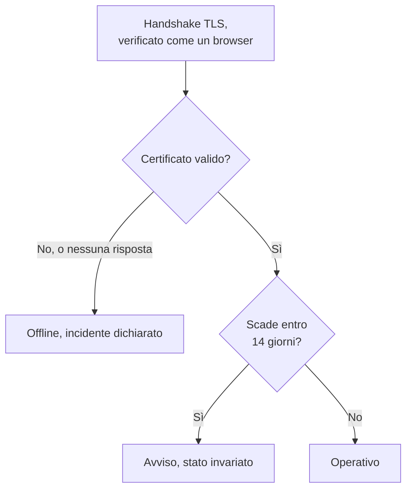

# Monitor certificato SSL

Un monitor del certificato SSL controlla i certificati TLS che presentano i vostri siti e servizi, come fa un browser, e vi avvisa prima che scadano. Mette anche il monitor offline quando un certificato non è più valido: scaduto, autofirmato, emesso per un altro nome host o da un'autorità di cui i browser non si fidano.

:::cards
- [Creare il monitor](#creare-un-monitor-del-certificato-ssl): Sei passaggi nella dashboard.
- [Criteri predefiniti](#criteri-predefiniti): Un avviso di scadenza con 14 giorni di anticipo, senza configurare nulla.
- [Criteri di monitoraggio](#criteri-di-monitoraggio): Validità, scadenza e certificati autofirmati.
- [Risoluzione dei problemi](#risoluzione-dei-problemi): Certificati autofirmati e interni.
:::

## Come funziona

A ogni controllo, una sonda apre una connessione TLS verso l'host e la porta dell'URL, la porta `443` a meno che l'URL non ne indichi un'altra, e verifica il certificato come farebbe un browser: un emittente affidabile, un nome host che corrisponde e date che includono oggi. Se il certificato non supera la verifica, la sonda lo legge comunque, quindi la sua data di scadenza, il suo emittente e le sue impronte vengono registrati in ogni caso. Una connessione che fallisce, va in timeout o presenta un certificato non valido viene ritentata, fino al numero di tentativi che consentite. Poi OneUptime valuta il risultato con i criteri del monitor.

Una sonda che ha perso la propria connessione di rete non riporta alcun risultato, quindi non può segnare il vostro certificato come non valido.

## Prima di iniziare

- **Un ruolo che può creare monitor**: Project Owner, Project Admin, Project Member, Monitor Admin o Monitor Member, oppure un ruolo personalizzato con il permesso Create Monitor.
- **Una sonda che raggiunga l'host e la porta.** Le sonde predefinite del vostro progetto vengono scelte per ogni nuovo monitor. Un servizio su una rete privata ha bisogno di una [sonda personalizzata](/docs/probe/custom-probe) in quella rete.

## Creare un monitor del certificato SSL

:::steps
### Iniziare un nuovo monitor

Andate in **Monitor** e fate clic su **Crea monitor**. In **Tipo di monitor**, scegliete **SSL Certificate**.

### Dargli un nome

Inserite un **Nome**, come `example.com certificate`, poi fate clic su **Avanti**.

### Inserire l'URL

In **URL sito web**, inserite il sito di cui controllare il certificato, come `https://example.com`. Per un servizio su un'altra porta, includetela: `https://example.com:8443`.

### Testarlo

Fate clic su **Testa il monitor**, scegliete una sonda in **Seleziona sonda** e fate clic su **Esegui test**. **Risultato del test del monitor** mostra il certificato ricevuto dalla sonda, con il suo emittente e la sua data di scadenza.

### Rivedere i criteri

**Criteri del monitor** parte dai [criteri predefiniti](#criteri-predefiniti): offline quando il certificato non è valido, un avviso quando scade entro 14 giorni. Modificateli se serve, poi fate clic su **Avanti**.

### Scegliere le sonde e creare

Mantenete o cambiate le **Sonde** e l'**Intervallo di monitoraggio** (parte da **Ogni 5 minuti**; ai monitor del certificato SSL vengono offerti 5 minuti o più), poi fate clic su **Crea monitor**. Si apre la pagina del monitor.
:::

## Opzioni di configurazione

| Campo | Predefinito | Cosa inserire |
| --- | --- | --- |
| **URL sito web** | Nessuno | Il sito di cui controllare il certificato, come `https://example.com` o `https://example.com:8443`. Vengono usati solo l'host e la porta; il percorso viene ignorato. |
| **Timeout della richiesta (secondi)** (sotto **Altri campi**) | `60` | Quanto attendere l'handshake TLS a ogni tentativo. Il massimo è 60 secondi. |
| **Tentativi in caso di errore** (sotto **Altri campi**) | Predefinito della sonda, di solito `3` | Quante volte ritentare un tentativo fallito. Il massimo è 3. |

**Tentativi in caso di errore** conta i nuovi tentativi _dopo_ il primo, quindi `0` esegue il controllo una volta e `2` fino a tre volte. Se lo lasciate vuoto, usa il predefinito della sonda: 3, a meno che `PROBE_MONITOR_RETRY_LIMIT` della sonda non dica altro. Gli errori di connessione, gli errori di convalida del certificato e i timeout vengono tutti ritentati, con una pausa di un secondo tra un tentativo e l'altro.

## Criteri di monitoraggio

I criteri decidono quando il certificato conta come buono, degradato o guasto, e se questo dichiara un incidente o crea un avviso. Ogni criterio controlla uno o più filtri:

| Filtro | Condizioni | Cosa controlla |
| --- | --- | --- |
| **Is Valid Certificate** | **Vero**, **Falso** | Il certificato supera i controlli di un browser: un emittente affidabile, un nome host che corrisponde e date che includono oggi. **Falso** quando l'endpoint non ha risposto. |
| **Is Not A Valid Certificate** | **Vero**, **Falso** | Il contrario di **Is Valid Certificate**: **Vero** quando il certificato non supera quei controlli o non è stato possibile controllarlo. |
| **Is Expired Certificate** | **Vero**, **Falso** | La data di scadenza del certificato è passata. |
| **Is Self Signed Certificate** | **Vero**, **Falso** | Il certificato, o uno della sua catena, è autofirmato. |
| **Expires In Days** | **Greater Than**, **Less Than**, **Greater Than Or Equal To**, **Less Than Or Equal To** | I giorni che mancano alla scadenza del certificato. |
| **Expires In Hours** | **Greater Than**, **Less Than**, **Greater Than Or Equal To**, **Less Than Or Equal To** | Le ore che mancano alla scadenza del certificato. |

**Expires In Days** conta giorni interi: a un certificato che scade tra 14 giorni e 20 ore restano 14 giorni. **Expires In Hours** conta ore intere allo stesso modo.

Con due o più filtri, **Condizione di corrispondenza** decide se devono corrispondere **Tutti** o se basta **Qualsiasi** filtro. Le **Azioni** di un criterio decidono cosa fa: cambiare lo stato del monitor, creare un avviso, dichiarare un incidente, o più di queste cose.

### Criteri predefiniti

Un nuovo monitor del certificato SSL parte con tre criteri, così vi avvisa prima che un certificato scada senza configurare nulla:

1. **Il certificato non è valido** — il certificato è scaduto, è autofirmato, è stato emesso per un altro nome host o da un'autorità non affidabile, oppure non è stato possibile controllarlo perché l'endpoint non ha risposto. Il monitor viene segnato **Offline** e viene creato un incidente chiamato «_monitor name_ certificate is not valid». La sua causa principale dice quale di questi casi era. L'incidente si risolve da solo appena il certificato torna valido.
2. **Il certificato scade presto** — il certificato è valido ma scade entro 14 giorni. Viene creato un **avviso** chiamato «_monitor name_ certificate expires soon».
3. **Il certificato è valido** — il monitor viene segnato **Operativo**.

L'avviso «scade presto» è un avviso, non un incidente: non compare sulle vostre pagine di stato, non chiama nessuno a meno che non gli aggiungiate una policy di reperibilità, e non cambia lo stato del monitor. Usa la seconda gravità di avviso del vostro progetto, **Low** in un nuovo progetto. Quando viene rilevato il certificato rinnovato, il monitor torna su «Il certificato è valido» e l'avviso si risolve da solo.

I criteri vengono controllati dall'alto verso il basso, e il primo che corrisponde decide cosa succede. Per questo «scade presto» sta sopra «è valido»: un certificato in scadenza è ancora valido, quindi corrisponderebbe a entrambi.

Per essere avvisati prima, cambiate il valore del filtro **Expires In Days** nel criterio «scade presto», per esempio in `30`. Per far chiamare qualcuno invece, aprite le **Azioni** di quel criterio: attivate **Quando i filtri corrispondono, dichiara un incidente.**, oppure tenete l'avviso e aggiungetegli una policy di reperibilità in **Policy di reperibilità**.

:::details Aggiungere l'avviso a un monitor creato prima che esistesse
I monitor creati prima che OneUptime aggiungesse questo avviso non hanno un criterio «scade presto». Per aggiungerlo:

1. Sul monitor, aprite **Configurazione → Criteri** e fate clic su **Modifica: Criteri di monitoraggio**.
2. Fate clic su **Aggiungi criteri**. Impostate il suo filtro su **Is Valid Certificate** / **Vero**, fate clic su **Aggiungi filtro** e impostate il secondo su **Expires In Days** / **Less Than Or Equal To** / `14`. Lasciate **Condizione di corrispondenza** su **Tutti** (compare sotto i filtri quando ce ne sono due).
3. In **Azioni**, attivate **Quando i filtri corrispondono, crea un avviso.** e lasciate disattivato **Quando i filtri corrispondono, modifica lo stato del monitor.**, così crea un avviso e non cambia lo stato del monitor.
4. Trascinate il nuovo criterio sopra il criterio che segna il monitor come online, poi salvate.
:::

### Esempi di criteri

| Obiettivo | Filtro | Condizione | Valore |
| --- | --- | --- | --- |
| Avvisare con un mese di anticipo | **Expires In Days** | **Less Than Or Equal To** | `30` |
| Chiamare qualcuno l'ultimo giorno | **Expires In Hours** | **Less Than** | `24` |
| Offline solo quando il certificato è scaduto | **Is Expired Certificate** | **Vero** | — |
| Segnalare un certificato autofirmato | **Is Self Signed Certificate** | **Vero** | — |

Un criterio sulla scadenza deve stare sopra il criterio che segna il certificato come valido: un certificato in scadenza è ancora valido, e vince il primo criterio che corrisponde.

## Buone pratiche

1. **Datevi il tempo di rinnovare** — L'avviso predefinito arriva 14 giorni prima della scadenza, il che va bene per i certificati che si rinnovano da soli. Se per voi rinnovare richiede più tempo (un certificato acquistato, o un processo di modifica), portatelo a 30 giorni.
2. **Monitorate ogni endpoint** — Se avete più domini o sottodomini, create un monitor per ciascuno. Ognuno può avere il proprio certificato.
3. **Includete le altre porte** — Anche i servizi che offrono TLS su una porta diversa da `443`, come `8443`, hanno certificati. Mettete la porta nell'URL.
4. **Controllate dopo il rinnovo** — Dopo aver rinnovato un certificato, guardate il risultato successivo del monitor: la data di scadenza mostrata dovrebbe essere quella nuova.

## Risoluzione dei problemi

:::details Il certificato va bene nel mio browser, ma il monitor dice che non è valido
La causa principale dell'incidente dice perché. Un caso comune è un server che invia il suo certificato senza i certificati intermedi: i browser spesso colmano la lacuna da soli, la sonda no. Configurate il server perché invii la catena completa. Un altro è un URL il cui nome host non è nel certificato.
:::

:::details Monitoro un servizio interno con un certificato autofirmato
Un certificato autofirmato non è mai valido, quindi i criteri predefiniti tengono il monitor offline. **Is Self Signed Certificate**, **Is Expired Certificate** e **Expires In Days** funzionano comunque con esso, quindi costruite i criteri su questi. In **Configurazione → Criteri**:

1. Nel criterio «non è valido», fate clic su **Aggiungi filtro**, impostate il nuovo filtro su **Is Self Signed Certificate** / **Falso** e impostate **Condizione di corrispondenza** su **Tutti**. Il criterio mette ancora il monitor offline quando l'endpoint non risponde, o il certificato è sbagliato in un altro modo.
2. Aggiungete un criterio con **Is Expired Certificate** / **Vero** che segni il monitor **Offline** e dichiari un incidente, e trascinatelo in cima.
3. Nel criterio «scade presto», sostituite **Is Valid Certificate** / **Vero** con **Is Expired Certificate** / **Falso**, così l'avviso copre anche il certificato autofirmato.

Finché il certificato è valido nel tempo, nessun criterio corrisponde e il monitor mostra il suo stato predefinito, **Operativo**.
:::

:::details Il monitor è offline con «could not be checked because the endpoint is not reachable»
La sonda non è riuscita ad aprire una connessione TLS verso l'host e la porta. Controllate la porta nell'URL, e che un firewall lasci passare le sonde. Un host su una rete privata ha bisogno di una [sonda personalizzata](/docs/probe/custom-probe).
:::

## Passaggi successivi

:::cards
- [Monitor sito web](/docs/monitor/website-monitor): Controllare che il sito stesso risponda.
- [Monitor dominio](/docs/monitor/domain-monitor): Essere avvisati prima che la registrazione del dominio scada.
- [Regole di escalation](/docs/on-call/escalation-rules): Decidere chi viene chiamato dagli avvisi e dagli incidenti.
- [Panoramica degli incidenti](/docs/incidents/index): Cosa succede dopo che il monitor ne ha dichiarato uno.
:::
