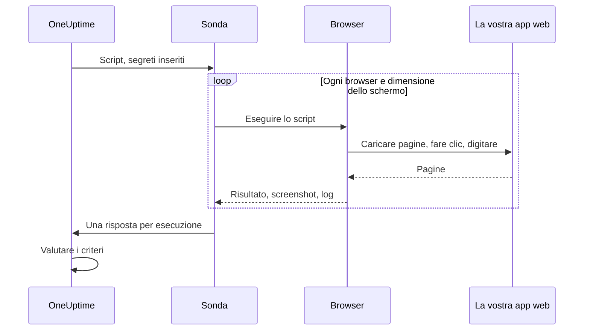

# Monitor sintetico

Un monitor sintetico pilota la vostra applicazione web in un browser vero, a intervalli regolari, con uno script Playwright scritto da voi: apre pagine, compila moduli e percorre un tragitto utente, e fallisce quando il tragitto fallisce. Usatelo per accorgervi dei guasti che un controllo di disponibilità non vede: un accesso che non funziona più, un pulsante di pagamento che non fa nulla, una dashboard che non finisce mai di caricarsi.

:::cards
- [Creare il monitor](#creare-un-monitor-sintetico): Scrivete uno script e scegliete browser e dimensioni dello schermo.
- [Scrivere lo script](#scrivere-lo-script): Un percorso di accesso pronto all'uso come punto di partenza.
- [Screenshot](#screenshot): Vedete com'era la pagina quando un'esecuzione è fallita.
- [Cosa può usare lo script](#moduli-disponibili-nello-script): Playwright, HTTP, crittografia e metriche.
:::

## Come funziona

A ogni controllo, una sonda esegue il vostro script una volta per ogni browser e ogni dimensione dello schermo che avete scelto, uno dopo l'altro. Ogni esecuzione avvia un browser nuovo, senza cookie né archiviazione delle esecuzioni precedenti; lo script pilota la propria pagina, fa screenshot e restituisce un risultato o genera un errore. La sonda riporta ogni esecuzione, e OneUptime valuta su di esse i vostri criteri.



| Tipo di schermo | Viewport |
| --- | --- |
| Mobile | 360 × 640 |
| Tablet | 1024 × 768 |
| Desktop | 1920 × 1080 |

I browser sono Chromium e Firefox.

## Prima di iniziare

- Una **sonda** in grado di raggiungere la vostra app web. Usate una [sonda personalizzata](/docs/probe/custom-probe) per un'app all'interno della vostra rete. L'immagine Docker della sonda include Chromium e Firefox; una sonda eseguita fuori da Docker deve averli installati.
- Ogni password o token di cui il percorso ha bisogno, salvato come [segreto del monitor](/docs/monitor/monitor-secrets).

## Creare un monitor sintetico

:::steps
### Iniziare un nuovo monitor

Andate in **Monitor** e fate clic su **Crea monitor**. In **Tipo di monitor**, fate clic su **Altri tipi di monitor** e scegliete **Synthetic Monitor** sotto **Synthetic Monitoring**, oppure digitate `playwright` nella casella di ricerca. Inserite un **Nome**, poi fate clic su **Avanti**.

### Aggiungere lo script

Scrivete lo script nell'editor **Playwright Code**. Partite dall'[esempio qui sotto](#scrivere-lo-script).

### Scegliere browser e dimensioni dello schermo

Spuntate i browser in **Tipo di browser** e le dimensioni in **Tipo di schermo**. Lo script viene eseguito una volta per ogni combinazione, quindi due browser e tre dimensioni fanno sei esecuzioni per controllo. In **Altri campi**, **Numero di tentativi in caso di errore** ripete un'esecuzione fallita fino a 5 volte.

### Testarlo

Fate clic su **Testa il monitor** per eseguire lo script una volta da una sonda, e controllate risultato, log e screenshot di ogni esecuzione.

### Rivedere i criteri

Il monitor parte con due criteri: è offline, e dichiara un incidente, quando un'esecuzione fallisce, e online quando non ne fallisce nessuna. Modificateli o aggiungetene di vostri (vedete [Criteri](#criteri)), poi fate clic su **Avanti**.

### Scegliere le sonde e creare

Selezionate le **Sonde** e un **Intervallo di monitoraggio** (ai monitor sintetici sono proposti intervalli di 5 minuti o più), poi fate clic su **Crea monitor**.
:::

## Scrivere lo script

Lo script è il corpo di una funzione `async`. `page` è una pagina compatibile con Playwright già aperta; pilotatela, restituite un risultato con `return` e fate fallire l'esecuzione con `throw` (oppure lasciando scadere una chiamata di Playwright). Questo esempio effettua l'accesso e controlla che la dashboard si carichi:

```javascript title="Synthetic monitor script"
await page.goto("https://app.example.com/login");
screenshots["login-page"] = await page.screenshot();

await page.fill("#email", "monitoring@example.com");
await page.fill("#password", "{{monitorSecrets.AppPassword}}");
await page.click("button[type=submit]");

// Fails the run if the dashboard does not appear within 10 seconds.
await page.waitForSelector(".dashboard", { timeout: 10000 });
screenshots["dashboard"] = await page.screenshot();

console.log(`Signed in on ${browserType}, ${screenSizeType}`);

return {
  data: { title: await page.title() },
};
```

| Per | Fate così | Cosa registra OneUptime |
| --- | --- | --- |
| Riportare un risultato | `return { data: ... }` | Il **Risultato** dell'esecuzione. Viene conservato solo `data`. |
| Far fallire l'esecuzione | `throw new Error("...")`, oppure lasciar scadere un'attesa | L'**Errore di script** dell'esecuzione. |
| Conservare prove | `screenshots["name"] = await page.screenshot()` | Uno screenshot, conservato anche quando l'esecuzione fallisce. |
| Lasciare una traccia | `console.log(...)` | I messaggi di log dell'esecuzione. |

Per vedere le esecuzioni, aprite la **Panoramica** del monitor: la scheda **Riepilogo del monitor** ha un blocco per browser e dimensione dello schermo, e **Mostra altri dettagli** mostra gli screenshot di ogni esecuzione.

### Uso di Playwright

Usiamo Playwright per simulare le interazioni degli utenti. Il valore `page` è una facciata sicura e compatibile con Playwright per la pagina creata per questa esecuzione. Sono disponibili i metodi comuni di `Page`, `Locator`, `Frame`, `ElementHandle`, `JSHandle`, `Request`, `Response`, della tastiera, del mouse e del contesto del browser. Questo comprende navigazione, locator, clic, compilazione dei moduli, valutazione nella pagina, popup, pagine aggiuntive, ispezione delle risposte e screenshot. Potete raggiungere il contesto del browser dell'esecuzione tramite `page.context()`, per esempio per aprire una nuova pagina o gestire un popup.

Gli script sintetici non vengono eseguiti nel processo Node.js della sonda. I valori attraversano il confine di esecuzione come dati copiati o come capacità opache legate all'esecuzione, quindi alcune API di Playwright funzionano in modo diverso, o non funzionano affatto:

| Non disponibile | Usate invece |
| --- | --- |
| I metodi di avvio o connessione del browser, le sessioni CDP, il routing delle richieste, i binding esposti, i campi privati di Playwright e qualsiasi opzione che legga o scriva un percorso del file system dell'host. `page.context().browser()` quindi non è disponibile. | La pagina e il contesto del browser che vi vengono forniti. |
| I listener di eventi (`page.on(...)`, `page.once(...)`): chiamarli fallisce con un errore chiaro. | `page.waitForEvent(...)` per finestre di dialogo e popup, oppure attese di risposte e richieste con corrispondenze per stringa o espressione regolare. |
| I predicati sotto forma di funzione per i metodi di attesa di eventi, richieste, risposte e URL. | Corrispondenze per stringa o espressione regolare, locator, oppure un polling esplicito. |
| Gli accessori sincroni dei frame (`page.frames()`, `page.mainFrame()`, `page.frame(...)`). | `page.frameLocator(...)` per gli iframe. |
| `page.request.*` | Il globale `axios` per le richieste HTTP. |
| Screenshot a pagina intera e output PDF. | Screenshot del viewport, che mantengono il comportamento delle prove di errore descritto sotto. |

`page.waitForNavigation(...)`, `page.setDefaultTimeout(...)` e `page.setDefaultNavigationTimeout(...)` sono supportati. `page.waitForEvent(...)` attende `dialog`, `domcontentloaded`, `load`, `popup`, `request`, `requestfailed`, `requestfinished` e `response`. Le funzioni di valutazione passate a metodi come `page.evaluate()` vengono eseguite nella pagina del browser monitorata, mai nel processo della sonda. Ogni esecuzione può usare fino a otto pagine.

I permessi del browser sono limitati a geolocalizzazione e notifiche. Appunti, fotocamera, microfono, MIDI, font locali e gli altri permessi sui dispositivi dell'host non sono disponibili per gli script dei monitor.

### Cosa restituisce lo script

I dati restituiti dallo script vengono serializzati in JSON prima di essere salvati: negli oggetti e negli array semplici, `NaN` e `Infinity` diventano `null`, le proprietà `undefined` e le funzioni vengono eliminate, e gli oggetti `Date` diventano stringhe ISO, esattamente come fa `JSON.stringify`. Le istanze di classi e gli altri oggetti non semplici vengono eliminati del tutto. Un `BigInt` diventa una stringa. Un risultato circolare, annidato per più di 30 livelli o più grande di 5 MB fa invece fallire l'esecuzione.

### Avvisi sui dati restituiti

Ciò che lo script restituisce come `data` è il **Result Value** del monitor, che un criterio può confrontare. Quando `data` è un oggetto o un array, compilate **Percorso del campo (facoltativo)** nel filtro Result Value per confrontare uno dei suoi campi: per esempio `status`, `timings.loadTime` o `errors[0].message`. Il filtro viene controllato sui dati di ogni browser e dimensione dello schermo su cui gira il monitor, e corrisponde quando corrisponde uno qualsiasi di essi. Consultate [Avvisi sui dati restituiti](/docs/monitor/custom-code-monitor#avvisi-sui-dati-restituiti) per come funzionano percorsi e condizioni.

## Screenshot

Nel contesto dello script è disponibile un oggetto `screenshots` già dichiarato. Assegnategli screenshot in qualsiasi punto dello script: questi screenshot vengono conservati **anche se lo script genera un errore** (comprese asserzioni fallite, timeout ed errori imprevisti), così vedete esattamente com'era la pagina quando l'esecuzione è fallita. Gli screenshot catturati compaiono nella dashboard di OneUptime per quella specifica esecuzione del monitor.

```javascript
// Capture screenshots via the `screenshots` side-channel — they are preserved on both success and failure.

await page.goto("https://app.example.com/login");
screenshots["login-page"] = await page.screenshot();

await page.fill("#email", "user@example.com");
await page.fill("#password", "wrong");
await page.click("button[type=submit]");

// If the next assertion throws, the `login-page` screenshot above is still captured.
await page.waitForSelector(".dashboard", { timeout: 5000 });

screenshots["dashboard"] = await page.screenshot();

return {
  data: "Login succeeded",
};
```

Un'esecuzione conserva fino a 20 screenshot, ciascuno fino a 10 MB e 50 MB in totale. Uno screenshot può anche comparire nell'incidente o nell'avviso aperto da un'esecuzione fallita (nella sua pagina e nelle email che lo riguardano) se lo inserite nella descrizione di incidente o di avviso del monitor. Consultate [Mostrare uno screenshot](/docs/monitor/incident-alert-templating#monitor-sintetico).

:::details Restituire gli screenshot (metodo precedente)
Per compatibilità con il passato, potete anche restituire gli screenshot dallo script come parte del valore di ritorno. Gli screenshot restituiti così vengono conservati **solo** quando lo script termina normalmente: vanno persi se lo script genera un errore. Preferite il canale laterale descritto sopra quando volete prove dei fallimenti.

```javascript
// Legacy pattern — screenshots only captured on successful return.
const screenshots = {};
screenshots["screenshot-name"] = await page.screenshot();

return {
  data: "Hello World",
  screenshots: screenshots,
};
```
:::

## Usare i segreti del monitor

Fate riferimento a un segreto con `{{monitorSecrets.NAME}}` in qualsiasi punto dello script. OneUptime sostituisce il riferimento con il valore del segreto, come testo semplice, prima che lo script arrivi alla sonda. Racchiudete quindi il segreto tra virgolette per usarlo come stringa, e lasciatelo senza virgolette per usarlo come numero o booleano:

```javascript
// Used as a string: wrap it in quotes.
const password = "{{monitorSecrets.AppPassword}}";

// Used as a number or a boolean: leave it bare.
const retryLimit = {{monitorSecrets.RetryLimit}};
const verbose = {{monitorSecrets.Verbose}};
```

Per creare un segreto e scegliere quali monitor possono usarlo, consultate [Segreti del monitor](/docs/monitor/monitor-secrets).

## Metriche personalizzate

Potete catturare metriche personalizzate dallo script con la funzione `oneuptime.captureMetric()`. Queste metriche vengono salvate in OneUptime e possono essere rappresentate nelle dashboard con l'esploratore di metriche.

```javascript
oneuptime.captureMetric(name, value, attributes);
```

| Parametro | Tipo | Descrizione |
| --- | --- | --- |
| `name` | string, obbligatorio | Il nome della metrica (ad es. `"dashboard.load.time"`). Viene salvato automaticamente con il prefisso `custom.monitor.`. |
| `value` | number, obbligatorio | Il valore numerico della metrica. |
| `attributes` | object, facoltativo | Coppie chiave-valore per aggiungere contesto. |

### Esempio

```javascript
await page.goto("https://app.example.com");

const startTime = Date.now();
await page.waitForSelector("#dashboard-loaded");
const loadTime = Date.now() - startTime;

// Capture page load time, tagged with this run's browser and screen size
oneuptime.captureMetric("dashboard.load.time", loadTime, {
  page: "dashboard",
  browser: browserType,
  screen: screenSizeType,
});

screenshots["dashboard"] = await page.screenshot();

return {
  data: { loadTime },
};
```

Una volta catturate, queste metriche compaiono nell'esploratore di metriche con nomi come `custom.monitor.dashboard.load.time`, e nella pagina **Metriche** del monitor sotto **Metriche personalizzate**. OneUptime aggiunge il monitor e la sonda a ogni punto dati; per filtrare per browser o dimensione dello schermo, passateli come attributi, come fa l'esempio.

Un'esecuzione può catturare al massimo 100 metriche, solo con valori numerici, e OneUptime ne conserva al massimo 100 per controllo, contando tutte le sue esecuzioni. Come per un monitor Custom Code, alcuni nomi di attributo sono [riservati](/docs/monitor/custom-code-monitor#chiavi-di-attributo-riservate) e vengono scartati se uno script li imposta.

## Criteri

| Tipo di filtro | Cosa controlla |
| --- | --- |
| **Errore** | L'errore generato da un'esecuzione, se presente. |
| **Result Value** | I `data` restituiti da un'esecuzione. |
| **Tempo di esecuzione (in ms)** | Quanto è durata un'esecuzione. |
| **Tipo di browser** | Il browser usato da un'esecuzione: **Equal To** o **Not Equal To**. |
| **Screen Size** | La dimensione dello schermo usata da un'esecuzione: **Equal To** o **Not Equal To**. |

Ogni filtro viene controllato su ogni esecuzione, e corrisponde quando corrisponde anche una sola esecuzione. I filtri vengono controllati separatamente, non esecuzione per esecuzione: **Errore** Is Not Empty insieme a **Tipo di browser** Equal To `Firefox` corrisponde quando un'esecuzione qualsiasi è fallita e una delle esecuzioni ha usato Firefox, non solo quando è fallita l'esecuzione Firefox. Per tenere d'occhio un browser da solo, dategli un monitor tutto suo.

Nei modelli di incidente e di avviso, ogni esecuzione si trova in `{{syntheticResponses}}`: consultate [Modelli di incidenti e avvisi](/docs/monitor/incident-alert-templating#monitor-sintetico).

## Moduli disponibili nello script

| Nome | Che cos'è |
| --- | --- |
| `page` | Una facciata sicura compatibile con Playwright per interagire con il browser. Tramite `page.context()` potete raggiungere il contesto del browser dell'esecuzione per creare pagine o gestire popup, ma avvio/connessione del browser, CDP, routing, binding, campi privati e opzioni con percorsi dell'host non sono disponibili. |
| `screenshots` | Un oggetto già dichiarato a cui assegnare gli screenshot (ad es. `screenshots['login-page'] = await page.screenshot()`). Gli screenshot assegnati qui vengono conservati anche se in seguito lo script genera un errore. |
| `browserType` | Il browser di questa esecuzione: `Chromium` o `Firefox`. |
| `screenSizeType` | La dimensione dello schermo di questa esecuzione: `Mobile`, `Tablet` o `Desktop`. |
| `axios` | Un client HTTP basato sulle promise che supporta axios richiamabile più `request`, `get`, `head`, `options`, `post`, `put`, `patch`, `delete` e `create`. Il corpo di una richiesta può arrivare a 1 MB e una risposta a 5 MB; segue fino a 5 reindirizzamenti e va in timeout dopo al massimo 30 secondi. Trasporti, adattatori, socket, agent e sostituzioni del proxy personalizzati non sono disponibili. |
| `crypto` | Un'implementazione per worker del browser di hash SHA-256, HMAC-SHA-256, `randomBytes`, `randomInt` e `randomUUID`. |
| `console` | `console.log`, `info`, `warn` ed `error`. I messaggi vengono conservati con ogni esecuzione. |
| `oneuptime.captureMetric` | Cattura una metrica personalizzata. Consultate [Metriche personalizzate](#metriche-personalizzate). |
| `http` | Una facciata di compatibilità con buffer, solo lato client, che supporta `request`, `get` e `Agent`. |
| `https` | L'equivalente HTTPS della facciata `http` solo lato client. |
| `Buffer`, `setTimeout`, `setInterval` | E le loro funzioni `clear`. |

Lo script viene eseguito in un worker del browser, non in Node.js, e non può aprire connessioni di rete proprie: `fetch`, `XMLHttpRequest` e `WebSocket` sono bloccati. Usate `axios` per le richieste HTTP.

## Limiti

| Limite | Predefinito | Impostazione della sonda |
| --- | --- | --- |
| Timeout dello script | 60 secondi. I worker andati in timeout e tutti i discendenti del browser vengono terminati. | `PROBE_SYNTHETIC_MONITOR_SCRIPT_TIMEOUT_IN_MS` |
| Memoria per l'intero albero di processi di un'esecuzione | 1,5 GiB | `PROBE_SYNTHETIC_MONITOR_MAX_PROCESS_TREE_RSS_BYTES` |
| Archiviazione scrivibile del browser | 256 MiB | `PROBE_SYNTHETIC_MONITOR_MAX_DISK_BYTES` |
| Esecuzioni contemporanee su una sonda | 4 | `PROBE_SYNTHETIC_MONITOR_MAX_CONCURRENCY` |
| Pagine per esecuzione | 8 | — |

Superare il limite di memoria o di archiviazione termina quell'esecuzione e ne rimuove il profilo temporaneo. Le impostazioni della sonda valgono per le sonde self-hosted; il chart Helm imposta gli stessi valori per ogni sonda (per esempio `syntheticMonitorScriptTimeoutInMs`).

I browser sono inclusi nell'immagine Docker della sonda, quindi una sonda self-hosted riceve browser più recenti quando ne aggiornate l'immagine.

## Risoluzione dei problemi

:::details Un'esecuzione fallisce, ma non capisco perché
Assegnate degli screenshot all'oggetto `screenshots` prima di ogni passaggio rischioso. Vengono conservati anche quando l'esecuzione fallisce, e mostrano com'era la pagina in quel punto.
:::

:::details `page.on(...)` genera un errore
I listener di eventi non possono attraversare il confine di isolamento. Usate `page.waitForEvent(...)` per finestre di dialogo e popup, oppure un'attesa di risposta o di richiesta con una corrispondenza per stringa o espressione regolare.
:::

:::details L'esecuzione va in timeout
Attendete elementi precisi con `page.waitForSelector(...)` e un `timeout` più breve del limite dello script stesso, così l'esecuzione fallisce sul passaggio lento con un errore chiaro.
:::

:::details Una sonda self-hosted dice di non trovare l'eseguibile del browser
La sonda è in esecuzione fuori dalla sua immagine Docker, senza Chromium né Firefox installati. Eseguite l'immagine della sonda, oppure installate i browser su quella macchina.
:::

## Passi successivi

:::cards
- [Monitor codice personalizzato](/docs/monitor/custom-code-monitor): Controllate le API con uno script, senza browser.
- [Mostrare uno screenshot](/docs/monitor/incident-alert-templating#monitor-sintetico): Inserite nell'incidente lo screenshot dell'esecuzione fallita.
- [Segreti del monitor](/docs/monitor/monitor-secrets): Tenete le credenziali fuori dallo script.
:::
