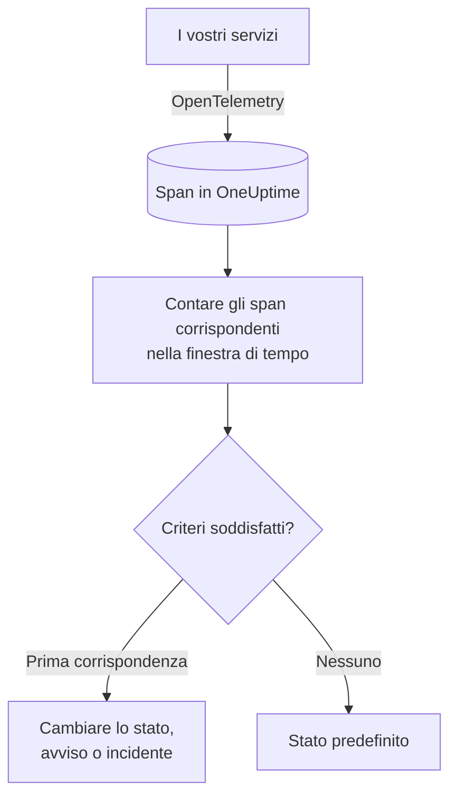

# Monitor tracce

Un monitor tracce conta, in una finestra di tempo, gli span che i vostri servizi inviano a OneUptime e che corrispondono ai vostri filtri (nome dello span, stato, servizio, attributi). Quando il conteggio soddisfa i vostri criteri, cambia lo stato del monitor, crea un avviso o dichiara un incidente. Usatelo per essere avvisati di richieste non riuscite verso un endpoint, di un picco di span in errore o di un servizio che ha smesso di inviare tracce.

:::cards
- [Creare il monitor](#creare-un-monitor-tracce): Scegliere quali span contare e quando avvisare.
- [Codici di stato degli span](#codici-di-stato-degli-span): Cosa significano OK, ERROR e UNSET, e su quale filtrare.
- [Come viene valutato](#come-viene-valutato): La finestra di tempo, il conteggio e il ciclo di un minuto.
- [Criteri](#criteri): Soglie, rilevamento delle anomalie e valori predefiniti.
:::

## Come funziona

Ogni minuto, OneUptime conta gli span che corrispondono ai filtri del monitor e sono iniziati nella sua finestra di tempo. Confronta quel conteggio con i criteri del monitor dall'alto verso il basso, e il primo criterio che corrisponde decide cosa succede. Se nessuno corrisponde, il monitor torna al suo stato predefinito.

## Prima di iniziare

- I vostri servizi inviano tracce a OneUptime tramite OpenTelemetry. Vedete [OpenTelemetry](/docs/telemetry/open-telemetry).
- Cercate nell'esploratore delle tracce il nome esatto dello span da sorvegliare: i nomi degli span li stabilisce la vostra strumentazione, per esempio `POST /api/checkout` o `GET`.

## Creare un monitor tracce

:::steps
### Iniziare un nuovo monitor

Andate in **Monitor** e fate clic su **Crea monitor**.

### Scegliere Traces

In **Tipo di monitor**, fate clic su **Altri tipi di monitor** e scegliete **Tracce** sotto **Telemetria**, oppure digitate `traces` nella casella di ricerca. Inserite un **Nome**, poi fate clic su **Avanti**.

### Scegliere gli span da contare

In **Configurazione monitor di trace**, impostate **Nome dello span**, **Tracce del monitor per (time)** e **Filtra per stato dello span**. Un filtro lasciato vuoto corrisponde a tutti gli span. **Anteprima degli span**, sotto i filtri, mostra gli span a cui corrispondono in questo momento.

### Restringere il campo (facoltativo)

Aprite **Altri campi** per filtrare per servizio di telemetria, entità dell'infrastruttura o attributo.

### Impostare i criteri

La scheda **Criteri del monitor** parte con due criteri: offline, con un incidente, quando nessuno span corrisponde; online quando ne corrisponde almeno uno. Modificateli in base a ciò su cui volete essere avvisati (vedete [Criteri](#criteri)).

### Creare il monitor

Fate clic su **Crea monitor**. Il monitor si apre sulla sua pagina **Panoramica**, e la sua prima valutazione avviene entro un minuto.
:::

> [!TIP]
> Per sapere quando una funzione di IA risponde male (risposte non riuscite, rifiutate, troncate, vuote, segnalate o lente), scegliete invece **IA / LLM** sotto **Telemetria**. Quel monitor legge per voi le chiamate di IA nelle vostre tracce, senza filtri sugli span da scrivere. Vedete [Osservabilità IA / LLM](/docs/telemetry/ai-llm-observability#vieni-avvisato-quando-lia-risponde-male).

## Cosa interroga

| Campo | A cosa corrisponde | Predefinito |
| --- | --- | --- |
| **Nome dello span** | Span il cui nome contiene questo testo, senza distinzione tra maiuscole e minuscole. | Vuoto: tutti gli span |
| **Tracce del monitor per (time)** | Span iniziati negli ultimi 5 secondi fino alle ultime 24 ore. | **Ultimo minuto** |
| **Filtra per stato dello span** | Span con uno qualsiasi degli stati scelti: **Non impostato**, **Ok** o **Errore**. | Vuoto: tutti gli stati |
| **Filtra per servizio di telemetria** (in **Altri campi**) | Span di uno qualsiasi dei servizi scelti. | Vuoto: tutti i servizi |
| **Filter by Infrastructure Entity** (in **Altri campi**) | Span di uno qualsiasi degli host, pod, container e altre entità scelti. | Vuoto: tutte le entità |
| **Filtra per attributi** (in **Altri campi**) | Span i cui attributi soddisfano ogni condizione. Ogni condizione ha il proprio operatore, come «uguale a» o «contiene». | Vuoto: nessuna condizione |

Tutti i filtri che impostate devono corrispondere perché uno span venga contato.

### Codici di Stato degli Span

- **OK** — L'operazione è stata contrassegnata esplicitamente come riuscita, dal codice dell'applicazione o da una pipeline di tracce
- **ERROR** — L'operazione ha incontrato un errore
- **UNSET** — Non è stato impostato alcuno stato di errore. È lo stato predefinito di OpenTelemetry

UNSET non significa che manchino dei dati. La strumentazione OpenTelemetry imposta ERROR quando un'operazione non riesce e lascia in UNSET gli span andati a buon fine, quindi su un servizio in salute la maggior parte degli span è UNSET. OneUptime li mostra in verde come «Unset (no error)». Registrare un'eccezione non modifica lo stato di uno span, quindi uno span in UNSET può comunque avere eccezioni, che vengono elencate insieme allo span. Per ricevere avvisi in caso di errore, filtrare per ERROR. Per contare tutti gli span che non sono falliti, selezionare sia OK sia UNSET.

Se si desidera che le richieste riuscite vengano mostrate come OK, aggiungere una pipeline di tracce in **Tracce > Impostazioni > Pipeline** con la condizione di filtro **Stato = Non impostato** e un **Rimappatore di stato** che mappi su Ok i valori di `http.response.status_code` come `200`.

## Come viene valutato

- **Ogni minuto.** Un monitor tracce non viene controllato da sonde, quindi non ha un intervallo da impostare né una pagina **Sonde e intervallo**.
- **Un numero per valutazione.** Il monitor conta gli span che corrispondono a ogni filtro e sono iniziati entro **Tracce del monitor per (time)** prima della valutazione. Con **Ultimi 5 minuti**, ogni valutazione guarda indietro di cinque minuti, quindi le finestre di valutazioni consecutive si sovrappongono.
- **Nessuno span significa un conteggio di 0.** Un servizio che smette di inviare tracce produce 0, che è ciò che cerca il criterio offline predefinito.
- **L'interruzione di OneUptime stesso non è silenzio.** Finché la finestra di tempo contiene un periodo in cui OneUptime stesso non riceveva dati (si stava riavviando, veniva aggiornato o recuperava un arretrato), il controllo attende: lo stato non cambia e nessun incidente o avviso viene aperto o risolto. Vedete [Quando OneUptime non riceve dati](/docs/monitor/when-oneuptime-is-not-receiving).
- **Criteri dall'alto verso il basso.** Decide il primo criterio che corrisponde, quindi mettete per primo il più grave.

Ogni cambio di stato, con il suo motivo, viene registrato nella **Cronologia di stato** del monitor.

## Criteri

I criteri di un monitor tracce hanno un solo **Tipo di filtro**: **Span Count**, il numero di span che hanno corrisposto nella finestra. Scegliete una **Condizione del filtro** e, per una condizione di soglia, un **Valore**.

| Condizione del filtro | Corrisponde quando il conteggio degli span è… |
| --- | --- |
| **Greater Than** | sopra il valore |
| **Greater Than Or Equal To** | pari al valore o superiore |
| **Less Than** | sotto il valore |
| **Less Than Or Equal To** | pari al valore o inferiore |
| **Equal To** | esattamente il valore |
| **Anomalously High** | sopra l'intervallo atteso per quest'ora della settimana |
| **Anomalously Low** | sotto quell'intervallo |
| **Anomalous** | fuori da quell'intervallo, in un senso o nell'altro |

Le condizioni di anomalia non hanno un **Valore**. Scegliete una **Sensibilità** (Low, Medium, quella predefinita, oppure High) e una **Finestra di riferimento** di 14 (quella predefinita), 28, 60 o 90 giorni. OneUptime trasforma il conteggio in un tasso al minuto e lo confronta con la stessa ora della settimana in quella finestra. Il riferimento copre solo i servizi e gli stati degli span del monitor: i suoi filtri sul nome dello span e sugli attributi non ne fanno parte. Finché quell'ora della settimana non ha abbastanza storico, il criterio sta ancora imparando e non scatta.

Un nuovo monitor tracce parte con questi criteri:

| Criterio | Filtro | Effetto |
| --- | --- | --- |
| Check if … is offline | **Span Count** **Equal To** `0` | Mette il monitor offline e dichiara un incidente, risolto automaticamente |
| Check if … is online | **Span Count** **Greater Than** `0` | Mette il monitor online |

## Esempio pratico: richieste di checkout non riuscite

In cinque minuti, il servizio di checkout registra 1.200 span chiamati `POST /api/checkout`: 1.150 UNSET, 20 OK e 30 ERROR. Lo stesso monitor conta numeri molto diversi a seconda di **Filtra per stato dello span**:

| Filtra per stato dello span | Span Count | Cosa misura |
| --- | --- | --- |
| **Errore** | 30 | Le richieste non riuscite |
| **Ok** | 20 | Solo le richieste che il vostro codice ha contrassegnato come riuscite |
| **Non impostato** e **Ok** | 1.170 | Tutte le richieste che non sono fallite |
| Vuoto | 1.200 | Tutte le richieste |

Per essere avvisati quando più di 10 richieste di checkout non riescono in cinque minuti:

- **Nome dello span**: `POST /api/checkout`
- **Tracce del monitor per (time)**: **Ultimi 5 minuti**
- **Filtra per stato dello span**: **Errore**
- Criterio 1: **Span Count** **Greater Than** `10`: mettere il monitor offline e dichiarare un incidente
- Criterio 2: **Span Count** **Less Than Or Equal To** `10`: mettere il monitor online

Con 30 richieste non riuscite, corrisponde il criterio 1 e viene dichiarato l'incidente. Quando passano cinque minuti con 10 errori o meno, corrisponde il criterio 2, il monitor torna online e l'incidente si risolve da solo.

## Risoluzione dei problemi

:::details Il monitor non conta alcuno span per il mio endpoint
**Nome dello span** viene confrontato con il nome dello span, e la strumentazione spesso nomina gli span del server in base alla rotta (`POST /api/checkout`) o solo al metodo (`GET`). Cercate il nome esatto nell'esploratore delle tracce. Poi aprite la pagina **Criteri** del monitor (sotto **Configurazione**) e fate clic su **Edit Monitoring Criteria**: **Anteprima degli span** mostra a cosa corrispondono i filtri in questo momento.
:::

:::details Le richieste riuscite non vengono contate quando filtro su Ok
La maggior parte delle strumentazioni lascia gli span riusciti in UNSET, non in OK (vedete [Codici di stato degli span](#codici-di-stato-degli-span)). Selezionate sia **Non impostato** sia **Ok**, oppure aggiungete la pipeline di tracce descritta lì.
:::

:::details Uno span ha un'eccezione ma non viene contato come errore
Registrare un'eccezione non modifica lo stato di uno span. Filtrate su **Errore**, oppure usate un [monitor eccezioni](/docs/monitor/exceptions-monitor) per essere avvisati delle eccezioni stesse.
:::

:::details Un criterio di anomalia non scatta mai
Sta ancora imparando: l'ora della settimana con cui confronta non ha ancora abbastanza storico nella **Finestra di riferimento**.
:::

## Passaggi successivi

:::cards
- [Monitor eccezioni](/docs/monitor/exceptions-monitor): Avvisare sulle eccezioni che i vostri servizi registrano.
- [Monitor log](/docs/monitor/logs-monitor): Avvisare sul volume e sul contenuto dei log.
- [Sintassi di ricerca](/docs/telemetry/search-syntax): Trovare nomi e stati degli span nell'esploratore delle tracce.
- [Modelli di incidenti e avvisi](/docs/monitor/incident-alert-templating): Scrivere titoli e descrizioni degli avvisi utili.
:::
