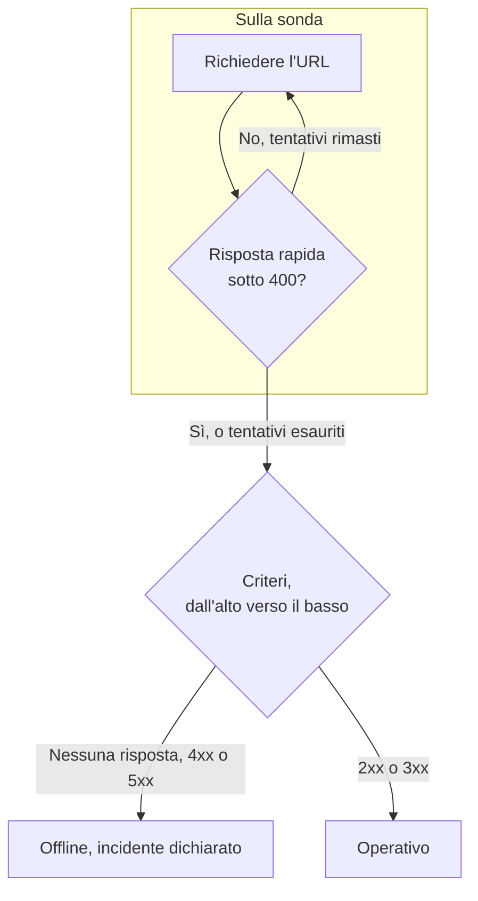

# Monitor sito web

Un monitor di sito web controlla che una pagina web risponda. A ogni controllo una sonda richiede l'URL della pagina, e il monitor va offline e dichiara un incidente quando la pagina non risponde o risponde con un errore. Per chiamare un endpoint con un metodo, intestazioni o un corpo, usate invece un [monitor API](/docs/monitor/api-monitor).

:::cards
- [Creare il monitor](#creare-un-monitor-di-sito-web): Sei passaggi nella dashboard.
- [Opzioni di configurazione](#opzioni-di-configurazione): Segnaposto nell'URL, reindirizzamenti, certificati, timeout e nuovi tentativi.
- [Criteri di monitoraggio](#criteri-di-monitoraggio): Cosa conta come attivo o non disponibile, fin dall'inizio.
- [Risoluzione dei problemi](#risoluzione-dei-problemi): Quando il monitor e il vostro browser non sono d'accordo.
:::

## Come funziona

A ogni controllo una sonda richiede l'URL, segue i reindirizzamenti e registra cosa è tornato: il codice di stato, il tempo di risposta, le intestazioni e, quando un criterio ne ha bisogno, il corpo. Una richiesta che fallisce, va in timeout, risponde con uno stato `4xx` o `5xx`, o impiega più di 10 secondi viene ritentata, fino al numero di nuovi tentativi che consentite. OneUptime passa poi il risultato attraverso i criteri del monitor.



Quando nessuno dei criteri del monitor legge il corpo della risposta (un filtro **Corpo della Risposta** o **JavaScript Expression**), la sonda invia una richiesta `HEAD` invece di un `GET`, e la ripete come `GET` se il server rifiuta `HEAD`. I log di accesso del vostro server possono mostrare l'una o l'altra.

Una sonda che ha perso la propria connessione di rete non riporta alcun risultato, quindi non può segnare il vostro sito come offline.

## Prima di iniziare

- **Un ruolo che può creare monitor**: Project Owner, Project Admin, Project Member, Monitor Admin o Monitor Member, oppure un ruolo personalizzato con il permesso Create Monitor.
- **Una sonda che raggiunga il sito.** Le sonde predefinite del vostro progetto vengono scelte per ogni nuovo monitor. Se un firewall protegge il sito, consentite gli [indirizzi IP delle sonde di OneUptime Cloud](/docs/configuration/ip-addresses). Un sito su una rete privata ha bisogno di una [sonda personalizzata](/docs/probe/custom-probe) in quella rete, autorizzata a raggiungere indirizzi privati: vedete [Accesso alla rete privata](/docs/self-hosted/private-network-access).

## Creare un monitor di sito web

:::steps
### Iniziare un nuovo monitor

Andate in **Monitor** e fate clic su **Crea monitor**. In **Tipo di monitor**, scegliete **Sito web**.

### Dargli un nome

Inserite un **Nome**, come `Marketing site`, poi fate clic su **Avanti**.

### Inserire l'URL

In **URL sito web**, inserite l'indirizzo completo della pagina, compreso `https://`, come `https://example.com`. Per cambiare reindirizzamenti, certificati, timeout o nuovi tentativi, aprite **Altri campi** sotto di esso (vedete [Opzioni di configurazione](#opzioni-di-configurazione)).

### Testarlo

Fate clic su **Testa il monitor**, scegliete una sonda in **Seleziona sonda** e fate clic su **Esegui test**. **Risultato del test del monitor** mostra cosa ha ricevuto la sonda.

### Rivedere i criteri

**Criteri del monitor** parte dai [criteri predefiniti](#criteri-predefiniti): offline quando il sito non risponde o risponde con un errore, online con qualsiasi stato `2xx` o `3xx`. Modificateli se serve, poi fate clic su **Avanti**.

### Scegliere le sonde e creare

Mantenete o cambiate le **Sonde** e l'**Intervallo di monitoraggio** (parte da **Ogni 5 minuti**), poi fate clic su **Crea monitor**. Si apre la pagina del monitor.
:::

## Opzioni di configurazione

### URL sito web

La pagina da controllare, come URL completo con lo schema: `https://example.com`, `https://example.com/pricing` o `http://example.com:8080/health`. Potete inserire un [segreto del monitor](/docs/monitor/monitor-secrets) nell'URL come `{{monitorSecrets.NAME}}`, per esempio un token nella stringa di query.

### Segnaposto dinamici nell'URL

Quando un CDN o un proxy di cache sta davanti al sito, una sonda può ricevere la risposta dalla cache anziché dal vostro server. Per aggirare la cache, aggiungete un segnaposto all'URL; la sonda lo sostituisce con un nuovo valore a ogni controllo.

| Segnaposto | Sostituito con | Valore di esempio |
| --- | --- | --- |
| `{{timestamp}}` | L'ora Unix corrente, in secondi | `1719500000` |
| `{{random}}` | Una stringa casuale e univoca di 32 caratteri esadecimali | `3f2b8c1d9e7a4b6c8d0e1f2a3b4c5d6e` |

Un URL con un segnaposto:

```text
https://example.com/health?cb={{timestamp}}
```

Cosa richiede la sonda in due controlli a cinque minuti di distanza:

```text
https://example.com/health?cb=1719500000
https://example.com/health?cb=1719500300
```

Usate `{{random}}` allo stesso modo: `https://example.com/health?nocache={{random}}`.

### Altri campi

Queste impostazioni sono ripiegate sotto **Altri campi**, sotto l'URL. L'intestazione ripiegata le elenca e mostra quali avete cambiato.

| Campo | Predefinito | Cosa fa |
| --- | --- | --- |
| **Non seguire i reindirizzamenti** | Disattivato | Valutare la prima risposta invece di seguire i reindirizzamenti. Vedete [sotto](#non-seguire-i-reindirizzamenti). |
| **Consenti certificati autofirmati** | Disattivato | Saltare la convalida del certificato TLS per il nome host del monitor stesso. |
| **Usa certificato client (mTLS)** | Disattivato | Presentare un certificato client e una chiave privata. Vedete [Certificato client (mTLS)](#certificato-client-mtls). |
| **Timeout della richiesta (secondi)** | `60` | Quanto attendere ogni tentativo. Il massimo è 60 secondi. |
| **Tentativi in caso di errore** | Il predefinito della sonda, di solito `3` | Quante volte ritentare un tentativo fallito. Il massimo è 3. Vedete [Nuovi tentativi e timeout](#nuovi-tentativi-e-timeout). |

#### Non seguire i reindirizzamenti

Per impostazione predefinita, la sonda segue i reindirizzamenti (`301`, `302`, `303`, `307` e `308`), fino a 10, e valuta la pagina su cui arriva. Attivate **Non seguire i reindirizzamenti** per valutare invece la risposta di reindirizzamento stessa, per esempio per controllare che `http://` reindirizzi a `https://`. I [criteri predefiniti](#criteri-predefiniti) contano una risposta di reindirizzamento come online.

**Consenti certificati autofirmati** segue i reindirizzamenti che restano sul nome host del monitor stesso. Un reindirizzamento verso un altro nome host viene verificato come di consueto.

#### Certificato client (mTLS)

Se il sito richiede TLS reciproco, attivate **Usa certificato client (mTLS)** e compilate:

| Campo | Cosa inserire |
| --- | --- |
| **Certificato client (PEM)** | Il certificato client codificato in PEM da presentare. |
| **Chiave privata client (PEM)** | La chiave privata corrispondente, codificata in PEM. |
| **Passphrase della chiave privata client** | Facoltativo. La passphrase, solo se la chiave privata è cifrata. |

Equivale alle opzioni `--cert` e `--key` di curl:

```bash
curl --cert client.crt --key client.key https://example.com/health
```

Per tenere la chiave fuori dalle impostazioni del monitor, salvate il certificato e la chiave come [segreti del monitor](/docs/monitor/monitor-secrets) e inserite `{{monitorSecrets.NAME}}` in questi campi. I segreti vengono inseriti sul server, e i loro valori non compaiono mai nella dashboard.

Il certificato client viene presentato solo finché la richiesta resta sull'origine dell'URL del monitor (stesso schema, host e porta). Dopo un reindirizzamento verso un'altra origine, la sonda prosegue senza di esso.

#### Nuovi tentativi e timeout

**Tentativi in caso di errore** conta i nuovi tentativi _dopo_ il primo, quindi `0` esegue il controllo una volta e `2` fino a tre volte. Se lasciato vuoto, usa il predefinito della sonda: 3, a meno che `PROBE_MONITOR_RETRY_LIMIT` della sonda non dica altro. La sonda attende un secondo tra un tentativo e l'altro, e ogni tentativo ha a disposizione l'intero **Timeout della richiesta (secondi)**.

Questi errori vengono ritentati: errori di connessione, timeout, risposte `4xx` e `5xx`, e risposte più lente di 10 secondi. Questi no, perché ritentare non li cambia: un URL non valido o bloccato, più di 10 reindirizzamenti e una risposta più grande di 512 KiB.

## Criteri di monitoraggio

I criteri decidono quando il sito web conta come online, degradato o offline, e se ciò dichiara un incidente o crea un avviso. Ogni criterio controlla uno o più filtri:

| Filtro | Condizioni | Cosa controlla |
| --- | --- | --- |
| **Is Online** | **Vero**, **Falso** | Se il sito ha risposto, qualunque sia il codice di stato. |
| **Codice di stato della risposta** | **Equal To**, **Not Equal To**, **Greater Than**, **Less Than**, **Greater Than Or Equal To**, **Less Than Or Equal To** | Il codice di stato HTTP. |
| **Tempo di risposta (in ms)** | **Greater Than**, **Less Than**, **Greater Than Or Equal To**, **Less Than Or Equal To** | Quanto è durata la richiesta, reindirizzamenti compresi. |
| **Corpo della Risposta** | **Contiene**, **Not Contains** | Testo nel corpo della risposta. La corrispondenza distingue maiuscole e minuscole. |
| **Response Header** | **Contiene**, **Not Contains** | Se la risposta ha un'intestazione con questo nome. Inserite il nome in minuscolo, come `x-cache`. |
| **Response Header Value** | **Contiene**, **Not Contains** | Se un'intestazione ha esattamente questo valore, confrontato in minuscolo, come `no-store`. |
| **JavaScript Expression** | **Evaluates To True** | Un'espressione sulla risposta. Vedete [Espressioni JavaScript](/docs/monitor/javascript-expression). |
| **Is Request Timeout** | **Vero**, **Falso** | Se la richiesta è andata in timeout a ogni tentativo. |

**Aggiungi criteri** aggiunge un criterio già chiamato come il suo filtro, per esempio _Response Time (in ms) is above 3000_. Il nome cambia con i filtri finché non ne digitate uno vostro. La descrizione è facoltativa: per aggiungerne una, aprite le **Impostazioni** del criterio.

Con due o più filtri, **Condizione di corrispondenza** decide se devono corrispondere **Tutti** o basta **Qualsiasi** filtro. Le **Azioni** di un criterio decidono cosa fa: cambiare lo stato del monitor, creare un avviso, dichiarare un incidente, o più di queste cose.

### Criteri predefiniti

Un nuovo monitor di sito web parte con due criteri, quindi funziona senza cambiare nulla:

- **Offline** — il sito web non risponde, o risponde con un codice di stato pari o superiore a `400` (o inferiore a `200`). Il monitor viene segnato **Offline** e viene creato un incidente. L'incidente si risolve da solo quando il sito torna disponibile.
- **Online** — il sito web risponde con qualsiasi codice di stato `2xx` o `3xx`, come `200`, `204` o `301`. Il monitor viene segnato **Operativo**.

Nell'elenco dei criteri prendono il nome dal monitor: _Check if (name) is offline_ e _Check if (name) is online_.

Quindi una pagina che risponde `204 No Content`, o un reindirizzamento che sorvegliate con **Non seguire i reindirizzamenti** attivato, conta come attivo. Se per voi solo un codice di stato significa che tutto è a posto, modificate entrambi i criteri nella pagina **Configurazione → Criteri** del monitor: per esempio **Codice di stato della risposta** / **Equal To** / `200` nel criterio online e **Not Equal To** / `200` in quello offline, al posto dei due filtri sul codice di stato che ha ciascuno.

I criteri vengono controllati dall'alto verso il basso, e il primo che corrisponde decide cosa succede.

Quando nessuno corrisponde, il monitor torna al suo stato predefinito: **Operativo**, a meno che non ne scegliate un altro sotto **Altri campi**, sotto i criteri. L'intestazione ripiegata di **Altri campi** mostra di quale stato si tratta.

I monitor creati prima che OneUptime cambiasse queste impostazioni predefinite mantengono i criteri con cui sono stati creati, che contano solo `200` come online. I monitor creati tramite l'API o Terraform usano i criteri che inviate.

### Valutare su un periodo di tempo

**Valuta questo criterio su un periodo di tempo** è una casella sotto un filtro, offerta per **Is Online**, **Codice di stato della risposta** e **Tempo di risposta (in ms)**. Attivatela per valutare una finestra di controlli passati invece dell'ultimo: scegliete un'aggregazione in **Valuta** e una finestra, da 2 a 60 minuti, in **Per gli ultimi (in minuti)**.

| Aggregazione | Corrisponde quando |
| --- | --- |
| **Media**, **Somma**, **Maximum Value**, **Minimum Value** | Quel valore, sulla finestra, soddisfa la condizione. Solo filtri numerici. |
| **All Values** | Ogni controllo nella finestra soddisfa la condizione. |
| **Any Value** | Almeno un controllo nella finestra soddisfa la condizione. |

**All Values** corrisponde solo quando la finestra è davvero coperta da dati. Un monitor appena creato, o uno i cui controlli hanno smesso di essere registrati, non ha abbastanza storico per dire qualcosa sugli ultimi N minuti, quindi il criterio attende invece di corrispondere sull'unica lettura che ha. **Any Value** è l'impostazione per «avvisami appena un singolo controllo supera la soglia» e scatta comunque subito.

**Se nessun dato** decide cosa succede finché la finestra non può sostenere il criterio:

| Opzione | Cosa succede | Da usare per |
| --- | --- | --- |
| **Ignore** (predefinito) | Il criterio non corrisponde. | Avvisi a soglia ordinari. |
| **Trigger** | I dati mancanti contano come il problema. | Controlli in cui il silenzio è di per sé un guasto. |
| **Treat As Zero** | La finestra viene confrontata come un singolo zero. | Contatori in cui nessun evento significa davvero zero. |

### Esempi di criteri

| Obiettivo | Filtro | Condizione | Valore |
| --- | --- | --- | --- |
| Segnare il sito degradato quando è lento | **Tempo di risposta (in ms)** | **Greater Than** | `3000` |
| Individuare una pagina di errore servita con `200` | **Corpo della Risposta** | **Not Contains** | `Welcome` |
| Controllare che sia presente un'intestazione del CDN | **Response Header** | **Contiene** | `x-cache` |
| Accettare solo `200` come sano | **Codice di stato della risposta** | **Equal To** | `200` |

## Risoluzione dei problemi

:::details Il monitor è offline, ma il sito si carica nel mio browser
La sonda ha ricevuto una risposta diversa da quella del vostro browser. La causa principale dell'incidente, e **Registri di monitoraggio** sul monitor, mostrano cosa ha visto la sonda. Cause comuni:

- Un firewall o un filtro anti-bot blocca le sonde. Consentite gli [indirizzi IP delle sonde di OneUptime Cloud](/docs/configuration/ip-addresses).
- Il sito è raggiungibile solo dalla vostra rete. Usate una [sonda personalizzata](/docs/probe/custom-probe) al suo interno.
- Il certificato è autofirmato o di un'autorità privata. Attivate **Consenti certificati autofirmati**, oppure sorvegliate il certificato a parte con un [monitor certificato SSL](/docs/monitor/ssl-certificate-monitor).
:::

:::details Il controllo fallisce con «Remote response exceeded the allowed size.»
La sonda legge al massimo 512 KiB di una risposta, e questa pagina è più grande. Puntate il monitor su una pagina più piccola, come un endpoint di salute, oppure togliete i filtri **Corpo della Risposta** e **JavaScript Expression** così che alla sonda servano solo le intestazioni.
:::

:::details Il controllo fallisce con «Monitor target exceeded 10 redirects.»
L'URL reindirizza più di 10 volte, di solito in un ciclo. Aprite l'URL con `curl -IL` per vedere la catena, e puntate il monitor sulla pagina in cui la catena dovrebbe terminare.
:::

:::details Il controllo fallisce con un messaggio su un indirizzo di rete privata
L'URL si risolve in un indirizzo privato, e la sonda che ha eseguito il controllo non è autorizzata a raggiungere indirizzi privati. Su una sonda self-hosted, attivatelo con `PROBE_ALLOW_PRIVATE_NETWORK_MONITORS`: vedete [Accesso alla rete privata](/docs/self-hosted/private-network-access).
:::

## Passaggi successivi

:::cards
- [Monitor API](/docs/monitor/api-monitor): Chiamare un endpoint con un metodo, intestazioni e un corpo.
- [Monitor certificato SSL](/docs/monitor/ssl-certificate-monitor): Essere avvisati prima che il certificato del sito scada.
- [Segreti del monitor](/docs/monitor/monitor-secrets): Tenere token e chiavi fuori dalle impostazioni del monitor.
- [Incidenti](/docs/incidents/index): Cosa succede dopo che il monitor ne dichiara uno.
:::
