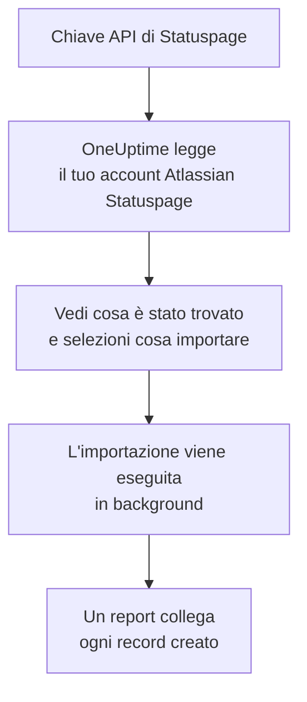

# Migrare da Atlassian Statuspage

**Importa da un altro strumento** porta le tue pagine di Atlassian Statuspage in OneUptime in pochi minuti. Con una chiave API di Statuspage, OneUptime legge le tue pagine, i loro componenti e gruppi e i loro iscritti via email, ti mostra cosa ha trovato e crea ciò che selezioni. In Statuspage non cambia nulla.

:::cards
- [Importa il tuo account](#importa-il-tuo-account-atlassian-statuspage): Crea una chiave, leggi il tuo account e seleziona cosa importare.
- [Cosa viene importato](#cosa-viene-importato): Cosa diventa in OneUptime ogni pagina, componente e iscritto di Statuspage.
- [Completa il passaggio](#completa-il-passaggio): Cosa fare quando l'importazione è finita.
:::

## Come funziona

- **La chiave viene usata una sola volta.** Viene conservata cifrata mentre OneUptime legge il tuo account ed eliminata appena la lettura finisce, che sia riuscita o no. Non viene mai più mostrata né scritta in un log.
- **OneUptime si limita a leggere.** Chiama solo l'API di Atlassian Statuspage: `api.statuspage.io`. Fa una richiesta al secondo, il massimo che Statuspage concede a una chiave. Quando Atlassian Statuspage gli chiede di rallentare, attende e riprova.
- **Non viene creato nulla finché non avvii l'importazione.** L'anteprima mostra, per ogni elemento, se è nuovo, se è già in OneUptime (e viene usato così com'è), se l'ha portato un'importazione precedente o perché non può essere importato.
- **Rieseguirla non crea mai nulla due volte.** OneUptime ricorda cosa ha portato ogni importazione, in base all'ID di Atlassian Statuspage. Eseguila di nuovo dopo aver aggiunto pagine o componenti in Atlassian Statuspage e verranno creati solo i nuovi.

## Prima di iniziare

- **Un progetto OneUptime e il diritto di creare ciò che importi.** I proprietari e gli amministratori del progetto possono importare tutto. Anche gli altri ruoli possono eseguire un'importazione e importare i tipi di record che possono creare. Il resto viene mostrato come non importato, con il motivo.
- **Una chiave API di Statuspage.** Solo un proprietario dell'account può crearne una. L'importazione non scrive mai in Statuspage e legge ogni pagina che la chiave può vedere.
- **Spazio per le tue pagine, su OneUptime Cloud.** Il tuo piano ha spazio per un certo numero di pagine di stato e di iscritti. Ciò che non ci sta viene mostrato come non importato. I componenti diventano monitor manuali, che sono gratuiti.

## Importa il tuo account Atlassian Statuspage

:::steps
### Crea una chiave API in Statuspage
In Statuspage, seleziona il tuo avatar in basso a sinistra, poi **API info**. Seleziona **Create key**, chiamala `OneUptime import` e copiala.

### Apri la pagina di importazione
In OneUptime, vai in **Impostazioni del progetto** > **Importa da un altro strumento** e seleziona **Atlassian Statuspage**.

### Collega Atlassian Statuspage
Incolla la chiave in **Chiave API di Atlassian Statuspage** e seleziona **Leggi il mio account Atlassian Statuspage**. Un account grande richiede qualche minuto, e puoi lasciare la pagina durante la lettura.

### Seleziona cosa importare
L'anteprima elenca ciò che è stato trovato, con una sezione per tipo. Tutto ciò che verrebbe creato parte selezionato, tranne gli iscritti. Sotto ogni elemento, OneUptime indica cosa non verrà importato esattamente com'era. Quando una pagina di stato selezionata mostra un monitor che hai lasciato deselezionato, lo segnala, e **Seleziona anche questi** lo seleziona. Per importare gli iscritti, selezionali e conferma sotto di essi che hanno accettato di ricevere i tuoi aggiornamenti e che puoi trasferirli. Nessuno riceve email.

### Avvia l'importazione
Seleziona **Avvia importazione**. L'importazione viene eseguita in background: puoi lasciare la pagina, e il report ti aspetta lì.
:::

Il report conta ciò che è stato creato e non importato, ed elenca ogni elemento con un link al record che è diventato, prima gli errori. Le importazioni precedenti sono elencate in **Importazioni precedenti** nella stessa pagina.

## Cosa viene importato

| In Atlassian Statuspage | In OneUptime | Come |
| --- | --- | --- |
| Components | Monitor manuali | Ogni componente diventa un monitor manuale che la pagina di stato mostra. Niente lo controlla: imposti tu il suo stato in OneUptime, come facevi in Statuspage. Un gruppo di componenti diventa un gruppo della pagina. |
| Pages | Pagine di stato | Ogni pagina viene importata con nome e descrizione, i suoi componenti nei loro gruppi, e disponibilità e storico dei componenti che mette in evidenza. Una pagina che solo alcune persone possono vedere viene importata come privata. |
| Email subscribers | Iscritti alla pagina di stato | Gli iscritti via email confermati vengono importati quando confermi di poterli trasferire, e seguono gli stessi componenti. Nessuno riceve email, e ogni aggiornamento che ricevono da OneUptime contiene un link per annullare l'iscrizione. |

I componenti vengono importati come operativi. L'anteprima nomina ognuno di quelli che ora non sono operativi in Statuspage, così puoi impostarne lo stato dopo l'importazione.

## Cosa non viene importato

- **Gli incidenti, la manutenzione programmata e il loro storico.** Un incidente in OneUptime è un record vivo che avvisa le persone, quindi quelli passati restano in Statuspage.
- **Gli iscritti via SMS, webhook, Slack o Microsoft Teams.** L'anteprima li conta. Vengono importati solo gli iscritti via email.
- **I modelli di incidente e le metriche di sistema.** Aggiungi in OneUptime ciò che ti serve ancora.
- **Il dominio proprio e il branding di una pagina di stato.** In OneUptime, aggiungi il dominio in **Domini personalizzati** e il logo in **Branding**.

## Limiti

Un'importazione crea al massimo 2.000 record: al massimo 1.000 monitor e 50 pagine di stato. Gli iscritti non contano per questo totale: un'importazione porta al massimo 5.000 iscritti. Ciò che supera un limite viene mostrato come non importato. Esegui di nuovo l'importazione per portare il resto.

Su OneUptime Cloud, le pagine di stato e gli iscritti per cui il tuo piano non ha spazio vengono mostrati come non importati, con ciò che serve.

Un'anteprima viene conservata per un giorno. Solo chi ha letto l'account può selezionare gli elementi e avviarla. I proprietari e gli amministratori del progetto vedono l'avanzamento e il report di ogni importazione.

## Completa il passaggio

:::steps
### Controlla le tue pagine di stato
In **Pagine di stato**, apri ogni pagina e confrontala con quella in Statuspage. Ogni componente è un monitor manuale: cambia il suo stato in OneUptime quando qualcosa cambia.

### Fai puntare l'indirizzo della tua pagina di stato a OneUptime
In **Pagine di stato**, apri la pagina, aggiungi il tuo dominio in **Domini personalizzati**, poi cambia il suo record DNS. I visitatori e gli iscritti arriveranno così alla nuova pagina.

### Disattiva la tua pagina in Atlassian Statuspage
Quando il tuo dominio punta a OneUptime, chiudi la pagina in Statuspage così i suoi iscritti non vengono avvisati due volte.
:::

## Risoluzione dei problemi

:::details Atlassian Statuspage non ha accettato la chiave API
Verifica di aver copiato la chiave intera e che l'abbia creata un proprietario dell'account in **API info**. Una chiave appartiene a un'organizzazione di Statuspage e legge solo le sue pagine. Poi seleziona **Riprova**.
:::

:::details Gli iscritti non si possono importare
Seleziona la casella sotto di essi che conferma che hanno accettato di ricevere i tuoi aggiornamenti e che puoi trasferirli: **Avvia importazione** la aspetta. Gli iscritti che non hanno mai confermato la loro iscrizione in Statuspage restano lì.
:::

:::details Alcuni elementi non si possono selezionare
Ognuno indica il motivo: un nome che il progetto ha già, qualcosa che ha portato un'importazione precedente, o un record che non hai il permesso di creare o che il tuo piano non include.
:::

## Passaggi successivi

:::cards
- [Panoramica delle pagine di stato](/docs/status-pages/index): Cosa mostra una pagina di stato e chi può vederla.
- [Iscritti e annunci](/docs/status-pages/subscribers): Come gli iscritti vengono informati degli incidenti.
- [Monitor manuale](/docs/monitor/manual-monitor): Un monitor di cui imposti tu lo stato.
:::
