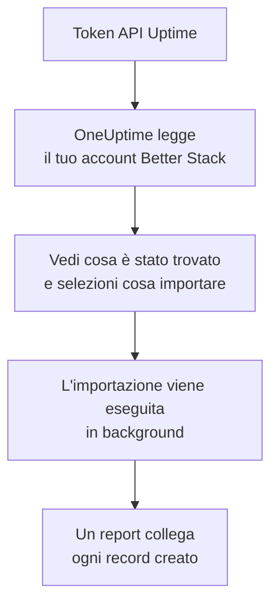

# Migrare da Better Stack

**Importa da un altro strumento** porta i tuoi monitor Uptime, heartbeat e pagine di stato di Better Stack in OneUptime in pochi minuti. Con un token API Uptime di Better Stack, OneUptime legge i tuoi monitor, heartbeat, pagine di stato e i loro iscritti via email, ti mostra cosa ha trovato e crea ciò che selezioni. In Better Stack non cambia nulla.

:::cards
- [Importa il tuo account](#importa-il-tuo-account-better-stack): Crea un token, leggi il tuo account e seleziona cosa importare.
- [Cosa viene importato](#cosa-viene-importato): Cosa diventa in OneUptime ogni monitor, heartbeat e pagina di stato di Better Stack.
- [Completa il passaggio](#completa-il-passaggio): Cosa fare quando l'importazione è finita.
:::

## Come funziona

- **La chiave viene usata una sola volta.** Viene conservata cifrata mentre OneUptime legge il tuo account ed eliminata appena la lettura finisce, che sia riuscita o no. Non viene mai più mostrata né scritta in un log.
- **OneUptime si limita a leggere.** Chiama solo l'API di Better Stack: `incidents.betterstack.com`. Quando Better Stack gli chiede di rallentare, attende e riprova.
- **Non viene creato nulla finché non avvii l'importazione.** L'anteprima mostra, per ogni elemento, se è nuovo, se è già in OneUptime (e viene usato così com'è), se l'ha portato un'importazione precedente o perché non può essere importato.
- **Rieseguirla non crea mai nulla due volte.** OneUptime ricorda cosa ha portato ogni importazione, in base all'ID di Better Stack. Eseguila di nuovo dopo aver aggiunto monitor o heartbeat in Better Stack e verranno creati solo i nuovi.

## Prima di iniziare

- **Un progetto OneUptime e il diritto di creare ciò che importi.** I proprietari e gli amministratori del progetto possono importare tutto. Anche gli altri ruoli possono eseguire un'importazione e importare i tipi di record che possono creare. Il resto viene mostrato come non importato, con il motivo.
- **Un token API Uptime di Better Stack.** Usa un token Uptime del team: legge i monitor, gli heartbeat e le pagine di stato di quel team. L'importazione non scrive mai in Better Stack.
- **Un metodo di pagamento, su OneUptime Cloud.** I monitor che eseguono controlli vengono addebitati in base all'uso, anche con il piano Free, quindi aggiungine uno in **Impostazioni del progetto** > **Fatturazione** prima dell'importazione. Senza, quei monitor vengono mostrati come non importati.

## Importa il tuo account Better Stack

:::steps
### Crea un token API in Better Stack
In Better Stack, vai in **API tokens** > **Team-based tokens** e seleziona il tuo team. In **Uptime API tokens**, crea un token chiamato `OneUptime import` e copialo.

### Apri la pagina di importazione
In OneUptime, vai in **Impostazioni del progetto** > **Importa da un altro strumento** e seleziona **Better Stack**.

### Collega Better Stack
Incolla il token in **Chiave API di Better Stack** e seleziona **Leggi il mio account Better Stack**. Un account grande richiede qualche minuto, e puoi lasciare la pagina durante la lettura.

### Seleziona cosa importare
L'anteprima elenca ciò che è stato trovato, con una sezione per tipo. Tutto ciò che verrebbe creato parte selezionato, tranne i monitor in pausa, che vengono importati in pausa se li selezioni, e gli iscritti. Sotto ogni elemento, OneUptime indica cosa non verrà importato esattamente com'era. Quando una pagina di stato selezionata mostra un monitor che hai lasciato deselezionato, lo segnala, e **Seleziona anche questi** lo seleziona. Per importare gli iscritti, selezionali e conferma sotto di essi che hanno accettato di ricevere i tuoi aggiornamenti e che puoi trasferirli. Nessuno riceve email.

### Avvia l'importazione
Seleziona **Avvia importazione**. L'importazione viene eseguita in background: puoi lasciare la pagina, e il report ti aspetta lì.
:::

Il report conta ciò che è stato creato e non importato, ed elenca ogni elemento con un link al record che è diventato, prima gli errori. Le importazioni precedenti sono elencate in **Importazioni precedenti** nella stessa pagina.

## Cosa viene importato

| In Better Stack | In OneUptime | Come |
| --- | --- | --- |
| Monitors and heartbeats | Monitor | Ogni monitor diventa un monitor dello stesso tipo, con lo stesso indirizzo, intervallo e timeout. Ogni heartbeat diventa un monitor richieste in arrivo. |
| Status pages | Pagine di stato | Ogni pagina viene importata con le sue sezioni come gruppi e i monitor e gli heartbeat che mostra. Un elemento che segui a mano diventa un monitor manuale. Una pagina con password o con una lista di IP consentiti viene importata come privata. |
| Email subscribers | Iscritti alla pagina di stato | Gli iscritti via email confermati vengono importati quando confermi di poterli trasferire, e seguono le stesse risorse. Nessuno riceve email, e ogni aggiornamento che ricevono da OneUptime contiene un link per annullare l'iscrizione. |

- **I monitor status, expected status code, keyword e keyword absence** diventano monitor sito web, o monitor API quando inviano un altro metodo, intestazioni o un corpo JSON. Un monitor status è attivo con qualsiasi risposta 2xx, e un monitor expected status code con i codici che elenca.
- **I monitor ping e TCP** diventano monitor ping e porta. **I monitor SMTP, POP e IMAP** diventano monitor porta sulla loro porta: OneUptime controlla che la porta risponda, non la conversazione di posta.
- **I monitor DNS** diventano monitor DNS del nome che interrogano, rivolgendosi allo stesso server.
- **Gli heartbeat** diventano monitor richieste in arrivo, che vanno giù quando non arriva nessuna richiesta per il periodo e la tolleranza. Ognuno ha un nuovo indirizzo in OneUptime.
- **Gli avvisi di scadenza SSL.** Un monitor che avvisa prima della scadenza del certificato riceve anche un monitor certificato SSL, con il suo nome, che avvisa con gli stessi giorni di anticipo.

Ogni monitor viene controllato dalle sonde del tuo progetto, come uno che crei tu. Un intervallo che OneUptime non offre diventa il più vicino che offre, e un timeout di oltre un minuto diventa un minuto. L'anteprima indica quando uno dei due cambia.

## Cosa non viene importato

- **Lo storico di disponibilità, i tempi di risposta e gli incidenti.** OneUptime inizia i controlli quando l'importazione è finita.
- **I contatti di avviso e le integrazioni.** Scegli chi viene avvisato in OneUptime, come descritto in [Completa il passaggio](#completa-il-passaggio).
- **Le password, e le intestazioni che possono contenere un segreto.** Un monitor che accede, o che invia un'intestazione `Authorization`, di cookie o di token, viene importato senza: aggiungila con un [segreto del monitor](/docs/monitor/monitor-secrets).
- **I monitor UDP e Playwright.** OneUptime non ha alcun monitor che faccia lo stesso, e l'anteprima li nomina uno per uno.
- **Gli iscritti che non hanno mai confermato la loro iscrizione.** Restano in Better Stack.
- **Ciò che una pagina di stato mostra oltre a monitor, heartbeat ed elementi seguiti a mano.** L'anteprima li nomina uno per uno.
- **Il dominio proprio e il branding di una pagina di stato.** In OneUptime, aggiungi il dominio in **Domini personalizzati** e il logo in **Branding**.

## Limiti

Un'importazione crea al massimo 2.000 record: al massimo 1.000 monitor e 50 pagine di stato. Gli iscritti non contano per questo totale: un'importazione porta al massimo 5.000 iscritti. Ciò che supera un limite viene mostrato come non importato. Esegui di nuovo l'importazione per portare il resto.

Su OneUptime Cloud, i monitor che eseguono controlli hanno bisogno di un metodo di pagamento, e ciò per cui il tuo piano non ha spazio viene mostrato come non importato, con ciò che serve.

Un'anteprima viene conservata per un giorno. Solo chi ha letto l'account può selezionare gli elementi e avviarla. I proprietari e gli amministratori del progetto vedono l'avanzamento e il report di ogni importazione.

## Completa il passaggio

:::steps
### Controlla i tuoi monitor
Apri ciascuno in **Monitor** e controlla i primi risultati. Un monitor heartbeat ha un nuovo indirizzo: fai puntare lì il job che lo chiama.

### Scegli chi viene avvisato
Aggiungi dei proprietari ai tuoi monitor, o una policy di reperibilità in **Reperibilità** > **Policy di reperibilità** agli incidenti che aprono, così le persone giuste sanno quando qualcosa si guasta.

### Fai puntare l'indirizzo della tua pagina di stato a OneUptime
In **Pagine di stato**, apri la pagina, aggiungi il tuo dominio in **Domini personalizzati**, poi cambia il suo record DNS. I visitatori e gli iscritti arriveranno così alla nuova pagina.

### Disattiva i controlli in Better Stack
Quando OneUptime controlla le stesse cose, mettile in pausa in Better Stack così nessuno viene avvisato due volte.
:::

## Risoluzione dei problemi

:::details Better Stack non ha accettato la chiave API
Verifica di aver copiato il token intero e che sia il token del team da **Uptime API tokens**, non uno di Telemetry. Poi seleziona **Riprova**.
:::

:::details Un monitor viene mostrato come non importato
Indica il motivo: un tipo di monitor che OneUptime non ha, un indirizzo che OneUptime non riesce a leggere, o un progetto senza spazio o senza metodo di pagamento. Un monitor che OneUptime esegue già, con lo stesso nome, tipo e indirizzo, viene usato così com'è.
:::

:::details Alcuni elementi non si possono selezionare
Ognuno indica il motivo: un nome che il progetto ha già, qualcosa che ha portato un'importazione precedente, o un record che non hai il permesso di creare o che il tuo piano non include.
:::

## Passaggi successivi

:::cards
- [Monitor richieste in arrivo](/docs/monitor/incoming-request-monitor): Come funziona un heartbeat in OneUptime.
- [Panoramica delle pagine di stato](/docs/status-pages/index): Cosa mostra una pagina di stato e chi può vederla.
- [Migrare da UptimeRobot](/docs/moving-to-oneuptime/uptimerobot): Porta i tuoi controlli da UptimeRobot.
:::
