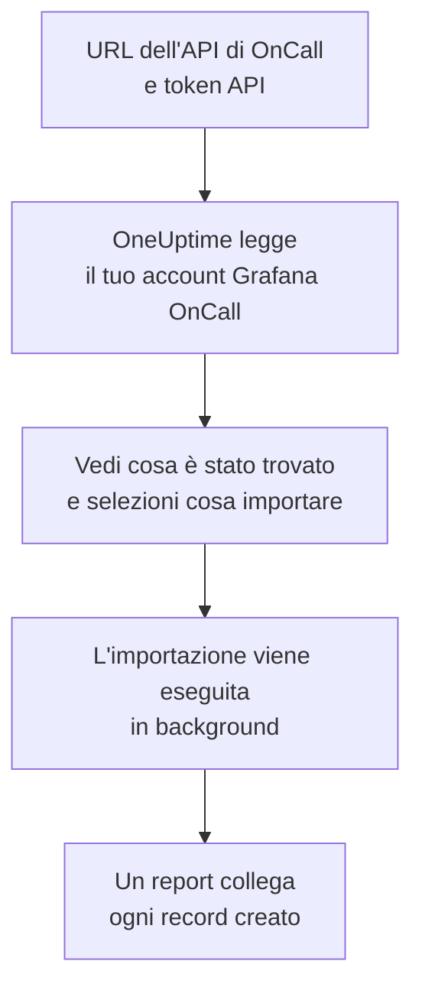

# Migrare da Grafana OnCall

Grafana Labs ha archiviato la versione open source di Grafana OnCall a marzo 2026, e su Grafana Cloud continua come parte di Grafana Cloud IRM. Ovunque giri la tua, **Importa da un altro strumento** porta la tua configurazione di reperibilità in OneUptime in pochi minuti. Con l'URL dell'API di OnCall e un token API, OneUptime legge utenti, team, pianificazioni e catene di escalation, ti mostra cosa ha trovato e crea ciò che selezioni. In Grafana OnCall non cambia nulla.

:::cards
- [Importa il tuo account](#importa-il-tuo-account-grafana-oncall): Crea un token, leggi il tuo account e seleziona cosa importare.
- [Cosa viene importato](#cosa-viene-importato): Cosa diventa in OneUptime ogni record di Grafana OnCall.
- [Completa il passaggio](#completa-il-passaggio): Cosa fare quando l'importazione è finita.
:::

## Come funziona

- **Il token viene usato una sola volta.** Viene conservato cifrato, insieme all'URL dell'API, mentre OneUptime legge il tuo account ed eliminato appena la lettura finisce, che sia riuscita o no. Non viene mai più mostrato né scritto in un log.
- **OneUptime si limita a leggere, e solo dall'indirizzo che indichi.** Chiama solo l'URL dell'API di OnCall che incolli, al massimo una volta al secondo, restando così entro il limite di Grafana OnCall di 300 richieste per token in cinque minuti. Quando Grafana OnCall gli chiede di rallentare, attende e riprova.
- **L'indirizzo viene controllato prima di ogni richiesta.** OneUptime non chiama mai la macchina su cui gira né un servizio di metadati cloud, e non segue mai un reindirizzamento. Su OneUptime Cloud, l'indirizzo deve inoltre essere pubblico e iniziare con `https://`. Un OneUptime self-hosted può leggere anche un Grafana OnCall nella tua rete, a meno che il suo amministratore non l'abbia disattivato, come descritto in [Private Network Access](/docs/self-hosted/private-network-access).
- **Non viene creato nulla finché non avvii l'importazione.** L'anteprima mostra, per ogni elemento, se è nuovo, se è già in OneUptime (e viene usato così com'è), se l'ha portato un'importazione precedente o perché non può essere importato.
- **Rieseguirla non crea mai nulla due volte.** OneUptime ricorda cosa ha portato ogni importazione, in base all'ID di Grafana OnCall. Eseguila di nuovo dopo aver aggiunto persone o pianificazioni in Grafana OnCall e verranno creati solo i nuovi elementi.

## Prima di iniziare

- **Un progetto OneUptime e il diritto di creare ciò che importi.** I proprietari e gli amministratori del progetto possono importare tutto. Anche gli altri ruoli possono eseguire un'importazione e importare i tipi di record che possono creare. Il resto viene mostrato come non importato, con il motivo.
- **Un token API di Grafana OnCall.** Usa un token API di OnCall, non il token di un service account di Grafana. L'importazione non scrive mai in Grafana OnCall. Elimina il token quando l'importazione è finita.
- **L'URL dell'API di OnCall.** Le impostazioni di OnCall lo mostrano accanto ai token API. Su Grafana Cloud è simile a `https://oncall-prod-us-central-0.grafana.net/oncall`. Su un'installazione tua, è l'indirizzo del tuo motore OnCall.

## Importa il tuo account Grafana OnCall

:::steps
### Crea un token API in Grafana OnCall
In Grafana, apri **OnCall** > **Settings**. Su Grafana Cloud, apri **IRM** > **Settings** > **Admin & API**. Copia l'URL dell'API di OnCall mostrato lì. In **API tokens**, crea un token chiamato `OneUptime import` e copialo.

### Apri la pagina di importazione
In OneUptime, vai su **Impostazioni del progetto** > **Importa da un altro strumento** e seleziona **Grafana OnCall**.

### Collega Grafana OnCall
Incolla l'indirizzo in **URL dell'API di Grafana OnCall** e il token in **Chiave API di Grafana OnCall**, poi seleziona **Leggi il mio account Grafana OnCall**. Un account grande richiede qualche minuto, e puoi lasciare la pagina durante la lettura.

### Seleziona cosa importare
L'anteprima elenca ciò che è stato trovato, con una sezione per tipo. Tutto ciò che verrebbe creato parte selezionato, tranne le persone che non sono in nessun team, pianificazione o catena di escalation. Sotto ogni elemento, OneUptime indica cosa non verrà importato esattamente com'era. Quando un elemento selezionato usa qualcosa che hai lasciato deselezionato, lo segnala, e **Seleziona anche questi** lo seleziona.

### Avvia l'importazione
Se verranno invitate delle persone, scegli in **Invita le nuove persone in** il team in cui entrano. Poi seleziona **Avvia importazione**. L'importazione viene eseguita in background: puoi lasciare la pagina, e il report ti aspetta lì.
:::

Il report conta ciò che è stato creato, invitato e non importato, ed elenca ogni elemento con un link al record che è diventato, prima gli errori. Le importazioni precedenti sono elencate in **Importazioni precedenti** nella stessa pagina.

## Cosa viene importato

| In Grafana OnCall | In OneUptime | Come |
| --- | --- | --- |
| Utenti | Membri del progetto | Abbinati per indirizzo email. Chi non è ancora nel progetto viene invitato nel team che scegli. |
| Team | Team | Creati con i loro membri. Un team il cui nome è già nel progetto viene usato così com'è, e i suoi membri non vengono toccati. |
| Pianificazioni | Pianificazioni di reperibilità | Ogni rotazione diventa un livello con le stesse persone, lo stesso inizio, lo stesso passaggio di consegne e gli stessi orari di reperibilità, nel fuso orario della pianificazione, di proprietà del team della pianificazione. Una rotazione su un livello superiore continua a prevalere su quelle sottostanti. |
| Catene di escalation | Policy di reperibilità | I passaggi che notificano persone, un team o chi è reperibile in una pianificazione diventano regole di escalation, e un passaggio di attesa diventa l'attesa prima della regola successiva. Un passaggio che ripete la catena diventa le ripetizioni della policy. |

Le rotazioni dello stesso livello che sono di reperibilità contemporaneamente, e una rotazione che mette più persone in reperibilità insieme, diventano ciascuna una pianificazione di OneUptime, perché una pianificazione di OneUptime ha una sola persona reperibile alla volta. Ogni policy di reperibilità che avvisava la pianificazione le avvisa tutte.

## Cosa non viene importato

- **I gruppi di avvisi e la loro cronologia.** OneUptime parte dalla tua configurazione, non dai tuoi avvisi passati.
- **Integrazioni, route e webhook in uscita.** Indirizza invece i tuoi monitor e le fonti di avvisi verso OneUptime, come descritto in [Completa il passaggio](#completa-il-passaggio).
- **Le sostituzioni, i turni singoli e le rotazioni già terminate.** Aggiungi in OneUptime, dopo l'importazione, le sostituzioni che ti servono ancora.
- **I turni da un link di calendario.** Una pianificazione i cui turni vengono da un link iCal viene importata senza livelli, quindi aggiungili in OneUptime.
- **Le regole di notifica di ogni persona.** Ognuno sceglie come essere avvisato nelle proprie **Impostazioni utente** dopo aver accettato l'invito.
- **I passaggi senza un equivalente esatto in OneUptime.** Un passaggio che notifica un gruppo di utenti o un canale Slack, chiama un webhook, dichiara un incidente o risolve l'avviso viene escluso. Un passaggio che notifica le persone una alla volta le avvisa tutte insieme, un passaggio che prosegue solo in certi orari o con un certo numero di avvisi prosegue sempre, e l'anteprima indica cosa cambia.

## Limiti

Un'importazione crea al massimo 2.000 record: al massimo 500 persone, 200 team, 200 pianificazioni di reperibilità e 200 policy di reperibilità. Ciò che supera un limite viene mostrato come non importato. Esegui di nuovo l'importazione per portare il resto.

Su OneUptime Cloud, i record che il tuo piano non include vengono mostrati come non importati, con il piano che richiedono.

Un'anteprima viene conservata per un giorno. Solo chi ha letto l'account può selezionare gli elementi e avviarla. I proprietari e gli amministratori del progetto vedono l'avanzamento e il report di ogni importazione.

## Completa il passaggio

:::steps
### Controlla le pianificazioni di reperibilità
Apri ogni pianificazione in **Reperibilità** > **Pianificazioni di reperibilità** e controlla chi è reperibile ora e chi lo sarà dopo.

### Assicurati che tutti possano essere avvisati
Le persone invitate accettano l'invito, poi aggiungono un numero di telefono, un indirizzo email o l'app mobile su cui essere avvisate. **Reperibilità** > **Prontezza** mostra chi non è ancora raggiungibile.

### Invia i tuoi avvisi a OneUptime
Indirizza i tuoi monitor e gli strumenti che generano avvisi verso OneUptime, e avvisa te stesso una volta per provarlo.

### Disattiva gli avvisi in Grafana OnCall
Quando OneUptime avvisa le persone giuste, disattiva le notifiche in Grafana OnCall così nessuno viene avvisato due volte.
:::

## Risoluzione dei problemi

:::details Grafana OnCall non ha accettato la chiave API
Controlla di aver copiato l'intero token, che sia un token API di OnCall e non il token di un service account di Grafana, e che l'URL dell'API sia quello mostrato accanto. Poi seleziona **Riprova**.
:::

:::details OneUptime non ha chiamato l'URL dell'API
Incolla l'URL dell'API di OnCall esattamente come lo mostrano le impostazioni di OnCall. Su OneUptime Cloud deve iniziare con `https://` ed essere raggiungibile da Internet. Un OneUptime self-hosted può raggiungere anche un indirizzo della tua rete, a meno che il suo amministratore non l'abbia disattivato, ma mai uno della macchina su cui gira OneUptime.
:::

:::details Un tipo di record manca nell'anteprima
Il token non è riuscito a leggerlo, e l'anteprima lo indica in alto. Un token legge ciò che può vedere la persona che l'ha creato, quindi crealo come amministratore di Grafana OnCall e leggi di nuovo l'account.
:::

:::details Alcuni elementi non si possono selezionare
Ognuno indica il motivo: un nome che il progetto ha già, qualcosa che ha portato un'importazione precedente, o un record che non hai il permesso di creare o che il tuo piano non include.
:::

## Passaggi successivi

:::cards
- [Pianificazioni di reperibilità](/docs/on-call/schedules): Livelli, restrizioni e passaggi di consegne.
- [Regole di escalation](/docs/on-call/escalation-rules): Come le policy di reperibilità avvisano le persone.
- [Migrare da PagerDuty](/docs/moving-to-oneuptime/pagerduty): Porta un team da PagerDuty.
:::
