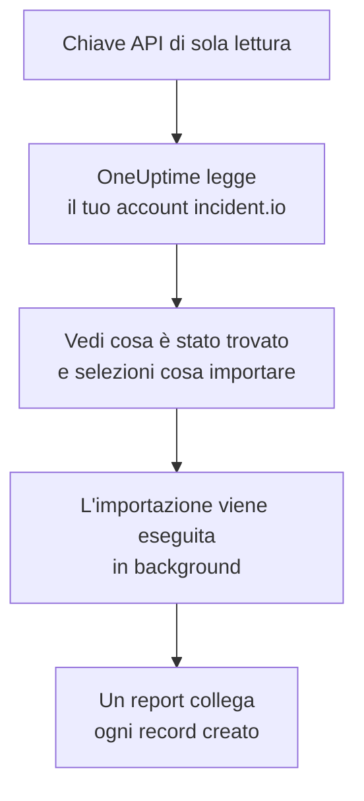

# Migrare da incident.io

**Importa da un altro strumento** porta la tua configurazione di incident.io in OneUptime in pochi minuti. Con una chiave API di incident.io di sola lettura, OneUptime legge utenti, team, pianificazioni, percorsi di escalation, servizi e impostazioni degli incidenti, ti mostra cosa ha trovato e crea ciò che selezioni. In incident.io non cambia nulla.

:::cards
- [Importa il tuo account](#importa-il-tuo-account-incidentio): Crea una chiave, leggi il tuo account e seleziona cosa importare.
- [Cosa viene importato](#cosa-viene-importato): Cosa diventa in OneUptime ogni record di incident.io.
- [Completa il passaggio](#completa-il-passaggio): Cosa fare quando l'importazione è finita.
:::

## Come funziona

- **La chiave viene usata una sola volta.** Viene conservata cifrata mentre OneUptime legge il tuo account ed eliminata appena la lettura finisce, che sia riuscita o no. Non viene mai più mostrata né scritta in un log.
- **OneUptime si limita a leggere.** Chiama solo l'API di incident.io, `api.incident.io`. Quando incident.io gli chiede di rallentare, attende e riprova.
- **Non viene creato nulla finché non avvii l'importazione.** L'anteprima mostra, per ogni elemento, se è nuovo, se è già in OneUptime (e viene usato così com'è), se l'ha portato un'importazione precedente o perché non può essere importato.
- **Rieseguirla non crea mai nulla due volte.** OneUptime ricorda cosa ha portato ogni importazione, in base all'ID di incident.io. Eseguila di nuovo dopo aver aggiunto persone o pianificazioni in incident.io e verranno creati solo i nuovi elementi.

## Prima di iniziare

- **Un progetto OneUptime e il diritto di creare ciò che importi.** I proprietari e gli amministratori del progetto possono importare tutto. Anche gli altri ruoli possono eseguire un'importazione e importare i tipi di record che possono creare. Il resto viene mostrato come non importato, con il motivo.
- **Una chiave API di incident.io che può solo visualizzare i dati.** L'importazione non scrive mai in incident.io, quindi la chiave non ha bisogno di permessi per creare, modificare o gestire nulla.

## Importa il tuo account incident.io

:::steps
### Crea una chiave API in incident.io
In incident.io, vai su **Settings** > **API keys** e seleziona **Add new**. Chiamala `OneUptime import`, dalle solo permessi di visualizzazione dei dati, nessuno di creazione, modifica o gestione, e copia la chiave.

### Apri la pagina di importazione
In OneUptime, vai su **Impostazioni del progetto** > **Importa da un altro strumento** e seleziona **incident.io**.

### Collega incident.io
Incolla la chiave in **Chiave API di incident.io** e seleziona **Leggi il mio account incident.io**. Un account grande richiede qualche minuto, e puoi lasciare la pagina durante la lettura.

### Seleziona cosa importare
L'anteprima elenca ciò che è stato trovato, con una sezione per tipo. Tutto ciò che verrebbe creato parte selezionato, tranne le persone che non sono in nessun team, pianificazione o percorso di escalation. Sotto ogni elemento, OneUptime indica cosa non verrà importato esattamente com'era. Quando un elemento selezionato usa qualcosa che hai lasciato deselezionato, lo segnala, e **Seleziona anche questi** lo seleziona.

### Avvia l'importazione
Se verranno invitate delle persone, scegli in **Invita le nuove persone in** il team in cui entrano. Poi seleziona **Avvia importazione**. L'importazione viene eseguita in background: puoi lasciare la pagina, e il report ti aspetta lì.
:::

Il report conta ciò che è stato creato, invitato e non importato, ed elenca ogni elemento con un link al record che è diventato, prima gli errori. Le importazioni precedenti sono elencate in **Importazioni precedenti** nella stessa pagina.

## Cosa viene importato

| In incident.io | In OneUptime | Come |
| --- | --- | --- |
| Utenti | Membri del progetto | Abbinati per indirizzo email. Chi non è ancora nel progetto viene invitato nel team che scegli. Gli utenti disattivati non vengono importati. |
| Team | Team | Creati con i loro membri. Un team il cui nome è già nel progetto viene usato così com'è, e i suoi membri non vengono toccati. |
| Pianificazioni | Pianificazioni di reperibilità | Ogni rotazione diventa un livello con le stesse persone, lo stesso inizio, la stessa durata del turno e lo stesso orario di lavoro, nel fuso orario della pianificazione. Viene importata la versione della rotazione in vigore ora. |
| Percorsi di escalation | Policy di reperibilità | Ogni livello diventa una regola di escalation che avvisa le stesse pianificazioni, gli stessi utenti e team, dopo la stessa attesa. Una ripetizione diventa le ripetizioni della policy, e da una diramazione viene importato il primo percorso. |
| Servizi del catalogo | Servizi | Le voci dei tuoi tipi di catalogo della categoria servizio, create nel catalogo servizi. Le voci archiviate vengono escluse. |
| Gravità | Gravità degli incidenti | Create nell'ordine di incident.io, la più grave per prima. Una gravità il cui nome è già nel progetto viene usata così com'è. |
| Stati | Stati degli incidenti | Uno stato di triage corrisponde allo stato in cui OneUptime avvia gli incidenti, e uno stato chiuso a quello in cui vengono risolti. Gli stati attivi e in pausa vengono creati tra Riconosciuto e Risolto. |
| Ruoli degli incidenti | Ruoli degli incidenti | Il ruolo principale corrisponde al Comandante dell'incidente di OneUptime, e gli altri ruoli vengono creati. OneUptime registra chi ha dichiarato ogni incidente, quindi il ruolo di segnalatore non serve. |
| Campi personalizzati | Campi personalizzati dell'incidente | I campi a selezione singola diventano elenchi a discesa, quelli a selezione multipla elenchi a discesa a selezione multipla, quelli di testo e di link testo e quelli numerici numeri, con le loro opzioni. |

Una rotazione con più persone reperibili contemporaneamente diventa una pianificazione di OneUptime per ogni persona reperibile, perché una pianificazione di OneUptime ha una sola persona reperibile alla volta. Ogni policy di reperibilità che avvisava la pianificazione le avvisa tutte.

## Cosa non viene importato

- **Incidenti, avvisi e la loro cronologia.** OneUptime parte dalla tua configurazione, non dai tuoi incidenti passati.
- **Workflow, pagine di stato, alert route e integrazioni.** Indirizza invece i tuoi monitor e le fonti di avvisi verso OneUptime, come descritto in [Completa il passaggio](#completa-il-passaggio).
- **I campi personalizzati le cui opzioni vengono dal catalogo,** e gli stati per cui OneUptime non ha uno stato: declined, merged, canceled e learning.
- **Le sostituzioni delle pianificazioni e le modifiche a una rotazione previste per più avanti.** L'anteprima nomina ogni modifica prevista, così puoi farla in OneUptime al momento giusto.
- **I passaggi di escalation senza un equivalente esatto in OneUptime.** Un passaggio che pubblica in un canale Slack o Microsoft Teams viene escluso, perché in OneUptime lo fanno le regole di notifica dell'area di lavoro, e lo stesso vale per un passaggio che passa a un altro percorso di escalation. Un passaggio che avvisa chi sarà reperibile dopo viene importato come la cosa più vicina che OneUptime ha, e l'anteprima indica cosa cambia.

## Limiti

Un'importazione crea al massimo 2.000 record: al massimo 500 persone, 200 team, 200 pianificazioni di reperibilità, 200 policy di reperibilità, 500 servizi, 100 campi personalizzati degli incidenti e 25 ciascuno tra gravità, stati e ruoli degli incidenti. Ciò che supera un limite viene mostrato come non importato. Esegui di nuovo l'importazione per portare il resto.

Su OneUptime Cloud, i record che il tuo piano non include vengono mostrati come non importati, con il piano che richiedono.

Un'anteprima viene conservata per un giorno. Solo chi ha letto l'account può selezionare gli elementi e avviarla. I proprietari e gli amministratori del progetto vedono l'avanzamento e il report di ogni importazione.

## Completa il passaggio

:::steps
### Controlla le pianificazioni di reperibilità
Apri ogni pianificazione in **Reperibilità** > **Pianificazioni di reperibilità** e controlla chi è reperibile ora e chi lo sarà dopo.

### Assicurati che tutti possano essere avvisati
Le persone invitate accettano l'invito, poi aggiungono un numero di telefono, un indirizzo email o l'app mobile su cui essere avvisate. **Reperibilità** > **Prontezza** mostra chi non è ancora raggiungibile.

### Invia i tuoi avvisi a OneUptime
Indirizza i tuoi monitor e gli strumenti che generano avvisi verso OneUptime, e avvisa te stesso una volta per provarlo.

### Disattiva gli avvisi in incident.io
Quando OneUptime avvisa le persone giuste, disattiva le notifiche in incident.io così nessuno viene avvisato due volte.
:::

## Risoluzione dei problemi

:::details incident.io non ha accettato la chiave API
Controlla di aver copiato l'intera chiave e che non sia stata eliminata in **Settings** > **API keys**. Poi seleziona **Riprova**.
:::

:::details Un tipo di record manca nell'anteprima
La chiave non è riuscita a leggerlo, e l'anteprima lo indica in alto. Dai alla chiave il permesso di visualizzare quel tipo di dati e leggi di nuovo l'account.
:::

:::details Alcuni elementi non si possono selezionare
Ognuno indica il motivo: un utente disattivato, un nome che il progetto ha già, qualcosa che ha portato un'importazione precedente, o un record che non hai il permesso di creare o che il tuo piano non include.
:::

## Passaggi successivi

:::cards
- [Pianificazioni di reperibilità](/docs/on-call/schedules): Livelli, restrizioni e passaggi di consegne.
- [Stati e gravità degli incidenti](/docs/incidents/states-and-severities): Gli stati e le gravità che attraversano gli incidenti.
- [Migrare da Opsgenie](/docs/moving-to-oneuptime/opsgenie): Porta un team da Opsgenie.
:::
