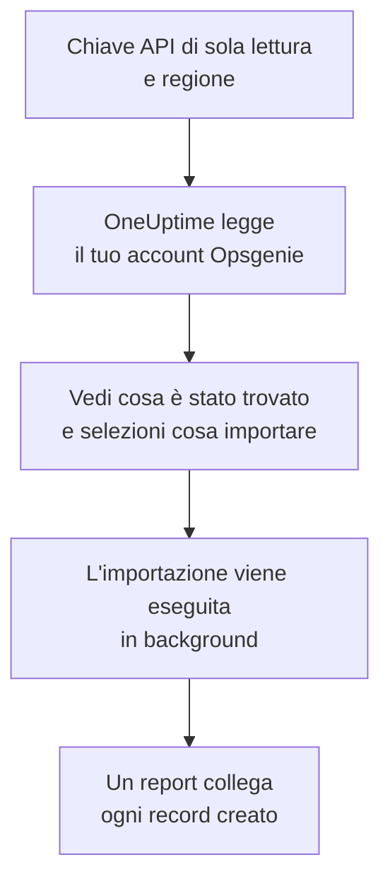

# Migrare da Opsgenie

Atlassian sta ritirando Opsgenie: ha smesso di venderlo a giugno 2025 e ne termina il supporto ad aprile 2027. OneUptime è una nuova casa per il tuo team di reperibilità, e **Importa da un altro strumento** lo porta qui in pochi minuti. Con una chiave API di Opsgenie di sola lettura, OneUptime legge utenti, team, pianificazioni, escalation e servizi, ti mostra cosa ha trovato e crea ciò che selezioni. In Opsgenie non cambia nulla.

:::cards
- [Importa il tuo account](#importa-il-tuo-account-opsgenie): Crea una chiave, leggi il tuo account e seleziona cosa importare.
- [Cosa viene importato](#cosa-viene-importato): Cosa diventa in OneUptime ogni record di Opsgenie.
- [Completa il passaggio](#completa-il-passaggio): Cosa fare quando l'importazione è finita.
:::

## Come funziona

- **La chiave viene usata una sola volta.** Viene conservata cifrata mentre OneUptime legge il tuo account ed eliminata appena la lettura finisce, che sia riuscita o no. Non viene mai più mostrata né scritta in un log.
- **OneUptime si limita a leggere.** Chiama solo l'API di Opsgenie: `api.opsgenie.com`, oppure `api.eu.opsgenie.com` per un account in Europa. Quando Opsgenie gli chiede di rallentare, attende e riprova.
- **Non viene creato nulla finché non avvii l'importazione.** L'anteprima mostra, per ogni elemento, se è nuovo, se è già in OneUptime (e viene usato così com'è), se l'ha portato un'importazione precedente o perché non può essere importato.
- **Rieseguirla non crea mai nulla due volte.** OneUptime ricorda cosa ha portato ogni importazione, in base all'ID di Opsgenie. Eseguila di nuovo dopo aver aggiunto persone o pianificazioni in Opsgenie e verranno creati solo i nuovi elementi.

## Prima di iniziare

- **Un progetto OneUptime e il diritto di creare ciò che importi.** I proprietari e gli amministratori del progetto possono importare tutto. Anche gli altri ruoli possono eseguire un'importazione e importare i tipi di record che possono creare. Il resto viene mostrato come non importato, con il motivo.
- **Una chiave API di Opsgenie con i permessi Read e Configuration access.** Configuration access è ciò che permette a una chiave di leggere utenti, team, pianificazioni ed escalation. L'importazione non scrive mai in Opsgenie.
- **La tua regione di Opsgenie.** Se accedi su `app.eu.opsgenie.com`, il tuo account è in Europa. Altrimenti è negli Stati Uniti.

## Importa il tuo account Opsgenie

:::steps
### Crea una chiave API in Opsgenie
In Opsgenie, vai su **Settings** > **API key management** e seleziona **Add new API key**. Chiamala `OneUptime import`, dalle solo **Read** e **Configuration access** e copia la chiave.

### Apri la pagina di importazione
In OneUptime, vai su **Impostazioni del progetto** > **Importa da un altro strumento** e seleziona **Opsgenie**.

### Collega Opsgenie
In **Dov'è il tuo account Opsgenie?**, scegli **Stati Uniti** o **Europa**. Incolla la chiave in **Chiave API di Opsgenie** e seleziona **Leggi il mio account Opsgenie**. Un account grande richiede qualche minuto, e puoi lasciare la pagina durante la lettura.

### Seleziona cosa importare
L'anteprima elenca ciò che è stato trovato, con una sezione per tipo. Tutto ciò che verrebbe creato parte selezionato, tranne le pianificazioni disattivate in Opsgenie e le persone che non sono in nessun team, pianificazione o escalation. Sotto ogni elemento, OneUptime indica cosa non verrà importato esattamente com'era. Quando un elemento selezionato usa qualcosa che hai lasciato deselezionato, lo segnala, e **Seleziona anche questi** lo seleziona.

### Avvia l'importazione
Se verranno invitate delle persone, scegli in **Invita le nuove persone in** il team in cui entrano. Poi seleziona **Avvia importazione**. L'importazione viene eseguita in background: puoi lasciare la pagina, e il report ti aspetta lì.
:::

Il report conta ciò che è stato creato, invitato e non importato, ed elenca ogni elemento con un link al record che è diventato, prima gli errori. Le importazioni precedenti sono elencate in **Importazioni precedenti** nella stessa pagina.

## Cosa viene importato

| In Opsgenie | In OneUptime | Come |
| --- | --- | --- |
| Utenti | Membri del progetto | Abbinati per indirizzo email. Chi non è ancora nel progetto viene invitato nel team che scegli. Gli utenti bloccati non vengono importati. |
| Team | Team | Creati con i loro membri. Un team il cui nome è già nel progetto viene usato così com'è, e i suoi membri non vengono toccati. |
| Pianificazioni | Pianificazioni di reperibilità | Ogni rotazione diventa un livello con le stesse persone, lo stesso inizio, la stessa durata del turno e la stessa restrizione oraria, nel fuso orario della pianificazione, di proprietà del team della pianificazione. |
| Escalation | Policy di reperibilità | Ogni regola diventa una regola di escalation che avvisa la stessa pianificazione, lo stesso utente o lo stesso team. Le regole con lo stesso ritardo avvisano insieme, e l'attesa prima della regola di escalation successiva è la differenza tra i ritardi. Le ripetizioni dell'escalation diventano le ripetizioni della policy. |
| Servizi | Servizi | Creati nel catalogo servizi, di proprietà del loro team. |

Una pianificazione le cui rotazioni mettono due persone in reperibilità contemporaneamente diventa una pianificazione di OneUptime per ogni rotazione, perché una pianificazione di OneUptime ha una sola persona reperibile alla volta. Ogni policy di reperibilità che avvisava la pianificazione le avvisa tutte.

## Cosa non viene importato

- **Avvisi, incidenti e la loro cronologia.** OneUptime parte dalla tua configurazione, non dai tuoi avvisi passati.
- **Integrazioni, heartbeat, policy di avviso e regole di instradamento.** Indirizza invece i tuoi monitor e le fonti di avvisi verso OneUptime, come descritto in [Completa il passaggio](#completa-il-passaggio).
- **Le sostituzioni delle pianificazioni e le rotazioni già terminate.** Aggiungi in OneUptime, dopo l'importazione, le sostituzioni che ti servono ancora.
- **Le regole di notifica di ogni persona.** Ognuno sceglie come essere avvisato nelle proprie **Impostazioni utente** dopo aver accettato l'invito.
- **I passaggi senza un equivalente esatto in OneUptime.** Una regola che avvisa chi sarà reperibile dopo, o gli amministratori di un team, viene importata come la cosa più vicina che OneUptime ha, e l'anteprima indica cosa cambia.

## Limiti

Un'importazione crea al massimo 2.000 record: al massimo 500 persone, 200 team, 200 pianificazioni di reperibilità, 200 policy di reperibilità e 500 servizi. Ciò che supera un limite viene mostrato come non importato. Esegui di nuovo l'importazione per portare il resto.

Su OneUptime Cloud, i record che il tuo piano non include vengono mostrati come non importati, con il piano che richiedono.

Un'anteprima viene conservata per un giorno. Solo chi ha letto l'account può selezionare gli elementi e avviarla. I proprietari e gli amministratori del progetto vedono l'avanzamento e il report di ogni importazione.

## Completa il passaggio

:::steps
### Controlla le pianificazioni di reperibilità
Apri ogni pianificazione in **Reperibilità** > **Pianificazioni di reperibilità** e controlla chi è reperibile ora e chi lo sarà dopo.

### Assicurati che tutti possano essere avvisati
Le persone invitate accettano l'invito, poi aggiungono un numero di telefono, un indirizzo email o l'app mobile su cui essere avvisate. **Reperibilità** > **Prontezza** mostra chi non è ancora raggiungibile.

### Invia i tuoi avvisi a OneUptime
Indirizza i tuoi monitor e gli strumenti che generano avvisi verso OneUptime, e avvisa te stesso una volta per provarlo.

### Disattiva gli avvisi in Opsgenie
Quando OneUptime avvisa le persone giuste, disattiva le notifiche in Opsgenie così nessuno viene avvisato due volte.
:::

## Risoluzione dei problemi

:::details Opsgenie non ha accettato la chiave API
Controlla di aver copiato l'intera chiave, che sia una chiave di **API key management** e non la chiave di un'integrazione, che abbia **Read** e **Configuration access**, e di aver scelto la regione del tuo account. Poi seleziona **Riprova**.
:::

:::details Un tipo di record manca nell'anteprima
La chiave non è riuscita a leggerlo, e l'anteprima lo indica in alto. Dai alla chiave **Configuration access** e leggi di nuovo l'account.
:::

:::details Alcuni elementi non si possono selezionare
Ognuno indica il motivo: un utente bloccato, un nome che il progetto ha già, qualcosa che ha portato un'importazione precedente, o un record che non hai il permesso di creare o che il tuo piano non include.
:::

## Passaggi successivi

:::cards
- [Pianificazioni di reperibilità](/docs/on-call/schedules): Livelli, restrizioni e passaggi di consegne.
- [Regole di escalation](/docs/on-call/escalation-rules): Come le policy di reperibilità avvisano le persone.
- [Migrare da incident.io](/docs/moving-to-oneuptime/incident-io): Porta un team da incident.io.
:::
