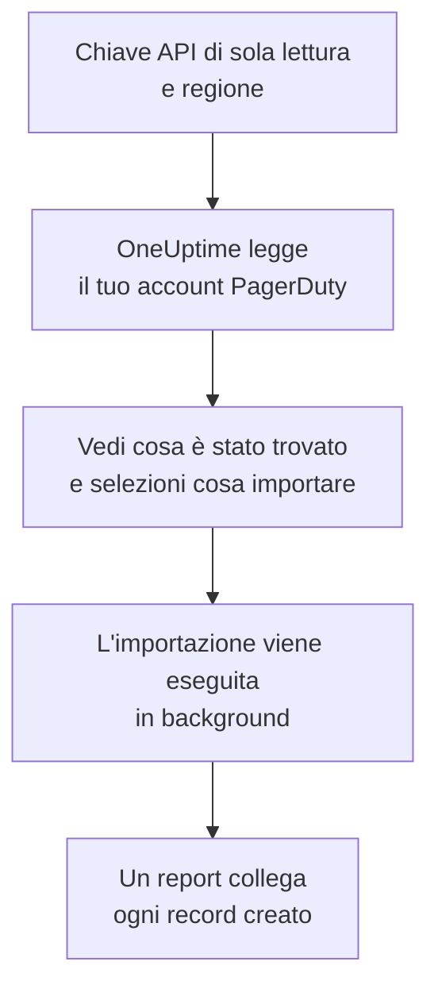

# Migrare da PagerDuty

**Importa da un altro strumento** porta la tua configurazione di PagerDuty in OneUptime in pochi minuti. Con una chiave API di PagerDuty di sola lettura, OneUptime legge utenti, team, pianificazioni, policy di escalation e servizi, ti mostra cosa ha trovato e crea ciò che selezioni. In PagerDuty non cambia nulla.

:::cards
- [Importa il tuo account](#importa-il-tuo-account-pagerduty): Crea una chiave, leggi il tuo account e seleziona cosa importare.
- [Cosa viene importato](#cosa-viene-importato): Cosa diventa in OneUptime ogni record di PagerDuty.
- [Completa il passaggio](#completa-il-passaggio): Cosa fare quando l'importazione è finita.
:::

## Come funziona

- **La chiave viene usata una sola volta.** Viene conservata cifrata mentre OneUptime legge il tuo account ed eliminata appena la lettura finisce, che sia riuscita o no. Non viene mai più mostrata né scritta in un log.
- **OneUptime si limita a leggere.** Chiama solo l'API REST di PagerDuty: `api.pagerduty.com`, oppure `api.eu.pagerduty.com` per un account in Europa. Quando PagerDuty gli chiede di rallentare, attende e riprova.
- **Non viene creato nulla finché non avvii l'importazione.** L'anteprima mostra, per ogni elemento, se è nuovo, se è già in OneUptime (e viene usato così com'è), se l'ha portato un'importazione precedente o perché non può essere importato.
- **Rieseguirla non crea mai nulla due volte.** OneUptime ricorda cosa ha portato ogni importazione, in base all'ID di PagerDuty. Eseguila di nuovo dopo aver aggiunto persone o pianificazioni in PagerDuty e verranno creati solo i nuovi elementi.

## Prima di iniziare

- **Un progetto OneUptime e il diritto di creare ciò che importi.** I proprietari e gli amministratori del progetto possono importare tutto. Anche gli altri ruoli possono eseguire un'importazione e importare i tipi di record che possono creare. Il resto viene mostrato come non importato, con il motivo.
- **Una chiave API REST di PagerDuty di sola lettura.** Gli amministratori e i proprietari dell'account PagerDuty possono crearne una. L'importazione non scrive mai in PagerDuty, quindi alla chiave basta l'accesso in lettura.
- **La tua regione di PagerDuty.** Se accedi a un indirizzo che termina con `eu.pagerduty.com`, il tuo account è in Europa. Altrimenti è negli Stati Uniti.

## Importa il tuo account PagerDuty

:::steps
### Crea una chiave API in PagerDuty
In PagerDuty, vai su **Integrations** > **Developer Tools** > **API Access Keys** e seleziona **Create New API Key**. Descrivila come `OneUptime import`, spunta **Read-only API Key**, seleziona **Create Key** e copia la chiave.

### Apri la pagina di importazione
In OneUptime, vai su **Impostazioni del progetto** > **Importa da un altro strumento** e seleziona **PagerDuty**.

### Collega PagerDuty
In **Dov'è il tuo account PagerDuty?**, scegli **Stati Uniti** o **Europa**. Incolla la chiave in **Chiave API di PagerDuty** e seleziona **Leggi il mio account PagerDuty**. Un account grande richiede qualche minuto, e puoi lasciare la pagina durante la lettura.

### Seleziona cosa importare
L'anteprima elenca ciò che è stato trovato, con una sezione per tipo. Tutto ciò che verrebbe creato parte selezionato, tranne i servizi disattivati in PagerDuty e le persone che non sono in nessun team, pianificazione o policy di escalation. Sotto ogni elemento, OneUptime indica cosa non verrà importato esattamente com'era. Quando un elemento selezionato usa qualcosa che hai lasciato deselezionato, lo segnala, e **Seleziona anche questi** lo seleziona.

### Avvia l'importazione
Se verranno invitate delle persone, scegli in **Invita le nuove persone in** il team in cui entrano. Poi seleziona **Avvia importazione**. L'importazione viene eseguita in background: puoi lasciare la pagina, e il report ti aspetta lì.
:::

Il report conta ciò che è stato creato, invitato e non importato, ed elenca ogni elemento con un link al record che è diventato, prima gli errori. Le importazioni precedenti sono elencate in **Importazioni precedenti** nella stessa pagina.

## Cosa viene importato

| In PagerDuty | In OneUptime | Come |
| --- | --- | --- |
| Utenti | Membri del progetto | Abbinati per indirizzo email. Chi non è ancora nel progetto viene invitato nel team che scegli. |
| Team | Team | Creati con i loro membri. Un team il cui nome è già nel progetto viene usato così com'è, e i suoi membri non vengono toccati. |
| Pianificazioni | Pianificazioni di reperibilità | Ogni livello diventa un livello con le stesse persone, lo stesso inizio, la stessa durata del turno e le stesse restrizioni, nel fuso orario della pianificazione, di proprietà del team della pianificazione. I livelli mantengono il loro ordine, quindi un livello superiore continua a prevalere su quelli sottostanti. |
| Policy di escalation | Policy di reperibilità | Ogni regola di escalation diventa una regola di escalation che avvisa le stesse pianificazioni e gli stessi utenti, ed esegue l'escalation dopo lo stesso ritardo. Le ripetizioni della policy diventano le ripetizioni della policy di reperibilità. |
| Servizi | Servizi | Creati nel catalogo servizi, di proprietà del loro team. Un servizio disattivato in PagerDuty parte deselezionato. |

Una pianificazione di PagerDuty resta una sola pianificazione di OneUptime: i suoi livelli prevalgono l'uno sull'altro come in PagerDuty. Un livello i cui turni non durano un numero intero di ore viene importato con i turni arrotondati all'ora, e l'anteprima lo segnala.

## Cosa non viene importato

- **Incidenti, avvisi e la loro cronologia.** OneUptime parte dalla tua configurazione, non dai tuoi incidenti passati.
- **Integrazioni, Event Orchestrations, Incident Workflows e pagine di stato.** Indirizza invece i tuoi monitor e le fonti di avvisi verso OneUptime, come descritto in [Completa il passaggio](#completa-il-passaggio).
- **Le sostituzioni delle pianificazioni e i livelli già terminati.** Aggiungi in OneUptime, dopo l'importazione, le sostituzioni che ti servono ancora.
- **Le pianificazioni basate sui turni.** L'importazione legge le pianificazioni a livelli di PagerDuty, non le sue pianificazioni più recenti basate sui turni (shift-based schedules). Se il tuo account ne ha, l'anteprima lo indica in alto, e una regola di escalation che ne avvisa una viene importata senza di essa. Creale in OneUptime.
- **Le regole di notifica di ogni persona.** Ognuno sceglie come essere avvisato nelle proprie **Impostazioni utente** dopo aver accettato l'invito.
- **Le regole senza un equivalente esatto in OneUptime.** Una regola di escalation che assegna le sue persone a turno (round robin) in OneUptime le avvisa tutte insieme, e l'anteprima indica cosa cambia.

## Limiti

Un'importazione crea al massimo 2.000 record: al massimo 500 persone, 200 team, 200 pianificazioni di reperibilità, 200 policy di reperibilità e 500 servizi. Ciò che supera un limite viene mostrato come non importato. Esegui di nuovo l'importazione per portare il resto.

Su OneUptime Cloud, i record che il tuo piano non include vengono mostrati come non importati, con il piano che richiedono.

Un'anteprima viene conservata per un giorno. Solo chi ha letto l'account può selezionare gli elementi e avviarla. I proprietari e gli amministratori del progetto vedono l'avanzamento e il report di ogni importazione.

## Completa il passaggio

:::steps
### Controlla le pianificazioni di reperibilità
Apri ogni pianificazione in **Reperibilità** > **Pianificazioni di reperibilità** e controlla chi è reperibile ora e chi lo sarà dopo.

### Assicurati che tutti possano essere avvisati
Le persone invitate accettano l'invito, poi aggiungono un numero di telefono, un indirizzo email o l'app mobile su cui essere avvisate. **Reperibilità** > **Prontezza** mostra chi non è ancora raggiungibile.

### Invia i tuoi avvisi a OneUptime
Indirizza i tuoi monitor e gli strumenti che generano avvisi verso OneUptime, e avvisa te stesso una volta per provarlo.

### Disattiva gli avvisi in PagerDuty
Quando OneUptime avvisa le persone giuste, disattiva le notifiche in PagerDuty così nessuno viene avvisato due volte.
:::

## Risoluzione dei problemi

:::details PagerDuty non ha accettato la chiave API
Controlla di aver copiato l'intera chiave, che sia una chiave API REST di **API Access Keys** e non una chiave di integrazione, e di aver scelto la regione del tuo account. Poi seleziona **Riprova**.
:::

:::details Un tipo di record manca nell'anteprima
La chiave non è riuscita a leggerlo, e l'anteprima lo indica in alto. Alcuni tipi esistono solo nei piani di PagerDuty che li includono, ad esempio i team. Leggi di nuovo l'account con una chiave che possa leggerli.
:::

:::details Alcuni elementi non si possono selezionare
Ognuno indica il motivo: un nome che il progetto ha già, qualcosa che ha portato un'importazione precedente, o un record che non hai il permesso di creare o che il tuo piano non include.
:::

## Passaggi successivi

:::cards
- [Pianificazioni di reperibilità](/docs/on-call/schedules): Livelli, restrizioni e passaggi di consegne.
- [Regole di escalation](/docs/on-call/escalation-rules): Come le policy di reperibilità avvisano le persone.
- [Migrare da Opsgenie](/docs/moving-to-oneuptime/opsgenie): Porta un team da Opsgenie.
:::
