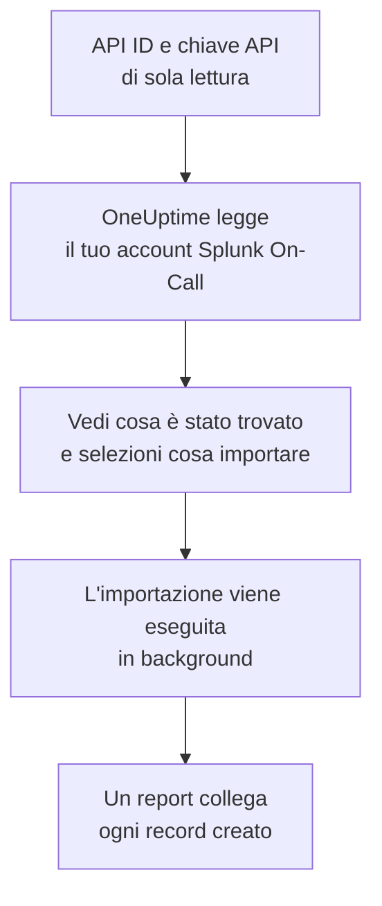

# Migrare da Splunk On-Call

**Importa da un altro strumento** porta la tua configurazione di Splunk On-Call (in passato VictorOps) in OneUptime in pochi minuti. Con il tuo API ID e una chiave API di sola lettura, OneUptime legge utenti, team, rotazioni e policy di escalation, ti mostra cosa ha trovato e crea ciò che selezioni. In Splunk On-Call non cambia nulla.

:::cards
- [Importa il tuo account](#importa-il-tuo-account-splunk-on-call): Crea una chiave, leggi il tuo account e seleziona cosa importare.
- [Cosa viene importato](#cosa-viene-importato): Cosa diventa in OneUptime ogni record di Splunk On-Call.
- [Completa il passaggio](#completa-il-passaggio): Cosa fare quando l'importazione è finita.
:::

## Come funziona

- **La chiave viene usata una sola volta.** Viene conservata cifrata, insieme all'API ID, mentre OneUptime legge il tuo account ed eliminata appena la lettura finisce, che sia riuscita o no. Non viene mai più mostrata né scritta in un log.
- **OneUptime si limita a leggere.** Chiama solo l'API di Splunk On-Call, `api.victorops.com`. Splunk On-Call risponde a ogni tipo di richiesta al massimo due volte al secondo, quindi OneUptime mantiene quel ritmo, e quando Splunk On-Call gli chiede di rallentare, attende e riprova.
- **Non viene creato nulla finché non avvii l'importazione.** L'anteprima mostra, per ogni elemento, se è nuovo, se è già in OneUptime (e viene usato così com'è), se l'ha portato un'importazione precedente o perché non può essere importato.
- **Rieseguirla non crea mai nulla due volte.** OneUptime ricorda cosa ha portato ogni importazione, in base all'ID di Splunk On-Call. Eseguila di nuovo dopo aver aggiunto persone o rotazioni in Splunk On-Call e verranno creati solo i nuovi elementi.

## Prima di iniziare

- **Un progetto OneUptime e il diritto di creare ciò che importi.** I proprietari e gli amministratori del progetto possono importare tutto. Anche gli altri ruoli possono eseguire un'importazione e importare i tipi di record che possono creare. Il resto viene mostrato come non importato, con il motivo.
- **Il tuo API ID di Splunk On-Call e una chiave API di sola lettura.** Si trovano entrambi in **Integrations** > **API** in Splunk On-Call. L'importazione non scrive mai in Splunk On-Call, quindi basta una chiave di sola lettura.

## Importa il tuo account Splunk On-Call

:::steps
### Crea una chiave API in Splunk On-Call
In Splunk On-Call, vai su **Integrations** > **API**. Il tuo API ID è mostrato sopra le tue chiavi API. Crea una nuova chiave API chiamata `OneUptime import`, spunta **Read-only** e copia l'API ID e la chiave.

### Apri la pagina di importazione
In OneUptime, vai su **Impostazioni del progetto** > **Importa da un altro strumento** e seleziona **Splunk On-Call**.

### Collega Splunk On-Call
Incolla l'API ID in **API ID di Splunk On-Call** e la chiave in **Chiave API di Splunk On-Call**, poi seleziona **Leggi il mio account Splunk On-Call**. Un account grande richiede qualche minuto, e puoi lasciare la pagina durante la lettura.

### Seleziona cosa importare
L'anteprima elenca ciò che è stato trovato, con una sezione per tipo. Tutto ciò che verrebbe creato parte selezionato, tranne le persone che non sono in nessun team, rotazione o policy di escalation. Sotto ogni elemento, OneUptime indica cosa non verrà importato esattamente com'era. Quando un elemento selezionato usa qualcosa che hai lasciato deselezionato, lo segnala, e **Seleziona anche questi** lo seleziona.

### Avvia l'importazione
Se verranno invitate delle persone, scegli in **Invita le nuove persone in** il team in cui entrano. Poi seleziona **Avvia importazione**. L'importazione viene eseguita in background: puoi lasciare la pagina, e il report ti aspetta lì.
:::

Il report conta ciò che è stato creato, invitato e non importato, ed elenca ogni elemento con un link al record che è diventato, prima gli errori. Le importazioni precedenti sono elencate in **Importazioni precedenti** nella stessa pagina.

## Cosa viene importato

| In Splunk On-Call | In OneUptime | Come |
| --- | --- | --- |
| Utenti | Membri del progetto | Abbinati per indirizzo email. Chi non è ancora nel progetto viene invitato nel team che scegli. |
| Team | Team | Creati con i loro membri. Un team il cui nome è già nel progetto viene usato così com'è, e i suoi membri non vengono toccati. |
| Rotazioni | Pianificazioni di reperibilità | Ogni rotazione diventa una pianificazione di proprietà del suo team, e ognuno dei suoi turni un livello con le stesse persone, lo stesso inizio, lo stesso passaggio di consegne e gli stessi giorni e orari di reperibilità. Chi è reperibile ora in Splunk On-Call lo è anche in OneUptime. |
| Policy di escalation | Policy di reperibilità | Di proprietà del team della policy. Ogni passaggio diventa una regola di escalation che avvisa le stesse rotazioni e gli stessi utenti. Il timeout di un passaggio diventa l'attesa che lo precede, e i passaggi senza timeout tra loro avvisano insieme. |

I turni di una rotazione che sono di reperibilità contemporaneamente diventano ciascuno una pianificazione di OneUptime, perché una pianificazione di OneUptime ha una sola persona reperibile alla volta. Ogni policy di reperibilità che avvisava la rotazione le avvisa tutte. La pianificazione mantiene il fuso orario del primo turno della rotazione, e un turno definito in un altro fuso orario ha gli orari convertiti in esso.

## Cosa non viene importato

- **Incidenti, avvisi e la loro cronologia.** OneUptime parte dalla tua configurazione, non dai tuoi incidenti passati.
- **Integrazioni, routing key e regole di avviso.** Indirizza invece i tuoi monitor e le fonti di avvisi verso OneUptime, come descritto in [Completa il passaggio](#completa-il-passaggio).
- **Le sostituzioni pianificate.** Aggiungi in OneUptime, dopo l'importazione, le sostituzioni che ti servono ancora.
- **La policy di notifica di ogni persona.** Ognuno sceglie come essere avvisato nelle proprie **Impostazioni utente** dopo aver accettato l'invito.
- **I passaggi senza un equivalente esatto in OneUptime.** Un passaggio che chiama un webhook o rimanda a un'altra policy di escalation viene escluso, così come un passaggio che invia un'email a un indirizzo che non appartiene a nessuna delle persone importate. Un passaggio che avvisa chi sarà reperibile dopo, o chi lo era prima, avvisa chi è reperibile ora, e l'anteprima indica cosa cambia.

## Limiti

Un'importazione crea al massimo 2.000 record: al massimo 500 persone, 200 team, 200 pianificazioni di reperibilità e 200 policy di reperibilità. Ciò che supera un limite viene mostrato come non importato. Esegui di nuovo l'importazione per portare il resto.

Su OneUptime Cloud, i record che il tuo piano non include vengono mostrati come non importati, con il piano che richiedono.

Un'anteprima viene conservata per un giorno. Solo chi ha letto l'account può selezionare gli elementi e avviarla. I proprietari e gli amministratori del progetto vedono l'avanzamento e il report di ogni importazione.

## Completa il passaggio

:::steps
### Controlla le pianificazioni di reperibilità
Apri ogni pianificazione in **Reperibilità** > **Pianificazioni di reperibilità** e controlla chi è reperibile ora e chi lo sarà dopo.

### Assicurati che tutti possano essere avvisati
Le persone invitate accettano l'invito, poi aggiungono un numero di telefono, un indirizzo email o l'app mobile su cui essere avvisate. **Reperibilità** > **Prontezza** mostra chi non è ancora raggiungibile.

### Invia i tuoi avvisi a OneUptime
Indirizza i tuoi monitor e gli strumenti che generano avvisi verso OneUptime, e avvisa te stesso una volta per provarlo.

### Disattiva gli avvisi in Splunk On-Call
Quando OneUptime avvisa le persone giuste, disattiva le notifiche in Splunk On-Call così nessuno viene avvisato due volte.
:::

## Risoluzione dei problemi

:::details Splunk On-Call non ha accettato l'API ID e la chiave API
Controlla di aver copiato l'API ID e l'intera chiave da **Integrations** > **API**, e che la chiave non sia stata eliminata lì. Poi seleziona **Riprova**.
:::

:::details Un tipo di record manca nell'anteprima
La chiave non è riuscita a leggerlo, e l'anteprima lo indica in alto. Controlla la chiave in **Integrations** > **API** e leggi di nuovo l'account.
:::

:::details Alcuni elementi non si possono selezionare
Ognuno indica il motivo: un nome che il progetto ha già, qualcosa che ha portato un'importazione precedente, o un record che non hai il permesso di creare o che il tuo piano non include.
:::

## Passaggi successivi

:::cards
- [Pianificazioni di reperibilità](/docs/on-call/schedules): Livelli, restrizioni e passaggi di consegne.
- [Regole di escalation](/docs/on-call/escalation-rules): Come le policy di reperibilità avvisano le persone.
- [Migrare da PagerDuty](/docs/moving-to-oneuptime/pagerduty): Porta un team da PagerDuty.
:::
