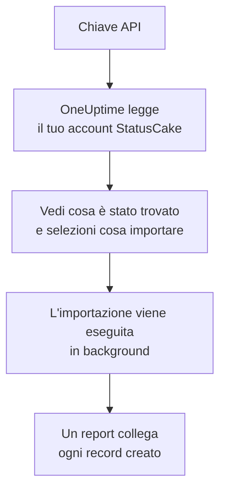

# Migrare da StatusCake

**Importa da un altro strumento** porta i tuoi controlli di StatusCake in OneUptime in pochi minuti. Con una chiave API di StatusCake, OneUptime legge i tuoi controlli di disponibilità, SSL e heartbeat, ti mostra cosa ha trovato e crea ciò che selezioni. In StatusCake non cambia nulla.

:::cards
- [Importa il tuo account](#importa-il-tuo-account-statuscake): Crea una chiave, leggi il tuo account e seleziona cosa importare.
- [Cosa viene importato](#cosa-viene-importato): Quale monitor di OneUptime diventa ogni controllo di StatusCake.
- [Completa il passaggio](#completa-il-passaggio): Cosa fare quando l'importazione è finita.
:::

## Come funziona

- **La chiave viene usata una sola volta.** Viene conservata cifrata mentre OneUptime legge il tuo account ed eliminata appena la lettura finisce, che sia riuscita o no. Non viene mai più mostrata né scritta in un log.
- **OneUptime si limita a leggere.** Chiama solo l'API di StatusCake: `api.statuscake.com`. Fa una richiesta al secondo, restando entro le 60 al minuto che StatusCake concede a un account Free. Quando StatusCake gli chiede di rallentare, attende e riprova.
- **Non viene creato nulla finché non avvii l'importazione.** L'anteprima mostra, per ogni elemento, se è nuovo, se è già in OneUptime (e viene usato così com'è), se l'ha portato un'importazione precedente o perché non può essere importato.
- **Rieseguirla non crea mai nulla due volte.** OneUptime ricorda cosa ha portato ogni importazione, in base all'ID di StatusCake. Eseguila di nuovo dopo aver aggiunto controlli in StatusCake e verranno creati solo i nuovi.

## Prima di iniziare

- **Un progetto OneUptime e il diritto di creare ciò che importi.** I proprietari e gli amministratori del progetto possono importare tutto. Anche gli altri ruoli possono eseguire un'importazione e importare i tipi di record che possono creare. Il resto viene mostrato come non importato, con il motivo.
- **Una chiave API di StatusCake.** L'importazione non scrive mai in StatusCake.
- **Un metodo di pagamento, su OneUptime Cloud.** I monitor che eseguono controlli vengono addebitati in base all'uso, anche con il piano Free, quindi aggiungine uno in **Impostazioni del progetto** > **Fatturazione** prima dell'importazione. Senza, quei monitor vengono mostrati come non importati.

## Importa il tuo account StatusCake

:::steps
### Crea una chiave API in StatusCake
In StatusCake, apri il pannello del tuo account e vai in **API Keys**. Crea una chiave chiamata `OneUptime import` e copiala.

### Apri la pagina di importazione
In OneUptime, vai in **Impostazioni del progetto** > **Importa da un altro strumento** e seleziona **StatusCake**.

### Collega StatusCake
Incolla la chiave in **Chiave API di StatusCake** e seleziona **Leggi il mio account StatusCake**. Un account grande richiede qualche minuto, e puoi lasciare la pagina durante la lettura.

### Seleziona cosa importare
L'anteprima elenca ciò che è stato trovato, con una sezione per tipo. Tutto ciò che verrebbe creato parte selezionato, tranne i controlli in pausa in StatusCake, che vengono importati in pausa se li selezioni. Sotto ogni elemento, OneUptime indica cosa non verrà importato esattamente com'era.

### Avvia l'importazione
Seleziona **Avvia importazione**. L'importazione viene eseguita in background: puoi lasciare la pagina, e il report ti aspetta lì.
:::

Il report conta ciò che è stato creato e non importato, ed elenca ogni elemento con un link al record che è diventato, prima gli errori. Le importazioni precedenti sono elencate in **Importazioni precedenti** nella stessa pagina.

## Cosa viene importato

| In StatusCake | In OneUptime | Come |
| --- | --- | --- |
| Uptime, SSL and heartbeat checks | Monitor | Ogni controllo diventa un monitor dello stesso tipo, con lo stesso indirizzo, intervallo, timeout e il testo che una pagina deve, o non deve, contenere. |

- **I controlli HTTP e HEAD** diventano monitor sito web, o monitor API quando inviano dati o intestazioni. StatusCake elenca i codici di stato che fanno scattare un avviso: ogni altro codice conta come attivo anche in OneUptime.
- **I controlli ping e TCP** diventano monitor ping e porta. **I controlli SMTP e SSH** diventano monitor porta sulla loro porta: OneUptime controlla che la porta risponda, non la conversazione su di essa.
- **I controlli DNS** diventano monitor DNS che interrogano lo stesso server.
- **I controlli SSL** diventano monitor certificato SSL che avvisano con lo stesso anticipo del primo avviso. Anche un controllo di disponibilità con avvisi SSL ne riceve uno.
- **I controlli heartbeat** diventano monitor richieste in arrivo, che vanno giù quando non arriva nessuna richiesta per il periodo. Ognuno ha un nuovo indirizzo in OneUptime.

Ogni monitor viene controllato dalle sonde del tuo progetto, come uno che crei tu. Un intervallo che OneUptime non offre diventa il più vicino che offre, e un timeout di oltre un minuto diventa un minuto. L'anteprima indica quando uno dei due cambia.

## Cosa non viene importato

- **Lo storico di disponibilità, i tempi di risposta e gli incidenti.** OneUptime inizia i controlli quando l'importazione è finita.
- **I contatti di avviso e le integrazioni.** Scegli chi viene avvisato in OneUptime, come descritto in [Completa il passaggio](#completa-il-passaggio).
- **Le password, e le intestazioni che possono contenere un segreto.** Un monitor che accede, o che invia un'intestazione `Authorization`, di cookie o di token, viene importato senza: aggiungila con un [segreto del monitor](/docs/monitor/monitor-secrets).
- **Gli indirizzi che si aspetta un controllo DNS.** Aggiungili come criteri in OneUptime.
- **I controlli di velocità della pagina, di dominio e del server.** OneUptime ha il suo [monitor dominio](/docs/monitor/domain-monitor) e il suo monitoraggio dei server, da configurare al loro posto.
- **Le finestre di manutenzione.** L'anteprima le conta: pianificale come manutenzione programmata in OneUptime.

## Limiti

Un'importazione crea al massimo 2.000 record, e al massimo 1.000 monitor. Ciò che supera un limite viene mostrato come non importato. Esegui di nuovo l'importazione per portare il resto.

Su OneUptime Cloud, i monitor che eseguono controlli hanno bisogno di un metodo di pagamento, e ciò per cui il tuo piano non ha spazio viene mostrato come non importato, con ciò che serve.

Un'anteprima viene conservata per un giorno. Solo chi ha letto l'account può selezionare gli elementi e avviarla. I proprietari e gli amministratori del progetto vedono l'avanzamento e il report di ogni importazione.

## Completa il passaggio

:::steps
### Controlla i tuoi monitor
Apri ciascuno in **Monitor** e controlla i primi risultati. Un monitor heartbeat ha un nuovo indirizzo: fai puntare lì il job che lo chiama.

### Scegli chi viene avvisato
Aggiungi dei proprietari ai tuoi monitor, o una policy di reperibilità in **Reperibilità** > **Policy di reperibilità** agli incidenti che aprono, così le persone giuste sanno quando qualcosa si guasta.

### Disattiva i controlli in StatusCake
Quando OneUptime controlla le stesse cose, mettile in pausa in StatusCake così nessuno viene avvisato due volte.
:::

## Risoluzione dei problemi

:::details StatusCake non ha accettato la chiave API
Verifica di aver copiato la chiave intera da **API Keys** e che non sia stata eliminata. Poi seleziona **Riprova**.
:::

:::details Un monitor viene mostrato come non importato
Indica il motivo: un tipo di monitor che OneUptime non ha, un indirizzo che OneUptime non riesce a leggere, o un progetto senza spazio o senza metodo di pagamento. Un monitor che OneUptime esegue già, con lo stesso nome, tipo e indirizzo, viene usato così com'è.
:::

:::details Alcuni elementi non si possono selezionare
Ognuno indica il motivo: un nome che il progetto ha già, qualcosa che ha portato un'importazione precedente, o un record che non hai il permesso di creare o che il tuo piano non include.
:::

## Passaggi successivi

:::cards
- [Monitor sito web](/docs/monitor/website-monitor): Cosa controlla un monitor sito web, e come.
- [Monitor certificato SSL](/docs/monitor/ssl-certificate-monitor): Come OneUptime avvisa prima della scadenza di un certificato.
- [Migrare da Uptime Kuma](/docs/moving-to-oneuptime/uptime-kuma): Porta i tuoi controlli da Uptime Kuma.
:::
